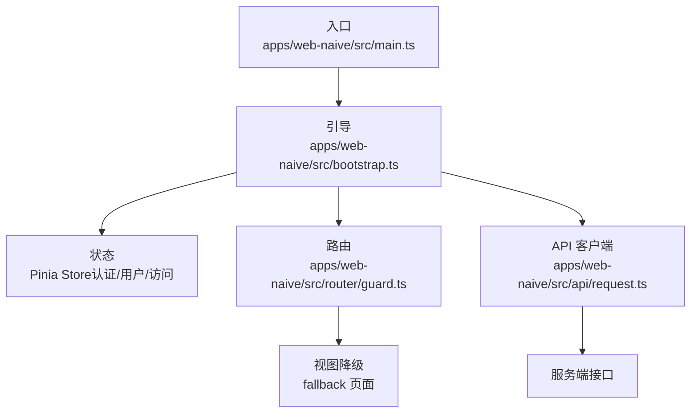
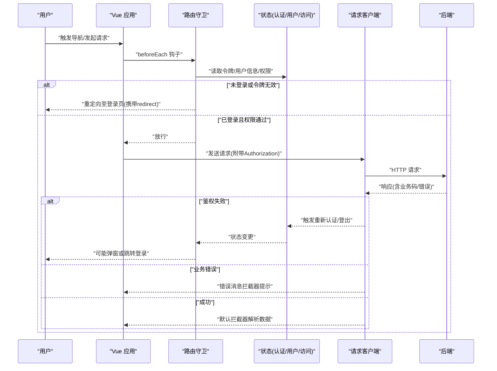
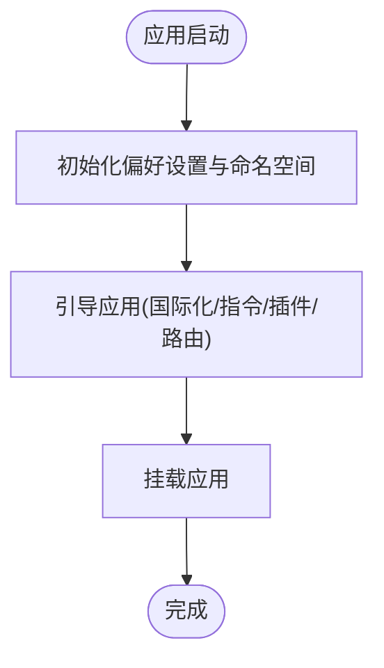
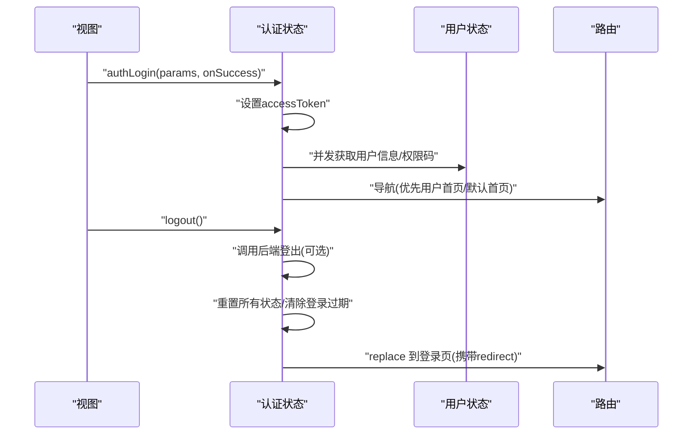
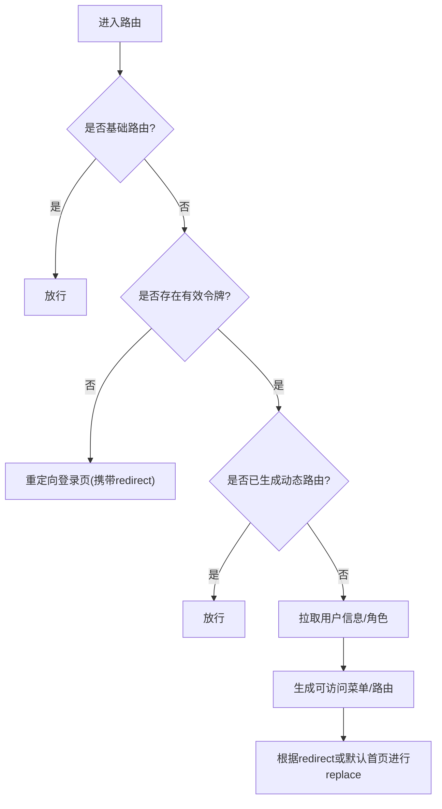
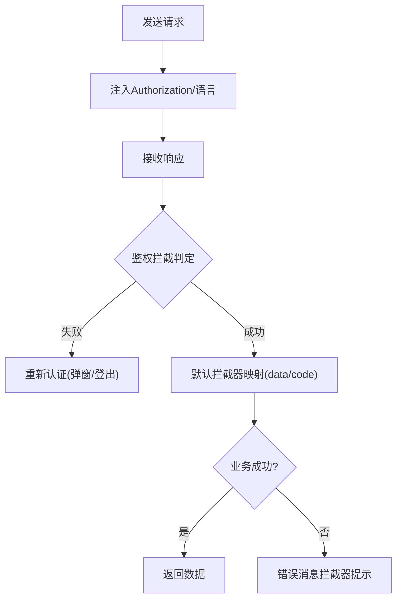
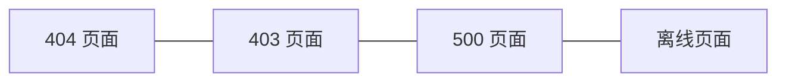
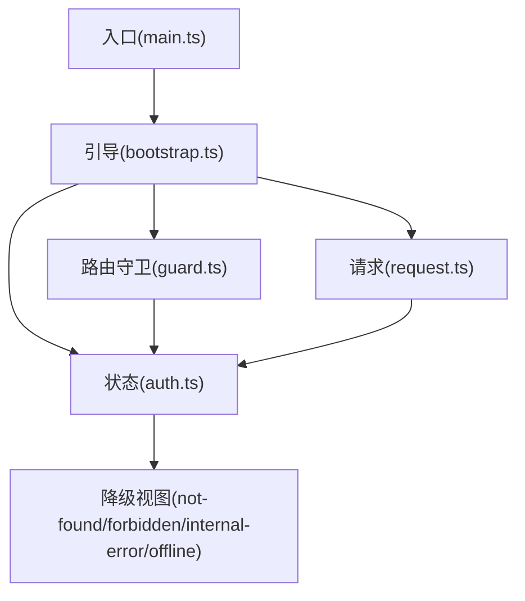

# 运行时错误

<cite>
**本文引用的文件**
- [apps/web-naive/src/main.ts](file://apps/web-naive/src/main.ts)
- [apps/web-naive/src/bootstrap.ts](file://apps/web-naive/src/bootstrap.ts)
- [apps/web-naive/src/api/request.ts](file://apps/web-naive/src/api/request.ts)
- [apps/web-naive/src/router/guard.ts](file://apps/web-naive/src/router/guard.ts)
- [apps/web-naive/src/store/auth.ts](file://apps/web-naive/src/store/auth.ts)
- [apps/web-naive/src/views/_core/fallback/not-found.vue](file://apps/web-naive/src/views/_core/fallback/not-found.vue)
- [apps/web-naive/src/views/_core/fallback/forbidden.vue](file://apps/web-naive/src/views/_core/fallback/forbidden.vue)
- [apps/web-naive/src/views/_core/fallback/internal-error.vue](file://apps/web-naive/src/views/_core/fallback/internal-error.vue)
- [apps/web-naive/src/views/_core/fallback/offline.vue](file://apps/web-naive/src/views/_core/fallback/offline.vue)
</cite>

## 目录

1. [简介](#简介)
2. [项目结构](#项目结构)
3. [核心组件](#核心组件)
4. [架构总览](#架构总览)
5. [详细组件分析](#详细组件分析)
6. [依赖关系分析](#依赖关系分析)
7. [性能与稳定性考量](#性能与稳定性考量)
8. [故障排查指南](#故障排查指南)
9. [结论](#结论)
10. [附录](#附录)

## 简介

本指南面向 shiyu-ui 项目的运行时错误排查，聚焦以下场景：

- 网络请求失败（含鉴权失败、服务端错误、离线）
- 认证状态异常（登录过期、令牌刷新、登出流程）
- 路由跳转错误（权限拦截、动态路由生成、重定向循环）
- 组件渲染问题（404/403/500/离线降级）

同时提供错误监控与日志记录最佳实践、浏览器开发者工具调试方法（断点、网络面板、控制台）、异步错误处理（Promise 拒绝、事件监听器）与常见错误的快速修复与预防建议。

## 项目结构

应用采用“入口初始化 → 应用引导 → 状态与路由 → API 请求 → 视图降级”的分层组织方式。关键路径如下：

- 入口：应用初始化与全局加载移除
- 引导：国际化、指令注册、插件安装、路由挂载、标题动态更新
- 状态：认证、用户、访问控制（权限与令牌）
- 路由：通用守卫与访问守卫（进度条、权限检查、动态路由生成）
- 请求：统一请求客户端、响应拦截器（鉴权、错误消息、默认数据结构）
- 视图：404/403/500/离线降级页面

图表来源

- [apps/web-naive/src/main.ts:1-32](file://apps/web-naive/src/main.ts#L1-L32)
- [apps/web-naive/src/bootstrap.ts:1-77](file://apps/web-naive/src/bootstrap.ts#L1-L77)
- [apps/web-naive/src/router/guard.ts:1-133](file://apps/web-naive/src/router/guard.ts#L1-L133)
- [apps/web-naive/src/api/request.ts:1-114](file://apps/web-naive/src/api/request.ts#L1-L114)
- [apps/web-naive/src/views/\_core/fallback/not-found.vue:1-10](file://apps/web-naive/src/views/_core/fallback/not-found.vue#L1-L10)
- [apps/web-naive/src/views/\_core/fallback/forbidden.vue:1-10](file://apps/web-naive/src/views/_core/fallback/forbidden.vue#L1-L10)
- [apps/web-naive/src/views/\_core/fallback/internal-error.vue:1-10](file://apps/web-naive/src/views/_core/fallback/internal-error.vue#L1-L10)
- [apps/web-naive/src/views/\_core/fallback/offline.vue:1-10](file://apps/web-naive/src/views/_core/fallback/offline.vue#L1-L10)

章节来源

- [apps/web-naive/src/main.ts:1-32](file://apps/web-naive/src/main.ts#L1-L32)
- [apps/web-naive/src/bootstrap.ts:1-77](file://apps/web-naive/src/bootstrap.ts#L1-L77)

## 核心组件

- 应用入口与初始化
  - 初始化偏好设置、命名空间、加载移除
  - 异步启动引导函数，挂载应用
- 应用引导
  - 组件适配器、表单适配器初始化
  - 国际化、权限指令、Motion 插件、标题动态更新
  - 路由安装、应用挂载
- 认证与用户状态
  - 登录（并发拉取用户信息与权限码）、登出（清理状态、可选调用后端接口）、获取用户信息
- 路由守卫
  - 通用守卫：进度条、已加载页面标记
  - 访问守卫：基础路由放行、令牌校验、动态路由生成、重定向回退
- 请求客户端
  - 请求头注入 Authorization 与语言
  - 默认响应拦截（业务码/数据字段映射）
  - 鉴权拦截（过期/无效令牌处理：弹窗或自动登出）
  - 错误消息拦截（兜底提示）
- 视图降级
  - 404、403、500、离线四种状态的统一降级展示

章节来源

- [apps/web-naive/src/main.ts:1-32](file://apps/web-naive/src/main.ts#L1-L32)
- [apps/web-naive/src/bootstrap.ts:19-77](file://apps/web-naive/src/bootstrap.ts#L19-L77)
- [apps/web-naive/src/store/auth.ts:16-119](file://apps/web-naive/src/store/auth.ts#L16-L119)
- [apps/web-naive/src/router/guard.ts:17-133](file://apps/web-naive/src/router/guard.ts#L17-L133)
- [apps/web-naive/src/api/request.ts:23-114](file://apps/web-naive/src/api/request.ts#L23-L114)
- [apps/web-naive/src/views/\_core/fallback/not-found.vue:1-10](file://apps/web-naive/src/views/_core/fallback/not-found.vue#L1-L10)
- [apps/web-naive/src/views/\_core/fallback/forbidden.vue:1-10](file://apps/web-naive/src/views/_core/fallback/forbidden.vue#L1-L10)
- [apps/web-naive/src/views/\_core/fallback/internal-error.vue:1-10](file://apps/web-naive/src/views/_core/fallback/internal-error.vue#L1-L10)
- [apps/web-naive/src/views/\_core/fallback/offline.vue:1-10](file://apps/web-naive/src/views/_core/fallback/offline.vue#L1-L10)

## 架构总览

下图展示从用户交互到服务端请求、鉴权与路由控制的整体流程，以及错误发生时的降级路径。

图表来源

- [apps/web-naive/src/router/guard.ts:47-119](file://apps/web-naive/src/router/guard.ts#L47-L119)
- [apps/web-naive/src/store/auth.ts:28-79](file://apps/web-naive/src/store/auth.ts#L28-L79)
- [apps/web-naive/src/api/request.ts:74-104](file://apps/web-naive/src/api/request.ts#L74-L104)

## 详细组件分析

### 组件一：应用入口与引导

- 入口负责初始化偏好设置与命名空间，随后异步引导应用并移除全局加载态。
- 引导阶段完成国际化、指令注册、插件安装、路由挂载与标题动态更新。
- 关键点：确保引导顺序正确、错误在引导阶段被上抛；避免在引导前使用尚未初始化的状态或路由。

图表来源

- [apps/web-naive/src/main.ts:9-29](file://apps/web-naive/src/main.ts#L9-L29)
- [apps/web-naive/src/bootstrap.ts:19-77](file://apps/web-naive/src/bootstrap.ts#L19-L77)

章节来源

- [apps/web-naive/src/main.ts:1-32](file://apps/web-naive/src/main.ts#L1-L32)
- [apps/web-naive/src/bootstrap.ts:1-77](file://apps/web-naive/src/bootstrap.ts#L1-L77)

### 组件二：认证与用户状态

- 登录：并发获取用户信息与权限码，成功后写入状态并导航；支持登录成功回调。
- 登出：可选调用后端接口，重置所有状态，标记登录过期，替换路由至登录页并附带当前路径。
- 获取用户信息：用于动态路由生成与权限计算。

图表来源

- [apps/web-naive/src/store/auth.ts:28-99](file://apps/web-naive/src/store/auth.ts#L28-L99)

章节来源

- [apps/web-naive/src/store/auth.ts:16-119](file://apps/web-naive/src/store/auth.ts#L16-L119)

### 组件三：路由守卫与权限控制

- 通用守卫：在首次访问时开启进度条，离开时关闭；记录已加载页面以避免重复动画。
- 访问守卫：
  - 基础路由直接放行；若已在登录页且已持有令牌则重定向至首页或用户首页。
  - 无令牌且未忽略权限时，重定向登录页并携带 redirect。
  - 已登录但未生成动态路由时，拉取用户信息与角色，生成可访问菜单与路由，并基于 redirect 或默认首页进行替换跳转。
- 注意事项：避免在守卫中阻塞主线程；确保 resolve 后的 replace 正确生效。

图表来源

- [apps/web-naive/src/router/guard.ts:47-119](file://apps/web-naive/src/router/guard.ts#L47-L119)

章节来源

- [apps/web-naive/src/router/guard.ts:17-133](file://apps/web-naive/src/router/guard.ts#L17-L133)

### 组件四：请求客户端与错误处理

- 请求头：自动附加 Authorization 与 Accept-Language。
- 默认响应拦截：按业务约定字段映射（code/data），仅在业务成功时透传数据。
- 鉴权拦截：检测令牌失效/过期，触发重新认证策略（弹窗或自动登出）。
- 错误消息拦截：兜底提示，优先使用服务端返回的错误字段。
- 刷新令牌：可选启用，成功后写入新令牌并重试。

图表来源

- [apps/web-naive/src/api/request.ts:63-104](file://apps/web-naive/src/api/request.ts#L63-L104)

章节来源

- [apps/web-naive/src/api/request.ts:1-114](file://apps/web-naive/src/api/request.ts#L1-L114)

### 组件五：视图降级（404/403/500/离线）

- 统一使用公共降级组件，按状态码或网络状态展示对应页面。
- 便于用户在异常情况下获得清晰反馈与返回路径。

图表来源

- [apps/web-naive/src/views/\_core/fallback/not-found.vue:1-10](file://apps/web-naive/src/views/_core/fallback/not-found.vue#L1-L10)
- [apps/web-naive/src/views/\_core/fallback/forbidden.vue:1-10](file://apps/web-naive/src/views/_core/fallback/forbidden.vue#L1-L10)
- [apps/web-naive/src/views/\_core/fallback/internal-error.vue:1-10](file://apps/web-naive/src/views/_core/fallback/internal-error.vue#L1-L10)
- [apps/web-naive/src/views/\_core/fallback/offline.vue:1-10](file://apps/web-naive/src/views/_core/fallback/offline.vue#L1-L10)

章节来源

- [apps/web-naive/src/views/\_core/fallback/not-found.vue:1-10](file://apps/web-naive/src/views/_core/fallback/not-found.vue#L1-L10)
- [apps/web-naive/src/views/\_core/fallback/forbidden.vue:1-10](file://apps/web-naive/src/views/_core/fallback/forbidden.vue#L1-L10)
- [apps/web-naive/src/views/\_core/fallback/internal-error.vue:1-10](file://apps/web-naive/src/views/_core/fallback/internal-error.vue#L1-L10)
- [apps/web-naive/src/views/\_core/fallback/offline.vue:1-10](file://apps/web-naive/src/views/_core/fallback/offline.vue#L1-L10)

## 依赖关系分析

- 入口依赖引导模块；引导模块依赖国际化、指令、插件、路由与状态初始化。
- 认证状态依赖路由与用户状态；路由守卫依赖认证/用户/访问状态与权限生成器。
- 请求客户端依赖鉴权拦截器与错误消息拦截器；拦截器依赖状态与消息组件。
- 视图降级依赖公共 UI 组件。

图表来源

- [apps/web-naive/src/main.ts:1-32](file://apps/web-naive/src/main.ts#L1-L32)
- [apps/web-naive/src/bootstrap.ts:1-77](file://apps/web-naive/src/bootstrap.ts#L1-L77)
- [apps/web-naive/src/router/guard.ts:1-133](file://apps/web-naive/src/router/guard.ts#L1-L133)
- [apps/web-naive/src/store/auth.ts:1-119](file://apps/web-naive/src/store/auth.ts#L1-L119)
- [apps/web-naive/src/api/request.ts:1-114](file://apps/web-naive/src/api/request.ts#L1-L114)
- [apps/web-naive/src/views/\_core/fallback/not-found.vue:1-10](file://apps/web-naive/src/views/_core/fallback/not-found.vue#L1-L10)
- [apps/web-naive/src/views/\_core/fallback/forbidden.vue:1-10](file://apps/web-naive/src/views/_core/fallback/forbidden.vue#L1-L10)
- [apps/web-naive/src/views/\_core/fallback/internal-error.vue:1-10](file://apps/web-naive/src/views/_core/fallback/internal-error.vue#L1-L10)
- [apps/web-naive/src/views/\_core/fallback/offline.vue:1-10](file://apps/web-naive/src/views/_core/fallback/offline.vue#L1-L10)

章节来源

- [apps/web-naive/src/main.ts:1-32](file://apps/web-naive/src/main.ts#L1-L32)
- [apps/web-naive/src/bootstrap.ts:1-77](file://apps/web-naive/src/bootstrap.ts#L1-L77)
- [apps/web-naive/src/router/guard.ts:1-133](file://apps/web-naive/src/router/guard.ts#L1-L133)
- [apps/web-naive/src/store/auth.ts:1-119](file://apps/web-naive/src/store/auth.ts#L1-L119)
- [apps/web-naive/src/api/request.ts:1-114](file://apps/web-naive/src/api/request.ts#L1-L114)

## 性能与稳定性考量

- 避免在守卫中执行耗时任务，必要时拆分为异步任务并在状态中缓存结果。
- 使用并发请求减少往返时间（如登录时并发获取用户信息与权限码）。
- 合理使用进度条与动画，避免重复渲染与闪烁。
- 对网络请求设置合理的超时与重试策略，结合鉴权拦截器处理令牌刷新。
- 在引导阶段捕获并上报异常，防止应用白屏。

## 故障排查指南

### 一、网络请求失败

- 症状
  - 控制台出现网络错误、跨域、证书问题
  - 业务接口返回非 200 或业务错误码
  - 令牌过期导致 401/403
- 排查步骤
  - 打开浏览器网络面板，确认请求头 Authorization 与 Accept-Language 是否正确
  - 查看响应体中的业务字段映射（code/data），定位错误来源
  - 若出现鉴权失败，检查鉴权拦截器是否触发重新认证或登出
  - 若为离线，检查降级页面是否正确渲染
- 快速修复
  - 校正 baseURL 与代理配置
  - 在鉴权拦截器中完善错误分支（如特定业务码提示）
  - 对关键接口增加重试与降级提示
- 预防措施
  - 统一封装请求拦截器与错误处理
  - 在开发环境开启严格 CORS 与证书校验日志

章节来源

- [apps/web-naive/src/api/request.ts:63-104](file://apps/web-naive/src/api/request.ts#L63-L104)
- [apps/web-naive/src/views/\_core/fallback/offline.vue:1-10](file://apps/web-naive/src/views/_core/fallback/offline.vue#L1-L10)

### 二、认证状态异常

- 症状
  - 登录后仍被重定向至登录页
  - 登录成功但用户信息未更新
  - 令牌过期后无法自动刷新
- 排查步骤
  - 检查登录流程是否并发获取用户信息与权限码
  - 确认状态写入顺序与导航时机
  - 观察鉴权拦截器是否正确触发重新认证或登出
  - 登出后确认状态是否完全重置
- 快速修复
  - 确保登录成功后写入 accessToken 并立即获取用户信息
  - 在鉴权拦截器中完善刷新令牌逻辑
  - 登出时清理所有状态并替换路由
- 预防措施
  - 在登录与登出流程中加入 finally/finally-like 逻辑，保证 UI 加载态恢复
  - 对并发请求增加容错与回退策略

章节来源

- [apps/web-naive/src/store/auth.ts:28-99](file://apps/web-naive/src/store/auth.ts#L28-L99)
- [apps/web-naive/src/api/request.ts:32-56](file://apps/web-naive/src/api/request.ts#L32-L56)

### 三、路由跳转错误

- 症状
  - 无限重定向或卡死在登录页
  - 动态路由未生成导致页面空白
  - 重定向路径异常（redirect 参数丢失）
- 排查步骤
  - 检查基础路由名单与 ignoreAccess 标记
  - 确认令牌存在后才尝试生成动态路由
  - 校验 resolve 后 replace 的目标路径
  - 查看 loadedPaths 与进度条状态是否一致
- 快速修复
  - 在守卫中对 redirect 进行解码与回退路径校验
  - 生成动态路由后统一设置 isAccessChecked
  - 避免在守卫中同步阻塞
- 预防措施
  - 将复杂逻辑拆分为独立函数并在守卫中只做决策
  - 对路由元信息进行类型约束与默认值处理

章节来源

- [apps/web-naive/src/router/guard.ts:47-119](file://apps/web-naive/src/router/guard.ts#L47-L119)

### 四、组件渲染问题

- 症状
  - 404/403/500/离线页面未正确显示
  - 标题未动态更新或更新异常
- 排查步骤
  - 确认降级页面组件是否正确引入与注册
  - 检查标题动态更新逻辑与路由 meta.title
- 快速修复
  - 使用统一降级组件并确保状态参数正确传递
  - 在引导阶段确保国际化与标题更新已初始化
- 预防措施
  - 在路由表中为每个页面设置 meta.title
  - 对标题更新逻辑进行边界条件测试

章节来源

- [apps/web-naive/src/views/\_core/fallback/not-found.vue:1-10](file://apps/web-naive/src/views/_core/fallback/not-found.vue#L1-L10)
- [apps/web-naive/src/views/\_core/fallback/forbidden.vue:1-10](file://apps/web-naive/src/views/_core/fallback/forbidden.vue#L1-L10)
- [apps/web-naive/src/views/\_core/fallback/internal-error.vue:1-10](file://apps/web-naive/src/views/_core/fallback/internal-error.vue#L1-L10)
- [apps/web-naive/src/views/\_core/fallback/offline.vue:1-10](file://apps/web-naive/src/views/_core/fallback/offline.vue#L1-L10)
- [apps/web-naive/src/bootstrap.ts:64-71](file://apps/web-naive/src/bootstrap.ts#L64-L71)

### 五、浏览器开发者工具调试

- 断点设置
  - 在入口与引导函数设置断点，观察初始化顺序与异常抛出位置
  - 在守卫 beforeEach/afterEach 设置断点，验证令牌与动态路由生成流程
  - 在登录与登出函数设置断点，跟踪状态写入与导航
- 网络面板
  - 查看请求头 Authorization 与 Accept-Language
  - 分析响应状态码与业务字段映射
  - 观察鉴权拦截器触发与错误消息拦截器提示
- 控制台错误分析
  - 关注 Promise 拒绝未捕获、路由解析失败、组件渲染异常
  - 结合源码定位错误发生的具体文件与行号

章节来源

- [apps/web-naive/src/main.ts:9-29](file://apps/web-naive/src/main.ts#L9-L29)
- [apps/web-naive/src/router/guard.ts:21-41](file://apps/web-naive/src/router/guard.ts#L21-L41)
- [apps/web-naive/src/store/auth.ts:34-74](file://apps/web-naive/src/store/auth.ts#L34-L74)
- [apps/web-naive/src/api/request.ts:63-104](file://apps/web-naive/src/api/request.ts#L63-L104)

### 六、异步操作错误处理

- Promise 拒绝
  - 在登录流程中对并发请求使用 Promise.all 并在 finally 中恢复加载态
  - 在守卫中对动态路由生成使用 try/catch 包裹，避免阻塞导航
- 事件监听器
  - 在组件卸载时移除事件监听器，避免内存泄漏
  - 对定时器与订阅在组件销毁钩子中清理

章节来源

- [apps/web-naive/src/store/auth.ts:44-74](file://apps/web-naive/src/store/auth.ts#L44-L74)
- [apps/web-naive/src/router/guard.ts:47-119](file://apps/web-naive/src/router/guard.ts#L47-L119)

### 七、错误监控与日志记录最佳实践

- 建议
  - 在请求拦截器与错误拦截器中统一记录错误上下文（URL、状态码、业务码、错误消息）
  - 在守卫与状态变更处记录关键事件（登录、登出、令牌刷新、动态路由生成）
  - 使用前端监控平台上报错误堆栈与用户行为轨迹
  - 对离线场景记录网络状态变化与降级页面曝光

## 结论

本指南围绕 shiyu-ui 的运行时错误场景，提供了从入口初始化、引导流程、认证状态、路由守卫、请求拦截到视图降级的全链路排查思路与修复建议。通过合理使用浏览器开发者工具、规范异步错误处理与建立完善的错误监控体系，可显著提升应用的稳定性与可维护性。

## 附录

- 常见错误清单与快速修复
  - 401/403：检查鉴权拦截器与令牌刷新逻辑
  - 404：确认路由与降级页面配置
  - 403：检查权限生成与 ignoreAccess 标记
  - 500：查看错误消息拦截器提示与后端日志
  - 离线：确认降级页面与网络面板状态
- 预防措施清单
  - 统一请求封装与拦截器策略
  - 在守卫中避免同步阻塞
  - 在组件生命周期中清理事件与定时器
  - 对关键流程增加日志与监控
