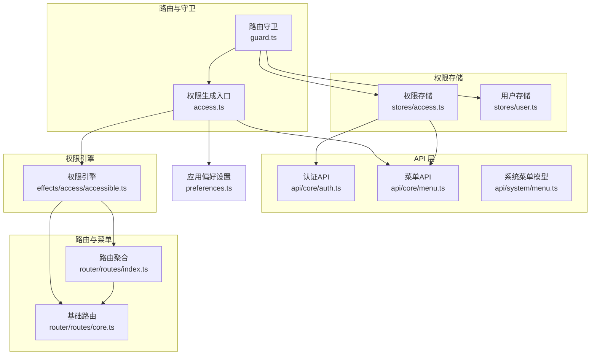
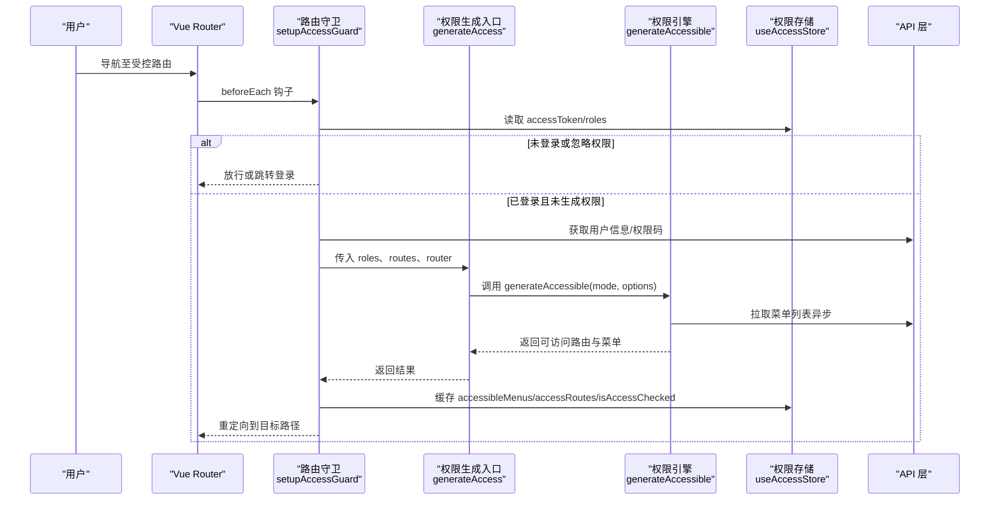
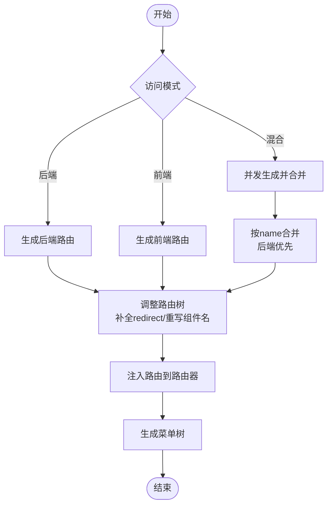
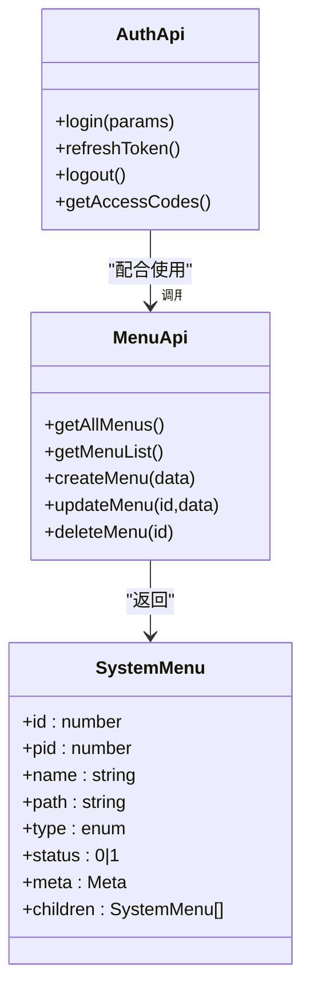
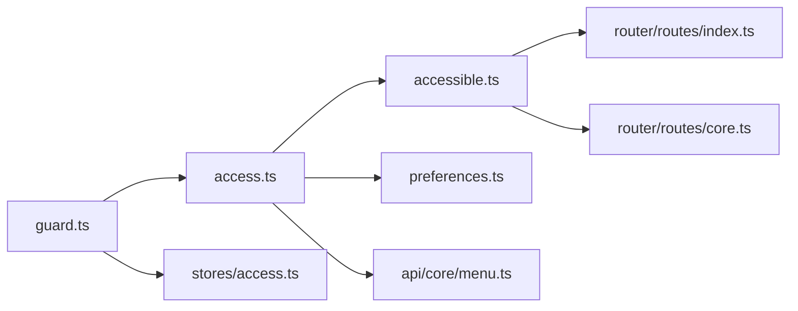

# 动态权限生成

<cite>
**本文引用的文件**
- [apps/web-naive/src/router/access.ts](file://apps/web-naive/src/router/access.ts)
- [apps/web-naive/src/router/guard.ts](file://apps/web-naive/src/router/guard.ts)
- [apps/web-naive/src/store/auth.ts](file://apps/web-naive/src/store/auth.ts)
- [apps/web-naive/src/api/core/auth.ts](file://apps/web-naive/src/api/core/auth.ts)
- [apps/web-naive/src/api/core/menu.ts](file://apps/web-naive/src/api/core/menu.ts)
- [apps/web-naive/src/api/system/menu.ts](file://apps/web-naive/src/api/system/menu.ts)
- [apps/web-naive/src/router/routes/index.ts](file://apps/web-naive/src/router/routes/index.ts)
- [apps/web-naive/src/router/routes/core.ts](file://apps/web-naive/src/router/routes/core.ts)
- [apps/web-naive/src/preferences.ts](file://apps/web-naive/src/preferences.ts)
- [packages/effects/access/src/accessible.ts](file://packages/effects/access/src/accessible.ts)
- [packages/stores/src/modules/access.ts](file://packages/stores/src/modules/access.ts)
</cite>

## 目录

1. [简介](#简介)
2. [项目结构](#项目结构)
3. [核心组件](#核心组件)
4. [架构总览](#架构总览)
5. [详细组件分析](#详细组件分析)
6. [依赖关系分析](#依赖关系分析)
7. [性能考虑](#性能考虑)
8. [故障排查指南](#故障排查指南)
9. [结论](#结论)
10. [附录](#附录)

## 简介

本文件系统性阐述 shiyu-ui 项目的“动态权限生成”能力，覆盖从权限数据获取、解析、应用到动态路由与菜单生成的完整流程。重点说明 generateAccess 函数的工作原理，包括角色信息处理、权限计算与路由过滤机制；解释权限数据来源与格式（后端接口返回与本地配置差异）；给出动态路由生成的技术实现（路由过滤、菜单生成、权限缓存策略）；并提供可配置项与自定义方法（白名单/黑名单、特殊权限处理），以及性能优化与错误处理建议。

## 项目结构

围绕动态权限生成的关键模块分布如下：

- 路由与守卫：负责在访问受控路由前触发权限生成流程
- 权限生成器：封装 generateAccess 与底层 generateAccessible 的调用
- 权限存储：持久化与管理访问令牌、权限码、可访问菜单与路由
- API 层：提供登录、刷新令牌、登出、获取用户信息、权限码、菜单等接口
- 路由与菜单模型：定义菜单结构、路由结构及元信息字段

图表来源

- [apps/web-naive/src/router/guard.ts:47-119](file://apps/web-naive/src/router/guard.ts#L47-L119)
- [apps/web-naive/src/router/access.ts:16-38](file://apps/web-naive/src/router/access.ts#L16-L38)
- [packages/effects/access/src/accessible.ts:21-73](file://packages/effects/access/src/accessible.ts#L21-L73)
- [apps/web-naive/src/router/routes/index.ts:1-38](file://apps/web-naive/src/router/routes/index.ts#L1-L38)
- [apps/web-naive/src/router/routes/core.ts:1-98](file://apps/web-naive/src/router/routes/core.ts#L1-L98)
- [apps/web-naive/src/preferences.ts:8-16](file://apps/web-naive/src/preferences.ts#L8-L16)
- [packages/stores/src/modules/access.ts:51-130](file://packages/stores/src/modules/access.ts#L51-L130)
- [apps/web-naive/src/api/core/auth.ts:24-51](file://apps/web-naive/src/api/core/auth.ts#L24-L51)
- [apps/web-naive/src/api/core/menu.ts:8-10](file://apps/web-naive/src/api/core/menu.ts#L8-L10)
- [apps/web-naive/src/api/system/menu.ts:25-92](file://apps/web-naive/src/api/system/menu.ts#L25-L92)

章节来源

- [apps/web-naive/src/router/guard.ts:1-133](file://apps/web-naive/src/router/guard.ts#L1-L133)
- [apps/web-naive/src/router/access.ts:1-41](file://apps/web-naive/src/router/access.ts#L1-L41)
- [packages/effects/access/src/accessible.ts:1-219](file://packages/effects/access/src/accessible.ts#L1-L219)
- [apps/web-naive/src/router/routes/index.ts:1-38](file://apps/web-naive/src/router/routes/index.ts#L1-L38)
- [apps/web-naive/src/router/routes/core.ts:1-98](file://apps/web-naive/src/router/routes/core.ts#L1-L98)
- [apps/web-naive/src/preferences.ts:1-17](file://apps/web-naive/src/preferences.ts#L1-L17)
- [packages/stores/src/modules/access.ts:1-130](file://packages/stores/src/modules/access.ts#L1-L130)
- [apps/web-naive/src/api/core/auth.ts:1-52](file://apps/web-naive/src/api/core/auth.ts#L1-L52)
- [apps/web-naive/src/api/core/menu.ts:1-11](file://apps/web-naive/src/api/core/menu.ts#L1-L11)
- [apps/web-naive/src/api/system/menu.ts:1-169](file://apps/web-naive/src/api/system/menu.ts#L1-L169)

## 核心组件

- 权限生成入口 generateAccess：封装页面与布局映射、菜单加载、无权限跳转组件等，统一调用权限引擎
- 权限引擎 generateAccessible：根据访问模式（后端/前端/混合）生成可访问路由与菜单，并注入到路由器
- 路由守卫 setupAccessGuard：在首次访问受控路由时，拉取用户信息与角色，触发权限生成并缓存结果
- 权限存储 useAccessStore：持久化访问令牌、权限码、可访问菜单与路由，标记“已检查权限”
- API 层：登录/刷新/登出、获取用户信息、权限码、菜单列表
- 路由与菜单模型：系统菜单接口定义、基础路由与动态路由聚合

章节来源

- [apps/web-naive/src/router/access.ts:16-38](file://apps/web-naive/src/router/access.ts#L16-L38)
- [packages/effects/access/src/accessible.ts:21-73](file://packages/effects/access/src/accessible.ts#L21-L73)
- [apps/web-naive/src/router/guard.ts:47-119](file://apps/web-naive/src/router/guard.ts#L47-L119)
- [packages/stores/src/modules/access.ts:51-130](file://packages/stores/src/modules/access.ts#L51-L130)
- [apps/web-naive/src/api/core/auth.ts:24-51](file://apps/web-naive/src/api/core/auth.ts#L24-L51)
- [apps/web-naive/src/api/core/menu.ts:8-10](file://apps/web-naive/src/api/core/menu.ts#L8-L10)
- [apps/web-naive/src/api/system/menu.ts:25-92](file://apps/web-naive/src/api/system/menu.ts#L25-L92)
- [apps/web-naive/src/router/routes/index.ts:1-38](file://apps/web-naive/src/router/routes/index.ts#L1-L38)
- [apps/web-naive/src/router/routes/core.ts:1-98](file://apps/web-naive/src/router/routes/core.ts#L1-L98)

## 架构总览

动态权限生成的端到端流程如下：

图表来源

- [apps/web-naive/src/router/guard.ts:47-119](file://apps/web-naive/src/router/guard.ts#L47-L119)
- [apps/web-naive/src/router/access.ts:16-38](file://apps/web-naive/src/router/access.ts#L16-L38)
- [packages/effects/access/src/accessible.ts:21-73](file://packages/effects/access/src/accessible.ts#L21-L73)
- [apps/web-naive/src/api/core/auth.ts:24-51](file://apps/web-naive/src/api/core/auth.ts#L24-L51)
- [apps/web-naive/src/api/core/menu.ts:8-10](file://apps/web-naive/src/api/core/menu.ts#L8-L10)
- [packages/stores/src/modules/access.ts:51-130](file://packages/stores/src/modules/access.ts#L51-L130)

## 详细组件分析

### 权限生成入口 generateAccess

- 角色与路由输入：接收 roles、router、routes 等参数
- 页面与布局映射：通过 import.meta.glob 收集视图组件，提供 layoutMap 以支持不同布局
- 菜单加载策略：通过 fetchMenuListAsync 异步获取菜单列表，期间展示加载提示
- 无权限处理：提供 forbiddenComponent 用于无权限时渲染
- 模式选择：结合应用偏好设置中的 accessMode（如 mixed）决定生成策略

章节来源

- [apps/web-naive/src/router/access.ts:16-38](file://apps/web-naive/src/router/access.ts#L16-L38)
- [apps/web-naive/src/preferences.ts:8-16](file://apps/web-naive/src/preferences.ts#L8-L16)

### 权限引擎 generateAccessible

- 路由生成模式：
  - 后端模式：基于后端返回的菜单树生成路由
  - 前端模式：基于前端路由与角色进行过滤与控制
  - 混合模式：并发生成前后端路由，按 name 合并，以后端为主
- 路由注入：将生成的路由挂载到根路由下，避免重复添加；对 keepAlive 场景重写懒加载组件名称以支持缓存
- 菜单生成：基于可访问路由生成菜单树
- 返回值：同时返回 accessibleMenus 与 accessibleRoutes，供上层存储与使用

图表来源

- [packages/effects/access/src/accessible.ts:80-157](file://packages/effects/access/src/accessible.ts#L80-L157)
- [packages/effects/access/src/accessible.ts:164-216](file://packages/effects/access/src/accessible.ts#L164-L216)

章节来源

- [packages/effects/access/src/accessible.ts:21-73](file://packages/effects/access/src/accessible.ts#L21-L73)
- [packages/effects/access/src/accessible.ts:80-157](file://packages/effects/access/src/accessible.ts#L80-L157)
- [packages/effects/access/src/accessible.ts:164-216](file://packages/effects/access/src/accessible.ts#L164-L216)

### 路由守卫 setupAccessGuard

- 基础路由放行：对 coreRouteNames 中的基础路由（如登录页）直接放行
- 登录态检查：若无 accessToken 且未声明忽略权限，则跳转登录页
- 首次访问生成：若尚未生成动态路由，拉取用户信息与角色，调用 generateAccess 完成生成与缓存
- 重定向逻辑：根据来源路由或默认首页计算重定向路径，确保登录后回到正确页面

章节来源

- [apps/web-naive/src/router/guard.ts:47-119](file://apps/web-naive/src/router/guard.ts#L47-L119)

### 权限存储 useAccessStore

- 数据结构：维护 accessCodes、accessMenus、accessRoutes、accessToken、isAccessChecked、loginExpired 等
- 持久化策略：仅持久化关键字段（如令牌、权限码、锁屏状态），避免持久化大对象
- 方法：提供设置与查询方法，便于在权限生成与菜单渲染中使用

章节来源

- [packages/stores/src/modules/access.ts:51-130](file://packages/stores/src/modules/access.ts#L51-L130)

### API 层与数据模型

- 登录/刷新/登出：提供登录接口、刷新令牌接口、登出接口
- 用户信息与权限码：获取用户信息、获取权限码
- 菜单列表：获取用户所有菜单（用于动态路由生成）

图表来源

- [apps/web-naive/src/api/core/auth.ts:24-51](file://apps/web-naive/src/api/core/auth.ts#L24-L51)
- [apps/web-naive/src/api/core/menu.ts:8-10](file://apps/web-naive/src/api/core/menu.ts#L8-L10)
- [apps/web-naive/src/api/system/menu.ts:25-92](file://apps/web-naive/src/api/system/menu.ts#L25-L92)

章节来源

- [apps/web-naive/src/api/core/auth.ts:1-52](file://apps/web-naive/src/api/core/auth.ts#L1-L52)
- [apps/web-naive/src/api/core/menu.ts:1-11](file://apps/web-naive/src/api/core/menu.ts#L1-L11)
- [apps/web-naive/src/api/system/menu.ts:1-169](file://apps/web-naive/src/api/system/menu.ts#L1-L169)

### 路由与菜单聚合

- 动态路由聚合：通过 import.meta.glob 收集 modules 下的路由模块，合并为 accessRoutes
- 基础路由：包含登录页、404兜底等，属于 coreRoutes
- 路由注入：权限引擎将生成的路由注入到根路由下，避免重复与冲突

章节来源

- [apps/web-naive/src/router/routes/index.ts:1-38](file://apps/web-naive/src/router/routes/index.ts#L1-L38)
- [apps/web-naive/src/router/routes/core.ts:1-98](file://apps/web-naive/src/router/routes/core.ts#L1-L98)

## 依赖关系分析

- 权限生成入口 generateAccess 依赖：
  - 应用偏好设置（accessMode）
  - 菜单 API（获取菜单列表）
  - 页面与布局映射（视图组件与布局组件）
- 权限引擎 generateAccessible 依赖：
  - 路由模式（后端/前端/混合）
  - 菜单生成工具与路由生成工具
  - Vue Router 实例
- 路由守卫依赖：
  - 权限存储（读取/写入）
  - 权限生成入口
  - 基础路由集合

图表来源

- [apps/web-naive/src/router/access.ts:16-38](file://apps/web-naive/src/router/access.ts#L16-L38)
- [packages/effects/access/src/accessible.ts:21-73](file://packages/effects/access/src/accessible.ts#L21-L73)
- [apps/web-naive/src/preferences.ts:8-16](file://apps/web-naive/src/preferences.ts#L8-L16)
- [apps/web-naive/src/api/core/menu.ts:8-10](file://apps/web-naive/src/api/core/menu.ts#L8-L10)
- [apps/web-naive/src/router/guard.ts:47-119](file://apps/web-naive/src/router/guard.ts#L47-L119)
- [packages/stores/src/modules/access.ts:51-130](file://packages/stores/src/modules/access.ts#L51-L130)
- [apps/web-naive/src/router/routes/index.ts:1-38](file://apps/web-naive/src/router/routes/index.ts#L1-L38)
- [apps/web-naive/src/router/routes/core.ts:1-98](file://apps/web-naive/src/router/routes/core.ts#L1-L98)

章节来源

- [apps/web-naive/src/router/access.ts:1-41](file://apps/web-naive/src/router/access.ts#L1-L41)
- [packages/effects/access/src/accessible.ts:1-219](file://packages/effects/access/src/accessible.ts#L1-L219)
- [apps/web-naive/src/router/guard.ts:1-133](file://apps/web-naive/src/router/guard.ts#L1-L133)
- [packages/stores/src/modules/access.ts:1-130](file://packages/stores/src/modules/access.ts#L1-L130)
- [apps/web-naive/src/router/routes/index.ts:1-38](file://apps/web-naive/src/router/routes/index.ts#L1-L38)
- [apps/web-naive/src/router/routes/core.ts:1-98](file://apps/web-naive/src/router/routes/core.ts#L1-L98)

## 性能考虑

- 并发请求：登录成功后并发获取用户信息与权限码，减少等待时间
- 路由生成并发：混合模式下前后端路由并行生成后再合并，提升生成效率
- keepAlive 组件命名：动态重写懒加载组件名称，确保缓存命中与正确更新
- 路由去重与更新：根据路由 name 判断是否已存在，避免重复添加与布局嵌套问题
- 菜单加载提示：在拉取菜单时显示加载提示，改善用户体验
- 持久化策略：仅持久化必要字段，降低存储开销与序列化成本

章节来源

- [apps/web-naive/src/store/auth.ts:44-47](file://apps/web-naive/src/store/auth.ts#L44-L47)
- [packages/effects/access/src/accessible.ts:101-108](file://packages/effects/access/src/accessible.ts#L101-L108)
- [packages/effects/access/src/accessible.ts:129-138](file://packages/effects/access/src/accessible.ts#L129-L138)
- [packages/stores/src/modules/access.ts:102-111](file://packages/stores/src/modules/access.ts#L102-L111)

## 故障排查指南

- 无权限跳转 403
  - 现象：访问受限路由时被重定向到 403 页面
  - 排查：确认 forbiddenComponent 是否正确配置；检查路由 meta 中的 menuVisibleWithForbidden 设置
- 登录后无法回到原页面
  - 现象：登录成功后跳转默认首页而非原目标页
  - 排查：确认守卫中 redirect 计算逻辑；检查用户 homePath 与默认首页配置
- 路由重复或布局嵌套异常
  - 现象：出现多层基础布局或路由重复
  - 排查：确认权限引擎对子路由存在时删除顶层 component 的逻辑；检查路由 name 唯一性
- 菜单加载缓慢或失败
  - 现象：菜单加载耗时长或报错
  - 排查：检查菜单 API 返回结构与网络状况；确认 fetchMenuListAsync 的实现与错误处理
- 权限缓存未生效
  - 现象：切换用户后权限未更新
  - 排查：确认 isAccessChecked 标记与权限存储的 setAccessRoutes/setAccessMenus 是否正确更新

章节来源

- [apps/web-naive/src/router/access.ts:32-37](file://apps/web-naive/src/router/access.ts#L32-L37)
- [apps/web-naive/src/router/guard.ts:109-117](file://apps/web-naive/src/router/guard.ts#L109-L117)
- [packages/effects/access/src/accessible.ts:42-59](file://packages/effects/access/src/accessible.ts#L42-L59)
- [apps/web-naive/src/api/core/menu.ts:8-10](file://apps/web-naive/src/api/core/menu.ts#L8-L10)
- [packages/stores/src/modules/access.ts:88-90](file://packages/stores/src/modules/access.ts#L88-L90)

## 结论

本项目通过“路由守卫 + 权限生成入口 + 权限引擎”的分层设计，实现了灵活高效的动态权限生成与应用。generateAccess 与 generateAccessible 协作完成菜单与路由的生成与注入，配合权限存储与 API 层，形成闭环。混合模式兼顾灵活性与一致性，keepAlive 组件命名与路由去重策略提升了可用性与性能。建议在实际部署中结合业务场景合理配置 accessMode、菜单加载策略与权限缓存策略，以获得最佳体验。

## 附录

### 权限数据来源与格式

- 后端接口返回的菜单结构包含：菜单 ID、父级 ID、名称、路径、类型、状态、元信息（图标、徽标、缓存、重定向等）、子菜单等
- 权限码为字符串数组，用于前端权限过滤与按钮级控制
- 用户信息包含角色与主页路径等，用于生成动态路由与重定向

章节来源

- [apps/web-naive/src/api/system/menu.ts:25-92](file://apps/web-naive/src/api/system/menu.ts#L25-L92)
- [apps/web-naive/src/api/core/auth.ts:49-51](file://apps/web-naive/src/api/core/auth.ts#L49-L51)
- [apps/web-naive/src/api/core/user.ts:8-10](file://apps/web-naive/src/api/core/user.ts#L8-L10)

### 动态路由生成技术实现

- 路由过滤：根据角色与后端返回的权限标识进行过滤
- 菜单生成：基于可访问路由生成菜单树，支持徽标、图标、隐藏等元信息
- 权限缓存：将可访问路由与菜单写入权限存储，标记已检查，避免重复生成

章节来源

- [packages/effects/access/src/accessible.ts:69-72](file://packages/effects/access/src/accessible.ts#L69-L72)
- [packages/stores/src/modules/access.ts:79-84](file://packages/stores/src/modules/access.ts#L79-L84)
- [apps/web-naive/src/router/guard.ts:106-108](file://apps/web-naive/src/router/guard.ts#L106-L108)

### 配置选项与自定义方法

- 访问模式：通过应用偏好设置中的 accessMode 控制（后端/前端/混合）
- 白名单/黑名单：可通过路由 meta 的 ignoreAccess 字段实现忽略权限检查
- 特殊权限处理：通过 forbiddenComponent 自定义无权限时的渲染组件
- 菜单可见性：通过 meta 中的 hideInMenu、hideChildrenInMenu 等字段控制菜单显示

章节来源

- [apps/web-naive/src/preferences.ts:8-16](file://apps/web-naive/src/preferences.ts#L8-L16)
- [apps/web-naive/src/router/guard.ts:68-70](file://apps/web-naive/src/router/guard.ts#L68-L70)
- [apps/web-naive/src/router/access.ts:32-37](file://apps/web-naive/src/router/access.ts#L32-L37)
- [apps/web-naive/src/api/system/menu.ts:36-92](file://apps/web-naive/src/api/system/menu.ts#L36-L92)
