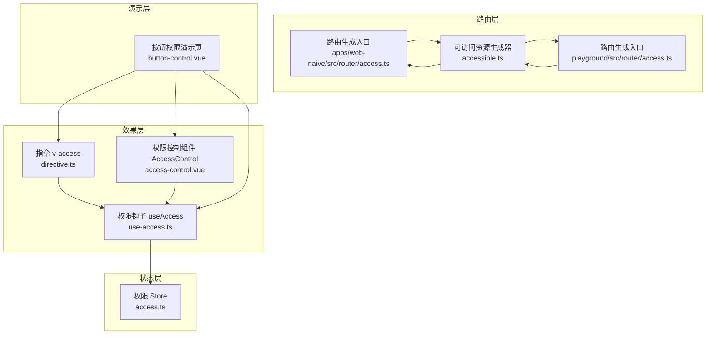
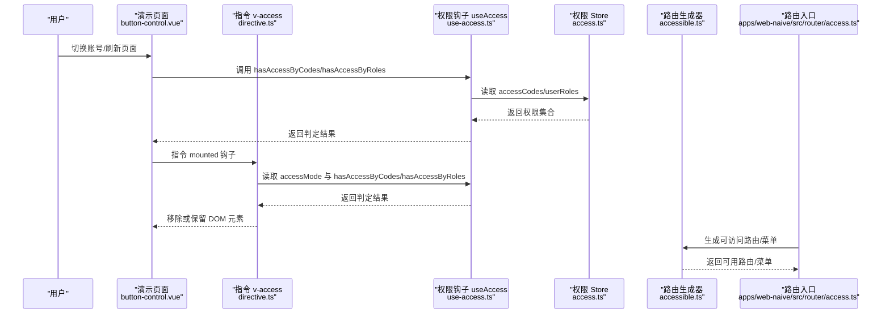
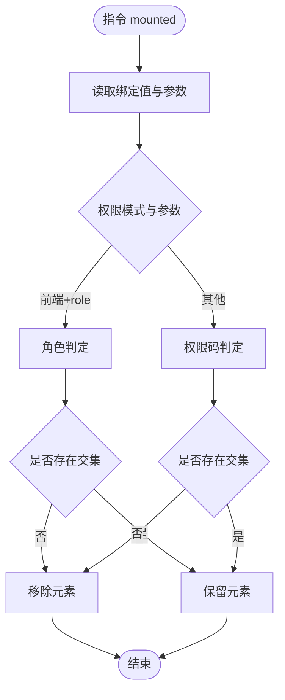
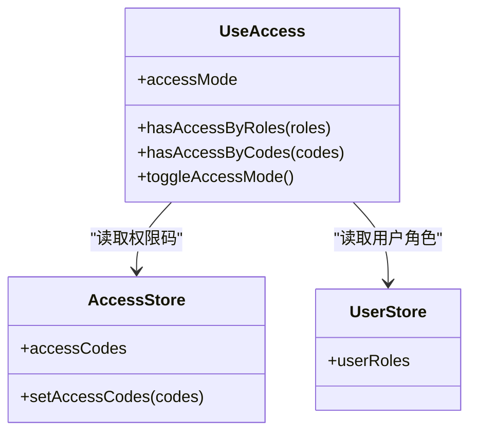
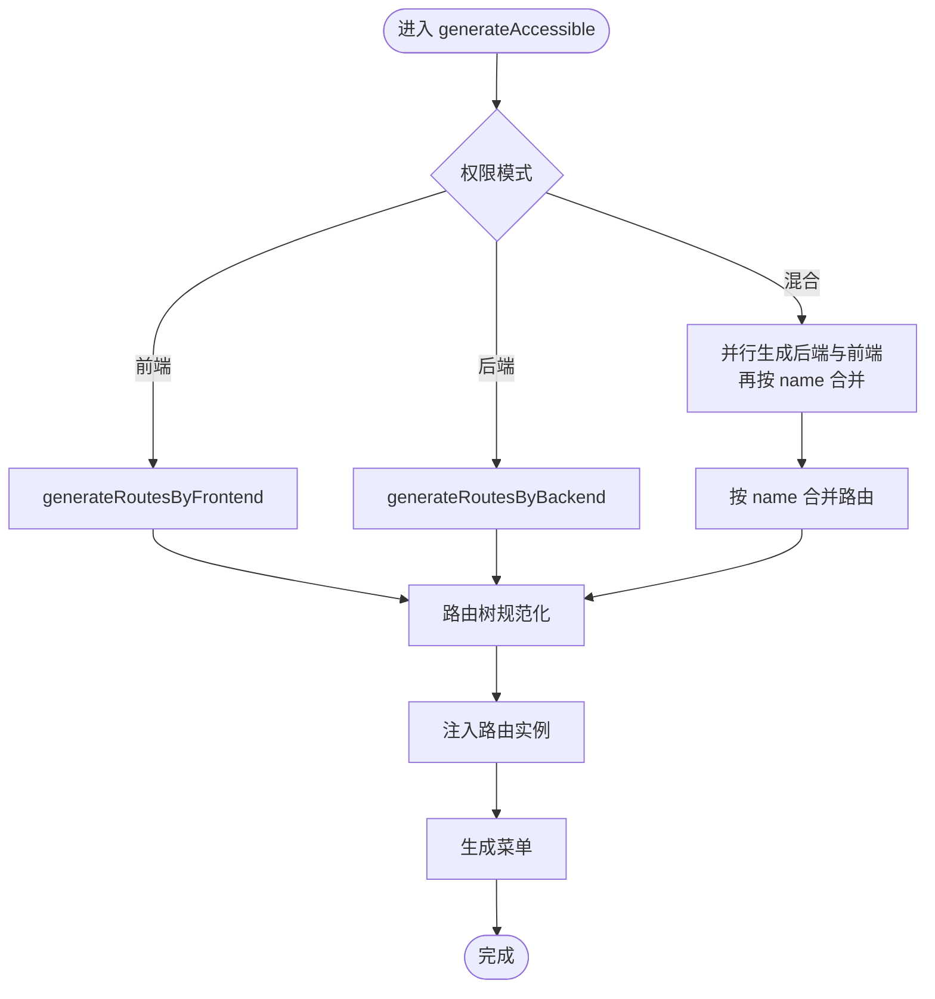
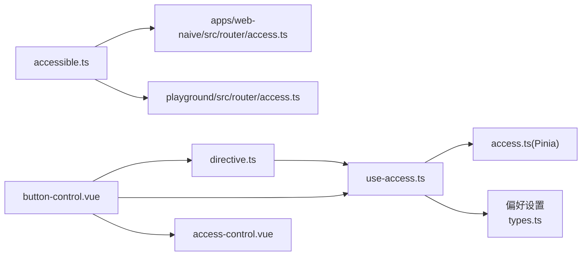

# 按钮权限控制

<cite>
**本文引用的文件**
- [directive.ts](file://packages/effects/access/src/directive.ts)
- [use-access.ts](file://packages/effects/access/src/use-access.ts)
- [access-control.vue](file://packages/effects/access/src/access-control.vue)
- [accessible.ts](file://packages/effects/access/src/accessible.ts)
- [access.ts](file://packages/stores/src/modules/access.ts)
- [access.ts](file://apps/web-naive/src/router/access.ts)
- [access.ts](file://playground/src/router/access.ts)
- [button-control.vue](file://playground/src/views/demos/access/button-control.vue)
- [types.ts](file://packages/@core/preferences/src/types.ts)
- [index.ts](file://packages/effects/access/src/index.ts)
</cite>

## 目录

1. [简介](#简介)
2. [项目结构](#项目结构)
3. [核心组件](#核心组件)
4. [架构总览](#架构总览)
5. [详细组件分析](#详细组件分析)
6. [依赖关系分析](#依赖关系分析)
7. [性能考量](#性能考量)
8. [故障排查指南](#故障排查指南)
9. [结论](#结论)
10. [附录](#附录)

## 简介

本文件围绕 shiyu-ui 的按钮权限控制能力，系统性阐述权限指令 v-access 的设计与实现，覆盖权限码与角色两种判定维度、权限模式（前端/后端/混合）对指令行为的影响、权限变更监听与组件更新机制、以及最佳实践与扩展方法。读者可据此在业务中安全、稳定地实现按钮级细粒度权限控制。

## 项目结构

按钮权限控制涉及“权限指令”“权限组合逻辑”“权限存储”“路由/菜单生成”“偏好设置”等多个模块，整体按“效果层-状态层-路由层-演示层”组织：

- 效果层：权限指令与权限控制组件
- 状态层：权限码集合、用户角色等状态管理
- 路由层：根据权限模式生成可访问路由/菜单
- 演示层：按钮权限控制示例页面

图表来源

- [directive.ts:1-42](file://packages/effects/access/src/directive.ts#L1-L42)
- [access-control.vue:1-48](file://packages/effects/access/src/access-control.vue#L1-L48)
- [use-access.ts:1-54](file://packages/effects/access/src/use-access.ts#L1-L54)
- [access.ts:1-130](file://packages/stores/src/modules/access.ts#L1-L130)
- [access.ts:1-41](file://apps/web-naive/src/router/access.ts#L1-L41)
- [access.ts:1-43](file://playground/src/router/access.ts#L1-L43)
- [accessible.ts:1-219](file://packages/effects/access/src/accessible.ts#L1-L219)
- [button-control.vue:1-158](file://playground/src/views/demos/access/button-control.vue#L1-L158)

章节来源

- [directive.ts:1-42](file://packages/effects/access/src/directive.ts#L1-L42)
- [access-control.vue:1-48](file://packages/effects/access/src/access-control.vue#L1-L48)
- [use-access.ts:1-54](file://packages/effects/access/src/use-access.ts#L1-L54)
- [access.ts:1-130](file://packages/stores/src/modules/access.ts#L1-L130)
- [access.ts:1-41](file://apps/web-naive/src/router/access.ts#L1-L41)
- [access.ts:1-43](file://playground/src/router/access.ts#L1-L43)
- [accessible.ts:1-219](file://packages/effects/access/src/accessible.ts#L1-L219)
- [button-control.vue:1-158](file://playground/src/views/demos/access/button-control.vue#L1-L158)

## 核心组件

- 权限指令 v-access：在 DOM 挂载时根据绑定值与权限模式进行判定，决定元素是否移除。
- 权限控制组件 AccessControl：以组件形式包裹目标按钮，根据属性 type 与 codes 决定是否渲染。
- 权限钩子 useAccess：封装权限模式、角色/权限码判断、模式切换等能力。
- 权限 Store：维护 accessCodes、accessMenus、accessRoutes 等权限相关状态。
- 路由生成器 generateAccessible：依据权限模式生成可访问路由/菜单。
- 演示页面 button-control.vue：展示三种控制方式（组件、函数、指令）及权限模式切换。

章节来源

- [directive.ts:1-42](file://packages/effects/access/src/directive.ts#L1-L42)
- [access-control.vue:1-48](file://packages/effects/access/src/access-control.vue#L1-L48)
- [use-access.ts:1-54](file://packages/effects/access/src/use-access.ts#L1-L54)
- [access.ts:1-130](file://packages/stores/src/modules/access.ts#L1-L130)
- [accessible.ts:1-219](file://packages/effects/access/src/accessible.ts#L1-L219)
- [button-control.vue:1-158](file://playground/src/views/demos/access/button-control.vue#L1-L158)

## 架构总览

下图展示了从“用户登录/切换角色”到“按钮可见性”的完整链路，包括权限模式对指令行为的影响、权限码与角色的判定路径、以及路由/菜单生成对整体权限体系的作用。

图表来源

- [button-control.vue:1-158](file://playground/src/views/demos/access/button-control.vue#L1-L158)
- [directive.ts:1-42](file://packages/effects/access/src/directive.ts#L1-L42)
- [use-access.ts:1-54](file://packages/effects/access/src/use-access.ts#L1-L54)
- [access.ts:1-130](file://packages/stores/src/modules/access.ts#L1-L130)
- [accessible.ts:1-219](file://packages/effects/access/src/accessible.ts#L1-L219)
- [access.ts:1-41](file://apps/web-naive/src/router/access.ts#L1-L41)

## 详细组件分析

### 权限指令 v-access

- 工作原理
  - 在 mounted 阶段读取绑定值与参数（arg），结合权限模式选择角色或权限码判定方法。
  - 若判定失败，直接移除该 DOM 元素，避免渲染无权限按钮。
- 使用方法
  - v-access:code="[权限码数组]" 或 v-access:code="单个权限码"
  - v-access:role="[角色数组]" 或 v-access:role="单个角色"
  - 当 accessMode 为前端模式且 arg=role 时，指令会走角色判定；否则走权限码判定。
- 关键点
  - 绑定值支持字符串或字符串数组，内部统一转换为数组处理。
  - 判定采用“存在交集即通过”的策略，满足任一即可见。

图表来源

- [directive.ts:11-30](file://packages/effects/access/src/directive.ts#L11-L30)

章节来源

- [directive.ts:1-42](file://packages/effects/access/src/directive.ts#L1-L42)

### 权限控制组件 AccessControl

- 设计要点
  - 通过 type='role'|'code' 与 codes 属性控制渲染。
  - 内部基于 useAccess 的判定逻辑，computed 化以响应权限变更。
- 使用建议
  - 适合在复杂按钮组或需要复用权限判断逻辑的场景使用。
  - 可与指令 v-access 并行对比使用，便于迁移与验证。

章节来源

- [access-control.vue:1-48](file://packages/effects/access/src/access-control.vue#L1-L48)

### 权限钩子 useAccess

- 能力概览
  - 提供 accessMode（来自偏好设置）、hasAccessByRoles、hasAccessByCodes、toggleAccessMode。
  - 基于 Pinia 用户与权限 Store 进行判定。
- 判定逻辑
  - 角色判定：将用户角色集合与传入角色数组求交集，非空即通过。
  - 权限码判定：将用户权限码集合与传入权限码数组求交集，非空即通过。
- 权限模式
  - 通过 preferences.app.accessMode 控制指令行为（前端/后端/混合）。

图表来源

- [use-access.ts:1-54](file://packages/effects/access/src/use-access.ts#L1-L54)
- [access.ts:1-130](file://packages/stores/src/modules/access.ts#L1-L130)

章节来源

- [use-access.ts:1-54](file://packages/effects/access/src/use-access.ts#L1-L54)
- [access.ts:1-130](file://packages/stores/src/modules/access.ts#L1-L130)

### 权限模式与路由/菜单生成

- 权限模式
  - 前端模式：基于前端角色/权限码生成可访问路由/菜单。
  - 后端模式：由后端下发路由/菜单。
  - 混合模式：前后端结果合并，后端为主。
- 路由生成流程
  - 调用 generateAccessible，根据模式选择前端/后端/混合生成策略。
  - 生成后对路由树进行规范化处理（如 keep-alive 名称包装、redirect 补全等）。
  - 将结果注入路由实例并生成菜单。

图表来源

- [accessible.ts:80-157](file://packages/effects/access/src/accessible.ts#L80-L157)
- [accessible.ts:164-216](file://packages/effects/access/src/accessible.ts#L164-L216)

章节来源

- [accessible.ts:1-219](file://packages/effects/access/src/accessible.ts#L1-L219)
- [access.ts:1-41](file://apps/web-naive/src/router/access.ts#L1-L41)
- [access.ts:1-43](file://playground/src/router/access.ts#L1-L43)

### 按钮权限与组件生命周期

- 指令生命周期
  - mounted：执行一次权限判定，必要时移除 DOM。
- 权限变更监听与更新
  - 通过 useAccess 返回的 hasAccessByCodes/hasAccessByRoles 是基于响应式数据的，当权限码或用户角色变化时，依赖该判定的组件/指令会自动更新。
- 页面切换与刷新
  - 演示页通过重新登录与刷新触发权限状态重置与重新拉取，确保按钮可见性与实际权限一致。

章节来源

- [directive.ts:32-38](file://packages/effects/access/src/directive.ts#L32-L38)
- [button-control.vue:38-50](file://playground/src/views/demos/access/button-control.vue#L38-L50)

### 权限指令配置选项与优先级

- 参数与绑定
  - v-access:code 或 v-access:role，绑定值支持字符串或字符串数组。
- 权限模式与优先级
  - 当 accessMode 为前端模式且参数为 role 时，优先使用角色判定；否则使用权限码判定。
  - 两种判定均采用“存在交集即通过”的策略，满足任一即可见。
- 合并策略
  - 指令内部将单值统一为数组，再与用户集合求交集，无需额外的“与/或”策略配置。

章节来源

- [directive.ts:11-30](file://packages/effects/access/src/directive.ts#L11-L30)
- [use-access.ts:18-34](file://packages/effects/access/src/use-access.ts#L18-L34)

### 演示与使用示例

- 演示页面展示了三种控制方式：
  - 组件形式：AccessControl 包裹按钮，通过 type 与 codes 控制。
  - 函数形式：直接调用 hasAccessByCodes 判断。
  - 指令形式：v-access:code/v-access:role 直接作用于按钮。
- 权限模式切换
  - 通过 useAccess.toggleAccessMode 可在前端/后端模式间切换，指令行为随之改变。

章节来源

- [button-control.vue:53-157](file://playground/src/views/demos/access/button-control.vue#L53-L157)
- [use-access.ts:36-43](file://packages/effects/access/src/use-access.ts#L36-L43)

## 依赖关系分析

- 指令依赖 useAccess，useAccess 依赖权限 Store 与用户 Store。
- 路由层依赖 generateAccessible，后者根据权限模式选择不同生成策略。
- 演示页面同时使用指令、组件与函数三种方式，形成对照验证。

图表来源

- [directive.ts:1-42](file://packages/effects/access/src/directive.ts#L1-L42)
- [use-access.ts:1-54](file://packages/effects/access/src/use-access.ts#L1-L54)
- [access.ts:1-130](file://packages/stores/src/modules/access.ts#L1-L130)
- [types.ts:99-168](file://packages/@core/preferences/src/types.ts#L99-L168)
- [accessible.ts:1-219](file://packages/effects/access/src/accessible.ts#L1-L219)
- [access.ts:1-41](file://apps/web-naive/src/router/access.ts#L1-L41)
- [access.ts:1-43](file://playground/src/router/access.ts#L1-L43)
- [button-control.vue:1-158](file://playground/src/views/demos/access/button-control.vue#L1-L158)
- [access-control.vue:1-48](file://packages/effects/access/src/access-control.vue#L1-L48)

章节来源

- [index.ts:1-4](file://packages/effects/access/src/index.ts#L1-L4)

## 性能考量

- 判定复杂度
  - 角色/权限码判定均为集合求交集，时间复杂度 O(n+m)，n 为用户集合大小，m 为传入集合大小。
- 渲染开销
  - 指令在 mounted 时一次性判定并移除不可见元素，避免后续重复计算。
- 存储与持久化
  - 权限码与令牌等状态具备持久化配置，减少频繁拉取带来的性能损耗。
- 路由生成
  - 混合模式下并行生成前后端路由，再按 name 合并，兼顾一致性与性能。

[本节为通用性能讨论，不直接分析具体文件]

## 故障排查指南

- 按钮始终不可见
  - 检查权限模式与指令参数是否匹配（前端模式+role 参数才会走角色判定）。
  - 确认权限码/角色集合是否正确写入权限 Store。
- 权限变更后按钮未更新
  - 确保权限变更后依赖响应式的数据源被重新计算（如 hasAccessByCodes/hasAccessByRoles）。
- 路由/菜单异常
  - 检查 generateAccessible 的模式选择与合并策略，确认路由树规范化步骤未遗漏。
- 演示页无法切换账号
  - 确认演示页的登录与刷新逻辑是否正确执行，确保权限状态被重置并重新拉取。

章节来源

- [directive.ts:11-30](file://packages/effects/access/src/directive.ts#L11-L30)
- [use-access.ts:18-34](file://packages/effects/access/src/use-access.ts#L18-L34)
- [accessible.ts:80-157](file://packages/effects/access/src/accessible.ts#L80-L157)
- [button-control.vue:38-50](file://playground/src/views/demos/access/button-control.vue#L38-L50)

## 结论

v-access 指令与 AccessControl 组件提供了简洁高效的按钮级权限控制方案。通过 useAccess 的统一判定与权限 Store 的状态管理，配合灵活的权限模式与路由生成策略，可在前端快速实现细粒度的按钮可见性控制。建议在实际项目中结合演示页的多种使用方式，按需选择指令、组件或函数形式，并遵循权限码命名规范与粒度划分原则，持续优化用户体验与安全性。

[本节为总结性内容，不直接分析具体文件]

## 附录

### 最佳实践

- 权限码命名规范
  - 建议采用“模块*功能*操作”的层级命名，例如“system_user_create”，便于检索与维护。
- 权限粒度划分
  - 将“查询/新增/编辑/删除”等操作拆分为独立权限码，避免“超级权限”导致的风险。
- 用户体验优化
  - 对关键按钮提供明确的提示或引导，避免用户误以为功能缺失。
  - 在权限不足时，考虑提供替代方案或跳转至说明页面。

### 扩展与自定义

- 自定义权限判断
  - 可在 useAccess 中扩展更多判定方法（如“与/或”组合、权重排序），并在组件/指令中按需调用。
- 权限模式扩展
  - 可在 generateAccessible 中增加新的模式分支，或调整合并策略以适配更复杂的业务需求。
- 指令增强
  - 可在 directive 中增加更多参数（如“与/或”策略、占位符渲染等），提升灵活性。

[本节为通用指导，不直接分析具体文件]
