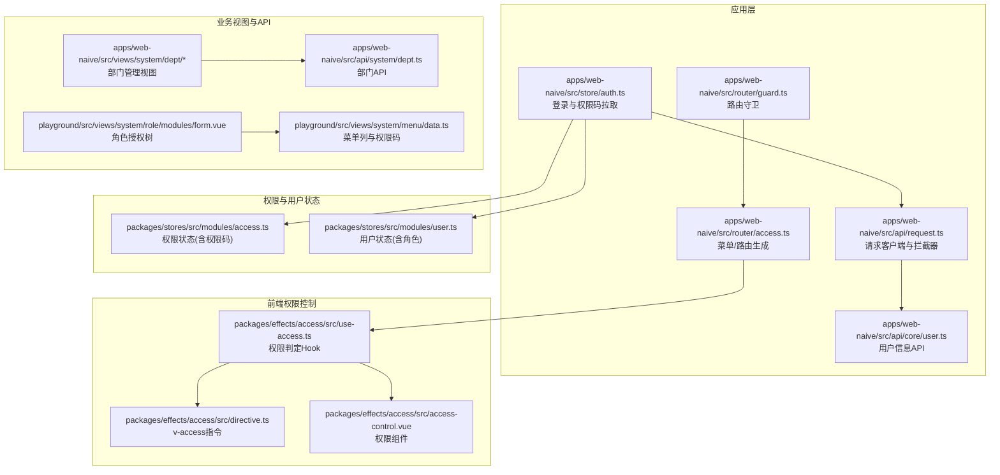
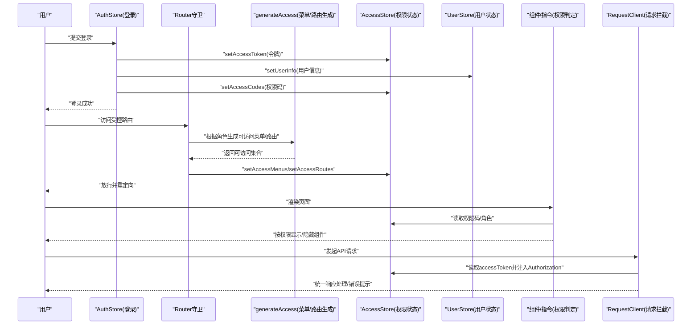
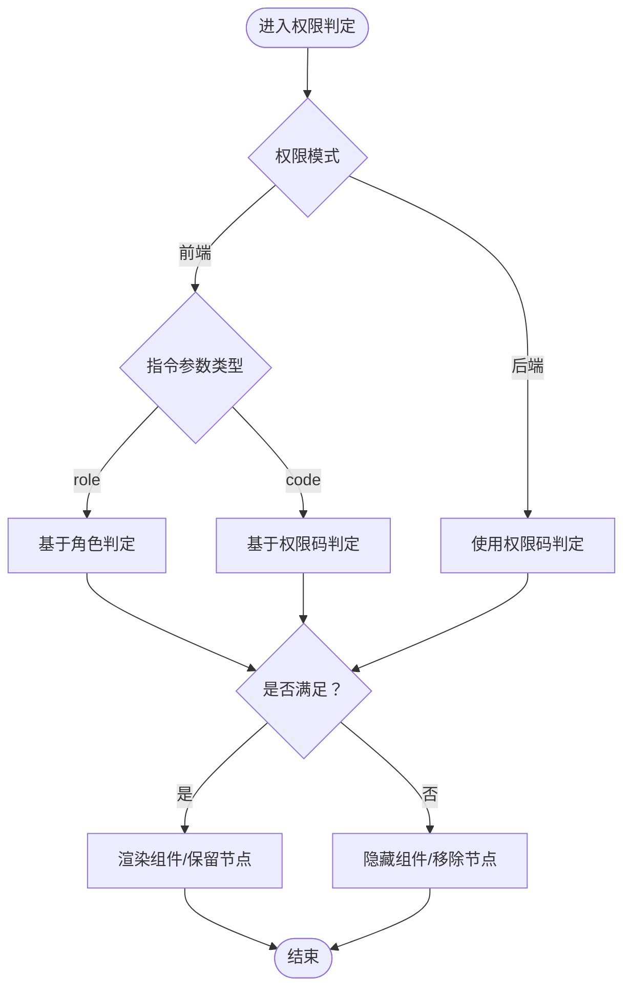
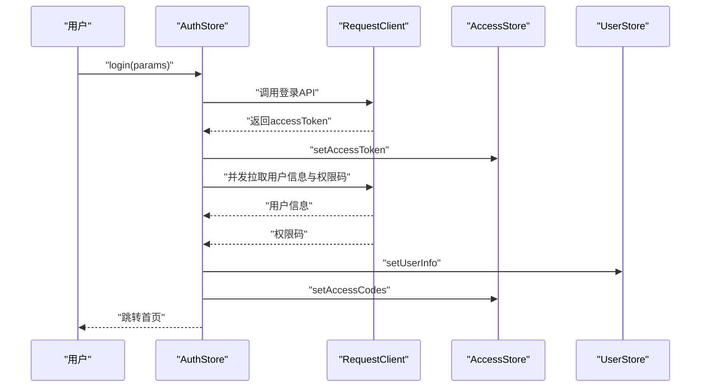
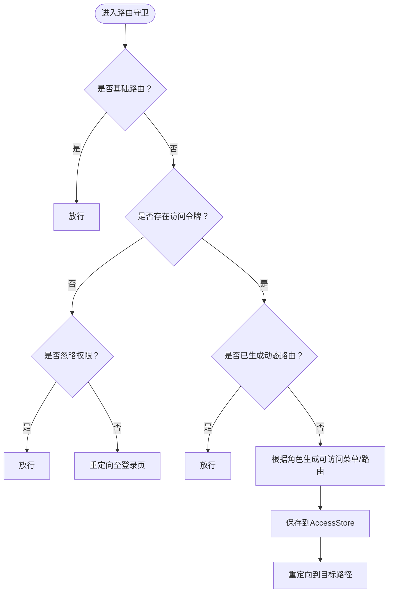
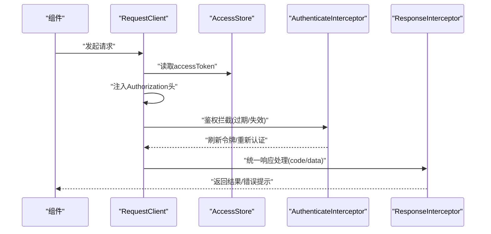
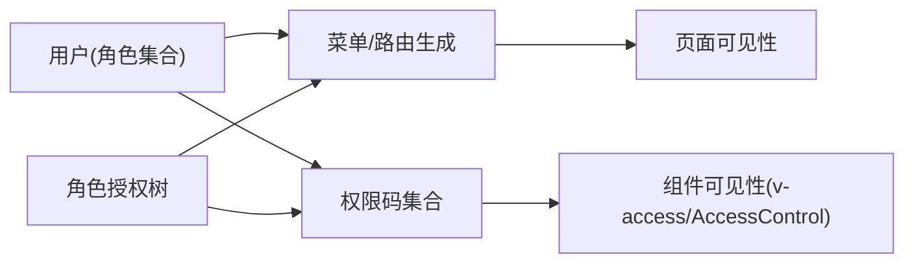
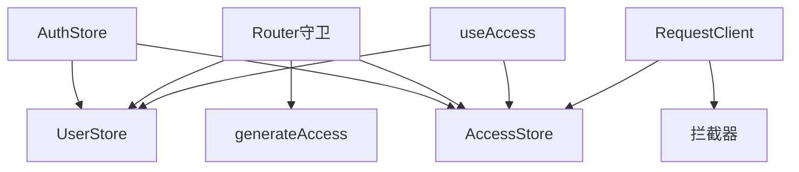

# 数据权限控制

<cite>
**本文引用的文件**
- [apps/web-naive/src/store/auth.ts](file://apps/web-naive/src/store/auth.ts)
- [packages/stores/src/modules/access.ts](file://packages/stores/src/modules/access.ts)
- [packages/stores/src/modules/user.ts](file://packages/stores/src/modules/user.ts)
- [apps/web-naive/src/router/guard.ts](file://apps/web-naive/src/router/guard.ts)
- [apps/web-naive/src/router/access.ts](file://apps/web-naive/src/router/access.ts)
- [apps/web-naive/src/api/request.ts](file://apps/web-naive/src/api/request.ts)
- [apps/web-naive/src/api/core/user.ts](file://apps/web-naive/src/api/core/user.ts)
- [packages/effects/access/src/use-access.ts](file://packages/effects/access/src/use-access.ts)
- [packages/effects/access/src/directive.ts](file://packages/effects/access/src/directive.ts)
- [packages/effects/access/src/access-control.vue](file://packages/effects/access/src/access-control.vue)
- [packages/@core/preferences/src/types.ts](file://packages/@core/preferences/src/types.ts)
- [apps/web-naive/src/views/system/dept/list.vue](file://apps/web-naive/src/views/system/dept/list.vue)
- [apps/web-naive/src/views/system/dept/modules/form.vue](file://apps/web-naive/src/views/system/dept/modules/form.vue)
- [apps/web-naive/src/api/system/dept.ts](file://apps/web-naive/src/api/system/dept.ts)
- [playground/src/views/system/role/modules/form.vue](file://playground/src/views/system/role/modules/form.vue)
- [playground/src/views/system/menu/data.ts](file://playground/src/views/system/menu/data.ts)
</cite>

## 目录

1. [简介](#简介)
2. [项目结构](#项目结构)
3. [核心组件](#核心组件)
4. [架构总览](#架构总览)
5. [详细组件分析](#详细组件分析)
6. [依赖分析](#依赖分析)
7. [性能考量](#性能考量)
8. [故障排查指南](#故障排查指南)
9. [结论](#结论)
10. [附录](#附录)

## 简介

本文件系统性阐述 shiyu-ui 项目的“数据权限控制”能力，覆盖设计理念、实现方式、与业务数据的关系、技术实现细节、配置方法、性能与安全考虑，以及常见问题的解决方案。重点包括：

- 数据范围限制：基于用户角色与权限码的前端/后端双模式控制
- 数据过滤机制：前端组件级与菜单/路由级的可见性与可访问性控制
- 数据安全保护：令牌注入、鉴权拦截、过期处理与错误提示
- 权限标识传递：从登录到路由生成、再到组件渲染的全链路传递
- 与业务数据的关系：用户数据隔离、部门数据权限、角色数据权限
- 配置方法：权限模式、权限字段映射、权限继承关系
- 性能优化与安全：请求拦截、响应处理、权限缓存策略

## 项目结构

围绕数据权限控制的关键目录与文件如下图所示：

**图表来源**

- [apps/web-naive/src/store/auth.ts:1-119](file://apps/web-naive/src/store/auth.ts#L1-L119)
- [apps/web-naive/src/router/guard.ts:1-133](file://apps/web-naive/src/router/guard.ts#L1-L133)
- [apps/web-naive/src/router/access.ts:1-41](file://apps/web-naive/src/router/access.ts#L1-L41)
- [apps/web-naive/src/api/request.ts:1-114](file://apps/web-naive/src/api/request.ts#L1-L114)
- [packages/stores/src/modules/access.ts:1-130](file://packages/stores/src/modules/access.ts#L1-L130)
- [packages/stores/src/modules/user.ts:1-65](file://packages/stores/src/modules/user.ts#L1-L65)
- [packages/effects/access/src/use-access.ts:1-54](file://packages/effects/access/src/use-access.ts#L1-L54)
- [packages/effects/access/src/directive.ts:1-42](file://packages/effects/access/src/directive.ts#L1-L42)
- [packages/effects/access/src/access-control.vue:1-47](file://packages/effects/access/src/access-control.vue#L1-L47)
- [apps/web-naive/src/views/system/dept/list.vue](file://apps/web-naive/src/views/system/dept/list.vue)
- [apps/web-naive/src/views/system/dept/modules/form.vue](file://apps/web-naive/src/views/system/dept/modules/form.vue)
- [apps/web-naive/src/api/system/dept.ts:1-63](file://apps/web-naive/src/api/system/dept.ts#L1-L63)
- [playground/src/views/system/role/modules/form.vue](file://playground/src/views/system/role/modules/form.vue)
- [playground/src/views/system/menu/data.ts:1-109](file://playground/src/views/system/menu/data.ts#L1-L109)

**章节来源**

- [apps/web-naive/src/store/auth.ts:1-119](file://apps/web-naive/src/store/auth.ts#L1-L119)
- [apps/web-naive/src/router/guard.ts:1-133](file://apps/web-naive/src/router/guard.ts#L1-L133)
- [apps/web-naive/src/router/access.ts:1-41](file://apps/web-naive/src/router/access.ts#L1-L41)
- [apps/web-naive/src/api/request.ts:1-114](file://apps/web-naive/src/api/request.ts#L1-L114)
- [packages/stores/src/modules/access.ts:1-130](file://packages/stores/src/modules/access.ts#L1-L130)
- [packages/stores/src/modules/user.ts:1-65](file://packages/stores/src/modules/user.ts#L1-L65)
- [packages/effects/access/src/use-access.ts:1-54](file://packages/effects/access/src/use-access.ts#L1-L54)
- [packages/effects/access/src/directive.ts:1-42](file://packages/effects/access/src/directive.ts#L1-L42)
- [packages/effects/access/src/access-control.vue:1-47](file://packages/effects/access/src/access-control.vue#L1-L47)

## 核心组件

- 权限状态与用户状态
  - 权限状态：维护访问令牌、刷新令牌、权限码集合、菜单与路由集合、登录过期标记等
  - 用户状态：维护用户信息与用户角色集合
- 权限判定 Hook：提供基于角色或权限码的判定方法，并支持切换权限模式
- 权限指令与组件：提供 v-access 指令与 AccessControl 组件，用于细粒度控制组件可见性
- 路由守卫：在进入受控路由前，生成可访问菜单与路由，避免未授权访问
- 请求客户端：统一注入 Authorization 头，处理鉴权失败与刷新令牌

**章节来源**

- [packages/stores/src/modules/access.ts:1-130](file://packages/stores/src/modules/access.ts#L1-L130)
- [packages/stores/src/modules/user.ts:1-65](file://packages/stores/src/modules/user.ts#L1-L65)
- [packages/effects/access/src/use-access.ts:1-54](file://packages/effects/access/src/use-access.ts#L1-L54)
- [packages/effects/access/src/directive.ts:1-42](file://packages/effects/access/src/directive.ts#L1-L42)
- [packages/effects/access/src/access-control.vue:1-47](file://packages/effects/access/src/access-control.vue#L1-L47)
- [apps/web-naive/src/router/guard.ts:1-133](file://apps/web-naive/src/router/guard.ts#L1-L133)
- [apps/web-naive/src/api/request.ts:1-114](file://apps/web-naive/src/api/request.ts#L1-L114)

## 架构总览

下图展示从登录到页面渲染的完整数据权限控制流程，包括权限模式切换、路由生成、菜单/路由过滤、组件可见性控制与请求拦截。

**图表来源**

- [apps/web-naive/src/store/auth.ts:1-119](file://apps/web-naive/src/store/auth.ts#L1-L119)
- [apps/web-naive/src/router/guard.ts:1-133](file://apps/web-naive/src/router/guard.ts#L1-L133)
- [apps/web-naive/src/router/access.ts:1-41](file://apps/web-naive/src/router/access.ts#L1-L41)
- [packages/stores/src/modules/access.ts:1-130](file://packages/stores/src/modules/access.ts#L1-L130)
- [packages/stores/src/modules/user.ts:1-65](file://packages/stores/src/modules/user.ts#L1-L65)
- [packages/effects/access/src/use-access.ts:1-54](file://packages/effects/access/src/use-access.ts#L1-L54)
- [apps/web-naive/src/api/request.ts:1-114](file://apps/web-naive/src/api/request.ts#L1-L114)

## 详细组件分析

### 权限模式与权限判定

- 权限模式
  - 支持前端模式与后端模式，通过偏好设置切换
  - 前端模式：组件级与菜单/路由级的可见性由前端判定；后端模式：由后端返回可访问资源
- 权限判定
  - 基于角色：将用户角色集合转换为集合，与目标角色取交集
  - 基于权限码：将权限码集合转换为集合，与目标权限码取交集
- 指令与组件
  - v-access 指令：在挂载时根据权限模式选择角色或权限码判定，不满足则移除节点
  - AccessControl 组件：通过计算属性根据类型选择角色或权限码判定，决定插槽是否渲染

**图表来源**

- [packages/effects/access/src/directive.ts:1-42](file://packages/effects/access/src/directive.ts#L1-L42)
- [packages/effects/access/src/access-control.vue:1-47](file://packages/effects/access/src/access-control.vue#L1-L47)
- [packages/effects/access/src/use-access.ts:1-54](file://packages/effects/access/src/use-access.ts#L1-L54)
- [packages/@core/preferences/src/types.ts:99-145](file://packages/@core/preferences/src/types.ts#L99-L145)

**章节来源**

- [packages/effects/access/src/use-access.ts:1-54](file://packages/effects/access/src/use-access.ts#L1-L54)
- [packages/effects/access/src/directive.ts:1-42](file://packages/effects/access/src/directive.ts#L1-L42)
- [packages/effects/access/src/access-control.vue:1-47](file://packages/effects/access/src/access-control.vue#L1-L47)
- [packages/@core/preferences/src/types.ts:99-145](file://packages/@core/preferences/src/types.ts#L99-L145)

### 登录与权限码拉取

- 登录流程
  - 登录成功后写入访问令牌
  - 并发拉取用户信息与权限码，分别写入用户状态与权限状态
  - 根据用户主页路径或默认首页进行路由跳转
- 权限码持久化
  - 权限状态中的权限码参与持久化，确保刷新后仍可进行前端权限判定

**图表来源**

- [apps/web-naive/src/store/auth.ts:1-119](file://apps/web-naive/src/store/auth.ts#L1-L119)
- [apps/web-naive/src/api/core/user.ts:1-11](file://apps/web-naive/src/api/core/user.ts#L1-L11)
- [apps/web-naive/src/api/request.ts:1-114](file://apps/web-naive/src/api/request.ts#L1-L114)
- [packages/stores/src/modules/access.ts:1-130](file://packages/stores/src/modules/access.ts#L1-L130)
- [packages/stores/src/modules/user.ts:1-65](file://packages/stores/src/modules/user.ts#L1-L65)

**章节来源**

- [apps/web-naive/src/store/auth.ts:1-119](file://apps/web-naive/src/store/auth.ts#L1-L119)
- [apps/web-naive/src/api/core/user.ts:1-11](file://apps/web-naive/src/api/core/user.ts#L1-L11)
- [apps/web-naive/src/api/request.ts:1-114](file://apps/web-naive/src/api/request.ts#L1-L114)
- [packages/stores/src/modules/access.ts:1-130](file://packages/stores/src/modules/access.ts#L1-L130)
- [packages/stores/src/modules/user.ts:1-65](file://packages/stores/src/modules/user.ts#L1-L65)

### 路由守卫与菜单/路由生成

- 守卫逻辑
  - 对基础路由放行；若无访问令牌且未忽略权限，重定向至登录页
  - 若已生成过动态路由，直接放行；否则根据用户角色生成可访问菜单与路由
  - 保存可访问菜单与路由，并重定向到目标路径
- 菜单/路由生成
  - 通过 generateAccess 将权限模式与菜单列表拉取策略注入，返回可访问集合
  - 可配置无权限时的兜底组件（如 403）

**图表来源**

- [apps/web-naive/src/router/guard.ts:1-133](file://apps/web-naive/src/router/guard.ts#L1-L133)
- [apps/web-naive/src/router/access.ts:1-41](file://apps/web-naive/src/router/access.ts#L1-L41)

**章节来源**

- [apps/web-naive/src/router/guard.ts:1-133](file://apps/web-naive/src/router/guard.ts#L1-L133)
- [apps/web-naive/src/router/access.ts:1-41](file://apps/web-naive/src/router/access.ts#L1-L41)

### 请求拦截与响应处理

- 请求头注入
  - 在请求拦截器中读取访问令牌并注入 Authorization 头
  - 同时注入语言偏好
- 鉴权失败与刷新令牌
  - 响应拦截器处理鉴权失败场景，支持刷新令牌与重新认证
  - 根据偏好设置决定弹窗提示还是直接登出
- 统一响应处理
  - 默认响应拦截器提取 code/data 字段，便于全局处理

**图表来源**

- [apps/web-naive/src/api/request.ts:1-114](file://apps/web-naive/src/api/request.ts#L1-L114)
- [packages/stores/src/modules/access.ts:1-130](file://packages/stores/src/modules/access.ts#L1-L130)

**章节来源**

- [apps/web-naive/src/api/request.ts:1-114](file://apps/web-naive/src/api/request.ts#L1-L114)
- [packages/stores/src/modules/access.ts:1-130](file://packages/stores/src/modules/access.ts#L1-L130)

### 与业务数据的关系：用户数据隔离、部门数据权限、角色数据权限

- 用户数据隔离
  - 登录成功后仅拉取当前用户的权限码与用户信息，避免跨用户数据污染
- 部门数据权限
  - 部门列表与表单均通过统一 API 访问，前端权限控制仅影响可见性与交互
  - 可结合后端接口实现数据范围限制（例如仅返回当前用户所在部门及其子部门）
- 角色数据权限
  - 路由与菜单生成基于用户角色集合，确保用户只能看到其角色允许的页面
  - 角色授权树用于配置角色的菜单/按钮权限，形成“角色 → 菜单/按钮 → 权限码”的继承关系

**图表来源**

- [apps/web-naive/src/router/access.ts:1-41](file://apps/web-naive/src/router/access.ts#L1-L41)
- [packages/effects/access/src/use-access.ts:1-54](file://packages/effects/access/src/use-access.ts#L1-L54)
- [playground/src/views/system/role/modules/form.vue](file://playground/src/views/system/role/modules/form.vue)
- [playground/src/views/system/menu/data.ts:1-109](file://playground/src/views/system/menu/data.ts#L1-L109)

**章节来源**

- [apps/web-naive/src/views/system/dept/list.vue](file://apps/web-naive/src/views/system/dept/list.vue)
- [apps/web-naive/src/views/system/dept/modules/form.vue](file://apps/web-naive/src/views/system/dept/modules/form.vue)
- [apps/web-naive/src/api/system/dept.ts:1-63](file://apps/web-naive/src/api/system/dept.ts#L1-L63)
- [playground/src/views/system/role/modules/form.vue](file://playground/src/views/system/role/modules/form.vue)
- [playground/src/views/system/menu/data.ts:1-109](file://playground/src/views/system/menu/data.ts#L1-L109)

## 依赖分析

- 组件耦合
  - AuthStore 依赖 AccessStore 与 UserStore，负责登录后的状态写入
  - Router 守卫依赖 generateAccess 与 AccessStore/UserStore，负责动态路由生成
  - 权限判定 Hook 依赖 AccessStore 与 UserStore，提供前端权限判定
  - RequestClient 依赖 AccessStore 注入令牌，依赖拦截器处理鉴权与错误
- 外部依赖
  - generateAccessible：根据权限模式与菜单源生成可访问菜单/路由
  - 偏好设置：accessMode 控制前端/后端权限模式

**图表来源**

- [apps/web-naive/src/store/auth.ts:1-119](file://apps/web-naive/src/store/auth.ts#L1-L119)
- [apps/web-naive/src/router/guard.ts:1-133](file://apps/web-naive/src/router/guard.ts#L1-L133)
- [apps/web-naive/src/router/access.ts:1-41](file://apps/web-naive/src/router/access.ts#L1-L41)
- [packages/effects/access/src/use-access.ts:1-54](file://packages/effects/access/src/use-access.ts#L1-L54)
- [apps/web-naive/src/api/request.ts:1-114](file://apps/web-naive/src/api/request.ts#L1-L114)

**章节来源**

- [apps/web-naive/src/store/auth.ts:1-119](file://apps/web-naive/src/store/auth.ts#L1-L119)
- [apps/web-naive/src/router/guard.ts:1-133](file://apps/web-naive/src/router/guard.ts#L1-L133)
- [apps/web-naive/src/router/access.ts:1-41](file://apps/web-naive/src/router/access.ts#L1-L41)
- [packages/effects/access/src/use-access.ts:1-54](file://packages/effects/access/src/use-access.ts#L1-L54)
- [apps/web-naive/src/api/request.ts:1-114](file://apps/web-naive/src/api/request.ts#L1-L114)

## 性能考量

- 并发拉取
  - 登录阶段并发获取用户信息与权限码，减少等待时间
- 前端权限判定
  - 使用集合（Set）进行交集运算，时间复杂度低，适合频繁判定
- 路由生成缓存
  - 仅在首次生成动态路由后放行，避免重复计算
- 请求拦截
  - 统一注入令牌与错误处理，减少重复代码与分支判断
- 建议
  - 对权限码与菜单/路由进行本地持久化，提升二次进入速度
  - 对高频权限判定的组件使用浅层响应式或缓存结果

[本节为通用指导，无需特定文件引用]

## 故障排查指南

- 登录后页面空白或反复跳转登录
  - 检查是否正确写入访问令牌与权限码
  - 确认路由守卫是否生成了可访问菜单/路由
- 组件未按预期显示/隐藏
  - 检查权限模式是否为前端模式
  - 确认传入的角色或权限码是否在用户集合中
- 请求 401/403
  - 检查令牌是否注入 Authorization 头
  - 查看鉴权拦截器是否正确刷新令牌或触发重新认证
- 权限配置不生效
  - 确认角色授权树与菜单/按钮权限的映射关系
  - 检查菜单列中权限码字段是否正确

**章节来源**

- [apps/web-naive/src/store/auth.ts:1-119](file://apps/web-naive/src/store/auth.ts#L1-L119)
- [apps/web-naive/src/router/guard.ts:1-133](file://apps/web-naive/src/router/guard.ts#L1-L133)
- [apps/web-naive/src/api/request.ts:1-114](file://apps/web-naive/src/api/request.ts#L1-L114)
- [packages/effects/access/src/use-access.ts:1-54](file://packages/effects/access/src/use-access.ts#L1-L54)

## 结论

shiyu-ui 的数据权限控制以“前端/后端双模式”为核心，结合登录后的权限码与用户角色，实现了从路由生成、菜单/路由过滤到组件级可见性的全链路控制。配合统一的请求拦截与错误处理，既保证了用户体验，也强化了数据安全。建议在实际业务中结合后端数据范围限制与权限继承关系，进一步细化权限模型。

[本节为总结，无需特定文件引用]

## 附录

- 配置方法
  - 权限模式：通过偏好设置切换前端/后端模式
  - 权限字段映射：菜单/按钮权限码字段需与后端一致
  - 权限继承关系：角色 → 菜单/按钮 → 权限码
- 最佳实践
  - 登录阶段并发拉取用户信息与权限码
  - 使用集合进行权限判定，避免频繁遍历
  - 对高频权限判定的组件进行缓存或简化逻辑

[本节为通用指导，无需特定文件引用]
