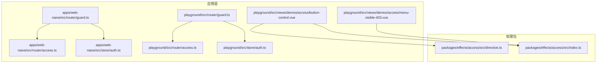
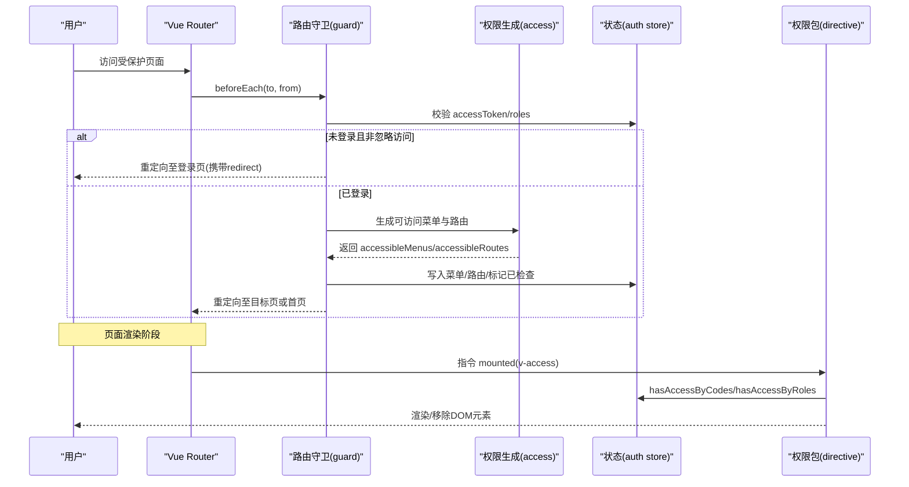
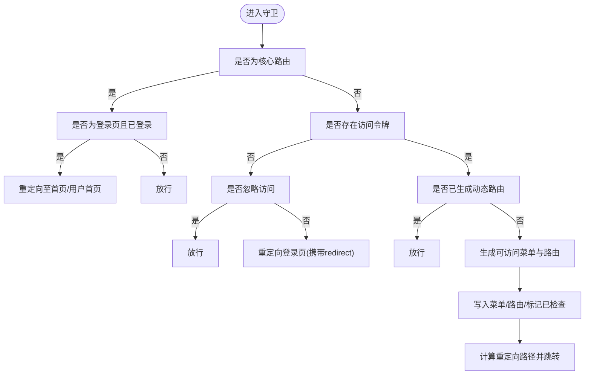
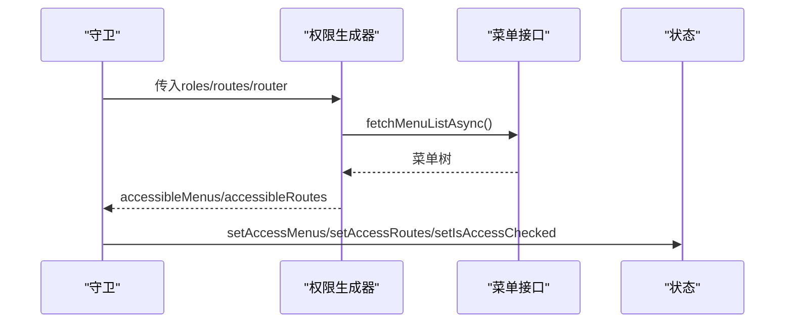
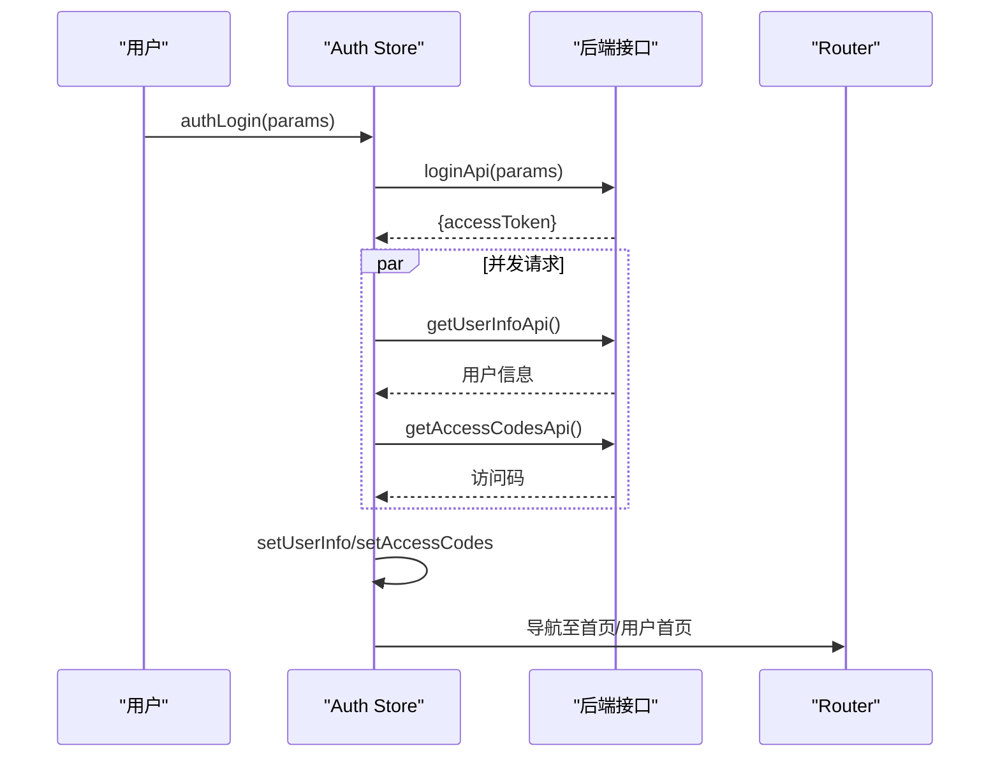
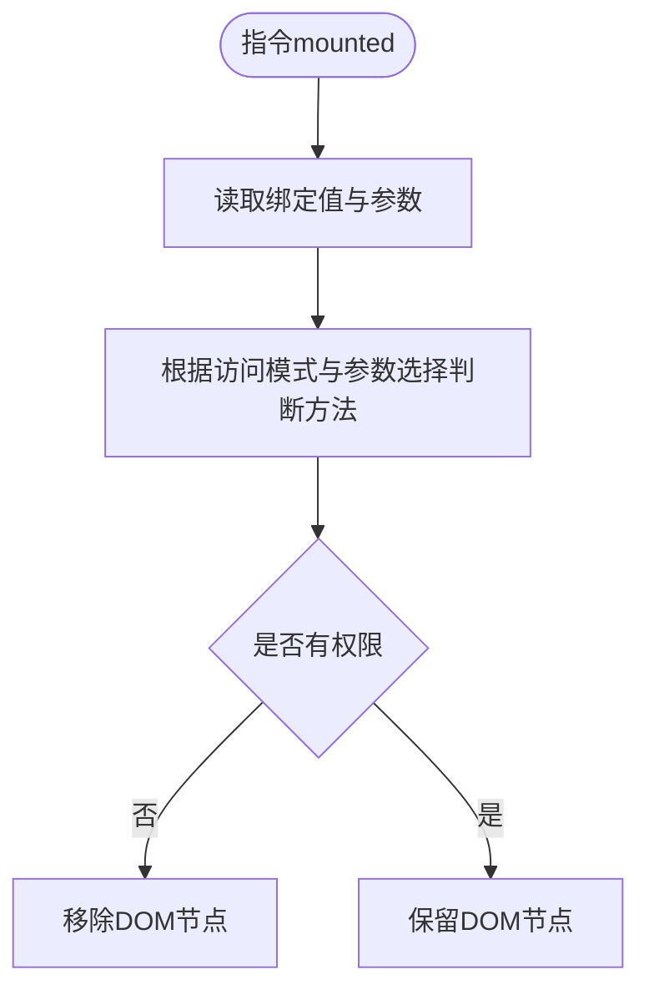
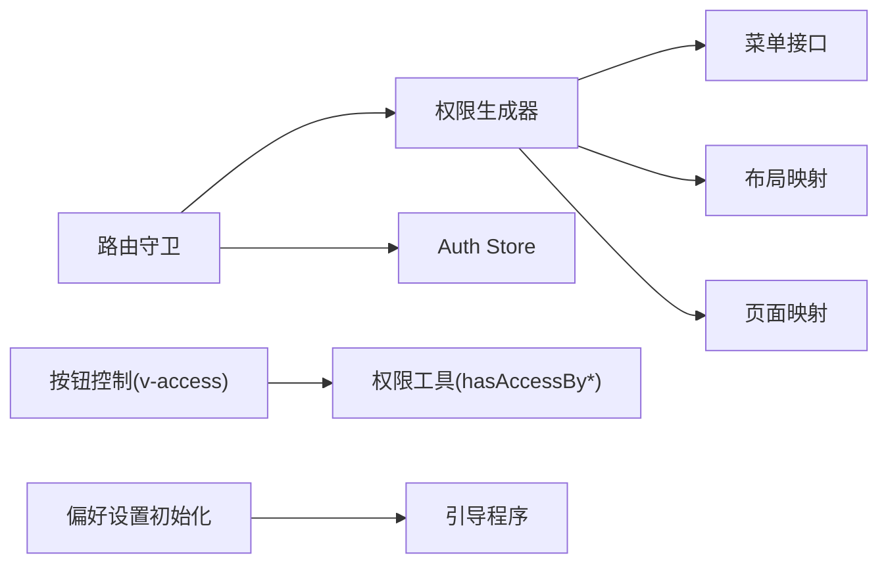

# 权限控制系统

<cite>
**本文引用的文件**
- [apps/web-naive/src/router/access.ts](file://apps/web-naive/src/router/access.ts)
- [apps/web-naive/src/router/guard.ts](file://apps/web-naive/src/router/guard.ts)
- [apps/web-naive/src/store/auth.ts](file://apps/web-naive/src/store/auth.ts)
- [playground/src/router/access.ts](file://playground/src/router/access.ts)
- [playground/src/router/guard.ts](file://playground/src/router/guard.ts)
- [playground/src/store/auth.ts](file://playground/src/store/auth.ts)
- [packages/effects/access/src/directive.ts](file://packages/effects/access/src/directive.ts)
- [packages/effects/access/src/index.ts](file://packages/effects/access/src/index.ts)
- [playground/src/views/demos/access/button-control.vue](file://playground/src/views/demos/access/button-control.vue)
- [playground/src/views/demos/access/menu-visible-403.vue](file://playground/src/views/demos/access/menu-visible-403.vue)
- [apps/web-naive/src/main.ts](file://apps/web-naive/src/main.ts)
- [playground/src/main.ts](file://playground/src/main.ts)
</cite>

## 目录

1. [简介](#简介)
2. [项目结构](#项目结构)
3. [核心组件](#核心组件)
4. [架构总览](#架构总览)
5. [详细组件分析](#详细组件分析)
6. [依赖关系分析](#依赖关系分析)
7. [性能考量](#性能考量)
8. [故障排查指南](#故障排查指南)
9. [结论](#结论)
10. [附录](#附录)

## 简介

本文件系统性阐述 shiyu-ui 的权限控制系统，覆盖以下方面：

- 权限模型设计理念：角色权限、菜单权限、按钮权限与数据权限的实现思路与边界
- 动态权限生成：权限数据的获取、解析与应用流程
- 路由权限控制：路由守卫工作原理与权限验证流程
- 按钮级权限控制：指令系统与自定义权限判断
- 最佳实践与常见问题
- 扩展方法与自定义权限类型实现指南

## 项目结构

权限相关代码主要分布在两个应用示例中（web-naive 与 playground），并通过统一的权限包提供指令与工具能力：

- 应用层（web-naive/playground）
  - 路由与守卫：负责权限拦截、动态路由生成与跳转
  - 状态管理：负责登录、用户信息与访问码的持久化
  - 视图演示：展示按钮级权限控制与菜单可见性
- 权限包（packages/effects/access）
  - 提供 v-access 指令、AccessControl 组件与权限判断工具

图表来源

- [apps/web-naive/src/router/guard.ts:1-133](file://apps/web-naive/src/router/guard.ts#L1-133)
- [apps/web-naive/src/router/access.ts:1-41](file://apps/web-naive/src/router/access.ts#L1-41)
- [apps/web-naive/src/store/auth.ts:1-119](file://apps/web-naive/src/store/auth.ts#L1-119)
- [playground/src/router/guard.ts:1-137](file://playground/src/router/guard.ts#L1-137)
- [playground/src/router/access.ts:1-43](file://playground/src/router/access.ts#L1-43)
- [playground/src/store/auth.ts:1-127](file://playground/src/store/auth.ts#L1-127)
- [packages/effects/access/src/directive.ts:1-42](file://packages/effects/access/src/directive.ts#L1-42)
- [packages/effects/access/src/index.ts:1-4](file://packages/effects/access/src/index.ts#L1-4)
- [playground/src/views/demos/access/button-control.vue:1-158](file://playground/src/views/demos/access/button-control.vue#L1-158)
- [playground/src/views/demos/access/menu-visible-403.vue:1-12](file://playground/src/views/demos/access/menu-visible-403.vue#L1-12)

章节来源

- [apps/web-naive/src/router/access.ts:1-41](file://apps/web-naive/src/router/access.ts#L1-41)
- [apps/web-naive/src/router/guard.ts:1-133](file://apps/web-naive/src/router/guard.ts#L1-133)
- [apps/web-naive/src/store/auth.ts:1-119](file://apps/web-naive/src/store/auth.ts#L1-119)
- [playground/src/router/access.ts:1-43](file://playground/src/router/access.ts#L1-43)
- [playground/src/router/guard.ts:1-137](file://playground/src/router/guard.ts#L1-137)
- [playground/src/store/auth.ts:1-127](file://playground/src/store/auth.ts#L1-127)
- [packages/effects/access/src/directive.ts:1-42](file://packages/effects/access/src/directive.ts#L1-42)
- [packages/effects/access/src/index.ts:1-4](file://packages/effects/access/src/index.ts#L1-4)
- [playground/src/views/demos/access/button-control.vue:1-158](file://playground/src/views/demos/access/button-control.vue#L1-158)
- [playground/src/views/demos/access/menu-visible-403.vue:1-12](file://playground/src/views/demos/access/menu-visible-403.vue#L1-12)

## 核心组件

- 路由守卫与动态权限生成
  - 守卫负责：基础路由放行、令牌校验、动态路由生成、权限跳转
  - 动态权限生成负责：拉取菜单、映射页面与布局、生成可访问菜单与路由
- 登录与用户状态
  - 登录时获取访问令牌、用户信息与访问码；登出时清理状态并回退登录页
- 按钮级权限控制
  - 指令 v-access 支持按“角色”或“权限码”两种模式判断
  - 提供 AccessControl 组件与 hasAccessByCodes/hasAccessByRoles 工具函数

章节来源

- [apps/web-naive/src/router/guard.ts:47-119](file://apps/web-naive/src/router/guard.ts#L47-119)
- [apps/web-naive/src/router/access.ts:16-38](file://apps/web-naive/src/router/access.ts#L16-38)
- [apps/web-naive/src/store/auth.ts:28-79](file://apps/web-naive/src/store/auth.ts#L28-79)
- [playground/src/router/guard.ts:46-122](file://playground/src/router/guard.ts#L46-122)
- [playground/src/router/access.ts:17-40](file://playground/src/router/access.ts#L17-40)
- [playground/src/store/auth.ts:29-79](file://playground/src/store/auth.ts#L29-79)
- [packages/effects/access/src/directive.ts:11-30](file://packages/effects/access/src/directive.ts#L11-30)
- [packages/effects/access/src/index.ts:1-4](file://packages/effects/access/src/index.ts#L1-4)

## 架构总览

下图展示了从登录到动态路由生成、菜单与路由应用、再到按钮级权限控制的整体流程。

图表来源

- [apps/web-naive/src/router/guard.ts:47-119](file://apps/web-naive/src/router/guard.ts#L47-119)
- [apps/web-naive/src/router/access.ts:16-38](file://apps/web-naive/src/router/access.ts#L16-38)
- [apps/web-naive/src/store/auth.ts:28-79](file://apps/web-naive/src/store/auth.ts#L28-79)
- [packages/effects/access/src/directive.ts:11-30](file://packages/effects/access/src/directive.ts#L11-30)

## 详细组件分析

### 路由权限控制（守卫）

- 基础路由放行：对核心路由名称直接放行；若已登录且命中登录页则重定向至首页或用户首页路径
- 令牌与忽略访问：无令牌时，若目标路由声明忽略访问则放行；否则重定向登录页并携带 redirect
- 动态路由生成：首次访问时根据用户角色调用权限生成器，写入菜单与路由，并基于来源/默认路径计算重定向
- 进度条与加载状态：通用守卫负责页面切换进度条的开启与关闭

图表来源

- [apps/web-naive/src/router/guard.ts:47-119](file://apps/web-naive/src/router/guard.ts#L47-119)
- [playground/src/router/guard.ts:46-122](file://playground/src/router/guard.ts#L46-122)

章节来源

- [apps/web-naive/src/router/guard.ts:17-119](file://apps/web-naive/src/router/guard.ts#L17-119)
- [playground/src/router/guard.ts:17-122](file://playground/src/router/guard.ts#L17-122)

### 动态权限生成（菜单与路由）

- 生成入口：通过权限生成器传入访问模式、页面映射、布局映射、菜单拉取函数与403组件
- 菜单拉取：异步获取菜单树，支持加载提示
- 结果应用：返回可访问菜单与路由，供守卫写入状态并注入路由

图表来源

- [apps/web-naive/src/router/access.ts:16-38](file://apps/web-naive/src/router/access.ts#L16-38)
- [playground/src/router/access.ts:17-40](file://playground/src/router/access.ts#L17-40)

章节来源

- [apps/web-naive/src/router/access.ts:16-38](file://apps/web-naive/src/router/access.ts#L16-38)
- [playground/src/router/access.ts:17-40](file://playground/src/router/access.ts#L17-40)

### 登录与用户状态管理

- 登录流程：获取访问令牌后并发拉取用户信息与访问码，写入状态并导航至首页或用户首页
- 登出流程：调用后端登出接口（如失败也允许继续清理）、重置所有状态并回退登录页，携带当前路径以便登录后跳转

图表来源

- [apps/web-naive/src/store/auth.ts:28-79](file://apps/web-naive/src/store/auth.ts#L28-79)
- [playground/src/store/auth.ts:29-79](file://playground/src/store/auth.ts#L29-79)

章节来源

- [apps/web-naive/src/store/auth.ts:28-79](file://apps/web-naive/src/store/auth.ts#L28-79)
- [playground/src/store/auth.ts:29-79](file://playground/src/store/auth.ts#L29-79)

### 按钮级权限控制（指令与组件）

- 指令 v-access
  - 支持参数：role 与 code
  - 前端模式下若参数为 role 则走角色判断，否则统一走权限码判断
  - 若无权限，移除对应 DOM 元素
- 组件 AccessControl
  - 以组件形式包裹需要控制的按钮/区域，传入 codes 与 type
- 函数式判断
  - hasAccessByCodes / hasAccessByRoles 用于条件渲染

图表来源

- [packages/effects/access/src/directive.ts:11-30](file://packages/effects/access/src/directive.ts#L11-30)

章节来源

- [packages/effects/access/src/directive.ts:11-30](file://packages/effects/access/src/directive.ts#L11-30)
- [packages/effects/access/src/index.ts:1-4](file://packages/effects/access/src/index.ts#L1-4)
- [playground/src/views/demos/access/button-control.vue:133-155](file://playground/src/views/demos/access/button-control.vue#L133-155)

### 菜单可见性与403重定向

- 当某路由被判定为“可见但无权限”时，可通过配置使菜单显示但访问被重定向至403页面
- 示例页面用于演示“页面不可见时重定向至403”的场景

章节来源

- [apps/web-naive/src/router/access.ts:32-35](file://apps/web-naive/src/router/access.ts#L32-35)
- [playground/src/router/access.ts:34-37](file://playground/src/router/access.ts#L34-37)
- [playground/src/views/demos/access/menu-visible-403.vue:1-12](file://playground/src/views/demos/access/menu-visible-403.vue#L1-12)

## 依赖关系分析

- 应用层依赖
  - 路由守卫依赖状态存储（访问令牌、用户信息、访问码）与权限生成器
  - 权限生成器依赖菜单接口、布局与页面映射、国际化与消息提示
  - 指令与组件依赖权限包提供的判断工具
- 状态与偏好设置
  - 初始化偏好设置后启动引导程序，随后挂载应用

图表来源

- [apps/web-naive/src/router/guard.ts:47-119](file://apps/web-naive/src/router/guard.ts#L47-119)
- [apps/web-naive/src/router/access.ts:16-38](file://apps/web-naive/src/router/access.ts#L16-38)
- [packages/effects/access/src/directive.ts:11-30](file://packages/effects/access/src/directive.ts#L11-30)
- [apps/web-naive/src/main.ts:9-29](file://apps/web-naive/src/main.ts#L9-29)
- [playground/src/main.ts:9-32](file://playground/src/main.ts#L9-32)

章节来源

- [apps/web-naive/src/router/guard.ts:47-119](file://apps/web-naive/src/router/guard.ts#L47-119)
- [apps/web-naive/src/router/access.ts:16-38](file://apps/web-naive/src/router/access.ts#L16-38)
- [packages/effects/access/src/directive.ts:11-30](file://packages/effects/access/src/directive.ts#L11-30)
- [apps/web-naive/src/main.ts:9-29](file://apps/web-naive/src/main.ts#L9-29)
- [playground/src/main.ts:9-32](file://playground/src/main.ts#L9-32)

## 性能考量

- 并发请求：登录时并发拉取用户信息与访问码，缩短首屏等待时间
- 动态路由仅生成一次：通过状态标记避免重复生成
- 指令判断轻量：在 mounted 阶段一次性判断并移除无权限节点，减少运行时开销
- 进度条与加载提示：在动态菜单加载时提供反馈，改善用户体验

## 故障排查指南

- 登录后仍被重定向至登录页
  - 检查访问令牌是否正确写入状态
  - 确认守卫对核心路由的放行逻辑与登录页重定向条件
- 动态路由未生成
  - 确认用户角色已写入状态并在守卫中正确传递
  - 检查权限生成器的菜单拉取接口是否返回有效数据
- 按钮始终不显示
  - 确认访问模式与指令参数（role/code）匹配
  - 检查访问码或角色集合是否包含所需权限
- 403页面未出现
  - 确认权限生成器已配置 forbiddenComponent 与布局映射
  - 检查路由 meta 中的 menuVisibleWithForbidden 配置

章节来源

- [apps/web-naive/src/router/guard.ts:65-86](file://apps/web-naive/src/router/guard.ts#L65-86)
- [apps/web-naive/src/router/access.ts:32-37](file://apps/web-naive/src/router/access.ts#L32-37)
- [packages/effects/access/src/directive.ts:20-29](file://packages/effects/access/src/directive.ts#L20-29)

## 结论

本权限体系以“前端/后端混合模式”为核心，结合路由守卫与动态权限生成，实现了菜单、路由与按钮的多层级权限控制。通过指令与组件化的权限判断，开发者可在不侵入业务逻辑的前提下灵活控制界面元素的可见性与交互能力。配合登录状态与访问码的管理，系统具备良好的可维护性与扩展性。

## 附录

### 权限模型与实现要点

- 角色权限
  - 前端模式下可通过角色判断实现按钮/菜单显隐
  - 后端模式下通常由服务端判定，前端以权限码驱动
- 菜单权限
  - 通过权限生成器返回的可访问菜单树决定菜单渲染
- 按钮权限
  - 指令 v-access 与 AccessControl 组件提供一致的权限判断入口
- 数据权限
  - 可在具体业务组件中结合用户角色/部门范围等上下文进行过滤

### 动态权限生成流程（步骤化）

- 初始化：准备页面与布局映射、国际化与消息提示
- 拉取菜单：异步获取菜单树并显示加载提示
- 生成结果：返回可访问菜单与路由
- 应用结果：写入状态并注入路由，计算重定向路径

章节来源

- [apps/web-naive/src/router/access.ts:16-38](file://apps/web-naive/src/router/access.ts#L16-38)
- [playground/src/router/access.ts:17-40](file://playground/src/router/access.ts#L17-40)

### 路由守卫关键流程（步骤化）

- 基础路由放行：核心路由直接放行
- 令牌校验：无令牌且非忽略访问则重定向登录页
- 动态路由生成：首次访问时生成并写入状态
- 重定向：根据来源/默认路径计算最终跳转

章节来源

- [apps/web-naive/src/router/guard.ts:47-119](file://apps/web-naive/src/router/guard.ts#L47-119)
- [playground/src/router/guard.ts:46-122](file://playground/src/router/guard.ts#L46-122)

### 按钮权限控制最佳实践

- 指令优先：在模板中使用 v-access:code 或 v-access:role
- 组合判断：同一元素可同时使用多个权限码或角色
- 降级处理：对重要按钮提供后备方案或提示文案
- 组件封装：复杂权限组合建议封装为可复用组件

章节来源

- [packages/effects/access/src/directive.ts:11-30](file://packages/effects/access/src/directive.ts#L11-30)
- [playground/src/views/demos/access/button-control.vue:133-155](file://playground/src/views/demos/access/button-control.vue#L133-155)

### 扩展与自定义指南

- 自定义权限类型
  - 在权限包中扩展判断逻辑（例如新增 type），并在指令与工具函数中适配
- 自定义 forbidden 页面
  - 在权限生成器中替换 forbiddenComponent 并配置布局映射
- 自定义菜单接口
  - 替换 fetchMenuListAsync 的实现，保持返回格式一致

章节来源

- [apps/web-naive/src/router/access.ts:24-37](file://apps/web-naive/src/router/access.ts#L24-37)
- [playground/src/router/access.ts:25-39](file://playground/src/router/access.ts#L25-39)
- [packages/effects/access/src/directive.ts:11-30](file://packages/effects/access/src/directive.ts#L11-30)
