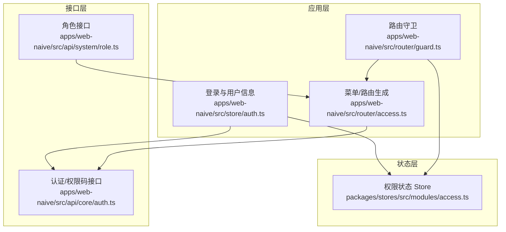
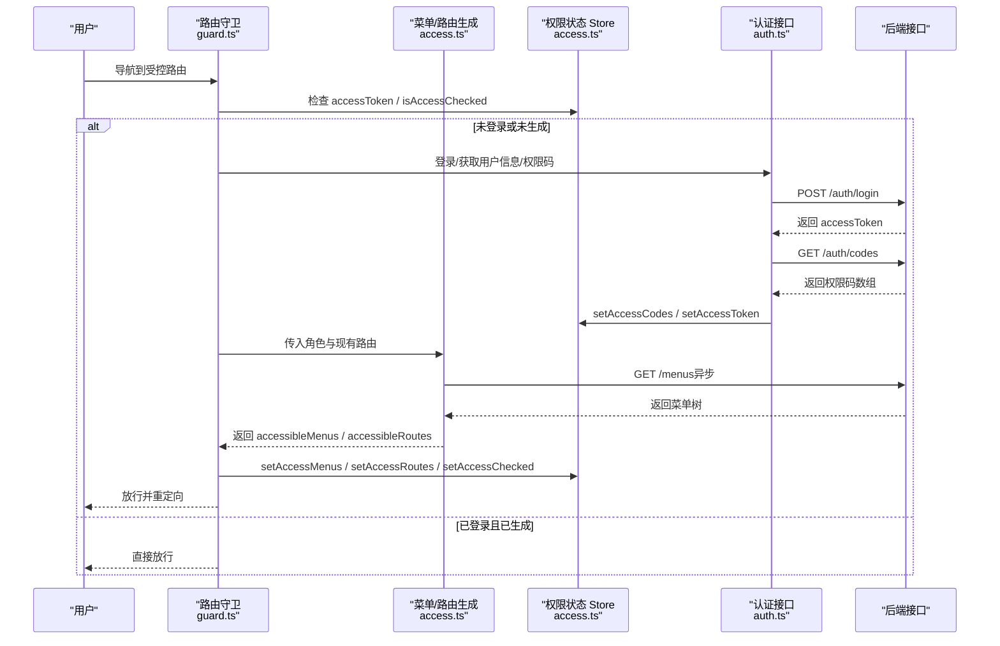
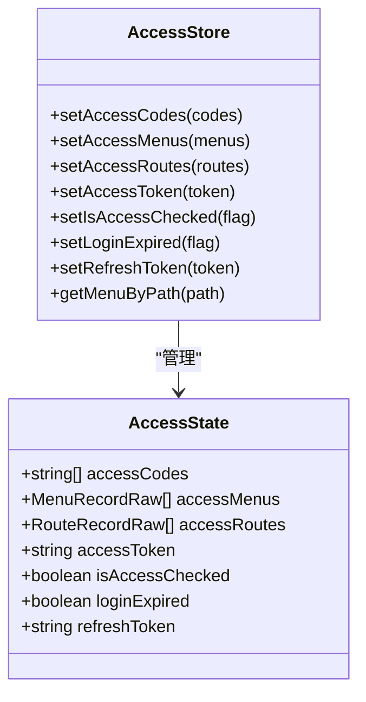
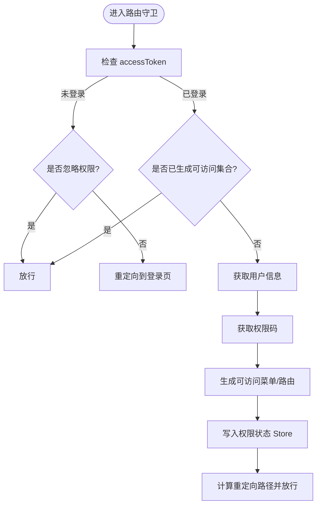
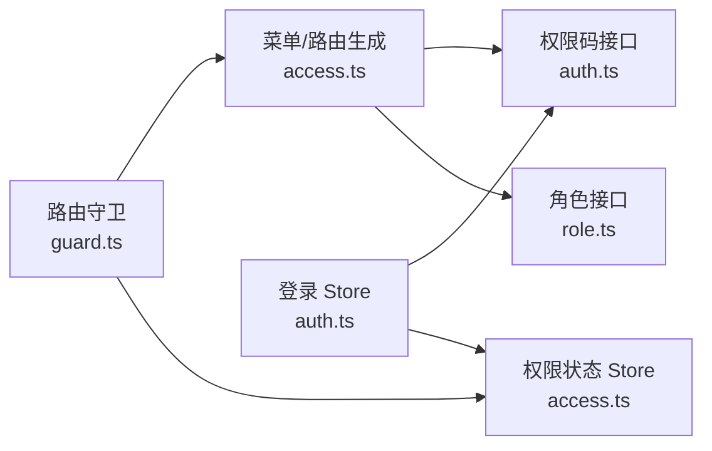

# 权限模型设计

<cite>
**本文引用的文件**
- [apps/web-naive/src/store/auth.ts](file://apps/web-naive/src/store/auth.ts)
- [apps/web-naive/src/router/guard.ts](file://apps/web-naive/src/router/guard.ts)
- [apps/web-naive/src/router/access.ts](file://apps/web-naive/src/router/access.ts)
- [packages/stores/src/modules/access.ts](file://packages/stores/src/modules/access.ts)
- [apps/web-naive/src/api/core/auth.ts](file://apps/web-naive/src/api/core/auth.ts)
- [apps/web-naive/src/api/system/role.ts](file://apps/web-naive/src/api/system/role.ts)
- [playground/src/views/demos/access/index.vue](file://playground/src/views/demos/access/index.vue)
- [playground/src/views/demos/access/button-control.vue](file://playground/src/views/demos/access/button-control.vue)
- [playground/src/views/system/role/modules/form.vue](file://playground/src/views/system/role/modules/form.vue)
</cite>

## 目录

1. [引言](#引言)
2. [项目结构](#项目结构)
3. [核心组件](#核心组件)
4. [架构总览](#架构总览)
5. [详细组件分析](#详细组件分析)
6. [依赖分析](#依赖分析)
7. [性能考虑](#性能考虑)
8. [故障排查指南](#故障排查指南)
9. [结论](#结论)
10. [附录](#附录)

## 引言

本文件系统性阐述 shiyu-ui 的权限模型设计，围绕“角色权限、菜单权限、按钮权限、数据权限”的分层结构展开；解释权限数据模型（权限代码、继承与组合）、权限验证算法（匹配、缓存、更新）、权限与用户角色的映射关系，以及权限与路由/组件的绑定方式；并提供扩展与自定义权限类型的实践指南及性能优化建议。

## 项目结构

权限体系由三层协作构成：

- 应用层：登录态管理、权限码拉取、路由守卫与菜单/路由生成
- 状态层：权限码、可访问菜单、可访问路由、令牌与访问状态持久化
- 接口层：认证、权限码、角色与菜单等后端接口

图表来源

- [apps/web-naive/src/store/auth.ts:1-119](file://apps/web-naive/src/store/auth.ts#L1-L119)
- [apps/web-naive/src/router/guard.ts:1-133](file://apps/web-naive/src/router/guard.ts#L1-L133)
- [apps/web-naive/src/router/access.ts:1-41](file://apps/web-naive/src/router/access.ts#L1-L41)
- [packages/stores/src/modules/access.ts:1-130](file://packages/stores/src/modules/access.ts#L1-L130)
- [apps/web-naive/src/api/core/auth.ts:1-52](file://apps/web-naive/src/api/core/auth.ts#L1-L52)
- [apps/web-naive/src/api/system/role.ts:1-56](file://apps/web-naive/src/api/system/role.ts#L1-L56)

章节来源

- [apps/web-naive/src/store/auth.ts:1-119](file://apps/web-naive/src/store/auth.ts#L1-L119)
- [apps/web-naive/src/router/guard.ts:1-133](file://apps/web-naive/src/router/guard.ts#L1-L133)
- [apps/web-naive/src/router/access.ts:1-41](file://apps/web-naive/src/router/access.ts#L1-L41)
- [packages/stores/src/modules/access.ts:1-130](file://packages/stores/src/modules/access.ts#L1-L130)
- [apps/web-naive/src/api/core/auth.ts:1-52](file://apps/web-naive/src/api/core/auth.ts#L1-L52)
- [apps/web-naive/src/api/system/role.ts:1-56](file://apps/web-naive/src/api/system/role.ts#L1-L56)

## 核心组件

- 权限状态 Store（Access Store）：维护 accessCodes、accessMenus、accessRoutes、accessToken、isAccessChecked、loginExpired 等关键状态，并提供持久化策略
- 登录与用户信息 Store（Auth Store）：负责登录、获取用户信息、拉取权限码、登出与路由跳转
- 路由守卫与菜单/路由生成：基于用户角色与权限码生成可访问菜单与路由，支持前后端两种权限模式
- 接口层：认证登录、刷新令牌、退出登录、获取权限码、角色与菜单 CRUD

章节来源

- [packages/stores/src/modules/access.ts:1-130](file://packages/stores/src/modules/access.ts#L1-L130)
- [apps/web-naive/src/store/auth.ts:1-119](file://apps/web-naive/src/store/auth.ts#L1-L119)
- [apps/web-naive/src/router/access.ts:1-41](file://apps/web-naive/src/router/access.ts#L1-L41)
- [apps/web-naive/src/router/guard.ts:1-133](file://apps/web-naive/src/router/guard.ts#L1-L133)
- [apps/web-naive/src/api/core/auth.ts:1-52](file://apps/web-naive/src/api/core/auth.ts#L1-L52)
- [apps/web-naive/src/api/system/role.ts:1-56](file://apps/web-naive/src/api/system/role.ts#L1-L56)

## 架构总览

权限模型采用“前端/后端混合”模式：

- 前端模式：前端根据权限码与路由元信息进行渲染过滤与导航控制
- 后端模式：后端返回可访问菜单/路由，前端按返回结果构建界面

图表来源

- [apps/web-naive/src/router/guard.ts:47-118](file://apps/web-naive/src/router/guard.ts#L47-L118)
- [apps/web-naive/src/router/access.ts:16-38](file://apps/web-naive/src/router/access.ts#L16-L38)
- [packages/stores/src/modules/access.ts:76-100](file://packages/stores/src/modules/access.ts#L76-L100)
- [apps/web-naive/src/api/core/auth.ts:24-51](file://apps/web-naive/src/api/core/auth.ts#L24-L51)

## 详细组件分析

### 权限数据模型与层次结构

- 权限代码（accessCodes）：后端下发的字符串集合，作为权限匹配的基础原子单位
- 菜单权限（accessMenus）：由后端返回的菜单树，前端据此渲染导航与面包屑
- 路由权限（accessRoutes）：由菜单树转换而来，用于路由层面的访问控制
- 按钮权限：通过菜单项元信息中的类型标记与权限码组合，实现按钮级可见/可用控制
- 数据权限：通过后端返回的数据范围或在业务层对数据集进行过滤实现（本仓库示例以菜单/按钮为主）

图表来源

- [packages/stores/src/modules/access.ts:9-46](file://packages/stores/src/modules/access.ts#L9-L46)
- [packages/stores/src/modules/access.ts:51-101](file://packages/stores/src/modules/access.ts#L51-L101)

章节来源

- [packages/stores/src/modules/access.ts:1-130](file://packages/stores/src/modules/access.ts#L1-L130)

### 权限验证算法与匹配逻辑

- 匹配基础：以权限码数组为基准，结合路由/菜单元信息中的权限标识进行匹配
- 生成流程：路由守卫在首次访问时，调用菜单/路由生成器，异步拉取菜单树，再根据角色与权限码生成可访问集合
- 忽略访问：若目标路由声明忽略权限校验，则直接放行
- 403 处理：当路由允许但无权限时，可配置 forbidden 组件或重定向至 403 页面

图表来源

- [apps/web-naive/src/router/guard.ts:47-118](file://apps/web-naive/src/router/guard.ts#L47-L118)
- [apps/web-naive/src/router/access.ts:16-38](file://apps/web-naive/src/router/access.ts#L16-L38)

章节来源

- [apps/web-naive/src/router/guard.ts:1-133](file://apps/web-naive/src/router/guard.ts#L1-L133)
- [apps/web-naive/src/router/access.ts:1-41](file://apps/web-naive/src/router/access.ts#L1-L41)

### 权限与用户角色的映射关系

- 用户角色来源于用户信息（登录后拉取），路由守卫读取用户角色列表作为生成可访问集合的输入之一
- 角色与权限码的关系由后端维护，前端仅消费权限码数组与菜单树
- 示例页面展示了不同角色切换时菜单与按钮的变化，体现角色对权限的影响

章节来源

- [apps/web-naive/src/router/guard.ts:94-95](file://apps/web-naive/src/router/guard.ts#L94-L95)
- [playground/src/views/demos/access/index.vue:59-98](file://playground/src/views/demos/access/index.vue#L59-L98)
- [playground/src/views/demos/access/button-control.vue:53-80](file://playground/src/views/demos/access/button-control.vue#L53-L80)

### 权限与路由、组件的绑定方式

- 路由层：通过“菜单/路由生成器”将后端菜单树转换为可访问路由，结合 ignoreAccess 元信息实现细粒度控制
- 组件层：按钮与功能可见性可通过权限码与菜单元信息联动控制；示例中按钮权限通过树形选择与类型标记实现
- 角色表单：角色编辑页支持从菜单树批量勾选权限码，形成“角色-权限码”映射

章节来源

- [apps/web-naive/src/router/access.ts:16-38](file://apps/web-naive/src/router/access.ts#L16-L38)
- [playground/src/views/system/role/modules/form.vue:75-83](file://playground/src/views/system/role/modules/form.vue#L75-L83)
- [apps/web-naive/src/api/system/role.ts:17-56](file://apps/web-naive/src/api/system/role.ts#L17-L56)

### 权限缓存策略与更新机制

- 缓存位置：权限状态 Store 对 accessCodes、accessToken、refreshToken、isLockScreen 等进行持久化
- 缓存生效：登录成功后写入 Store，后续路由守卫直接使用，避免重复请求
- 更新触发：登出时重置所有 Store 并清除登录态；刷新令牌接口可用于续期（示例接口存在）

章节来源

- [packages/stores/src/modules/access.ts:102-111](file://packages/stores/src/modules/access.ts#L102-L111)
- [apps/web-naive/src/store/auth.ts:81-99](file://apps/web-naive/src/store/auth.ts#L81-L99)
- [apps/web-naive/src/api/core/auth.ts:31-35](file://apps/web-naive/src/api/core/auth.ts#L31-L35)

### 权限模型扩展与自定义权限类型

- 自定义权限类型：可在菜单元信息中扩展新的类型（如“数据权限”、“操作权限”），前端据此在组件层进行差异化渲染
- 权限组合：通过权限码数组与布尔表达式（AND/OR）组合实现复杂权限，前端在匹配时按策略计算
- 权限继承：建议在后端以角色-权限码层级实现继承，前端保持扁平的 accessCodes 消费，降低前端复杂度
- 最佳实践：权限码命名规范统一、权限类型语义清晰、菜单树结构稳定、权限变更走灰度发布

章节来源

- [apps/web-naive/src/router/access.ts:24-37](file://apps/web-naive/src/router/access.ts#L24-L37)
- [playground/src/views/system/role/modules/form.vue:91-98](file://playground/src/views/system/role/modules/form.vue#L91-L98)

## 依赖分析

- 应用层依赖状态层与接口层；路由守卫依赖菜单/路由生成器；生成器依赖后端菜单接口
- 权限状态 Store 提供持久化与查询能力，减少重复请求
- 登录 Store 负责并发拉取用户信息与权限码，提升首屏体验

图表来源

- [apps/web-naive/src/router/guard.ts:47-118](file://apps/web-naive/src/router/guard.ts#L47-L118)
- [apps/web-naive/src/router/access.ts:16-38](file://apps/web-naive/src/router/access.ts#L16-L38)
- [packages/stores/src/modules/access.ts:76-100](file://packages/stores/src/modules/access.ts#L76-L100)
- [apps/web-naive/src/api/core/auth.ts:24-51](file://apps/web-naive/src/api/core/auth.ts#L24-L51)
- [apps/web-naive/src/api/system/role.ts:17-56](file://apps/web-naive/src/api/system/role.ts#L17-L56)
- [apps/web-naive/src/store/auth.ts:28-79](file://apps/web-naive/src/store/auth.ts#L28-L79)

章节来源

- [apps/web-naive/src/router/guard.ts:1-133](file://apps/web-naive/src/router/guard.ts#L1-L133)
- [apps/web-naive/src/router/access.ts:1-41](file://apps/web-naive/src/router/access.ts#L1-L41)
- [packages/stores/src/modules/access.ts:1-130](file://packages/stores/src/modules/access.ts#L1-L130)
- [apps/web-naive/src/api/core/auth.ts:1-52](file://apps/web-naive/src/api/core/auth.ts#L1-L52)
- [apps/web-naive/src/api/system/role.ts:1-56](file://apps/web-naive/src/api/system/role.ts#L1-L56)
- [apps/web-naive/src/store/auth.ts:1-119](file://apps/web-naive/src/store/auth.ts#L1-L119)

## 性能考虑

- 并发拉取：登录时并发获取用户信息与权限码，缩短白屏时间
- 路由懒加载：配合菜单/路由生成器，按需加载组件，降低初始包体
- 缓存复用：权限状态持久化，避免重复登录与权限拉取
- 菜单预取：在登录后尽早拉取菜单树，减少首屏渲染阻塞
- 403 快速降级：对无权限路由快速跳转，避免无效渲染

章节来源

- [apps/web-naive/src/store/auth.ts:44-47](file://apps/web-naive/src/store/auth.ts#L44-L47)
- [apps/web-naive/src/router/guard.ts:21-29](file://apps/web-naive/src/router/guard.ts#L21-L29)

## 故障排查指南

- 登录后仍被重定向到登录页
  - 检查 accessToken 是否写入 Store
  - 确认 isAccessChecked 是否被设置为 true
  - 排查 ignoreAccess 是否误设
- 路由无法访问或出现 403
  - 检查权限码数组是否包含目标路由所需权限
  - 确认菜单/路由生成器返回的 accessibleRoutes 是否包含目标路由
- 按钮不显示或不可用
  - 检查菜单元信息中的类型与权限码映射
  - 确认角色表单中是否正确勾选了对应权限
- 登出异常或死循环
  - 检查登出流程是否重置了所有 Store
  - 确认是否存在递归调用导致的死循环

章节来源

- [apps/web-naive/src/router/guard.ts:65-86](file://apps/web-naive/src/router/guard.ts#L65-L86)
- [apps/web-naive/src/router/guard.ts:105-117](file://apps/web-naive/src/router/guard.ts#L105-L117)
- [packages/stores/src/modules/access.ts:76-100](file://packages/stores/src/modules/access.ts#L76-L100)
- [apps/web-naive/src/store/auth.ts:81-99](file://apps/web-naive/src/store/auth.ts#L81-L99)

## 结论

本权限模型以“权限码为核心、前端/后端协同”为设计原则，通过状态 Store 实现高效缓存与复用，借助路由守卫与菜单/路由生成器完成从角色到界面的全链路权限控制。在保证安全的前提下，兼顾前端体验与可扩展性，适合在多角色、多权限场景下落地。

## 附录

- 权限码命名建议：采用“模块:功能:动作”格式，确保语义清晰、便于检索与组合
- 按钮权限实现：在菜单元信息中标注类型为按钮，并与权限码一一对应
- 数据权限建议：通过后端返回的数据范围或在业务层对数据进行过滤，避免在前端暴露敏感字段
