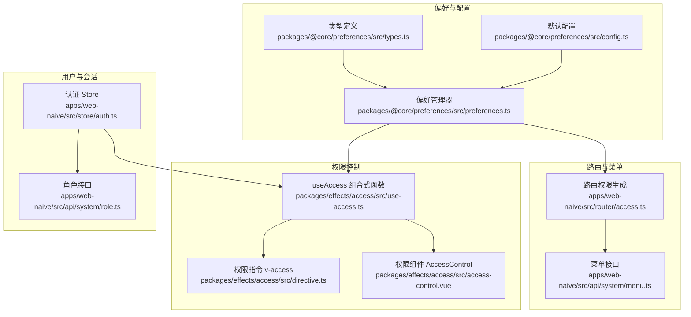
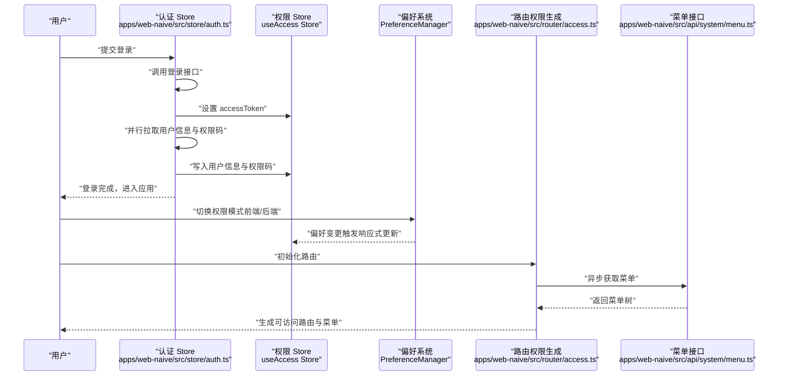
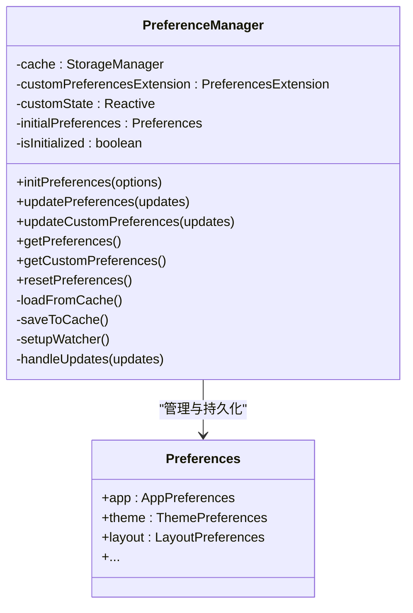
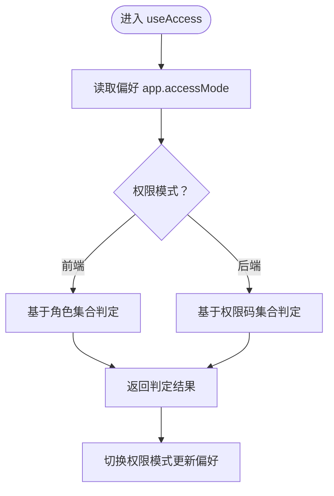
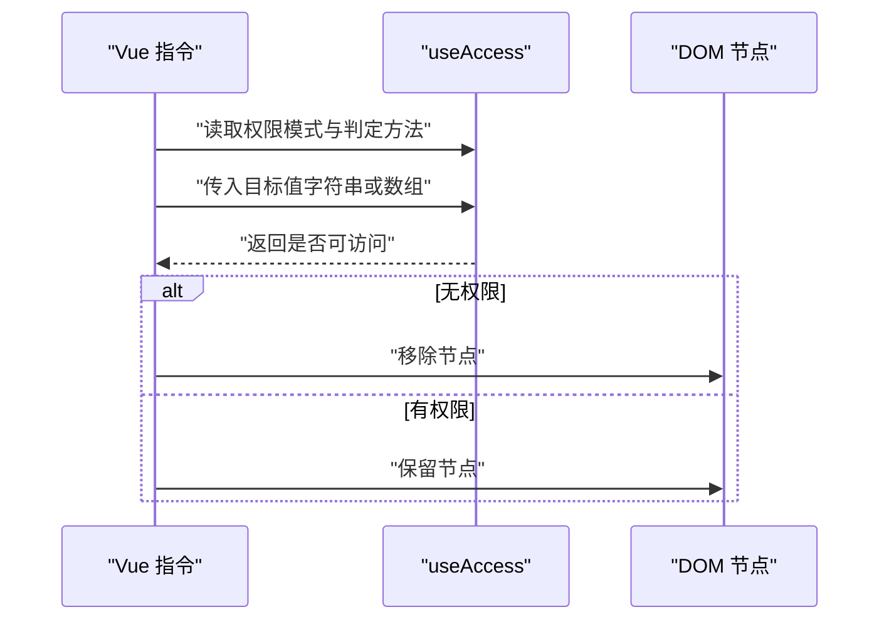
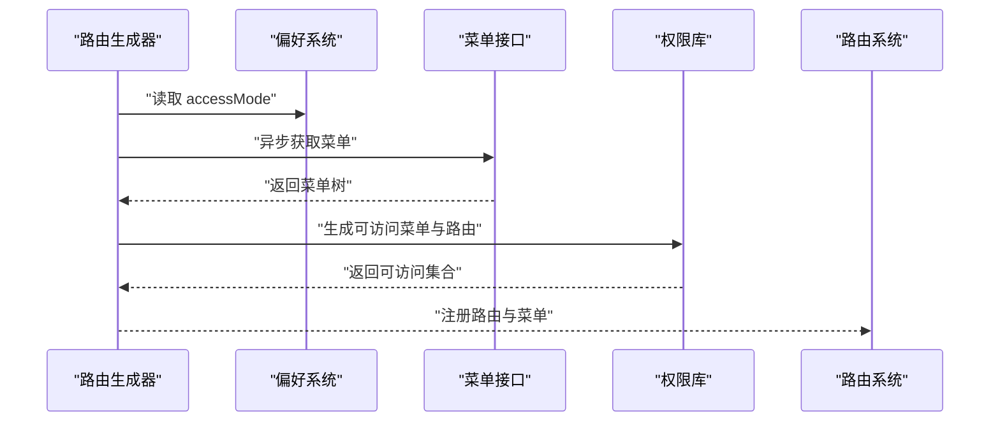
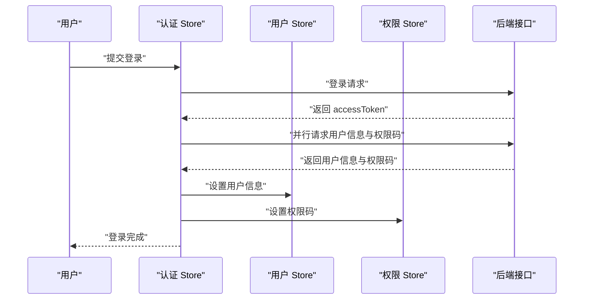
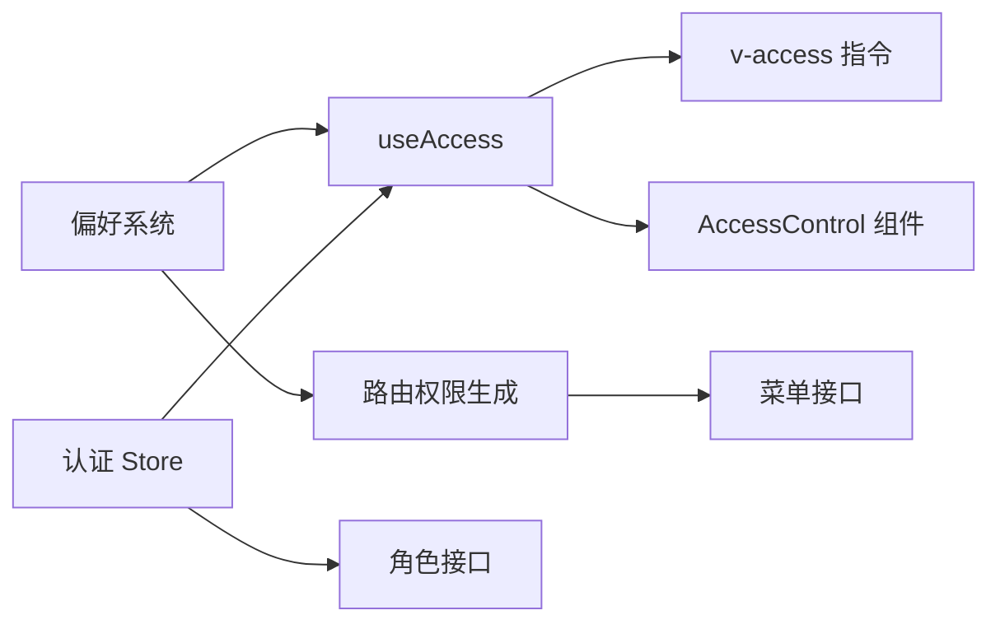

# 权限配置管理

<cite>
**本文引用的文件**
- [packages/@core/preferences/src/preferences.ts](file://packages/@core/preferences/src/preferences.ts)
- [packages/@core/preferences/src/config.ts](file://packages/@core/preferences/src/config.ts)
- [packages/@core/preferences/src/types.ts](file://packages/@core/preferences/src/types.ts)
- [packages/effects/access/src/use-access.ts](file://packages/effects/access/src/use-access.ts)
- [packages/effects/access/src/directive.ts](file://packages/effects/access/src/directive.ts)
- [packages/effects/access/src/access-control.vue](file://packages/effects/access/src/access-control.vue)
- [packages/effects/access/src/index.ts](file://packages/effects/access/src/index.ts)
- [apps/web-naive/src/router/access.ts](file://apps/web-naive/src/router/access.ts)
- [apps/web-naive/src/store/auth.ts](file://apps/web-naive/src/store/auth.ts)
- [apps/web-naive/src/api/system/menu.ts](file://apps/web-naive/src/api/system/menu.ts)
- [apps/web-naive/src/api/system/role.ts](file://apps/web-naive/src/api/system/role.ts)
- [playground/src/views/demos/access/index.vue](file://playground/src/views/demos/access/index.vue)
- [playground/src/views/demos/access/button-control.vue](file://playground/src/views/demos/access/button-control.vue)
</cite>

## 目录

1. [简介](#简介)
2. [项目结构](#项目结构)
3. [核心组件](#核心组件)
4. [架构总览](#架构总览)
5. [详细组件分析](#详细组件分析)
6. [依赖关系分析](#依赖关系分析)
7. [性能考量](#性能考量)
8. [故障排除指南](#故障排除指南)
9. [结论](#结论)
10. [附录](#附录)

## 简介

本文件面向 shiyu-ui 项目的“权限配置管理”能力，系统性阐述权限配置的结构与组织方式、加载与验证流程、与应用偏好的集成机制、热更新策略、扩展方法以及最佳实践，并提供调试与排障建议。读者将能够理解权限配置如何影响前端路由与界面元素的可见性与可用性，以及如何在不破坏现有功能的前提下进行扩展与演进。

## 项目结构

权限配置管理涉及以下关键模块：

- 应用偏好与权限模式：通过统一的偏好系统提供 accessMode（前端/后端）等关键开关，驱动权限控制行为。
- 权限控制能力：提供指令、组件与组合式函数三种维度的权限控制入口。
- 路由与菜单生成：根据权限模式与后端返回的菜单/权限码动态生成可访问的路由与菜单树。
- 用户与会话：登录后拉取用户信息与权限码，建立权限判定的数据基础。
- 角色与菜单：系统管理中的角色与菜单接口，支撑权限模型的数据来源。

图表来源

- [packages/@core/preferences/src/preferences.ts:1-459](file://packages/@core/preferences/src/preferences.ts#L1-L459)
- [packages/@core/preferences/src/config.ts:1-148](file://packages/@core/preferences/src/config.ts#L1-L148)
- [packages/@core/preferences/src/types.ts:1-441](file://packages/@core/preferences/src/types.ts#L1-L441)
- [packages/effects/access/src/use-access.ts:1-54](file://packages/effects/access/src/use-access.ts#L1-L54)
- [packages/effects/access/src/directive.ts:1-42](file://packages/effects/access/src/directive.ts#L1-L42)
- [packages/effects/access/src/access-control.vue:1-47](file://packages/effects/access/src/access-control.vue#L1-L47)
- [apps/web-naive/src/router/access.ts:1-41](file://apps/web-naive/src/router/access.ts#L1-L41)
- [apps/web-naive/src/api/system/menu.ts:1-169](file://apps/web-naive/src/api/system/menu.ts#L1-L169)
- [apps/web-naive/src/store/auth.ts:1-119](file://apps/web-naive/src/store/auth.ts#L1-L119)
- [apps/web-naive/src/api/system/role.ts:1-56](file://apps/web-naive/src/api/system/role.ts#L1-L56)

章节来源

- [packages/@core/preferences/src/preferences.ts:1-459](file://packages/@core/preferences/src/preferences.ts#L1-L459)
- [packages/@core/preferences/src/config.ts:1-148](file://packages/@core/preferences/src/config.ts#L1-L148)
- [packages/@core/preferences/src/types.ts:1-441](file://packages/@core/preferences/src/types.ts#L1-L441)
- [packages/effects/access/src/use-access.ts:1-54](file://packages/effects/access/src/use-access.ts#L1-L54)
- [packages/effects/access/src/directive.ts:1-42](file://packages/effects/access/src/directive.ts#L1-L42)
- [packages/effects/access/src/access-control.vue:1-47](file://packages/effects/access/src/access-control.vue#L1-L47)
- [apps/web-naive/src/router/access.ts:1-41](file://apps/web-naive/src/router/access.ts#L1-L41)
- [apps/web-naive/src/store/auth.ts:1-119](file://apps/web-naive/src/store/auth.ts#L1-L119)
- [apps/web-naive/src/api/system/menu.ts:1-169](file://apps/web-naive/src/api/system/menu.ts#L1-L169)
- [apps/web-naive/src/api/system/role.ts:1-56](file://apps/web-naive/src/api/system/role.ts#L1-L56)

## 核心组件

- 偏好管理器（PreferenceManager）
  - 负责偏好设置的初始化、合并、持久化与变更监听；支持命名空间隔离与扩展字段校验。
  - 关键职责：加载缓存、合并默认与覆盖配置、深度更新、防抖保存、平台与主题联动。
- 权限控制组合式函数（useAccess）
  - 提供基于角色或权限码的判定能力，暴露切换权限模式的方法；权限模式来自偏好系统。
- 权限指令与组件
  - 指令 v-access：在挂载阶段根据权限模式与目标值决定节点可见性。
  - 组件 AccessControl：以组件形式包裹内容，按角色或权限码控制渲染。
- 路由权限生成
  - 根据偏好中的 accessMode 调用权限库生成可访问的菜单与路由，支持异步加载菜单与 403 跳转。
- 认证与权限码拉取
  - 登录成功后并行拉取用户信息与权限码，写入对应 Store，作为权限判定的数据源。

章节来源

- [packages/@core/preferences/src/preferences.ts:32-459](file://packages/@core/preferences/src/preferences.ts#L32-L459)
- [packages/effects/access/src/use-access.ts:6-54](file://packages/effects/access/src/use-access.ts#L6-L54)
- [packages/effects/access/src/directive.ts:1-42](file://packages/effects/access/src/directive.ts#L1-L42)
- [packages/effects/access/src/access-control.vue:1-47](file://packages/effects/access/src/access-control.vue#L1-L47)
- [apps/web-naive/src/router/access.ts:16-41](file://apps/web-naive/src/router/access.ts#L16-L41)
- [apps/web-naive/src/store/auth.ts:28-79](file://apps/web-naive/src/store/auth.ts#L28-L79)

## 架构总览

权限配置管理围绕“偏好系统 + 权限控制 + 路由/菜单生成 + 用户会话”的闭环展开。偏好系统提供 accessMode 等关键开关，权限控制层据此选择角色或权限码判定策略，路由层依据权限结果生成可访问的菜单与路由，用户会话层在登录后注入权限码与用户信息。

图表来源

- [apps/web-naive/src/store/auth.ts:28-79](file://apps/web-naive/src/store/auth.ts#L28-L79)
- [packages/@core/preferences/src/preferences.ts:110-158](file://packages/@core/preferences/src/preferences.ts#L110-L158)
- [packages/effects/access/src/use-access.ts:36-43](file://packages/effects/access/src/use-access.ts#L36-L43)
- [apps/web-naive/src/router/access.ts:16-41](file://apps/web-naive/src/router/access.ts#L16-L41)
- [apps/web-naive/src/api/system/menu.ts:98-100](file://apps/web-naive/src/api/system/menu.ts#L98-L100)

## 详细组件分析

### 偏好系统与权限模式

- 结构与职责
  - 偏好系统提供统一的配置入口，包含 app.accessMode、主题、布局、国际化等配置项。
  - 初始化时支持命名空间、覆盖配置与扩展字段，加载缓存并与默认值合并，随后建立变更监听与持久化。
- 权限模式（app.accessMode）
  - 控制权限判定策略：前端模式下使用角色或权限码；后端模式下通常由后端返回可访问资源。
  - 支持运行时切换，配合偏好更新实现热更新。
- 扩展字段与校验
  - 支持自定义扩展字段（输入、数字、选择、开关），并提供数值范围、步长、选项合法性校验。
- 持久化策略
  - 使用存储管理器将主配置、语言与主题分别持久化，避免频繁 IO；扩展字段独立持久化。

图表来源

- [packages/@core/preferences/src/preferences.ts:32-459](file://packages/@core/preferences/src/preferences.ts#L32-L459)
- [packages/@core/preferences/src/config.ts:3-148](file://packages/@core/preferences/src/config.ts#L3-L148)
- [packages/@core/preferences/src/types.ts:374-441](file://packages/@core/preferences/src/types.ts#L374-L441)

章节来源

- [packages/@core/preferences/src/preferences.ts:32-459](file://packages/@core/preferences/src/preferences.ts#L32-L459)
- [packages/@core/preferences/src/config.ts:3-148](file://packages/@core/preferences/src/config.ts#L3-L148)
- [packages/@core/preferences/src/types.ts:99-168](file://packages/@core/preferences/src/types.ts#L99-L168)

### 权限控制组合式函数 useAccess

- 能力概览
  - 读取偏好中的权限模式，提供基于角色与权限码的判定方法。
  - 提供切换权限模式的能力，直接更新偏好系统。
- 判定逻辑
  - 角色判定：对用户角色集合与目标角色数组求交集。
  - 权限码判定：对用户权限码集合与目标权限码数组求交集。
- 与指令/组件的关系
  - 指令与组件均依赖该组合式函数提供的判定能力与权限模式。

图表来源

- [packages/effects/access/src/use-access.ts:6-54](file://packages/effects/access/src/use-access.ts#L6-L54)

章节来源

- [packages/effects/access/src/use-access.ts:6-54](file://packages/effects/access/src/use-access.ts#L6-L54)

### 权限指令 v-access

- 行为说明
  - 在挂载阶段根据绑定参数（role/code）与权限模式选择判定方法。
  - 若无权限，移除 DOM 节点，达到“不可见且不可用”的效果。
- 使用场景
  - 适用于按钮、菜单项等元素的细粒度权限控制。

图表来源

- [packages/effects/access/src/directive.ts:11-30](file://packages/effects/access/src/directive.ts#L11-L30)

章节来源

- [packages/effects/access/src/directive.ts:1-42](file://packages/effects/access/src/directive.ts#L1-L42)

### 权限组件 AccessControl

- 行为说明
  - 通过插槽方式渲染内容，内部根据角色或权限码判定结果决定是否展示。
  - 支持多值判定（任一满足或全部满足）的扩展点已在组件注释中标明。
- 使用场景
  - 适合在复杂布局中对区块进行权限控制。

章节来源

- [packages/effects/access/src/access-control.vue:1-47](file://packages/effects/access/src/access-control.vue#L1-L47)

### 路由权限生成与菜单可见性

- 流程说明
  - 初始化路由时，根据偏好中的权限模式调用权限库生成可访问的菜单与路由。
  - 支持异步加载菜单、403 跳转与布局映射。
- 与后端协作
  - 菜单接口返回包含后端权限标识的菜单树，前端据此过滤出可访问项。

图表来源

- [apps/web-naive/src/router/access.ts:16-41](file://apps/web-naive/src/router/access.ts#L16-L41)
- [apps/web-naive/src/api/system/menu.ts:98-100](file://apps/web-naive/src/api/system/menu.ts#L98-L100)

章节来源

- [apps/web-naive/src/router/access.ts:16-41](file://apps/web-naive/src/router/access.ts#L16-L41)
- [apps/web-naive/src/api/system/menu.ts:25-93](file://apps/web-naive/src/api/system/menu.ts#L25-L93)

### 登录流程与权限码注入

- 流程说明
  - 登录成功后并行拉取用户信息与权限码，写入用户与权限 Store。
  - 登录过期状态与令牌更新由认证 Store 协调处理。
- 影响
  - 权限判定的两个数据源（角色/权限码）在此阶段建立，后续权限控制即基于此。

图表来源

- [apps/web-naive/src/store/auth.ts:28-79](file://apps/web-naive/src/store/auth.ts#L28-L79)

章节来源

- [apps/web-naive/src/store/auth.ts:28-79](file://apps/web-naive/src/store/auth.ts#L28-L79)

### 角色与菜单管理（系统接口）

- 角色接口
  - 提供角色列表、创建、更新、删除等能力；角色实体包含权限码数组字段，用于后端授权。
- 菜单接口
  - 返回菜单树，包含后端权限标识字段，用于前端过滤与路由生成。

章节来源

- [apps/web-naive/src/api/system/role.ts:1-56](file://apps/web-naive/src/api/system/role.ts#L1-L56)
- [apps/web-naive/src/api/system/menu.ts:25-93](file://apps/web-naive/src/api/system/menu.ts#L25-L93)

## 依赖关系分析

- 偏好系统是权限控制的“根配置”，被权限控制组合式函数、路由生成器与演示页面共同依赖。
- 权限控制层（指令/组件/组合式函数）依赖用户与权限 Store 的数据。
- 路由层依赖菜单接口与权限库，最终输出可访问的路由与菜单。
- 认证 Store 在登录阶段注入权限码，是权限判定的数据基础。

图表来源

- [packages/@core/preferences/src/preferences.ts:110-158](file://packages/@core/preferences/src/preferences.ts#L110-L158)
- [packages/effects/access/src/use-access.ts:6-54](file://packages/effects/access/src/use-access.ts#L6-L54)
- [packages/effects/access/src/directive.ts:1-42](file://packages/effects/access/src/directive.ts#L1-L42)
- [packages/effects/access/src/access-control.vue:1-47](file://packages/effects/access/src/access-control.vue#L1-L47)
- [apps/web-naive/src/router/access.ts:16-41](file://apps/web-naive/src/router/access.ts#L16-L41)
- [apps/web-naive/src/store/auth.ts:28-79](file://apps/web-naive/src/store/auth.ts#L28-L79)
- [apps/web-naive/src/api/system/menu.ts:98-100](file://apps/web-naive/src/api/system/menu.ts#L98-L100)
- [apps/web-naive/src/api/system/role.ts:20-24](file://apps/web-naive/src/api/system/role.ts#L20-L24)

章节来源

- [packages/@core/preferences/src/preferences.ts:110-158](file://packages/@core/preferences/src/preferences.ts#L110-L158)
- [packages/effects/access/src/use-access.ts:6-54](file://packages/effects/access/src/use-access.ts#L6-L54)
- [apps/web-naive/src/router/access.ts:16-41](file://apps/web-naive/src/router/access.ts#L16-L41)
- [apps/web-naive/src/store/auth.ts:28-79](file://apps/web-naive/src/store/auth.ts#L28-L79)
- [apps/web-naive/src/api/system/menu.ts:98-100](file://apps/web-naive/src/api/system/menu.ts#L98-L100)
- [apps/web-naive/src/api/system/role.ts:20-24](file://apps/web-naive/src/api/system/role.ts#L20-L24)

## 性能考量

- 防抖持久化：偏好更新采用防抖策略降低存储压力，建议在高频变更场景下保持该策略。
- 深度合并：初始化与更新时使用深度合并，避免浅拷贝导致的状态碎片。
- 并行拉取：登录阶段并行获取用户信息与权限码，缩短首屏等待时间。
- 指令移除：权限指令在无权限时移除 DOM，减少无效渲染与事件绑定。
- 主题联动：仅在主题相关配置变更时更新 CSS 变量，避免不必要的样式重算。

## 故障排除指南

- 权限模式切换无效
  - 检查偏好系统是否正确更新 app.accessMode，确认 useAccess 返回的权限模式已同步。
  - 参考路径：[packages/@core/preferences/src/preferences.ts:110-158](file://packages/@core/preferences/src/preferences.ts#L110-L158)，[packages/effects/access/src/use-access.ts:36-43](file://packages/effects/access/src/use-access.ts#L36-L43)
- 指令 v-access 不生效
  - 确认指令已注册，绑定值非空，且权限模式与绑定参数一致（role/code）。
  - 参考路径：[packages/effects/access/src/directive.ts:11-30](file://packages/effects/access/src/directive.ts#L11-L30)，[packages/effects/access/src/index.ts:1-5](file://packages/effects/access/src/index.ts#L1-L5)
- 组件 AccessControl 一直不显示
  - 检查传入的 codes/roles 是否与用户角色/权限码集合匹配，确认 hasAccessByCodes/hasAccessByRoles 的判定逻辑。
  - 参考路径：[packages/effects/access/src/access-control.vue:38-41](file://packages/effects/access/src/access-control.vue#L38-L41)，[packages/effects/access/src/use-access.ts:18-34](file://packages/effects/access/src/use-access.ts#L18-L34)
- 路由未按预期过滤
  - 确认菜单接口返回的后端权限标识字段完整，权限生成器是否正确调用并传入 accessMode。
  - 参考路径：[apps/web-naive/src/router/access.ts:24-37](file://apps/web-naive/src/router/access.ts#L24-L37)，[apps/web-naive/src/api/system/menu.ts:27-28](file://apps/web-naive/src/api/system/menu.ts#L27-L28)
- 登录后权限仍为空
  - 检查认证 Store 是否正确写入权限码与用户信息，确认权限 Store 的访问码集合非空。
  - 参考路径：[apps/web-naive/src/store/auth.ts:44-52](file://apps/web-naive/src/store/auth.ts#L44-L52)
- 演示页面无法切换权限模式
  - 确认演示页面是否正确调用切换方法，偏好系统是否持久化成功。
  - 参考路径：[playground/src/views/demos/access/index.vue:59-79](file://playground/src/views/demos/access/index.vue#L59-L79)，[playground/src/views/demos/access/button-control.vue:104-115](file://playground/src/views/demos/access/button-control.vue#L104-L115)

## 结论

本权限配置管理方案以“偏好系统为核心”，结合“指令/组件/组合式函数”三层控制手段，配合“路由权限生成”与“用户会话注入”，形成一套可配置、可扩展、可热更新的权限体系。通过明确的配置项、严格的校验与持久化策略，以及清晰的扩展点，能够在保证安全性的前提下灵活适配业务需求。

## 附录

### 权限配置文件与优先级

- 配置来源与优先级（从高到低）
  - 运行时覆盖：通过偏好系统更新方法传入的覆盖配置。
  - 缓存配置：本地存储中的偏好缓存。
  - 默认配置：框架内置的默认偏好值。
- 作用域与命名空间
  - 支持命名空间隔离，避免多应用间配置冲突。
- 配置项说明（节选）
  - app.accessMode：权限模式（前端/后端）。
  - app.enableRefreshToken：是否启用刷新令牌。
  - app.defaultHomePath：默认首页路径。
  - app.locale：语言。
  - app.layout：布局方式。
  - theme.mode：主题模式（auto/light/dark）。
  - 其他：面包屑、侧边栏、标签页、过渡动画、功能部件等。

章节来源

- [packages/@core/preferences/src/preferences.ts:125-138](file://packages/@core/preferences/src/preferences.ts#L125-L138)
- [packages/@core/preferences/src/config.ts:3-148](file://packages/@core/preferences/src/config.ts#L3-L148)
- [packages/@core/preferences/src/types.ts:99-168](file://packages/@core/preferences/src/types.ts#L99-L168)

### 权限配置与应用偏好的集成

- 默认权限设置
  - 通过默认配置集中定义权限相关默认值，确保首次加载具备合理行为。
- 权限覆盖机制
  - 初始化时允许覆盖默认配置；运行时通过偏好更新方法进行增量覆盖。
- 配置持久化策略
  - 主配置、语言与主题分别持久化，扩展字段独立持久化；采用防抖保存降低 IO 压力。

章节来源

- [packages/@core/preferences/src/preferences.ts:110-158](file://packages/@core/preferences/src/preferences.ts#L110-L158)
- [packages/@core/preferences/src/preferences.ts:390-401](file://packages/@core/preferences/src/preferences.ts#L390-L401)

### 权限配置的扩展方法

- 自定义配置项
  - 通过扩展字段定义输入、数字、选择、开关等类型，支持默认值与校验规则。
- 配置验证规则
  - 数字类型支持最小值、最大值、步长校验；选择类型校验枚举；布尔与字符串类型基础校验。
- 配置迁移方案
  - 建议在扩展字段中提供默认值，旧版本配置缺失时自动回退到默认值；对新增字段采用条件合并策略。

章节来源

- [packages/@core/preferences/src/types.ts:22-97](file://packages/@core/preferences/src/types.ts#L22-L97)
- [packages/@core/preferences/src/preferences.ts:267-317](file://packages/@core/preferences/src/preferences.ts#L267-L317)
- [packages/@core/preferences/src/preferences.ts:342-356](file://packages/@core/preferences/src/preferences.ts#L342-L356)

### 最佳实践

- 配置文件组织
  - 将权限相关配置集中在 app 命名空间下，便于统一管理与检索。
- 命名规范
  - 权限模式使用语义化名称（如 frontend/backend），权限码遵循统一前缀与层级结构。
- 版本管理
  - 对扩展字段提供稳定默认值，避免破坏性变更；对新增字段采用向后兼容策略。
- 安全与性能
  - 前端模式下尽量减少敏感操作的可见性；后端模式下严格依赖服务端校验。
  - 控制权限判定频率，避免在高频渲染中重复计算。

### 调试工具与故障排除

- 演示页面
  - 提供权限模式切换与多种控制方式的演示，便于快速验证权限控制效果。
  - 参考路径：[playground/src/views/demos/access/index.vue:59-98](file://playground/src/views/demos/access/index.vue#L59-L98)，[playground/src/views/demos/access/button-control.vue:82-157](file://playground/src/views/demos/access/button-control.vue#L82-L157)
- 日志与断点
  - 在偏好更新、权限判定与路由生成的关键节点添加日志或断点，定位问题来源。
- 配置核对清单
  - 确认偏好系统已初始化并持久化；
  - 确认用户登录后已注入权限码；
  - 确认菜单接口返回的权限标识完整；
  - 确认指令/组件/组合式函数正确读取权限模式与目标值。
