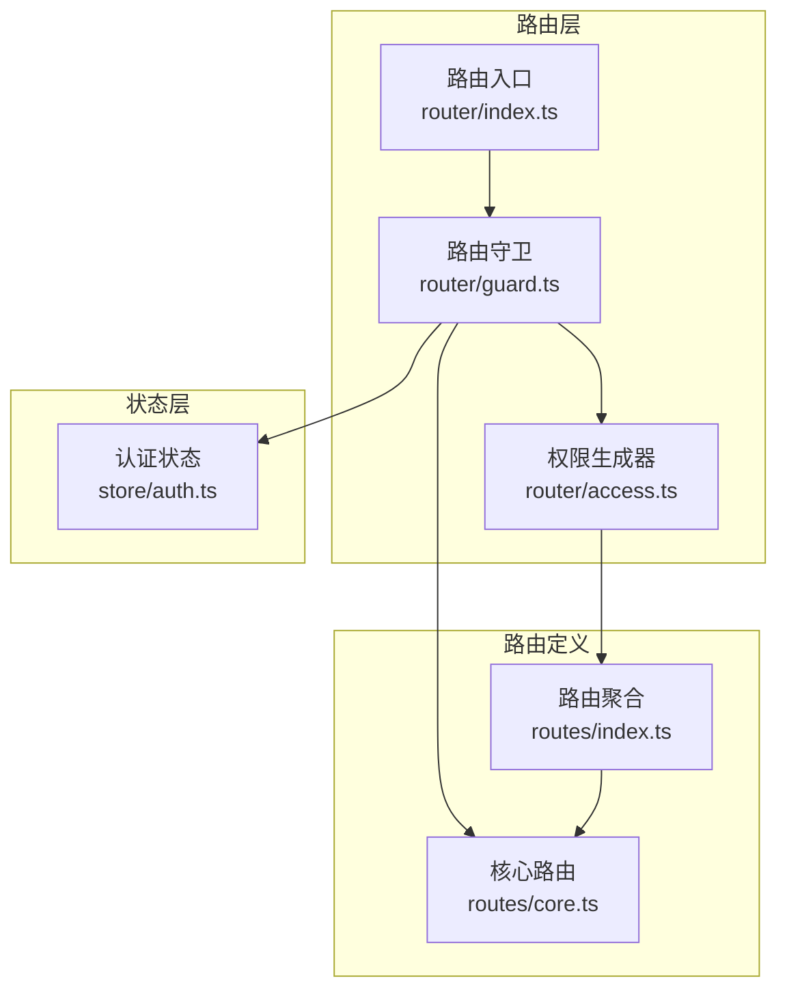
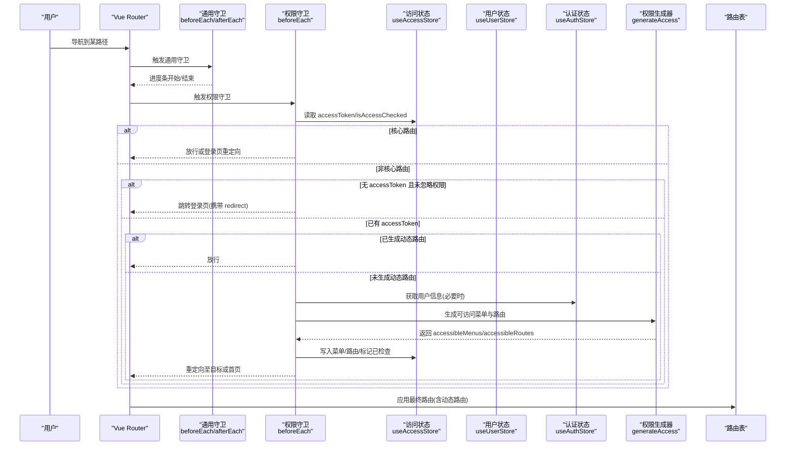
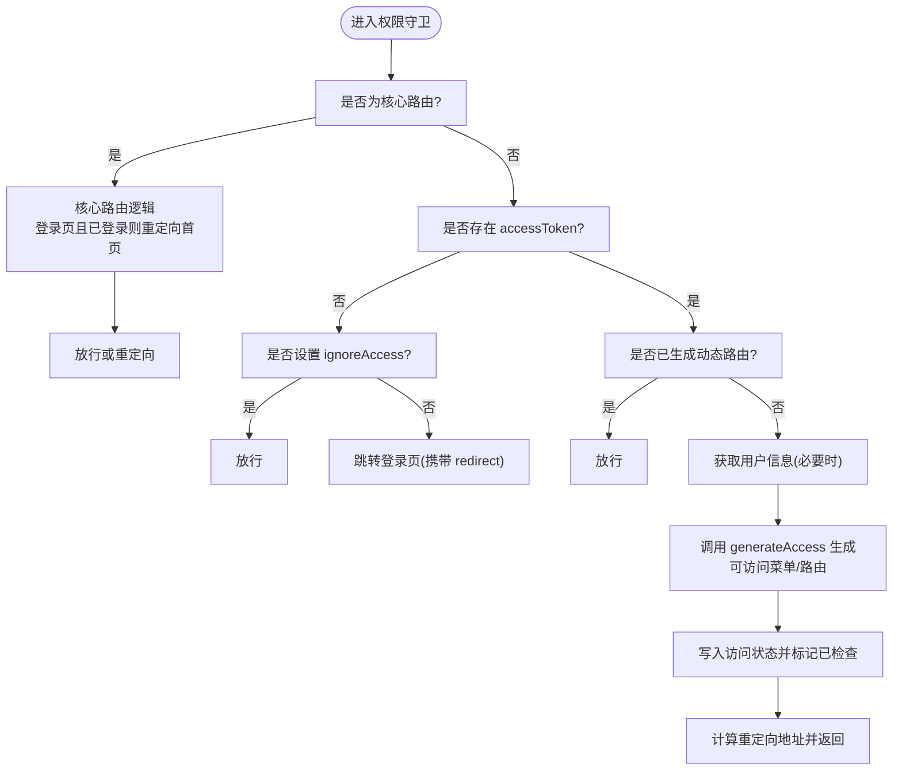
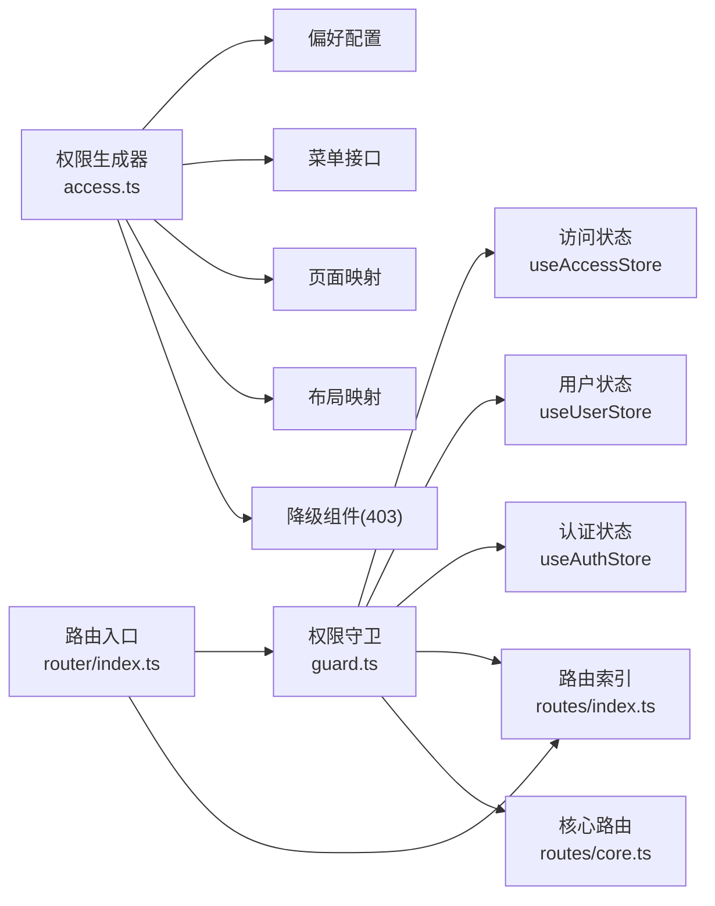

# 路由权限控制

<cite>
**本文引用的文件**
- [apps/web-naive/src/router/guard.ts](file://apps/web-naive/src/router/guard.ts)
- [apps/web-naive/src/router/access.ts](file://apps/web-naive/src/router/access.ts)
- [apps/web-naive/src/store/auth.ts](file://apps/web-naive/src/store/auth.ts)
- [apps/web-naive/src/router/index.ts](file://apps/web-naive/src/router/index.ts)
- [apps/web-naive/src/router/routes/core.ts](file://apps/web-naive/src/router/routes/core.ts)
- [apps/web-naive/src/router/routes/index.ts](file://apps/web-naive/src/router/routes/index.ts)
</cite>

## 目录

1. [简介](#简介)
2. [项目结构](#项目结构)
3. [核心组件](#核心组件)
4. [架构总览](#架构总览)
5. [详细组件分析](#详细组件分析)
6. [依赖关系分析](#依赖关系分析)
7. [性能考量](#性能考量)
8. [故障排查指南](#故障排查指南)
9. [结论](#结论)
10. [附录](#附录)

## 简介

本文件围绕 shiyu-ui 的路由权限控制能力进行系统化说明，重点覆盖以下方面：

- 路由守卫的实现机制：beforeEach 与 afterEach 钩子如何协同工作
- 权限验证流程：accessToken 检查、核心路由识别、权限拦截逻辑
- 技术实现细节：ignoreAccess 标志、权限检查状态管理、动态路由生成触发机制
- 路由权限与用户状态的关系：登录状态检查、用户信息获取、权限缓存策略
- 配置方法与自定义权限判断指南
- 调试技巧与常见问题解决方案

## 项目结构

与路由权限控制直接相关的核心文件分布如下：

- 路由守卫与入口：apps/web-naive/src/router/guard.ts、apps/web-naive/src/router/index.ts
- 权限生成与菜单/路由映射：apps/web-naive/src/router/access.ts
- 用户与认证状态：apps/web-naive/src/store/auth.ts
- 路由基础与核心路由：apps/web-naive/src/router/routes/core.ts、apps/web-naive/src/router/routes/index.ts

图表来源

- [apps/web-naive/src/router/index.ts:15-38](file://apps/web-naive/src/router/index.ts#L15-L38)
- [apps/web-naive/src/router/guard.ts:17-133](file://apps/web-naive/src/router/guard.ts#L17-L133)
- [apps/web-naive/src/router/access.ts:16-41](file://apps/web-naive/src/router/access.ts#L16-L41)
- [apps/web-naive/src/store/auth.ts:16-119](file://apps/web-naive/src/store/auth.ts#L16-L119)
- [apps/web-naive/src/router/routes/core.ts:23-98](file://apps/web-naive/src/router/routes/core.ts#L23-L98)
- [apps/web-naive/src/router/routes/index.ts:24-38](file://apps/web-naive/src/router/routes/index.ts#L24-L38)

章节来源

- [apps/web-naive/src/router/index.ts:15-38](file://apps/web-naive/src/router/index.ts#L15-L38)
- [apps/web-naive/src/router/routes/index.ts:24-38](file://apps/web-naive/src/router/routes/index.ts#L24-L38)

## 核心组件

- 路由守卫配置：统一注册通用守卫与权限访问守卫，负责页面加载进度、权限拦截与动态路由生成
- 权限生成器：基于访问模式与菜单接口，生成可访问菜单与路由，并处理无权限时的降级组件
- 认证状态管理：登录、登出、用户信息拉取与令牌存储，驱动权限检查与重定向
- 路由定义：核心路由（无需权限）与可访问路由（需权限），通过名称集合与合并策略参与守卫逻辑

章节来源

- [apps/web-naive/src/router/guard.ts:17-133](file://apps/web-naive/src/router/guard.ts#L17-L133)
- [apps/web-naive/src/router/access.ts:16-41](file://apps/web-naive/src/router/access.ts#L16-L41)
- [apps/web-naive/src/store/auth.ts:16-119](file://apps/web-naive/src/store/auth.ts#L16-L119)
- [apps/web-naive/src/router/routes/core.ts:23-98](file://apps/web-naive/src/router/routes/core.ts#L23-L98)
- [apps/web-naive/src/router/routes/index.ts:24-38](file://apps/web-naive/src/router/routes/index.ts#L24-L38)

## 架构总览

下图展示了从路由导航到权限拦截、动态路由生成与状态更新的整体流程。

图表来源

- [apps/web-naive/src/router/guard.ts:47-119](file://apps/web-naive/src/router/guard.ts#L47-L119)
- [apps/web-naive/src/router/access.ts:16-41](file://apps/web-naive/src/router/access.ts#L16-L41)
- [apps/web-naive/src/store/auth.ts:101-105](file://apps/web-naive/src/store/auth.ts#L101-L105)

## 详细组件分析

### 通用守卫（beforeEach/afterEach）

- beforeEach 负责：
  - 标记页面是否已加载（loadedPaths），避免重复执行切换动画等副作用
  - 在首次加载或非已加载页面时，按配置启动页面加载进度条
- afterEach 负责：
  - 标记当前页面为“已加载”
  - 结束页面加载进度条

章节来源

- [apps/web-naive/src/router/guard.ts:17-41](file://apps/web-naive/src/router/guard.ts#L17-L41)

### 权限访问守卫（beforeEach）

- 核心路由识别：
  - 通过核心路由名称集合 coreRouteNames 快速识别是否为无需权限的核心路由
  - 若命中核心路由且当前为登录页且已持有 accessToken，则自动重定向至用户首页或默认首页
- accessToken 检查与 ignoreAccess：
  - 若未持有 accessToken 且目标路由未设置 ignoreAccess，则跳转登录页，并携带 redirect 参数以便登录后回跳
  - 若设置了 ignoreAccess，则直接放行
- 动态路由生成触发与状态管理：
  - 若尚未生成动态路由（isAccessChecked 为 false），则根据用户角色生成可访问菜单与路由
  - 将生成结果写入访问状态，并标记已检查
  - 依据来源或目标路径计算重定向地址，确保登录后回到正确页面

图表来源

- [apps/web-naive/src/router/guard.ts:47-119](file://apps/web-naive/src/router/guard.ts#L47-L119)

章节来源

- [apps/web-naive/src/router/guard.ts:47-119](file://apps/web-naive/src/router/guard.ts#L47-L119)

### 权限生成器（generateAccess）

- 作用：
  - 基于访问模式与菜单接口，生成可访问菜单与路由
  - 提供无权限时的降级组件（如 403）
  - 绑定布局与页面映射，保证渲染一致性
- 关键点：
  - 通过偏好配置选择访问模式
  - 异步加载菜单列表并展示加载提示
  - 返回 accessibleMenus 与 accessibleRoutes，供守卫写入状态并应用

章节来源

- [apps/web-naive/src/router/access.ts:16-41](file://apps/web-naive/src/router/access.ts#L16-L41)

### 认证状态（useAuthStore）

- 登录流程：
  - 调用登录接口获取 accessToken
  - 并行获取用户信息与访问码，写入用户状态与访问状态
  - 登录成功后根据用户首页或默认首页进行路由跳转
- 登出流程：
  - 调用登出接口（忽略异常）
  - 重置全部状态，清除登录过期标记
  - 重定向到登录页并携带当前路径参数，便于登录后回跳

章节来源

- [apps/web-naive/src/store/auth.ts:28-79](file://apps/web-naive/src/store/auth.ts#L28-L79)
- [apps/web-naive/src/store/auth.ts:81-99](file://apps/web-naive/src/store/auth.ts#L81-L99)

### 路由定义与核心路由

- 核心路由（无需权限）：
  - 根路由与认证相关路由（登录、扫码登录、忘记密码、注册等）
  - 通过名称集合 coreRouteNames 参与守卫快速分流
- 路由聚合：
  - 合并核心路由、外部路由与兜底 404 路由
  - accessRoutes 由动态路由与静态路由构成，参与权限生成

章节来源

- [apps/web-naive/src/router/routes/core.ts:23-98](file://apps/web-naive/src/router/routes/core.ts#L23-L98)
- [apps/web-naive/src/router/routes/index.ts:24-38](file://apps/web-naive/src/router/routes/index.ts#L24-L38)

## 依赖关系分析

- 守卫对状态与路由的依赖：
  - 读取访问状态（accessToken、isAccessChecked、菜单/路由缓存）
  - 读取用户状态（用户信息、角色、首页路径）
  - 读取认证状态（登录/登出、用户信息拉取）
  - 依赖核心路由名称集合与可访问路由列表
- 权限生成器对配置与资源的依赖：
  - 偏好配置（访问模式）
  - 菜单接口与本地组件映射（pageMap/layoutMap）
  - 降级组件（403 页面）

图表来源

- [apps/web-naive/src/router/guard.ts:47-119](file://apps/web-naive/src/router/guard.ts#L47-L119)
- [apps/web-naive/src/router/access.ts:16-41](file://apps/web-naive/src/router/access.ts#L16-L41)
- [apps/web-naive/src/router/routes/index.ts:24-38](file://apps/web-naive/src/router/routes/index.ts#L24-L38)
- [apps/web-naive/src/router/routes/core.ts:23-98](file://apps/web-naive/src/router/routes/core.ts#L23-L98)
- [apps/web-naive/src/router/index.ts:15-38](file://apps/web-naive/src/router/index.ts#L15-L38)

章节来源

- [apps/web-naive/src/router/guard.ts:47-119](file://apps/web-naive/src/router/guard.ts#L47-L119)
- [apps/web-naive/src/router/access.ts:16-41](file://apps/web-naive/src/router/access.ts#L16-L41)
- [apps/web-naive/src/router/routes/index.ts:24-38](file://apps/web-naive/src/router/routes/index.ts#L24-L38)
- [apps/web-naive/src/router/routes/core.ts:23-98](file://apps/web-naive/src/router/routes/core.ts#L23-L98)
- [apps/web-naive/src/router/index.ts:15-38](file://apps/web-naive/src/router/index.ts#L15-L38)

## 性能考量

- 避免重复加载与动画抖动：通过 loadedPaths 标记已加载页面，配合通用守卫的进度条控制，减少不必要的渲染与过渡
- 动态路由仅生成一次：通过 isAccessChecked 标记，确保在用户登录后只生成一次动态路由，降低重复开销
- 并行拉取用户信息与访问码：在登录成功后并行请求用户信息与访问码，缩短首屏等待时间
- 菜单异步加载与提示：权限生成器在拉取菜单时展示加载提示，改善用户体验

章节来源

- [apps/web-naive/src/router/guard.ts:17-41](file://apps/web-naive/src/router/guard.ts#L17-L41)
- [apps/web-naive/src/router/guard.ts:88-118](file://apps/web-naive/src/router/guard.ts#L88-L118)
- [apps/web-naive/src/store/auth.ts:44-47](file://apps/web-naive/src/store/auth.ts#L44-L47)
- [apps/web-naive/src/router/access.ts:26-30](file://apps/web-naive/src/router/access.ts#L26-L30)

## 故障排查指南

- 登录后仍被重定向到登录页
  - 检查 accessToken 是否正确写入访问状态
  - 确认 ignoreAccess 未错误设置导致放行
  - 排查 isAccessChecked 是否被意外重置
- 登录成功但页面空白或路由不生效
  - 确认动态路由生成是否完成（accessibleMenus/accessibleRoutes 是否写入）
  - 检查路由重定向逻辑是否正确计算了 redirect 地址
- 403 页面未出现
  - 检查权限生成器的降级组件配置
  - 确认访问模式与菜单接口返回的权限数据一致
- 登录页循环跳转
  - 检查核心路由中的登录页重定向逻辑与默认首页配置
  - 确认 redirect 参数是否正确传递与解析

章节来源

- [apps/web-naive/src/router/guard.ts:54-86](file://apps/web-naive/src/router/guard.ts#L54-L86)
- [apps/web-naive/src/router/guard.ts:98-118](file://apps/web-naive/src/router/guard.ts#L98-L118)
- [apps/web-naive/src/router/access.ts:16-41](file://apps/web-naive/src/router/access.ts#L16-L41)
- [apps/web-naive/src/store/auth.ts:59-62](file://apps/web-naive/src/store/auth.ts#L59-L62)

## 结论

本项目的路由权限控制通过“通用守卫 + 权限守卫”的双层设计，结合访问状态与用户状态，实现了对核心路由与受控路由的精细化控制。其关键特性包括：

- 核心路由无需权限，提升登录体验
- accessToken 与 ignoreAccess 双重开关保障灵活放行
- 动态路由仅生成一次，兼顾安全与性能
- 登录成功后的回跳与首页重定向逻辑清晰可靠

## 附录

### 配置方法与最佳实践

- 核心路由与可访问路由的划分
  - 将登录、扫码登录、忘记密码、注册等路由归为核心路由，无需权限拦截
  - 将业务模块路由归为可访问路由，交由权限守卫与权限生成器处理
- ignoreAccess 的使用场景
  - 对于无需权限但又希望绕过拦截的页面（如公开公告页），可在 meta 中设置 ignoreAccess
- 访问模式与菜单接口
  - 通过偏好配置选择访问模式，确保权限生成器能正确拉取菜单并生成路由
- 登录成功后的回跳策略
  - 使用 redirect 参数记录原目标页面，登录后通过 replace 重定向，避免历史栈污染

章节来源

- [apps/web-naive/src/router/routes/core.ts:23-98](file://apps/web-naive/src/router/routes/core.ts#L23-L98)
- [apps/web-naive/src/router/routes/index.ts:24-38](file://apps/web-naive/src/router/routes/index.ts#L24-L38)
- [apps/web-naive/src/router/guard.ts:68-86](file://apps/web-naive/src/router/guard.ts#L68-L86)
- [apps/web-naive/src/router/access.ts:24-37](file://apps/web-naive/src/router/access.ts#L24-L37)
- [apps/web-naive/src/store/auth.ts:59-62](file://apps/web-naive/src/store/auth.ts#L59-L62)
