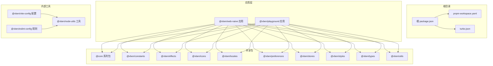
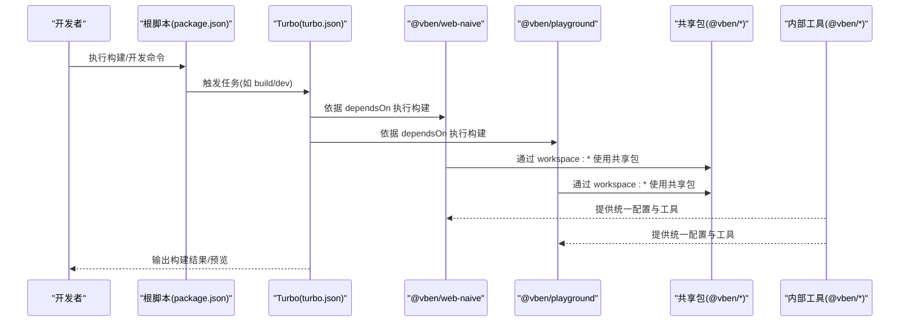
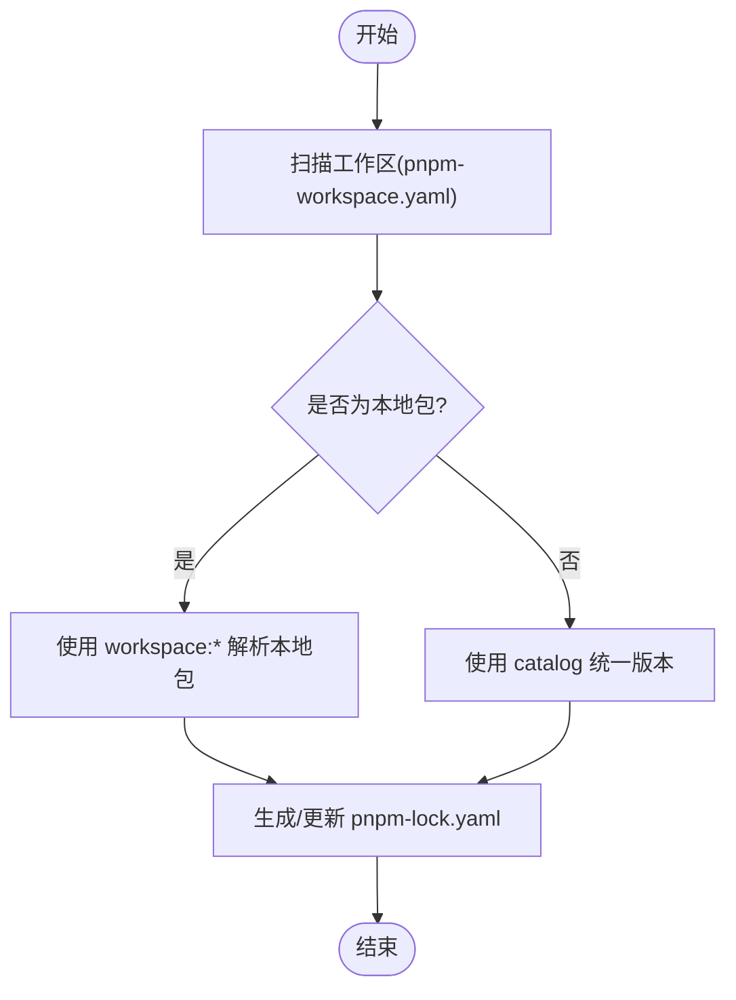
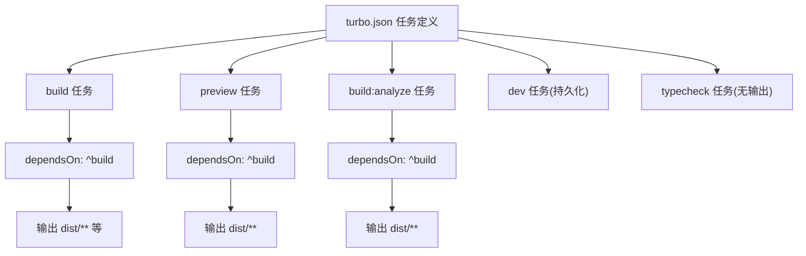
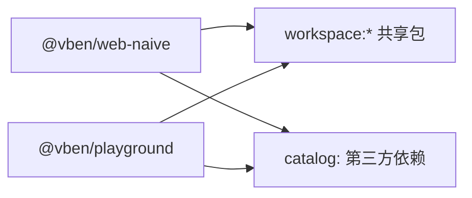
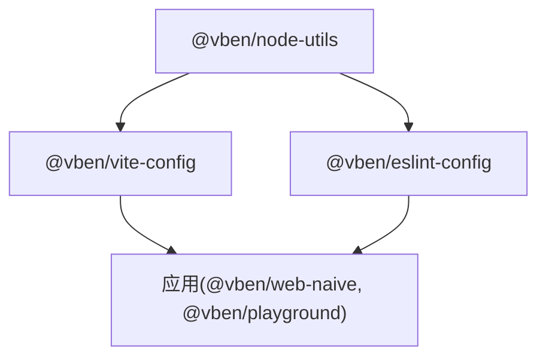
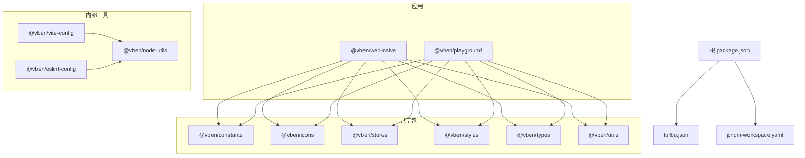

# Monorepo 架构设计

<cite>
**本文档引用的文件**
- [package.json](file://package.json)
- [pnpm-workspace.yaml](file://pnpm-workspace.yaml)
- [turbo.json](file://turbo.json)
- [README.md](file://README.md)
- [internal/node-utils/package.json](file://internal/node-utils/package.json)
- [apps/web-naive/package.json](file://apps/web-naive/package.json)
- [playground/package.json](file://playground/package.json)
- [internal/vite-config/package.json](file://internal/vite-config/package.json)
- [internal/lint-configs/eslint-config/package.json](file://internal/lint-configs/eslint-config/package.json)
</cite>

## 目录

1. [引言](#引言)
2. [项目结构](#项目结构)
3. [核心组件](#核心组件)
4. [架构总览](#架构总览)
5. [详细组件分析](#详细组件分析)
6. [依赖关系分析](#依赖关系分析)
7. [性能考虑](#性能考虑)
8. [故障排除指南](#故障排除指南)
9. [结论](#结论)
10. [附录](#附录)

## 引言

本项目采用 Monorepo 架构，围绕 shiyu-ui 生态进行统一管理与交付。通过 pnpm workspace 实现多包协同开发与依赖复用，借助 Turbo 进行任务编排与缓存加速，结合 Changesets 实现版本与发布流程自动化。整体目标是实现代码共享、依赖集中治理、构建优化与一致的开发体验。

## 项目结构

Monorepo 采用按功能域与职责分层的组织方式：

- apps：应用层（如 web-naive、playground 等）
- packages：共享包集合（如 @core、constants、effects、icons、locales、preferences、stores、styles、types、utils 等）
- internal：内部工具与配置包（如 node-utils、vite-config、lint-configs 等）
- scripts：脚本与工具（如部署、turbo-run、vsh 等）
- 根级配置：package.json、pnpm-workspace.yaml、turbo.json 等

图表来源

- [package.json:1-110](file://package.json#L1-L110)
- [pnpm-workspace.yaml:1-192](file://pnpm-workspace.yaml#L1-L192)
- [turbo.json:1-49](file://turbo.json#L1-L49)
- [apps/web-naive/package.json:1-51](file://apps/web-naive/package.json#L1-L51)
- [playground/package.json:1-63](file://playground/package.json#L1-L63)
- [internal/vite-config/package.json:1-61](file://internal/vite-config/package.json#L1-L61)
- [internal/lint-configs/eslint-config/package.json:1-48](file://internal/lint-configs/eslint-config/package.json#L1-L48)

章节来源

- [package.json:1-110](file://package.json#L1-L110)
- [pnpm-workspace.yaml:1-192](file://pnpm-workspace.yaml#L1-L192)
- [turbo.json:1-49](file://turbo.json#L1-L49)

## 核心组件

- 包管理与工作区：通过 pnpm workspace 将多个包纳入同一管理范围，支持 workspace:\* 本地依赖解析与 catalog 版本统一。
- 构建与任务编排：Turbo 负责任务依赖拓扑、增量构建与缓存；根脚本统一入口，按包过滤执行。
- 内部工具与配置：@vben/node-utils 提供通用 Node 工具；@vben/vite-config 提供统一 Vite 配置；@vben/eslint-config 提供统一代码规范。
- 应用与示例：web-naive 与 playground 作为示例应用，演示共享包的使用与集成。

章节来源

- [package.json:27-67](file://package.json#L27-L67)
- [pnpm-workspace.yaml:1-192](file://pnpm-workspace.yaml#L1-L192)
- [turbo.json:15-47](file://turbo.json#L15-L47)
- [internal/node-utils/package.json:1-43](file://internal/node-utils/package.json#L1-L43)
- [internal/vite-config/package.json:1-61](file://internal/vite-config/package.json#L1-L61)
- [internal/lint-configs/eslint-config/package.json:1-48](file://internal/lint-configs/eslint-config/package.json#L1-L48)
- [apps/web-naive/package.json:28-49](file://apps/web-naive/package.json#L28-L49)
- [playground/package.json:31-57](file://playground/package.json#L31-L57)

## 架构总览

下图展示 Monorepo 的核心交互：根脚本驱动 Turbo 执行任务，Turbo 按任务定义与依赖拓扑调度各包构建；共享包通过 workspace:\* 注入到应用；内部工具包为应用与共享包提供统一配置与能力。

图表来源

- [package.json:27-67](file://package.json#L27-L67)
- [turbo.json:15-47](file://turbo.json#L15-L47)
- [apps/web-naive/package.json:28-49](file://apps/web-naive/package.json#L28-L49)
- [playground/package.json:31-57](file://playground/package.json#L31-L57)
- [internal/vite-config/package.json:29-59](file://internal/vite-config/package.json#L29-L59)
- [internal/lint-configs/eslint-config/package.json:29-46](file://internal/lint-configs/eslint-config/package.json#L29-L46)

## 详细组件分析

### 包管理策略：pnpm workspace 与 catalog

- 工作区扫描：通过 pnpm-workspace.yaml 声明包含 internal/_、packages/_、apps/_、scripts/_ 等路径，确保所有包被纳入工作区。
- 本地依赖：应用与共享包通过 workspace:\* 解析本地包，避免重复安装与版本不一致。
- 统一版本：通过 catalog 字段统一管理第三方依赖版本，减少锁文件冲突并提升一致性。
- 覆盖规则：overrides 中对特定包版本进行覆盖，保证兼容性与安全性。

图表来源

- [pnpm-workspace.yaml:1-192](file://pnpm-workspace.yaml#L1-L192)

章节来源

- [pnpm-workspace.yaml:1-192](file://pnpm-workspace.yaml#L1-L192)

### 构建系统：Turbo 任务编排

- 全局依赖：globalDependencies 指定影响任务的全局文件（如 tsconfig、vite 配置、脚本等），确保变更触发正确重建。
- 任务定义：build、preview、build:analyze、dev、typecheck 等任务按需配置输出目录与缓存策略。
- 依赖拓扑：通过 dependsOn 定义包间构建顺序，实现增量构建与缓存命中。
- 持久化与缓存：dev 任务持久化运行，typecheck 无输出以支持类型检查独立任务。

图表来源

- [turbo.json:15-47](file://turbo.json#L15-L47)

章节来源

- [turbo.json:1-49](file://turbo.json#L1-L49)

### 应用层：web-naive 与 playground

- 应用脚本：提供 dev、build、preview、typecheck 等常用脚本，统一开发体验。
- 依赖组织：通过 workspace:_ 引入 @vben/_ 共享包，同时引入 catalog 中的第三方依赖，保证版本一致性。
- 导入别名：使用 imports 映射 #/_ 到 src/_，简化导入路径。

图表来源

- [apps/web-naive/package.json:18-49](file://apps/web-naive/package.json#L18-L49)
- [playground/package.json:18-57](file://playground/package.json#L18-L57)

章节来源

- [apps/web-naive/package.json:1-51](file://apps/web-naive/package.json#L1-L51)
- [playground/package.json:1-63](file://playground/package.json#L1-L63)

### 内部工具与配置：node-utils、vite-config、eslint-config

- @vben/node-utils：提供通用 Node 工具与构建辅助，供内部工具与脚本使用。
- @vben/vite-config：封装统一的 Vite 配置与插件组合，供应用与内部工具使用。
- @vben/eslint-config：提供统一的 ESLint 规则集，结合 @vben/oxlint-config 等形成完整规范体系。

图表来源

- [internal/node-utils/package.json:1-43](file://internal/node-utils/package.json#L1-L43)
- [internal/vite-config/package.json:1-61](file://internal/vite-config/package.json#L1-L61)
- [internal/lint-configs/eslint-config/package.json:1-48](file://internal/lint-configs/eslint-config/package.json#L1-L48)

章节来源

- [internal/node-utils/package.json:1-43](file://internal/node-utils/package.json#L1-L43)
- [internal/vite-config/package.json:1-61](file://internal/vite-config/package.json#L1-L61)
- [internal/lint-configs/eslint-config/package.json:1-48](file://internal/lint-configs/eslint-config/package.json#L1-L48)

### 共享包设计原则与组织方式

- 单一职责：每个共享包聚焦于特定领域（如常量、样式、类型、工具等），便于复用与维护。
- 本地依赖：应用通过 workspace:\* 引用共享包，避免重复安装与版本漂移。
- 版本对齐：通过 catalog 统一第三方依赖版本，确保跨包一致性。
- 可测试性：共享包应提供清晰的导出与类型定义，便于在应用中使用与 IDE 支持。

章节来源

- [apps/web-naive/package.json:28-49](file://apps/web-naive/package.json#L28-L49)
- [playground/package.json:31-57](file://playground/package.json#L31-L57)
- [pnpm-workspace.yaml:16-192](file://pnpm-workspace.yaml#L16-L192)

## 依赖关系分析

- 包间依赖：应用层依赖共享包；内部工具层依赖 node-utils；vite-config 与 eslint-config 为上层提供配置能力。
- 外部依赖：通过 catalog 统一版本，减少冲突；overrides 用于关键包的强制覆盖。
- 任务依赖：Turbo 依据 dependsOn 建立构建拓扑，确保上游包先于下游包完成构建。

图表来源

- [package.json:1-110](file://package.json#L1-L110)
- [turbo.json:1-49](file://turbo.json#L1-L49)
- [pnpm-workspace.yaml:1-192](file://pnpm-workspace.yaml#L1-L192)
- [apps/web-naive/package.json:28-49](file://apps/web-naive/package.json#L28-L49)
- [playground/package.json:31-57](file://playground/package.json#L31-L57)
- [internal/vite-config/package.json:29-59](file://internal/vite-config/package.json#L29-L59)
- [internal/lint-configs/eslint-config/package.json:29-46](file://internal/lint-configs/eslint-config/package.json#L29-L46)

章节来源

- [package.json:1-110](file://package.json#L1-L110)
- [turbo.json:1-49](file://turbo.json#L1-L49)
- [pnpm-workspace.yaml:1-192](file://pnpm-workspace.yaml#L1-L192)

## 性能考虑

- 增量构建：Turbo 基于任务图与缓存实现增量构建，减少不必要的重复工作。
- 任务隔离：通过 outputs 与 globalDependencies 精准控制缓存失效范围。
- 依赖复用：workspace:\* 降低重复安装成本，提高安装与构建速度。
- 并行执行：在满足依赖约束的前提下最大化并行度，缩短整体构建时间。

## 故障排除指南

- 依赖冲突：优先检查 pnpm-workspace.yaml 与 catalog 配置，确保版本对齐与覆盖规则合理。
- 构建失败：查看 turbo.json 中对应任务的 dependsOn 与 outputs 配置，确认上游包已成功构建。
- 类型检查：使用根脚本中的 typecheck 任务独立运行，定位类型问题。
- 开发模式：dev 任务持久化且不缓存，若出现异常可重启以清除状态。

章节来源

- [turbo.json:15-47](file://turbo.json#L15-L47)
- [package.json:39-43](file://package.json#L39-L43)

## 结论

本 Monorepo 通过 pnpm workspace 与 Turbo 的协同，实现了高效的多包管理与构建编排。配合 catalog 的版本统一与内部工具包的标准化，显著提升了代码复用、依赖治理与开发效率。建议在后续迭代中持续完善共享包边界与文档，强化变更管理与发布流程。

## 附录

- 快速开始：参考根 README 的安装与使用说明，确保 Node 与 pnpm 版本满足要求。
- 常用脚本：通过根脚本统一执行开发、构建、预览与测试等任务。

章节来源

- [README.md:55-82](file://README.md#L55-L82)
- [package.json:27-67](file://package.json#L27-L67)
