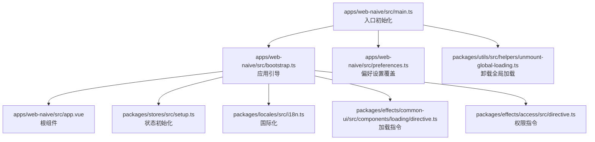
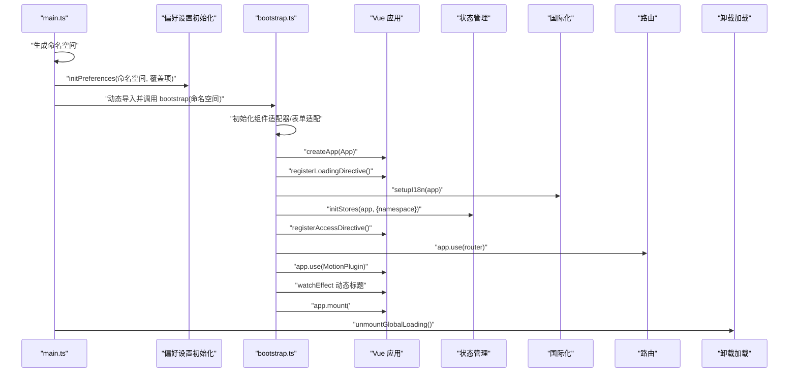
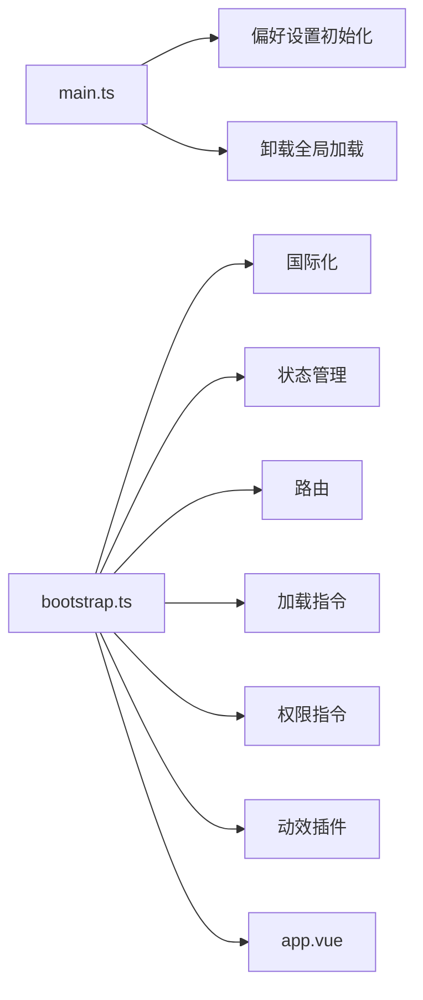

# 应用入口流程

<cite>
**本文引用的文件**
- [apps/web-naive/src/main.ts](file://apps/web-naive/src/main.ts)
- [apps/web-naive/src/bootstrap.ts](file://apps/web-naive/src/bootstrap.ts)
- [apps/web-naive/src/preferences.ts](file://apps/web-naive/src/preferences.ts)
- [apps/web-naive/src/app.vue](file://apps/web-naive/src/app.vue)
- [packages/utils/src/helpers/unmount-global-loading.ts](file://packages/utils/src/helpers/unmount-global-loading.ts)
- [packages/effects/common-ui/src/components/loading/directive.ts](file://packages/effects/common-ui/src/components/loading/directive.ts)
- [packages/effects/access/src/directive.ts](file://packages/effects/access/src/directive.ts)
- [packages/stores/src/setup.ts](file://packages/stores/src/setup.ts)
- [packages/locales/src/i18n.ts](file://packages/locales/src/i18n.ts)
- [playground/src/main.ts](file://playground/src/main.ts)
- [playground/src/bootstrap.ts](file://playground/src/bootstrap.ts)
- [playground/src/app.vue](file://playground/src/app.vue)
</cite>

## 目录

1. [简介](#简介)
2. [项目结构](#项目结构)
3. [核心组件](#核心组件)
4. [架构总览](#架构总览)
5. [详细组件分析](#详细组件分析)
6. [依赖关系分析](#依赖关系分析)
7. [性能考量](#性能考量)
8. [故障排查指南](#故障排查指南)
9. [结论](#结论)

## 简介

本文件聚焦于 shiyu-ui 项目中应用入口的初始化流程，从 main.ts 到 bootstrap.ts 的完整启动序列。内容涵盖：

- 应用偏好设置的初始化与命名空间生成
- bootstrap 函数的职责与执行顺序（应用启动、模块加载、挂载）
- Vue 应用实例的创建与配置要点
- 全局加载状态的管理机制（加载动画的显示与隐藏时机）
- 调试方法与常见问题排查

## 项目结构

本次分析涉及两个 Web 应用示例：web-naive 与 playground。两者均遵循相同的入口初始化模式：

- main.ts：负责环境识别、命名空间生成、偏好设置初始化、异步加载并调用 bootstrap、最后卸载全局加载动画
- bootstrap.ts：负责组件适配器、表单适配、指令注册、国际化、状态管理、路由、插件安装、动态标题、最终挂载到 DOM
- preferences.ts：覆盖项目级偏好设置
- app.vue：根组件，承载主题、语言、通知等 Provider

图表来源

- [apps/web-naive/src/main.ts:1-32](file://apps/web-naive/src/main.ts#L1-L32)
- [apps/web-naive/src/bootstrap.ts:1-77](file://apps/web-naive/src/bootstrap.ts#L1-L77)
- [apps/web-naive/src/preferences.ts:1-17](file://apps/web-naive/src/preferences.ts#L1-L17)
- [apps/web-naive/src/app.vue:1-57](file://apps/web-naive/src/app.vue#L1-L57)
- [packages/stores/src/setup.ts:1-82](file://packages/stores/src/setup.ts#L1-L82)
- [packages/locales/src/i18n.ts:1-148](file://packages/locales/src/i18n.ts#L1-L148)
- [packages/effects/common-ui/src/components/loading/directive.ts:1-133](file://packages/effects/common-ui/src/components/loading/directive.ts#L1-L133)
- [packages/effects/access/src/directive.ts:1-43](file://packages/effects/access/src/directive.ts#L1-L43)
- [packages/utils/src/helpers/unmount-global-loading.ts:1-32](file://packages/utils/src/helpers/unmount-global-loading.ts#L1-L32)

章节来源

- [apps/web-naive/src/main.ts:1-32](file://apps/web-naive/src/main.ts#L1-L32)
- [apps/web-naive/src/bootstrap.ts:1-77](file://apps/web-naive/src/bootstrap.ts#L1-L77)
- [apps/web-naive/src/preferences.ts:1-17](file://apps/web-naive/src/preferences.ts#L1-L17)
- [apps/web-naive/src/app.vue:1-57](file://apps/web-naive/src/app.vue#L1-L57)

## 核心组件

- 命名空间生成与偏好设置
  - main.ts 中根据环境变量与版本号生成命名空间，并调用偏好设置初始化函数，传入覆盖项与命名空间
  - 偏好设置覆盖项定义了应用名称、登录过期处理模式、访问模式等
- 异步引导与挂载
  - main.ts 异步导入 bootstrap 并传入命名空间，随后卸载全局加载动画
  - bootstrap.ts 内部创建 Vue 应用实例，依次注册指令、国际化、状态、路由、插件，动态更新标题，最终挂载
- 全局加载状态管理
  - 通过统一的卸载函数在应用启动完成后隐藏并移除全局加载元素，避免闪烁

章节来源

- [apps/web-naive/src/main.ts:9-31](file://apps/web-naive/src/main.ts#L9-L31)
- [apps/web-naive/src/preferences.ts:8-16](file://apps/web-naive/src/preferences.ts#L8-L16)
- [apps/web-naive/src/bootstrap.ts:19-74](file://apps/web-naive/src/bootstrap.ts#L19-L74)
- [packages/utils/src/helpers/unmount-global-loading.ts:8-31](file://packages/utils/src/helpers/unmount-global-loading.ts#L8-L31)

## 架构总览

下图展示了从入口到挂载的关键交互路径，以及各子系统的职责边界。

图表来源

- [apps/web-naive/src/main.ts:9-31](file://apps/web-naive/src/main.ts#L9-L31)
- [apps/web-naive/src/bootstrap.ts:19-74](file://apps/web-naive/src/bootstrap.ts#L19-L74)
- [packages/stores/src/setup.ts:42-70](file://packages/stores/src/setup.ts#L42-L70)
- [packages/locales/src/i18n.ts:102-117](file://packages/locales/src/i18n.ts#L102-L117)
- [packages/effects/common-ui/src/components/loading/directive.ts:107-132](file://packages/effects/common-ui/src/components/loading/directive.ts#L107-L132)
- [packages/effects/access/src/directive.ts:40-42](file://packages/effects/access/src/directive.ts#L40-L42)
- [packages/utils/src/helpers/unmount-global-loading.ts:8-31](file://packages/utils/src/helpers/unmount-global-loading.ts#L8-L31)

## 详细组件分析

### 命名空间生成与偏好设置初始化

- 命名空间策略
  - 由环境标识、应用版本与环境类型拼接而成，确保多版本/多环境下的偏好设置与持久化数据隔离
- 偏好设置覆盖
  - 仅覆盖项目所需配置，未覆盖项沿用默认值
  - 包含应用名称、登录过期处理模式、访问模式等
- 初始化流程
  - main.ts 调用偏好设置初始化函数，传入命名空间与覆盖项
  - playground 示例还支持扩展项，便于更灵活的配置合并

章节来源

- [apps/web-naive/src/main.ts:12-20](file://apps/web-naive/src/main.ts#L12-L20)
- [apps/web-naive/src/preferences.ts:8-16](file://apps/web-naive/src/preferences.ts#L8-L16)
- [playground/src/main.ts:16-21](file://playground/src/main.ts#L16-L21)

### bootstrap 函数职责与执行流程

- 组件与表单适配器初始化
  - 初始化组件适配器与表单适配，为 UI 组件与表单控件提供统一能力
- 指令注册
  - 注册加载指令与权限指令，增强组件层面的加载与权限控制能力
- 国际化配置
  - 创建并挂载国际化实例，按需加载语言包与消息
- 状态管理初始化
  - 基于命名空间创建持久化存储策略，区分不同应用或版本的数据键
- 插件安装
  - 安装动效插件等扩展能力
- 路由与导航
  - 安装路由与守卫，确保导航一致性
- 动态标题
  - 基于当前路由元信息与偏好设置动态更新页面标题
- 应用挂载
  - 将 Vue 实例挂载至 DOM

章节来源

- [apps/web-naive/src/bootstrap.ts:19-74](file://apps/web-naive/src/bootstrap.ts#L19-L74)
- [packages/stores/src/setup.ts:42-70](file://packages/stores/src/setup.ts#L42-L70)
- [packages/locales/src/i18n.ts:102-117](file://packages/locales/src/i18n.ts#L102-L117)
- [packages/effects/common-ui/src/components/loading/directive.ts:107-132](file://packages/effects/common-ui/src/components/loading/directive.ts#L107-L132)
- [packages/effects/access/src/directive.ts:40-42](file://packages/effects/access/src/directive.ts#L40-L42)

### Vue 应用实例创建与配置

- 实例创建
  - 使用根组件创建 Vue 应用实例
- Provider 与主题
  - web-naive 示例通过配置提供者组合主题、语言与通知等上下文
  - playground 示例通过设计令牌与主题算法提供统一的主题体验
- 挂载点
  - 最终挂载到页面中的占位元素

章节来源

- [apps/web-naive/src/bootstrap.ts:35-73](file://apps/web-naive/src/bootstrap.ts#L35-L73)
- [apps/web-naive/src/app.vue:42-56](file://apps/web-naive/src/app.vue#L42-L56)
- [playground/src/app.vue:33-39](file://playground/src/app.vue#L33-L39)

### 全局加载状态管理机制

- 显示时机
  - HTML 中预先注入全局加载元素，保证首屏渲染前可见
- 隐藏与移除
  - 应用初始化完成后，调用卸载函数隐藏并移除加载元素
  - 通过过渡动画避免突兀切换，提升用户体验
- 注入式加载元素
  - 指令会在目标容器上渲染注入式加载元素，随容器移除而清理

章节来源

- [packages/utils/src/helpers/unmount-global-loading.ts:8-31](file://packages/utils/src/helpers/unmount-global-loading.ts#L8-L31)
- [packages/effects/common-ui/src/components/loading/directive.ts:14-28](file://packages/effects/common-ui/src/components/loading/directive.ts#L14-L28)

### playground 与 web-naive 的差异点

- 插件生态
  - playground 示例额外安装查询插件与时区初始化，体现更丰富的运行时能力
- 插件全局配置
  - playground 通过提供插件选项，将表单适配器注入到插件体系中
- 主题与 Provider
  - playground 使用设计令牌与主题算法，提供紧凑模式等高级配置

章节来源

- [playground/src/bootstrap.ts:21-88](file://playground/src/bootstrap.ts#L21-L88)
- [playground/src/main.ts:9-30](file://playground/src/main.ts#L9-L30)
- [playground/src/app.vue:13-30](file://playground/src/app.vue#L13-L30)

## 依赖关系分析

- 入口层依赖
  - main.ts 依赖偏好设置初始化与全局加载卸载工具
- 引导层依赖
  - bootstrap.ts 依赖指令注册、国际化、状态管理、路由、插件与根组件
- 子系统耦合
  - 状态管理与命名空间强相关，确保多应用/多版本隔离
  - 国际化与指令注册相互独立，但共同服务于 UI 层

图表来源

- [apps/web-naive/src/main.ts:1-31](file://apps/web-naive/src/main.ts#L1-L31)
- [apps/web-naive/src/bootstrap.ts:1-74](file://apps/web-naive/src/bootstrap.ts#L1-L74)
- [packages/stores/src/setup.ts:1-82](file://packages/stores/src/setup.ts#L1-L82)
- [packages/locales/src/i18n.ts:1-148](file://packages/locales/src/i18n.ts#L1-L148)
- [packages/effects/common-ui/src/components/loading/directive.ts:1-133](file://packages/effects/common-ui/src/components/loading/directive.ts#L1-L133)
- [packages/effects/access/src/directive.ts:1-43](file://packages/effects/access/src/directive.ts#L1-L43)

章节来源

- [apps/web-naive/src/main.ts:1-31](file://apps/web-naive/src/main.ts#L1-L31)
- [apps/web-naive/src/bootstrap.ts:1-74](file://apps/web-naive/src/bootstrap.ts#L1-L74)

## 性能考量

- 加载动画优化
  - 通过过渡动画隐藏加载元素，减少视觉闪烁
- 指令渲染开销
  - 注入式加载指令在挂载/更新时进行最小化渲染与更新，避免不必要的重绘
- 国际化按需加载
  - 语言包按需加载，降低初始包体
- 状态持久化
  - 基于命名空间的持久化键，避免跨应用/版本数据污染；开发与生产采用不同存储介质以平衡易用性与安全性

## 故障排查指南

- 偏好设置未生效
  - 确认命名空间正确生成且与覆盖项一致
  - 清理浏览器缓存后重试，避免旧缓存导致配置不更新
- 加载动画不消失
  - 检查是否在应用初始化完成后调用了卸载函数
  - 确认全局加载元素存在且具备过渡动画类
- 权限指令无效
  - 检查指令是否已注册，以及绑定值与访问模式是否匹配
- 国际化语言未切换
  - 确认语言包加载成功，且语言键存在于对应目录
- 状态持久化异常
  - 检查命名空间是否与初始化时一致，确认加密密钥与存储介质配置正确

章节来源

- [apps/web-naive/src/main.ts:12-20](file://apps/web-naive/src/main.ts#L12-L20)
- [packages/utils/src/helpers/unmount-global-loading.ts:8-31](file://packages/utils/src/helpers/unmount-global-loading.ts#L8-L31)
- [packages/effects/access/src/directive.ts:11-30](file://packages/effects/access/src/directive.ts#L11-L30)
- [packages/locales/src/i18n.ts:102-117](file://packages/locales/src/i18n.ts#L102-L117)
- [packages/stores/src/setup.ts:42-70](file://packages/stores/src/setup.ts#L42-L70)

## 结论

该入口流程通过“命名空间 + 偏好设置覆盖”的方式实现多版本/多环境隔离，借助 bootstrap 的模块化装配实现从组件适配、国际化、状态管理到路由与插件的有序初始化，并在应用启动完成后优雅地卸载全局加载动画。playground 与 web-naive 在功能深度与插件生态上各有侧重，但共享同一套入口与引导范式，便于维护与扩展。
