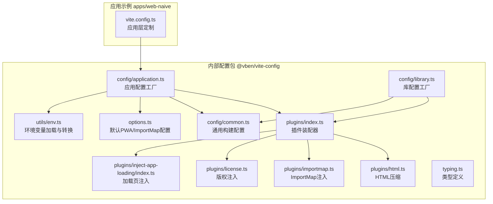
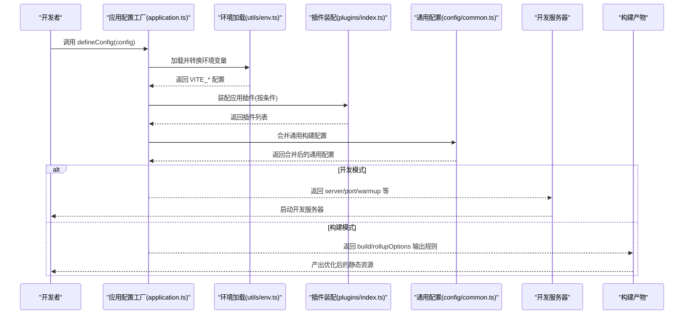
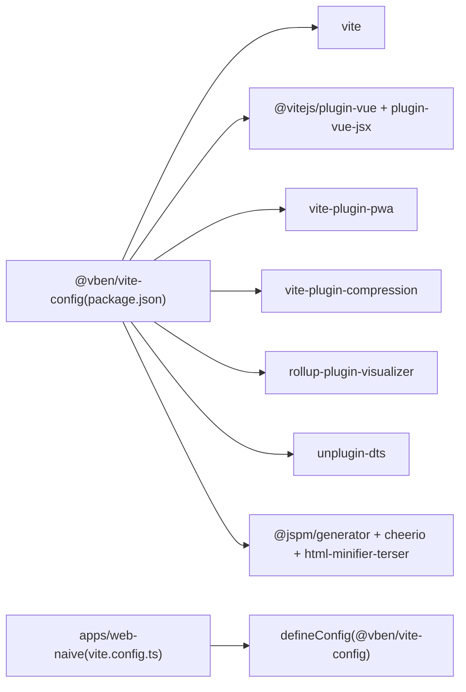

# 构建系统配置

<cite>
**本文引用的文件**
- [internal/vite-config/src/config/application.ts](file://internal/vite-config/src/config/application.ts)
- [internal/vite-config/src/config/library.ts](file://internal/vite-config/src/config/library.ts)
- [internal/vite-config/src/config/common.ts](file://internal/vite-config/src/config/common.ts)
- [internal/vite-config/src/options.ts](file://internal/vite-config/src/options.ts)
- [internal/vite-config/src/utils/env.ts](file://internal/vite-config/src/utils/env.ts)
- [internal/vite-config/src/plugins/index.ts](file://internal/vite-config/src/plugins/index.ts)
- [internal/vite-config/src/plugins/html.ts](file://internal/vite-config/src/plugins/html.ts)
- [internal/vite-config/src/plugins/importmap.ts](file://internal/vite-config/src/plugins/importmap.ts)
- [internal/vite-config/src/plugins/license.ts](file://internal/vite-config/src/plugins/license.ts)
- [internal/vite-config/src/plugins/inject-app-loading/index.ts](file://internal/vite-config/src/plugins/inject-app-loading/index.ts)
- [internal/vite-config/src/typing.ts](file://internal/vite-config/src/typing.ts)
- [internal/vite-config/package.json](file://internal/vite-config/package.json)
- [apps/web-naive/vite.config.ts](file://apps/web-naive/vite.config.ts)
</cite>

## 目录

1. [引言](#引言)
2. [项目结构](#项目结构)
3. [核心组件](#核心组件)
4. [架构总览](#架构总览)
5. [详细组件分析](#详细组件分析)
6. [依赖关系分析](#依赖关系分析)
7. [性能考量](#性能考量)
8. [故障排查指南](#故障排查指南)
9. [结论](#结论)
10. [附录](#附录)

## 引言

本文件面向 shiyu-ui 项目的构建系统，聚焦于 Vite 构建工具的配置与优化策略，涵盖开发服务器、构建输出、插件体系、环境变量管理、构建产物优化（代码分割、资源压缩、缓存策略）以及性能优化与故障排查方法。文档同时对比内部构建配置包中的 application.ts 与 library.ts 的配置差异，并给出可扩展的自定义插件开发与集成建议。

## 项目结构

构建系统的核心位于 internal/vite-config 包，提供统一的 Vite 配置工厂与插件集合；各应用（如 apps/web-naive）通过调用该包提供的 defineConfig 工厂函数来获得标准化的开发与构建体验。

图表来源

- [internal/vite-config/src/config/application.ts:17-99](file://internal/vite-config/src/config/application.ts#L17-L99)
- [internal/vite-config/src/config/library.ts:12-56](file://internal/vite-config/src/config/library.ts#L12-L56)
- [internal/vite-config/src/config/common.ts:3-11](file://internal/vite-config/src/config/common.ts#L3-L11)
- [internal/vite-config/src/options.ts:7-43](file://internal/vite-config/src/options.ts#L7-L43)
- [internal/vite-config/src/utils/env.ts:66-108](file://internal/vite-config/src/utils/env.ts#L66-L108)
- [internal/vite-config/src/plugins/index.ts:94-223](file://internal/vite-config/src/plugins/index.ts#L94-L223)
- [apps/web-naive/vite.config.ts:3-20](file://apps/web-naive/vite.config.ts#L3-L20)

章节来源

- [internal/vite-config/src/config/application.ts:17-99](file://internal/vite-config/src/config/application.ts#L17-L99)
- [internal/vite-config/src/config/library.ts:12-56](file://internal/vite-config/src/config/library.ts#L12-L56)
- [apps/web-naive/vite.config.ts:3-20](file://apps/web-naive/vite.config.ts#L3-L20)

## 核心组件

- 应用配置工厂：负责组装开发服务器、构建输出、CSS 处理、插件集合与环境变量转换，形成面向 Web 应用的标准配置。
- 库配置工厂：面向库/包的构建，自动识别外部依赖并设置库入口、格式与文件名，支持按需生成类型声明。
- 通用构建配置：统一构建警告阈值、是否生成 Source Map、压缩报告等基础策略。
- 插件系统：集中管理 Vue/Vue JSX、Tailwind、PWA、压缩、ImportMap、版权注入、加载页注入等插件，并按条件启用。
- 环境变量管理：支持多环境文件与前缀过滤，将环境变量转换为构建期可用的配置项。
- 默认选项：提供 PWA 清单与 ImportMap CDN 提供商的默认配置。

章节来源

- [internal/vite-config/src/config/application.ts:58-98](file://internal/vite-config/src/config/application.ts#L58-L98)
- [internal/vite-config/src/config/library.ts:36-52](file://internal/vite-config/src/config/library.ts#L36-L52)
- [internal/vite-config/src/config/common.ts:3-11](file://internal/vite-config/src/config/common.ts#L3-L11)
- [internal/vite-config/src/plugins/index.ts:94-243](file://internal/vite-config/src/plugins/index.ts#L94-L243)
- [internal/vite-config/src/utils/env.ts:66-108](file://internal/vite-config/src/utils/env.ts#L66-L108)
- [internal/vite-config/src/options.ts:7-43](file://internal/vite-config/src/options.ts#L7-L43)

## 架构总览

下面以序列图展示应用配置工厂在开发与构建阶段的关键流程，包括环境变量加载、插件装配、开发服务器启动与构建产物生成。

图表来源

- [internal/vite-config/src/config/application.ts:17-99](file://internal/vite-config/src/config/application.ts#L17-L99)
- [internal/vite-config/src/utils/env.ts:66-108](file://internal/vite-config/src/utils/env.ts#L66-L108)
- [internal/vite-config/src/plugins/index.ts:94-223](file://internal/vite-config/src/plugins/index.ts#L94-L223)
- [internal/vite-config/src/config/common.ts:3-11](file://internal/vite-config/src/config/common.ts#L3-L11)

## 详细组件分析

### 应用配置工厂（application.ts）

- 功能要点
  - 异步配置工厂：支持返回 Promise，便于读取包信息与环境变量。
  - 环境变量转换：将 VITE\_\* 前缀变量转换为构建期配置项，如应用标题、基础路径、端口、压缩类型、PWA 开关等。
  - 插件装配：按条件启用 PWA、压缩、ImportMap、HTML 压缩、加载页注入、版权注入、Nitro Mock、可视化分析等。
  - 构建输出：自定义资源命名规则（资源、入口、JS），在构建时移除调试语句。
  - CSS 处理：按 monorepo 根注入全局 SCSS，并支持 NodePackageImporter。
  - 开发服务器：开放主机、指定端口、预热关键文件，提升首次启动速度。
  - 与通用配置合并：统一构建警告阈值、Source Map 与压缩报告。

- 关键配置点
  - 资源命名与最小化：入口、JS、资源文件命名规则与构建时压缩开关。
  - 开发服务器：host、port、warmup 客户端文件列表。
  - 插件开关：i18n、print、nitroMock、injectAppLoading、license、pwa、compress、html、importmap、extraAppConfig、archiver 等。

章节来源

- [internal/vite-config/src/config/application.ts:17-99](file://internal/vite-config/src/config/application.ts#L17-L99)
- [internal/vite-config/src/utils/env.ts:66-108](file://internal/vite-config/src/utils/env.ts#L66-L108)
- [internal/vite-config/src/plugins/index.ts:94-223](file://internal/vite-config/src/plugins/index.ts#L94-L223)
- [internal/vite-config/src/config/common.ts:3-11](file://internal/vite-config/src/config/common.ts#L3-L11)

### 库配置工厂（library.ts）

- 功能要点
  - 读取包依赖：自动识别 dependencies 与 peerDependencies 并作为 Rollup external。
  - 库入口与输出：默认入口为 src/index.ts，输出格式为 ES Module，文件名为 index.mjs。
  - 插件装配：按条件启用 DTS 生成等库专用插件。
  - 与通用配置合并：统一构建策略。

- 关键配置点
  - external 规则：对外部包进行排除，避免打包进库产物。
  - lib 构建参数：entry、fileName、formats。
  - DTS 生成：按需开启 unplugin-dts。

章节来源

- [internal/vite-config/src/config/library.ts:12-56](file://internal/vite-config/src/config/library.ts#L12-L56)

### 插件系统实现

- 插件装配器（plugins/index.ts）
  - 条件插件：通过 condition 字段按运行时条件决定是否加载插件。
  - 通用插件：始终启用的 Vue、JSX、Tailwind、元数据注入、可视化分析等。
  - 应用插件：i18n、print、nitroMock、加载页注入、license、PWA、压缩、HTML 压缩、ImportMap、额外配置抽取、归档等。
  - 库插件：DTS 生成等。

- HTML 压缩插件（plugins/html.ts）
  - 基于 transformIndexHtml，在构建完成后对 HTML 进行压缩与清理。

- ImportMap 注入插件（plugins/importmap.ts）
  - 构建期安装指定依赖，生成 importmap，并注入 es-module-shims 以兼容旧浏览器。
  - 支持多种 CDN 提供商，默认使用 jspm.io 或 esm.sh。

- 版权注入插件（plugins/license.ts）
  - 在构建产物的入口 chunk 中注入版权信息，包含版本、主页、描述、时间等。

- 加载页注入插件（plugins/inject-app-loading/index.ts）
  - 在开发/构建阶段向 HTML 注入加载页与主题缓存逻辑，确保刷新后主题一致。

章节来源

- [internal/vite-config/src/plugins/index.ts:36-243](file://internal/vite-config/src/plugins/index.ts#L36-L243)
- [internal/vite-config/src/plugins/html.ts:17-35](file://internal/vite-config/src/plugins/html.ts#L17-L35)
- [internal/vite-config/src/plugins/importmap.ts:44-192](file://internal/vite-config/src/plugins/importmap.ts#L44-L192)
- [internal/vite-config/src/plugins/license.ts:17-61](file://internal/vite-config/src/plugins/license.ts#L17-L61)
- [internal/vite-config/src/plugins/inject-app-loading/index.ts:14-49](file://internal/vite-config/src/plugins/inject-app-loading/index.ts#L14-L49)

### 环境变量管理与配置

- 环境文件加载顺序：.env、.env.local、.env.{mode}、.env.{mode}.local，优先级递增。
- 变量匹配：仅保留以指定前缀开头的变量（默认 VITE\_）。
- 转换逻辑：将字符串转换为布尔或数字，支持逗号分隔的压缩类型列表。
- 应用侧覆盖：应用层 vite.config.ts 可通过 defineConfig 返回 vite 字段进行覆盖。

章节来源

- [internal/vite-config/src/utils/env.ts:21-108](file://internal/vite-config/src/utils/env.ts#L21-L108)
- [apps/web-naive/vite.config.ts:3-20](file://apps/web-naive/vite.config.ts#L3-L20)

### 应用与库配置差异

- 应用配置（application.ts）
  - 面向 Web 应用，提供开发服务器、PWA、压缩、ImportMap、HTML 压缩、加载页注入、版权注入、Nitro Mock、可视化分析等能力。
  - 构建输出针对浏览器端优化，包含资源命名与最小化策略。
- 库配置（library.ts）
  - 面向库/包发布，自动识别外部依赖并排除打包，输出 ES Module 格式。
  - 支持按需生成 DTS 类型声明文件。

章节来源

- [internal/vite-config/src/config/application.ts:58-98](file://internal/vite-config/src/config/application.ts#L58-L98)
- [internal/vite-config/src/config/library.ts:36-52](file://internal/vite-config/src/config/library.ts#L36-L52)

### 自定义插件开发与集成

- 开发步骤
  - 在 plugins 目录新增插件实现，遵循 Vite 插件规范（name、hooks、transformIndexHtml 等）。
  - 在 plugins/index.ts 中通过条件插件注册新插件，并在应用/库配置中按需启用。
  - 如需影响构建产物，可在 generateBundle 或 renderChunk 阶段处理。
- 集成方式
  - 将插件加入 loadApplicationPlugins 或 loadLibraryPlugins 的条件列表中，通过 options 控制开关。
  - 对于应用插件，可利用 transformIndexHtml 在构建阶段修改 HTML；对于库插件，可结合 DTS 生成等能力。

章节来源

- [internal/vite-config/src/plugins/index.ts:36-243](file://internal/vite-config/src/plugins/index.ts#L36-L243)
- [internal/vite-config/src/typing.ts:138-359](file://internal/vite-config/src/typing.ts#L138-L359)

### 构建产物优化策略

- 代码分割
  - 通过 Rollup 的 external 与动态导入实现库侧外部化与按需加载。
  - 应用侧通过路由与组件懒加载减少首屏体积。
- 资源压缩
  - 支持 gzip 与 brotli 压缩，按构建开关启用。
  - HTML 压缩与 JS/CSS 内联压缩。
- 缓存策略
  - 资源命名包含哈希，结合浏览器缓存与 Service Worker（PWA）实现长效缓存。
  - ImportMap 与 CDN 提供商可提升依赖加载稳定性与缓存命中率。

章节来源

- [internal/vite-config/src/plugins/index.ts:184-199](file://internal/vite-config/src/plugins/index.ts#L184-L199)
- [internal/vite-config/src/plugins/html.ts:17-35](file://internal/vite-config/src/plugins/html.ts#L17-L35)
- [internal/vite-config/src/plugins/importmap.ts:44-192](file://internal/vite-config/src/plugins/importmap.ts#L44-L192)
- [internal/vite-config/src/options.ts:7-26](file://internal/vite-config/src/options.ts#L7-L26)

## 依赖关系分析

- 内部包依赖
  - @vben/vite-config 依赖 Vite、Vue 插件生态、PWA、压缩、可视化分析、DTS、ImportMap 生成器等。
  - 应用层通过 @vben/vite-config 的 defineConfig 使用统一配置。
- 外部依赖
  - PWA、Tailwind、Vue/Vue JSX、vite-plugin-compression、rollup-plugin-visualizer、unplugin-dts 等。

图表来源

- [internal/vite-config/package.json:29-59](file://internal/vite-config/package.json#L29-L59)
- [apps/web-naive/vite.config.ts:1-21](file://apps/web-naive/vite.config.ts#L1-L21)

章节来源

- [internal/vite-config/package.json:29-59](file://internal/vite-config/package.json#L29-L59)
- [apps/web-naive/vite.config.ts:1-21](file://apps/web-naive/vite.config.ts#L1-L21)

## 性能考量

- 开发体验
  - 开放主机与端口，启用 warmup 预热关键文件，缩短首次启动时间。
  - 可选开启 Vue DevTools、可视化分析，辅助定位性能瓶颈。
- 构建优化
  - 启用压缩（gzip/brotli）与 HTML 压缩，降低传输体积。
  - 使用 ImportMap 减少打包体积，提升依赖加载稳定性。
  - 统一资源命名与哈希，配合 PWA 实现长效缓存。
- 代码质量
  - 通过 DTS 生成与类型检查，减少运行时错误。
  - 通过版权注入与元数据注入，提升产物可维护性。

章节来源

- [internal/vite-config/src/config/application.ts:79-90](file://internal/vite-config/src/config/application.ts#L79-L90)
- [internal/vite-config/src/plugins/index.ts:79-87](file://internal/vite-config/src/plugins/index.ts#L79-L87)
- [internal/vite-config/src/plugins/index.ts:184-199](file://internal/vite-config/src/plugins/index.ts#L184-L199)
- [internal/vite-config/src/plugins/importmap.ts:44-192](file://internal/vite-config/src/plugins/importmap.ts#L44-L192)
- [internal/vite-config/src/plugins/license.ts:17-61](file://internal/vite-config/src/plugins/license.ts#L17-L61)

## 故障排查指南

- ImportMap 安装失败
  - 现象：构建时报错提示 Importmap 安装失败。
  - 排查：确认 CDN 可用性与网络环境；检查 defaultProvider 与 importmap 配置；查看日志流输出。
- PWA 清单缺失或图标不生效
  - 现象：PWA 图标或描述未正确生成。
  - 排查：核对 getDefaultPWAOptions 生成的清单字段；确认 manifest 配置未被覆盖。
- 环境变量未生效
  - 现象：VITE\_\* 变量未被转换为构建配置。
  - 排查：确认环境文件存在且命名符合约定；检查前缀匹配与数值类型转换。
- 构建产物缺少版权信息
  - 现象：产物未注入版权头部。
  - 排查：确认 license 插件已启用且在 generateBundle 阶段执行。
- 开发服务器无法访问
  - 现象：本地无法通过 host 访问开发服务器。
  - 排查：确认 host 设置为 true，端口未被占用，防火墙允许访问。

章节来源

- [internal/vite-config/src/plugins/importmap.ts:138-144](file://internal/vite-config/src/plugins/importmap.ts#L138-L144)
- [internal/vite-config/src/options.ts:7-26](file://internal/vite-config/src/options.ts#L7-L26)
- [internal/vite-config/src/utils/env.ts:66-108](file://internal/vite-config/src/utils/env.ts#L66-L108)
- [internal/vite-config/src/plugins/license.ts:27-61](file://internal/vite-config/src/plugins/license.ts#L27-L61)
- [internal/vite-config/src/config/application.ts:79-90](file://internal/vite-config/src/config/application.ts#L79-L90)

## 结论

shiyu-ui 的构建系统通过统一的 @vben/vite-config 包实现了“开箱即用”的开发与构建体验。应用与库配置分别满足 Web 应用与包发布的差异化需求，插件系统以条件装配为核心，既保证灵活性又维持一致性。结合环境变量管理、资源压缩、ImportMap 与 PWA 等策略，整体在开发效率与产物性能之间取得良好平衡。建议在团队内推广统一的插件开发规范与配置约定，持续优化构建性能与可维护性。

## 附录

- 应用层定制示例
  - 在应用层 vite.config.ts 中通过 defineConfig 返回 vite 字段，覆盖代理、端口、基础路径等。
- 类型与选项参考
  - 插件选项、条件插件、应用/库配置选项均在 typing.ts 中定义，便于扩展与约束。

章节来源

- [apps/web-naive/vite.config.ts:3-20](file://apps/web-naive/vite.config.ts#L3-L20)
- [internal/vite-config/src/typing.ts:138-359](file://internal/vite-config/src/typing.ts#L138-L359)
