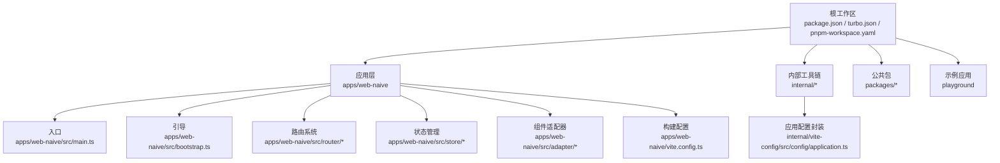
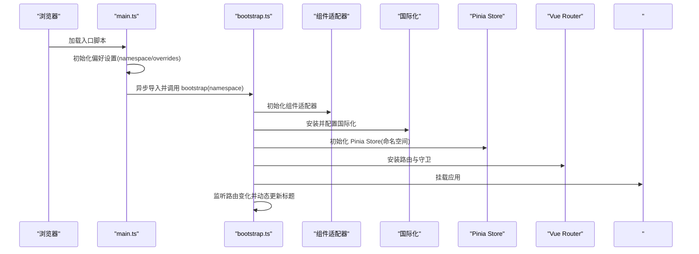
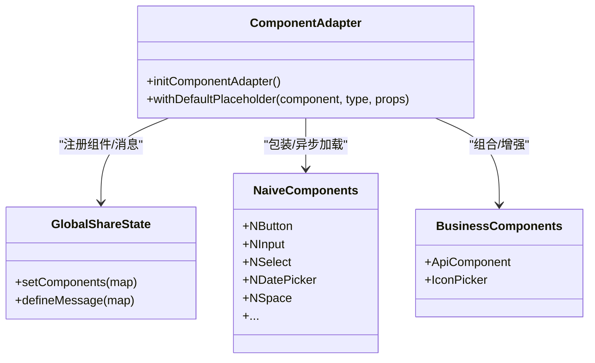
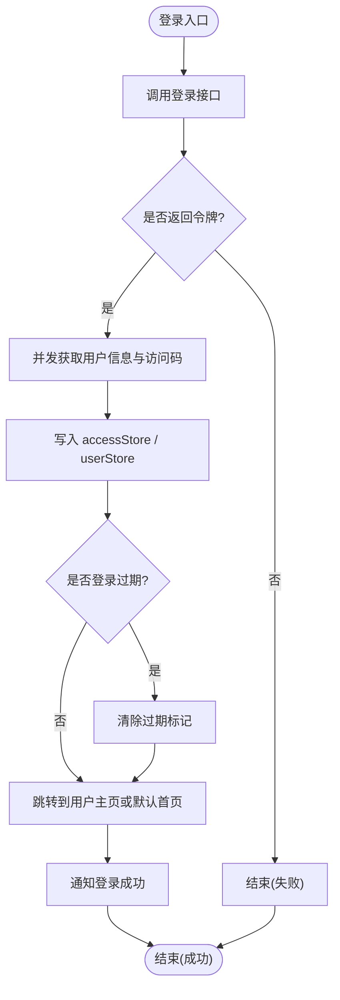
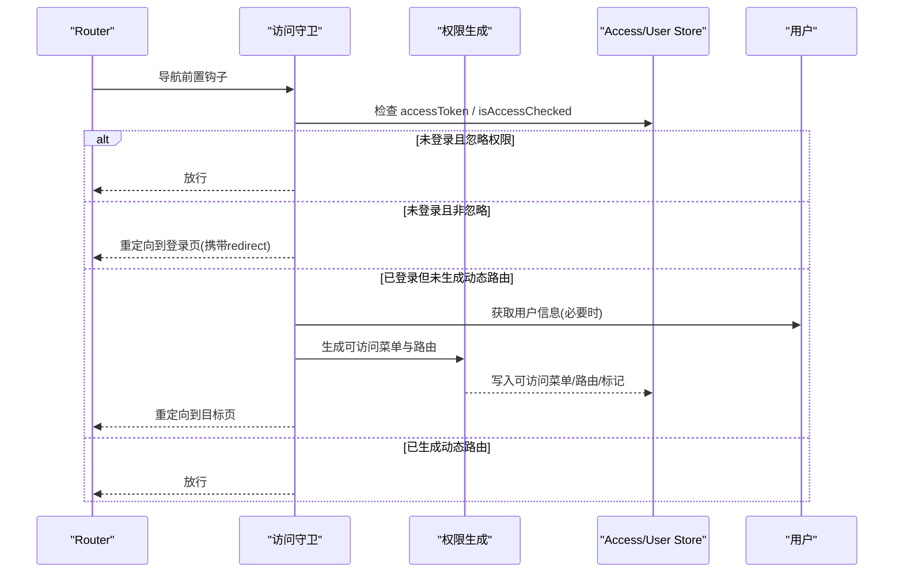
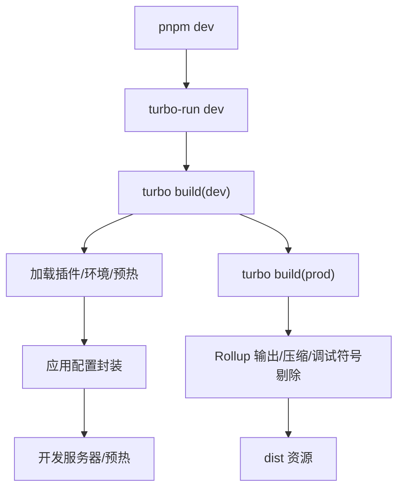
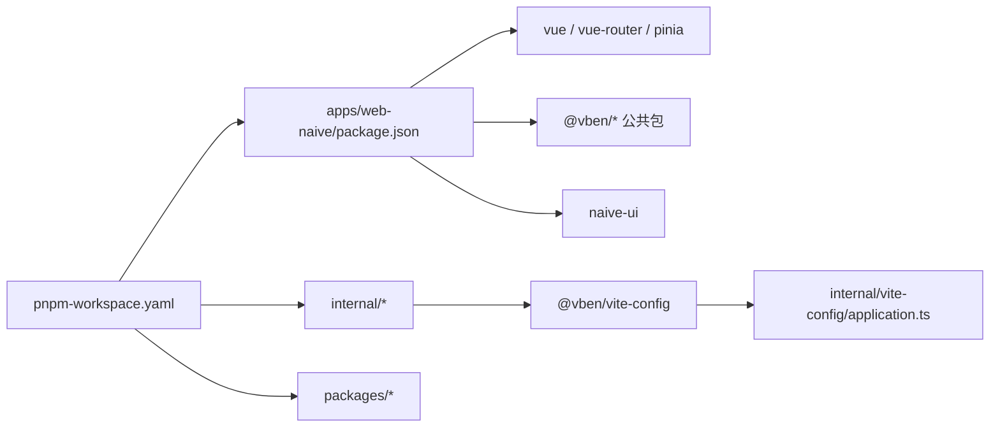

# 架构设计

<cite>
**本文引用的文件**
- [apps/web-naive/src/main.ts](file://apps/web-naive/src/main.ts)
- [apps/web-naive/src/bootstrap.ts](file://apps/web-naive/src/bootstrap.ts)
- [apps/web-naive/package.json](file://apps/web-naive/package.json)
- [apps/web-naive/src/preferences.ts](file://apps/web-naive/src/preferences.ts)
- [apps/web-naive/src/router/index.ts](file://apps/web-naive/src/router/index.ts)
- [apps/web-naive/src/router/guard.ts](file://apps/web-naive/src/router/guard.ts)
- [apps/web-naive/src/router/routes/index.ts](file://apps/web-naive/src/router/routes/index.ts)
- [apps/web-naive/src/store/auth.ts](file://apps/web-naive/src/store/auth.ts)
- [apps/web-naive/src/store/index.ts](file://apps/web-naive/src/store/index.ts)
- [apps/web-naive/src/adapter/component/index.ts](file://apps/web-naive/src/adapter/component/index.ts)
- [apps/web-naive/vite.config.ts](file://apps/web-naive/vite.config.ts)
- [internal/vite-config/src/config/application.ts](file://internal/vite-config/src/config/application.ts)
- [package.json](file://package.json)
- [turbo.json](file://turbo.json)
- [pnpm-workspace.yaml](file://pnpm-workspace.yaml)
</cite>

## 目录

1. [引言](#引言)
2. [项目结构](#项目结构)
3. [核心组件](#核心组件)
4. [架构总览](#架构总览)
5. [详细组件分析](#详细组件分析)
6. [依赖关系分析](#依赖关系分析)
7. [性能考虑](#性能考虑)
8. [故障排查指南](#故障排查指南)
9. [结论](#结论)
10. [附录](#附录)

## 引言

本文件面向 shiyu-ui 项目的架构设计文档，聚焦于 Monorepo 架构理念与实现、包管理策略、构建配置与依赖关系；阐述应用入口流程（从 main.ts 到 bootstrap.ts 的初始化）、组件适配器模式、状态管理（Pinia store 组织与数据流）、路由系统（动态路由与权限控制）、构建系统配置与优化策略，并总结架构决策的技术考量、性能影响与可维护性优势。

## 项目结构

shiyu-ui 采用 pnpm workspaces + Turbo 的 Monorepo 架构，将内部工具链（lint、vite 配置、node 工具）、公共包（icons、locales、stores、styles、utils 等）、示例应用（playground）与主应用（web-naive）统一管理。根目录的脚本与工作区配置驱动多包并行开发与构建。

- 根级任务与工作区
  - 根 package.json 提供统一脚本与引擎约束，支持并行开发与构建。
  - turbo.json 定义跨包构建依赖与缓存策略。
  - pnpm-workspace.yaml 声明工作区包集合与 catalog 版本目录。

- 应用层（apps/web-naive）
  - 入口与引导：main.ts -> bootstrap.ts -> App 实例挂载。
  - 路由与守卫：基于 vue-router 的动态路由与权限守卫。
  - 状态管理：Pinia store（认证、用户、权限等）。
  - 组件适配器：统一 Naive UI 组件与业务组件的桥接。
  - 构建：基于 @vben/vite-config 的应用配置封装。

图表来源

- [package.json:1-110](file://package.json#L1-L110)
- [turbo.json:1-49](file://turbo.json#L1-L49)
- [pnpm-workspace.yaml:1-192](file://pnpm-workspace.yaml#L1-L192)
- [apps/web-naive/src/main.ts:1-32](file://apps/web-naive/src/main.ts#L1-L32)
- [apps/web-naive/src/bootstrap.ts:1-77](file://apps/web-naive/src/bootstrap.ts#L1-L77)
- [apps/web-naive/src/router/index.ts:1-38](file://apps/web-naive/src/router/index.ts#L1-L38)
- [apps/web-naive/src/store/index.ts:1-2](file://apps/web-naive/src/store/index.ts#L1-L2)
- [apps/web-naive/src/adapter/component/index.ts:1-274](file://apps/web-naive/src/adapter/component/index.ts#L1-L274)
- [apps/web-naive/vite.config.ts:1-21](file://apps/web-naive/vite.config.ts#L1-L21)
- [internal/vite-config/src/config/application.ts:1-124](file://internal/vite-config/src/config/application.ts#L1-L124)

章节来源

- [package.json:1-110](file://package.json#L1-L110)
- [turbo.json:1-49](file://turbo.json#L1-L49)
- [pnpm-workspace.yaml:1-192](file://pnpm-workspace.yaml#L1-L192)

## 核心组件

- 包管理与版本目录
  - 使用 pnpm workspaces 管理多包依赖，通过 pnpm-workspace.yaml 声明工作区。
  - 通过 catalog 字段集中声明依赖版本，避免各包重复或漂移。
- 应用入口与引导
  - main.ts 负责应用命名空间与偏好设置初始化，随后异步加载并调用 bootstrap。
  - bootstrap 完成组件适配器、国际化、Pinia、权限指令、路由安装、动态标题、挂载等。
- 路由与权限
  - 路由基于 vue-router，支持 hash/history 模式切换与滚动行为。
  - 路由守卫分为通用守卫与访问守卫，实现进度条、已加载页面标记、登录态检查、动态路由生成与权限拦截。
- 状态管理
  - Pinia store 以模块化组织，认证 store 负责登录、登出、用户信息与访问码拉取。
- 组件适配器
  - 通过全局共享状态注册 Naive UI 组件与业务组件，统一样式、占位符与消息提示。
- 构建系统
  - 基于 @vben/vite-config 的 defineApplicationConfig 封装，提供插件、CSS、服务端预热、PWA、压缩等能力。

章节来源

- [apps/web-naive/src/main.ts:1-32](file://apps/web-naive/src/main.ts#L1-L32)
- [apps/web-naive/src/bootstrap.ts:1-77](file://apps/web-naive/src/bootstrap.ts#L1-L77)
- [apps/web-naive/src/preferences.ts:1-17](file://apps/web-naive/src/preferences.ts#L1-L17)
- [apps/web-naive/src/router/index.ts:1-38](file://apps/web-naive/src/router/index.ts#L1-L38)
- [apps/web-naive/src/router/guard.ts:1-133](file://apps/web-naive/src/router/guard.ts#L1-L133)
- [apps/web-naive/src/store/auth.ts:1-119](file://apps/web-naive/src/store/auth.ts#L1-L119)
- [apps/web-naive/src/adapter/component/index.ts:1-274](file://apps/web-naive/src/adapter/component/index.ts#L1-L274)
- [apps/web-naive/vite.config.ts:1-21](file://apps/web-naive/vite.config.ts#L1-L21)
- [internal/vite-config/src/config/application.ts:1-124](file://internal/vite-config/src/config/application.ts#L1-L124)

## 架构总览

下图展示从浏览器启动到应用完全可用的关键路径：入口初始化、偏好设置、组件适配器、国际化、状态管理、路由与守卫、挂载与动态标题更新。

图表来源

- [apps/web-naive/src/main.ts:1-32](file://apps/web-naive/src/main.ts#L1-L32)
- [apps/web-naive/src/bootstrap.ts:1-77](file://apps/web-naive/src/bootstrap.ts#L1-L77)
- [apps/web-naive/src/preferences.ts:1-17](file://apps/web-naive/src/preferences.ts#L1-L17)

章节来源

- [apps/web-naive/src/main.ts:1-32](file://apps/web-naive/src/main.ts#L1-L32)
- [apps/web-naive/src/bootstrap.ts:1-77](file://apps/web-naive/src/bootstrap.ts#L1-L77)

## 详细组件分析

### 组件适配器模式

组件适配器通过全局共享状态集中注册 UI 组件，屏蔽底层组件库差异，提供统一的组件类型、属性映射与默认行为（如占位符、消息提示）。该模式支持按需异步加载大组件，提升首屏性能。

图表来源

- [apps/web-naive/src/adapter/component/index.ts:163-274](file://apps/web-naive/src/adapter/component/index.ts#L163-L274)

章节来源

- [apps/web-naive/src/adapter/component/index.ts:1-274](file://apps/web-naive/src/adapter/component/index.ts#L1-L274)

### 状态管理架构（Pinia）

认证相关状态集中在 auth store，负责登录、登出、用户信息与访问码的获取与持久化，配合 access store 与 user store 实现权限与用户上下文管理。登录流程并发拉取用户信息与访问码，成功后根据用户主页或默认首页跳转。

图表来源

- [apps/web-naive/src/store/auth.ts:28-79](file://apps/web-naive/src/store/auth.ts#L28-L79)

章节来源

- [apps/web-naive/src/store/auth.ts:1-119](file://apps/web-naive/src/store/auth.ts#L1-L119)
- [apps/web-naive/src/store/index.ts:1-2](file://apps/web-naive/src/store/index.ts#L1-L2)

### 路由系统与权限控制

- 路由创建
  - 支持 hash 与 history 两种模式，滚动行为平滑定位或回到顶部。
  - 静态基础路由与动态模块路由合并，提供兜底 404。
- 路由守卫
  - 通用守卫：记录页面加载状态、按偏好开启进度条。
  - 访问守卫：对非核心路由进行登录态与权限检查；首次登录后生成动态路由并回填菜单与路由；支持忽略权限访问与登录页重定向。
- 动态路由生成
  - 基于用户角色生成可访问菜单与路由，写入 access store 并重定向至目标页。

图表来源

- [apps/web-naive/src/router/guard.ts:47-119](file://apps/web-naive/src/router/guard.ts#L47-L119)
- [apps/web-naive/src/router/routes/index.ts:15-37](file://apps/web-naive/src/router/routes/index.ts#L15-L37)
- [apps/web-naive/src/router/index.ts:15-35](file://apps/web-naive/src/router/index.ts#L15-L35)

章节来源

- [apps/web-naive/src/router/index.ts:1-38](file://apps/web-naive/src/router/index.ts#L1-L38)
- [apps/web-naive/src/router/guard.ts:1-133](file://apps/web-naive/src/router/guard.ts#L1-L133)
- [apps/web-naive/src/router/routes/index.ts:1-38](file://apps/web-naive/src/router/routes/index.ts#L1-L38)

### 构建系统配置与优化

- 应用配置封装
  - defineApplicationConfig 统一加载环境变量、插件、CSS 预处理、服务端预热、PWA、压缩等。
  - 构建输出命名规则与压缩开关，生产环境启用压缩与调试符号剔除。
- 应用层配置
  - vite.config.ts 通过 @vben/vite-config 的 defineConfig 快速启用常用能力，并配置本地代理。
- 工作区与并行构建
  - turbo.json 定义任务依赖与缓存，根脚本并行构建所有应用与包。

图表来源

- [apps/web-naive/vite.config.ts:1-21](file://apps/web-naive/vite.config.ts#L1-L21)
- [internal/vite-config/src/config/application.ts:17-98](file://internal/vite-config/src/config/application.ts#L17-L98)
- [package.json:27-66](file://package.json#L27-L66)
- [turbo.json:15-46](file://turbo.json#L15-L46)

章节来源

- [apps/web-naive/vite.config.ts:1-21](file://apps/web-naive/vite.config.ts#L1-L21)
- [internal/vite-config/src/config/application.ts:1-124](file://internal/vite-config/src/config/application.ts#L1-L124)
- [package.json:1-110](file://package.json#L1-L110)
- [turbo.json:1-49](file://turbo.json#L1-L49)

## 依赖关系分析

- 包管理策略
  - pnpm-workspace.yaml 声明工作区，内部包与应用通过 workspace:\* 引用，确保版本一致性与本地联调。
  - catalog 字段集中声明依赖版本，减少重复与漂移风险。
- 应用依赖
  - apps/web-naive/package.json 通过 imports 映射简化路径别名，依赖大量 @vben/\* 内部包与 Vue 技术栈。
- 构建与工具
  - internal/vite-config 提供统一的 Vite 配置封装，@vben/vite-config 作为应用层入口。
  - turbo.json 与根脚本驱动并行构建与缓存。

图表来源

- [pnpm-workspace.yaml:1-192](file://pnpm-workspace.yaml#L1-L192)
- [apps/web-naive/package.json:25-50](file://apps/web-naive/package.json#L25-L50)
- [apps/web-naive/vite.config.ts:1](file://apps/web-naive/vite.config.ts#L1)
- [internal/vite-config/src/config/application.ts:17-54](file://internal/vite-config/src/config/application.ts#L17-L54)

章节来源

- [pnpm-workspace.yaml:1-192](file://pnpm-workspace.yaml#L1-L192)
- [apps/web-naive/package.json:1-51](file://apps/web-naive/package.json#L1-L51)

## 性能考虑

- 并发与懒加载
  - 登录流程并发拉取用户信息与访问码，减少等待时间。
  - 组件适配器对大组件采用异步加载，降低首屏体积。
- 构建优化
  - 生产构建启用压缩与调试符号剔除，Rollup 输出命名规则清晰，利于缓存与分析。
  - 开发阶段预热关键文件，缩短冷启动时间。
- 路由与导航
  - 进度条与页面加载状态避免重复动画开销，提升交互体验。
- 可维护性
  - 统一的构建封装与工作区版本目录，降低升级成本与依赖漂移风险。

## 故障排查指南

- 登录后无法跳转或白屏
  - 检查登录接口返回与 accessStore 令牌写入；确认用户信息与访问码拉取成功。
  - 核对默认首页与用户 homePath 配置。
- 权限路由不生效
  - 确认访问守卫已生成动态路由并写入 access store；检查角色列表与路由生成逻辑。
  - 若目标页被标记为忽略权限，需调整 meta.ignoreAccess 或路由配置。
- 国际化/标题不更新
  - 确认国际化已安装；检查动态标题监听逻辑与偏好设置中的动态标题开关。
- 构建异常
  - 查看 turbo 缓存与依赖锁文件；确认 @vben/vite-config 插件与环境变量加载正常。

章节来源

- [apps/web-naive/src/store/auth.ts:28-79](file://apps/web-naive/src/store/auth.ts#L28-L79)
- [apps/web-naive/src/router/guard.ts:47-119](file://apps/web-naive/src/router/guard.ts#L47-L119)
- [apps/web-naive/src/bootstrap.ts:64-71](file://apps/web-naive/src/bootstrap.ts#L64-L71)
- [turbo.json:15-46](file://turbo.json#L15-L46)

## 结论

本架构以 Monorepo 为核心，结合 pnpm workspaces、Turbo 与统一的 Vite 配置封装，实现了高内聚、低耦合、可扩展的前端工程体系。入口初始化与引导流程清晰，组件适配器统一了 UI 层差异，Pinia store 模块化组织状态，路由与权限守卫保障安全与体验。构建系统在性能与可维护性之间取得平衡，适合长期演进与团队协作。

## 附录

- 关键路径参考
  - 入口与引导：[apps/web-naive/src/main.ts:1-32](file://apps/web-naive/src/main.ts#L1-L32)、[apps/web-naive/src/bootstrap.ts:1-77](file://apps/web-naive/src/bootstrap.ts#L1-L77)
  - 路由与守卫：[apps/web-naive/src/router/index.ts:1-38](file://apps/web-naive/src/router/index.ts#L1-L38)、[apps/web-naive/src/router/guard.ts:1-133](file://apps/web-naive/src/router/guard.ts#L1-L133)、[apps/web-naive/src/router/routes/index.ts:1-38](file://apps/web-naive/src/router/routes/index.ts#L1-L38)
  - 状态管理：[apps/web-naive/src/store/auth.ts:1-119](file://apps/web-naive/src/store/auth.ts#L1-L119)、[apps/web-naive/src/store/index.ts:1-2](file://apps/web-naive/src/store/index.ts#L1-L2)
  - 组件适配器：[apps/web-naive/src/adapter/component/index.ts:1-274](file://apps/web-naive/src/adapter/component/index.ts#L1-L274)
  - 构建配置：[apps/web-naive/vite.config.ts:1-21](file://apps/web-naive/vite.config.ts#L1-L21)、[internal/vite-config/src/config/application.ts:1-124](file://internal/vite-config/src/config/application.ts#L1-L124)
  - 工作区与任务：[package.json:1-110](file://package.json#L1-L110)、[turbo.json:1-49](file://turbo.json#L1-L49)、[pnpm-workspace.yaml:1-192](file://pnpm-workspace.yaml#L1-L192)
