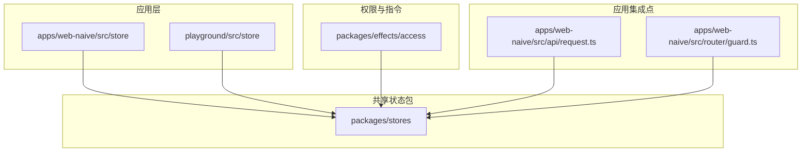
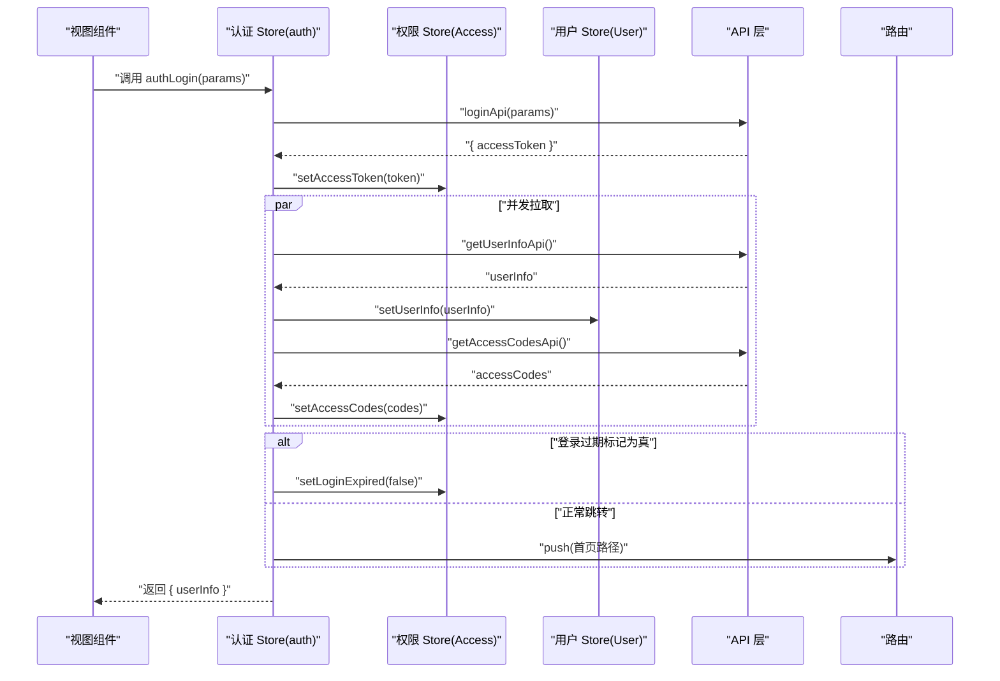
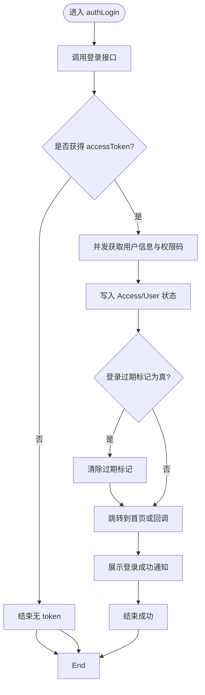
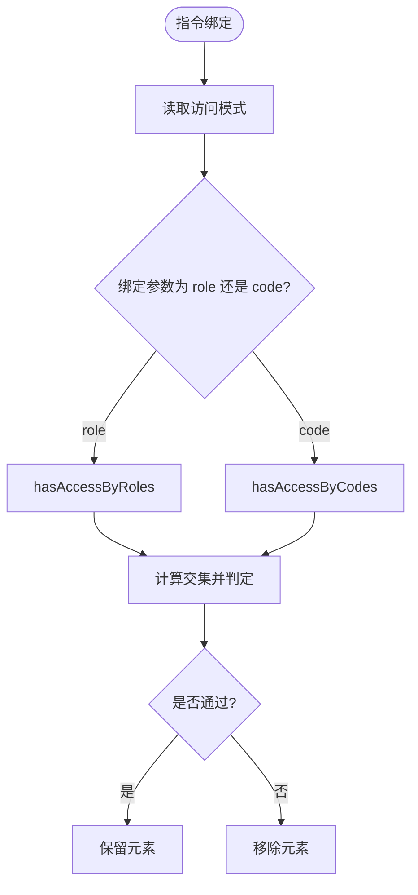
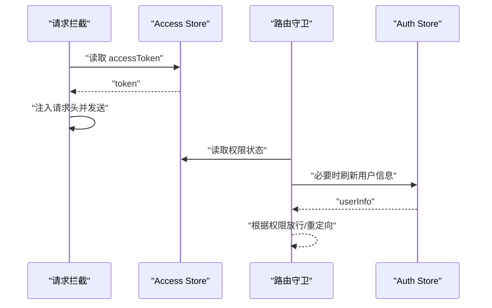
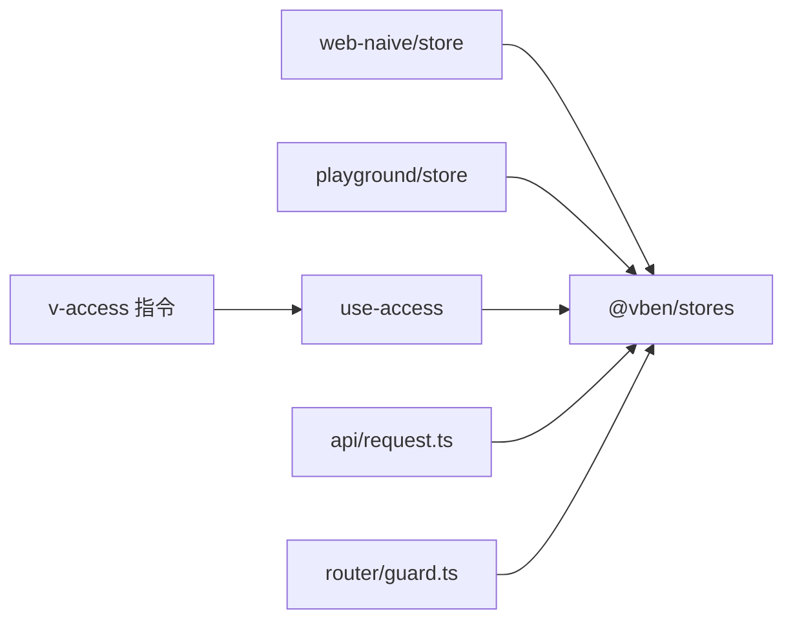

# 状态管理架构

<cite>
**本文引用的文件**
- [apps/web-naive/src/store/index.ts](file://apps/web-naive/src/store/index.ts)
- [apps/web-naive/src/store/auth.ts](file://apps/web-naive/src/store/auth.ts)
- [playground/src/store/index.ts](file://playground/src/store/index.ts)
- [playground/src/store/auth.ts](file://playground/src/store/auth.ts)
- [packages/stores/package.json](file://packages/stores/package.json)
- [packages/stores/src/index.ts](file://packages/stores/src/index.ts)
- [packages/effects/access/src/use-access.ts](file://packages/effects/access/src/use-access.ts)
- [packages/effects/access/src/directive.ts](file://packages/effects/access/src/directive.ts)
- [apps/web-naive/src/api/request.ts](file://apps/web-naive/src/api/request.ts)
- [apps/web-naive/src/router/guard.ts](file://apps/web-naive/src/router/guard.ts)
</cite>

## 目录

1. [引言](#引言)
2. [项目结构](#项目结构)
3. [核心组件](#核心组件)
4. [架构总览](#架构总览)
5. [详细组件分析](#详细组件分析)
6. [依赖分析](#依赖分析)
7. [性能考虑](#性能考虑)
8. [故障排查指南](#故障排查指南)
9. [结论](#结论)
10. [附录](#附录)

## 引言

本文件系统性梳理 shiyu-ui 项目基于 Pinia 的状态管理架构与落地实践，重点覆盖以下方面：

- Pinia 设计理念与在项目中的应用方式
- store 组织结构：根 store 与模块 store 的职责划分
- 认证状态管理：用户信息、权限状态与会话管理
- 状态持久化策略与本地存储方案
- 状态间的依赖关系与数据流向
- 最佳实践与性能优化建议
- 调试与监控方法

## 项目结构

项目采用“多应用 + 多包”的 Monorepo 结构，状态管理相关代码主要分布在两个前端应用（web-naive 与 playground）以及一个共享状态包（@vben/stores）。整体组织如下：

- 应用层 store：每个应用独立维护自身 store 入口与模块 store（如认证 store）
- 共享状态包：封装统一的 store 定义、安装与持久化插件，供各应用复用
- 权限与指令：通过 hooks 与全局指令实现基于权限的状态联动与 UI 控制

图表来源

- [apps/web-naive/src/store/index.ts:1-2](file://apps/web-naive/src/store/index.ts#L1-L2)
- [playground/src/store/index.ts:1-2](file://playground/src/store/index.ts#L1-L2)
- [packages/stores/src/index.ts:1-4](file://packages/stores/src/index.ts#L1-L4)
- [packages/effects/access/src/use-access.ts:1-53](file://packages/effects/access/src/use-access.ts#L1-L53)
- [apps/web-naive/src/api/request.ts:13-64](file://apps/web-naive/src/api/request.ts#L13-L64)
- [apps/web-naive/src/router/guard.ts:4-50](file://apps/web-naive/src/router/guard.ts#L4-L50)

章节来源

- [apps/web-naive/src/store/index.ts:1-2](file://apps/web-naive/src/store/index.ts#L1-L2)
- [playground/src/store/index.ts:1-2](file://playground/src/store/index.ts#L1-L2)
- [packages/stores/src/index.ts:1-4](file://packages/stores/src/index.ts#L1-L4)

## 核心组件

本项目的核心状态组件围绕认证与权限展开，关键点如下：

- 认证 store（auth store）：负责登录、登出、用户信息拉取与路由跳转
- 权限 hooks（use-access）：提供基于角色或权限码的访问判定能力
- 全局指令（v-access）：在模板层面进行细粒度权限控制
- 请求拦截器与路由守卫：在请求与导航阶段读取状态以决定行为

章节来源

- [apps/web-naive/src/store/auth.ts:16-118](file://apps/web-naive/src/store/auth.ts#L16-L118)
- [playground/src/store/auth.ts:16-127](file://playground/src/store/auth.ts#L16-L127)
- [packages/effects/access/src/use-access.ts:6-51](file://packages/effects/access/src/use-access.ts#L6-L51)
- [packages/effects/access/src/directive.ts:11-38](file://packages/effects/access/src/directive.ts#L11-L38)
- [apps/web-naive/src/api/request.ts:13-64](file://apps/web-naive/src/api/request.ts#L13-L64)
- [apps/web-naive/src/router/guard.ts:4-50](file://apps/web-naive/src/router/guard.ts#L4-L50)

## 架构总览

下图展示了认证流程在 store、API 层与路由守卫之间的交互关系，体现状态驱动的行为决策。

图表来源

- [apps/web-naive/src/store/auth.ts:28-79](file://apps/web-naive/src/store/auth.ts#L28-L79)
- [apps/web-naive/src/api/request.ts:13-34](file://apps/web-naive/src/api/request.ts#L13-L34)
- [apps/web-naive/src/router/guard.ts:48-62](file://apps/web-naive/src/router/guard.ts#L48-L62)

## 详细组件分析

### 认证 Store（auth store）

- 职责边界
  - 维护登录态与加载状态
  - 协调用户信息与权限码的获取与落库
  - 触发登出流程并重置所有 store
  - 提供登录成功后的路由跳转逻辑
- 关键流程
  - 登录：并发拉取用户信息与权限码，设置令牌与状态后根据 homePath 或默认首页跳转
  - 登出：调用后端登出接口，重置所有 store，并将登录过期标记置为 false，携带当前路由参数跳转至登录页
  - 用户信息刷新：通过 getUserInfoApi 拉取最新用户信息并写入用户 store
- 与外部依赖
  - 使用路由实例进行页面跳转
  - 与 @vben/stores 中的 Access 与 User store 协作
  - 与 API 层交互完成认证与信息拉取

图表来源

- [apps/web-naive/src/store/auth.ts:28-79](file://apps/web-naive/src/store/auth.ts#L28-L79)

章节来源

- [apps/web-naive/src/store/auth.ts:16-118](file://apps/web-naive/src/store/auth.ts#L16-L118)
- [playground/src/store/auth.ts:16-127](file://playground/src/store/auth.ts#L16-L127)

### 权限判定与指令（use-access 与 v-access）

- use-access
  - 读取偏好配置中的访问模式（前端/后端）
  - 基于用户角色集合与权限码集合进行交集判定
  - 支持切换访问模式
- v-access 指令
  - 在 mounted 阶段根据绑定值与访问模式选择角色或权限码判定
  - 若无权限则移除对应 DOM 节点，实现 UI 层细粒度控制

图表来源

- [packages/effects/access/src/directive.ts:11-38](file://packages/effects/access/src/directive.ts#L11-L38)
- [packages/effects/access/src/use-access.ts:18-34](file://packages/effects/access/src/use-access.ts#L18-L34)

章节来源

- [packages/effects/access/src/use-access.ts:6-51](file://packages/effects/access/src/use-access.ts#L6-L51)
- [packages/effects/access/src/directive.ts:11-38](file://packages/effects/access/src/directive.ts#L11-L38)

### 请求拦截与路由守卫中的状态使用

- 请求拦截
  - 在请求前从 Access store 读取令牌，注入到请求头
  - 在响应异常时根据状态进行兜底处理（例如触发登出或提示）
- 路由守卫
  - 在导航前置钩子中读取用户信息与权限状态，决定放行或重定向
  - 当用户信息缺失时，优先尝试通过 auth.store 刷新用户信息

图表来源

- [apps/web-naive/src/api/request.ts:33-50](file://apps/web-naive/src/api/request.ts#L33-L50)
- [apps/web-naive/src/router/guard.ts:48-62](file://apps/web-naive/src/router/guard.ts#L48-L62)

章节来源

- [apps/web-naive/src/api/request.ts:13-64](file://apps/web-naive/src/api/request.ts#L13-L64)
- [apps/web-naive/src/router/guard.ts:4-50](file://apps/web-naive/src/router/guard.ts#L4-L50)

## 依赖分析

- 应用层 store 与共享状态包
  - 应用层通过导出统一入口聚合模块 store，便于按需引入
  - 共享状态包导出统一的 defineStore 与 storeToRefs，并内置 pinia-plugin-persistedstate 与 secure-ls，用于状态持久化
- 权限与指令对 store 的依赖
  - use-access 与 v-access 依赖 Access 与 User store 的状态与方法
- 请求拦截与路由守卫对 store 的依赖
  - 请求拦截依赖 Access store 的令牌
  - 路由守卫依赖 User 与 Access store 的状态

图表来源

- [apps/web-naive/src/store/index.ts:1-2](file://apps/web-naive/src/store/index.ts#L1-L2)
- [playground/src/store/index.ts:1-2](file://playground/src/store/index.ts#L1-L2)
- [packages/stores/src/index.ts:1-4](file://packages/stores/src/index.ts#L1-L4)
- [packages/effects/access/src/use-access.ts:1-53](file://packages/effects/access/src/use-access.ts#L1-L53)
- [packages/effects/access/src/directive.ts:1-42](file://packages/effects/access/src/directive.ts#L1-L42)
- [apps/web-naive/src/api/request.ts:13-64](file://apps/web-naive/src/api/request.ts#L13-L64)
- [apps/web-naive/src/router/guard.ts:4-50](file://apps/web-naive/src/router/guard.ts#L4-L50)

章节来源

- [packages/stores/package.json:16-31](file://packages/stores/package.json#L16-L31)
- [packages/stores/src/index.ts:1-4](file://packages/stores/src/index.ts#L1-L4)

## 性能考虑

- 并发拉取
  - 登录流程中并发获取用户信息与权限码，减少总耗时
- 状态粒度与更新频率
  - 将用户信息与权限码拆分到不同 store，避免无关状态频繁更新
- 持久化策略
  - 使用 pinia-plugin-persistedstate 与 secure-ls 对关键状态进行本地持久化，降低刷新成本
- UI 渲染优化
  - 权限指令在挂载阶段一次性判定并移除无权限节点，避免运行时重复计算

## 故障排查指南

- 登录后仍被重定向到登录页
  - 检查登录流程是否正确写入 accessToken 与用户信息
  - 确认路由跳转逻辑是否使用了 homePath 或默认首页
- 权限指令不生效
  - 确认访问模式与绑定参数（role/code）一致
  - 检查用户角色集合与权限码集合是否正确写入
- 请求失败或 401
  - 检查请求拦截是否正确注入 token
  - 确认 Access store 的令牌状态与后端一致
- 登出循环问题
  - playground 版本提供了登出标识防止死循环，可参考其实现

章节来源

- [apps/web-naive/src/store/auth.ts:81-99](file://apps/web-naive/src/store/auth.ts#L81-L99)
- [playground/src/store/auth.ts:83-107](file://playground/src/store/auth.ts#L83-L107)
- [packages/effects/access/src/directive.ts:11-38](file://packages/effects/access/src/directive.ts#L11-L38)
- [apps/web-naive/src/api/request.ts:33-50](file://apps/web-naive/src/api/request.ts#L33-L50)

## 结论

本项目以 Pinia 为核心，结合共享状态包与权限指令，构建了清晰、可扩展且易维护的状态管理架构。认证流程通过并发拉取与状态联动实现高效体验；权限判定在 hooks 与指令层面形成闭环；持久化与拦截器进一步增强了可用性与一致性。建议在后续迭代中持续关注状态粒度、持久化范围与调试工具的完善。

## 附录

- 状态持久化与本地存储
  - 通过 @vben/stores 内置的 pinia-plugin-persistedstate 与 secure-ls 实现
  - 可在 store 定义时选择需要持久化的字段，避免过度持久化导致体积膨胀
- 调试与监控
  - 使用浏览器 Vue DevTools 查看 Pinia 状态树与变更日志
  - 在关键流程（登录、登出、权限判定）添加日志输出，便于定位问题
