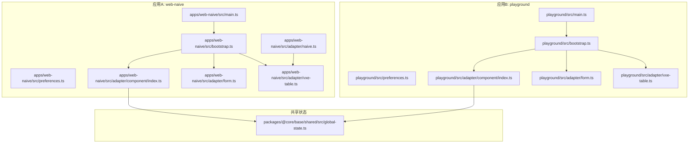
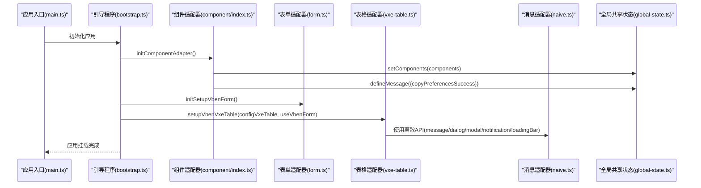
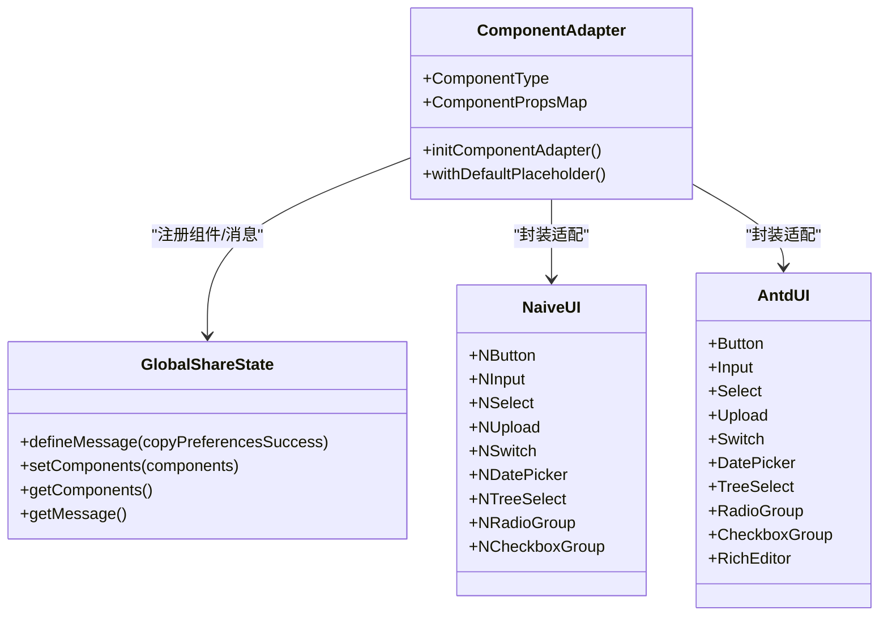
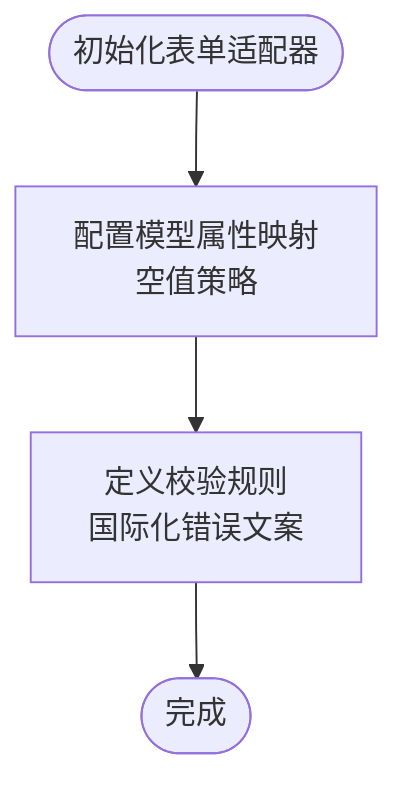
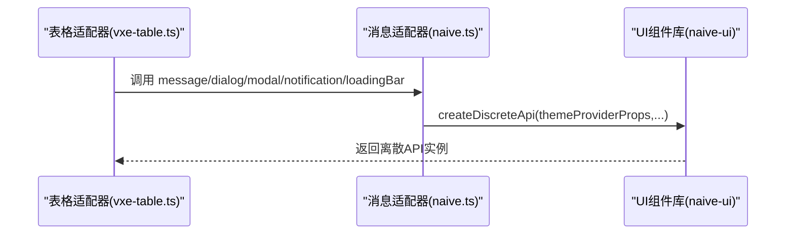
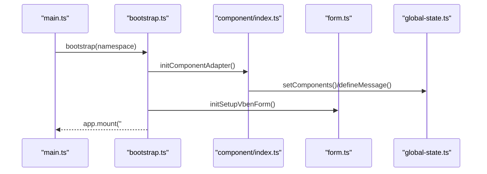
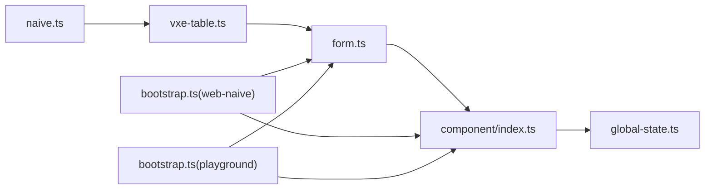

# 组件适配器模式

<cite>
**本文引用的文件**
- [apps/web-naive/src/adapter/component/index.ts](file://apps/web-naive/src/adapter/component/index.ts)
- [apps/web-naive/src/adapter/form.ts](file://apps/web-naive/src/adapter/form.ts)
- [apps/web-naive/src/adapter/vxe-table.ts](file://apps/web-naive/src/adapter/vxe-table.ts)
- [apps/web-naive/src/adapter/naive.ts](file://apps/web-naive/src/adapter/naive.ts)
- [apps/web-naive/src/bootstrap.ts](file://apps/web-naive/src/bootstrap.ts)
- [apps/web-naive/src/main.ts](file://apps/web-naive/src/main.ts)
- [apps/web-naive/src/preferences.ts](file://apps/web-naive/src/preferences.ts)
- [playground/src/adapter/component/index.ts](file://playground/src/adapter/component/index.ts)
- [playground/src/adapter/form.ts](file://playground/src/adapter/form.ts)
- [playground/src/adapter/vxe-table.ts](file://playground/src/adapter/vxe-table.ts)
- [playground/src/bootstrap.ts](file://playground/src/bootstrap.ts)
- [playground/src/main.ts](file://playground/src/main.ts)
- [playground/src/preferences.ts](file://playground/src/preferences.ts)
- [packages/@core/base/shared/src/global-state.ts](file://packages/@core/base/shared/src/global-state.ts)
</cite>

## 目录

1. [引言](#引言)
2. [项目结构](#项目结构)
3. [核心组件](#核心组件)
4. [架构总览](#架构总览)
5. [组件详解](#组件详解)
6. [依赖关系分析](#依赖关系分析)
7. [性能考量](#性能考量)
8. [故障排查指南](#故障排查指南)
9. [结论](#结论)
10. [附录](#附录)

## 引言

本文件系统性阐述 shiyu-ui 项目中的“组件适配器模式”，围绕 UI 组件的统一管理与扩展展开，重点说明以下方面：

- 设计理念与实现原理：通过适配器屏蔽底层 UI 库差异，统一组件类型与属性映射，集中管理消息提示与主题风格。
- 适配器类型与职责：组件适配器、表单适配器、UI 库适配器（含消息提示）。
- 注册机制与生命周期：在应用启动阶段完成适配器初始化与全局状态注入。
- 跨 UI 库兼容与迁移：以统一抽象对接不同组件库（Naive UI 与 Ant Design Vue），降低迁移成本。
- 自定义适配器开发指南与最佳实践：提供可复用的封装模板与注意事项。

## 项目结构

本项目采用多应用与多适配器目录组织，核心适配器位于各应用的 adapter 目录下，分别针对 Naive UI 与 Ant Design Vue 提供适配实现；公共全局状态由共享包提供，贯穿所有适配器。

图表来源

- [apps/web-naive/src/main.ts:1-32](file://apps/web-naive/src/main.ts#L1-L32)
- [apps/web-naive/src/bootstrap.ts:1-77](file://apps/web-naive/src/bootstrap.ts#L1-L77)
- [apps/web-naive/src/adapter/component/index.ts:163-273](file://apps/web-naive/src/adapter/component/index.ts#L163-L273)
- [apps/web-naive/src/adapter/form.ts:11-38](file://apps/web-naive/src/adapter/form.ts#L11-L38)
- [apps/web-naive/src/adapter/vxe-table.ts:21-257](file://apps/web-naive/src/adapter/vxe-table.ts#L21-L257)
- [apps/web-naive/src/adapter/naive.ts:16-26](file://apps/web-naive/src/adapter/naive.ts#L16-L26)
- [playground/src/main.ts:1-33](file://playground/src/main.ts#L1-L33)
- [playground/src/bootstrap.ts:1-91](file://playground/src/bootstrap.ts#L1-L91)
- [playground/src/adapter/component/index.ts:671-752](file://playground/src/adapter/component/index.ts#L671-L752)
- [playground/src/adapter/form.ts:11-41](file://playground/src/adapter/form.ts#L11-L41)
- [playground/src/adapter/vxe-table.ts:21-282](file://playground/src/adapter/vxe-table.ts#L21-L282)
- [packages/@core/base/shared/src/global-state.ts:19-45](file://packages/@core/base/shared/src/global-state.ts#L19-L45)

章节来源

- [apps/web-naive/src/main.ts:1-32](file://apps/web-naive/src/main.ts#L1-L32)
- [apps/web-naive/src/bootstrap.ts:19-74](file://apps/web-naive/src/bootstrap.ts#L19-L74)
- [playground/src/main.ts:1-33](file://playground/src/main.ts#L1-L33)
- [playground/src/bootstrap.ts:21-87](file://playground/src/bootstrap.ts#L21-L87)

## 核心组件

- 组件适配器：负责将底层 UI 组件（如 Input、Select、Upload 等）统一封装为统一的 ComponentType 与 ComponentPropsMap，提供默认占位符、默认按钮、分组渲染等增强能力，并将组件注册至全局共享状态。
- 表单适配器：基于统一的表单框架，配置模型属性映射、空值策略与校验规则，确保不同 UI 库的表单行为一致。
- UI 库适配器（消息与主题）：为 UI 库提供离散 API（消息、对话框、通知、加载条、模态框）与主题覆盖，保证全局一致的交互体验。
- 全局共享状态：提供组件注册、消息提示定义与读取的单例接口，避免重复初始化与跨模块耦合。

章节来源

- [apps/web-naive/src/adapter/component/index.ts:122-161](file://apps/web-naive/src/adapter/component/index.ts#L122-L161)
- [apps/web-naive/src/adapter/form.ts:11-38](file://apps/web-naive/src/adapter/form.ts#L11-L38)
- [apps/web-naive/src/adapter/naive.ts:16-26](file://apps/web-naive/src/adapter/naive.ts#L16-L26)
- [packages/@core/base/shared/src/global-state.ts:19-45](file://packages/@core/base/shared/src/global-state.ts#L19-L45)

## 架构总览

适配器模式的核心在于“统一抽象 + 分层适配”。应用启动时，先初始化组件适配器（注册组件与消息），再初始化表单适配器（配置模型属性与校验），最后挂载应用。表格适配器在统一的 vxe-table 插件上注册单元格渲染器与操作按钮，形成“组件层 → 表单层 → 表格层”的清晰边界。

图表来源

- [apps/web-naive/src/main.ts:9-29](file://apps/web-naive/src/main.ts#L9-L29)
- [apps/web-naive/src/bootstrap.ts:19-24](file://apps/web-naive/src/bootstrap.ts#L19-L24)
- [apps/web-naive/src/adapter/component/index.ts:163-273](file://apps/web-naive/src/adapter/component/index.ts#L163-L273)
- [apps/web-naive/src/adapter/form.ts:11-38](file://apps/web-naive/src/adapter/form.ts#L11-L38)
- [apps/web-naive/src/adapter/vxe-table.ts:21-257](file://apps/web-naive/src/adapter/vxe-table.ts#L21-L257)
- [apps/web-naive/src/adapter/naive.ts:16-26](file://apps/web-naive/src/adapter/naive.ts#L16-L26)
- [packages/@core/base/shared/src/global-state.ts:40-42](file://packages/@core/base/shared/src/global-state.ts#L40-L42)

## 组件详解

### 组件适配器（Component Adapter）

- 统一组件类型与属性映射：通过 ComponentType 与 ComponentPropsMap 明确组件名与属性集合，便于 Schema 联动提示与类型安全。
- 默认占位符增强：withDefaultPlaceholder 为输入类组件自动注入本地化占位符，减少重复配置。
- 分组渲染与默认按钮：对 CheckboxGroup、RadioGroup 等提供默认插槽渲染；提供 DefaultButton、PrimaryButton 等常用按钮别名。
- 组件注册与消息定义：initComponentAdapter 将组件注册到全局共享状态，并定义复制偏好设置成功的消息回调。
- 与 UI 库的桥接：Naive UI 版本使用 defineAsyncComponent 按需加载底层组件，Ant Design Vue 版本提供更丰富的上传、富文本、可折叠参数等适配。

图表来源

- [apps/web-naive/src/adapter/component/index.ts:122-161](file://apps/web-naive/src/adapter/component/index.ts#L122-L161)
- [apps/web-naive/src/adapter/component/index.ts:163-273](file://apps/web-naive/src/adapter/component/index.ts#L163-L273)
- [playground/src/adapter/component/index.ts:603-669](file://playground/src/adapter/component/index.ts#L603-L669)
- [playground/src/adapter/component/index.ts:671-752](file://playground/src/adapter/component/index.ts#L671-L752)
- [packages/@core/base/shared/src/global-state.ts:19-45](file://packages/@core/base/shared/src/global-state.ts#L19-L45)

章节来源

- [apps/web-naive/src/adapter/component/index.ts:87-119](file://apps/web-naive/src/adapter/component/index.ts#L87-L119)
- [apps/web-naive/src/adapter/component/index.ts:163-273](file://apps/web-naive/src/adapter/component/index.ts#L163-L273)
- [playground/src/adapter/component/index.ts:139-171](file://playground/src/adapter/component/index.ts#L139-L171)
- [playground/src/adapter/component/index.ts:671-752](file://playground/src/adapter/component/index.ts#L671-L752)

### 表单适配器（Form Adapter）

- 模型属性映射：针对不同 UI 库的 v-model 名称差异（如 checked、fileList、value）进行统一映射，确保表单框架行为一致。
- 空值策略：为不同 UI 库设定空值默认值（如 Naive UI 使用 null），保证重置与验证一致性。
- 校验规则国际化：提供 required、selectRequired 等规则的本地化错误文案。
- 与表格适配器协作：通过 useVbenForm 注入表格渲染器，使表格操作按钮与表单联动。

图表来源

- [apps/web-naive/src/adapter/form.ts:11-38](file://apps/web-naive/src/adapter/form.ts#L11-L38)
- [playground/src/adapter/form.ts:11-41](file://playground/src/adapter/form.ts#L11-L41)

章节来源

- [apps/web-naive/src/adapter/form.ts:11-46](file://apps/web-naive/src/adapter/form.ts#L11-L46)
- [playground/src/adapter/form.ts:11-49](file://playground/src/adapter/form.ts#L11-L49)

### UI 库适配器（消息与主题）

- 离散 API：为 message、dialog、notification、loadingBar、modal 提供统一的 createDiscreteApi 调用，结合主题覆盖实现一致的视觉与交互。
- 主题切换：根据偏好设置动态选择 lightTheme/darkTheme，确保全局主题一致。
- 与表格适配器协作：表格单元格渲染器（如 CellSwitch、CellTag、CellOperation）使用 UI 库提供的组件与事件，保证操作一致性。

图表来源

- [apps/web-naive/src/adapter/vxe-table.ts:107-131](file://apps/web-naive/src/adapter/vxe-table.ts#L107-L131)
- [apps/web-naive/src/adapter/vxe-table.ts:136-251](file://apps/web-naive/src/adapter/vxe-table.ts#L136-L251)
- [apps/web-naive/src/adapter/naive.ts:16-26](file://apps/web-naive/src/adapter/naive.ts#L16-L26)

章节来源

- [apps/web-naive/src/adapter/naive.ts:8-26](file://apps/web-naive/src/adapter/naive.ts#L8-L26)
- [apps/web-naive/src/adapter/vxe-table.ts:21-282](file://apps/web-naive/src/adapter/vxe-table.ts#L21-L282)

### 生命周期与注册机制

- 应用启动流程：main.ts 初始化偏好设置，bootstrap.ts 中按顺序调用 initComponentAdapter、initSetupVbenForm，随后挂载应用。
- 全局状态注入：组件适配器在 initComponentAdapter 中将组件与消息写入 globalShareState，供其他模块读取。
- 表格适配器：setupVbenVxeTable 接收 configVxeTable 与 useVbenForm，完成表格渲染器与操作按钮的注册。

图表来源

- [apps/web-naive/src/main.ts:9-29](file://apps/web-naive/src/main.ts#L9-L29)
- [apps/web-naive/src/bootstrap.ts:19-24](file://apps/web-naive/src/bootstrap.ts#L19-L24)
- [apps/web-naive/src/adapter/component/index.ts:259-270](file://apps/web-naive/src/adapter/component/index.ts#L259-L270)
- [packages/@core/base/shared/src/global-state.ts:40-42](file://packages/@core/base/shared/src/global-state.ts#L40-L42)

章节来源

- [apps/web-naive/src/main.ts:9-32](file://apps/web-naive/src/main.ts#L9-L32)
- [apps/web-naive/src/bootstrap.ts:19-74](file://apps/web-naive/src/bootstrap.ts#L19-L74)
- [playground/src/main.ts:9-33](file://playground/src/main.ts#L9-L33)
- [playground/src/bootstrap.ts:21-87](file://playground/src/bootstrap.ts#L21-L87)

### 跨 UI 库兼容与迁移

- 统一抽象：通过 ComponentType/ComponentPropsMap 抽象组件类型与属性，屏蔽底层差异。
- 按需加载：组件适配器使用 defineAsyncComponent 实现异步加载，降低首屏体积。
- 规则与主题：表单校验规则与消息主题在不同 UI 库中保持一致，便于迁移。
- 最佳实践：新增组件时，优先在适配器中注册并提供默认占位符；复杂交互建议封装为渲染器或工具函数，避免分散在业务组件中。

章节来源

- [apps/web-naive/src/adapter/component/index.ts:122-161](file://apps/web-naive/src/adapter/component/index.ts#L122-L161)
- [playground/src/adapter/component/index.ts:603-669](file://playground/src/adapter/component/index.ts#L603-L669)
- [apps/web-naive/src/adapter/naive.ts:16-26](file://apps/web-naive/src/adapter/naive.ts#L16-L26)

### 自定义适配器开发指南与最佳实践

- 组件封装
  - 使用 withDefaultPlaceholder 为输入类组件注入本地化占位符，减少重复配置。
  - 对分组组件（如 RadioGroup/CheckboxGroup）提供默认插槽渲染，支持 options 属性驱动。
  - 为常用按钮提供别名（如 DefaultButton/PrimaryButton），提升一致性。
- 表单适配
  - 在 initSetupVbenForm 中配置 modelPropNameMap 与空值策略，确保不同 UI 库的行为一致。
  - 定义国际化校验规则，避免硬编码文案。
- 表格适配
  - 在 setupVbenVxeTable 的 configVxeTable 中统一表格配置与渲染器。
  - 使用 UI 库组件（如 NSwitch/NTag/NButton/NPopconfirm）实现 CellSwitch/CellTag/CellOperation。
- 全局状态
  - 通过 globalShareState.setComponents 注册组件，defineMessage 定义消息回调，避免重复初始化。
- 生命周期
  - 在 bootstrap 中按序初始化组件与表单适配器，最后挂载应用。
- 迁移建议
  - 新增组件时，先在适配器中注册，再在业务中引用，确保统一管理。
  - 对复杂交互封装为渲染器或工具函数，便于跨 UI 库复用。

章节来源

- [apps/web-naive/src/adapter/component/index.ts:87-119](file://apps/web-naive/src/adapter/component/index.ts#L87-L119)
- [apps/web-naive/src/adapter/component/index.ts:196-256](file://apps/web-naive/src/adapter/component/index.ts#L196-L256)
- [apps/web-naive/src/adapter/form.ts:11-38](file://apps/web-naive/src/adapter/form.ts#L11-L38)
- [apps/web-naive/src/adapter/vxe-table.ts:21-257](file://apps/web-naive/src/adapter/vxe-table.ts#L21-L257)
- [packages/@core/base/shared/src/global-state.ts:26-42](file://packages/@core/base/shared/src/global-state.ts#L26-L42)

## 依赖关系分析

- 组件适配器依赖 UI 库组件与全局共享状态；表单适配器依赖组件适配器提供的类型与属性映射；表格适配器依赖表单适配器与 UI 库组件；消息适配器依赖 UI 库离散 API 与主题配置。
- 通过 defineAsyncComponent 实现按需加载，降低初始包体；通过 globalShareState 单例避免重复初始化。

图表来源

- [apps/web-naive/src/adapter/component/index.ts:163-273](file://apps/web-naive/src/adapter/component/index.ts#L163-L273)
- [apps/web-naive/src/adapter/form.ts:11-38](file://apps/web-naive/src/adapter/form.ts#L11-L38)
- [apps/web-naive/src/adapter/vxe-table.ts:21-257](file://apps/web-naive/src/adapter/vxe-table.ts#L21-L257)
- [apps/web-naive/src/adapter/naive.ts:16-26](file://apps/web-naive/src/adapter/naive.ts#L16-L26)
- [apps/web-naive/src/bootstrap.ts:19-24](file://apps/web-naive/src/bootstrap.ts#L19-L24)
- [playground/src/bootstrap.ts:21-26](file://playground/src/bootstrap.ts#L21-L26)

章节来源

- [apps/web-naive/src/bootstrap.ts:19-74](file://apps/web-naive/src/bootstrap.ts#L19-L74)
- [playground/src/bootstrap.ts:21-87](file://playground/src/bootstrap.ts#L21-L87)

## 性能考量

- 按需加载：组件适配器使用 defineAsyncComponent，仅在使用时加载底层 UI 组件，降低首屏体积。
- 渲染器优化：表格渲染器尽量使用轻量级组件与最小化计算，避免在渲染器中执行复杂逻辑。
- 全局状态：通过单例 globalShareState 避免重复初始化与内存泄漏风险。
- 主题与消息：离散 API 按需调用，避免不必要的全局样式注入。

## 故障排查指南

- 组件未显示或报错
  - 检查组件是否已在 initComponentAdapter 中注册到 globalShareState。
  - 确认 ComponentType 与 ComponentPropsMap 是否匹配。
- 表单重置无效
  - 检查 modelPropNameMap 与空值策略是否与 UI 库一致（如 Naive UI 使用 null）。
- 表格渲染异常
  - 确认 setupVbenVxeTable 已正确注册 renderer（如 CellSwitch/CellTag/CellOperation）。
  - 检查 UI 库组件版本与渲染器参数是否匹配。
- 消息提示不生效
  - 确认 naive.ts 中 createDiscreteApi 已正确配置 themeProviderProps 与 messageProviderProps。
- 生命周期顺序
  - 确保在 bootstrap 中先 initComponentAdapter，再 initSetupVbenForm，最后挂载应用。

章节来源

- [apps/web-naive/src/adapter/component/index.ts:259-270](file://apps/web-naive/src/adapter/component/index.ts#L259-L270)
- [apps/web-naive/src/adapter/form.ts:11-38](file://apps/web-naive/src/adapter/form.ts#L11-L38)
- [apps/web-naive/src/adapter/vxe-table.ts:21-257](file://apps/web-naive/src/adapter/vxe-table.ts#L21-L257)
- [apps/web-naive/src/adapter/naive.ts:16-26](file://apps/web-naive/src/adapter/naive.ts#L16-L26)
- [apps/web-naive/src/bootstrap.ts:19-24](file://apps/web-naive/src/bootstrap.ts#L19-L24)

## 结论

通过组件适配器模式，shiyu-ui 实现了 UI 组件的统一管理与扩展，显著降低了跨 UI 库的迁移成本与维护复杂度。组件适配器、表单适配器与 UI 库适配器协同工作，配合全局共享状态与严格的生命周期管理，形成了高内聚、低耦合的适配体系。遵循本文的最佳实践，可在新项目或迁移过程中快速落地统一的组件抽象与一致的用户体验。

## 附录

- 关键实现路径参考
  - 组件适配器初始化：[apps/web-naive/src/adapter/component/index.ts:163-273](file://apps/web-naive/src/adapter/component/index.ts#L163-L273)
  - 表单适配器初始化：[apps/web-naive/src/adapter/form.ts:11-38](file://apps/web-naive/src/adapter/form.ts#L11-L38)
  - 表格适配器初始化：[apps/web-naive/src/adapter/vxe-table.ts:21-257](file://apps/web-naive/src/adapter/vxe-table.ts#L21-L257)
  - 消息与主题适配器：[apps/web-naive/src/adapter/naive.ts:16-26](file://apps/web-naive/src/adapter/naive.ts#L16-L26)
  - 全局共享状态：[packages/@core/base/shared/src/global-state.ts:19-45](file://packages/@core/base/shared/src/global-state.ts#L19-L45)
  - 应用启动流程（web-naive）：[apps/web-naive/src/main.ts:9-29](file://apps/web-naive/src/main.ts#L9-L29)，[apps/web-naive/src/bootstrap.ts:19-24](file://apps/web-naive/src/bootstrap.ts#L19-L24)
  - 应用启动流程（playground）：[playground/src/main.ts:9-29](file://playground/src/main.ts#L9-L29)，[playground/src/bootstrap.ts:21-26](file://playground/src/bootstrap.ts#L21-L26)
