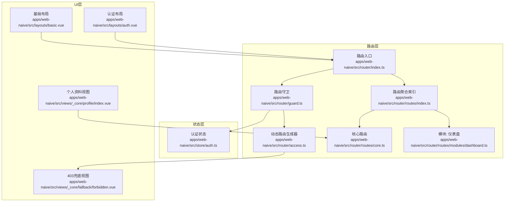
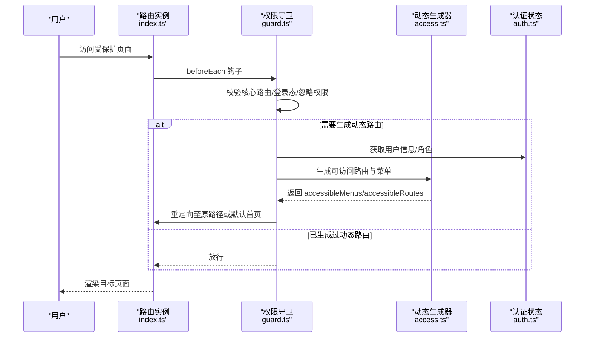
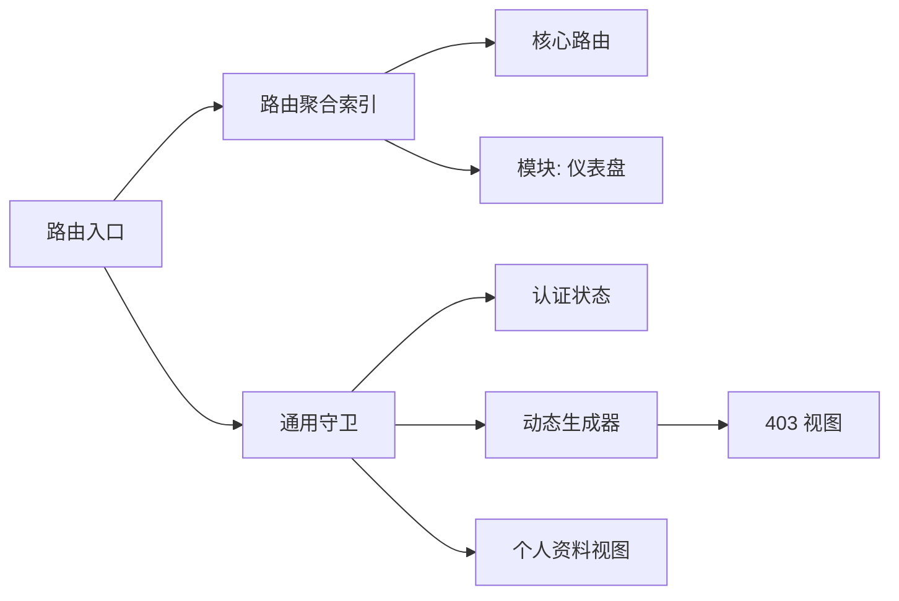

# 路由系统架构

<cite>
**本文引用的文件**
- [apps/web-naive/src/router/index.ts](file://apps/web-naive/src/router/index.ts)
- [apps/web-naive/src/router/guard.ts](file://apps/web-naive/src/router/guard.ts)
- [apps/web-naive/src/router/access.ts](file://apps/web-naive/src/router/access.ts)
- [apps/web-naive/src/router/routes/index.ts](file://apps/web-naive/src/router/routes/index.ts)
- [apps/web-naive/src/router/routes/core.ts](file://apps/web-naive/src/router/routes/core.ts)
- [apps/web-naive/src/router/routes/modules/dashboard.ts](file://apps/web-naive/src/router/routes/modules/dashboard.ts)
- [apps/web-naive/src/store/auth.ts](file://apps/web-naive/src/store/auth.ts)
- [apps/web-naive/src/layouts/basic.vue](file://apps/web-naive/src/layouts/basic.vue)
- [apps/web-naive/src/layouts/auth.vue](file://apps/web-naive/src/layouts/auth.vue)
- [apps/web-naive/src/views/_core/fallback/forbidden.vue](file://apps/web-naive/src/views/_core/fallback/forbidden.vue)
- [apps/web-naive/src/views/_core/profile/index.vue](file://apps/web-naive/src/views/_core/profile/index.vue)
</cite>

## 更新摘要

**所做更改**

- 新增个人资料路由模块，完善用户个人信息管理功能
- 改进路由守卫逻辑，分离认证相关路由处理
- 优化动态路由生成机制，增强权限验证流程
- 完善路由元信息设计，支持更精细的权限控制

## 目录

1. [简介](#简介)
2. [项目结构](#项目结构)
3. [核心组件](#核心组件)
4. [架构总览](#架构总览)
5. [详细组件分析](#详细组件分析)
6. [依赖关系分析](#依赖关系分析)
7. [性能考虑](#性能考虑)
8. [故障排查指南](#故障排查指南)
9. [结论](#结论)

## 简介

本文件系统性梳理 shiyu-ui 项目中基于 Vue Router 的路由系统架构与实现细节，重点覆盖以下方面：

- 路由配置与模块化组织：如何通过目录扫描与合并构建动态路由集合。
- 动态路由生成机制：结合用户权限与菜单接口，按需生成可访问路由与菜单。
- 路由守卫体系：导航拦截、权限验证、登录状态检查与重定向逻辑。
- 路由元信息设计：权限标识、菜单显示控制、标签页与面包屑配置。
- 嵌套路由与懒加载：父子路由层级与按需加载策略。
- 调试与性能优化：进度条、缓存、重定向路径计算与性能建议。

## 项目结构

路由系统位于应用层目录 apps/web-naive/src/router 下，采用"核心路由 + 模块化动态路由"的组织方式：

- 路由入口与实例化：在路由入口中创建 Router 实例，注入历史模式与滚动行为，并挂载全局守卫。
- 守卫与权限：统一的权限守卫负责登录态检查、动态路由生成与重定向。
- 动态路由生成：通过访问生成器对接菜单接口与页面映射，生成可访问路由与菜单树。
- 路由模块：按功能域拆分模块文件，集中于 routes/modules 目录，便于扩展与维护。
- 布局与视图：根布局与认证布局配合路由元信息控制菜单、标签页与面包屑展示。

**图表来源**

- [apps/web-naive/src/router/index.ts:1-38](file://apps/web-naive/src/router/index.ts#L1-L38)
- [apps/web-naive/src/router/guard.ts:1-141](file://apps/web-naive/src/router/guard.ts#L1-L141)
- [apps/web-naive/src/router/access.ts:1-41](file://apps/web-naive/src/router/access.ts#L1-L41)
- [apps/web-naive/src/router/routes/index.ts:1-38](file://apps/web-naive/src/router/routes/index.ts#L1-L38)
- [apps/web-naive/src/router/routes/core.ts:1-109](file://apps/web-naive/src/router/routes/core.ts#L1-L109)
- [apps/web-naive/src/router/routes/modules/dashboard.ts:1-39](file://apps/web-naive/src/router/routes/modules/dashboard.ts#L1-L39)
- [apps/web-naive/src/store/auth.ts:1-119](file://apps/web-naive/src/store/auth.ts#L1-L119)
- [apps/web-naive/src/layouts/basic.vue:1-237](file://apps/web-naive/src/layouts/basic.vue#L1-L237)
- [apps/web-naive/src/layouts/auth.vue:1-26](file://apps/web-naive/src/layouts/auth.vue#L1-L26)
- [apps/web-naive/src/views/\_core/fallback/forbidden.vue:1-10](file://apps/web-naive/src/views/_core/fallback/forbidden.vue#L1-L10)
- [apps/web-naive/src/views/\_core/profile/index.vue:1-50](file://apps/web-naive/src/views/_core/profile/index.vue#L1-L50)

**章节来源**

- [apps/web-naive/src/router/index.ts:1-38](file://apps/web-naive/src/router/index.ts#L1-L38)
- [apps/web-naive/src/router/routes/index.ts:1-38](file://apps/web-naive/src/router/routes/index.ts#L1-L38)

## 核心组件

- 路由实例与历史模式
  - 基于环境变量选择 Hash 或 HTML5 History 模式，设置基础路径与滚动行为。
  - 初始化时注入基础路由与兜底 404，并创建全局守卫。
- 路由聚合与模块化
  - 通过目录扫描合并动态路由模块，形成完整的路由表；核心路由与外部/静态路由分离管理。
- 动态路由生成
  - 依据用户角色与菜单接口，生成可访问路由与菜单树；支持无权限时跳转 403。
- 路由守卫
  - 通用守卫：记录已加载页面、控制进度条。
  - 权限守卫：登录态检查、忽略权限路由、首次生成动态路由、重定向回原路径。
- 认证状态与登录流程
  - 登录成功后写入令牌与用户信息，触发动态路由生成与首页跳转。
- 布局与视图
  - 根布局承载菜单、标签页与通知等；认证布局用于登录/注册等页面；403 视图用于无权限场景。

**章节来源**

- [apps/web-naive/src/router/index.ts:15-38](file://apps/web-naive/src/router/index.ts#L15-L38)
- [apps/web-naive/src/router/routes/index.ts:7-38](file://apps/web-naive/src/router/routes/index.ts#L7-L38)
- [apps/web-naive/src/router/access.ts:16-41](file://apps/web-naive/src/router/access.ts#L16-L41)
- [apps/web-naive/src/router/guard.ts:17-129](file://apps/web-naive/src/router/guard.ts#L17-L129)
- [apps/web-naive/src/store/auth.ts:28-79](file://apps/web-naive/src/store/auth.ts#L28-L79)

## 架构总览

下图展示了从路由初始化到动态路由生成与守卫拦截的关键交互：

**图表来源**

- [apps/web-naive/src/router/index.ts:32-38](file://apps/web-naive/src/router/index.ts#L32-L38)
- [apps/web-naive/src/router/guard.ts:47-119](file://apps/web-naive/src/router/guard.ts#L47-L119)
- [apps/web-naive/src/router/access.ts:16-41](file://apps/web-naive/src/router/access.ts#L16-L41)
- [apps/web-naive/src/store/auth.ts:101-105](file://apps/web-naive/src/store/auth.ts#L101-L105)

## 详细组件分析

### 路由入口与实例化

- 历史模式选择：根据环境变量决定 Hash 或 HTML5 History，并支持基础路径配置。
- 滚动行为：优先恢复历史位置，否则平滑滚动到锚点或顶部。
- 初始化：注入基础路由与兜底 404；创建并挂载全局守卫；导出路由实例与重置方法。

**章节来源**

- [apps/web-naive/src/router/index.ts:15-38](file://apps/web-naive/src/router/index.ts#L15-L38)

### 路由聚合与模块化

- 目录扫描：使用 Vite 的 import.meta.glob 扫描 modules 下的路由模块文件，按需 eager 加载。
- 合并与拆分：将动态路由与核心路由合并为完整路由表；核心路由不参与权限拦截。
- 名称遍历：对核心路由进行名称提取，用于守卫快速判断。

**章节来源**

- [apps/web-naive/src/router/routes/index.ts:7-38](file://apps/web-naive/src/router/routes/index.ts#L7-L38)

### 核心路由与认证页面

- 根路由 Root：作为所有页面的父级容器，redirect 至默认首页。
- 认证路由 Authentication：包含登录、扫码登录、忘记密码、注册等页面，使用独立布局。
- 个人资料路由 Profile：新增个人资料管理功能，支持基本信息、安全设置、密码修改、通知设置等。
- 兜底 404：隐藏在菜单与面包屑中，确保未匹配路径安全降级。

**更新** 新增个人资料路由模块，完善用户个人信息管理功能

**章节来源**

- [apps/web-naive/src/router/routes/core.ts:11-109](file://apps/web-naive/src/router/routes/core.ts#L11-L109)

### 动态路由模块示例

- 仪表盘模块：包含 Analytics 与 Workspace 两个子路由，展示嵌套与图标配置。
- 示例模块：包含 Naive、Table、Form 等子路由，演示多级嵌套与 keepAlive。
- Vben 项目模块：以 IFrameView 嵌入外部站点，展示外链与徽标配置。

**章节来源**

- [apps/web-naive/src/router/routes/modules/dashboard.ts:5-39](file://apps/web-naive/src/router/routes/modules/dashboard.ts#L5-L39)

### 动态路由生成机制

- 页面映射：通过 import.meta.glob 收集 views 下的所有 .vue 文件，建立页面组件映射。
- 布局映射：内置 BasicLayout 与 IFrameView，供路由选择。
- 菜单拉取：异步调用菜单接口，加载菜单树；支持加载提示。
- 权限与403：当某路由存在但用户无权限时，可替换为 403 组件并保留菜单可见性。
- 结果存储：将可访问菜单与路由写入访问状态，标记已生成动态路由。

**章节来源**

- [apps/web-naive/src/router/access.ts:16-41](file://apps/web-naive/src/router/access.ts#L16-L41)

### 路由守卫实现原理

- 通用守卫
  - 记录已加载页面路径，避免重复执行切换动画等副作用。
  - 控制进度条：首次访问时开启，afterEach 关闭。
- 权限守卫
  - 核心路由放行；若处于登录页且已持有令牌则重定向至首页或 redirect。
  - 登录态检查：无令牌且非忽略权限时，重定向至登录页并携带 redirect。
  - 认证相关路由处理：新增对 /auth 路由的专门处理，无需生成菜单。
  - 首次生成：若尚未生成动态路由，则拉取用户信息与角色，调用生成器，写入状态并重定向。
  - 重定向策略：优先使用 from.query.redirect，其次使用 to.fullPath 或默认首页。

**更新** 改进路由守卫逻辑，分离认证相关路由处理，优化权限验证流程

**章节来源**

- [apps/web-naive/src/router/guard.ts:17-129](file://apps/web-naive/src/router/guard.ts#L17-L129)

### 认证状态与登录流程

- 登录：提交表单后获取 accessToken，同时并发拉取用户信息与权限码，写入状态后跳转首页或回调。
- 登出：调用登出接口，重置全部状态，清除登录过期标记，并可携带当前路由地址重定向至登录页。

**章节来源**

- [apps/web-naive/src/store/auth.ts:28-99](file://apps/web-naive/src/store/auth.ts#L28-L99)

### 布局与视图

- 基础布局：承载菜单、标签页、通知、锁屏等 UI，内部通过 BasicLayout 包裹内容区。
- 认证布局：专用于登录/注册等页面，提供品牌化头部与工具栏区域。
- 403 视图：统一的无权限兜底页面，便于在权限生成阶段替换组件。
- 个人资料视图：提供完整的用户个人信息管理界面，支持多标签页切换。

**更新** 新增个人资料视图组件，支持用户信息的全面管理

**章节来源**

- [apps/web-naive/src/layouts/basic.vue:1-237](file://apps/web-naive/src/layouts/basic.vue#L1-L237)
- [apps/web-naive/src/layouts/auth.vue:1-26](file://apps/web-naive/src/layouts/auth.vue#L1-L26)
- [apps/web-naive/src/views/\_core/fallback/forbidden.vue:1-10](file://apps/web-naive/src/views/_core/fallback/forbidden.vue#L1-L10)
- [apps/web-naive/src/views/\_core/profile/index.vue:1-50](file://apps/web-naive/src/views/_core/profile/index.vue#L1-L50)

## 依赖关系分析

- 路由入口依赖
  - 路由聚合索引：提供 routes、coreRouteNames、accessRoutes。
  - 动态生成器：提供 generateAccess。
  - 通用守卫：提供 createRouterGuard。
- 守卫依赖
  - 认证状态：读取令牌、用户信息与登录过期标记。
  - 访问状态：写入可访问菜单与路由，标记已生成动态路由。
- 动态生成器依赖
  - 页面映射与布局映射：用于构建路由组件与布局选择。
  - 菜单接口：异步获取菜单树。
  - 403 视图：无权限时替换组件。

**图表来源**

- [apps/web-naive/src/router/index.ts:9-10](file://apps/web-naive/src/router/index.ts#L9-L10)
- [apps/web-naive/src/router/guard.ts:8-11](file://apps/web-naive/src/router/guard.ts#L8-L11)
- [apps/web-naive/src/router/access.ts:9-12](file://apps/web-naive/src/router/access.ts#L9-L12)
- [apps/web-naive/src/router/routes/index.ts:5-37](file://apps/web-naive/src/router/routes/index.ts#L5-L37)

**章节来源**

- [apps/web-naive/src/router/index.ts:9-10](file://apps/web-naive/src/router/index.ts#L9-L10)
- [apps/web-naive/src/router/guard.ts:8-11](file://apps/web-naive/src/router/guard.ts#L8-L11)
- [apps/web-naive/src/router/access.ts:9-12](file://apps/web-naive/src/router/access.ts#L9-L12)
- [apps/web-naive/src/router/routes/index.ts:5-37](file://apps/web-naive/src/router/routes/index.ts#L5-L37)

## 性能考虑

- 懒加载与按需打包
  - 路由组件普遍采用动态导入，结合 Vite 的代码分割，减少首屏体积。
- 进度条与页面缓存
  - 通用守卫控制进度条，避免重复执行；loadedPaths 记录已加载页面，减少重复副作用。
- 动态路由生成去重
  - 通过 isAccessChecked 标记，仅在首次访问时生成动态路由，避免重复请求与重定向。
- 历史模式选择
  - 根据部署环境选择 Hash 或 HTML5 History，兼顾兼容性与 SEO。

**章节来源**

- [apps/web-naive/src/router/index.ts:22-27](file://apps/web-naive/src/router/index.ts#L22-L27)
- [apps/web-naive/src/router/guard.ts:17-41](file://apps/web-naive/src/router/guard.ts#L17-L41)
- [apps/web-naive/src/router/guard.ts:88-91](file://apps/web-naive/src/router/guard.ts#L88-L91)

## 故障排查指南

- 登录后未跳转预期页面
  - 检查登录成功后的重定向逻辑与用户首页 homePath 设置。
  - 确认守卫中 redirect 的拼装与 decodeURIComponent 处理。
- 403 页面未正确显示
  - 确认动态生成器中 forbiddenComponent 的替换逻辑与 meta.menuVisibleWithForbidden 配置。
- 菜单不显示或重复
  - 检查 meta.hideInMenu、meta.order 等元信息配置，以及生成器返回的菜单树结构。
- 嵌套路由不生效
  - 确认父路由 component 与 children 结构正确，且未被忽略权限导致被替换为 403。
- 进度条异常
  - 检查通用守卫中进度条开关与 loadedPaths 的记录时机。
- 个人资料路由访问问题
  - 确认 /profile 路由配置正确，且用户具有访问权限。
  - 检查个人资料视图组件的渲染逻辑。

**更新** 新增个人资料路由相关故障排查指导

**章节来源**

- [apps/web-naive/src/store/auth.ts:59-62](file://apps/web-naive/src/store/auth.ts#L59-L62)
- [apps/web-naive/src/router/guard.ts:109-117](file://apps/web-naive/src/router/guard.ts#L109-L117)
- [apps/web-naive/src/router/access.ts:14-37](file://apps/web-naive/src/router/access.ts#L14-L37)

## 结论

本路由系统通过"核心路由 + 模块化动态路由 + 权限守卫 + 动态生成器"的组合，实现了灵活、可扩展且具备良好用户体验的权限控制与导航体验。其关键优势在于：

- 路由模块化与目录扫描，降低维护成本；
- 基于用户角色与菜单接口的动态生成，确保权限与菜单一致；
- 守卫层清晰分离通用与权限逻辑，便于扩展与调试；
- 懒加载与进度条等细节提升性能与交互质量；
- 新增个人资料路由模块，完善用户个人信息管理功能。

**更新** 本次更新增强了路由系统的权限验证能力，优化了认证相关路由的处理逻辑，为用户提供更完善的个人信息管理体验。
