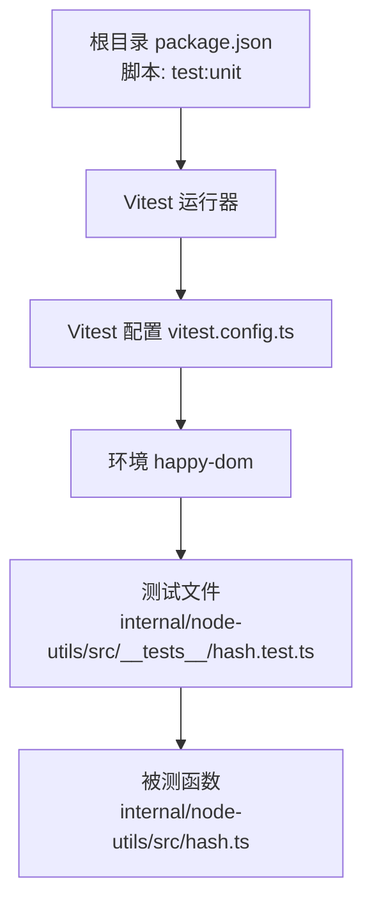
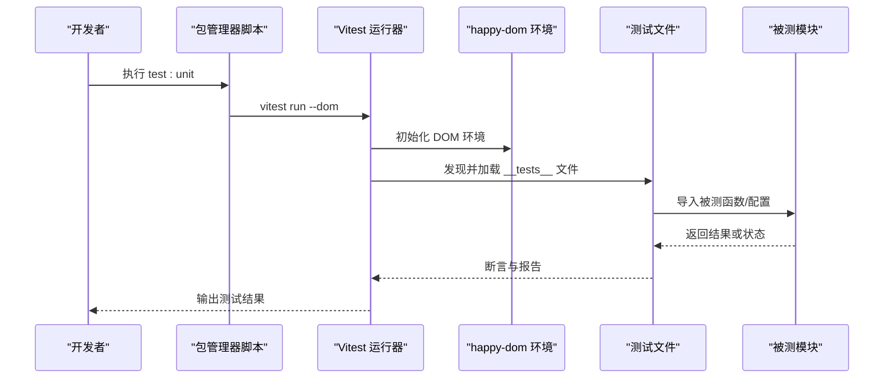
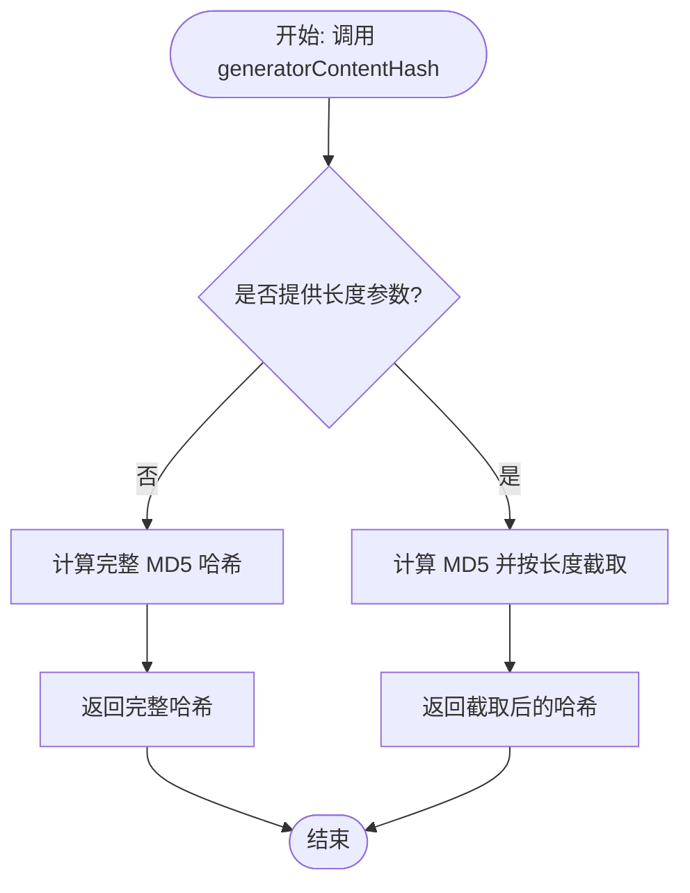
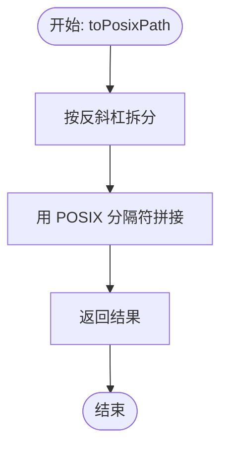
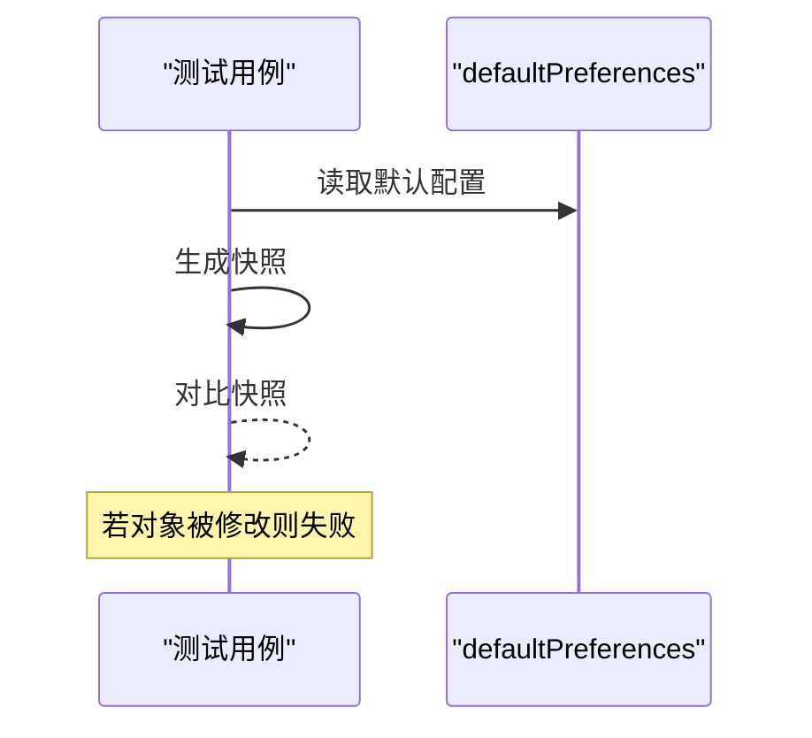
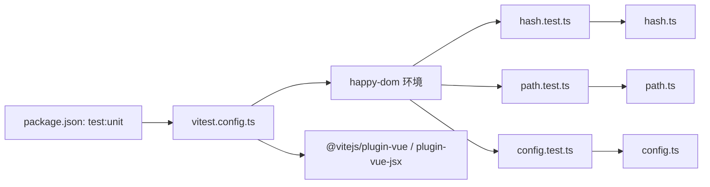

# 单元测试

<cite>
**本文引用的文件**
- [vitest.config.ts](file://vitest.config.ts)
- [package.json](file://package.json)
- [hash.test.ts](file://internal/node-utils/src/__tests__/hash.test.ts)
- [path.test.ts](file://internal/node-utils/src/__tests__/path.test.ts)
- [config.test.ts](file://packages/@core/preferences/__tests__/config.test.ts)
- [hash.ts](file://internal/node-utils/src/hash.ts)
- [path.ts](file://internal/node-utils/src/path.ts)
- [config.ts](file://packages/@core/preferences/src/config.ts)
</cite>

## 目录

1. [简介](#简介)
2. [项目结构](#项目结构)
3. [核心组件](#核心组件)
4. [架构总览](#架构总览)
5. [详细组件分析](#详细组件分析)
6. [依赖分析](#依赖分析)
7. [性能考虑](#性能考虑)
8. [故障排查指南](#故障排查指南)
9. [结论](#结论)
10. [附录](#附录)

## 简介

本文件面向 shiyu-ui 项目的开发者，系统性讲解如何在该仓库中编写与运行高质量的单元测试。内容涵盖 Vitest 的配置与使用、测试文件命名与目录组织、断言与异步测试、mock 与依赖注入最佳实践、以及测试覆盖率的配置与分析方法。通过结合仓库内现有测试样例（函数测试与快照测试），帮助团队建立一致、可维护且高效的单元测试体系。

## 项目结构

- 测试运行器：Vitest
- 测试环境：happy-dom（DOM 模拟）
- 测试入口与脚本：通过根目录 package.json 中的 test:unit 脚本触发
- 测试文件位置：采用“源文件同级目录下 **tests**”的组织方式，例如 internal/node-utils/src/**tests**/hash.test.ts
- 排除规则：自动排除 e2e、dist、node_modules、IDE 缓存等目录

图表来源

- [package.json:62](file://package.json#L62)
- [vitest.config.ts:5-28](file://vitest.config.ts#L5-L28)
- [hash.test.ts:1-53](file://internal/node-utils/src/__tests__/hash.test.ts#L1-L53)
- [hash.ts:1-19](file://internal/node-utils/src/hash.ts#L1-L19)

章节来源

- [package.json:60-67](file://package.json#L60-L67)
- [vitest.config.ts:1-29](file://vitest.config.ts#L1-L29)

## 核心组件

- Vitest 配置与环境
  - 插件：启用 Vue 与 Vue JSX 支持
  - 环境：happy-dom，用于模拟浏览器 DOM API
  - 排除：自动排除 e2e、dist、node_modules、IDE 缓存、部分配置文件
- 测试脚本
  - 使用 vitest run --dom 启动测试，便于 DOM 相关场景
- 测试文件组织
  - 采用 **tests** 目录与被测源文件同级的模式，清晰隔离测试代码
- 断言与快照
  - 使用 expect 进行断言
  - 使用 toMatchSnapshot 进行快照测试，保障默认配置对象不被意外修改

章节来源

- [vitest.config.ts:5-28](file://vitest.config.ts#L5-L28)
- [package.json:62](file://package.json#L62)
- [config.test.ts:1-11](file://packages/@core/preferences/__tests__/config.test.ts#L1-L11)

## 架构总览

下图展示了从命令行到测试执行的关键流程，以及测试文件与被测模块的关系。

图表来源

- [package.json:62](file://package.json#L62)
- [vitest.config.ts:5-28](file://vitest.config.ts#L5-L28)
- [hash.test.ts:1-53](file://internal/node-utils/src/__tests__/hash.test.ts#L1-L53)
- [config.test.ts:1-11](file://packages/@core/preferences/__tests__/config.test.ts#L1-L11)

## 详细组件分析

### 函数测试：内容哈希生成器

- 被测函数：generatorContentHash（基于内容生成 MD5 哈希，支持截取长度）
- 测试要点：
  - 正常输入输出一致性校验
  - 指定长度参数时返回值长度正确
  - 默认长度（不传长度）时返回完整哈希
  - 空字符串输入的边界处理
- 断言策略：
  - 使用 toBe 比较期望值与实际值
  - 使用 toHaveLength 校验长度
- 异步处理：
  - 该函数为纯函数，无异步逻辑；如需模拟异步，可在上层调用处进行 mock 或使用 Vitest 的定时器 API

图表来源

- [hash.ts:8-16](file://internal/node-utils/src/hash.ts#L8-L16)
- [hash.test.ts:7-52](file://internal/node-utils/src/__tests__/hash.test.ts#L7-L52)

章节来源

- [hash.test.ts:1-53](file://internal/node-utils/src/__tests__/hash.test.ts#L1-L53)
- [hash.ts:1-19](file://internal/node-utils/src/hash.ts#L1-L19)

### 函数测试：路径转 POSIX

- 被测函数：toPosixPath（将 Windows 风格路径转换为 POSIX 风格）
- 测试要点：
  - Windows 风格路径转换
  - 已为 POSIX 的路径保持不变
  - 混合分隔符处理
  - 空字符串、仅分隔符、无分隔符、结尾/开头分隔符等边界情况
- 断言策略：
  - 使用 toBe 对比期望结果
- 异步处理：
  - 纯函数，无需异步处理

图表来源

- [path.ts:7-8](file://internal/node-utils/src/path.ts#L7-L8)
- [path.test.ts:7-67](file://internal/node-utils/src/__tests__/path.test.ts#L7-L67)

章节来源

- [path.test.ts:1-68](file://internal/node-utils/src/__tests__/path.test.ts#L1-L68)
- [path.ts:1-12](file://internal/node-utils/src/path.ts#L1-L12)

### 快照测试：默认偏好配置不可变性

- 被测对象：defaultPreferences（偏好配置默认值）
- 测试目标：确保默认配置对象在运行期不被修改，使用快照保护
- 断言策略：
  - 使用 toMatchSnapshot 生成并对比快照
- 异步处理：
  - 无异步逻辑

图表来源

- [config.ts:3-145](file://packages/@core/preferences/src/config.ts#L3-L145)
- [config.test.ts:5-10](file://packages/@core/preferences/__tests__/config.test.ts#L5-L10)

章节来源

- [config.test.ts:1-11](file://packages/@core/preferences/__tests__/config.test.ts#L1-L11)
- [config.ts:1-148](file://packages/@core/preferences/src/config.ts#L1-L148)

## 依赖分析

- 测试运行链路
  - 脚本触发：test:unit -> vitest run --dom
  - 配置加载：vitest.config.ts -> 插件与环境
  - 测试发现：扫描 **tests** 目录下的 \*.test.ts
  - 被测模块：与测试文件同级或通过相对路径导入
- 外部依赖
  - happy-dom 提供 DOM 环境
  - @vitejs/plugin-vue 与 @vitejs/plugin-vue-jsx 支持 Vue 组件与 JSX

图表来源

- [package.json:62](file://package.json#L62)
- [vitest.config.ts:5-28](file://vitest.config.ts#L5-L28)
- [hash.test.ts:1-53](file://internal/node-utils/src/__tests__/hash.test.ts#L1-L53)
- [path.test.ts:1-68](file://internal/node-utils/src/__tests__/path.test.ts#L1-L68)
- [config.test.ts:1-11](file://packages/@core/preferences/__tests__/config.test.ts#L1-L11)
- [hash.ts:1-19](file://internal/node-utils/src/hash.ts#L1-L19)
- [path.ts:1-12](file://internal/node-utils/src/path.ts#L1-L12)
- [config.ts:1-148](file://packages/@core/preferences/src/config.ts#L1-L148)

章节来源

- [package.json:60-67](file://package.json#L60-L67)
- [vitest.config.ts:1-29](file://vitest.config.ts#L1-L29)

## 性能考虑

- 测试隔离与并发
  - 使用独立的测试文件组织，避免跨文件共享可变状态
  - 在需要时使用 Vitest 的并发测试能力（如并行 it 块），但注意避免共享资源竞争
- DOM 操作优化
  - happy-dom 作为虚拟 DOM 环境，性能优于真实浏览器；尽量减少不必要的 DOM 查询与重排
- Mock 与替身
  - 对外部 I/O、网络请求、时间等进行合理 mock，避免真实 IO 影响测试速度
- 排除无关文件
  - 通过 exclude 规则减少扫描范围，提升启动与执行效率

## 故障排查指南

- 环境问题
  - 如果出现 DOM API 未定义错误，请确认已启用 happy-dom 环境与相应插件
- 脚本执行
  - 使用 test:unit 脚本启动测试；若失败，检查 Vitest 版本与配置兼容性
- 排除规则
  - 如测试未被发现，检查 vitest.config.ts 的 exclude 列表是否误排除了 **tests** 目录
- 快照差异
  - 当快照测试失败时，核对默认配置对象是否有意或无意变更；必要时更新快照

章节来源

- [vitest.config.ts:18-26](file://vitest.config.ts#L18-L26)
- [package.json:62](file://package.json#L62)

## 结论

本项目已具备完善的 Vitest 单元测试基础：明确的配置、合理的环境与插件、清晰的测试文件组织与断言策略。建议在后续开发中持续补充更多业务函数与工具函数的测试，并在涉及 DOM、异步与外部依赖的场景中，遵循本文提供的 mock 与依赖注入最佳实践，以保证测试的稳定性与可维护性。

## 附录

### 测试文件命名规范与目录结构

- 命名规范
  - 测试文件统一使用 \*.test.ts 结尾
- 目录结构
  - 与被测源文件同级创建 **tests** 目录，测试文件与被测模块一一对应
- 示例
  - internal/node-utils/src/hash.ts → internal/node-utils/src/**tests**/hash.test.ts
  - internal/node-utils/src/path.ts → internal/node-utils/src/**tests**/path.test.ts
  - packages/@core/preferences/src/config.ts → packages/@core/preferences/**tests**/config.test.ts

章节来源

- [hash.test.ts:1-53](file://internal/node-utils/src/__tests__/hash.test.ts#L1-L53)
- [path.test.ts:1-68](file://internal/node-utils/src/__tests__/path.test.ts#L1-L68)
- [config.test.ts:1-11](file://packages/@core/preferences/__tests__/config.test.ts#L1-L11)

### 断言与异步测试

- 断言
  - 使用 toBe、toHaveLength、toMatchSnapshot 等进行断言
- 异步测试
  - 对于异步函数，使用 Promise 或 async/await；对于定时器类操作，可使用 Vitest 的定时器 API 进行控制与推进

章节来源

- [hash.test.ts:7-52](file://internal/node-utils/src/__tests__/hash.test.ts#L7-L52)
- [path.test.ts:7-67](file://internal/node-utils/src/__tests__/path.test.ts#L7-L67)
- [config.test.ts:5-10](file://packages/@core/preferences/__tests__/config.test.ts#L5-L10)

### 覆盖率配置与分析

- 当前仓库未提供覆盖率配置文件
- 建议在 vitest.config.ts 中添加 coverage 字段以启用覆盖率统计与报告
- 可参考官方 Vitest 文档进行配置，覆盖 HTML、文本等报告格式

章节来源

- [vitest.config.ts:5-28](file://vitest.config.ts#L5-L28)

### mock 对象与依赖注入最佳实践

- 对外部依赖进行替换
  - 使用 Vitest 的 vi.mock 或 vi.spyOn 替换模块导出
- 对全局对象进行控制
  - 使用 vi.setSystemTime、vi.useRealTimers 等控制时间
- 对 DOM 行为进行模拟
  - 在 happy-dom 环境下，可通过设置 window/document 属性或使用自定义实现
- 对 I/O 与网络进行隔离
  - 使用 mock 实现替代 fetch、本地存储等，避免真实副作用

章节来源

- [vitest.config.ts:5-28](file://vitest.config.ts#L5-L28)
