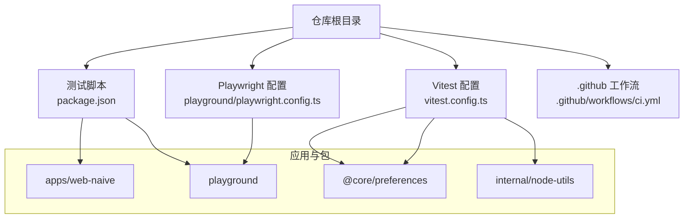
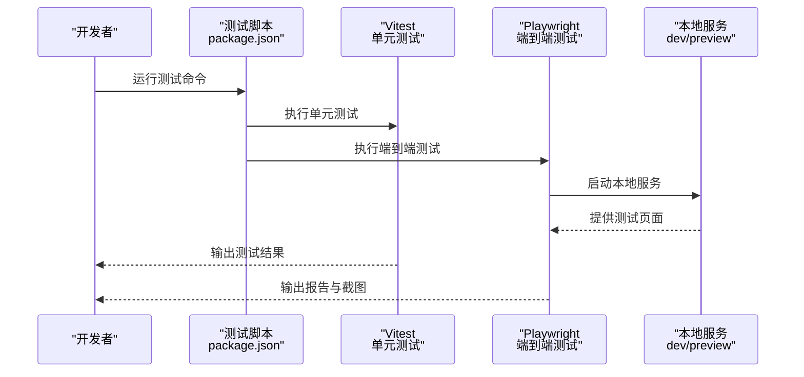
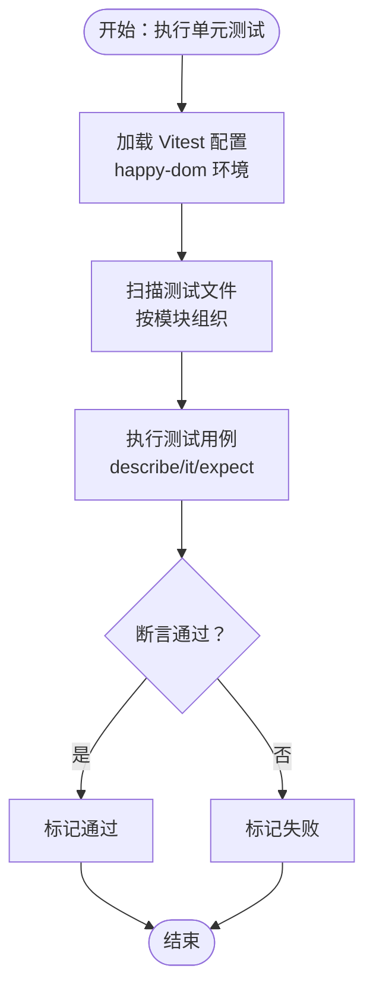
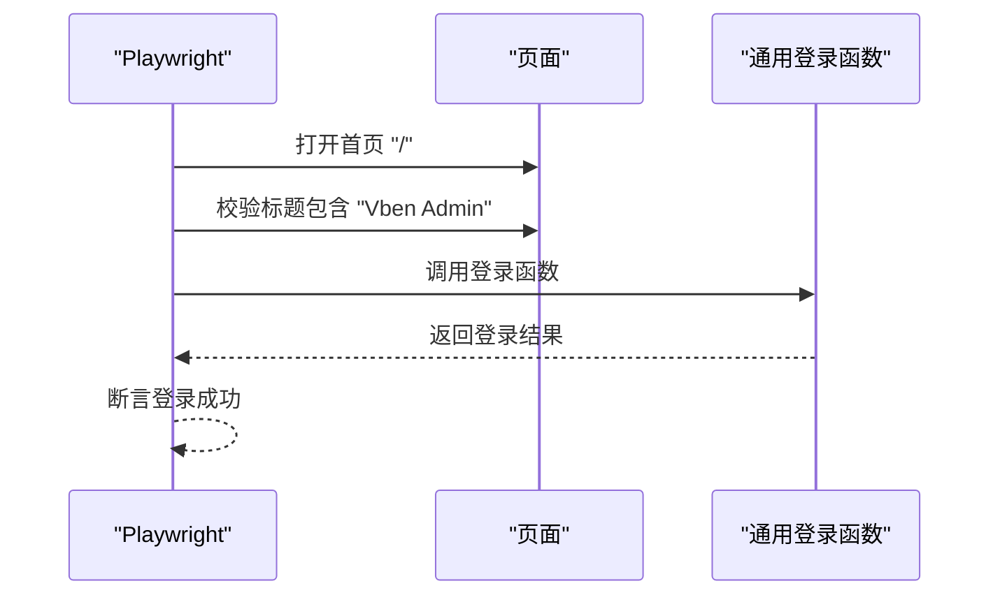
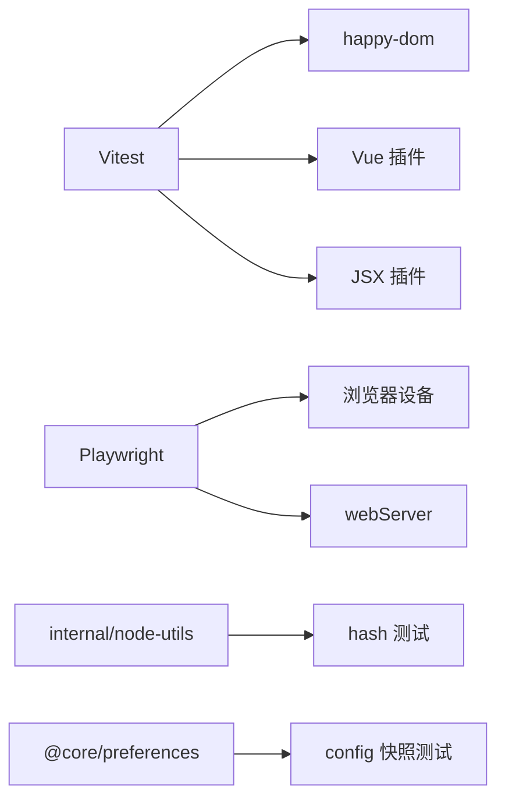

# 测试策略

<cite>
**本文引用的文件**
- [vitest.config.ts](file://vitest.config.ts)
- [package.json](file://package.json)
- [playwright.config.ts](file://playground/playwright.config.ts)
- [auth-login.spec.ts](file://playground/__tests__/e2e/auth-login.spec.ts)
- [hash.test.ts](file://internal/node-utils/src/__tests__/hash.test.ts)
- [hash.ts](file://internal/node-utils/src/hash.ts)
- [config.test.ts](file://packages/@core/preferences/__tests__/config.test.ts)
- [config.ts](file://packages/@core/preferences/src/config.ts)
- [oxlint 配置（测试规则）](file://internal/lint-configs/oxlint-config/src/configs/test.ts)
- [.github 工作流（CI）](file://.github/workflows/ci.yml)
</cite>

## 目录

1. [引言](#引言)
2. [项目结构](#项目结构)
3. [核心组件](#核心组件)
4. [架构总览](#架构总览)
5. [详细组件分析](#详细组件分析)
6. [依赖分析](#依赖分析)
7. [性能考虑](#性能考虑)
8. [故障排查指南](#故障排查指南)
9. [结论](#结论)
10. [附录](#附录)

## 引言

本测试策略文档面向 shiyu-ui 项目，系统化阐述单元测试、集成测试与端到端测试的组织与实施方法，覆盖 Vitest 与 Playwright 的配置要点、测试用例编写规范、测试覆盖率统计与分析、测试数据准备与管理、以及测试自动化与 CI/CD 集成的最佳实践。目标是帮助开发团队建立稳定、高效、可维护的测试体系。

## 项目结构

- 单元测试：采用 Vitest，配置于仓库根目录，使用 happy-dom 环境，排除 e2e 与构建产物等路径。
- 端到端测试：位于 playground 应用的 **tests**/e2e 目录，使用 Playwright，通过本地 dev 或 preview 启动服务进行测试。
- 脚本与工作流：通过 package.json 中的脚本统一触发测试；GitHub Actions 在 CI 环境中运行单元测试与类型检查等任务。

图表来源

- [vitest.config.ts:1-29](file://vitest.config.ts#L1-L29)
- [playwright.config.ts:1-109](file://playground/playwright.config.ts#L1-L109)
- [package.json:27-66](file://package.json#L27-L66)
- [.github 工作流（CI）:17-56](file://.github/workflows/ci.yml#L17-L56)

章节来源

- [vitest.config.ts:1-29](file://vitest.config.ts#L1-L29)
- [playwright.config.ts:1-109](file://playground/playwright.config.ts#L1-L109)
- [package.json:27-66](file://package.json#L27-L66)
- [.github 工作流（CI）:17-56](file://.github/workflows/ci.yml#L17-L56)

## 核心组件

- Vitest 单元测试引擎
  - 使用 happy-dom 作为 DOM 环境，提升执行速度与稳定性。
  - 排除 e2e、dist、node_modules 等路径，避免误匹配。
  - 支持 Vue 与 JSX 插件，适配项目前端技术栈。
- Playwright 端到端测试
  - 预设 Chromium 设备，支持 HTML 报告与失败重试。
  - 自动启动本地服务（dev/preview），统一 baseURL。
  - 支持 CI 下无头模式与并发控制。
- 测试脚本与 CI
  - 统一通过 npm scripts 触发测试；CI 中仅运行单元测试与类型检查等关键流程。

章节来源

- [vitest.config.ts:5-28](file://vitest.config.ts#L5-L28)
- [playwright.config.ts:14-106](file://playground/playwright.config.ts#L14-L106)
- [package.json:62-63](file://package.json#L62-L63)
- [.github 工作流（CI）:49-56](file://.github/workflows/ci.yml#L49-L56)

## 架构总览

下图展示测试体系在本地与 CI 环境中的交互关系，包括测试命令、环境配置与服务启动。

图表来源

- [package.json:62-63](file://package.json#L62-L63)
- [playwright.config.ts:98-102](file://playground/playwright.config.ts#L98-L102)

章节来源

- [package.json:62-63](file://package.json#L62-L63)
- [playwright.config.ts:98-102](file://playground/playwright.config.ts#L98-L102)

## 详细组件分析

### 单元测试：Vitest 配置与用例组织

- 配置要点
  - 环境：happy-dom，启用对禁用脚本加载的兼容处理，保证测试稳定性。
  - 排除：显式排除 e2e、dist、node_modules、各类配置文件等，避免干扰。
  - 插件：启用 Vue 与 JSX 插件，适配组件与 TSX 场景。
- 用例组织
  - 按功能模块划分目录，如 internal/node-utils、packages/@core/preferences 等。
  - 使用 describe/it/expect 组织测试套件，覆盖边界条件与典型路径。
- 示例
  - 内容哈希生成器：验证不同输入、长度参数与空内容的输出一致性。
  - 默认偏好配置：通过快照测试确保默认配置对象不可变。

图表来源

- [vitest.config.ts:5-28](file://vitest.config.ts#L5-L28)
- [hash.test.ts:7-52](file://internal/node-utils/src/__tests__/hash.test.ts#L7-L52)
- [config.test.ts:5-10](file://packages/@core/preferences/__tests__/config.test.ts#L5-L10)

章节来源

- [vitest.config.ts:5-28](file://vitest.config.ts#L5-L28)
- [hash.test.ts:7-52](file://internal/node-utils/src/__tests__/hash.test.ts#L7-L52)
- [hash.ts:8-16](file://internal/node-utils/src/hash.ts#L8-L16)
- [config.test.ts:5-10](file://packages/@core/preferences/__tests__/config.test.ts#L5-L10)
- [config.ts:3-145](file://packages/@core/preferences/src/config.ts#L3-L145)

### 端到端测试：Playwright 配置与场景设计

- 配置要点
  - 期望超时、失败阻断、报告器、重试策略、并行度与 workers 控制。
  - 项目预设：桌面 Chrome；可扩展至移动设备与品牌浏览器。
  - webServer：根据 CI/本地环境选择 dev 或 preview，并复用已有进程。
- 场景设计
  - 登录页标题与元素校验。
  - 登录流程：前置导航至首页，调用通用登录函数完成认证。
- 典型流程

图表来源

- [playwright.config.ts:14-106](file://playground/playwright.config.ts#L14-L106)
- [auth-login.spec.ts:5-20](file://playground/__tests__/e2e/auth-login.spec.ts#L5-L20)

章节来源

- [playwright.config.ts:14-106](file://playground/playwright.config.ts#L14-L106)
- [auth-login.spec.ts:5-20](file://playground/__tests__/e2e/auth-login.spec.ts#L5-L20)

### 测试覆盖率统计与分析

- 当前状态
  - 仓库未配置覆盖率收集与上传（例如未启用覆盖率任务或 codecov 步骤）。
- 建议方案
  - 在 Vitest 中启用覆盖率采集（如基于 Istanbul 或 c8），设置阈值与输出目录。
  - 在 CI 中增加覆盖率上传步骤（如 codecov），并将覆盖率指标纳入 PR 审查。
  - 对关键模块（如 @core/preferences、internal/node-utils）优先保障覆盖率。
- 分析维度
  - 行、分支、函数、语句四类指标，结合业务关键路径设定阈值。
  - 结合变更范围与回归风险，动态调整覆盖率目标。

[本节为通用指导，无需特定文件引用]

### 测试数据准备与管理

- 单元测试数据
  - 使用小而明确的输入样例，覆盖空值、边界长度、特殊字符等。
  - 对纯函数与工具函数，优先使用参数化与边界测试。
- 端到端测试数据
  - 使用最小化可用数据集，避免强依赖真实后端。
  - 可通过 mock 或静态数据源提供登录凭据与页面资源。
- 快照与配置
  - 对配置对象使用快照测试，确保默认值稳定不变。
  - 将快照纳入版本控制，变更需审慎评估与更新。

章节来源

- [hash.test.ts:8-51](file://internal/node-utils/src/__tests__/hash.test.ts#L8-L51)
- [config.test.ts:7-8](file://packages/@core/preferences/__tests__/config.test.ts#L7-L8)
- [config.ts:3-145](file://packages/@core/preferences/src/config.ts#L3-L145)

### 测试自动化与 CI/CD 集成

- 本地执行
  - 通过 npm scripts 统一入口：单元测试与端到端测试分别执行。
- GitHub Actions
  - CI 中运行单元测试与类型检查，确保主干稳定性。
  - 可扩展：在后续阶段加入端到端测试与覆盖率上传。
- 最佳实践
  - 保持测试命令幂等，避免状态污染。
  - 在 CI 中启用无头模式与重试，降低偶发失败影响。
  - 将测试报告与工件归档，便于回溯与定位问题。

章节来源

- [package.json:62-63](file://package.json#L62-L63)
- [.github 工作流（CI）:49-56](file://.github/workflows/ci.yml#L49-L56)

## 依赖分析

- 测试工具链
  - Vitest：单元测试核心，依赖 happy-dom 与 Vue/JSX 插件。
  - Playwright：端到端测试核心，依赖浏览器设备库与 webServer。
- 项目内依赖
  - internal/node-utils：提供基础工具函数，单元测试覆盖其核心逻辑。
  - @core/preferences：提供默认配置对象，单元测试以快照方式保障稳定性。
- 外部依赖
  - CI 环境：Node、pnpm、浏览器驱动（由 Playwright 自动安装）。

图表来源

- [vitest.config.ts:5-28](file://vitest.config.ts#L5-L28)
- [playwright.config.ts:14-106](file://playground/playwright.config.ts#L14-L106)
- [hash.test.ts:7-52](file://internal/node-utils/src/__tests__/hash.test.ts#L7-L52)
- [config.test.ts:5-10](file://packages/@core/preferences/__tests__/config.test.ts#L5-L10)

章节来源

- [vitest.config.ts:5-28](file://vitest.config.ts#L5-L28)
- [playwright.config.ts:14-106](file://playground/playwright.config.ts#L14-L106)
- [hash.test.ts:7-52](file://internal/node-utils/src/__tests__/hash.test.ts#L7-L52)
- [config.test.ts:5-10](file://packages/@core/preferences/__tests__/config.test.ts#L5-L10)

## 性能考虑

- 单元测试
  - 使用 happy-dom 减少浏览器实例启动成本；合理拆分测试文件，避免单文件过大。
  - 对纯函数与工具函数进行充分边界测试，减少重复计算与无效断言。
- 端到端测试
  - 在 CI 中启用无头模式与串行执行，降低资源竞争。
  - 利用 reuseExistingServer 与 workers 控制，平衡速度与稳定性。
- CI 优化
  - 并行矩阵与缓存策略（如 pnpm 缓存）提升整体吞吐。
  - 将耗时任务拆分为独立 job，缩短主干等待时间。

[本节为通用指导，无需特定文件引用]

## 故障排查指南

- 测试无法启动或环境异常
  - 检查 Vitest 配置是否正确加载，确认 happy-dom 设置与插件启用。
  - 确认排除规则未误删测试文件。
- 端到端测试失败
  - 校验 webServer 命令与端口；在 CI 中使用 preview，本地使用 dev。
  - 关注 actionTimeout 与 expect 超时设置，必要时增大。
- 断言失败
  - 对比快照与期望值，确认配置对象未被意外修改。
  - 对工具函数进行参数化测试，覆盖边界与异常路径。
- CI 失败
  - 查看日志与报告工件，定位失败用例与错误堆栈。
  - 在 CI 中开启 trace 与重试，提高稳定性。

章节来源

- [vitest.config.ts:5-28](file://vitest.config.ts#L5-L28)
- [playwright.config.ts:86-102](file://playground/playwright.config.ts#L86-L102)
- [config.test.ts:7-8](file://packages/@core/preferences/__tests__/config.test.ts#L7-L8)

## 结论

本测试策略以 Vitest 与 Playwright 为核心，结合仓库现有配置与脚本，形成从单元测试到端到端测试的完整闭环。建议在现有基础上补充覆盖率统计与上传、扩展端到端测试场景、完善 CI 中的报告与工件归档，持续提升测试质量与反馈效率。

[本节为总结性内容，无需特定文件引用]

## 附录

- 测试规则与约束
  - 使用 oxlint 的测试规则配置，约束测试命名、聚焦测试、钩子顺序等，提升测试一致性与可维护性。
- 快照与配置
  - 对默认配置对象使用快照测试，确保默认值稳定不变，变更需审慎评估。

章节来源

- [oxlint 配置（测试规则）:3-22](file://internal/lint-configs/oxlint-config/src/configs/test.ts#L3-L22)
- [config.test.ts:7-8](file://packages/@core/preferences/__tests__/config.test.ts#L7-L8)
- [config.ts:3-145](file://packages/@core/preferences/src/config.ts#L3-L145)
