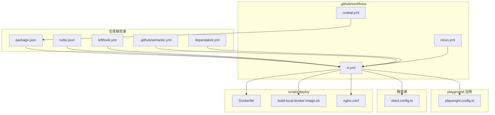
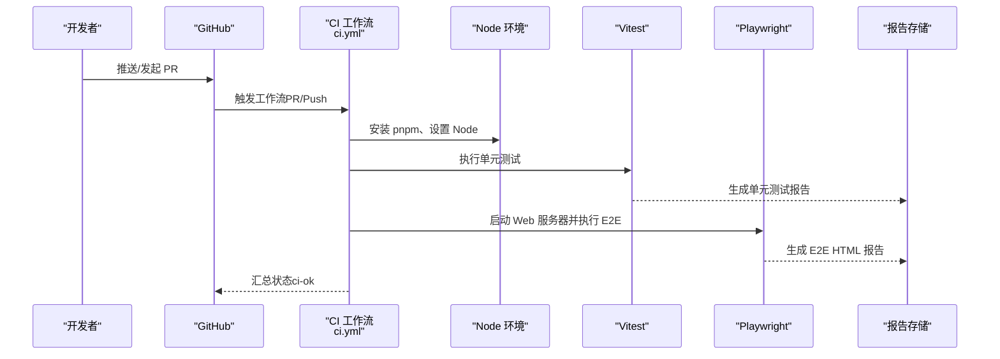
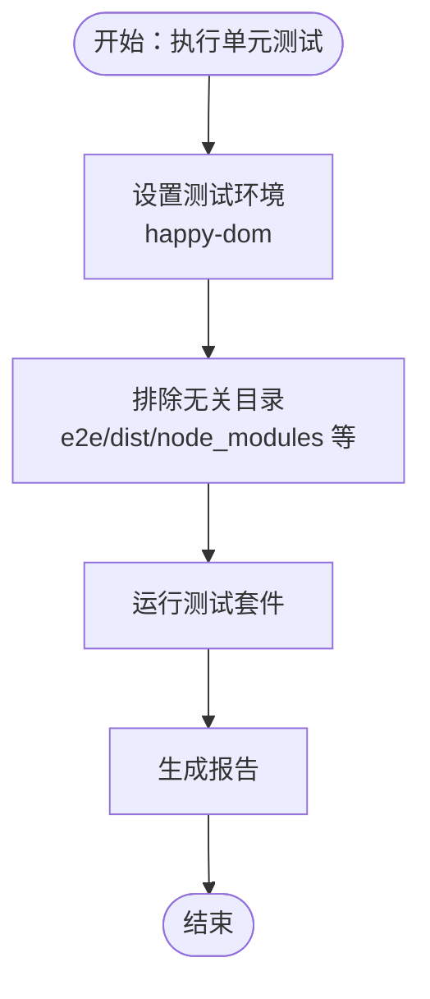
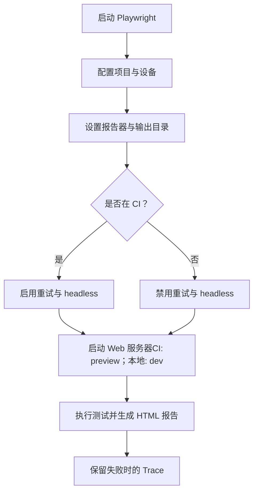
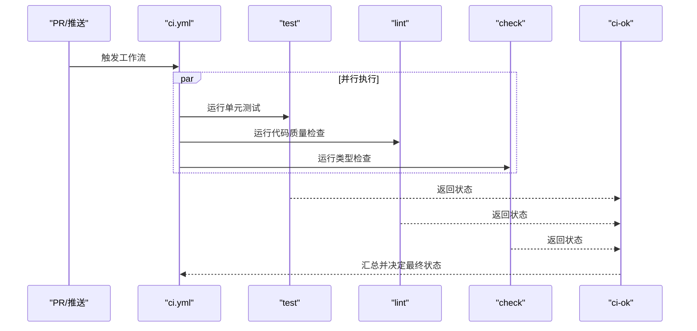
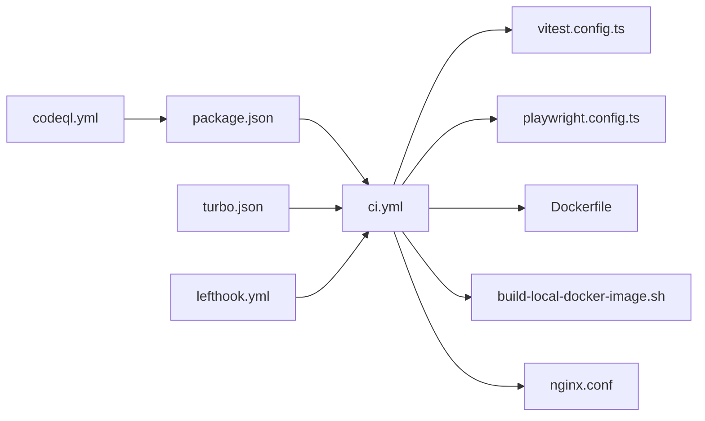

# 测试自动化

<cite>
**本文引用的文件**
- [.github/workflows/ci.yml](file://.github/workflows/ci.yml)
- [.github/workflows/codeql.yml](file://.github/workflows/codeql.yml)
- [.github/workflows/rerun.yml](file://.github/workflows/rerun.yml)
- [.github/semantic.yml](file://.github/semantic.yml)
- [.github/dependabot.yml](file://.github/dependabot.yml)
- [playground/playwright.config.ts](file://playground/playwright.config.ts)
- [vitest.config.ts](file://vitest.config.ts)
- [lefthook.yml](file://lefthook.yml)
- [package.json](file://package.json)
- [turbo.json](file://turbo.json)
- [scripts/deploy/Dockerfile](file://scripts/deploy/Dockerfile)
- [scripts/deploy/build-local-docker-image.sh](file://scripts/deploy/build-local-docker-image.sh)
- [scripts/deploy/nginx.conf](file://scripts/deploy/nginx.conf)
</cite>

## 目录

1. [简介](#简介)
2. [项目结构](#项目结构)
3. [核心组件](#核心组件)
4. [架构总览](#架构总览)
5. [详细组件分析](#详细组件分析)
6. [依赖关系分析](#依赖关系分析)
7. [性能与并发](#性能与并发)
8. [故障排查指南](#故障排查指南)
9. [结论](#结论)
10. [附录](#附录)

## 简介

本文件面向 shiyu-ui 项目的测试自动化，系统性梳理 CI/CD 流水线中的测试集成方式、触发条件与执行策略、报告生成与发布流程、测试环境与数据准备/清理、并行与资源管理最佳实践，以及失败通知与故障排查辅助工具。目标是让测试流程无缝融入日常开发工作流。

## 项目结构

本项目采用多包（monorepo）结构，测试相关能力分布在以下位置：

- 单元测试：基于 Vitest，配置位于根目录与各应用包内
- 端到端测试：基于 Playwright，配置位于 playground 应用
- CI/CD：GitHub Actions 工作流位于 .github/workflows
- 提交规范与依赖更新：.github/semantic.yml、.github/dependabot.yml
- 本地钩子：lefthook.yml
- 构建与运行脚本：package.json、turbo.json
- 部署与容器化：scripts/deploy 下的 Dockerfile、构建脚本与 Nginx 配置

图表来源

- [.github/workflows/ci.yml:1-126](file://.github/workflows/ci.yml#L1-L126)
- [.github/workflows/codeql.yml:1-95](file://.github/workflows/codeql.yml#L1-L95)
- [.github/workflows/rerun.yml:1-19](file://.github/workflows/rerun.yml#L1-L19)
- [playground/playwright.config.ts:1-109](file://playground/playwright.config.ts#L1-L109)
- [vitest.config.ts:1-29](file://vitest.config.ts#L1-L29)
- [lefthook.yml:1-98](file://lefthook.yml#L1-L98)
- [.github/semantic.yml:1-14](file://.github/semantic.yml#L1-L14)
- [.github/dependabot.yml:1-18](file://.github/dependabot.yml#L1-L18)
- [scripts/deploy/Dockerfile](file://scripts/deploy/Dockerfile)
- [scripts/deploy/build-local-docker-image.sh](file://scripts/deploy/build-local-docker-image.sh)
- [scripts/deploy/nginx.conf](file://scripts/deploy/nginx.conf)

章节来源

- [.github/workflows/ci.yml:1-126](file://.github/workflows/ci.yml#L1-L126)
- [playground/playwright.config.ts:1-109](file://playground/playwright.config.ts#L1-L109)
- [vitest.config.ts:1-29](file://vitest.config.ts#L1-L29)
- [lefthook.yml:1-98](file://lefthook.yml#L1-L98)
- [.github/semantic.yml:1-14](file://.github/semantic.yml#L1-L14)
- [.github/dependabot.yml:1-18](file://.github/dependabot.yml#L1-L18)

## 核心组件

- 单元测试（Vitest）
  - 环境：happy-dom
  - 排除路径：e2e、dist、node_modules、风格与格式化配置等
  - 作用域：快速验证逻辑正确性，减少浏览器环境开销
- 端到端测试（Playwright）
  - 多浏览器项目：当前启用 Chromium
  - 报告器：list 与 HTML 报告输出至 node_modules/.e2e/test-results
  - 重试策略：CI 环境启用重试
  - 并发：CI 禁止并行以稳定资源竞争
  - Web 服务器：本地 dev 或 preview（CI），端口 5555
- CI 工作流（GitHub Actions）
  - 触发：PR 与 push 到 main 及 releases/\* 分支
  - 任务：test（单元）、lint（代码质量）、check（类型检查）、ci-ok（汇总）
  - 跨平台：Ubuntu 与 Windows 运行器矩阵
- 提交与依赖策略
  - 提交类型：支持 feat、fix、test、ci 等
  - 依赖更新：NPM 与 GitHub Actions 周期性更新
- 本地钩子（lefthook）
  - 提交前：格式化、静态检查、ESLint、Stylelint、提交信息校验
  - 合并后：自动安装依赖

章节来源

- [vitest.config.ts:1-29](file://vitest.config.ts#L1-L29)
- [playground/playwright.config.ts:1-109](file://playwright.config.ts#L1-L109)
- [.github/workflows/ci.yml:1-126](file://.github/workflows/ci.yml#L1-L126)
- [.github/semantic.yml:1-14](file://.github/semantic.yml#L1-L14)
- [.github/dependabot.yml:1-18](file://.github/dependabot.yml#L1-L18)
- [lefthook.yml:1-98](file://lefthook.yml#L1-L98)

## 架构总览

下图展示从代码提交到测试执行与报告产出的整体流程，以及关键决策点（如是否在 CI 环境、是否启用重试与并发）：

图表来源

- [.github/workflows/ci.yml:1-126](file://.github/workflows/ci.yml#L1-L126)
- [playground/playwright.config.ts:1-109](file://playwright.config.ts#L1-L109)
- [vitest.config.ts:1-29](file://vitest.config.ts#L1-L29)

## 详细组件分析

### 单元测试（Vitest）配置与执行

- 环境与排除
  - 使用 happy-dom 作为虚拟 DOM 环境，提升执行速度
  - 显式排除 e2e、dist、node_modules、风格与格式化配置等目录
- 执行入口
  - 在 CI 工作流中通过 pnpm 脚本运行单元测试
- 报告与覆盖率
  - 当前工作流未直接上传覆盖率；可参考注释中的 codecov 步骤进行扩展

图表来源

- [vitest.config.ts:1-29](file://vitest.config.ts#L1-L29)
- [.github/workflows/ci.yml:49-50](file://.github/workflows/ci.yml#L49-L50)

章节来源

- [vitest.config.ts:1-29](file://vitest.config.ts#L1-L29)
- [.github/workflows/ci.yml:49-50](file://.github/workflows/ci.yml#L49-L50)

### 端到端测试（Playwright）配置与执行

- 项目与设备
  - 默认启用 Chromium 设备集合，便于桌面端验证
- 报告与产物
  - 输出目录：node_modules/.e2e/test-results
  - 报告器：list 与 HTML
- 重试与超时
  - CI 环境启用重试，单次测试超时 30 秒
- 并发与稳定性
  - CI 禁止并行，避免资源竞争导致不稳定
- 服务器启动
  - CI 使用 pnpm preview，本地使用 pnpm dev，端口 5555
  - 支持复用现有服务，避免重复启动

图表来源

- [playground/playwright.config.ts:1-109](file://playwright.config.ts#L1-L109)

章节来源

- [playground/playwright.config.ts:1-109](file://playwright.config.ts#L1-L109)

### CI 工作流（触发、任务与汇总）

- 触发条件
  - Pull Request 与 Push 到 main 及 releases/\* 分支
- 任务拆分
  - test：单元测试（Vitest）
  - lint：代码质量检查
  - check：类型检查
  - ci-ok：汇总 test/lint/check 结果，任一失败则整体失败
- 跨平台矩阵
  - Ubuntu 与 Windows 运行器，提升兼容性验证

图表来源

- [.github/workflows/ci.yml:1-126](file://.github/workflows/ci.yml#L1-L126)

章节来源

- [.github/workflows/ci.yml:1-126](file://.github/workflows/ci.yml#L1-L126)

### 提交规范与依赖更新

- 提交类型
  - 支持 feat、fix、test、ci 等类型，便于语义化版本与变更日志生成
- 依赖更新
  - NPM 与 GitHub Actions 均配置周期性更新，降低安全与兼容风险

章节来源

- [.github/semantic.yml:1-14](file://.github/semantic.yml#L1-L14)
- [.github/dependabot.yml:1-18](file://.github/dependabot.yml#L1-L18)

### 本地钩子（lefthook）与开发体验

- 提交前
  - 代码格式化、静态检查、ESLint、Stylelint
  - 支持按文件类型分组执行，避免不必要的检查
- 提交信息
  - 提交信息校验，保证提交记录规范化
- 合并后
  - 自动安装依赖，减少环境差异

章节来源

- [lefthook.yml:1-98](file://lefthook.yml#L1-L98)

### 测试报告生成与发布

- 单元测试
  - 报告由 Vitest 生成；当前工作流未直接上传覆盖率或报告制品
- 端到端测试
  - HTML 报告输出至 node_modules/.e2e/test-results，可在 CI 中作为工件保存
- 建议
  - 可在工作流中增加“保存工件”步骤，上传 HTML 报告与截图/视频等产物，便于离线查看与审计

章节来源

- [playground/playwright.config.ts:76-79](file://playwright.playwright.config.ts#L76-L79)
- [.github/workflows/ci.yml:49-50](file://.github/workflows/ci.yml#L49-L50)

### 测试环境自动化与部署

- 开发服务器
  - Playwright 在 CI 使用 pnpm preview，本地使用 pnpm dev，统一端口 5555
- 容器化与部署
  - 提供 Dockerfile、本地构建脚本与 Nginx 配置，可用于测试环境部署与预览
- 建议
  - 将 E2E 报告与截图作为工件保存，并结合容器化部署实现可重复的测试环境

章节来源

- [playground/playwright.config.ts:98-102](file://playwright.playwright.config.ts#L98-L102)
- [scripts/deploy/Dockerfile](file://scripts/deploy/Dockerfile)
- [scripts/deploy/build-local-docker-image.sh](file://scripts/deploy/build-local-docker-image.sh)
- [scripts/deploy/nginx.conf](file://scripts/deploy/nginx.conf)

### 测试数据准备与清理

- 当前仓库未发现专门的测试数据准备/清理脚本
- 建议
  - 在 Playwright 测试前通过 fixtures 或自定义 hook 初始化最小化数据集
  - 在测试后清理数据，避免跨用例污染
  - 对于需要外部服务的场景，考虑使用临时数据库或内存数据库

[本节为通用实践建议，不直接分析具体文件，故无章节来源]

### 并行测试执行与资源管理

- Vitest
  - 默认在本地并行，CI 矩阵中每个 OS 一个 job，避免在同一 job 内部并行带来的资源竞争
- Playwright
  - CI 禁止并行，提高稳定性；可通过项目维度拆分减少竞争
- 资源建议
  - 控制并发度，优先保证稳定性；对长耗时任务拆分为独立 job

章节来源

- [.github/workflows/ci.yml:22-28](file://.github/workflows/ci.yml#L22-L28)
- [playground/playwright.config.ts:105](file://playwright.playwright.config.ts#L105)

### 失败通知与故障排查

- 失败通知
  - 可在工作流中增加通知步骤（如邮件、聊天工具），在 ci-ok 失败时触发
- 故障排查
  - Playwright 保留失败时的 Trace，便于定位问题
  - 建议保存 HTML 报告与截图/视频工件，便于离线复盘
  - 提供 rerun 工作流，支持按 run_id 重新触发失败步骤

章节来源

- [playground/playwright.config.ts:94](file://playwright.playwright.config.ts#L94)
- [.github/workflows/rerun.yml:1-19](file://.github/workflows/rerun.yml#L1-L19)

## 依赖关系分析

- 工作流依赖
  - ci.yml 依赖 package.json 中的脚本与 turbo.json 的任务定义
  - 本地钩子依赖各工具链（oxfmt、oxlint、eslint、stylelint）
- 测试工具链
  - Vitest 与 Playwright 分别负责单元与端到端测试，互不干扰
- 安全扫描
  - CodeQL 工作流独立运行，不与测试任务耦合

图表来源

- [.github/workflows/ci.yml:1-126](file://.github/workflows/ci.yml#L1-L126)
- [playground/playwright.config.ts:1-109](file://playwright.config.ts#L1-L109)
- [vitest.config.ts:1-29](file://vitest.config.ts#L1-L29)
- [lefthook.yml:1-98](file://lefthook.yml#L1-L98)
- [scripts/deploy/Dockerfile](file://scripts/deploy/Dockerfile)
- [scripts/deploy/build-local-docker-image.sh](file://scripts/deploy/build-local-docker-image.sh)
- [scripts/deploy/nginx.conf](file://scripts/deploy/nginx.conf)

章节来源

- [.github/workflows/ci.yml:1-126](file://.github/workflows/ci.yml#L1-L126)
- [playground/playwright.config.ts:1-109](file://playwright.config.ts#L1-L109)
- [vitest.config.ts:1-29](file://vitest.config.ts#L1-L29)
- [lefthook.yml:1-98](file://lefthook.yml#L1-L98)

## 性能与并发

- 并发控制
  - CI 禁止 Playwright 并行，避免资源争用
  - Vitest 在本地并行，CI 通过矩阵分发任务
- 超时与重试
  - Playwright 单次测试超时 30 秒，CI 环境启用重试
- 建议
  - 将长耗时测试拆分为独立 job，缩短瓶颈
  - 使用缓存策略（如 pnpm 缓存）减少安装时间

章节来源

- [playground/playwright.config.ts:80-84](file://playwright.playwright.config.ts#L80-L84)
- [playground/playwright.config.ts:105](file://playwright.playwright.config.ts#L105)
- [.github/workflows/ci.yml:22-28](file://.github/workflows/ci.yml#L22-L28)

## 故障排查指南

- Playwright 失败
  - 查看 HTML 报告与保留的 Trace
  - 确认本地与 CI 的 baseURL 与端口一致
- Vitest 失败
  - 检查排除规则是否误排除了测试文件
  - 确认环境变量与快照一致性
- 工作流失败
  - 使用 rerun 工作流按 run_id 重试失败步骤
  - 检查依赖安装与 Node 版本

章节来源

- [playground/playwright.config.ts:76-79](file://playwright.playwright.config.ts#L76-L79)
- [playground/playwright.config.ts:94](file://playwright.playwright.config.ts#L94)
- [.github/workflows/rerun.yml:1-19](file://.github/workflows/rerun.yml#L1-L19)

## 结论

本项目的测试自动化以 Vitest 与 Playwright 为核心，配合 GitHub Actions 实现跨平台的持续集成与质量保障。通过明确的触发条件、任务拆分与失败汇总，测试流程已具备良好的可维护性。建议后续完善覆盖率上报、报告工件保存、测试数据准备/清理与失败通知机制，进一步提升测试可观测性与可追溯性。

## 附录

- 关键文件索引
  - 单元测试配置：[vitest.config.ts](file://vitest.config.ts)
  - 端到端测试配置：[playground/playwright.config.ts](file://playground/playwright.config.ts)
  - CI 工作流：[.github/workflows/ci.yml](file://.github/workflows/ci.yml)
  - 代码扫描：[.github/workflows/codeql.yml](file://.github/workflows/codeql.yml)
  - 重试工具：[.github/workflows/rerun.yml](file://.github/workflows/rerun.yml)
  - 提交规范：[.github/semantic.yml](file://.github/semantic.yml)
  - 依赖更新：[.github/dependabot.yml](file://.github/dependabot.yml)
  - 本地钩子：[lefthook.yml](file://lefthook.yml)
  - 构建与运行：[package.json](file://package.json)、[turbo.json](file://turbo.json)
  - 部署与容器化：[scripts/deploy/Dockerfile](file://scripts/deploy/Dockerfile)、[scripts/deploy/build-local-docker-image.sh](file://scripts/deploy/build-local-docker-image.sh)、[scripts/deploy/nginx.conf](file://scripts/deploy/nginx.conf)
