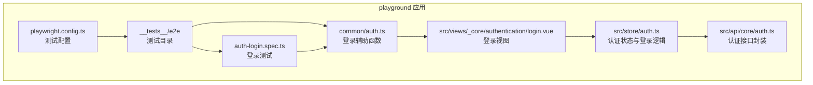
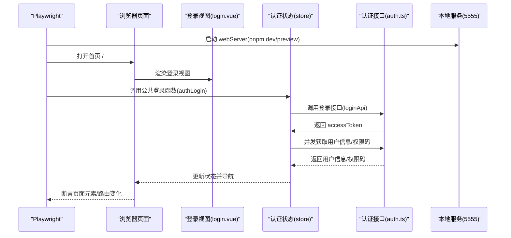
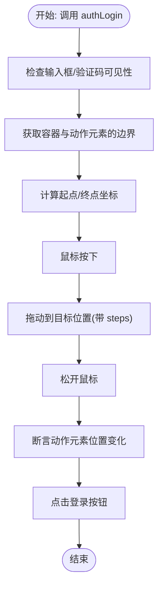
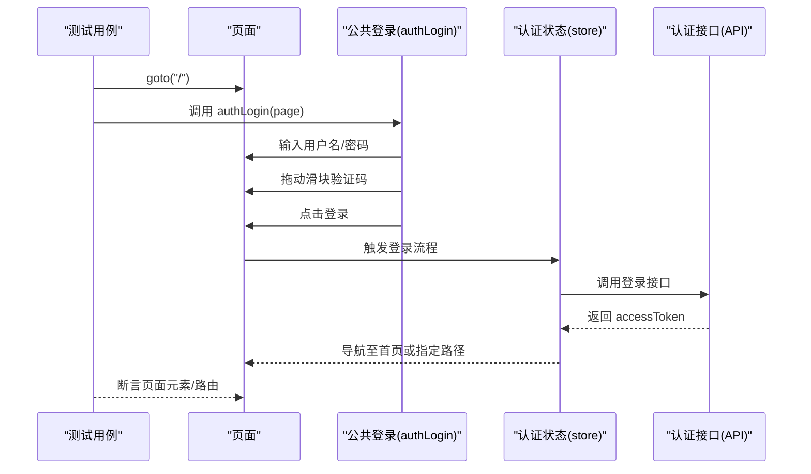
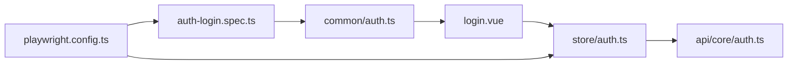

# 端到端测试

<cite>
**本文引用的文件**
- [playwright.config.ts](file://playground/playwright.config.ts)
- [auth-login.spec.ts](file://playground/__tests__/e2e/auth-login.spec.ts)
- [auth.ts](file://playground/__tests__/e2e/common/auth.ts)
- [package.json（根）](file://package.json)
- [package.json（playground）](file://playground/package.json)
- [auth.ts（store 实现）](file://playground/src/store/auth.ts)
- [auth.ts（API 封装）](file://playground/src/api/core/auth.ts)
- [login.vue（登录视图）](file://playground/src/views/_core/authentication/login.vue)
</cite>

## 目录

1. [引言](#引言)
2. [项目结构](#项目结构)
3. [核心组件](#核心组件)
4. [架构总览](#架构总览)
5. [详细组件分析](#详细组件分析)
6. [依赖关系分析](#依赖关系分析)
7. [性能考量](#性能考量)
8. [故障排查指南](#故障排查指南)
9. [结论](#结论)
10. [附录](#附录)

## 引言

本文件面向 shiyu-ui 项目的端到端测试，聚焦于 Playwright 配置与最佳实践、页面对象模式、用户认证流程测试（登录/登出/权限）、复杂业务流程断言策略、测试数据与环境隔离、并行与性能优化、以及测试结果分析与失败排查。目标是让测试真实反映用户使用场景，覆盖关键用户旅程与系统完整性。

## 项目结构

端到端测试位于 playground 应用内，Playwright 配置集中于该应用的配置文件；测试用例与公共逻辑（如登录）按功能拆分存放。

**图表来源**

- [playwright.config.ts:14-106](file://playground/playwright.config.ts#L14-L106)
- [auth-login.spec.ts:1-21](file://playground/__tests__/e2e/auth-login.spec.ts#L1-L21)
- [auth.ts（公共登录）:1-47](file://playground/__tests__/e2e/common/auth.ts#L1-L47)
- [auth.ts（store 实现）:16-126](file://playground/src/store/auth.ts#L16-L126)
- [auth.ts（API 封装）:24-50](file://playground/src/api/core/auth.ts#L24-L50)
- [login.vue（登录视图）:108-132](file://playground/src/views/_core/authentication/login.vue#L108-L132)

**章节来源**

- [playwright.config.ts:14-106](file://playground/playwright.config.ts#L14-L106)
- [auth-login.spec.ts:1-21](file://playground/__tests__/e2e/auth-login.spec.ts#L1-L21)
- [auth.ts（公共登录）:1-47](file://playground/__tests__/e2e/common/auth.ts#L1-L47)

## 核心组件

- Playwright 测试配置：定义超时、重试、报告器、浏览器项目、webServer 启动命令、并行度等。
- 页面对象与公共逻辑：将登录流程抽象为可复用的 authLogin 函数，便于多测试用例共享。
- 认证状态与接口：store 负责登录、登出、获取用户信息与权限码；API 层负责与后端交互。
- 登录视图：提供表单、滑动验证码组件与提交流程。

**章节来源**

- [playwright.config.ts:14-106](file://playground/playwright.config.ts#L14-L106)
- [auth.ts（公共登录）:5-46](file://playground/__tests__/e2e/common/auth.ts#L5-L46)
- [auth.ts（store 实现）:29-79](file://playground/src/store/auth.ts#L29-L79)
- [auth.ts（API 封装）:24-50](file://playground/src/api/core/auth.ts#L24-L50)
- [login.vue（登录视图）:108-132](file://playground/src/views/_core/authentication/login.vue#L108-L132)

## 架构总览

端到端测试从 Playwright 驱动浏览器访问本地开发服务器，通过公共登录函数完成认证，随后在页面上执行业务流程并断言结果。

**图表来源**

- [playwright.config.ts:97-102](file://playground/playwright.config.ts#L97-L102)
- [auth-login.spec.ts:5-19](file://playground/__tests__/e2e/auth-login.spec.ts#L5-L19)
- [auth.ts（公共登录）:5-46](file://playground/__tests__/e2e/common/auth.ts#L5-L46)
- [auth.ts（store 实现）:29-79](file://playground/src/store/auth.ts#L29-L79)
- [auth.ts（API 封装）:24-50](file://playground/src/api/core/auth.ts#L24-L50)
- [login.vue（登录视图）:108-132](file://playground/src/views/_core/authentication/login.vue#L108-L132)

## 详细组件分析

### Playwright 配置与最佳实践

- 超时与断言：expect 超时、单个测试最大运行时间、动作超时等，确保稳定与快速反馈。
- 报告与产物：list 与 HTML 报告器组合，输出目录统一管理；失败保留 trace 便于回溯。
- 浏览器项目：当前启用 Chromium，其他浏览器可按需启用。
- webServer：自动启动本地服务，支持 CI/本地差异化命令与端口复用。
- 并行与重试：CI 上限制 worker 数量，避免资源竞争；仅在 CI 开启重试以提升稳定性。

**章节来源**

- [playwright.config.ts:14-106](file://playground/playwright.config.ts#L14-L106)

### 页面对象与公共登录逻辑

- 公共登录函数：封装输入用户名/密码、滑动验证码、点击登录等步骤，保证测试一致性。
- 滑动验证码：基于 boundingBox 计算起点与终点，模拟鼠标拖动并断言位置变化。
- 与视图解耦：通过页面定位器与角色选择器，不直接依赖组件内部实现细节。

**图表来源**

- [auth.ts（公共登录）:5-46](file://playground/__tests__/e2e/common/auth.ts#L5-L46)

**章节来源**

- [auth.ts（公共登录）:5-46](file://playground/__tests__/e2e/common/auth.ts#L5-L46)

### 用户认证流程测试

- 登录测试：在 beforeEach 中访问首页，断言标题与页面元素存在；随后调用公共登录函数完成认证。
- 登出与权限：store 提供 logout 与权限码获取；可在后续扩展测试用例覆盖登出后的路由跳转与权限控制。

**图表来源**

- [auth-login.spec.ts:5-19](file://playground/__tests__/e2e/auth-login.spec.ts#L5-L19)
- [auth.ts（公共登录）:5-46](file://playground/__tests__/e2e/common/auth.ts#L5-L46)
- [auth.ts（store 实现）:29-79](file://playground/src/store/auth.ts#L29-L79)
- [auth.ts（API 封装）:24-50](file://playground/src/api/core/auth.ts#L24-L50)

**章节来源**

- [auth-login.spec.ts:5-19](file://playground/__tests__/e2e/auth-login.spec.ts#L5-L19)
- [auth.ts（公共登录）:5-46](file://playground/__tests__/e2e/common/auth.ts#L5-L46)
- [auth.ts（store 实现）:83-107](file://playground/src/store/auth.ts#L83-L107)
- [auth.ts（API 封装）:46-50](file://playground/src/api/core/auth.ts#L46-L50)

### 复杂业务流程的测试设计与断言策略

- 页面元素断言：标题、可见性、可用性等基础断言，确保页面渲染正确。
- 表单与交互：基于表单 schema 与组件行为，断言字段联动、错误提示、提交状态等。
- 导航与路由：断言登录后跳转路径、登出后回到登录页并携带 redirect 参数。
- 权限与菜单：结合权限码与菜单生成逻辑，断言菜单项显示与禁用状态。
- 状态与通知：断言登录成功通知、错误提示与验证码重置。

**章节来源**

- [auth-login.spec.ts:10-14](file://playground/__tests__/e2e/auth-login.spec.ts#L10-L14)
- [login.vue（登录视图）:111-122](file://playground/src/views/_core/authentication/login.vue#L111-L122)
- [auth.ts（store 实现）:54-62](file://playground/src/store/auth.ts#L54-L62)
- [auth.ts（store 实现）:99-106](file://playground/src/store/auth.ts#L99-L106)

### 测试数据管理与环境隔离

- 环境变量：通过 dotenv 或环境变量注入测试所需配置（如 baseURL、账号密码）。
- 数据准备：在测试前通过 API 创建最小化测试数据集，或使用现有演示账号。
- 隔离策略：每个测试独立初始化/清理，避免跨用例污染；必要时使用独立数据库或命名空间。
- 截图与视频：利用 Playwright 产物定位问题，结合 trace 分析失败原因。

**章节来源**

- [playwright.config.ts:24-25](file://playground/playwright.config.ts#L24-L25)
- [playwright.config.ts:76-79](file://playground/playwright.config.ts#L76-L79)
- [playwright.config.ts](file://playground/playwright.config.ts#L94)

### 并行化与性能优化

- 并行度：本地默认不限制 worker，CI 上设置为 1 以避免资源争用；可根据硬件调整。
- 重试策略：CI 上开启重试，降低偶发失败影响。
- 超时与等待：合理设置 expect/action 超时，避免过长等待；使用稳定的断言点。
- 服务启动：复用现有服务端口，减少冷启动时间；必要时预构建以加速 preview/dev。

**章节来源**

- [playwright.config.ts:80-81](file://playground/playwright.config.ts#L80-L81)
- [playwright.config.ts:104-105](file://playground/playwright.config.ts#L104-L105)
- [playwright.config.ts:97-102](file://playground/playwright.config.ts#L97-L102)

### 测试结果分析与失败排查

- 报告查看：HTML 报告与列表报告结合，快速定位失败用例。
- Trace 分析：保留失败 trace，回放用户操作路径，定位问题环节。
- 日志与截图：结合控制台日志与截图，确认页面状态与交互结果。
- 回归策略：针对登录、权限、导航等关键路径建立回归用例，持续监控。

**章节来源**

- [playwright.config.ts:76-79](file://playground/playwright.config.ts#L76-L79)
- [playwright.config.ts](file://playground/playwright.config.ts#L94)

## 依赖关系分析

- 测试层依赖：测试用例依赖公共登录函数；公共登录函数依赖视图组件与 store。
- 运行时依赖：Playwright 配置依赖本地服务；服务由 playground 应用提供。
- 接口依赖：store 依赖 API 封装；API 封装依赖请求客户端。

**图表来源**

- [auth-login.spec.ts:1-21](file://playground/__tests__/e2e/auth-login.spec.ts#L1-L21)
- [auth.ts（公共登录）:1-47](file://playground/__tests__/e2e/common/auth.ts#L1-L47)
- [login.vue（登录视图）:108-132](file://playground/src/views/_core/authentication/login.vue#L108-L132)
- [auth.ts（store 实现）:16-126](file://playground/src/store/auth.ts#L16-L126)
- [auth.ts（API 封装）:24-50](file://playground/src/api/core/auth.ts#L24-L50)
- [playwright.config.ts:97-102](file://playground/playwright.config.ts#L97-L102)

**章节来源**

- [auth-login.spec.ts:1-21](file://playground/__tests__/e2e/auth-login.spec.ts#L1-L21)
- [auth.ts（公共登录）:1-47](file://playground/__tests__/e2e/common/auth.ts#L1-L47)
- [auth.ts（store 实现）:16-126](file://playground/src/store/auth.ts#L16-L126)
- [auth.ts（API 封装）:24-50](file://playground/src/api/core/auth.ts#L24-L50)
- [playwright.config.ts:97-102](file://playground/playwright.config.ts#L97-L102)

## 性能考量

- 服务启动：优先使用 preview 命令，减少首次构建开销；在 CI 可缓存依赖与构建产物。
- 浏览器与设备：按需启用浏览器项目，避免不必要的并行实例。
- 断言与等待：减少不必要的等待与重试，提高整体吞吐。
- 数据与环境：尽量使用内存数据库或临时数据，缩短清理时间。

## 故障排查指南

- 页面未加载：检查 baseURL 与 webServer 端口；确认本地服务已启动。
- 登录失败：核对用户名/密码与验证码；检查登录接口返回与 store 状态更新。
- 权限异常：确认权限码获取与菜单生成逻辑；断言菜单项显示状态。
- 并发与竞态：在 CI 上适当增加重试次数；避免多个测试同时写入共享数据。
- Trace 与报告：利用 trace 与 HTML 报告定位失败步骤，结合截图与日志分析。

**章节来源**

- [playwright.config.ts:90-91](file://playground/playwright.config.ts#L90-L91)
- [playwright.config.ts:97-102](file://playground/playwright.config.ts#L97-L102)
- [auth.ts（store 实现）:44-52](file://playground/src/store/auth.ts#L44-L52)
- [auth.ts（API 封装）:55-57](file://playground/src/api/core/auth.ts#L55-L57)

## 结论

通过 Playwright 的配置与最佳实践、页面对象模式与公共登录函数、认证状态与接口的清晰分层，以及完善的断言策略与报告体系，shiyu-ui 的端到端测试能够真实还原用户使用场景，覆盖关键用户旅程与系统完整性。建议在此基础上逐步扩展复杂业务流程与权限验证用例，并持续优化并行与性能，提升测试效率与稳定性。

## 附录

- 执行命令
  - 在 playground 应用内执行：[playwright test](file://playground/package.json#L24)
  - UI 模式：[playwright test --ui](file://playground/package.json#L25)
  - 代码生成：[playwright codegen](file://playground/package.json#L26)
  - 根目录聚合执行：[turbo run test:e2e](file://package.json#L63)

**章节来源**

- [package.json（playground）:18-27](file://playground/package.json#L18-L27)
- [package.json（根）](file://package.json#L63)
