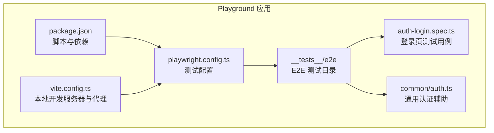
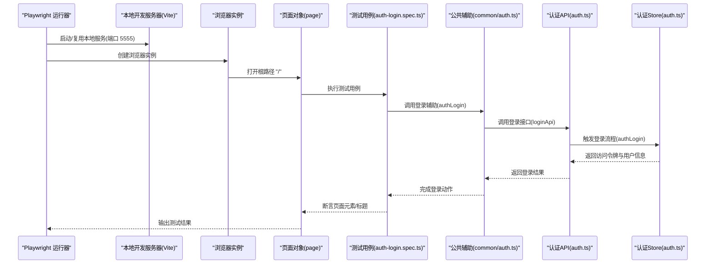
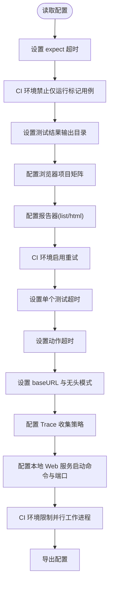
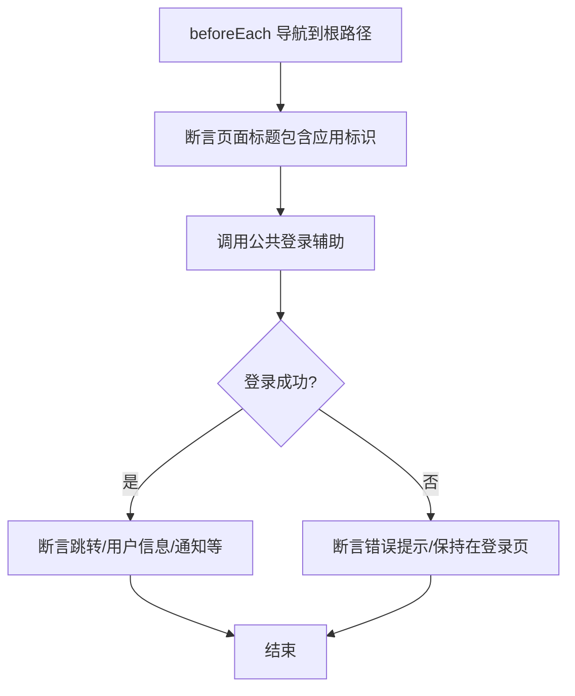
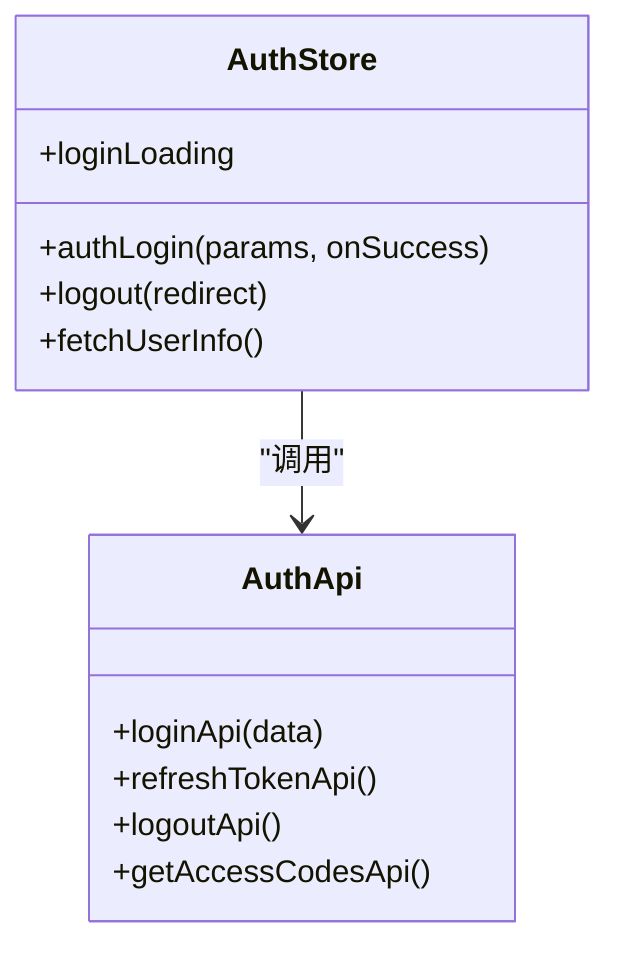
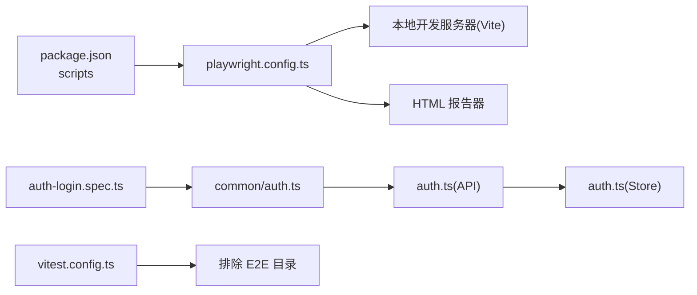

# 集成测试

<cite>
**本文引用的文件**
- [playground\playwright.config.ts](file://playground/playwright.config.ts)
- [playground\__tests__\e2e\auth-login.spec.ts](file://playground/__tests__/e2e/auth-login.spec.ts)
- [playground\__tests__\e2e\common\auth.ts](file://playground/__tests__/e2e/common/auth.ts)
- [playground\src\api\core\auth.ts](file://playground/src/api/core/auth.ts)
- [playground\src\store\auth.ts](file://playground/src/store/auth.ts)
- [playground\vite.config.ts](file://playground/vite.config.ts)
- [playground\package.json](file://playground/package.json)
- [vitest.config.ts](file://vitest.config.ts)
</cite>

## 目录

1. [简介](#简介)
2. [项目结构](#项目结构)
3. [核心组件](#核心组件)
4. [架构总览](#架构总览)
5. [详细组件分析](#详细组件分析)
6. [依赖关系分析](#依赖关系分析)
7. [性能考量](#性能考量)
8. [故障排查指南](#故障排查指南)
9. [结论](#结论)
10. [附录](#附录)

## 简介

本文件面向 shiyu-ui 项目的集成测试体系，聚焦于 Playwright 在 Playground 应用中的配置与使用、浏览器环境与测试运行配置、API 接口测试与组件交互测试的设计原则与场景选择、测试环境搭建与数据库连接处理、测试数据准备与清理策略、并行测试执行与测试报告生成等关键主题。通过系统化梳理现有配置与示例，帮助开发团队建立稳定可靠的端到端（E2E）测试流程。

## 项目结构

Playwright 集成测试位于 Playground 应用内，测试配置集中于根级配置文件，测试用例与公共辅助逻辑分别存放于独立目录，便于维护与扩展。

**图表来源**

- [playground\playwright.config.ts:14-106](file://playground/playwright.config.ts#L14-L106)
- [playground\vite.config.ts:3-20](file://playground/vite.config.ts#L3-L20)
- [playground\package.json:18-27](file://playground/package.json#L18-L27)
- [playground\_\_tests\_\_\e2e\auth-login.spec.ts:1-21](file://playground/__tests__/e2e/auth-login.spec.ts#L1-L21)
- [playground\_\_tests\_\_\e2e\common\auth.ts](file://playground/__tests__/e2e/common/auth.ts)

**章节来源**

- [playground\playwright.config.ts:14-106](file://playground/playwright.config.ts#L14-L106)
- [playground\package.json:18-27](file://playground/package.json#L18-L27)

## 核心组件

- Playwright 测试配置：定义期望超时、失败策略、输出目录、项目矩阵、报告器、重试次数、超时、浏览器使用选项、本地 Web 服务启动命令、并行工作进程等。
- 测试用例与公共辅助：以登录页为例，包含页面导航、元素断言与登录流程封装。
- 前端 API 与状态管理：认证相关接口与 Pinia Store 的登录流程，作为 E2E 场景的被测对象。
- 本地开发服务器与代理：Vite 开发服务器与 /api 代理，用于 E2E 请求转发至后端或 Mock 服务。

**章节来源**

- [playground\playwright.config.ts:14-106](file://playground/playwright.config.ts#L14-L106)
- [playground\_\_tests\_\_\e2e\auth-login.spec.ts:1-21](file://playground/__tests__/e2e/auth-login.spec.ts#L1-L21)
- [playground\src\api\core\auth.ts:24-57](file://playground/src/api/core/auth.ts#L24-L57)
- [playground\src\store\auth.ts:29-79](file://playground/src/store/auth.ts#L29-L79)
- [playground\vite.config.ts:8-16](file://playground/vite.config.ts#L8-L16)

## 架构总览

下图展示从 Playwright 启动到页面加载、业务交互与断言的整体流程，以及与前端 API 层的关系。

**图表来源**

- [playground\playwright.config.ts:98-102](file://playground/playwright.config.ts#L98-L102)
- [playground\_\_tests\_\_\e2e\auth-login.spec.ts:5-20](file://playground/__tests__/e2e/auth-login.spec.ts#L5-L20)
- [playground\_\_tests\_\_\e2e\common\auth.ts](file://playground/__tests__/e2e/common/auth.ts)
- [playground\src\api\core\auth.ts:24-28](file://playground/src/api/core/auth.ts#L24-L28)
- [playground\src\store\auth.ts:29-79](file://playground/src/store/auth.ts#L29-L79)

## 详细组件分析

### Playwright 配置与运行参数

- 期望断言超时、失败策略、输出目录、报告器、重试次数、单个测试超时、动作超时、基础 URL、无头模式、Trace 收集策略、项目矩阵（浏览器设备）、本地 Web 服务启动命令与端口、CI 下并行工作进程数等均在配置文件中明确。
- 本地开发服务器通过 Vite 启动，支持代理 /api 到本地或外部目标，便于 E2E 请求转发与 Mock。

**图表来源**

- [playground\playwright.config.ts:14-106](file://playground/playwright.config.ts#L14-L106)

**章节来源**

- [playground\playwright.config.ts:14-106](file://playground/playwright.config.ts#L14-L106)
- [playground\vite.config.ts:8-16](file://playground/vite.config.ts#L8-L16)

### 测试用例设计与场景选择

- 页面标题与元素断言：验证页面加载与基础 UI 元素存在性。
- 登录流程：通过公共辅助封装登录步骤，覆盖有效凭据登录场景。
- 设计原则：以用户旅程为主线，优先覆盖关键路径；对易变 UI 使用稳定选择器；对异步行为进行合理等待与断言。

**图表来源**

- [playground\_\_tests\_\_\e2e\auth-login.spec.ts:5-20](file://playground/__tests__/e2e/auth-login.spec.ts#L5-L20)

**章节来源**

- [playground\_\_tests\_\_\e2e\auth-login.spec.ts:1-21](file://playground/__tests__/e2e/auth-login.spec.ts#L1-L21)

### API 接口测试与请求模拟

- 认证接口：登录、刷新 Token、退出登录、获取权限码等，统一通过请求客户端发起，携带凭证。
- 登录流程：Store 中封装登录逻辑，同时触发获取用户信息与权限码，并更新全局状态。
- 请求模拟建议：在 E2E 中可结合本地代理或后端 Mock 提供稳定响应；对关键接口进行响应体与状态码断言。

**图表来源**

- [playground\src\api\core\auth.ts:24-57](file://playground/src/api/core/auth.ts#L24-L57)
- [playground\src\store\auth.ts:29-79](file://playground/src/store/auth.ts#L29-L79)

**章节来源**

- [playground\src\api\core\auth.ts:24-57](file://playground/src/api/core/auth.ts#L24-L57)
- [playground\src\store\auth.ts:29-79](file://playground/src/store/auth.ts#L29-L79)

### 组件间交互测试与数据流验证

- 交互测试要点：聚焦用户操作链路（输入、点击、提交、跳转），断言状态变更与 UI 反馈。
- 数据流验证：结合 Store 状态与 API 返回，验证登录后访问令牌、用户信息、权限码的正确写入与后续页面渲染。
- 建议：对关键交互增加截图/视频与 Trace，便于定位问题。

（本节为概念性说明，不直接分析具体文件）

### 测试环境搭建与数据库连接处理

- 本地开发服务器：通过 Vite 启动，端口 5555；在 CI 环境使用预览模式，避免重复启动。
- 代理配置：将 /api 请求转发至本地或外部目标，便于对接后端或 Mock。
- 数据库连接：E2E 通常不直接连接生产数据库，推荐使用 Mock 或隔离的测试数据库；如需真实数据，请在 CI 中通过环境变量注入最小化测试集。

**章节来源**

- [playground\playwright.config.ts:98-102](file://playground/playwright.config.ts#L98-L102)
- [playground\vite.config.ts:8-16](file://playground/vite.config.ts#L8-L16)

### 测试数据准备与清理策略

- 准备策略：在测试前通过 API 注入最小化测试数据；或在登录前构造有效凭据。
- 清理策略：在 afterEach 或 afterAll 中执行登出、重置 Store、清除 Cookie/Storage，确保测试隔离。
- 建议：为每个测试用例提供独立的测试账户或数据集，避免跨用例污染。

（本节为概念性说明，不直接分析具体文件）

### 并行测试执行与测试报告生成

- 并行执行：CI 环境限制工作进程为 1，避免资源竞争；本地默认按 CPU 数量并行。
- 报告生成：使用 list 与 HTML 报告器，HTML 报告输出到指定目录，便于查看 Trace 与截图。
- 建议：在 CI 中开启重试与 Trace 收集，提升失败诊断效率。

**章节来源**

- [playground\playwright.config.ts:76-81](file://playground/playwright.config.ts#L76-L81)
- [playground\playwright.config.ts:105](file://playground/playwright.config.ts#L105)

## 依赖关系分析

- 测试运行依赖：Playwright 测试配置依赖本地开发服务器与浏览器设备；测试用例依赖公共辅助与前端 API/Store。
- 构建与脚本：Playground 的 package.json 提供 E2E 测试脚本，Vitest 配置排除 E2E 目录，避免单元测试与 E2E 混淆。

**图表来源**

- [playground\package.json:18-27](file://playground/package.json#L18-L27)
- [playground\playwright.config.ts:76-102](file://playground/playwright.config.ts#L76-L102)
- [playground\_\_tests\_\_\e2e\auth-login.spec.ts:1-21](file://playground/__tests__/e2e/auth-login.spec.ts#L1-L21)
- [playground\_\_tests\_\_\e2e\common\auth.ts](file://playground/__tests__/e2e/common/auth.ts)
- [playground\src\api\core\auth.ts:24-57](file://playground/src/api/core/auth.ts#L24-L57)
- [playground\src\store\auth.ts:29-79](file://playground/src/store/auth.ts#L29-L79)
- [vitest.config.ts:18-26](file://vitest.config.ts#L18-L26)

**章节来源**

- [playground\package.json:18-27](file://playground/package.json#L18-L27)
- [vitest.config.ts:18-26](file://vitest.config.ts#L18-L26)

## 性能考量

- 启动时间：本地开发服务器在 CI 中使用预览模式，减少冷启动成本。
- 并行度：CI 环境限制工作进程，避免并发导致的资源争用；本地可充分利用多核。
- 超时与重试：合理设置 expect、动作与测试超时，CI 环境启用重试，平衡稳定性与速度。
- 报告与 Trace：仅在失败时保留 Trace，降低磁盘占用。

（本节为通用指导，不直接分析具体文件）

## 故障排查指南

- 测试超时：检查 expect 超时与动作超时设置；确认本地服务是否正常启动。
- 页面无法加载：核对 baseURL 与本地服务端口；确认 webServer 命令与端口复用策略。
- 登录失败：检查 /api 代理配置与后端/Mock 服务可用性；查看 HTML 报告与 Trace。
- 并发问题：在 CI 环境将 workers 设为 1；确保测试间无共享状态。
- 单元测试冲突：确认 vitest 已排除 E2E 目录，避免混跑。

**章节来源**

- [playground\playwright.config.ts:84-106](file://playground/playwright.config.ts#L84-L106)
- [vitest.config.ts:18-26](file://vitest.config.ts#L18-L26)

## 结论

通过明确的 Playwright 配置、规范的测试用例与公共辅助、清晰的 API/Store 数据流，以及合理的环境与报告策略，shiyu-ui 的 Playground 已具备可扩展的集成测试基线。建议在此基础上持续补充关键业务场景的 E2E 用例，完善数据准备与清理机制，并在 CI 中稳定运行以保障发布质量。

## 附录

- 运行命令参考
  - 运行所有 E2E 测试：在 Playground 应用中执行相应脚本。
  - 以 UI 模式运行：在 Playground 应用中执行相应脚本。
  - 代码生成：在 Playground 应用中执行相应脚本以生成交互代码。

**章节来源**

- [playground\package.json:24-26](file://playground/package.json#L24-L26)
