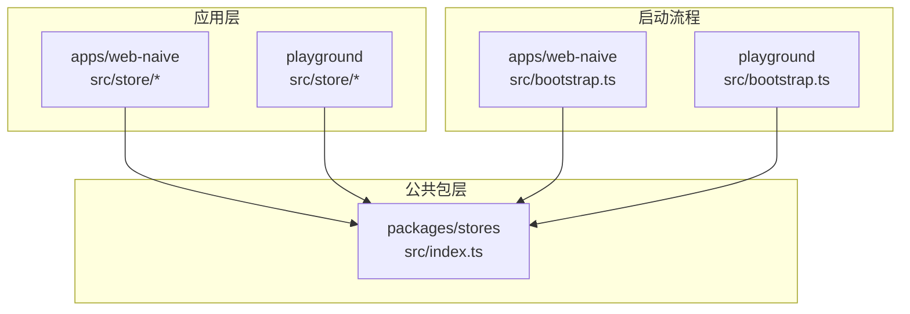
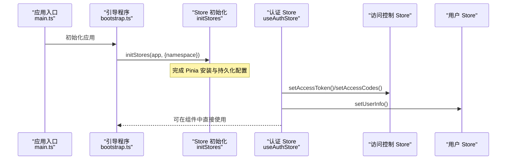
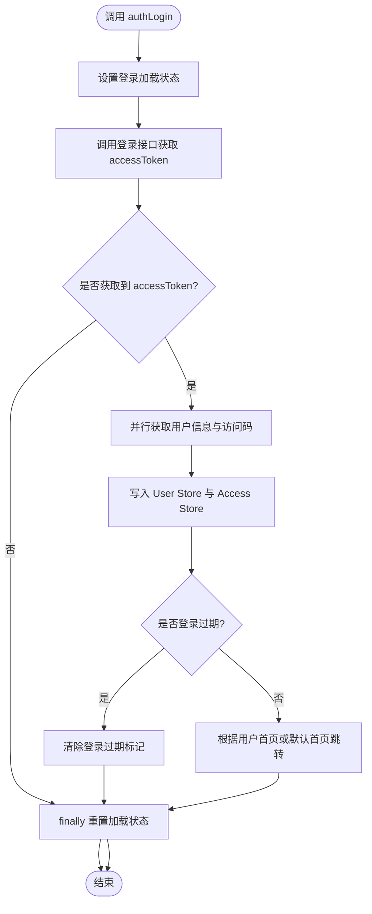
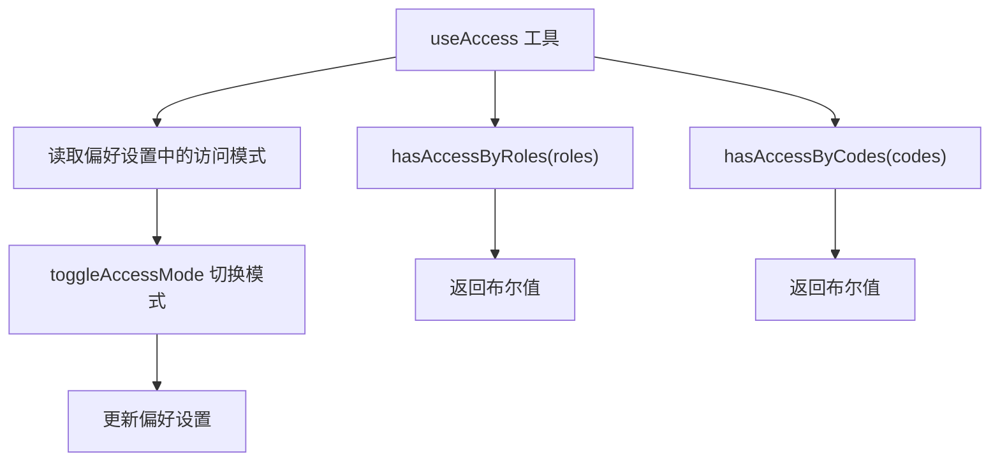
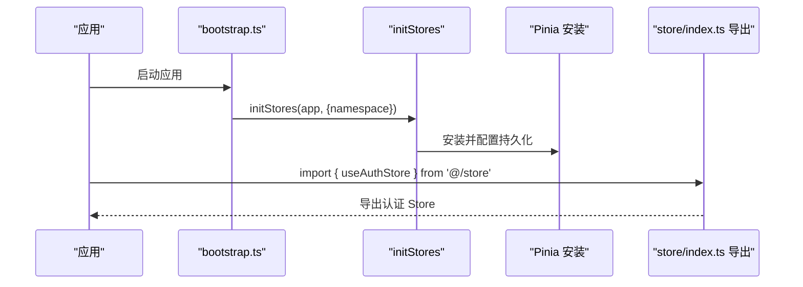
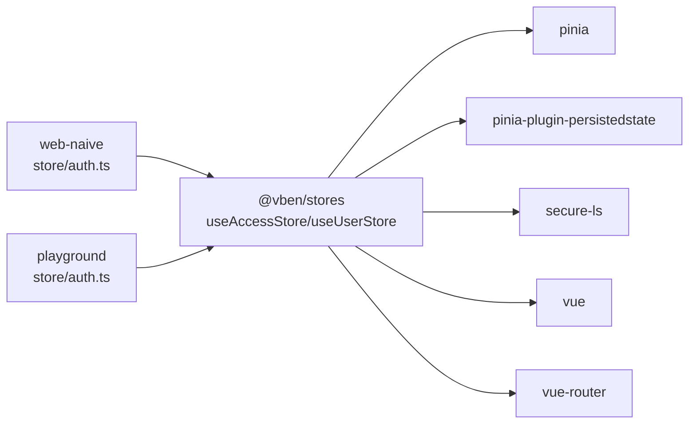

# Pinia Store 架构

<cite>
**本文档引用的文件**
- [apps/web-naive/src/store/index.ts](file://apps/web-naive/src/store/index.ts)
- [apps/web-naive/src/store/auth.ts](file://apps/web-naive/src/store/auth.ts)
- [playground/src/store/index.ts](file://playground/src/store/index.ts)
- [playground/src/store/auth.ts](file://playground/src/store/auth.ts)
- [packages/stores/package.json](file://packages/stores/package.json)
- [packages/stores/src/index.ts](file://packages/stores/src/index.ts)
- [apps/web-naive/src/bootstrap.ts](file://apps/web-naive/src/bootstrap.ts)
- [playground/src/bootstrap.ts](file://playground/src/bootstrap.ts)
- [apps/web-naive/src/main.ts](file://apps/web-naive/src/main.ts)
- [playground/src/main.ts](file://playground/src/main.ts)
- [packages/effects/access/src/use-access.ts](file://packages/effects/access/src/use-access.ts)
- [packages/preferences/src/preferences.ts](file://packages/preferences/src/preferences.ts)
</cite>

## 目录

1. [简介](#简介)
2. [项目结构](#项目结构)
3. [核心组件](#核心组件)
4. [架构总览](#架构总览)
5. [详细组件分析](#详细组件分析)
6. [依赖关系分析](#依赖关系分析)
7. [性能考虑](#性能考虑)
8. [故障排查指南](#故障排查指南)
9. [结论](#结论)

## 简介

本文件系统性梳理 shiyu-ui 项目中基于 Pinia 的状态管理架构，重点覆盖以下方面：

- 整体架构与模块化组织方式
- Store 的注册与导入机制（模块导出与统一入口）
- Store 间的依赖关系与数据流向
- 响应式状态的设计原则与最佳实践
- Store 的创建与使用范式（state、getters、actions）
- 性能优化建议与调试技巧
- 实践示例路径（以文件路径与行号标注代替具体代码）

## 项目结构

项目采用多应用（apps）与包（packages）分层组织，Pinia Store 相关结构如下：

- 应用侧 Store：位于各应用的 src/store 目录，提供业务级 Store（如认证相关）
- 公共 Store 包：位于 packages/stores，封装统一的 Store 初始化与导出
- 应用启动流程：在 bootstrap.ts 中调用 initStores 完成 Store 初始化与注入

图表来源

- [apps/web-naive/src/store/index.ts:1-2](file://apps/web-naive/src/store/index.ts#L1-L2)
- [playground/src/store/index.ts:1-2](file://playground/src/store/index.ts#L1-L2)
- [packages/stores/src/index.ts:1-4](file://packages/stores/src/index.ts#L1-L4)
- [apps/web-naive/src/bootstrap.ts:46-47](file://apps/web-naive/src/bootstrap.ts#L46-L47)
- [playground/src/bootstrap.ts:53-54](file://playground/src/bootstrap.ts#L53-L54)

章节来源

- [apps/web-naive/src/store/index.ts:1-2](file://apps/web-naive/src/store/index.ts#L1-L2)
- [playground/src/store/index.ts:1-2](file://playground/src/store/index.ts#L1-L2)
- [packages/stores/src/index.ts:1-4](file://packages/stores/src/index.ts#L1-L4)

## 核心组件

- 认证 Store（useAuthStore）：负责登录、登出、用户信息获取与访问控制码同步等
- 访问控制工具（useAccess）：封装权限判断与模式切换
- 公共 Store 包（@vben/stores）：统一导出 defineStore、storeToRefs，以及初始化入口
- 偏好设置（preferences）：提供命名空间与默认行为配置，影响 Store 的持久化与行为

章节来源

- [apps/web-naive/src/store/auth.ts:16-118](file://apps/web-naive/src/store/auth.ts#L16-L118)
- [playground/src/store/auth.ts:16-127](file://playground/src/store/auth.ts#L16-L127)
- [packages/effects/access/src/use-access.ts:6-51](file://packages/effects/access/src/use-access.ts#L6-L51)
- [packages/stores/src/index.ts:1-4](file://packages/stores/src/index.ts#L1-L4)
- [packages/preferences/src/preferences.ts:151-209](file://packages/preferences/src/preferences.ts#L151-L209)

## 架构总览

Pinia 在本项目中的运行链路：

- 应用启动时，bootstrap.ts 调用 initStores(app, { namespace }) 完成 Store 初始化
- 应用内各业务 Store 通过统一入口导出，便于按需引入
- 认证 Store 内部依赖访问控制 Store 与用户 Store，形成跨 Store 的协作
- 偏好设置提供命名空间，影响 Store 的持久化键前缀与行为

图表来源

- [apps/web-naive/src/main.ts:9-25](file://apps/web-naive/src/main.ts#L9-L25)
- [apps/web-naive/src/bootstrap.ts:46-47](file://apps/web-naive/src/bootstrap.ts#L46-L47)
- [playground/src/bootstrap.ts:53-54](file://playground/src/bootstrap.ts#L53-L54)
- [apps/web-naive/src/store/auth.ts:16-118](file://apps/web-naive/src/store/auth.ts#L16-L118)
- [playground/src/store/auth.ts:16-127](file://playground/src/store/auth.ts#L16-L127)

## 详细组件分析

### 组件一：认证 Store（useAuthStore）

- 角色定位：集中处理登录、登出、用户信息拉取与访问码同步
- 关键状态（state）
  - 登录加载状态：loginLoading
  - 登出过程状态：isLoggingOut（playground 版本）
- 关键动作（actions）
  - authLogin(params, onSuccess?)：异步登录，获取 accessToken 并并行拉取用户信息与访问码，随后写入对应 Store
  - logout(redirect?)：调用后端登出接口，重置所有 Store，清理登录过期标记，并跳转到登录页
  - fetchUserInfo()：从后端获取用户信息并写入用户 Store
  - $reset()：重置登录加载状态
- 数据流向
  - 登录成功后，同时更新 Access Store 与 User Store，保证后续权限与用户信息一致
  - 登出后通过 resetAllStores 清理全局状态，避免残留

图表来源

- [apps/web-naive/src/store/auth.ts:28-79](file://apps/web-naive/src/store/auth.ts#L28-L79)
- [playground/src/store/auth.ts:29-79](file://playground/src/store/auth.ts#L29-L79)

章节来源

- [apps/web-naive/src/store/auth.ts:16-118](file://apps/web-naive/src/store/auth.ts#L16-L118)
- [playground/src/store/auth.ts:16-127](file://playground/src/store/auth.ts#L16-L127)

### 组件二：访问控制工具（useAccess）

- 角色权限与代码权限判断：基于用户角色集合与访问码集合进行交集判断
- 权限模式切换：支持前端/后端两种模式的动态切换
- 与 Store 的协作：读取用户 Store 与 Access Store 的状态，结合偏好设置决定权限判定策略

图表来源

- [packages/effects/access/src/use-access.ts:6-51](file://packages/effects/access/src/use-access.ts#L6-L51)

章节来源

- [packages/effects/access/src/use-access.ts:6-51](file://packages/effects/access/src/use-access.ts#L6-L51)

### 组件三：Store 初始化与统一入口

- 应用启动：bootstrap.ts 中调用 initStores(app, { namespace }) 完成安装与初始化
- 统一导出：各应用的 store/index.ts 通过 export \* from './auth' 提供统一入口
- 公共包：@vben/stores 统一导出 defineStore、storeToRefs，并提供 initStores 等能力

图表来源

- [apps/web-naive/src/bootstrap.ts:46-47](file://apps/web-naive/src/bootstrap.ts#L46-L47)
- [playground/src/bootstrap.ts:53-54](file://playground/src/bootstrap.ts#L53-L54)
- [apps/web-naive/src/store/index.ts:1-2](file://apps/web-naive/src/store/index.ts#L1-L2)
- [playground/src/store/index.ts:1-2](file://playground/src/store/index.ts#L1-L2)
- [packages/stores/src/index.ts:1-4](file://packages/stores/src/index.ts#L1-L4)

章节来源

- [apps/web-naive/src/bootstrap.ts:46-47](file://apps/web-naive/src/bootstrap.ts#L46-L47)
- [playground/src/bootstrap.ts:53-54](file://playground/src/bootstrap.ts#L53-L54)
- [apps/web-naive/src/store/index.ts:1-2](file://apps/web-naive/src/store/index.ts#L1-L2)
- [playground/src/store/index.ts:1-2](file://playground/src/store/index.ts#L1-L2)
- [packages/stores/src/index.ts:1-4](file://packages/stores/src/index.ts#L1-L4)

## 依赖关系分析

- 应用对公共包的依赖：apps 与 playground 均通过 @vben/stores 使用统一的 Store 能力
- 认证 Store 对其他 Store 的依赖：useAuthStore 内部使用 useAccessStore 与 useUserStore
- 外部依赖：pinia、pinia-plugin-persistedstate、secure-ls、vue、vue-router

图表来源

- [apps/web-naive/src/store/auth.ts:8-14](file://apps/web-naive/src/store/auth.ts#L8-L14)
- [playground/src/store/auth.ts:8-14](file://playground/src/store/auth.ts#L8-L14)
- [packages/stores/package.json:22-31](file://packages/stores/package.json#L22-L31)

章节来源

- [apps/web-naive/src/store/auth.ts:8-14](file://apps/web-naive/src/store/auth.ts#L8-L14)
- [playground/src/store/auth.ts:8-14](file://playground/src/store/auth.ts#L8-L14)
- [packages/stores/package.json:22-31](file://packages/stores/package.json#L22-L31)

## 性能考虑

- 并行请求优化：登录成功后，用户信息与访问码通过 Promise.all 并行获取，减少等待时间
- 登录状态管理：使用 ref 精准控制登录加载状态，避免不必要的重渲染
- 登出防重复：playground 版本增加 isLoggingOut 标志，防止登出过程中的死循环
- 命名空间与持久化：通过偏好设置提供的命名空间，避免多环境或多版本间 Store 键冲突，提升持久化效率
- 最佳实践
  - 将大型计算结果缓存至 Store 或使用 computed，避免重复计算
  - 将异步操作封装为 action，保持状态更新的可追踪性
  - 使用 storeToRefs 将响应式状态解构，确保在模板中保持响应性

## 故障排查指南

- 登录后仍提示未登录
  - 检查登录成功后是否正确调用 setAccessToken 与 setAccessCodes
  - 确认命名空间配置是否一致，避免持久化键不匹配
- 登出后状态未清空
  - 确认是否调用了 resetAllStores
  - 检查是否存在登出过程中的异常中断导致状态未重置
- 权限判断失效
  - 核对用户角色与访问码集合是否正确写入 User Store 与 Access Store
  - 检查偏好设置中的访问模式是否符合预期

章节来源

- [apps/web-naive/src/store/auth.ts:44-52](file://apps/web-naive/src/store/auth.ts#L44-L52)
- [playground/src/store/auth.ts:83-96](file://playground/src/store/auth.ts#L83-L96)
- [packages/preferences/src/preferences.ts:151-209](file://packages/preferences/src/preferences.ts#L151-L209)

## 结论

本项目通过统一的 @vben/stores 包与应用内的 store/index.ts 入口，实现了 Pinia Store 的模块化与可复用性；认证 Store 作为关键枢纽，串联访问控制与用户信息两大领域，配合并行请求与命名空间持久化策略，既提升了用户体验也增强了系统的稳定性。遵循本文档的实践建议与调试方法，可帮助开发者高效地创建与维护 Pinia 状态管理架构。
