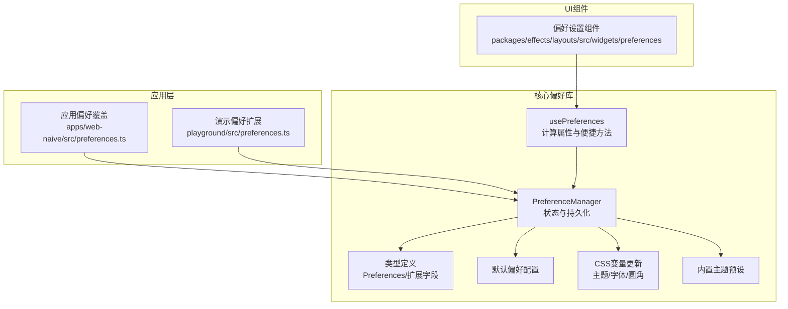
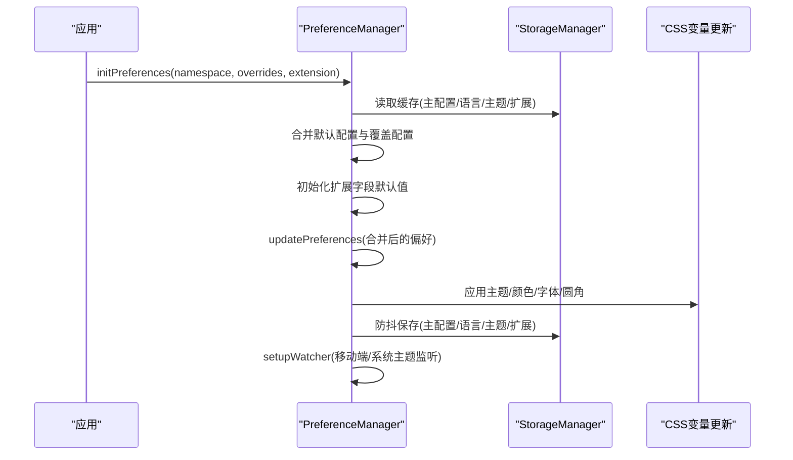
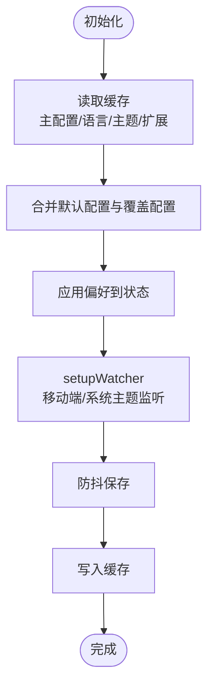
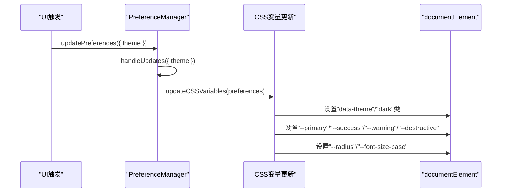
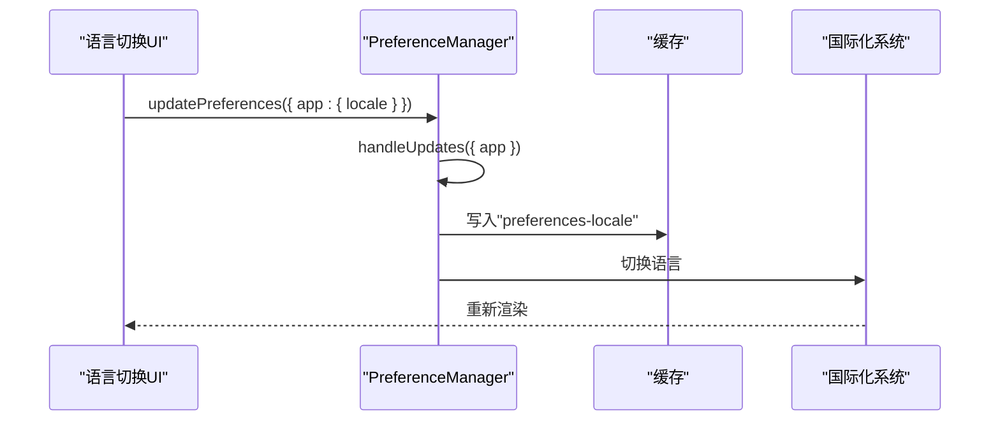
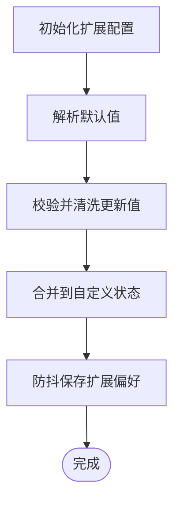
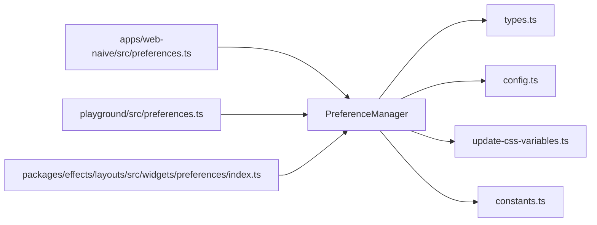

# 应用偏好状态管理

<cite>
**本文档引用的文件**
- [apps/web-naive/src/preferences.ts](file://apps/web-naive/src/preferences.ts)
- [playground/src/preferences.ts](file://playground/src/preferences.ts)
- [packages/@core/preferences/src/preferences.ts](file://packages/@core/preferences/src/preferences.ts)
- [packages/@core/preferences/src/types.ts](file://packages/@core/preferences/src/types.ts)
- [packages/@core/preferences/src/use-preferences.ts](file://packages/@core/preferences/src/use-preferences.ts)
- [packages/@core/preferences/src/config.ts](file://packages/@core/preferences/src/config.ts)
- [packages/@core/preferences/src/update-css-variables.ts](file://packages/@core/preferences/src/update-css-variables.ts)
- [packages/@core/preferences/src/constants.ts](file://packages/@core/preferences/src/constants.ts)
- [packages/effects/layouts/src/widgets/preferences/index.ts](file://packages/effects/layouts/src/widgets/preferences/index.ts)
</cite>

## 目录

1. [简介](#简介)
2. [项目结构](#项目结构)
3. [核心组件](#核心组件)
4. [架构总览](#架构总览)
5. [详细组件分析](#详细组件分析)
6. [依赖关系分析](#依赖关系分析)
7. [性能考虑](#性能考虑)
8. [故障排除指南](#故障排除指南)
9. [结论](#结论)
10. [附录](#附录)

## 简介

本文件面向 shiyu-ui 项目的应用偏好状态管理，系统性阐述偏好数据结构、存储机制、持久化策略、主题与语言状态管理、默认值与回退机制，以及可扩展的偏好扩展能力。目标是帮助开发者快速理解并安全地扩展应用偏好功能。

## 项目结构

偏好系统由核心库与应用层配置共同组成：

- 核心偏好库：提供偏好模型、状态管理、持久化、主题与语言应用、扩展字段校验与默认值解析等能力
- 应用层配置：通过覆盖默认偏好与定义扩展字段，注入到核心偏好库中
- 布局与组件：暴露偏好设置入口与交互组件，驱动偏好变更

**图表来源**

- [apps/web-naive/src/preferences.ts:1-17](file://apps/web-naive/src/preferences.ts#L1-L17)
- [playground/src/preferences.ts:18-26](file://playground/src/preferences.ts#L18-L26)
- [packages/@core/preferences/src/preferences.ts:32-459](file://packages/@core/preferences/src/preferences.ts#L32-L459)
- [packages/@core/preferences/src/types.ts:374-441](file://packages/@core/preferences/src/types.ts#L374-L441)
- [packages/@core/preferences/src/config.ts:3-148](file://packages/@core/preferences/src/config.ts#L3-L148)
- [packages/@core/preferences/src/update-css-variables.ts:12-130](file://packages/@core/preferences/src/update-css-variables.ts#L12-L130)
- [packages/@core/preferences/src/constants.ts:10-79](file://packages/@core/preferences/src/constants.ts#L10-L79)
- [packages/effects/layouts/src/widgets/preferences/index.ts:1-4](file://packages/effects/layouts/src/widgets/preferences/index.ts#L1-L4)

**章节来源**

- [apps/web-naive/src/preferences.ts:1-17](file://apps/web-naive/src/preferences.ts#L1-L17)
- [playground/src/preferences.ts:18-88](file://playground/src/preferences.ts#L18-L88)
- [packages/@core/preferences/src/preferences.ts:32-459](file://packages/@core/preferences/src/preferences.ts#L32-L459)
- [packages/@core/preferences/src/types.ts:374-441](file://packages/@core/preferences/src/types.ts#L374-L441)
- [packages/@core/preferences/src/config.ts:3-148](file://packages/@core/preferences/src/config.ts#L3-L148)
- [packages/@core/preferences/src/update-css-variables.ts:12-130](file://packages/@core/preferences/src/update-css-variables.ts#L12-L130)
- [packages/@core/preferences/src/constants.ts:10-79](file://packages/@core/preferences/src/constants.ts#L10-L79)
- [packages/effects/layouts/src/widgets/preferences/index.ts:1-4](file://packages/effects/layouts/src/widgets/preferences/index.ts#L1-L4)

## 核心组件

- PreferenceManager：偏好状态的核心管理器，负责初始化、合并、更新、持久化、监听系统偏好变化、应用主题与颜色模式
- usePreferences：组合式函数，提供对偏好状态的计算属性与便捷判断，如主题明暗、布局模式、快捷键开关等
- 类型系统：定义完整的偏好数据结构与扩展字段类型，确保强类型约束与默认值推导
- 默认配置：集中定义各模块默认值，作为初始化与重置的基础
- CSS变量更新：根据主题模式、内置主题、主色与字号等动态更新根元素CSS变量
- 偏好扩展：支持在应用层定义扩展字段（输入、数字、选择、开关），并提供默认值与校验

**章节来源**

- [packages/@core/preferences/src/preferences.ts:32-459](file://packages/@core/preferences/src/preferences.ts#L32-L459)
- [packages/@core/preferences/src/use-preferences.ts:8-268](file://packages/@core/preferences/src/use-preferences.ts#L8-L268)
- [packages/@core/preferences/src/types.ts:374-441](file://packages/@core/preferences/src/types.ts#L374-L441)
- [packages/@core/preferences/src/config.ts:3-148](file://packages/@core/preferences/src/config.ts#L3-L148)
- [packages/@core/preferences/src/update-css-variables.ts:12-130](file://packages/@core/preferences/src/update-css-variables.ts#L12-L130)

## 架构总览

偏好系统采用“核心库 + 应用覆盖 + 扩展字段”的分层设计：

- 应用层通过覆盖默认偏好与定义扩展字段，注入到核心偏好库
- 核心偏好库以响应式状态管理偏好，结合防抖持久化与系统监听
- UI层通过组合式函数读取偏好并渲染组件

**图表来源**

- [packages/@core/preferences/src/preferences.ts:110-158](file://packages/@core/preferences/src/preferences.ts#L110-L158)
- [packages/@core/preferences/src/preferences.ts:390-401](file://packages/@core/preferences/src/preferences.ts#L390-L401)
- [packages/@core/preferences/src/preferences.ts:406-441](file://packages/@core/preferences/src/preferences.ts#L406-L441)
- [packages/@core/preferences/src/update-css-variables.ts:12-82](file://packages/@core/preferences/src/update-css-variables.ts#L12-L82)

**章节来源**

- [packages/@core/preferences/src/preferences.ts:110-158](file://packages/@core/preferences/src/preferences.ts#L110-L158)
- [packages/@core/preferences/src/preferences.ts:390-401](file://packages/@core/preferences/src/preferences.ts#L390-L401)
- [packages/@core/preferences/src/preferences.ts:406-441](file://packages/@core/preferences/src/preferences.ts#L406-L441)
- [packages/@core/preferences/src/update-css-variables.ts:12-82](file://packages/@core/preferences/src/update-css-variables.ts#L12-L82)

## 详细组件分析

### 数据结构与默认值管理

- 偏好数据结构由类型系统统一定义，涵盖应用、面包屑、版权、底栏、顶栏、Logo、导航、快捷键、侧边栏、标签页、主题、过渡、小部件等模块
- 默认配置集中于默认偏好文件，提供各模块的合理缺省值
- 扩展字段类型支持输入、数字、选择、开关四类，配合默认值与校验规则，保证扩展配置的正确性

```mermaid
classDiagram
class Preferences {
+app : AppPreferences
+breadcrumb : BreadcrumbPreferences
+copyright : CopyrightPreferences
+footer : FooterPreferences
+header : HeaderPreferences
+logo : LogoPreferences
+navigation : NavigationPreferences
+shortcutKeys : ShortcutKeyPreferences
+sidebar : SidebarPreferences
+tabbar : TabbarPreferences
+theme : ThemePreferences
+transition : TransitionPreferences
+widget : WidgetPreferences
}
class AppPreferences {
+accessMode
+authPageLayout
+compact
+contentCompact
+contentPadding*
+defaultHomePath
+enableCheckUpdates
+enableRefreshToken
+isMobile
+layout
+locale
+loginExpiredMode
+name
+watermark*
+zIndex
}
class ThemePreferences {
+builtinType
+colorPrimary
+colorDestructive
+colorSuccess
+colorWarning
+fontSize
+mode
+radius
+semiDarkHeader
+semiDarkSidebar
+semiDarkSidebarSub
}
class PreferencesExtension {
+fields : CustomPreferencesField[]
+tabLabel
+title
}
Preferences --> AppPreferences
Preferences --> ThemePreferences
Preferences --> PreferencesExtension
```

**图表来源**

- [packages/@core/preferences/src/types.ts:374-441](file://packages/@core/preferences/src/types.ts#L374-L441)
- [packages/@core/preferences/src/types.ts:99-168](file://packages/@core/preferences/src/types.ts#L99-L168)
- [packages/@core/preferences/src/types.ts:317-340](file://packages/@core/preferences/src/types.ts#L317-L340)
- [packages/@core/preferences/src/types.ts:91-97](file://packages/@core/preferences/src/types.ts#L91-L97)

**章节来源**

- [packages/@core/preferences/src/types.ts:374-441](file://packages/@core/preferences/src/types.ts#L374-L441)
- [packages/@core/preferences/src/config.ts:3-148](file://packages/@core/preferences/src/config.ts#L3-L148)

### 存储机制与持久化策略

- 存储键名：主配置、语言、主题、扩展偏好分别独立存储，便于按需读写与清理
- 存储介质：使用统一的存储管理器进行读写；默认使用浏览器本地存储，可通过命名空间隔离不同应用或环境
- 持久化策略：采用防抖保存，降低频繁更新带来的性能开销；同时在初始化阶段合并缓存与覆盖配置，确保一致性
- 清理策略：提供清理全部缓存的方法，便于开发调试与迁移

**图表来源**

- [packages/@core/preferences/src/preferences.ts:110-158](file://packages/@core/preferences/src/preferences.ts#L110-L158)
- [packages/@core/preferences/src/preferences.ts:390-401](file://packages/@core/preferences/src/preferences.ts#L390-L401)
- [packages/@core/preferences/src/preferences.ts:406-441](file://packages/@core/preferences/src/preferences.ts#L406-L441)

**章节来源**

- [packages/@core/preferences/src/preferences.ts:25-30](file://packages/@core/preferences/src/preferences.ts#L25-L30)
- [packages/@core/preferences/src/preferences.ts:110-158](file://packages/@core/preferences/src/preferences.ts#L110-L158)
- [packages/@core/preferences/src/preferences.ts:390-401](file://packages/@core/preferences/src/preferences.ts#L390-L401)

### 主题状态管理（明暗/内置主题/自定义颜色/动态应用）

- 主题模式：支持 light/dark/auto 三种模式；auto 模式下跟随系统主题变化
- 内置主题：提供多种内置主题类型，根据明暗模式选择对应主色
- 自定义颜色：允许覆盖主色、成功色、警告色、破坏色等，系统将生成并应用对应的 CSS 变量
- 动态应用：当主题相关字段更新时，立即更新根元素的类名与 dataset，并同步更新 CSS 变量（圆角、字体大小、颜色映射）

**图表来源**

- [packages/@core/preferences/src/preferences.ts:206-216](file://packages/@core/preferences/src/preferences.ts#L206-L216)
- [packages/@core/preferences/src/preferences.ts:238-254](file://packages/@core/preferences/src/preferences.ts#L238-L254)
- [packages/@core/preferences/src/update-css-variables.ts:12-82](file://packages/@core/preferences/src/update-css-variables.ts#L12-L82)

**章节来源**

- [packages/@core/preferences/src/update-css-variables.ts:12-130](file://packages/@core/preferences/src/update-css-variables.ts#L12-L130)
- [packages/@core/preferences/src/constants.ts:10-79](file://packages/@core/preferences/src/constants.ts#L10-L79)

### 语言切换状态管理（多语言配置与实时切换）

- 语言字段：位于应用偏好中，支持 zh-CN/en-US
- 实时切换：更新语言后，系统会将新语言写入缓存；UI层通过组合式函数读取当前语言并驱动界面国际化
- 回退机制：若缓存中无语言配置，则使用默认语言

**图表来源**

- [packages/@core/preferences/src/preferences.ts:206-216](file://packages/@core/preferences/src/preferences.ts#L206-L216)
- [packages/@core/preferences/src/preferences.ts:390-393](file://packages/@core/preferences/src/preferences.ts#L390-L393)

**章节来源**

- [packages/@core/preferences/src/types.ts:19](file://packages/@core/preferences/src/types.ts#L19)
- [packages/@core/preferences/src/preferences.ts:390-393](file://packages/@core/preferences/src/preferences.ts#L390-L393)

### 偏好扩展（自定义业务配置）

- 扩展字段：支持输入、数字、选择、开关四种组件类型，每种类型具备默认值与校验逻辑
- 默认值解析：根据扩展配置生成初始自定义偏好，默认值来自扩展字段定义
- 值校验：针对数字类型的最小值、最大值、步长进行严格校验；选择类型校验枚举值；布尔与字符串类型进行基础类型校验
- 持久化：扩展偏好单独存储，重置时恢复为扩展字段定义的默认值

**图表来源**

- [packages/@core/preferences/src/preferences.ts:128-130](file://packages/@core/preferences/src/preferences.ts#L128-L130)
- [packages/@core/preferences/src/preferences.ts:142-148](file://packages/@core/preferences/src/preferences.ts#L142-L148)
- [packages/@core/preferences/src/preferences.ts:342-356](file://packages/@core/preferences/src/preferences.ts#L342-L356)
- [packages/@core/preferences/src/preferences.ts:364-385](file://packages/@core/preferences/src/preferences.ts#L364-L385)
- [packages/@core/preferences/src/preferences.ts:395-400](file://packages/@core/preferences/src/preferences.ts#L395-L400)

**章节来源**

- [playground/src/preferences.ts:30-88](file://playground/src/preferences.ts#L30-L88)
- [packages/@core/preferences/src/preferences.ts:342-356](file://packages/@core/preferences/src/preferences.ts#L342-L356)
- [packages/@core/preferences/src/preferences.ts:364-385](file://packages/@core/preferences/src/preferences.ts#L364-L385)

### 应用层配置示例（覆盖与扩展）

- 应用覆盖：在应用入口定义覆盖配置，如应用名称、登录过期模式、权限模式、是否启用刷新令牌等
- 偏好扩展：在应用层定义扩展字段，如报表标题、默认可见行数、快捷操作开关、高亮色调等

**章节来源**

- [apps/web-naive/src/preferences.ts:8-16](file://apps/web-naive/src/preferences.ts#L8-L16)
- [playground/src/preferences.ts:18-26](file://playground/src/preferences.ts#L18-L26)
- [playground/src/preferences.ts:30-88](file://playground/src/preferences.ts#L30-L88)

## 依赖关系分析

- 应用层依赖核心偏好库提供的初始化与更新接口
- 核心偏好库依赖类型系统、默认配置、CSS变量更新工具与常量
- UI层通过组合式函数读取偏好并渲染组件，组件入口导出偏好设置按钮与面板

**图表来源**

- [apps/web-naive/src/preferences.ts:1-17](file://apps/web-naive/src/preferences.ts#L1-L17)
- [playground/src/preferences.ts:18-88](file://playground/src/preferences.ts#L18-L88)
- [packages/@core/preferences/src/preferences.ts:32-459](file://packages/@core/preferences/src/preferences.ts#L32-L459)
- [packages/@core/preferences/src/types.ts:374-441](file://packages/@core/preferences/src/types.ts#L374-L441)
- [packages/@core/preferences/src/config.ts:3-148](file://packages/@core/preferences/src/config.ts#L3-L148)
- [packages/@core/preferences/src/update-css-variables.ts:12-130](file://packages/@core/preferences/src/update-css-variables.ts#L12-L130)
- [packages/@core/preferences/src/constants.ts:10-79](file://packages/@core/preferences/src/constants.ts#L10-L79)
- [packages/effects/layouts/src/widgets/preferences/index.ts:1-4](file://packages/effects/layouts/src/widgets/preferences/index.ts#L1-L4)

**章节来源**

- [packages/@core/preferences/src/preferences.ts:32-459](file://packages/@core/preferences/src/preferences.ts#L32-L459)
- [packages/effects/layouts/src/widgets/preferences/index.ts:1-4](file://packages/effects/layouts/src/widgets/preferences/index.ts#L1-L4)

## 性能考虑

- 防抖保存：对偏好更新进行防抖，减少频繁写入缓存的开销
- 响应式状态：使用响应式对象管理偏好，仅在相关字段更新时触发 UI 变更
- 系统监听：仅在必要时监听系统主题与断点变化，避免不必要的重绘
- 分离存储：将主配置、语言、主题、扩展偏好分离存储，按需读写，降低耦合

[本节为通用性能建议，无需特定文件引用]

## 故障排除指南

- 偏好不生效：确认已清空缓存并重新初始化；检查命名空间是否正确；验证覆盖配置是否合法
- 语言切换无效：检查语言字段是否在缓存中写入；确认国际化系统是否监听语言变化
- 主题切换异常：检查主题模式是否为 auto；确认系统主题变化事件是否正确处理
- 扩展字段无效：检查扩展字段的默认值与校验规则；确认更新值是否满足数值范围与步长要求

**章节来源**

- [packages/@core/preferences/src/preferences.ts:53-55](file://packages/@core/preferences/src/preferences.ts#L53-L55)
- [packages/@core/preferences/src/preferences.ts:425-441](file://packages/@core/preferences/src/preferences.ts#L425-L441)

## 结论

shiyu-ui 的偏好系统通过核心库与应用层配置的协作，提供了完善的偏好数据结构、持久化策略、主题与语言管理、扩展能力与默认值回退机制。开发者可在不破坏现有结构的前提下，安全地扩展业务偏好与个性化设置。

## 附录

- 偏好设置入口组件：偏好设置按钮与面板
- 常用操作路径参考：
  - 初始化偏好：[packages/@core/preferences/src/preferences.ts:110-158](file://packages/@core/preferences/src/preferences.ts#L110-L158)
  - 更新偏好：[packages/@core/preferences/src/preferences.ts:206-216](file://packages/@core/preferences/src/preferences.ts#L206-L216)
  - 应用主题与颜色：[packages/@core/preferences/src/update-css-variables.ts:12-82](file://packages/@core/preferences/src/update-css-variables.ts#L12-L82)
  - 语言切换持久化：[packages/@core/preferences/src/preferences.ts:390-393](file://packages/@core/preferences/src/preferences.ts#L390-L393)
  - 扩展字段默认值解析：[packages/@core/preferences/src/preferences.ts:342-356](file://packages/@core/preferences/src/preferences.ts#L342-L356)
  - 扩展字段校验与保存：[packages/@core/preferences/src/preferences.ts:364-400](file://packages/@core/preferences/src/preferences.ts#L364-L400)
