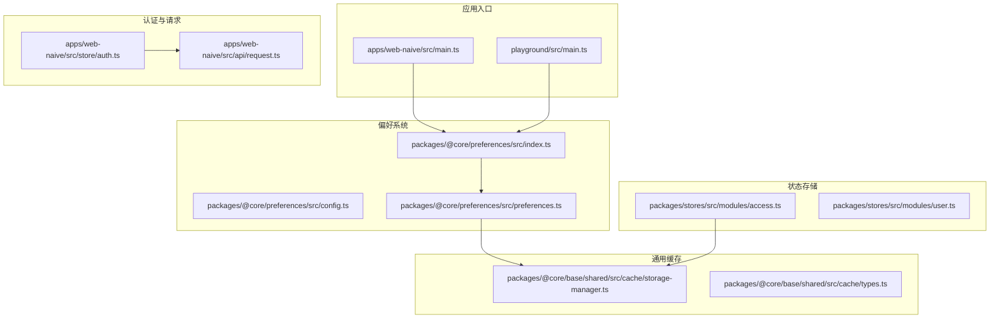
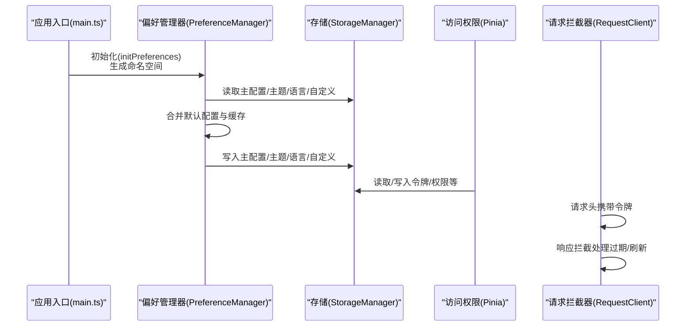
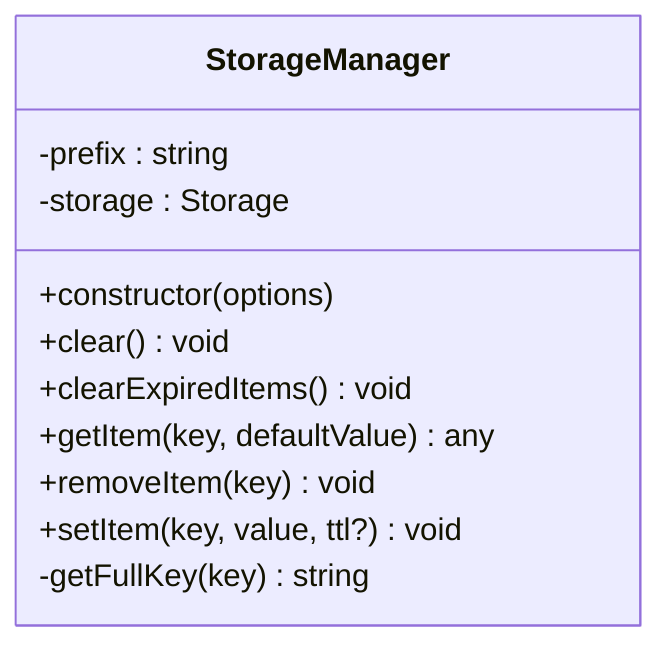
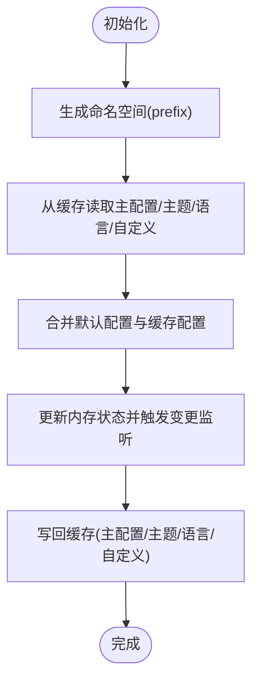
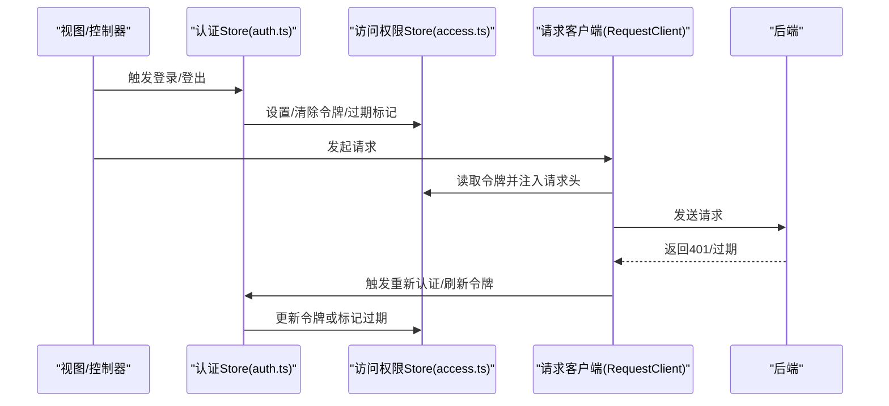
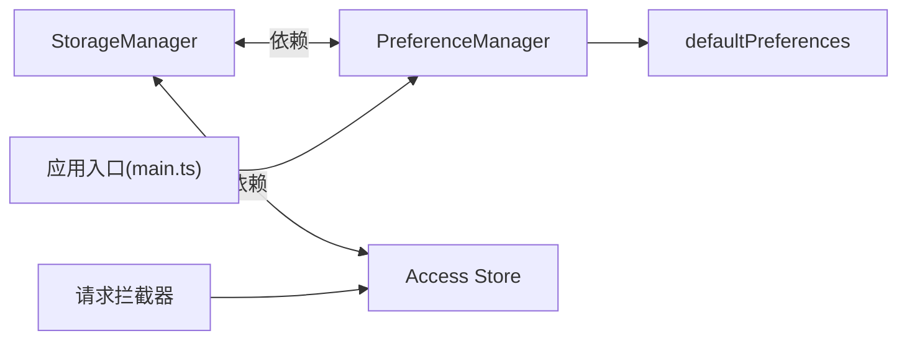

# 状态持久化

<cite>
**本文引用的文件**
- [apps/web-naive/src/main.ts](file://apps/web-naive/src/main.ts)
- [playground/src/main.ts](file://playground/src/main.ts)
- [apps/web-naive/src/preferences.ts](file://apps/web-naive/src/preferences.ts)
- [packages/@core/preferences/src/index.ts](file://packages/@core/preferences/src/index.ts)
- [packages/@core/preferences/src/config.ts](file://packages/@core/preferences/src/config.ts)
- [packages/@core/preferences/src/preferences.ts](file://packages/@core/preferences/src/preferences.ts)
- [packages/@core/base/shared/src/cache/storage-manager.ts](file://packages/@core/base/shared/src/cache/storage-manager.ts)
- [packages/@core/base/shared/src/cache/types.ts](file://packages/@core/base/shared/src/cache/types.ts)
- [packages/@core/base/shared/src/cache/__tests__/storage-manager.test.ts](file://packages/@core/base/shared/src/cache/__tests__/storage-manager.test.ts)
- [packages/stores/src/modules/access.ts](file://packages/stores/src/modules/access.ts)
- [packages/stores/src/modules/user.ts](file://packages/stores/src/modules/user.ts)
- [apps/web-naive/src/store/auth.ts](file://apps/web-naive/src/store/auth.ts)
- [playground/src/store/auth.ts](file://playground/src/store/auth.ts)
- [apps/web-naive/src/api/request.ts](file://apps/web-naive/src/api/request.ts)
- [playground/src/api/request.ts](file://playground/src/api/request.ts)
</cite>

## 目录

1. [简介](#简介)
2. [项目结构](#项目结构)
3. [核心组件](#核心组件)
4. [架构总览](#架构总览)
5. [组件详解](#组件详解)
6. [依赖关系分析](#依赖关系分析)
7. [性能与容量优化](#性能与容量优化)
8. [故障排查指南](#故障排查指南)
9. [结论](#结论)
10. [附录](#附录)

## 简介

本文件面向 shiyu-ui 项目，系统性梳理其状态持久化机制，涵盖 localStorage、sessionStorage 的使用策略，认证状态、应用偏好、用户临时数据等不同状态类型的持久化方案，状态恢复与迁移流程，安全与访问控制考量，以及序列化/反序列化与错误处理的最佳实践。目标是帮助开发者正确实现与维护状态持久化功能。

## 项目结构

本项目采用多包架构，状态持久化涉及以下关键模块：

- 应用入口与偏好初始化：应用启动时初始化偏好设置，生成命名空间以隔离不同环境/版本的数据。
- 偏好设置持久化：偏好管理器基于 StorageManager 将主配置、主题、语言、自定义扩展等写入本地存储。
- 认证与访问状态持久化：Pinia Store 的访问权限模块支持选择性持久化，结合请求拦截器处理令牌刷新与过期。
- 通用存储管理：StorageManager 提供统一的 localStorage/sessionStorage 访问、TTL 过期清理与错误兜底。

图表来源

- [apps/web-naive/src/main.ts:1-31](file://apps/web-naive/src/main.ts#L1-L31)
- [playground/src/main.ts:1-32](file://playground/src/main.ts#L1-L32)
- [packages/@core/preferences/src/index.ts:1-24](file://packages/@core/preferences/src/index.ts#L1-L24)
- [packages/@core/preferences/src/preferences.ts:1-459](file://packages/@core/preferences/src/preferences.ts#L1-L459)
- [packages/@core/base/shared/src/cache/storage-manager.ts:1-119](file://packages/@core/base/shared/src/cache/storage-manager.ts#L1-L119)
- [packages/stores/src/modules/access.ts:1-130](file://packages/stores/src/modules/access.ts#L1-L130)
- [apps/web-naive/src/store/auth.ts:1-118](file://apps/web-naive/src/store/auth.ts#L1-L118)
- [apps/web-naive/src/api/request.ts:1-92](file://apps/web-naive/src/api/request.ts#L1-L92)

章节来源

- [apps/web-naive/src/main.ts:1-31](file://apps/web-naive/src/main.ts#L1-L31)
- [playground/src/main.ts:1-32](file://playground/src/main.ts#L1-L32)
- [packages/@core/preferences/src/index.ts:1-24](file://packages/@core/preferences/src/index.ts#L1-L24)
- [packages/@core/preferences/src/preferences.ts:1-459](file://packages/@core/preferences/src/preferences.ts#L1-L459)
- [packages/@core/base/shared/src/cache/storage-manager.ts:1-119](file://packages/@core/base/shared/src/cache/storage-manager.ts#L1-L119)
- [packages/stores/src/modules/access.ts:1-130](file://packages/stores/src/modules/access.ts#L1-L130)
- [apps/web-naive/src/store/auth.ts:1-118](file://apps/web-naive/src/store/auth.ts#L1-L118)
- [apps/web-naive/src/api/request.ts:1-92](file://apps/web-naive/src/api/request.ts#L1-L92)

## 核心组件

- StorageManager：封装 localStorage/sessionStorage 的统一访问层，支持键前缀、TTL 过期、JSON 序列化/反序列化与异常清理。
- PreferenceManager：偏好设置的持久化与恢复中心，负责合并默认配置、命名空间隔离、分片存储（主配置、主题、语言、自定义扩展）与变更监听。
- Pinia 访问权限模块：选择性持久化令牌、权限码、锁屏状态等关键字段。
- 应用入口：初始化偏好设置并生成命名空间，确保不同环境/版本间数据隔离。

章节来源

- [packages/@core/base/shared/src/cache/storage-manager.ts:1-119](file://packages/@core/base/shared/src/cache/storage-manager.ts#L1-L119)
- [packages/@core/preferences/src/preferences.ts:1-459](file://packages/@core/preferences/src/preferences.ts#L1-L459)
- [packages/stores/src/modules/access.ts:1-130](file://packages/stores/src/modules/access.ts#L1-L130)
- [apps/web-naive/src/main.ts:1-31](file://apps/web-naive/src/main.ts#L1-L31)

## 架构总览

下图展示从应用启动到状态持久化的整体流程，包括偏好初始化、存储写入、访问状态持久化与令牌过期处理。

图表来源

- [apps/web-naive/src/main.ts:9-25](file://apps/web-naive/src/main.ts#L9-L25)
- [packages/@core/preferences/src/preferences.ts:110-158](file://packages/@core/preferences/src/preferences.ts#L110-L158)
- [packages/@core/preferences/src/preferences.ts:390-401](file://packages/@core/preferences/src/preferences.ts#L390-L401)
- [packages/stores/src/modules/access.ts:102-111](file://packages/stores/src/modules/access.ts#L102-L111)
- [apps/web-naive/src/api/request.ts:32-92](file://apps/web-naive/src/api/request.ts#L32-L92)

## 组件详解

### StorageManager：统一存储访问与过期清理

- 设计要点
  - 支持 localStorage 与 sessionStorage 两种后端，可通过构造参数切换。
  - 所有键名带前缀，避免冲突；支持批量清理与过期项清理。
  - 写入采用 JSON 序列化，读取时解析并校验过期时间；解析失败或过期自动移除并返回默认值。
- 关键接口
  - setItem(key, value, ttl?)
  - getItem(key, defaultValue?)
  - removeItem(key)
  - clear()/clearExpiredItems()
- 错误处理
  - 写入异常记录日志；读取异常或过期项自动清理并返回默认值，保证健壮性。

图表来源

- [packages/@core/base/shared/src/cache/storage-manager.ts:13-116](file://packages/@core/base/shared/src/cache/storage-manager.ts#L13-L116)

章节来源

- [packages/@core/base/shared/src/cache/storage-manager.ts:1-119](file://packages/@core/base/shared/src/cache/storage-manager.ts#L1-L119)
- [packages/@core/base/shared/src/cache/types.ts:1-17](file://packages/@core/base/shared/src/cache/types.ts#L1-L17)
- [packages/@core/base/shared/src/cache/**tests**/storage-manager.test.ts:1-79](file://packages/@core/base/shared/src/cache/__tests__/storage-manager.test.ts#L1-L79)

### PreferenceManager：偏好设置的持久化与恢复

- 设计要点
  - 命名空间隔离：通过 initPreferences 的 namespace 参数为所有存储键加前缀，区分不同环境/版本。
  - 分片存储：主配置、主题模式、语言、自定义扩展分别持久化，便于按需读取与更新。
  - 合并策略：初始配置与默认配置合并，再与缓存合并，最后写回缓存。
  - 变更监听：对主题、颜色模式等关键字段变更即时同步到 DOM/CSS 变量。
- 关键接口
  - initPreferences({ namespace, overrides, extension })
  - updatePreferences(updates)
  - updateCustomPreferences(updates)
  - resetPreferences()
  - clearCache()
  - getPreferences()/getCustomPreferences()

图表来源

- [packages/@core/preferences/src/preferences.ts:110-158](file://packages/@core/preferences/src/preferences.ts#L110-L158)
- [packages/@core/preferences/src/preferences.ts:323-401](file://packages/@core/preferences/src/preferences.ts#L323-L401)

章节来源

- [packages/@core/preferences/src/preferences.ts:1-459](file://packages/@core/preferences/src/preferences.ts#L1-L459)
- [packages/@core/preferences/src/config.ts:1-148](file://packages/@core/preferences/src/config.ts#L1-L148)
- [packages/@core/preferences/src/index.ts:1-24](file://packages/@core/preferences/src/index.ts#L1-L24)

### 认证与访问状态持久化

- 访问权限模块持久化
  - 通过 persist.pick 选择性持久化：令牌、权限码、锁屏状态等。
  - 适合短期有效且需要跨会话保留的状态，如登录态、锁屏信息。
- 请求拦截器与令牌刷新
  - 在响应拦截器中处理令牌过期，支持弹窗提示或强制登出。
  - 可选刷新令牌流程，成功后更新访问令牌并继续请求。
- 登出与重置
  - 登出时重置所有状态并清除登录过期标记，必要时跳转登录页。

图表来源

- [packages/stores/src/modules/access.ts:102-111](file://packages/stores/src/modules/access.ts#L102-L111)
- [apps/web-naive/src/store/auth.ts:81-99](file://apps/web-naive/src/store/auth.ts#L81-L99)
- [apps/web-naive/src/api/request.ts:32-92](file://apps/web-naive/src/api/request.ts#L32-L92)

章节来源

- [packages/stores/src/modules/access.ts:1-130](file://packages/stores/src/modules/access.ts#L1-L130)
- [apps/web-naive/src/store/auth.ts:1-118](file://apps/web-naive/src/store/auth.ts#L1-L118)
- [apps/web-naive/src/api/request.ts:1-92](file://apps/web-naive/src/api/request.ts#L1-L92)
- [playground/src/store/auth.ts:39-85](file://playground/src/store/auth.ts#L39-L85)
- [playground/src/api/request.ts:44-95](file://playground/src/api/request.ts#L44-L95)

### 应用入口与命名空间隔离

- 应用启动时计算命名空间，组合命名空间、版本号与环境，作为 StorageManager 的前缀，确保不同环境/版本数据隔离。
- 偏好初始化在应用启动早期完成，避免后续状态覆盖或读取冲突。

章节来源

- [apps/web-naive/src/main.ts:9-25](file://apps/web-naive/src/main.ts#L9-L25)
- [playground/src/main.ts:9-27](file://playground/src/main.ts#L9-L27)
- [apps/web-naive/src/preferences.ts:8-16](file://apps/web-naive/src/preferences.ts#L8-L16)

## 依赖关系分析

- 偏好系统依赖 StorageManager 实现持久化；命名空间由应用入口传入。
- 访问权限模块依赖 StorageManager 读写令牌与权限码；请求拦截器依赖访问权限状态注入 Authorization 头。
- 测试覆盖了 StorageManager 的增删改查、过期清理与异常处理。

图表来源

- [packages/@core/preferences/src/preferences.ts:13-46](file://packages/@core/preferences/src/preferences.ts#L13-L46)
- [packages/@core/base/shared/src/cache/storage-manager.ts:17-26](file://packages/@core/base/shared/src/cache/storage-manager.ts#L17-L26)
- [packages/stores/src/modules/access.ts:102-111](file://packages/stores/src/modules/access.ts#L102-L111)
- [apps/web-naive/src/api/request.ts:63-80](file://apps/web-naive/src/api/request.ts#L63-L80)

章节来源

- [packages/@core/preferences/src/preferences.ts:1-459](file://packages/@core/preferences/src/preferences.ts#L1-L459)
- [packages/@core/base/shared/src/cache/storage-manager.ts:1-119](file://packages/@core/base/shared/src/cache/storage-manager.ts#L1-L119)
- [packages/stores/src/modules/access.ts:1-130](file://packages/stores/src/modules/access.ts#L1-L130)
- [apps/web-naive/src/api/request.ts:1-92](file://apps/web-naive/src/api/request.ts#L1-L92)

## 性能与容量优化

- 写入节流
  - 偏好更新采用去抖策略，减少频繁写入，降低 I/O 压力。
- 分片存储
  - 将主配置、主题、语言、自定义扩展拆分存储，按需读取，避免大对象全量读写。
- TTL 与过期清理
  - 对临时数据设置合理 TTL，定期清理过期项，释放存储空间。
- 前缀隔离
  - 使用命名空间前缀，避免键冲突，便于批量清理与迁移。
- 容量监控
  - 建议在开发阶段记录存储占用趋势，防止超出浏览器限制导致写入失败。

章节来源

- [packages/@core/preferences/src/preferences.ts:47](file://packages/@core/preferences/src/preferences.ts#L47)
- [packages/@core/preferences/src/preferences.ts:390-401](file://packages/@core/preferences/src/preferences.ts#L390-L401)
- [packages/@core/base/shared/src/cache/storage-manager.ts:45-53](file://packages/@core/base/shared/src/cache/storage-manager.ts#L45-L53)

## 故障排查指南

- 常见问题
  - 读取不到缓存：确认命名空间是否一致，键名是否带前缀；检查是否被过期清理。
  - 写入失败：浏览器存储空间不足或异常，查看控制台错误日志。
  - 偏好未生效：确认 initPreferences 已在应用启动早期调用，且命名空间正确。
  - 令牌过期：检查响应拦截器中的重新认证与刷新逻辑是否启用。
- 排查步骤
  - 检查 StorageManager 的 setItem/getItem 行为与异常日志。
  - 使用测试用例思路验证：设置过期项、解析错误、批量清理等边界场景。
  - 核对访问权限模块的持久化字段与请求拦截器的令牌注入逻辑。

章节来源

- [packages/@core/base/shared/src/cache/storage-manager.ts:61-80](file://packages/@core/base/shared/src/cache/storage-manager.ts#L61-L80)
- [packages/@core/base/shared/src/cache/**tests**/storage-manager.test.ts:45-79](file://packages/@core/base/shared/src/cache/__tests__/storage-manager.test.ts#L45-L79)
- [apps/web-naive/src/api/request.ts:32-92](file://apps/web-naive/src/api/request.ts#L32-L92)

## 结论

本项目通过 StorageManager 提供统一、健壮的本地存储能力，配合 PreferenceManager 的命名空间隔离与分片持久化策略，实现了应用偏好的可靠恢复；结合 Pinia 访问权限模块的选择性持久化与请求拦截器的令牌刷新/过期处理，构建了完整的认证状态持久化闭环。建议在实际工程中遵循命名空间隔离、分片存储、TTL 控制与去抖写入等最佳实践，持续监控存储容量与性能表现。

## 附录

### 状态类型与存储策略对照

- 认证状态
  - 存储位置：访问权限模块持久化（令牌、权限码、锁屏状态）
  - 有效期：短期有效，结合刷新/过期处理
  - 安全性：仅存储必要字段，避免敏感明文
- 应用偏好
  - 存储位置：PreferenceManager 分片存储（主配置、主题、语言、自定义扩展）
  - 有效期：长期有效，随版本/环境命名空间隔离
  - 安全性：非敏感配置，可常规序列化存储
- 用户临时数据
  - 存储位置：按需使用 StorageManager 或 Pinia Store
  - 有效期：按业务设置 TTL，定期清理
  - 安全性：避免存储敏感信息；必要时进行加密

章节来源

- [packages/stores/src/modules/access.ts:102-111](file://packages/stores/src/modules/access.ts#L102-L111)
- [packages/@core/preferences/src/preferences.ts:390-401](file://packages/@core/preferences/src/preferences.ts#L390-L401)
- [packages/@core/base/shared/src/cache/storage-manager.ts:97-106](file://packages/@core/base/shared/src/cache/storage-manager.ts#L97-L106)

### 状态恢复与迁移流程

- 应用启动
  - 生成命名空间 → 初始化偏好 → 合并默认与缓存 → 写回缓存 → 启动应用
- 数据迁移
  - 新增字段：在默认配置中补充，首次启动自动合并到缓存
  - 字段变更：通过版本化命名空间隔离旧数据，新版本读取新字段
- 过期清理
  - 启动时或定时任务清理过期项，释放空间并保证一致性

章节来源

- [packages/@core/preferences/src/preferences.ts:110-158](file://packages/@core/preferences/src/preferences.ts#L110-L158)
- [packages/@core/base/shared/src/cache/storage-manager.ts:45-53](file://packages/@core/base/shared/src/cache/storage-manager.ts#L45-L53)

### 安全与访问控制

- 敏感数据处理
  - 令牌与密钥仅在内存与受控存储中短暂存在，避免明文落盘
  - 如需持久化敏感数据，建议引入前端加密库进行加解密后再存储
- 访问控制
  - 使用命名空间隔离不同环境/版本数据
  - 对外暴露的配置应避免包含敏感信息
- 最佳实践
  - 仅持久化必要状态
  - 定期轮换命名空间版本，清理历史缓存
  - 对异常写入/解析进行日志记录与告警

章节来源

- [apps/web-naive/src/preferences.ts:8-16](file://apps/web-naive/src/preferences.ts#L8-L16)
- [packages/@core/preferences/src/preferences.ts:110-158](file://packages/@core/preferences/src/preferences.ts#L110-L158)

### 代码示例路径（序列化、反序列化与错误处理）

- 序列化/反序列化
  - [packages/@core/base/shared/src/cache/storage-manager.ts:97-106](file://packages/@core/base/shared/src/cache/storage-manager.ts#L97-L106)
  - [packages/@core/base/shared/src/cache/storage-manager.ts:68-79](file://packages/@core/base/shared/src/cache/storage-manager.ts#L68-L79)
- 错误处理
  - [packages/@core/base/shared/src/cache/storage-manager.ts:101-105](file://packages/@core/base/shared/src/cache/storage-manager.ts#L101-L105)
  - [packages/@core/base/shared/src/cache/storage-manager.ts:75-79](file://packages/@core/base/shared/src/cache/storage-manager.ts#L75-L79)
- 偏好写入
  - [packages/@core/preferences/src/preferences.ts:390-401](file://packages/@core/preferences/src/preferences.ts#L390-L401)
- 偏好读取
  - [packages/@core/preferences/src/preferences.ts:331-333](file://packages/@core/preferences/src/preferences.ts#L331-L333)
