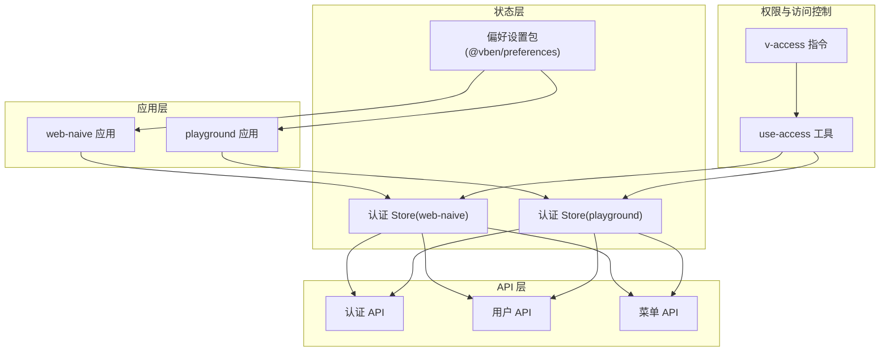
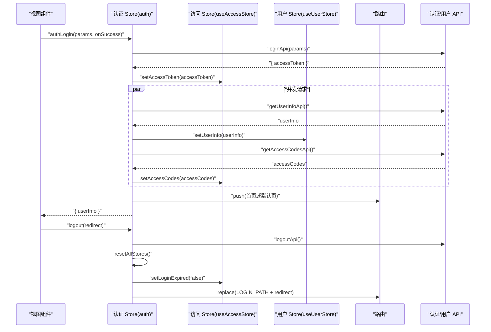
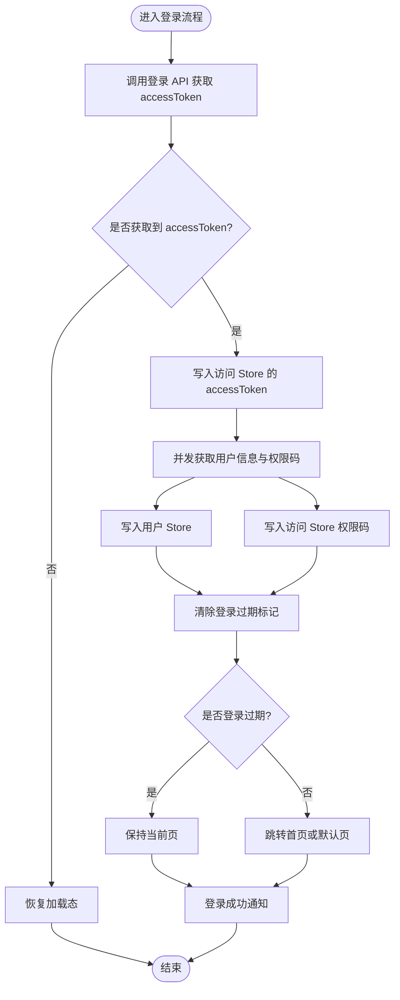
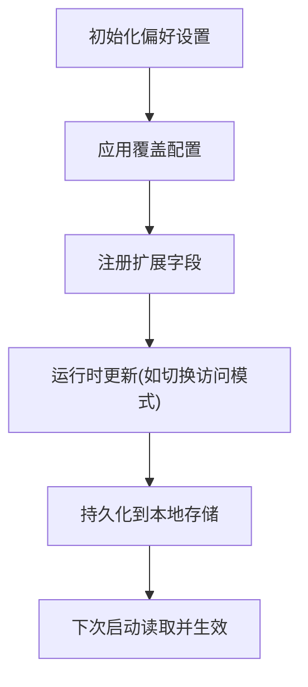
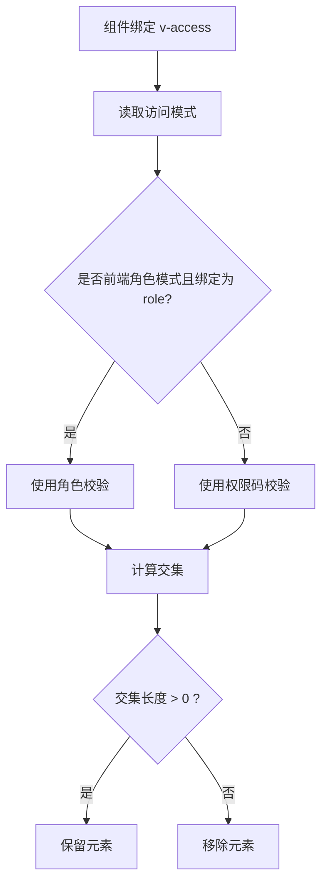
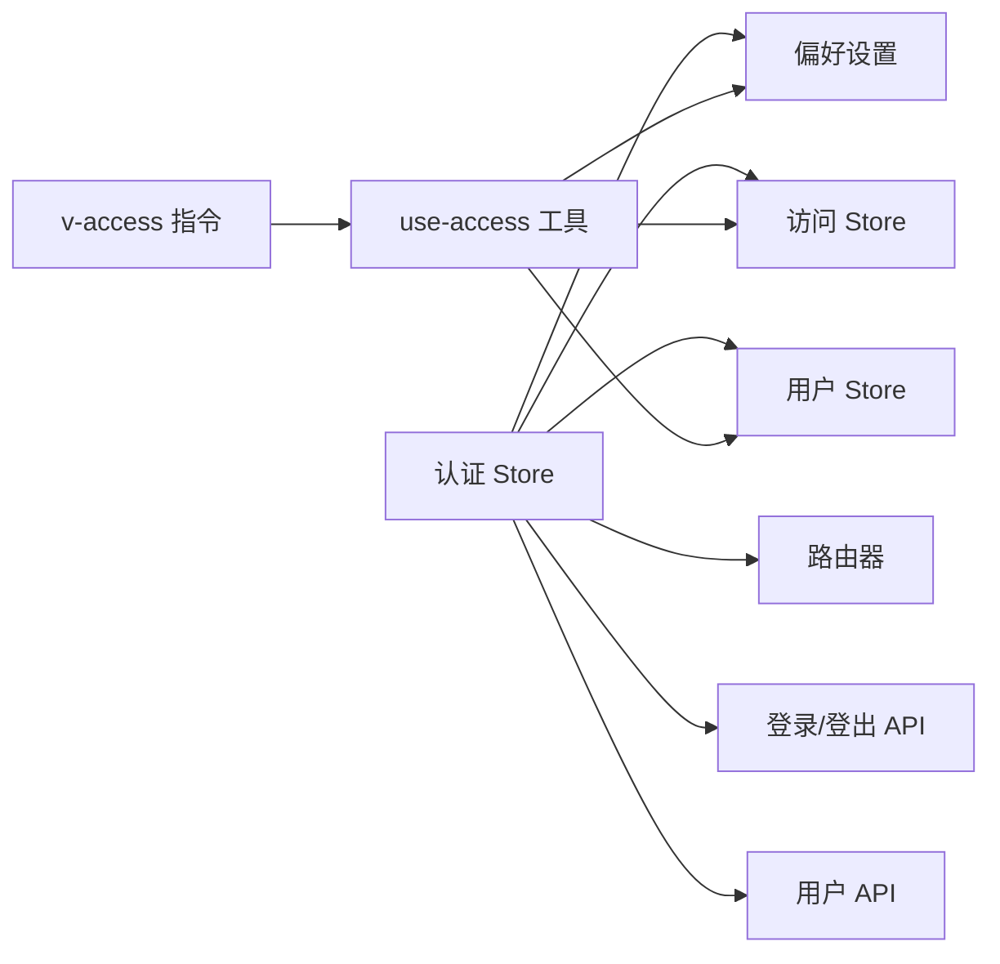

# 状态管理

<cite>
**本文引用的文件**
- [apps/web-naive/src/store/index.ts](file://apps/web-naive/src/store/index.ts)
- [apps/web-naive/src/store/auth.ts](file://apps/web-naive/src/store/auth.ts)
- [playground/src/store/index.ts](file://playground/src/store/index.ts)
- [playground/src/store/auth.ts](file://playground/src/store/auth.ts)
- [packages/preferences/src/index.ts](file://packages/preferences/src/index.ts)
- [apps/web-naive/src/preferences.ts](file://apps/web-naive/src/preferences.ts)
- [playground/src/preferences.ts](file://playground/src/preferences.ts)
- [packages/effects/access/src/use-access.ts](file://packages/effects/access/src/use-access.ts)
- [packages/effects/access/src/directive.ts](file://packages/effects/access/src/directive.ts)
- [apps/web-naive/src/api/core/auth.ts](file://apps/web-naive/src/api/core/auth.ts)
- [apps/web-naive/src/api/core/user.ts](file://apps/web-naive/src/api/core/user.ts)
- [apps/web-naive/src/api/core/menu.ts](file://apps/web-naive/src/api/core/menu.ts)
- [apps/web-naive/src/locales/index.ts](file://apps/web-naive/src/locales/index.ts)
- [apps/web-naive/src/main.ts](file://apps/web-naive/src/main.ts)
- [playground/src/views/demos/access/index.vue](file://playground/src/views/demos/access/index.vue)
</cite>

## 目录

1. [简介](#简介)
2. [项目结构](#项目结构)
3. [核心组件](#核心组件)
4. [架构总览](#架构总览)
5. [详细组件分析](#详细组件分析)
6. [依赖关系分析](#依赖关系分析)
7. [性能考量](#性能考量)
8. [故障排查指南](#故障排查指南)
9. [结论](#结论)
10. [附录](#附录)

## 简介

本文件系统性梳理 shiyu-ui 项目的状态管理体系，重点围绕 Pinia 状态管理的组织与模块化设计、认证状态（用户信息、权限状态、登录状态）的管理机制、应用偏好设置（主题、语言、布局等）的状态管理、状态持久化与本地存储策略、调试与监控方法，以及性能优化与最佳实践。目标是帮助开发者高效使用与扩展状态管理能力。

## 项目结构

- 应用层状态管理位于各应用的 store 目录，采用模块化组织：认证状态由 auth store 统一管理，其他业务 store 可按需扩展。
- 全局偏好设置通过 preferences 包统一注入与覆盖，支持应用级默认值与自定义扩展。
- 权限控制通过 access effect 提供工具函数与指令，结合 store 实现运行时切换与校验。
- API 层提供认证、用户、菜单等接口，作为状态变更的数据来源。

图表来源

- [apps/web-naive/src/store/auth.ts:16-118](file://apps/web-naive/src/store/auth.ts#L16-L118)
- [playground/src/store/auth.ts:16-126](file://playground/src/store/auth.ts#L16-L126)
- [packages/preferences/src/index.ts:1-28](file://packages/preferences/src/index.ts#L1-L28)
- [packages/effects/access/src/use-access.ts:6-51](file://packages/effects/access/src/use-access.ts#L6-L51)
- [packages/effects/access/src/directive.ts:1-42](file://packages/effects/access/src/directive.ts#L1-L42)

章节来源

- [apps/web-naive/src/store/index.ts:1-2](file://apps/web-naive/src/store/index.ts#L1-L2)
- [playground/src/store/index.ts:1-2](file://playground/src/store/index.ts#L1-L2)
- [packages/preferences/src/index.ts:1-28](file://packages/preferences/src/index.ts#L1-L28)

## 核心组件

- 认证 Store（Pinia）
  - 职责：登录、登出、获取用户信息、拉取权限码、设置登录过期状态、导航跳转、加载态管理。
  - 关键导出：authLogin、logout、fetchUserInfo、loginLoading、$reset。
- 偏好设置包（@vben/preferences）
  - 职责：提供全局偏好设置的默认值、覆盖函数与扩展函数；支持应用级覆盖与字段扩展。
  - 关键导出：defineOverridesPreferences、definePreferencesExtension、preferences。
- 权限工具与指令（@vben/access）
  - 职责：基于偏好设置的访问模式（前端/后端），提供角色与权限码两种校验方式；提供 v-access 指令用于细粒度组件权限控制。
  - 关键导出：useAccess、registerAccessDirective。

章节来源

- [apps/web-naive/src/store/auth.ts:16-118](file://apps/web-naive/src/store/auth.ts#L16-L118)
- [playground/src/store/auth.ts:16-126](file://playground/src/store/auth.ts#L16-L126)
- [packages/preferences/src/index.ts:1-28](file://packages/preferences/src/index.ts#L1-L28)
- [packages/effects/access/src/use-access.ts:6-51](file://packages/effects/access/src/use-access.ts#L6-L51)
- [packages/effects/access/src/directive.ts:1-42](file://packages/effects/access/src/directive.ts#L1-L42)

## 架构总览

下图展示认证流程在应用中的调用链路：视图触发登录 → 调用认证 Store → 并行获取用户信息与权限码 → 同步至用户与访问 Store → 导航跳转与通知提示 → 登出时重置所有 Store 并回退登录页。

图表来源

- [apps/web-naive/src/store/auth.ts:28-99](file://apps/web-naive/src/store/auth.ts#L28-L99)
- [playground/src/store/auth.ts:29-107](file://playground/src/store/auth.ts#L29-L107)
- [apps/web-naive/src/api/core/auth.ts](file://apps/web-naive/src/api/core/auth.ts)
- [apps/web-naive/src/api/core/user.ts](file://apps/web-naive/src/api/core/user.ts)
- [apps/web-naive/src/api/core/menu.ts](file://apps/web-naive/src/api/core/menu.ts)

## 详细组件分析

### 认证 Store（Pinia）分析

- 设计要点
  - 使用组合式 API 定义 Store，集中管理登录态、加载态与导航逻辑。
  - 登录流程采用并发请求获取用户信息与权限码，提升首屏体验。
  - 登出流程统一重置所有 Store，并根据是否需要重定向携带当前路由参数。
  - 支持登录成功后的通知提示与自定义回调。
- 数据与副作用
  - 状态：loginLoading、用户信息、权限码、登录过期标记。
  - 副作用：路由跳转、通知、API 调用、偏好设置读取。
- 错误处理
  - 登录异常捕获并恢复加载态。
  - 登出 API 失败静默处理，保证本地状态重置与页面跳转。
- 性能建议
  - 登录并发请求减少等待时间。
  - 使用 ref 管理轻量状态，避免不必要的响应式开销。
  - 登出前增加防重复登出标识，避免死循环（playground 版本已实现）。

图表来源

- [apps/web-naive/src/store/auth.ts:28-79](file://apps/web-naive/src/store/auth.ts#L28-L79)
- [playground/src/store/auth.ts:29-79](file://playground/src/store/auth.ts#L29-L79)

章节来源

- [apps/web-naive/src/store/auth.ts:16-118](file://apps/web-naive/src/store/auth.ts#L16-L118)
- [playground/src/store/auth.ts:16-126](file://playground/src/store/auth.ts#L16-L126)

### 偏好设置状态管理

- 默认与覆盖
  - 通过 @vben/preferences 提供默认偏好设置，应用可使用 defineOverridesPreferences 覆盖部分字段。
  - 支持 definePreferencesExtension 扩展自定义偏好字段，配合 UI 表单进行可视化配置。
- 应用级覆盖
  - web-naive 与 playground 分别在各自 preferences.ts 中覆盖 app.name、登录过期模式、访问模式、刷新令牌开关等。
- 运行时更新
  - use-access 工具通过 updatePreferences 动态切换访问模式，无需重启即可生效。
- 本地存储策略
  - 偏好设置通常保存在浏览器本地存储中，变更后需清理缓存以确保生效。

图表来源

- [packages/preferences/src/index.ts:15-25](file://packages/preferences/src/index.ts#L15-L25)
- [apps/web-naive/src/preferences.ts:8-16](file://apps/web-naive/src/preferences.ts#L8-L16)
- [playground/src/preferences.ts:18-26](file://playground/src/preferences.ts#L18-L26)
- [packages/effects/access/src/use-access.ts:36-43](file://packages/effects/access/src/use-access.ts#L36-L43)

章节来源

- [packages/preferences/src/index.ts:1-28](file://packages/preferences/src/index.ts#L1-L28)
- [apps/web-naive/src/preferences.ts:1-17](file://apps/web-naive/src/preferences.ts#L1-L17)
- [playground/src/preferences.ts:1-88](file://playground/src/preferences.ts#L1-L88)
- [packages/effects/access/src/use-access.ts:6-51](file://packages/effects/access/src/use-access.ts#L6-L51)

### 权限状态与访问控制

- 访问模式
  - 前端模式：基于角色判断；后端模式：基于权限码判断。
  - 通过偏好设置切换访问模式，工具函数动态选择校验方法。
- 角色与权限码校验
  - hasAccessByRoles：将用户角色集合与目标角色求交集。
  - hasAccessByCodes：将用户权限码集合与目标权限码求交集。
- 组件级权限控制
  - v-access 指令根据绑定值与当前访问模式移除无权访问的元素，实现细粒度权限控制。

图表来源

- [packages/effects/access/src/directive.ts:11-30](file://packages/effects/access/src/directive.ts#L11-L30)
- [packages/effects/access/src/use-access.ts:18-34](file://packages/effects/access/src/use-access.ts#L18-L34)

章节来源

- [packages/effects/access/src/use-access.ts:6-51](file://packages/effects/access/src/use-access.ts#L6-L51)
- [packages/effects/access/src/directive.ts:1-42](file://packages/effects/access/src/directive.ts#L1-L42)

### API 与状态同步

- 认证 API
  - loginApi：发起登录请求，返回 accessToken。
  - logoutApi：执行登出，允许失败静默。
- 用户 API
  - getUserInfoApi：获取用户信息并写入用户 Store。
- 菜单 API
  - 作为菜单数据源，配合路由与权限控制使用。
- 语言与国际化
  - 通过 locales 提供多语言资源，配合通知与页面文案使用。

章节来源

- [apps/web-naive/src/api/core/auth.ts](file://apps/web-naive/src/api/core/auth.ts)
- [apps/web-naive/src/api/core/user.ts](file://apps/web-naive/src/api/core/user.ts)
- [apps/web-naive/src/api/core/menu.ts](file://apps/web-naive/src/api/core/menu.ts)
- [apps/web-naive/src/locales/index.ts](file://apps/web-naive/src/locales/index.ts)

### 登录演示与访问模式切换

- playground 中的演示页面展示了如何在不刷新的情况下切换账户与访问模式，并重新登录以验证权限变化。
- 切换访问模式后重置所有 Store 并重新登录，确保状态一致性。

章节来源

- [playground/src/views/demos/access/index.vue:34-64](file://playground/src/views/demos/access/index.vue#L34-L64)

## 依赖关系分析

- 认证 Store 依赖
  - 访问 Store 与用户 Store：用于写入 token、用户信息与权限码。
  - 路由器：用于登录成功后的页面跳转与登出重定向。
  - API 层：登录、登出、获取用户信息、获取权限码。
  - 偏好设置：读取默认首页路径与访问模式。
  - 通知适配器：登录成功提示。
- 权限工具依赖
  - 偏好设置：读取与更新访问模式。
  - 访问 Store 与用户 Store：读取用户角色与权限码。
- 偏好设置包
  - 通过 defineOverridesPreferences 与 definePreferencesExtension 注入覆盖与扩展。

图表来源

- [apps/web-naive/src/store/auth.ts:16-19](file://apps/web-naive/src/store/auth.ts#L16-L19)
- [packages/effects/access/src/use-access.ts:6-11](file://packages/effects/access/src/use-access.ts#L6-L11)
- [packages/effects/access/src/directive.ts:9-15](file://packages/effects/access/src/directive.ts#L9-L15)

章节来源

- [apps/web-naive/src/store/auth.ts:16-118](file://apps/web-naive/src/store/auth.ts#L16-L118)
- [packages/effects/access/src/use-access.ts:6-51](file://packages/effects/access/src/use-access.ts#L6-L51)
- [packages/effects/access/src/directive.ts:1-42](file://packages/effects/access/src/directive.ts#L1-L42)

## 性能考量

- 并发请求
  - 登录成功后并发获取用户信息与权限码，减少总等待时间。
- 状态最小化
  - 使用 ref 管理轻量状态，避免深层响应式带来的性能损耗。
- 防重复操作
  - 登出流程中增加防重复标识，避免登出过程中的死循环风险。
- 本地存储与懒加载
  - 偏好设置与用户信息可按需从本地存储读取，减少网络请求。
- 通知与交互
  - 登录成功通知仅在有真实用户名称时显示，避免无意义的 UI 更新。

## 故障排查指南

- 登录无响应或卡顿
  - 检查登录 API 是否返回 accessToken；确认并发请求是否正常完成。
  - 查看登录加载态是否正确恢复。
- 登出后仍显示登录态
  - 确认是否调用了 resetAllStores；检查是否设置了防重复登出标识。
  - 确认路由重定向是否携带了正确的 redirect 参数。
- 权限判断异常
  - 检查访问模式是否正确切换；确认用户角色与权限码是否正确写入 Store。
  - 使用 v-access 指令时，确认绑定值类型与访问模式匹配。
- 偏好设置不生效
  - 确认覆盖配置是否正确；变更后清理浏览器缓存并重新加载。
  - 检查运行时更新是否调用了 updatePreferences。

章节来源

- [apps/web-naive/src/store/auth.ts:34-74](file://apps/web-naive/src/store/auth.ts#L34-L74)
- [playground/src/store/auth.ts:83-107](file://playground/src/store/auth.ts#L83-L107)
- [packages/effects/access/src/use-access.ts:36-43](file://packages/effects/access/src/use-access.ts#L36-L43)
- [packages/preferences/src/index.ts:15-25](file://packages/preferences/src/index.ts#L15-L25)

## 结论

本项目采用 Pinia 组合式 Store 管理认证与用户状态，结合 @vben/preferences 提供的偏好设置与 @vben/access 的权限工具，形成清晰、可扩展的状态管理方案。通过并发请求、防重复登出、指令级权限控制与运行时偏好切换，既提升了用户体验，也增强了系统的可维护性。建议在扩展新模块时遵循现有模块化与依赖注入模式，确保状态流一致与可追踪。

## 附录

- 最佳实践清单
  - 将登录、登出、用户信息与权限码的获取封装在认证 Store 中，避免跨组件分散逻辑。
  - 使用并发请求优化首屏加载；对可能失败的外部调用做好兜底。
  - 在组件中优先使用 v-access 指令进行细粒度权限控制，减少条件渲染的复杂度。
  - 偏好设置变更后及时清理缓存，确保新配置生效。
  - 对关键状态（如登录态、权限码）增加日志与监控，便于问题定位。
- 参考路径
  - 认证 Store 定义与导出：[apps/web-naive/src/store/auth.ts:16-118](file://apps/web-naive/src/store/auth.ts#L16-L118)，[playground/src/store/auth.ts:16-126](file://playground/src/store/auth.ts#L16-L126)
  - 偏好设置覆盖与扩展：[apps/web-naive/src/preferences.ts:8-16](file://apps/web-naive/src/preferences.ts#L8-L16)，[playground/src/preferences.ts:18-88](file://playground/src/preferences.ts#L18-L88)，[@vben/preferences:15-25](file://packages/preferences/src/index.ts#L15-L25)
  - 权限工具与指令：[packages/effects/access/src/use-access.ts:6-51](file://packages/effects/access/src/use-access.ts#L6-L51)，[packages/effects/access/src/directive.ts:1-42](file://packages/effects/access/src/directive.ts#L1-L42)
  - API 接口：[apps/web-naive/src/api/core/auth.ts](file://apps/web-naive/src/api/core/auth.ts)，[apps/web-naive/src/api/core/user.ts](file://apps/web-naive/src/api/core/user.ts)，[apps/web-naive/src/api/core/menu.ts](file://apps/web-naive/src/api/core/menu.ts)
  - 主入口与国际化：[apps/web-naive/src/main.ts](file://apps/web-naive/src/main.ts)，[apps/web-naive/src/locales/index.ts](file://apps/web-naive/src/locales/index.ts)
