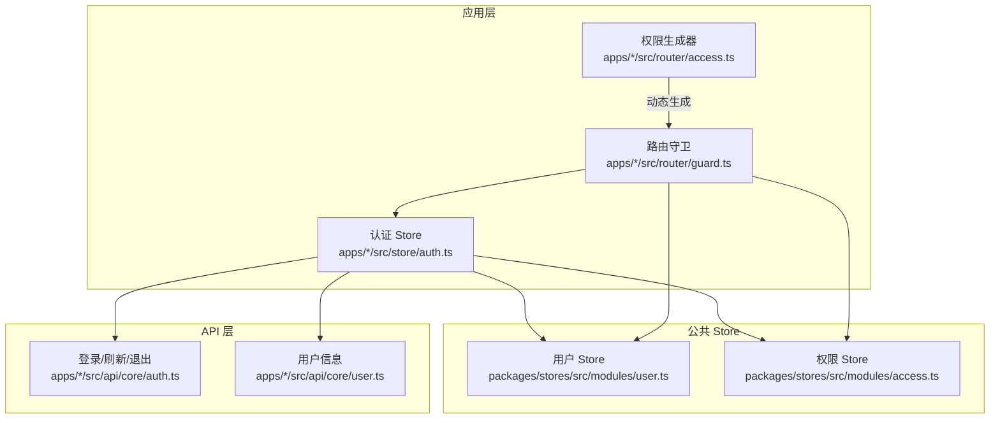
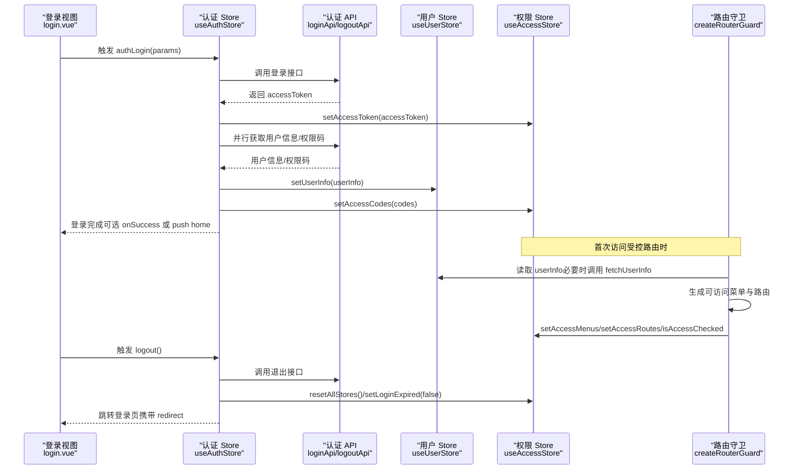
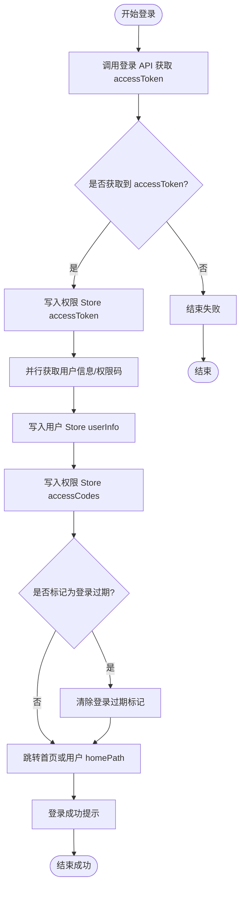
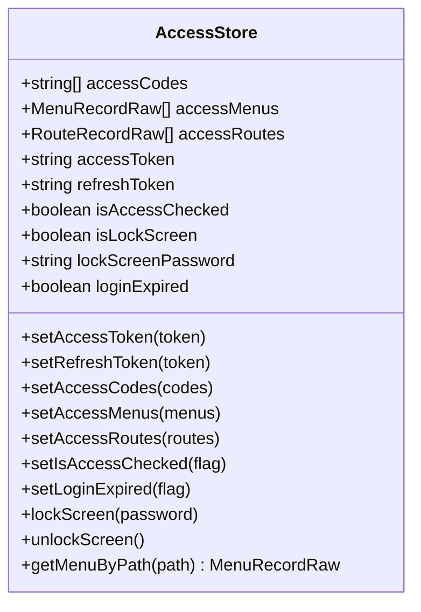
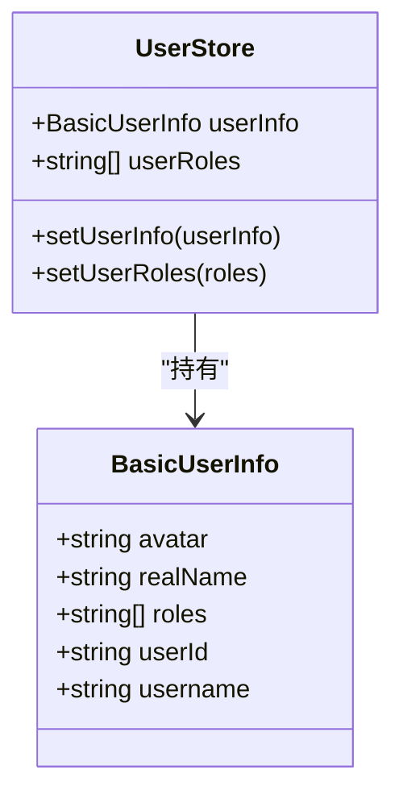
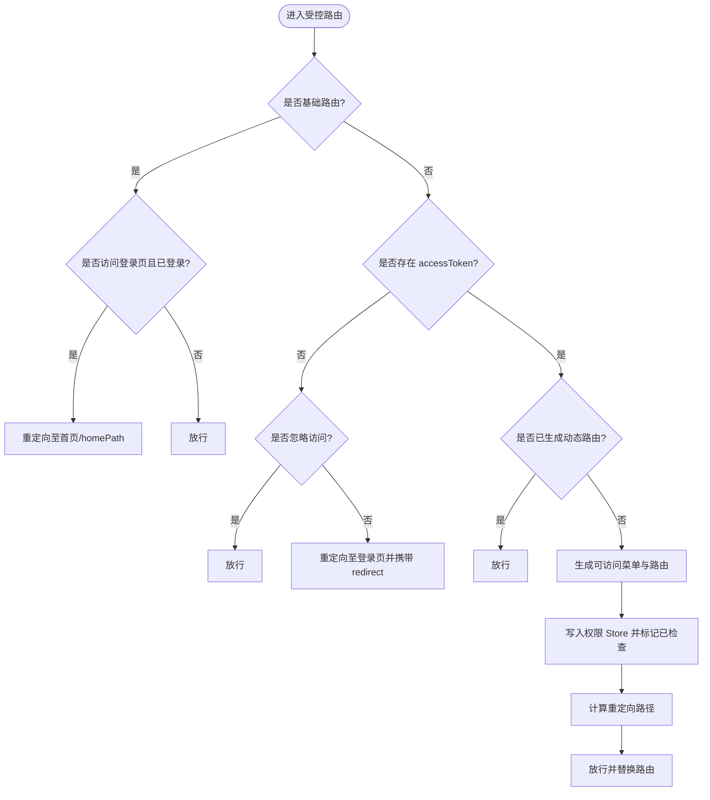
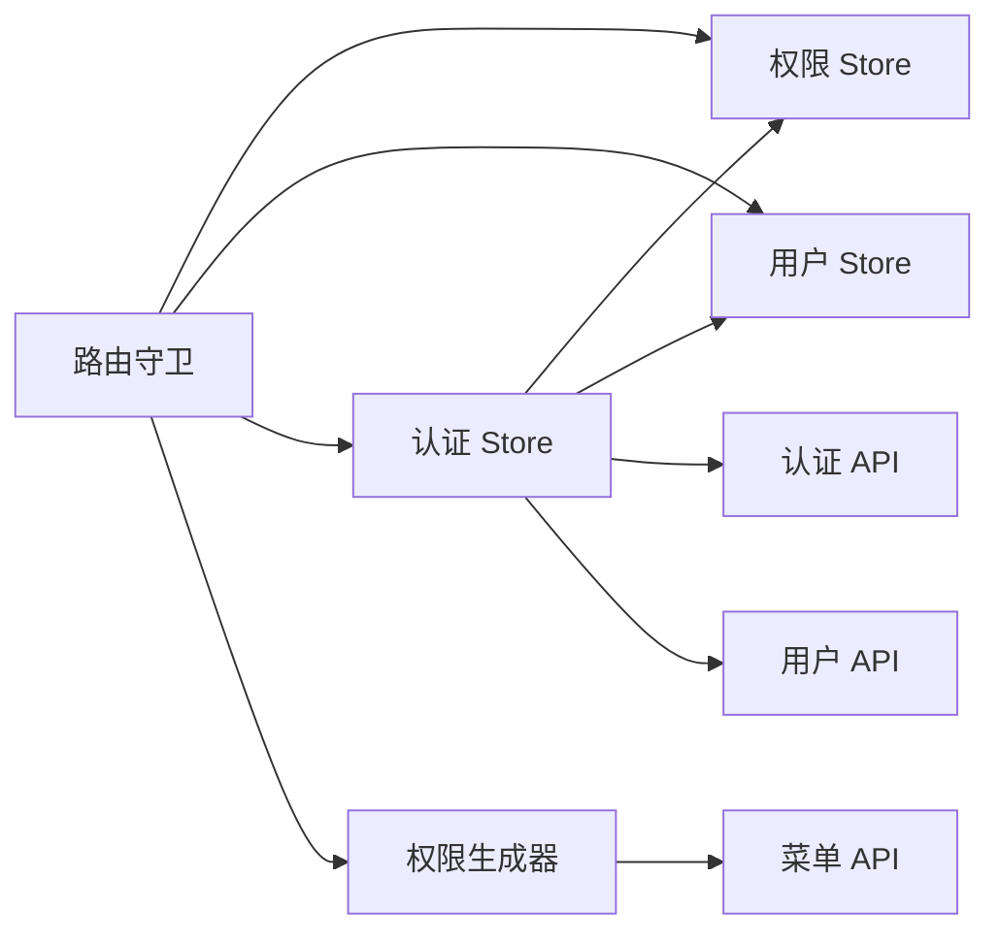

# 认证状态管理

<cite>
**本文引用的文件**
- [apps/web-naive/src/store/auth.ts](file://apps/web-naive/src/store/auth.ts)
- [playground/src/store/auth.ts](file://playground/src/store/auth.ts)
- [apps/web-naive/src/api/core/auth.ts](file://apps/web-naive/src/api/core/auth.ts)
- [playground/src/api/core/auth.ts](file://playground/src/api/core/auth.ts)
- [apps/web-naive/src/router/guard.ts](file://apps/web-naive/src/router/guard.ts)
- [playground/src/router/guard.ts](file://playground/src/router/guard.ts)
- [apps/web-naive/src/router/access.ts](file://apps/web-naive/src/router/access.ts)
- [playground/src/router/access.ts](file://playground/src/router/access.ts)
- [packages/stores/src/modules/access.ts](file://packages/stores/src/modules/access.ts)
- [packages/stores/src/modules/user.ts](file://packages/stores/src/modules/user.ts)
- [apps/web-naive/src/api/core/user.ts](file://apps/web-naive/src/api/core/user.ts)
- [apps/web-naive/src/views/_core/authentication/login.vue](file://apps/web-naive/src/views/_core/authentication/login.vue)
</cite>

## 目录

1. [简介](#简介)
2. [项目结构](#项目结构)
3. [核心组件](#核心组件)
4. [架构总览](#架构总览)
5. [详细组件分析](#详细组件分析)
6. [依赖关系分析](#依赖关系分析)
7. [性能考量](#性能考量)
8. [故障排查指南](#故障排查指南)
9. [结论](#结论)
10. [附录](#附录)

## 简介

本文件系统性梳理 shiyu-ui 项目的认证状态管理，覆盖以下关键主题：

- 认证状态的数据结构与存储：用户信息、登录状态、权限码、菜单与路由、锁屏与过期标记等
- 生命周期：从登录到登出的完整流程与路由守卫联动
- Token 管理：存储位置、刷新机制与失效处理策略
- 权限状态：角色权限、菜单权限与按钮级权限的存储与校验
- 安全考虑与最佳实践：避免死循环、防止敏感信息泄露、跨站会话安全等
- 实用示例：登录、登出、权限检查等常用操作的调用路径与注意事项

## 项目结构

认证相关能力由“应用层 Store + 路由守卫 + API 层 + 公共 Store（用户与权限）”协同完成：

- 应用层认证 Store：封装登录、登出、获取用户信息等业务逻辑
- 路由守卫：统一进行访问控制、动态路由生成与重定向
- API 层：提供登录、刷新、退出、权限码与用户信息等接口
- 公共 Store：集中管理用户信息、权限码、可访问菜单/路由、Token 等状态

图表来源

- [apps/web-naive/src/store/auth.ts:16-118](file://apps/web-naive/src/store/auth.ts#L16-L118)
- [apps/web-naive/src/router/guard.ts:47-118](file://apps/web-naive/src/router/guard.ts#L47-L118)
- [apps/web-naive/src/router/access.ts:16-38](file://apps/web-naive/src/router/access.ts#L16-L38)
- [packages/stores/src/modules/access.ts:51-123](file://packages/stores/src/modules/access.ts#L51-L123)
- [packages/stores/src/modules/user.ts:41-58](file://packages/stores/src/modules/user.ts#L41-L58)
- [apps/web-naive/src/api/core/auth.ts:24-51](file://apps/web-naive/src/api/core/auth.ts#L24-L51)
- [apps/web-naive/src/api/core/user.ts:8-10](file://apps/web-naive/src/api/core/user.ts#L8-L10)

章节来源

- [apps/web-naive/src/store/auth.ts:16-118](file://apps/web-naive/src/store/auth.ts#L16-L118)
- [apps/web-naive/src/router/guard.ts:47-118](file://apps/web-naive/src/router/guard.ts#L47-L118)
- [apps/web-naive/src/router/access.ts:16-38](file://apps/web-naive/src/router/access.ts#L16-L38)
- [packages/stores/src/modules/access.ts:51-123](file://packages/stores/src/modules/access.ts#L51-L123)
- [packages/stores/src/modules/user.ts:41-58](file://packages/stores/src/modules/user.ts#L41-L58)
- [apps/web-naive/src/api/core/auth.ts:24-51](file://apps/web-naive/src/api/core/auth.ts#L24-L51)
- [apps/web-naive/src/api/core/user.ts:8-10](file://apps/web-naive/src/api/core/user.ts#L8-L10)

## 核心组件

- 认证 Store（useAuthStore）
  - 职责：登录、登出、获取用户信息、登录状态指示
  - 关键方法：authLogin、logout、fetchUserInfo、loginLoading
  - 依赖：accessStore、userStore、router、API 层、通知与国际化
- 权限 Store（useAccessStore）
  - 职责：管理 accessToken、refreshToken、accessCodes、可访问菜单/路由、登录过期标记、锁屏状态
  - 持久化：pick 指定持久化字段（accessToken、refreshToken、accessCodes、isLockScreen、lockScreenPassword）
- 用户 Store（useUserStore）
  - 职责：管理 userInfo、userRoles，并在设置 userInfo 时同步 userRoles
- 路由守卫（createRouterGuard）
  - 职责：通用守卫与访问守卫；在首次访问受控路由时生成动态菜单与路由；处理未登录重定向与忽略访问路由
- 权限生成器（generateAccess）
  - 职责：根据角色与偏好模式生成可访问菜单与路由，支持 403 组件与布局映射

章节来源

- [apps/web-naive/src/store/auth.ts:16-118](file://apps/web-naive/src/store/auth.ts#L16-L118)
- [packages/stores/src/modules/access.ts:51-123](file://packages/stores/src/modules/access.ts#L51-L123)
- [packages/stores/src/modules/user.ts:41-58](file://packages/stores/src/modules/user.ts#L41-L58)
- [apps/web-naive/src/router/guard.ts:47-118](file://apps/web-naive/src/router/guard.ts#L47-L118)
- [apps/web-naive/src/router/access.ts:16-38](file://apps/web-naive/src/router/access.ts#L16-L38)

## 架构总览

认证状态管理采用“前端状态 + 后端接口 + 路由守卫”的协作模式：

- 登录成功后，服务端返回 accessToken，写入权限 Store 并触发用户信息与权限码拉取
- 路由守卫在首次访问受控路由时，基于用户角色生成动态菜单与路由
- 登出时清理所有 Store 并重定向至登录页，携带当前路由以便登录后回跳

图表来源

- [apps/web-naive/src/views/\_core/authentication/login.vue:14-98](file://apps/web-naive/src/views/_core/authentication/login.vue#L14-L98)
- [apps/web-naive/src/store/auth.ts:28-79](file://apps/web-naive/src/store/auth.ts#L28-L79)
- [apps/web-naive/src/api/core/auth.ts:24-51](file://apps/web-naive/src/api/core/auth.ts#L24-L51)
- [apps/web-naive/src/router/guard.ts:47-118](file://apps/web-naive/src/router/guard.ts#L47-L118)
- [packages/stores/src/modules/access.ts:51-123](file://packages/stores/src/modules/access.ts#L51-L123)
- [packages/stores/src/modules/user.ts:41-58](file://packages/stores/src/modules/user.ts#L41-L58)

## 详细组件分析

### 认证 Store（useAuthStore）

- 数据与状态
  - loginLoading：登录过程中的加载状态
  - 依赖 accessStore、userStore、router
- 关键流程
  - 登录：调用登录 API 获取 accessToken，写入权限 Store；并行拉取用户信息与权限码；设置用户信息与权限码；根据 homePath 或默认首页跳转；登录成功提示
  - 登出：调用退出 API（忽略异常）；重置所有 Store；清除登录过期标记；可选携带 redirect 参数跳转登录页
  - 获取用户信息：调用用户信息 API 并写入用户 Store
- 错误处理
  - 登录阶段捕获异常并恢复加载状态
  - 登出阶段忽略网络错误，保证登出流程继续
- 与路由守卫联动
  - 登录成功后，若已标记登录过期则清除标记；否则按用户 homePath 或默认首页跳转
  - 登出后通过路由替换携带 redirect，便于登录后回跳

图表来源

- [apps/web-naive/src/store/auth.ts:28-79](file://apps/web-naive/src/store/auth.ts#L28-L79)
- [apps/web-naive/src/api/core/auth.ts:24-51](file://apps/web-naive/src/api/core/auth.ts#L24-L51)
- [packages/stores/src/modules/access.ts:51-123](file://packages/stores/src/modules/access.ts#L51-L123)
- [packages/stores/src/modules/user.ts:41-58](file://packages/stores/src/modules/user.ts#L41-L58)

章节来源

- [apps/web-naive/src/store/auth.ts:16-118](file://apps/web-naive/src/store/auth.ts#L16-L118)
- [playground/src/store/auth.ts:16-126](file://playground/src/store/auth.ts#L16-L126)

### 权限 Store（useAccessStore）

- 数据结构
  - accessCodes：权限码数组
  - accessMenus：可访问菜单列表
  - accessRoutes：可访问路由列表
  - accessToken、refreshToken：登录与刷新 Token
  - isAccessChecked：是否已生成动态路由
  - isLockScreen、lockScreenPassword：锁屏状态与密码
  - loginExpired：登录是否过期
- 持久化策略
  - pick 指定持久化字段：accessToken、refreshToken、accessCodes、isLockScreen、lockScreenPassword
- 关键方法
  - setAccessToken、setRefreshToken、setAccessCodes、setAccessMenus、setAccessRoutes、setIsAccessChecked、setLoginExpired、lockScreen、unlockScreen、getMenuByPath

图表来源

- [packages/stores/src/modules/access.ts:51-123](file://packages/stores/src/modules/access.ts#L51-L123)

章节来源

- [packages/stores/src/modules/access.ts:51-123](file://packages/stores/src/modules/access.ts#L51-L123)

### 用户 Store（useUserStore）

- 数据结构
  - userInfo：用户基本信息（含头像、真实姓名、角色、userId、用户名等）
  - userRoles：用户角色数组
- 行为
  - setUserInfo：设置 userInfo 并同步 userRoles
  - setUserRoles：设置 userRoles

图表来源

- [packages/stores/src/modules/user.ts:41-58](file://packages/stores/src/modules/user.ts#L41-L58)

章节来源

- [packages/stores/src/modules/user.ts:41-58](file://packages/stores/src/modules/user.ts#L41-L58)

### 路由守卫（createRouterGuard）

- 通用守卫
  - 记录页面加载状态，按偏好开启/关闭进度条
- 访问守卫
  - 基础路由（coreRouteNames）不拦截；若已登录且访问登录页则重定向至首页或用户 homePath
  - 无 accessToken 且非忽略访问路由时，重定向至登录页并携带 redirect
  - 首次访问受控路由时，基于用户角色生成可访问菜单与路由，写入权限 Store，并按来源或目标路径计算重定向
- 与权限生成器协作
  - 通过 generateAccess 拉取菜单列表并生成路由/菜单

图表来源

- [apps/web-naive/src/router/guard.ts:47-118](file://apps/web-naive/src/router/guard.ts#L47-L118)
- [apps/web-naive/src/router/access.ts:16-38](file://apps/web-naive/src/router/access.ts#L16-L38)

章节来源

- [apps/web-naive/src/router/guard.ts:47-118](file://apps/web-naive/src/router/guard.ts#L47-L118)
- [playground/src/router/guard.ts:46-122](file://playground/src/router/guard.ts#L46-L122)

### 权限生成器（generateAccess）

- 功能
  - 基于偏好模式与角色生成可访问菜单与路由
  - 支持异步拉取菜单列表、403 组件、布局映射与页面映射
- 与路由守卫配合
  - 在首次访问受控路由时被调用，生成结果写入权限 Store

章节来源

- [apps/web-naive/src/router/access.ts:16-38](file://apps/web-naive/src/router/access.ts#L16-L38)
- [playground/src/router/access.ts:17-40](file://playground/src/router/access.ts#L17-L40)

### API 层（认证与用户）

- 登录/刷新/退出
  - loginApi：POST /auth/login，返回 accessToken
  - refreshTokenApi：POST /auth/refresh，用于刷新 accessToken（withCredentials）
  - logoutApi：POST /auth/logout，用于退出登录（withCredentials）
- 权限码与用户信息
  - getAccessCodesApi：GET /auth/codes，返回权限码数组
  - getUserInfoApi：GET /user/info，返回用户信息

章节来源

- [apps/web-naive/src/api/core/auth.ts:24-51](file://apps/web-naive/src/api/core/auth.ts#L24-L51)
- [playground/src/api/core/auth.ts:24-57](file://playground/src/api/core/auth.ts#L24-L57)
- [apps/web-naive/src/api/core/user.ts:8-10](file://apps/web-naive/src/api/core/user.ts#L8-L10)

### 登录视图（login.vue）

- 表单结构：账号选择、用户名、密码、滑动验证码
- 交互：绑定认证 Store 的 authLogin 方法，展示登录 Loading 状态
- 提交：通过事件触发认证 Store 执行登录流程

章节来源

- [apps/web-naive/src/views/\_core/authentication/login.vue:14-98](file://apps/web-naive/src/views/_core/authentication/login.vue#L14-L98)

## 依赖关系分析

- 认证 Store 依赖权限 Store、用户 Store、路由、API 层与本地化/通知
- 路由守卫依赖权限 Store、用户 Store、认证 Store 与权限生成器
- 权限生成器依赖菜单 API、布局映射与页面映射
- 权限 Store 与用户 Store 作为全局状态中心，被多处模块共享

图表来源

- [apps/web-naive/src/store/auth.ts:16-118](file://apps/web-naive/src/store/auth.ts#L16-L118)
- [apps/web-naive/src/router/guard.ts:47-118](file://apps/web-naive/src/router/guard.ts#L47-L118)
- [apps/web-naive/src/router/access.ts:16-38](file://apps/web-naive/src/router/access.ts#L16-L38)
- [packages/stores/src/modules/access.ts:51-123](file://packages/stores/src/modules/access.ts#L51-L123)
- [packages/stores/src/modules/user.ts:41-58](file://packages/stores/src/modules/user.ts#L41-L58)

章节来源

- [apps/web-naive/src/store/auth.ts:16-118](file://apps/web-naive/src/store/auth.ts#L16-L118)
- [apps/web-naive/src/router/guard.ts:47-118](file://apps/web-naive/src/router/guard.ts#L47-L118)
- [apps/web-naive/src/router/access.ts:16-38](file://apps/web-naive/src/router/access.ts#L16-L38)
- [packages/stores/src/modules/access.ts:51-123](file://packages/stores/src/modules/access.ts#L51-L123)
- [packages/stores/src/modules/user.ts:41-58](file://packages/stores/src/modules/user.ts#L41-L58)

## 性能考量

- 并行请求：登录成功后并行拉取用户信息与权限码，减少首屏等待时间
- 动态路由缓存：isAccessChecked 标记避免重复生成动态路由
- 进度条：通用守卫按偏好开启/关闭页面加载进度条，提升用户体验
- 持久化：权限 Store 对关键字段持久化，降低刷新后状态丢失带来的往返成本

## 故障排查指南

- 登录无响应
  - 检查登录 API 返回与 accessToken 写入；确认权限 Store 的 accessToken 已更新
  - 确认并行拉取用户信息与权限码是否成功
- 登录后仍被重定向至登录页
  - 检查路由守卫对 accessToken 的判断与 ignoreAccess 标记
  - 确认 isAccessChecked 是否正确标记为已生成
- 动态菜单不显示
  - 检查权限生成器是否成功拉取菜单列表
  - 确认权限 Store 的 accessMenus 与 accessRoutes 是否写入
- 登出后状态未清空
  - 确认 resetAllStores 是否被调用
  - 检查 setLoginExpired 是否被置为 false
- 重复登出导致死循环
  - playground 版本提供了 isLoggingOut 标志位防重复登出，建议参考实现

章节来源

- [apps/web-naive/src/router/guard.ts:47-118](file://apps/web-naive/src/router/guard.ts#L47-L118)
- [playground/src/router/guard.ts:83-107](file://playground/src/router/guard.ts#L83-L107)
- [playground/src/store/auth.ts:81-107](file://playground/src/store/auth.ts#L81-L107)

## 结论

本方案通过“认证 Store + 权限 Store + 路由守卫 + 权限生成器 + API 层”的分层设计，实现了清晰的认证状态管理与权限控制。登录/登出流程明确，动态路由生成高效，状态持久化合理。建议在生产环境中结合刷新 Token 机制与更严格的会话安全策略进一步完善。

## 附录

### 认证状态数据结构与存储要点

- 用户信息（userInfo）
  - 字段：头像、真实姓名、角色、用户 ID、用户名等
  - 来源：登录成功后并行拉取用户信息与权限码
  - 存储：用户 Store
- 登录状态与 Token
  - accessToken：登录成功后写入权限 Store
  - refreshToken：可选，用于刷新 accessToken
  - loginExpired：登录过期标记，登录成功后清除
  - 存储：权限 Store（持久化 pick 指定字段）
- 权限码（accessCodes）
  - 来源：登录成功后并行拉取
  - 存储：权限 Store
- 菜单与路由
  - accessMenus、accessRoutes：首次访问受控路由时生成
  - 存储：权限 Store
- 锁屏状态
  - isLockScreen、lockScreenPassword：权限 Store 管理

章节来源

- [packages/stores/src/modules/user.ts:41-58](file://packages/stores/src/modules/user.ts#L41-L58)
- [packages/stores/src/modules/access.ts:51-123](file://packages/stores/src/modules/access.ts#L51-L123)

### 认证生命周期（登录到登出）

- 登录
  - 输入用户名/密码与验证码
  - 调用登录 API 获取 accessToken
  - 写入权限 Store，同时并行拉取用户信息与权限码
  - 设置用户信息与权限码，按 homePath 或默认首页跳转
- 动态路由生成
  - 首次访问受控路由时，基于用户角色生成可访问菜单与路由
  - 写入权限 Store 并标记已检查
- 登出
  - 调用退出 API（忽略异常）
  - 重置所有 Store，清除登录过期标记
  - 跳转登录页并携带当前路由以便回跳

章节来源

- [apps/web-naive/src/store/auth.ts:28-79](file://apps/web-naive/src/store/auth.ts#L28-L79)
- [apps/web-naive/src/router/guard.ts:47-118](file://apps/web-naive/src/router/guard.ts#L47-L118)
- [apps/web-naive/src/router/access.ts:16-38](file://apps/web-naive/src/router/access.ts#L16-L38)

### Token 存储与刷新机制

- 存储位置
  - accessToken、refreshToken 写入权限 Store，并按 pick 持久化
- 刷新机制
  - 提供 refreshTokenApi 接口，支持 withCredentials
  - 登录成功后立即写入 accessToken，后续可根据需要调用刷新接口
- 失效处理
  - 路由守卫检测 accessToken 缺失时重定向登录页
  - 登出后清除登录过期标记，避免误判

章节来源

- [apps/web-naive/src/api/core/auth.ts:31-35](file://apps/web-naive/src/api/core/auth.ts#L31-L35)
- [packages/stores/src/modules/access.ts:102-111](file://packages/stores/src/modules/access.ts#L102-L111)
- [apps/web-naive/src/router/guard.ts:65-86](file://apps/web-naive/src/router/guard.ts#L65-L86)

### 权限状态管理（角色、菜单、按钮）

- 角色权限
  - 用户信息包含 roles，路由守卫基于角色生成可访问菜单与路由
- 菜单权限
  - 通过权限生成器拉取菜单列表并写入 accessMenus
- 按钮权限
  - 权限码 accessCodes 可用于按钮级权限校验（例如在组件中读取权限码并决定显示/隐藏）

章节来源

- [packages/stores/src/modules/user.ts:41-58](file://packages/stores/src/modules/user.ts#L41-L58)
- [apps/web-naive/src/router/access.ts:16-38](file://apps/web-naive/src/router/access.ts#L16-L38)
- [packages/stores/src/modules/access.ts:51-123](file://packages/stores/src/modules/access.ts#L51-L123)

### 常用操作示例（调用路径）

- 登录
  - 触发：登录视图绑定的提交事件
  - 调用：认证 Store 的 authLogin
  - 流程：登录 API → 写入 accessToken → 并行获取用户信息/权限码 → 设置用户与权限 → 跳转首页
  - 参考路径：[apps/web-naive/src/views/\_core/authentication/login.vue:94-97](file://apps/web-naive/src/views/_core/authentication/login.vue#L94-L97)，[apps/web-naive/src/store/auth.ts:28-79](file://apps/web-naive/src/store/auth.ts#L28-L79)
- 登出
  - 触发：任意登出入口
  - 调用：认证 Store 的 logout
  - 流程：退出 API → 重置所有 Store → 清除登录过期标记 → 跳转登录页（携带 redirect）
  - 参考路径：[apps/web-naive/src/store/auth.ts:81-99](file://apps/web-naive/src/store/auth.ts#L81-L99)
- 权限检查
  - 角色/菜单：路由守卫首次访问时生成并写入权限 Store
  - 按钮：读取权限 Store 的 accessCodes 进行校验
  - 参考路径：[apps/web-naive/src/router/guard.ts:92-108](file://apps/web-naive/src/router/guard.ts#L92-L108)，[packages/stores/src/modules/access.ts:51-123](file://packages/stores/src/modules/access.ts#L51-L123)

### 安全考虑与最佳实践

- 防止死循环
  - 登出流程中增加标志位（如 isLoggingOut），避免重复登出导致的循环
  - 参考路径：[playground/src/store/auth.ts:81-107](file://playground/src/store/auth.ts#L81-L107)
- 会话安全
  - 使用 withCredentials 传递 Cookie/凭证，确保刷新与退出接口的会话一致性
  - 参考路径：[apps/web-naive/src/api/core/auth.ts:32-43](file://apps/web-naive/src/api/core/auth.ts#L32-L43)
- 敏感信息保护
  - 仅在权限 Store 中持久化必要字段，避免持久化敏感数据
  - 参考路径：[packages/stores/src/modules/access.ts:102-111](file://packages/stores/src/modules/access.ts#L102-L111)
- 403 与菜单可见性
  - 对于“菜单可见但禁止访问”的场景，使用权限生成器提供的 forbidden 组件与菜单可见配置
  - 参考路径：[apps/web-naive/src/router/access.ts:32-37](file://apps/web-naive/src/router/access.ts#L32-L37)
