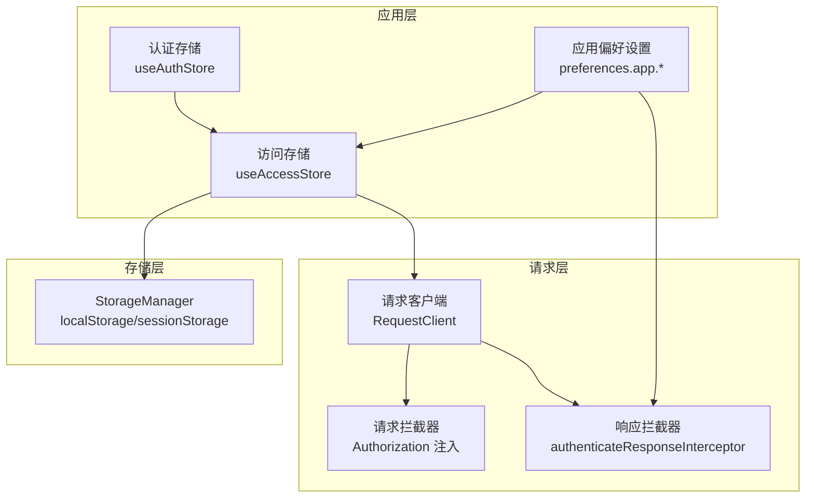
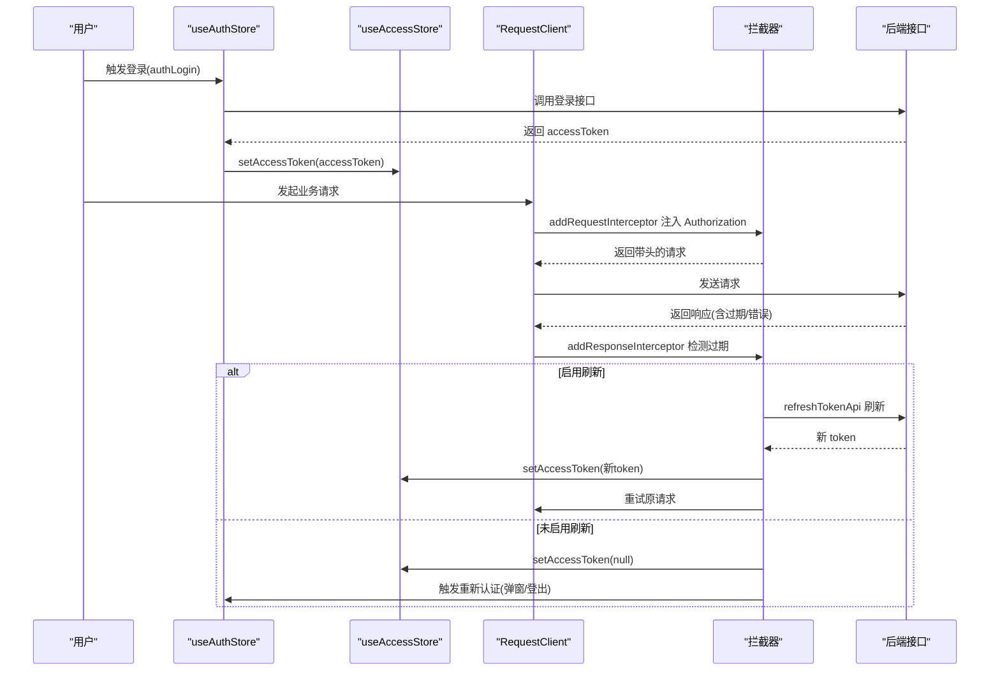
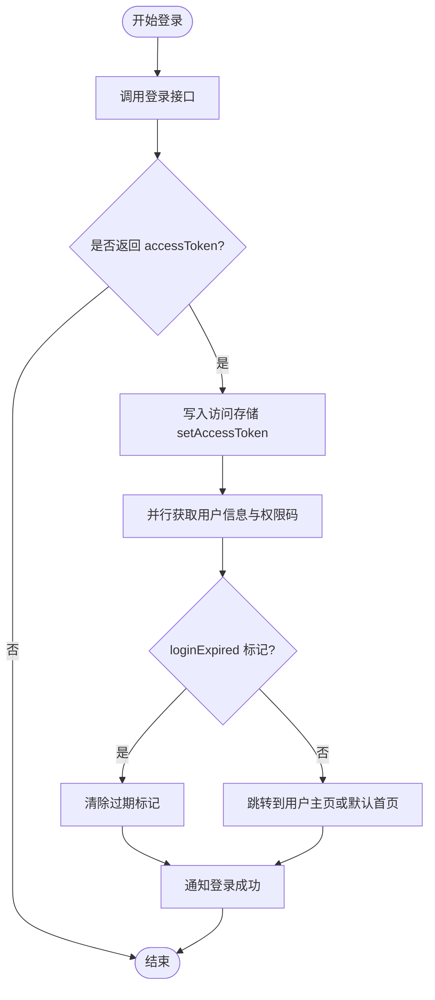
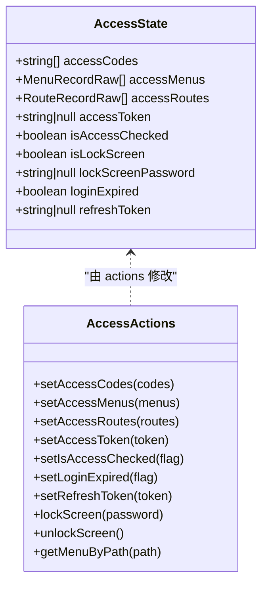
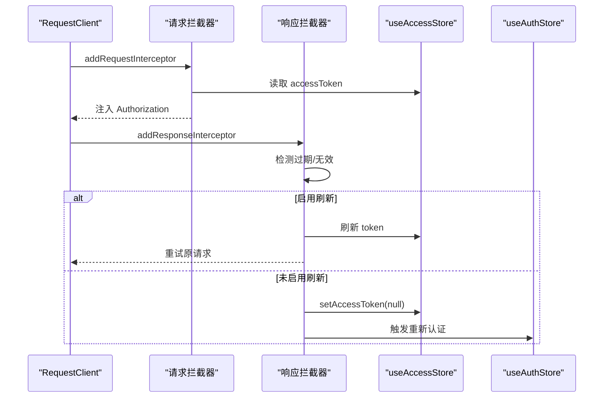
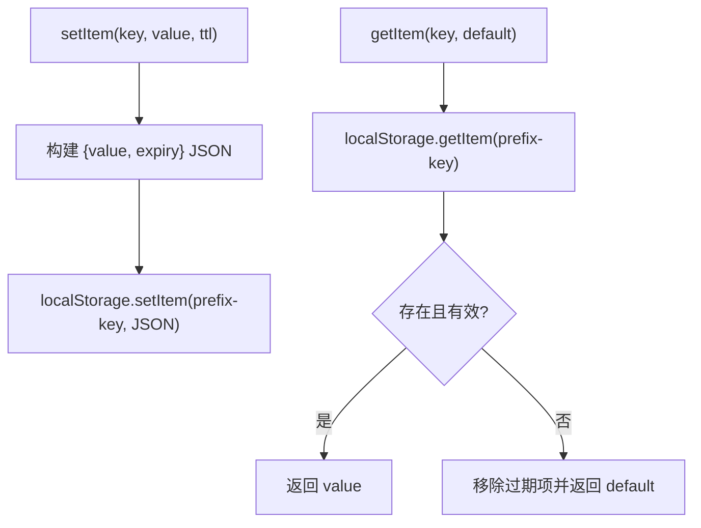
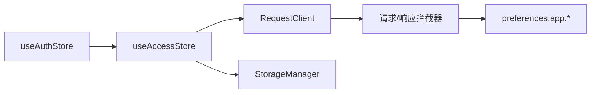

# 令牌管理

<cite>
**本文引用的文件**
- [apps/web-naive/src/api/request.ts](file://apps/web-naive/src/api/request.ts)
- [playground/src/api/request.ts](file://playground/src/api/request.ts)
- [apps/web-naive/src/store/auth.ts](file://apps/web-naive/src/store/auth.ts)
- [playground/src/store/auth.ts](file://playground/src/store/auth.ts)
- [packages/stores/src/modules/access.ts](file://packages/stores/src/modules/access.ts)
- [packages/@core/base/shared/src/cache/storage-manager.ts](file://packages/@core/base/shared/src/cache/storage-manager.ts)
- [packages/@core/base/shared/src/cache/types.ts](file://packages/@core/base/shared/src/cache/types.ts)
- [packages/@core/preferences/src/types.ts](file://packages/@core/preferences/src/types.ts)
- [apps/web-naive/src/router/access.ts](file://apps/web-naive/src/router/access.ts)
- [playground/src/router/access.ts](file://playground/src/router/access.ts)
</cite>

## 目录

1. [引言](#引言)
2. [项目结构](#项目结构)
3. [核心组件](#核心组件)
4. [架构总览](#架构总览)
5. [详细组件分析](#详细组件分析)
6. [依赖关系分析](#依赖关系分析)
7. [性能考量](#性能考量)
8. [故障排查指南](#故障排查指南)
9. [结论](#结论)
10. [附录](#附录)

## 引言

本文件系统性梳理 shiyu-ui 项目的令牌管理机制，覆盖访问令牌的生命周期：获取、存储、刷新与失效处理；在不同存储介质中的策略选择；令牌验证（请求头注入、自动刷新、过期检测）；以及安全机制（加密、传输安全、存储保护）。同时提供可定位的代码路径、配置项说明、常见问题与调试方法，帮助开发者快速理解与优化令牌管理。

## 项目结构

围绕令牌管理的关键模块分布于以下位置：

- 请求层：封装统一的请求客户端与拦截器，负责请求头注入、响应拦截与自动刷新/重新认证。
- 存储层：Pinia Store 管理访问令牌与刷新令牌，并支持持久化；底层提供带过期控制的存储工具类。
- 配置层：应用偏好设置包含“启用刷新令牌”“登录过期模式”等关键开关。
- 路由层：生成可访问菜单与路由，受权限与令牌状态影响。

图表来源

- [apps/web-naive/src/api/request.ts:23-107](file://apps/web-naive/src/api/request.ts#L23-L107)
- [playground/src/api/request.ts:26-122](file://playground/src/api/request.ts#L26-L122)
- [packages/stores/src/modules/access.ts:51-123](file://packages/stores/src/modules/access.ts#L51-L123)
- [packages/@core/base/shared/src/cache/storage-manager.ts:13-116](file://packages/@core/base/shared/src/cache/storage-manager.ts#L13-L116)
- [packages/@core/preferences/src/types.ts:138-153](file://packages/@core/preferences/src/types.ts#L138-L153)

章节来源

- [apps/web-naive/src/api/request.ts:23-107](file://apps/web-naive/src/api/request.ts#L23-L107)
- [playground/src/api/request.ts:26-122](file://playground/src/api/request.ts#L26-L122)
- [packages/stores/src/modules/access.ts:51-123](file://packages/stores/src/modules/access.ts#L51-L123)
- [packages/@core/base/shared/src/cache/storage-manager.ts:13-116](file://packages/@core/base/shared/src/cache/storage-manager.ts#L13-L116)
- [packages/@core/preferences/src/types.ts:138-153](file://packages/@core/preferences/src/types.ts#L138-L153)

## 核心组件

- 认证存储 useAuthStore：负责登录流程、获取 accessToken、拉取用户信息与权限码、登出清理。
- 访问存储 useAccessStore：持有 accessToken、refreshToken、登录过期标记、权限码/菜单/路由等；支持持久化 pick。
- 请求客户端与拦截器：统一注入 Authorization 头；基于响应拦截器实现自动刷新与重新认证。
- StorageManager：提供带前缀与过期控制的 localStorage/sessionStorage 封装，用于令牌持久化与清理。

章节来源

- [apps/web-naive/src/store/auth.ts:16-118](file://apps/web-naive/src/store/auth.ts#L16-L118)
- [playground/src/store/auth.ts:16-126](file://playground/src/store/auth.ts#L16-L126)
- [packages/stores/src/modules/access.ts:51-123](file://packages/stores/src/modules/access.ts#L51-L123)
- [apps/web-naive/src/api/request.ts:23-107](file://apps/web-naive/src/api/request.ts#L23-L107)
- [playground/src/api/request.ts:26-122](file://playground/src/api/request.ts#L26-L122)
- [packages/@core/base/shared/src/cache/storage-manager.ts:13-116](file://packages/@core/base/shared/src/cache/storage-manager.ts#L13-L116)

## 架构总览

下图展示令牌从登录到请求调用的全链路：登录成功后写入访问存储，后续请求通过拦截器注入 Authorization，响应拦截器检测过期并触发刷新或重新认证。

图表来源

- [apps/web-naive/src/store/auth.ts:28-79](file://apps/web-naive/src/store/auth.ts#L28-L79)
- [playground/src/store/auth.ts:29-78](file://playground/src/store/auth.ts#L29-L78)
- [packages/stores/src/modules/access.ts:85-96](file://packages/stores/src/modules/access.ts#L85-L96)
- [apps/web-naive/src/api/request.ts:47-92](file://apps/web-naive/src/api/request.ts#L47-L92)
- [playground/src/api/request.ts:63-107](file://playground/src/api/request.ts#L63-L107)

## 详细组件分析

### 组件一：认证与登录流程（useAuthStore）

- 登录入口：接收表单参数，调用登录接口，成功后写入 accessToken 至访问存储，并并行拉取用户信息与权限码。
- 登出入口：尝试调用后端登出接口，随后重置所有 store 并跳转登录页，携带当前路由以便登录后回跳。
- 成功提示与路由跳转：登录成功后根据用户主页或默认首页进行路由跳转。

图表来源

- [apps/web-naive/src/store/auth.ts:28-79](file://apps/web-naive/src/store/auth.ts#L28-L79)
- [playground/src/store/auth.ts:29-78](file://playground/src/store/auth.ts#L29-L78)

章节来源

- [apps/web-naive/src/store/auth.ts:28-118](file://apps/web-naive/src/store/auth.ts#L28-L118)
- [playground/src/store/auth.ts:29-126](file://playground/src/store/auth.ts#L29-L126)

### 组件二：访问存储与持久化（useAccessStore）

- 状态字段：accessToken、refreshToken、accessCodes、isAccessChecked、loginExpired、isLockScreen 等。
- 持久化策略：通过 persist pick 仅持久化 accessToken、refreshToken、权限码与锁屏相关状态，避免敏感信息泄露。
- 关键动作：setAccessToken、setRefreshToken、setLoginExpired 等。

图表来源

- [packages/stores/src/modules/access.ts:9-46](file://packages/stores/src/modules/access.ts#L9-L46)
- [packages/stores/src/modules/access.ts:52-101](file://packages/stores/src/modules/access.ts#L52-L101)

章节来源

- [packages/stores/src/modules/access.ts:51-123](file://packages/stores/src/modules/access.ts#L51-L123)

### 组件三：请求客户端与拦截器（RequestClient + Interceptors）

- 请求头注入：在请求拦截器中读取访问存储中的 accessToken，并拼接为标准 Bearer 头。
- 响应拦截：使用 authenticateResponseInterceptor 检测过期/无效，按配置决定刷新或重新认证。
- 自动刷新：当启用刷新令牌时，调用刷新接口获取新 token 并写回存储，随后重试原请求。
- 重新认证：当无法刷新或配置为弹窗模式且已校验权限时，设置登录过期标记；否则触发登出。
- 错误处理：通用错误拦截器统一提取后端错误消息并提示。

图表来源

- [apps/web-naive/src/api/request.ts:47-92](file://apps/web-naive/src/api/request.ts#L47-L92)
- [playground/src/api/request.ts:63-107](file://playground/src/api/request.ts#L63-L107)
- [packages/stores/src/modules/access.ts:85-96](file://packages/stores/src/modules/access.ts#L85-L96)

章节来源

- [apps/web-naive/src/api/request.ts:23-107](file://apps/web-naive/src/api/request.ts#L23-L107)
- [playground/src/api/request.ts:26-122](file://playground/src/api/request.ts#L26-L122)

### 组件四：令牌存储与过期控制（StorageManager）

- 存储介质：支持 localStorage 与 sessionStorage，可通过构造参数切换。
- 前缀隔离：所有键带统一前缀，便于批量清理与避免冲突。
- 过期控制：setItem 支持传入 TTL（毫秒），getItem 在访问时自动判断过期并移除。
- 批量清理：clear 清空带前缀的所有条目；clearExpiredItems 主动扫描并清理过期项。

图表来源

- [packages/@core/base/shared/src/cache/storage-manager.ts:61-80](file://packages/@core/base/shared/src/cache/storage-manager.ts#L61-L80)
- [packages/@core/base/shared/src/cache/storage-manager.ts:97-106](file://packages/@core/base/shared/src/cache/storage-manager.ts#L97-L106)

章节来源

- [packages/@core/base/shared/src/cache/storage-manager.ts:13-116](file://packages/@core/base/shared/src/cache/storage-manager.ts#L13-L116)
- [packages/@core/base/shared/src/cache/types.ts:1-17](file://packages/@core/base/shared/src/cache/types.ts#L1-L17)

### 组件五：路由与权限（generateAccessible）

- 菜单与路由生成：根据访问模式异步拉取菜单列表，结合布局映射与禁止组件生成可访问的菜单与路由。
- 权限约束：在路由生成阶段即受权限与令牌状态影响，避免无权访问。

章节来源

- [apps/web-naive/src/router/access.ts:16-40](file://apps/web-naive/src/router/access.ts#L16-L40)
- [playground/src/router/access.ts:17-42](file://playground/src/router/access.ts#L17-L42)

## 依赖关系分析

- useAuthStore 依赖 useAccessStore 与用户/权限 API，完成登录后的状态初始化与路由跳转。
- useAccessStore 作为令牌与权限的核心载体，被请求拦截器读取以注入 Authorization。
- 请求拦截器依赖 preferences.app.enableRefreshToken 与 loginExpiredMode 控制刷新与重新认证行为。
- StorageManager 为令牌持久化提供基础能力，但当前访问存储的持久化策略由 Pinia 的 persist 配置承担。

图表来源

- [apps/web-naive/src/store/auth.ts:17-41](file://apps/web-naive/src/store/auth.ts#L17-L41)
- [packages/stores/src/modules/access.ts:51-123](file://packages/stores/src/modules/access.ts#L51-L123)
- [apps/web-naive/src/api/request.ts:23-107](file://apps/web-naive/src/api/request.ts#L23-L107)
- [packages/@core/preferences/src/types.ts:138-153](file://packages/@core/preferences/src/types.ts#L138-L153)
- [packages/@core/base/shared/src/cache/storage-manager.ts:13-26](file://packages/@core/base/shared/src/cache/storage-manager.ts#L13-L26)

章节来源

- [packages/stores/src/modules/access.ts:102-111](file://packages/stores/src/modules/access.ts#L102-L111)
- [packages/@core/preferences/src/types.ts:138-153](file://packages/@core/preferences/src/types.ts#L138-L153)

## 性能考量

- 请求头注入为轻量操作，对每次请求开销极小。
- 自动刷新仅在响应拦截器中触发，避免重复网络往返；建议后端返回明确的过期/无效状态码以便精准识别。
- 批量清理过期项可在应用启动或定时任务中执行，减少存储膨胀。
- 使用 sessionStorage 可降低跨标签页共享风险，但会随会话结束而丢失；localStorage 适合需要跨会话保持的场景。

## 故障排查指南

- 令牌未注入 Authorization
  - 检查请求拦截器是否正确读取访问存储中的 accessToken。
  - 确认访问存储中是否存在有效的 accessToken。
  - 参考路径：[apps/web-naive/src/api/request.ts:63-71](file://apps/web-naive/src/api/request.ts#L63-L71)、[playground/src/api/request.ts:77-86](file://playground/src/api/request.ts#L77-L86)
- 刷新失败或循环刷新
  - 检查响应拦截器的刷新逻辑与后端刷新接口返回值。
  - 确认刷新开关 enableRefreshToken 是否开启。
  - 参考路径：[apps/web-naive/src/api/request.ts:83-92](file://apps/web-naive/src/api/request.ts#L83-L92)、[playground/src/api/request.ts:98-107](file://playground/src/api/request.ts#L98-L107)
- 登录过期弹窗未出现
  - 检查登录过期模式 loginExpiredMode 与 isAccessChecked 标记。
  - 参考路径：[apps/web-naive/src/api/request.ts:37-45](file://apps/web-naive/src/api/request.ts#L37-L45)、[playground/src/api/request.ts:52-60](file://playground/src/api/request.ts#L52-L60)
- 登出后仍可访问受保护资源
  - 确认登出流程是否调用了后端登出接口并重置了所有 store。
  - 参考路径：[apps/web-naive/src/store/auth.ts:81-99](file://apps/web-naive/src/store/auth.ts#L81-L99)、[playground/src/store/auth.ts:83-107](file://playground/src/store/auth.ts#L83-L107)
- 存储异常或过期项未清理
  - 使用 StorageManager 的 clearExpiredItems 或在应用启动时主动清理。
  - 参考路径：[packages/@core/base/shared/src/cache/storage-manager.ts:45-53](file://packages/@core/base/shared/src/cache/storage-manager.ts#L45-L53)

## 结论

本项目采用“Pinia Store + 请求拦截器 + 偏好配置”的组合实现令牌生命周期管理：登录获取、存储持久化、请求注入、过期检测与自动刷新/重新认证。通过明确的配置项与清晰的模块边界，既保证了安全性，也兼顾了易用性与可维护性。建议在生产环境中配合 HTTPS、严格的 CORS 策略与最小权限原则，进一步强化令牌安全。

## 附录

### 配置项与开关

- enableRefreshToken：是否启用刷新令牌，默认位于应用偏好设置中。
- loginExpiredMode：登录过期模式，支持弹窗或直接登出。
- persist.pick：访问存储持久化字段集合，包含 accessToken、refreshToken、权限码与锁屏状态。

章节来源

- [packages/@core/preferences/src/types.ts:138-153](file://packages/@core/preferences/src/types.ts#L138-L153)
- [packages/stores/src/modules/access.ts:102-111](file://packages/stores/src/modules/access.ts#L102-L111)
