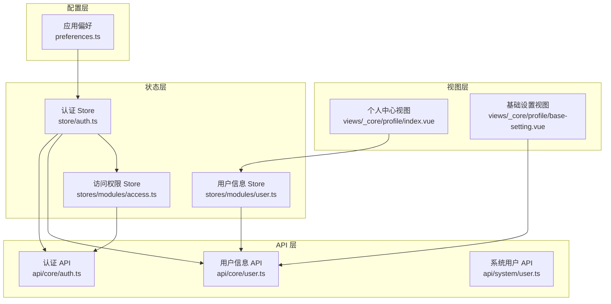
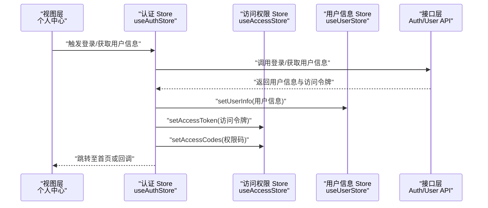
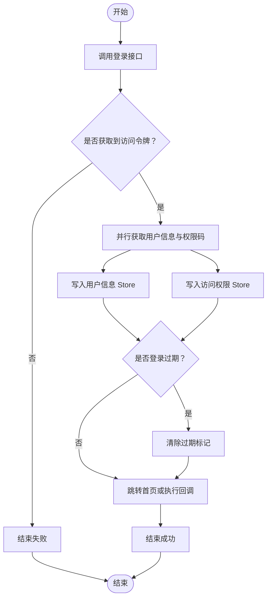
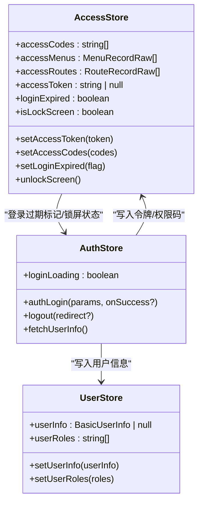
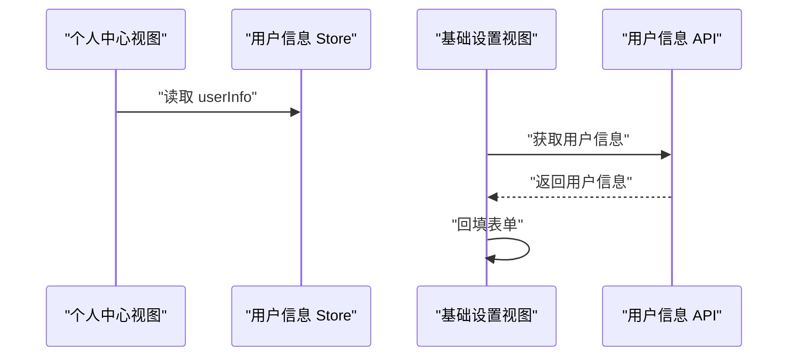
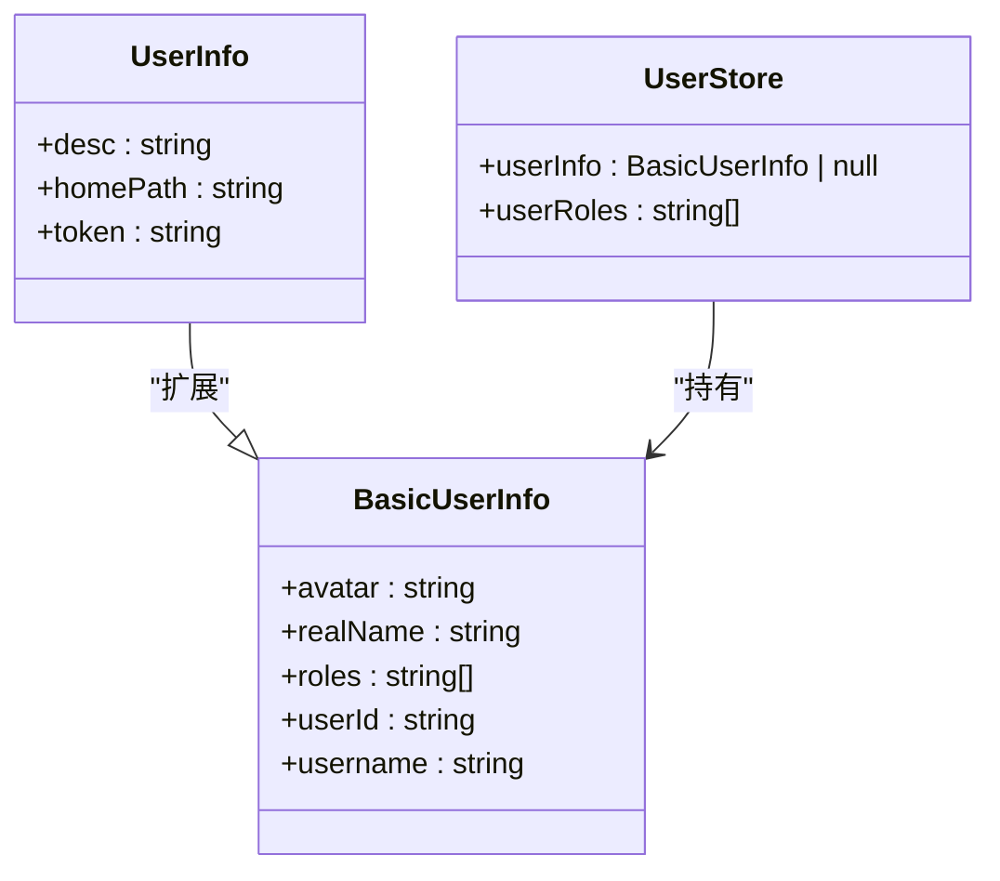
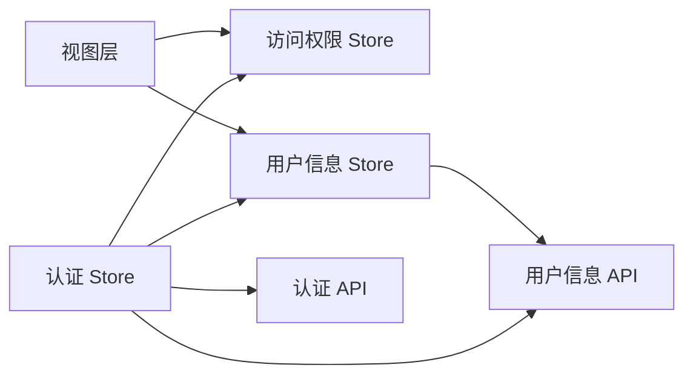

# 用户信息管理

<cite>
**本文引用的文件**
- [apps/web-naive/src/store/auth.ts](file://apps/web-naive/src/store/auth.ts)
- [packages/stores/src/modules/user.ts](file://packages/stores/src/modules/user.ts)
- [packages/stores/src/modules/access.ts](file://packages/stores/src/modules/access.ts)
- [packages/types/src/user.ts](file://packages/types/src/user.ts)
- [apps/web-naive/src/api/core/auth.ts](file://apps/web-naive/src/api/core/auth.ts)
- [apps/web-naive/src/api/core/user.ts](file://apps/web-naive/src/api/core/user.ts)
- [apps/web-naive/src/api/system/user.ts](file://apps/web-naive/src/api/system/user.ts)
- [apps/web-naive/src/views/_core/profile/index.vue](file://apps/web-naive/src/views/_core/profile/index.vue)
- [apps/web-naive/src/views/_core/profile/base-setting.vue](file://apps/web-naive/src/views/_core/profile/base-setting.vue)
- [apps/web-naive/src/preferences.ts](file://apps/web-naive/src/preferences.ts)
</cite>

## 目录

1. [引言](#引言)
2. [项目结构](#项目结构)
3. [核心组件](#核心组件)
4. [架构总览](#架构总览)
5. [详细组件分析](#详细组件分析)
6. [依赖关系分析](#依赖关系分析)
7. [性能考量](#性能考量)
8. [故障排查指南](#故障排查指南)
9. [结论](#结论)
10. [附录](#附录)

## 引言

本文件面向 shiyu-ui 的用户信息管理场景，系统性说明用户信息的获取、存储与更新机制，涵盖基本信息、角色权限与个性化设置；阐述状态管理中的缓存、同步策略与更新通知；解释跨组件传递与共享方式；给出权限控制与数据安全要点；提供可定位的代码示例路径与配置项；并包含格式化展示与多语言支持建议及常见问题排查思路。

## 项目结构

围绕用户信息管理的关键目录与文件如下：

- 状态层：Pinia Store（用户信息与访问权限）
- API 层：认证与用户信息接口
- 视图层：个人中心页面与其子设置页
- 配置层：应用偏好（含访问模式、登录过期处理等）

**图表来源**

- [apps/web-naive/src/views/\_core/profile/index.vue:1-50](file://apps/web-naive/src/views/_core/profile/index.vue#L1-L50)
- [apps/web-naive/src/views/\_core/profile/base-setting.vue:1-66](file://apps/web-naive/src/views/_core/profile/base-setting.vue#L1-L66)
- [packages/stores/src/modules/user.ts:1-65](file://packages/stores/src/modules/user.ts#L1-L65)
- [packages/stores/src/modules/access.ts:1-130](file://packages/stores/src/modules/access.ts#L1-L130)
- [apps/web-naive/src/store/auth.ts:1-119](file://apps/web-naive/src/store/auth.ts#L1-L119)
- [apps/web-naive/src/api/core/auth.ts:1-52](file://apps/web-naive/src/api/core/auth.ts#L1-L52)
- [apps/web-naive/src/api/core/user.ts:1-11](file://apps/web-naive/src/api/core/user.ts#L1-L11)
- [apps/web-naive/src/api/system/user.ts:1-99](file://apps/web-naive/src/api/system/user.ts#L1-L99)
- [apps/web-naive/src/preferences.ts:1-17](file://apps/web-naive/src/preferences.ts#L1-L17)

**章节来源**

- [apps/web-naive/src/views/\_core/profile/index.vue:1-50](file://apps/web-naive/src/views/_core/profile/index.vue#L1-L50)
- [apps/web-naive/src/views/\_core/profile/base-setting.vue:1-66](file://apps/web-naive/src/views/_core/profile/base-setting.vue#L1-L66)
- [packages/stores/src/modules/user.ts:1-65](file://packages/stores/src/modules/user.ts#L1-L65)
- [packages/stores/src/modules/access.ts:1-130](file://packages/stores/src/modules/access.ts#L1-L130)
- [apps/web-naive/src/store/auth.ts:1-119](file://apps/web-naive/src/store/auth.ts#L1-L119)
- [apps/web-naive/src/api/core/auth.ts:1-52](file://apps/web-naive/src/api/core/auth.ts#L1-L52)
- [apps/web-naive/src/api/core/user.ts:1-11](file://apps/web-naive/src/api/core/user.ts#L1-L11)
- [apps/web-naive/src/api/system/user.ts:1-99](file://apps/web-naive/src/api/system/user.ts#L1-L99)
- [apps/web-naive/src/preferences.ts:1-17](file://apps/web-naive/src/preferences.ts#L1-L17)

## 核心组件

- 用户信息 Store（useUserStore）
  - 负责保存用户基本信息（头像、真实姓名、用户名、用户ID、角色等）与用户角色列表
  - 提供设置用户信息与角色的方法
- 访问权限 Store（useAccessStore）
  - 维护访问令牌、刷新令牌、权限码、可访问菜单与路由、登录过期标记、锁屏状态等
  - 支持持久化部分字段（如令牌、权限码、锁屏状态）
- 认证 Store（useAuthStore）
  - 实现登录、登出、获取用户信息、拉取权限码等流程
  - 登录成功后并行获取用户信息与权限码，并写入对应 Store
  - 登录成功后根据用户首页路径或默认首页跳转
- 用户信息 API
  - 提供获取用户信息的接口封装
- 认证 API
  - 提供登录、刷新令牌、退出登录、获取权限码等接口封装
- 系统用户 API
  - 提供用户列表、创建、更新、删除、重置密码等接口封装
- 个人中心视图
  - 通过用户信息 Store 注入用户信息，承载基础设置、安全设置、密码设置、通知设置等子页

**章节来源**

- [packages/stores/src/modules/user.ts:41-58](file://packages/stores/src/modules/user.ts#L41-L58)
- [packages/stores/src/modules/access.ts:51-123](file://packages/stores/src/modules/access.ts#L51-L123)
- [apps/web-naive/src/store/auth.ts:16-118](file://apps/web-naive/src/store/auth.ts#L16-L118)
- [apps/web-naive/src/api/core/user.ts:8-10](file://apps/web-naive/src/api/core/user.ts#L8-L10)
- [apps/web-naive/src/api/core/auth.ts:24-51](file://apps/web-naive/src/api/core/auth.ts#L24-L51)
- [apps/web-naive/src/api/system/user.ts:33-98](file://apps/web-naive/src/api/system/user.ts#L33-L98)
- [apps/web-naive/src/views/\_core/profile/index.vue:1-50](file://apps/web-naive/src/views/_core/profile/index.vue#L1-L50)

## 架构总览

用户信息管理采用“视图-状态-接口”三层协作：

- 视图层负责展示与交互（个人中心及其子设置页）
- 状态层负责数据持久化与共享（Pinia Store）
- 接口层负责与后端通信（统一请求客户端封装）

**图表来源**

- [apps/web-naive/src/store/auth.ts:28-79](file://apps/web-naive/src/store/auth.ts#L28-L79)
- [packages/stores/src/modules/user.ts:42-52](file://packages/stores/src/modules/user.ts#L42-L52)
- [packages/stores/src/modules/access.ts:76-96](file://packages/stores/src/modules/access.ts#L76-L96)
- [apps/web-naive/src/api/core/auth.ts:24-51](file://apps/web-naive/src/api/core/auth.ts#L24-L51)
- [apps/web-naive/src/api/core/user.ts:8-10](file://apps/web-naive/src/api/core/user.ts#L8-L10)

## 详细组件分析

### 用户信息获取与更新流程

- 登录阶段
  - 调用登录接口获取访问令牌
  - 并行拉取用户信息与权限码，分别写入用户信息 Store 与访问权限 Store
  - 登录成功后根据用户首页路径或默认首页进行路由跳转
- 信息刷新
  - 在需要时调用获取用户信息接口，更新用户信息 Store
- 基础设置页
  - 页面挂载时调用获取用户信息接口，回填表单

**图表来源**

- [apps/web-naive/src/store/auth.ts:28-79](file://apps/web-naive/src/store/auth.ts#L28-L79)
- [packages/stores/src/modules/user.ts:42-52](file://packages/stores/src/modules/user.ts#L42-L52)
- [packages/stores/src/modules/access.ts:76-96](file://packages/stores/src/modules/access.ts#L76-L96)

**章节来源**

- [apps/web-naive/src/store/auth.ts:28-79](file://apps/web-naive/src/store/auth.ts#L28-L79)
- [apps/web-naive/src/views/\_core/profile/base-setting.vue:58-61](file://apps/web-naive/src/views/_core/profile/base-setting.vue#L58-L61)

### 用户信息状态管理与缓存

- 用户信息缓存
  - 用户信息 Store 保存用户基本信息与角色列表，作为前端缓存
- 权限与令牌缓存
  - 访问权限 Store 持久化访问令牌、刷新令牌、权限码、锁屏状态等关键字段
- 同步策略
  - 登录成功后并行拉取用户信息与权限码，保证状态一致性
  - 退出登录时重置所有 Store，并清除登录过期标记
- 更新通知
  - 用户信息变更通过 Store 的响应式更新通知到订阅组件
  - 登录成功后通过通知组件提示用户

**图表来源**

- [packages/stores/src/modules/user.ts:41-58](file://packages/stores/src/modules/user.ts#L41-L58)
- [packages/stores/src/modules/access.ts:51-123](file://packages/stores/src/modules/access.ts#L51-L123)
- [apps/web-naive/src/store/auth.ts:16-118](file://apps/web-naive/src/store/auth.ts#L16-L118)

**章节来源**

- [packages/stores/src/modules/user.ts:41-58](file://packages/stores/src/modules/user.ts#L41-L58)
- [packages/stores/src/modules/access.ts:102-111](file://packages/stores/src/modules/access.ts#L102-L111)
- [apps/web-naive/src/store/auth.ts:81-99](file://apps/web-naive/src/store/auth.ts#L81-L99)

### 权限控制与数据安全

- 访问模式与登录过期处理
  - 应用偏好中定义访问模式与登录过期处理方式（页面级过期）
- 令牌管理
  - 访问权限 Store 维护访问令牌与刷新令牌，支持持久化
- 权限码与菜单/路由生成
  - 通过权限码构建可访问菜单与路由，用于前端路由守卫与菜单渲染
- 安全退出
  - 退出登录时调用后端接口并重置所有 Store，确保敏感状态被清理

**章节来源**

- [apps/web-naive/src/preferences.ts:8-16](file://apps/web-naive/src/preferences.ts#L8-L16)
- [packages/stores/src/modules/access.ts:76-96](file://packages/stores/src/modules/access.ts#L76-L96)
- [apps/web-naive/src/api/core/auth.ts:40-44](file://apps/web-naive/src/api/core/auth.ts#L40-L44)
- [apps/web-naive/src/store/auth.ts:81-99](file://apps/web-naive/src/store/auth.ts#L81-L99)

### 跨组件传递与共享

- 个人中心视图通过用户信息 Store 注入用户信息，作为只读数据源
- 基础设置页在挂载时主动拉取用户信息以回填表单
- 认证 Store 在登录成功后将用户信息写入 Store，供全局组件订阅

**图表来源**

- [apps/web-naive/src/views/\_core/profile/index.vue:36-48](file://apps/web-naive/src/views/_core/profile/index.vue#L36-L48)
- [apps/web-naive/src/views/\_core/profile/base-setting.vue:58-61](file://apps/web-naive/src/views/_core/profile/base-setting.vue#L58-L61)
- [apps/web-naive/src/api/core/user.ts:8-10](file://apps/web-naive/src/api/core/user.ts#L8-L10)

**章节来源**

- [apps/web-naive/src/views/\_core/profile/index.vue:12-48](file://apps/web-naive/src/views/_core/profile/index.vue#L12-L48)
- [apps/web-naive/src/views/\_core/profile/base-setting.vue:58-61](file://apps/web-naive/src/views/_core/profile/base-setting.vue#L58-L61)

### 数据模型与类型

- 用户信息类型扩展自基础用户信息，包含描述、首页路径与令牌
- 用户信息 Store 的状态包含用户信息与用户角色列表

**图表来源**

- [packages/types/src/user.ts:4-18](file://packages/types/src/user.ts#L4-L18)
- [packages/stores/src/modules/user.ts:3-25](file://packages/stores/src/modules/user.ts#L3-L25)
- [packages/stores/src/modules/user.ts:54-57](file://packages/stores/src/modules/user.ts#L54-L57)

**章节来源**

- [packages/types/src/user.ts:4-18](file://packages/types/src/user.ts#L4-L18)
- [packages/stores/src/modules/user.ts:3-25](file://packages/stores/src/modules/user.ts#L3-L25)
- [packages/stores/src/modules/user.ts:54-57](file://packages/stores/src/modules/user.ts#L54-L57)

### 个性化设置与系统用户管理

- 个人中心包含基础设置、安全设置、密码设置、通知设置等模块
- 系统用户管理提供用户列表、创建、更新、删除、重置密码等能力

**章节来源**

- [apps/web-naive/src/views/\_core/profile/index.vue:16-33](file://apps/web-naive/src/views/_core/profile/index.vue#L16-L33)
- [apps/web-naive/src/api/system/user.ts:33-98](file://apps/web-naive/src/api/system/user.ts#L33-L98)

## 依赖关系分析

- 认证 Store 依赖访问权限 Store 与用户信息 Store，并调用认证与用户信息 API
- 用户信息 Store 与访问权限 Store 互不直接依赖，通过认证 Store 协调
- 视图层通过 Pinia Store 订阅状态变化，避免直接依赖 API

**图表来源**

- [apps/web-naive/src/store/auth.ts:16-118](file://apps/web-naive/src/store/auth.ts#L16-L118)
- [packages/stores/src/modules/user.ts:41-58](file://packages/stores/src/modules/user.ts#L41-L58)
- [packages/stores/src/modules/access.ts:51-123](file://packages/stores/src/modules/access.ts#L51-L123)
- [apps/web-naive/src/api/core/auth.ts:24-51](file://apps/web-naive/src/api/core/auth.ts#L24-L51)
- [apps/web-naive/src/api/core/user.ts:8-10](file://apps/web-naive/src/api/core/user.ts#L8-L10)

**章节来源**

- [apps/web-naive/src/store/auth.ts:16-118](file://apps/web-naive/src/store/auth.ts#L16-L118)
- [packages/stores/src/modules/user.ts:41-58](file://packages/stores/src/modules/user.ts#L41-L58)
- [packages/stores/src/modules/access.ts:51-123](file://packages/stores/src/modules/access.ts#L51-L123)

## 性能考量

- 并行拉取：登录成功后并行获取用户信息与权限码，减少等待时间
- 缓存复用：用户信息与令牌持久化于 Store，避免重复请求
- 按需刷新：仅在必要时调用获取用户信息接口，降低网络开销
- 路由跳转：登录成功后直接跳转至目标路径，减少中间态渲染

[本节为通用指导，无需列出章节来源]

## 故障排查指南

- 登录后未显示用户信息
  - 检查登录流程是否正确写入用户信息 Store
  - 确认并行拉取用户信息与权限码是否均成功
  - 参考：[apps/web-naive/src/store/auth.ts:44-52](file://apps/web-naive/src/store/auth.ts#L44-L52)
- 退出登录后状态未清理
  - 确认是否调用了重置所有 Store 与清除登录过期标记
  - 参考：[apps/web-naive/src/store/auth.ts:87-89](file://apps/web-naive/src/store/auth.ts#L87-L89)
- 个人信息页无法回填
  - 确认页面挂载时已调用获取用户信息接口并回填表单
  - 参考：[apps/web-naive/src/views/\_core/profile/base-setting.vue:58-61](file://apps/web-naive/src/views/_core/profile/base-setting.vue#L58-L61)
- 权限码未生效
  - 检查访问权限 Store 是否正确写入权限码
  - 参考：[packages/stores/src/modules/access.ts:76-78](file://packages/stores/src/modules/access.ts#L76-L78)
- 登录过期处理异常
  - 检查应用偏好中的登录过期模式与处理逻辑
  - 参考：[apps/web-naive/src/preferences.ts:10-15](file://apps/web-naive/src/preferences.ts#L10-L15)

**章节来源**

- [apps/web-naive/src/store/auth.ts:44-52](file://apps/web-naive/src/store/auth.ts#L44-L52)
- [apps/web-naive/src/store/auth.ts:87-89](file://apps/web-naive/src/store/auth.ts#L87-L89)
- [apps/web-naive/src/views/\_core/profile/base-setting.vue:58-61](file://apps/web-naive/src/views/_core/profile/base-setting.vue#L58-L61)
- [packages/stores/src/modules/access.ts:76-78](file://packages/stores/src/modules/access.ts#L76-L78)
- [apps/web-naive/src/preferences.ts:10-15](file://apps/web-naive/src/preferences.ts#L10-L15)

## 结论

本方案通过 Pinia Store 实现用户信息与权限状态的集中管理，结合并行拉取与持久化策略提升用户体验；通过认证 Store 协调登录、令牌与权限码的流转；通过视图层按需消费 Store 状态实现高效的数据展示与交互。配合应用偏好与接口层，形成从获取、存储、更新到展示与安全的完整闭环。

[本节为总结性内容，无需列出章节来源]

## 附录

### 代码示例与配置选项定位

- 登录与用户信息获取
  - [apps/web-naive/src/store/auth.ts:28-79](file://apps/web-naive/src/store/auth.ts#L28-L79)
  - [apps/web-naive/src/api/core/auth.ts:24-26](file://apps/web-naive/src/api/core/auth.ts#L24-L26)
  - [apps/web-naive/src/api/core/user.ts:8-10](file://apps/web-naive/src/api/core/user.ts#L8-L10)
- 用户信息与权限 Store
  - [packages/stores/src/modules/user.ts:41-58](file://packages/stores/src/modules/user.ts#L41-L58)
  - [packages/stores/src/modules/access.ts:51-123](file://packages/stores/src/modules/access.ts#L51-L123)
- 个人中心与基础设置
  - [apps/web-naive/src/views/\_core/profile/index.vue:36-48](file://apps/web-naive/src/views/_core/profile/index.vue#L36-L48)
  - [apps/web-naive/src/views/\_core/profile/base-setting.vue:58-61](file://apps/web-naive/src/views/_core/profile/base-setting.vue#L58-L61)
- 应用偏好（访问模式、登录过期处理）
  - [apps/web-naive/src/preferences.ts:8-16](file://apps/web-naive/src/preferences.ts#L8-L16)

### 多语言与格式化展示建议

- 多语言
  - 使用国际化适配器在登录成功通知中动态切换语言
  - 参考：[apps/web-naive/src/store/auth.ts:64-70](file://apps/web-naive/src/store/auth.ts#L64-L70)
- 格式化展示
  - 在视图层对用户信息进行本地化格式化（日期、枚举值等），避免在 Store 中引入 UI 逻辑

[本节为通用指导，无需列出章节来源]
