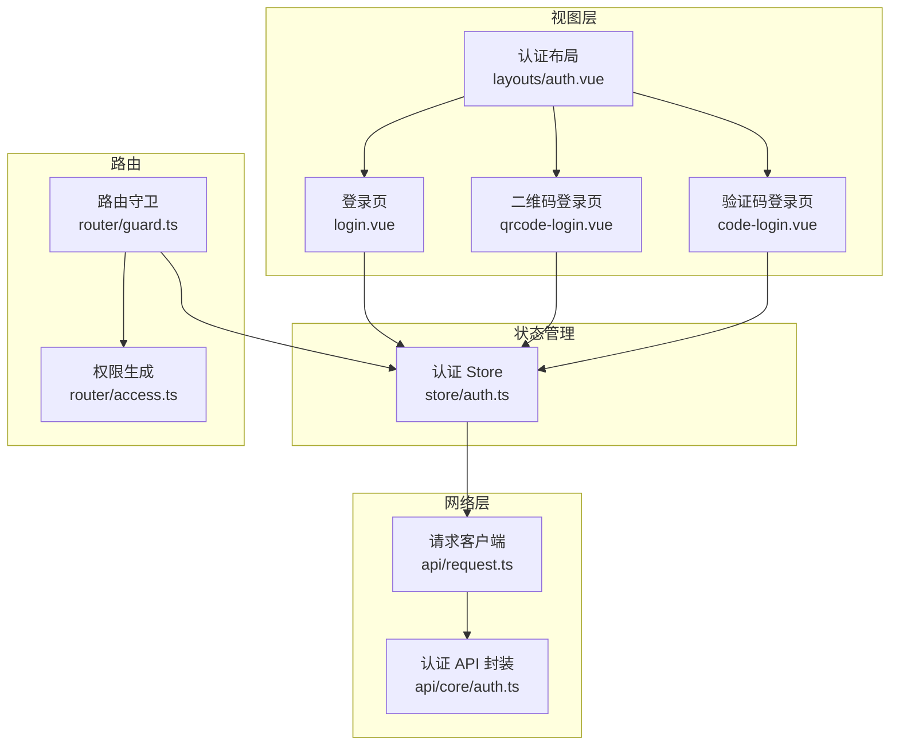
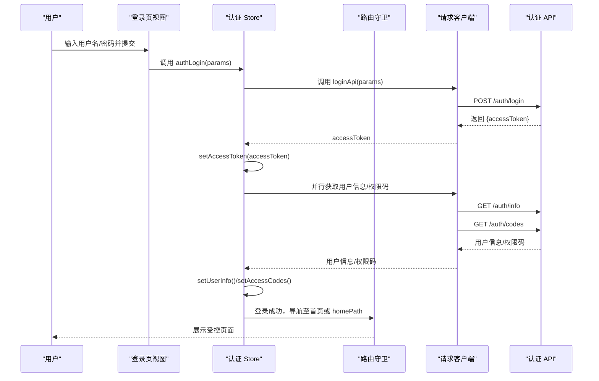
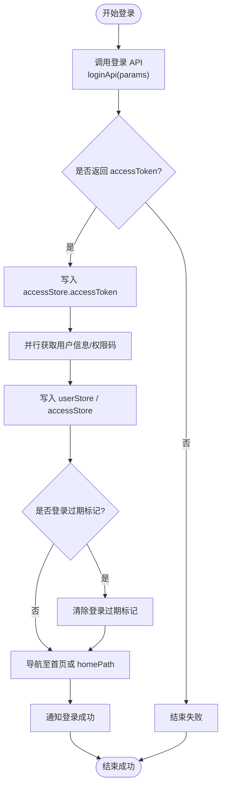
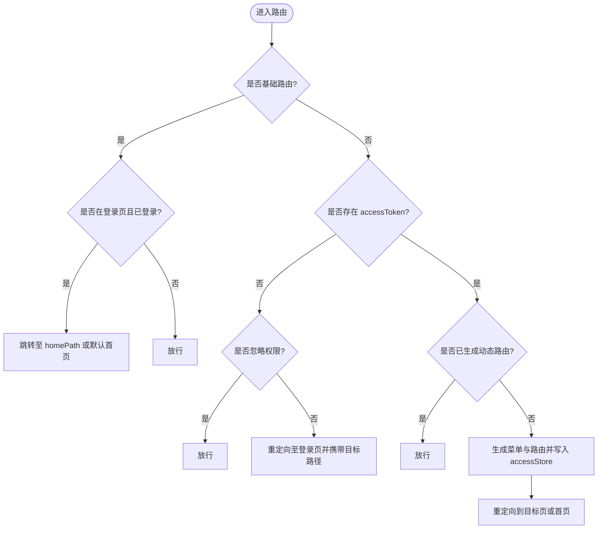
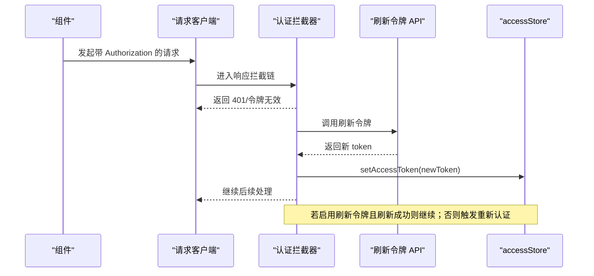
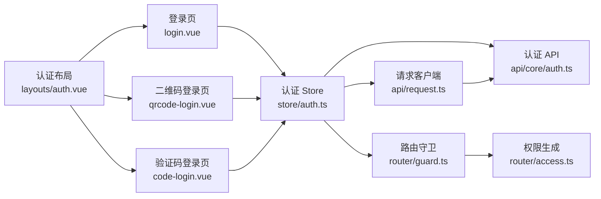

# 用户认证系统

<cite>
**本文引用的文件**
- [apps/web-naive/src/store/auth.ts](file://apps/web-naive/src/store/auth.ts)
- [apps/web-naive/src/router/guard.ts](file://apps/web-naive/src/router/guard.ts)
- [apps/web-naive/src/api/core/auth.ts](file://apps/web-naive/src/api/core/auth.ts)
- [apps/web-naive/src/api/request.ts](file://apps/web-naive/src/api/request.ts)
- [apps/web-naive/src/views/_core/authentication/login.vue](file://apps/web-naive/src/views/_core/authentication/login.vue)
- [apps/web-naive/src/views/_core/authentication/qrcode-login.vue](file://apps/web-naive/src/views/_core/authentication/qrcode-login.vue)
- [apps/web-naive/src/views/_core/authentication/code-login.vue](file://apps/web-naive/src/views/_core/authentication/code-login.vue)
- [apps/web-naive/src/router/access.ts](file://apps/web-naive/src/router/access.ts)
- [apps/web-naive/src/layouts/auth.vue](file://apps/web-naive/src/layouts/auth.vue)
</cite>

## 目录

1. [简介](#简介)
2. [项目结构](#项目结构)
3. [核心组件](#核心组件)
4. [架构总览](#架构总览)
5. [详细组件分析](#详细组件分析)
6. [依赖关系分析](#依赖关系分析)
7. [性能与安全考量](#性能与安全考量)
8. [故障排查指南](#故障排查指南)
9. [结论](#结论)
10. [附录：认证相关接口规范](#附录认证相关接口规范)

## 简介

本文件面向 shiyu-ui 项目的“用户认证系统”，系统性阐述认证流程设计与实现，覆盖登录、登出、令牌管理与会话控制；详解认证状态管理（用户信息存储、权限缓存与状态同步）；说明多登录方式支持（用户名密码、二维码、验证码）；解释认证守卫的工作原理与安全机制；给出认证相关 API 的接口规范、请求参数、响应格式与错误处理；并提供常见问题排查与最佳实践建议。

## 项目结构

认证系统主要由以下模块构成：

- 视图层：登录页、二维码登录页、验证码登录页
- 路由守卫：通用守卫与权限访问守卫
- 状态管理：认证状态、用户信息、权限码与路由生成
- 网络层：统一请求客户端、响应拦截器、刷新与重新认证逻辑
- 布局层：认证专用布局容器

图表来源

- [apps/web-naive/src/views/\_core/authentication/login.vue:1-99](file://apps/web-naive/src/views/_core/authentication/login.vue#L1-L99)
- [apps/web-naive/src/views/\_core/authentication/qrcode-login.vue:1-11](file://apps/web-naive/src/views/_core/authentication/qrcode-login.vue#L1-L11)
- [apps/web-naive/src/views/\_core/authentication/code-login.vue:1-69](file://apps/web-naive/src/views/_core/authentication/code-login.vue#L1-L69)
- [apps/web-naive/src/layouts/auth.vue:1-26](file://apps/web-naive/src/layouts/auth.vue#L1-L26)
- [apps/web-naive/src/store/auth.ts:1-119](file://apps/web-naive/src/store/auth.ts#L1-L119)
- [apps/web-naive/src/router/guard.ts:1-133](file://apps/web-naive/src/router/guard.ts#L1-L133)
- [apps/web-naive/src/router/access.ts:1-41](file://apps/web-naive/src/router/access.ts#L1-L41)
- [apps/web-naive/src/api/request.ts:1-114](file://apps/web-naive/src/api/request.ts#L1-L114)
- [apps/web-naive/src/api/core/auth.ts:1-52](file://apps/web-naive/src/api/core/auth.ts#L1-L52)

章节来源

- [apps/web-naive/src/views/\_core/authentication/login.vue:1-99](file://apps/web-naive/src/views/_core/authentication/login.vue#L1-L99)
- [apps/web-naive/src/views/\_core/authentication/qrcode-login.vue:1-11](file://apps/web-naive/src/views/_core/authentication/qrcode-login.vue#L1-L11)
- [apps/web-naive/src/views/\_core/authentication/code-login.vue:1-69](file://apps/web-naive/src/views/_core/authentication/code-login.vue#L1-L69)
- [apps/web-naive/src/layouts/auth.vue:1-26](file://apps/web-naive/src/layouts/auth.vue#L1-L26)
- [apps/web-naive/src/store/auth.ts:1-119](file://apps/web-naive/src/store/auth.ts#L1-L119)
- [apps/web-naive/src/router/guard.ts:1-133](file://apps/web-naive/src/router/guard.ts#L1-L133)
- [apps/web-naive/src/router/access.ts:1-41](file://apps/web-naive/src/router/access.ts#L1-L41)
- [apps/web-naive/src/api/request.ts:1-114](file://apps/web-naive/src/api/request.ts#L1-L114)
- [apps/web-naive/src/api/core/auth.ts:1-52](file://apps/web-naive/src/api/core/auth.ts#L1-L52)

## 核心组件

- 认证 Store（useAuthStore）
  - 负责登录、登出、用户信息拉取与状态同步
  - 维护登录加载态、调用认证 API 并写入 accessStore 与 userStore
- 路由守卫（createRouterGuard）
  - 通用守卫：页面切换进度条、已加载页面标记
  - 权限守卫：未登录或无权限时重定向至登录页；首次登录后生成动态路由与菜单
- 请求客户端（requestClient/baseRequestClient）
  - 注入 Authorization 头
  - 统一响应格式与错误提示
  - 集成刷新令牌与重新认证逻辑
- 认证 API 封装
  - 登录、刷新令牌、登出、获取权限码
- 视图层
  - 登录页：用户名/密码 + 滑动验证码
  - 二维码登录页：扫码登录入口
  - 验证码登录页：手机号+短信验证码登录（占位）

章节来源

- [apps/web-naive/src/store/auth.ts:16-119](file://apps/web-naive/src/store/auth.ts#L16-L119)
- [apps/web-naive/src/router/guard.ts:47-119](file://apps/web-naive/src/router/guard.ts#L47-L119)
- [apps/web-naive/src/api/request.ts:23-107](file://apps/web-naive/src/api/request.ts#L23-L107)
- [apps/web-naive/src/api/core/auth.ts:21-52](file://apps/web-naive/src/api/core/auth.ts#L21-L52)
- [apps/web-naive/src/views/\_core/authentication/login.vue:31-89](file://apps/web-naive/src/views/_core/authentication/login.vue#L31-L89)
- [apps/web-naive/src/views/\_core/authentication/qrcode-login.vue:8-10](file://apps/web-naive/src/views/_core/authentication/qrcode-login.vue#L8-L10)
- [apps/web-naive/src/views/\_core/authentication/code-login.vue:15-69](file://apps/web-naive/src/views/_core/authentication/code-login.vue#L15-L69)

## 架构总览

认证系统采用“视图-状态-路由-网络”分层架构，围绕 Pinia Store 管理认证状态，Vue Router 守卫控制访问，@vben/request 客户端统一处理请求与响应，形成闭环。

图表来源

- [apps/web-naive/src/views/\_core/authentication/login.vue:92-98](file://apps/web-naive/src/views/_core/authentication/login.vue#L92-L98)
- [apps/web-naive/src/store/auth.ts:28-79](file://apps/web-naive/src/store/auth.ts#L28-L79)
- [apps/web-naive/src/api/core/auth.ts:24-26](file://apps/web-naive/src/api/core/auth.ts#L24-L26)
- [apps/web-naive/src/api/request.ts:63-71](file://apps/web-naive/src/api/request.ts#L63-L71)
- [apps/web-naive/src/router/guard.ts:94-117](file://apps/web-naive/src/router/guard.ts#L94-L117)

## 详细组件分析

### 认证 Store（状态管理与登录流程）

- 主要职责
  - 登录：调用登录 API，设置 accessToken，拉取用户信息与权限码，写入对应 Store，并导航
  - 登出：调用登出 API，重置所有 Store，清除登录过期标记，跳转登录页并携带当前路径
  - 用户信息：统一拉取并写入 userStore
  - 加载态：loginLoading 控制登录按钮状态
- 关键点
  - 使用 Promise.all 并行获取用户信息与权限码，提升首屏体验
  - 登录成功后若检测到登录过期标记则清除此标记，避免重复弹窗
  - 成功后通过路由 push 导航，优先使用用户 homePath，否则使用默认首页

图表来源

- [apps/web-naive/src/store/auth.ts:28-79](file://apps/web-naive/src/store/auth.ts#L28-L79)
- [apps/web-naive/src/store/auth.ts:81-99](file://apps/web-naive/src/store/auth.ts#L81-L99)

章节来源

- [apps/web-naive/src/store/auth.ts:16-119](file://apps/web-naive/src/store/auth.ts#L16-L119)

### 路由守卫（权限与访问控制）

- 通用守卫
  - 标记页面是否已加载，按需开启/关闭进度条
- 权限守卫
  - 对基础路由放行；对非基础路由检查 accessToken
  - 无 token 且未声明忽略权限时，重定向至登录页并携带目标路径
  - 已有 token 但未生成动态路由时，基于用户角色生成菜单与路由，写入 accessStore，并重定向到目标页或首页
  - 若在登录页且已有 token，自动跳转至用户 homePath 或默认首页

图表来源

- [apps/web-naive/src/router/guard.ts:47-119](file://apps/web-naive/src/router/guard.ts#L47-L119)
- [apps/web-naive/src/router/access.ts:16-38](file://apps/web-naive/src/router/access.ts#L16-L38)

章节来源

- [apps/web-naive/src/router/guard.ts:17-119](file://apps/web-naive/src/router/guard.ts#L17-L119)
- [apps/web-naive/src/router/access.ts:16-38](file://apps/web-naive/src/router/access.ts#L16-L38)

### 请求客户端与令牌管理

- 请求头注入
  - 在请求拦截器中将 Authorization 设置为 Bearer accessToken
  - 同时注入 Accept-Language
- 响应拦截器
  - 默认响应格式化：code/data/successCode
  - 认证响应拦截器：处理 token 过期与刷新
  - 通用错误拦截器：提取后端错误消息并提示
- 刷新与重新认证
  - 支持启用/禁用刷新令牌模式
  - 刷新成功后更新 accessToken
  - 刷新失败或无效时触发重新认证：清空 accessToken，按配置决定弹窗或直接登出

图表来源

- [apps/web-naive/src/api/request.ts:63-71](file://apps/web-naive/src/api/request.ts#L63-L71)
- [apps/web-naive/src/api/request.ts:82-92](file://apps/web-naive/src/api/request.ts#L82-L92)
- [apps/web-naive/src/api/request.ts:50-56](file://apps/web-naive/src/api/request.ts#L50-L56)
- [apps/web-naive/src/api/core/auth.ts:31-35](file://apps/web-naive/src/api/core/auth.ts#L31-L35)

章节来源

- [apps/web-naive/src/api/request.ts:23-107](file://apps/web-naive/src/api/request.ts#L23-L107)
- [apps/web-naive/src/api/core/auth.ts:31-35](file://apps/web-naive/src/api/core/auth.ts#L31-L35)

### 登录方式与视图

- 用户名/密码登录
  - 表单包含账号选择、用户名、密码与滑动验证码
  - 提交后调用认证 Store 的 authLogin
- 二维码登录
  - 提供扫码入口，登录成功后回到登录页配置的目标路径
- 验证码登录
  - 表单包含手机号与 6 位验证码输入
  - 当前仅占位，具体实现可在 handleLogin 中扩展

章节来源

- [apps/web-naive/src/views/\_core/authentication/login.vue:31-89](file://apps/web-naive/src/views/_core/authentication/login.vue#L31-L89)
- [apps/web-naive/src/views/\_core/authentication/qrcode-login.vue:8-10](file://apps/web-naive/src/views/_core/authentication/qrcode-login.vue#L8-L10)
- [apps/web-naive/src/views/\_core/authentication/code-login.vue:15-69](file://apps/web-naive/src/views/_core/authentication/code-login.vue#L15-L69)

### 认证布局

- 认证布局容器提供应用名称、Logo、标题与描述，统一认证页视觉风格

章节来源

- [apps/web-naive/src/layouts/auth.vue:14-25](file://apps/web-naive/src/layouts/auth.vue#L14-L25)

## 依赖关系分析

- 组件耦合
  - 视图层依赖认证 Store 与布局
  - 认证 Store 依赖 API 封装与路由
  - 路由守卫依赖认证 Store 与权限生成
  - 请求客户端依赖认证 Store 与 API 封装
- 外部依赖
  - @vben/request 提供统一请求与拦截器能力
  - @vben/stores 提供 accessStore/userStore 等全局状态
  - @vben/preferences 提供应用偏好与国际化语言

图表来源

- [apps/web-naive/src/views/\_core/authentication/login.vue](file://apps/web-naive/src/views/_core/authentication/login.vue#L10)
- [apps/web-naive/src/views/\_core/authentication/qrcode-login.vue](file://apps/web-naive/src/views/_core/authentication/qrcode-login.vue#L2)
- [apps/web-naive/src/views/\_core/authentication/code-login.vue](file://apps/web-naive/src/views/_core/authentication/code-login.vue#L10)
- [apps/web-naive/src/store/auth.ts](file://apps/web-naive/src/store/auth.ts#L13)
- [apps/web-naive/src/router/guard.ts](file://apps/web-naive/src/router/guard.ts#L9)
- [apps/web-naive/src/router/access.ts](file://apps/web-naive/src/router/access.ts#L6)
- [apps/web-naive/src/api/request.ts:13-17](file://apps/web-naive/src/api/request.ts#L13-L17)
- [apps/web-naive/src/api/core/auth.ts](file://apps/web-naive/src/api/core/auth.ts#L1)
- [apps/web-naive/src/layouts/auth.vue](file://apps/web-naive/src/layouts/auth.vue#L4)

## 性能与安全考量

- 性能
  - 登录阶段并行拉取用户信息与权限码，减少首屏等待
  - 路由守卫仅在首次生成动态路由时进行计算，后续复用
  - 请求拦截器统一注入 Authorization，避免重复设置
- 安全
  - 所有受保护请求均携带 Bearer Token
  - 响应拦截器统一处理 401 场景，支持刷新令牌或重新认证
  - 登出时调用后端接口并重置所有状态，防止本地残留
  - 登录页集成滑动验证码，降低暴力破解风险

[本节为通用指导，不直接分析具体文件]

## 故障排查指南

- 登录后无法进入受控页面
  - 检查路由守卫是否正确生成动态路由与菜单
  - 确认用户角色是否正确下发，导致 accessibleRoutes 为空
- 401/403 频繁出现
  - 检查请求头 Authorization 是否正确注入
  - 确认刷新令牌开关与后端配置一致
  - 查看重新认证逻辑是否被触发（登录过期弹窗或自动登出）
- 登录成功但用户信息为空
  - 确认 getUserInfoApi 是否返回有效数据
  - 检查响应拦截器对 code/data 的解析是否符合约定
- 登出后仍可访问受控页面
  - 确认登出 API 是否调用成功
  - 检查 resetAllStores 是否执行
  - 确认路由守卫对 accessToken 的判断逻辑

章节来源

- [apps/web-naive/src/router/guard.ts:47-119](file://apps/web-naive/src/router/guard.ts#L47-L119)
- [apps/web-naive/src/api/request.ts:82-104](file://apps/web-naive/src/api/request.ts#L82-L104)
- [apps/web-naive/src/store/auth.ts:81-99](file://apps/web-naive/src/store/auth.ts#L81-L99)

## 结论

本认证系统通过清晰的分层设计与完善的拦截机制，实现了从登录到权限控制的完整闭环。Pinia Store 统一管理认证状态，路由守卫保障访问安全，请求客户端集中处理令牌与错误，配合多登录方式满足不同场景需求。建议在扩展新登录方式或接入新权限模型时，遵循现有拦截与状态管理模式，确保一致性与可维护性。

[本节为总结，不直接分析具体文件]

## 附录：认证相关接口规范

- 登录
  - 方法与路径：POST /auth/login
  - 请求体参数
    - username: string（用户名）
    - password: string（密码）
  - 成功响应
    - accessToken: string（用于后续请求的 Bearer Token）
  - 错误处理
    - 通用错误拦截器会根据后端返回的 error/message 字段提示
    - 401 时若启用刷新令牌则尝试刷新，否则触发重新认证

- 刷新 accessToken
  - 方法与路径：POST /auth/refresh
  - 请求头：withCredentials: true（携带 Cookie）
  - 成功响应
    - data: string（新的 accessToken）
    - status: number（HTTP 状态码）
  - 失败处理
    - 401/无效时触发重新认证

- 退出登录
  - 方法与路径：POST /auth/logout
  - 请求头：withCredentials: true（携带 Cookie）
  - 成功响应：无特定业务字段，仅表示登出完成

- 获取用户权限码
  - 方法与路径：GET /auth/codes
  - 成功响应
    - 数据类型：string[]（权限码数组）

章节来源

- [apps/web-naive/src/api/core/auth.ts:24-51](file://apps/web-naive/src/api/core/auth.ts#L24-L51)
- [apps/web-naive/src/api/request.ts:82-104](file://apps/web-naive/src/api/request.ts#L82-L104)
