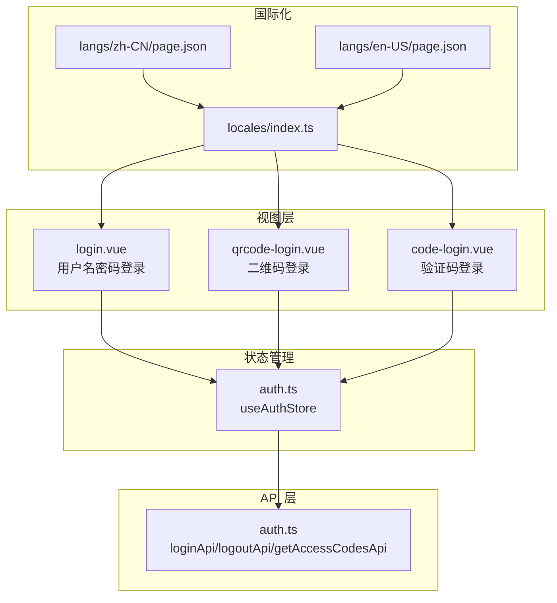
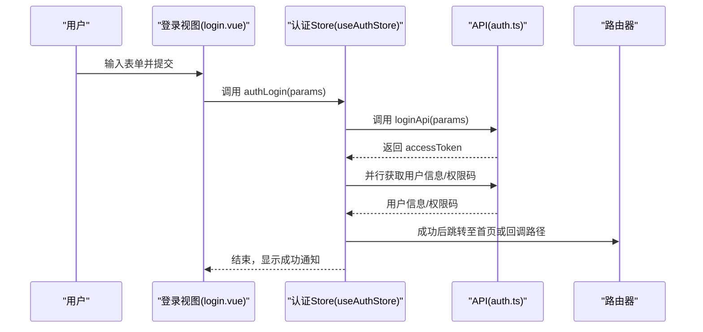
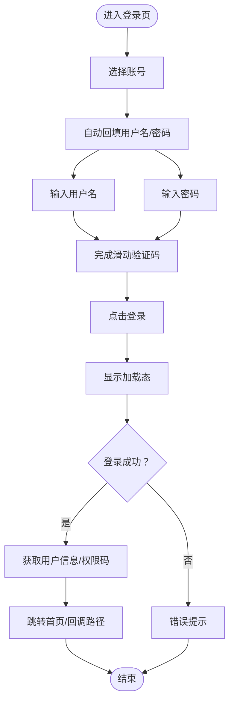
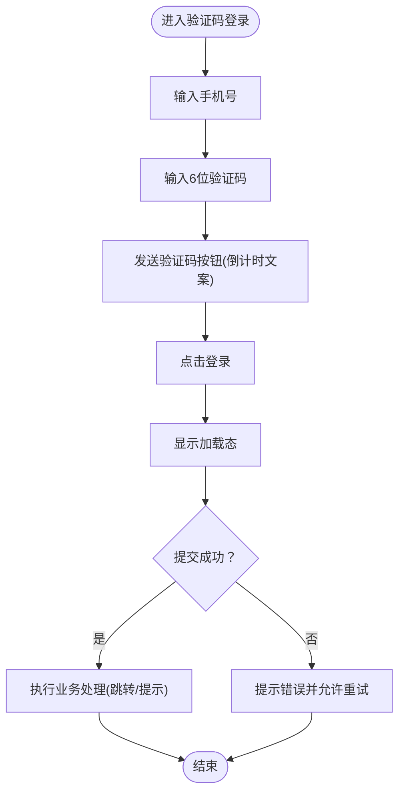
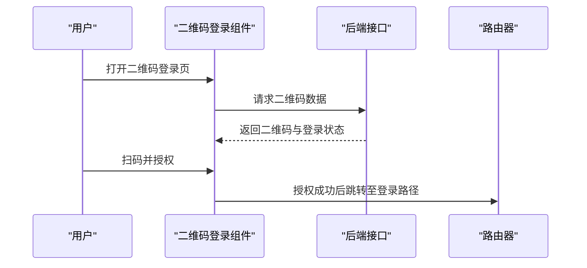
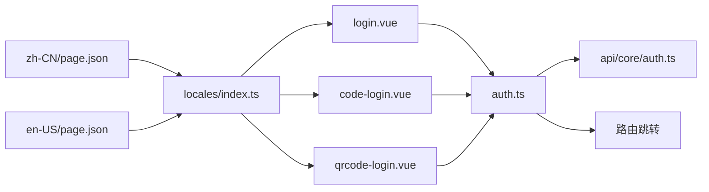

# 登录组件

<cite>
**本文引用的文件**
- [apps/web-naive/src/views/_core/authentication/login.vue](file://apps/web-naive/src/views/_core/authentication/login.vue)
- [apps/web-naive/src/views/_core/authentication/qrcode-login.vue](file://apps/web-naive/src/views/_core/authentication/qrcode-login.vue)
- [apps/web-naive/src/views/_core/authentication/code-login.vue](file://apps/web-naive/src/views/_core/authentication/code-login.vue)
- [apps/web-naive/src/store/auth.ts](file://apps/web-naive/src/store/auth.ts)
- [apps/web-naive/src/api/core/auth.ts](file://apps/web-naive/src/api/core/auth.ts)
- [apps/web-naive/src/locales/index.ts](file://apps/web-naive/src/locales/index.ts)
- [apps/web-naive/src/locales/langs/zh-CN/page.json](file://apps/web-naive/src/locales/langs/zh-CN/page.json)
- [apps/web-naive/src/locales/langs/en-US/page.json](file://apps/web-naive/src/locales/langs/en-US/page.json)
</cite>

## 目录

1. [简介](#简介)
2. [项目结构](#项目结构)
3. [核心组件](#核心组件)
4. [架构总览](#架构总览)
5. [详细组件分析](#详细组件分析)
6. [依赖分析](#依赖分析)
7. [性能考虑](#性能考虑)
8. [故障排查指南](#故障排查指南)
9. [结论](#结论)
10. [附录](#附录)

## 简介

本章节面向 shiyu-ui 项目中的登录相关功能，系统梳理三种登录方式的实现：传统用户名/密码登录、验证码登录（短信/邮箱）、二维码登录。文档覆盖界面设计要点、交互流程、表单校验规则、与认证状态管理的集成方式（表单数据绑定、提交处理、结果反馈），并提供可定制化建议、可访问性与用户体验优化策略、样式与主题适配指南，以及常见问题与调试技巧。

## 项目结构

登录相关页面位于 Web 应用视图层的“\_core/authentication”目录下，分别对应三种登录方式；认证状态管理由 Pinia Store 提供；API 层封装了登录、刷新令牌、登出、获取用户信息与权限码等接口；国际化通过本地 JSON 文件与 i18n 初始化函数加载。

图表来源

- [apps/web-naive/src/views/\_core/authentication/login.vue:1-99](file://apps/web-naive/src/views/_core/authentication/login.vue#L1-L99)
- [apps/web-naive/src/views/\_core/authentication/qrcode-login.vue:1-11](file://apps/web-naive/src/views/_core/authentication/qrcode-login.vue#L1-L11)
- [apps/web-naive/src/views/\_core/authentication/code-login.vue:1-69](file://apps/web-naive/src/views/_core/authentication/code-login.vue#L1-L69)
- [apps/web-naive/src/store/auth.ts:1-119](file://apps/web-naive/src/store/auth.ts#L1-L119)
- [apps/web-naive/src/api/core/auth.ts:1-52](file://apps/web-naive/src/api/core/auth.ts#L1-L52)
- [apps/web-naive/src/locales/index.ts:1-39](file://apps/web-naive/src/locales/index.ts#L1-L39)
- [apps/web-naive/src/locales/langs/zh-CN/page.json:1-16](file://apps/web-naive/src/locales/langs/zh-CN/page.json#L1-L16)
- [apps/web-naive/src/locales/langs/en-US/page.json:1-16](file://apps/web-naive/src/locales/langs/en-US/page.json#L1-L16)

章节来源

- [apps/web-naive/src/views/\_core/authentication/login.vue:1-99](file://apps/web-naive/src/views/_core/authentication/login.vue#L1-L99)
- [apps/web-naive/src/views/\_core/authentication/qrcode-login.vue:1-11](file://apps/web-naive/src/views/_core/authentication/qrcode-login.vue#L1-L11)
- [apps/web-naive/src/views/\_core/authentication/code-login.vue:1-69](file://apps/web-naive/src/views/_core/authentication/code-login.vue#L1-L69)
- [apps/web-naive/src/store/auth.ts:1-119](file://apps/web-naive/src/store/auth.ts#L1-L119)
- [apps/web-naive/src/api/core/auth.ts:1-52](file://apps/web-naive/src/api/core/auth.ts#L1-L52)
- [apps/web-naive/src/locales/index.ts:1-39](file://apps/web-naive/src/locales/index.ts#L1-L39)
- [apps/web-naive/src/locales/langs/zh-CN/page.json:1-16](file://apps/web-naive/src/locales/langs/zh-CN/page.json#L1-L16)
- [apps/web-naive/src/locales/langs/en-US/page.json:1-16](file://apps/web-naive/src/locales/langs/en-US/page.json#L1-L16)

## 核心组件

- 用户名密码登录组件：基于统一表单框架生成表单项，包含账号选择器、用户名、密码与滑动验证码，提交时调用认证 Store 的登录方法。
- 验证码登录组件：支持手机号输入与 6 位验证码输入，提供倒计时发送按钮文案，提交时触发业务处理函数。
- 二维码登录组件：使用统一二维码登录组件，传入登录跳转路径常量，完成扫码后自动跳转。

章节来源

- [apps/web-naive/src/views/\_core/authentication/login.vue:31-89](file://apps/web-naive/src/views/_core/authentication/login.vue#L31-L89)
- [apps/web-naive/src/views/\_core/authentication/code-login.vue:15-51](file://apps/web-naive/src/views/_core/authentication/code-login.vue#L15-L51)
- [apps/web-naive/src/views/\_core/authentication/qrcode-login.vue:8-10](file://apps/web-naive/src/views/_core/authentication/qrcode-login.vue#L8-L10)

## 架构总览

登录流程从视图层发起，经由认证 Store 调用 API 层完成登录、获取用户信息与权限码，并在成功后进行路由跳转与通知提示。国际化资源通过本地 JSON 文件加载，支持中英文切换。

图表来源

- [apps/web-naive/src/views/\_core/authentication/login.vue:93-97](file://apps/web-naive/src/views/_core/authentication/login.vue#L93-L97)
- [apps/web-naive/src/store/auth.ts:28-79](file://apps/web-naive/src/store/auth.ts#L28-L79)
- [apps/web-naive/src/api/core/auth.ts:24-26](file://apps/web-naive/src/api/core/auth.ts#L24-L26)

章节来源

- [apps/web-naive/src/views/\_core/authentication/login.vue:93-97](file://apps/web-naive/src/views/_core/authentication/login.vue#L93-L97)
- [apps/web-naive/src/store/auth.ts:28-79](file://apps/web-naive/src/store/auth.ts#L28-L79)
- [apps/web-naive/src/api/core/auth.ts:24-26](file://apps/web-naive/src/api/core/auth.ts#L24-L26)

## 详细组件分析

### 用户名密码登录组件

- 表单结构与字段
  - 账号选择器：用于快速填充用户名与默认密码，具备联动逻辑，选择后自动回填。
  - 用户名：必填校验。
  - 密码：必填校验。
  - 滑动验证码：必选，需通过验证后方可提交。
- 交互逻辑
  - 选择账号时，自动设置用户名与默认密码，提升体验。
  - 提交时触发认证 Store 的登录方法，期间显示加载态。
- 表单校验规则
  - 使用轻量校验库对字符串长度、必填、正则表达式等进行约束。
  - 验证码组件采用布尔值校验，确保用户完成验证。
- 认证状态集成
  - 绑定 loading 状态与 submit 事件，提交参数包含用户名、密码与验证码。
  - 登录成功后，写入访问令牌与用户信息，拉取权限码，执行路由跳转或回调。
- 可定制化
  - 可替换账号选项列表，调整默认值与联动行为。
  - 可替换验证码组件类型或参数，以适配不同安全策略。
- 可访问性与 UX
  - 建议为必填项添加视觉与语义标记，提供键盘导航与焦点管理。
  - 在弱网环境下展示加载反馈与重试机制。
- 样式与主题
  - 组件样式遵循统一 UI 设计规范；如需定制，可在全局样式中覆盖组件样式变量。

图表来源

- [apps/web-naive/src/views/\_core/authentication/login.vue:31-89](file://apps/web-naive/src/views/_core/authentication/login.vue#L31-L89)
- [apps/web-naive/src/store/auth.ts:28-79](file://apps/web-naive/src/store/auth.ts#L28-L79)

章节来源

- [apps/web-naive/src/views/\_core/authentication/login.vue:16-89](file://apps/web-naive/src/views/_core/authentication/login.vue#L16-L89)
- [apps/web-naive/src/store/auth.ts:28-79](file://apps/web-naive/src/store/auth.ts#L28-L79)

### 验证码登录组件

- 表单结构与字段
  - 手机号：必填且需满足 11 位数字格式。
  - 验证码：6 位固定长度，提供倒计时发送按钮文案动态更新。
- 交互逻辑
  - 提交时触发业务处理函数，实际网络请求与路由跳转应在此函数内实现。
  - 发送按钮文案根据剩余秒数动态变化，增强反馈。
- 表单校验规则
  - 手机号使用正则校验，确保格式正确。
  - 验证码使用长度校验，保证输入完整性。
- 认证状态集成
  - 绑定 loading 状态与 submit 事件，提交参数包含手机号与验证码。
  - 登录成功后的后续流程（如跳转）应在业务处理函数中实现。
- 可定制化
  - 可调整验证码长度、倒计时文案、发送按钮样式等。
- 可访问性与 UX
  - 为发送按钮提供 aria-label，明确倒计时状态。
  - 在弱网或失败场景提供清晰的错误提示与重试入口。
- 样式与主题
  - 统一使用 PinInput 组件，可通过主题变量调整尺寸、颜色与间距。

图表来源

- [apps/web-naive/src/views/\_core/authentication/code-login.vue:15-69](file://apps/web-naive/src/views/_core/authentication/code-login.vue#L15-L69)

章节来源

- [apps/web-naive/src/views/\_core/authentication/code-login.vue:13-69](file://apps/web-naive/src/views/_core/authentication/code-login.vue#L13-L69)

### 二维码登录组件

- 功能说明
  - 使用统一二维码登录组件，传入登录跳转路径常量，扫码成功后自动跳转。
- 可定制化
  - 可替换登录跳转路径常量以适配不同路由策略。
- 可访问性与 UX
  - 二维码区域提供清晰的引导文案与扫描提示。
  - 在移动端提供良好的扫码体验与兼容性。
- 样式与主题
  - 组件样式遵循统一设计规范，可按主题变量进行适配。

图表来源

- [apps/web-naive/src/views/\_core/authentication/qrcode-login.vue:8-10](file://apps/web-naive/src/views/_core/authentication/qrcode-login.vue#L8-L10)

章节来源

- [apps/web-naive/src/views/\_core/authentication/qrcode-login.vue:1-11](file://apps/web-naive/src/views/_core/authentication/qrcode-login.vue#L1-L11)

## 依赖分析

- 视图层依赖
  - 统一认证组件库：用户名密码登录、验证码登录、二维码登录均使用统一组件。
  - 国际化：通过 $t 与本地 JSON 文件加载多语言文案。
- 认证状态管理
  - useAuthStore 提供登录、登出、获取用户信息与权限码等能力。
- API 层
  - loginApi、logoutApi、getAccessCodesApi 等接口封装请求细节。
- 路由与常量
  - 登录成功后根据用户首页路径或偏好设置进行跳转；二维码登录传入登录路径常量。

图表来源

- [apps/web-naive/src/views/\_core/authentication/login.vue:1-99](file://apps/web-naive/src/views/_core/authentication/login.vue#L1-L99)
- [apps/web-naive/src/views/\_core/authentication/code-login.vue:1-69](file://apps/web-naive/src/views/_core/authentication/code-login.vue#L1-L69)
- [apps/web-naive/src/views/\_core/authentication/qrcode-login.vue:1-11](file://apps/web-naive/src/views/_core/authentication/qrcode-login.vue#L1-L11)
- [apps/web-naive/src/store/auth.ts:1-119](file://apps/web-naive/src/store/auth.ts#L1-L119)
- [apps/web-naive/src/api/core/auth.ts:1-52](file://apps/web-naive/src/api/core/auth.ts#L1-L52)
- [apps/web-naive/src/locales/index.ts:1-39](file://apps/web-naive/src/locales/index.ts#L1-L39)
- [apps/web-naive/src/locales/langs/zh-CN/page.json:1-16](file://apps/web-naive/src/locales/langs/zh-CN/page.json#L1-L16)
- [apps/web-naive/src/locales/langs/en-US/page.json:1-16](file://apps/web-naive/src/locales/langs/en-US/page.json#L1-L16)

章节来源

- [apps/web-naive/src/views/\_core/authentication/login.vue:1-99](file://apps/web-naive/src/views/_core/authentication/login.vue#L1-L99)
- [apps/web-naive/src/views/\_core/authentication/code-login.vue:1-69](file://apps/web-naive/src/views/_core/authentication/code-login.vue#L1-L69)
- [apps/web-naive/src/views/\_core/authentication/qrcode-login.vue:1-11](file://apps/web-naive/src/views/_core/authentication/qrcode-login.vue#L1-L11)
- [apps/web-naive/src/store/auth.ts:1-119](file://apps/web-naive/src/store/auth.ts#L1-L119)
- [apps/web-naive/src/api/core/auth.ts:1-52](file://apps/web-naive/src/api/core/auth.ts#L1-L52)
- [apps/web-naive/src/locales/index.ts:1-39](file://apps/web-naive/src/locales/index.ts#L1-L39)
- [apps/web-naive/src/locales/langs/zh-CN/page.json:1-16](file://apps/web-naive/src/locales/langs/zh-CN/page.json#L1-L16)
- [apps/web-naive/src/locales/langs/en-US/page.json:1-16](file://apps/web-naive/src/locales/langs/en-US/page.json#L1-L16)

## 性能考虑

- 表单渲染与联动
  - 账号选择器联动回填用户名/密码时，避免不必要的重渲染，可使用计算属性与浅比较。
- 登录请求
  - 登录成功后并行获取用户信息与权限码，减少总等待时间。
- 国际化加载
  - 本地 JSON 文件按需加载，避免一次性加载过多语言包。
- 二维码登录
  - 后端轮询或前端 WebSocket 轮询需控制频率，避免频繁请求导致性能问题。

## 故障排查指南

- 登录无响应
  - 检查视图层 submit 事件是否正确绑定至认证 Store 的登录方法。
  - 确认 loading 状态是否被正确置位与复位。
- 校验不生效
  - 确认表单 schema 的 rules 是否正确配置，特别是正则与长度校验。
  - 检查依赖字段的 triggerFields 是否包含被联动的字段。
- 登录成功但未跳转
  - 检查用户首页路径与偏好设置是否正确，确认路由守卫与重定向逻辑。
- 国际化文案缺失
  - 确认 locales 目录结构与 JSON 文件命名一致，检查加载函数是否正确映射。
- 二维码登录无法跳转
  - 检查登录路径常量与路由配置是否一致，确认扫码授权回调是否正确触发。

章节来源

- [apps/web-naive/src/views/\_core/authentication/login.vue:93-97](file://apps/web-naive/src/views/_core/authentication/login.vue#L93-L97)
- [apps/web-naive/src/store/auth.ts:54-62](file://apps/web-naive/src/store/auth.ts#L54-L62)
- [apps/web-naive/src/locales/index.ts:14-27](file://apps/web-naive/src/locales/index.ts#L14-L27)

## 结论

本项目登录体系以统一组件库为核心，结合 Pinia 认证 Store 与 API 层，实现了用户名密码、验证码与二维码三种登录方式。通过完善的表单校验、国际化与路由跳转机制，提供了良好的用户体验。建议在生产环境中进一步完善弱网处理、错误提示与可访问性细节，并根据业务需求扩展登录方式与安全策略。

## 附录

- 自定义配置清单
  - 替换账号选项列表与默认值：修改账号选择器的数据源与默认值。
  - 调整验证码长度与倒计时文案：修改验证码输入组件的参数与文案函数。
  - 更换登录跳转路径：修改二维码登录组件传入的路径常量。
  - 国际化扩展：新增语言包 JSON 文件并在初始化函数中加载。
- 样式与主题适配
  - 统一使用组件库提供的样式变量，按主题色板调整主色调与对比度。
  - 对表单控件的尺寸、圆角、阴影等进行一致性调整，确保跨设备一致体验。
