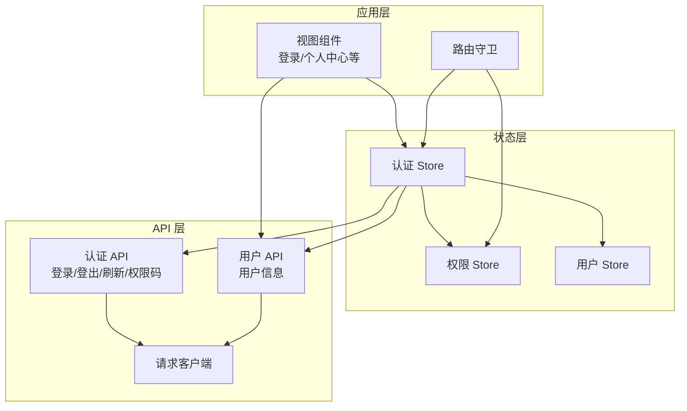
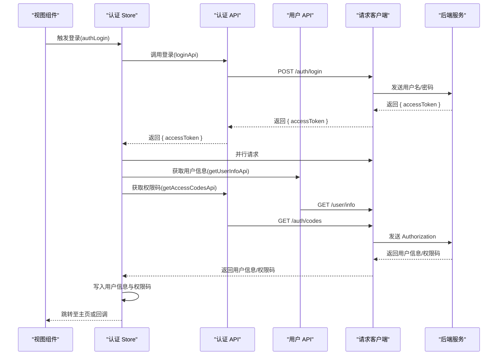
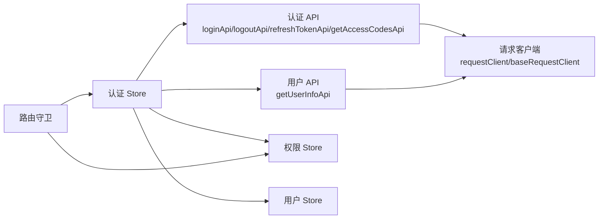

# 认证 API 接口

<cite>
**本文引用的文件**
- [apps\web-naive\src\api\core\auth.ts](file://apps\web-naive\src\api\core\auth.ts)
- [playground\src\api\core\auth.ts](file://playground\src\api\core\auth.ts)
- [apps\web-naive\src\api\core\user.ts](file://apps\web-naive\src\api\core\user.ts)
- [playground\src\api\core\user.ts](file://playground\src\api\core\user.ts)
- [apps\web-naive\src\api\request.ts](file://apps\web-naive\src\api\request.ts)
- [playground\src\api\request.ts](file://playground\src\api\request.ts)
- [apps\web-naive\src\store\auth.ts](file://apps\web-naive\src\store\auth.ts)
- [playground\src\store\auth.ts](file://playground\src\store\auth.ts)
- [apps\web-naive\src\router\guard.ts](file://apps\web-naive\src\router\guard.ts)
- [playground\src\router\guard.ts](file://playground\src\router\guard.ts)
</cite>

## 目录

1. [简介](#简介)
2. [项目结构](#项目结构)
3. [核心组件](#核心组件)
4. [架构总览](#架构总览)
5. [详细组件分析](#详细组件分析)
6. [依赖关系分析](#依赖关系分析)
7. [性能考虑](#性能考虑)
8. [故障排除指南](#故障排除指南)
9. [结论](#结论)
10. [附录](#附录)

## 简介

本文件面向 shiyu-ui 项目的前端开发者与集成方，系统性梳理认证相关 API 的端点、参数、响应、错误处理、安全机制与调用最佳实践。重点覆盖以下能力：

- 登录（用户名/密码）
- 登出
- 刷新访问令牌
- 获取用户信息
- 获取用户权限码

同时结合前端状态管理与路由守卫，说明认证态如何贯穿应用生命周期。

## 项目结构

认证相关代码主要分布在以下模块：

- API 层：封装认证与用户信息相关接口
- 请求层：统一请求客户端、拦截器与错误处理
- 状态层：Pinia Store 管理认证态、用户信息与权限码
- 路由层：基于认证态与权限码生成动态路由与菜单

图表来源

- [apps\web-naive\src\api\core\auth.ts:1-52](file://apps\web-naive\src\api\core\auth.ts#L1-L52)
- [apps\web-naive\src\api\core\user.ts:1-11](file://apps\web-naive\src\api\core\user.ts#L1-L11)
- [apps\web-naive\src\api\request.ts:1-114](file://apps\web-naive\src\api\request.ts#L1-L114)
- [apps\web-naive\src\store\auth.ts:1-119](file://apps\web-naive\src\store\auth.ts#L1-L119)
- [apps\web-naive\src\router\guard.ts:1-133](file://apps\web-naive\src\router\guard.ts#L1-L133)

章节来源

- [apps\web-naive\src\api\core\auth.ts:1-52](file://apps\web-naive\src\api\core\auth.ts#L1-L52)
- [apps\web-naive\src\api\core\user.ts:1-11](file://apps\web-naive\src\api\core\user.ts#L1-L11)
- [apps\web-naive\src\api\request.ts:1-114](file://apps\web-naive\src\api\request.ts#L1-L114)
- [apps\web-naive\src\store\auth.ts:1-119](file://apps\web-naive\src\store\auth.ts#L1-L119)
- [apps\web-naive\src\router\guard.ts:1-133](file://apps\web-naive\src\router\guard.ts#L1-L133)

## 核心组件

- 认证 API 客户端：封装登录、登出、刷新令牌、获取权限码
- 用户信息 API 客户端：获取当前登录用户信息
- 请求客户端与拦截器：统一封装 Authorization 头、响应格式、错误提示与自动刷新令牌
- 认证 Store：协调登录流程、存储 accessToken、拉取用户信息与权限码、触发路由跳转
- 路由守卫：基于 accessToken 与权限码生成动态路由与菜单

章节来源

- [apps\web-naive\src\api\core\auth.ts:1-52](file://apps\web-naive\src\api\core\auth.ts#L1-L52)
- [apps\web-naive\src\api\core\user.ts:1-11](file://apps\web-naive\src\api\core\user.ts#L1-L11)
- [apps\web-naive\src\api\request.ts:1-114](file://apps\web-naive\src\api\request.ts#L1-L114)
- [apps\web-naive\src\store\auth.ts:1-119](file://apps\web-naive\src\store\auth.ts#L1-L119)
- [apps\web-naive\src\router\guard.ts:1-133](file://apps\web-naive\src\router\guard.ts#L1-L133)

## 架构总览

认证流程从视图组件触发登录开始，经由认证 Store 调用认证 API，随后并行拉取用户信息与权限码，写入对应 Store 并根据用户主页路径或默认首页进行路由跳转；请求层通过拦截器自动注入 Authorization 头并在令牌失效时尝试刷新或触发重新认证。

图表来源

- [apps\web-naive\src\store\auth.ts:28-79](file://apps\web-naive\src\store\auth.ts#L28-L79)
- [apps\web-naive\src\api\core\auth.ts:24-51](file://apps\web-naive\src\api\core\auth.ts#L24-L51)
- [apps\web-naive\src\api\core\user.ts:8-10](file://apps\web-naive\src\api\core\user.ts#L8-L10)
- [apps\web-naive\src\api\request.ts:63-92](file://apps\web-naive\src\api\request.ts#L63-L92)

## 详细组件分析

### 认证 API 端点清单

- 登录
  - 方法与路径：POST /auth/login
  - 请求体参数：username、password（均为可选字段，具体以后端接口为准）
  - 成功响应：包含 accessToken 字段的对象
  - 失败响应：通用错误拦截器返回错误消息
  - 示例：见“请求示例”与“响应示例”
- 刷新访问令牌
  - 方法与路径：POST /auth/refresh
  - 请求体：无（或空）
  - 成功响应：包含 data（新令牌）与 status 的对象
  - 失败响应：通用错误拦截器返回错误消息
  - 示例：见“请求示例”与“响应示例”
- 登出
  - 方法与路径：POST /auth/logout
  - 请求体：无（或空）
  - 成功响应：无特定业务字段
  - 失败响应：通用错误拦截器返回错误消息
  - 示例：见“请求示例”与“响应示例”
- 获取用户权限码
  - 方法与路径：GET /auth/codes
  - 查询参数：无
  - 成功响应：字符串数组
  - 失败响应：通用错误拦截器返回错误消息
  - 示例：见“请求示例”与“响应示例”

章节来源

- [apps\web-naive\src\api\core\auth.ts:4-51](file://apps\web-naive\src\api\core\auth.ts#L4-L51)
- [playground\src\api\core\auth.ts:4-57](file://playground\src\api\core\auth.ts#L4-L57)

### 请求与响应示例（说明性）

- 登录
  - 请求：POST /auth/login，Body 包含 username、password
  - 成功：返回 { accessToken }
  - 失败：返回错误消息（如账号密码错误、账户被禁用等）
- 刷新访问令牌
  - 请求：POST /auth/refresh
  - 成功：返回 { data: 新 accessToken, status: 200 }
  - 失败：返回错误消息（如 refresh_token 无效）
- 登出
  - 请求：POST /auth/logout
  - 成功：无业务字段
  - 失败：返回错误消息（如会话不存在）
- 获取用户权限码
  - 请求：GET /auth/codes
  - 成功：返回字符串数组
  - 失败：返回错误消息（如未登录）

章节来源

- [apps\web-naive\src\api\core\auth.ts:24-51](file://apps\web-naive\src\api\core\auth.ts#L24-L51)
- [playground\src\api\core\auth.ts:24-57](file://playground\src\api\core\auth.ts#L24-L57)

### 错误码与错误处理机制

- 统一响应结构：默认拦截器期望响应包含 code、data 字段，成功码为 200
- 通用错误提示：当响应未命中认证拦截器时，从响应数据中提取 error 或 message 字段作为错误提示
- 认证拦截器：
  - 自动刷新：当检测到令牌过期且启用刷新功能时，调用刷新接口获取新令牌
  - 重新认证：若刷新失败或未启用刷新，触发重新认证流程（清空 accessToken，按配置弹窗或强制登出）
- 登录态失效处理：在路由守卫中对未授权访问进行拦截，跳转登录页并携带 redirect 参数

章节来源

- [apps\web-naive\src\api\request.ts:74-104](file://apps\web-naive\src\api\request.ts#L74-L104)
- [playground\src\api\request.ts:89-119](file://playground\src\api\request.ts#L89-L119)
- [apps\web-naive\src\router\guard.ts:47-118](file://apps\web-naive\src\router\guard.ts#L47-L118)

### 安全机制与认证要求

- 认证方式：Bearer Token
- 请求头注入：请求拦截器自动在 Authorization 头添加 Bearer 令牌
- 语言头：Accept-Language 由应用偏好设置注入
- 会话与凭证：部分端点明确使用 withCredentials（跨域场景下携带 Cookie），确保与后端会话一致
- 登出清理：登出成功后重置所有 Store，清除登录态

章节来源

- [apps\web-naive\src\api\request.ts:63-71](file://apps\web-naive\src\api\request.ts#L63-L71)
- [apps\web-naive\src\api\core\auth.ts:31-44](file://apps\web-naive\src\api\core\auth.ts#L31-L44)
- [playground\src\api\core\auth.ts:33-49](file://playground\src\api\core\auth.ts#L33-L49)
- [apps\web-naive\src\store\auth.ts:81-99](file://apps\web-naive\src\store\auth.ts#L81-L99)

### 调用限制、速率控制与版本管理

- 速率控制：未在前端显式实现，建议后端实施
- 版本管理：未在前端显式实现，建议通过 baseURL 或服务端版本路由区分
- 建议：在请求客户端增加重试策略、并发控制与超时配置

章节来源

- [apps\web-naive\src\api\request.ts:23-107](file://apps\web-naive\src\api\request.ts#L23-L107)
- [playground\src\api\request.ts:26-122](file://playground\src\api\request.ts#L26-L122)

### 最佳实践

- 登录流程：先调用登录获取 accessToken，再并行拉取用户信息与权限码，最后写入 Store 并跳转
- 令牌刷新：在认证拦截器中自动处理，避免手动刷新导致的竞态
- 错误处理：优先读取后端返回的 error/message 字段，提升用户体验
- 路由守卫：利用 ignoreAccess 允许无需鉴权的页面，其余页面统一校验 accessToken
- 登出流程：调用登出接口后重置 Store 并跳转登录页，携带 redirect 参数以便登录后回跳

章节来源

- [apps\web-naive\src\store\auth.ts:28-79](file://apps\web-naive\src\store\auth.ts#L28-L79)
- [apps\web-naive\src\router\guard.ts:47-118](file://apps\web-naive\src\router\guard.ts#L47-L118)

## 依赖关系分析

认证相关模块之间的依赖关系如下：

图表来源

- [apps\web-naive\src\api\core\auth.ts:24-51](file://apps\web-naive\src\api\core\auth.ts#L24-L51)
- [apps\web-naive\src\api\core\user.ts:8-10](file://apps\web-naive\src\api\core\user.ts#L8-L10)
- [apps\web-naive\src\api\request.ts:19-114](file://apps\web-naive\src\api\request.ts#L19-L114)
- [apps\web-naive\src\store\auth.ts:13-119](file://apps\web-naive\src\store\auth.ts#L13-L119)
- [apps\web-naive\src\router\guard.ts:47-118](file://apps\web-naive\src\router\guard.ts#L47-L118)

章节来源

- [apps\web-naive\src\api\core\auth.ts:1-52](file://apps\web-naive\src\api\core\auth.ts#L1-L52)
- [apps\web-naive\src\api\core\user.ts:1-11](file://apps\web-naive\src\api\core\user.ts#L1-L11)
- [apps\web-naive\src\api\request.ts:1-114](file://apps\web-naive\src\api\request.ts#L1-L114)
- [apps\web-naive\src\store\auth.ts:1-119](file://apps\web-naive\src\store\auth.ts#L1-L119)
- [apps\web-naive\src\router\guard.ts:1-133](file://apps\web-naive\src\router\guard.ts#L1-L133)

## 性能考虑

- 并行请求：登录成功后并行获取用户信息与权限码，减少总等待时间
- 缓存与去重：路由守卫中记录已加载页面，避免重复动画与资源加载
- 令牌刷新：仅在必要时刷新，避免频繁刷新造成额外开销
- 响应解析：在 playground 的请求客户端中对 JSON BigInt 进行转换，避免大整数精度丢失

章节来源

- [apps\web-naive\src\store\auth.ts:44-47](file://apps\web-naive\src\store\auth.ts#L44-L47)
- [apps\web-naive\src\router\guard.ts:17-41](file://apps\web-naive\src\router\guard.ts#L17-L41)
- [playground\src\api\request.ts:30-42](file://playground\src\api\request.ts#L30-L42)

## 故障排除指南

- 登录后仍提示未登录
  - 检查登录接口是否正确返回 accessToken
  - 确认请求拦截器已将 Authorization 头注入
  - 查看路由守卫是否正确拦截并跳转登录页
- 令牌过期频繁
  - 检查后端令牌有效期与刷新策略
  - 确认前端启用刷新功能且刷新接口可用
- 登出后状态未清理
  - 确认登出接口调用成功
  - 检查 Store 重置逻辑与路由跳转
- 权限码为空
  - 确认登录后已调用获取权限码接口
  - 检查后端权限码下发逻辑

章节来源

- [apps\web-naive\src\api\request.ts:82-104](file://apps\web-naive\src\api\request.ts#L82-L104)
- [apps\web-naive\src\store\auth.ts:81-99](file://apps\web-naive\src\store\auth.ts#L81-L99)
- [apps\web-naive\src\router\guard.ts:63-86](file://apps\web-naive\src\router\guard.ts#L63-L86)

## 结论

本文档系统梳理了 shiyu-ui 的认证 API 与前端集成要点，明确了端点、参数、响应、错误处理与安全机制，并结合状态管理与路由守卫展示了认证态在应用中的流转。建议在实际集成中遵循最佳实践，关注令牌刷新与错误提示的一致性，确保用户体验与安全性。

## 附录

- 常用端点一览
  - POST /auth/login：登录
  - POST /auth/refresh：刷新访问令牌
  - POST /auth/logout：登出
  - GET /auth/codes：获取权限码
  - GET /user/info：获取用户信息

章节来源

- [apps\web-naive\src\api\core\auth.ts:24-51](file://apps\web-naive\src\api\core\auth.ts#L24-L51)
- [apps\web-naive\src\api\core\user.ts:8-10](file://apps\web-naive\src\api\core\user.ts#L8-L10)
