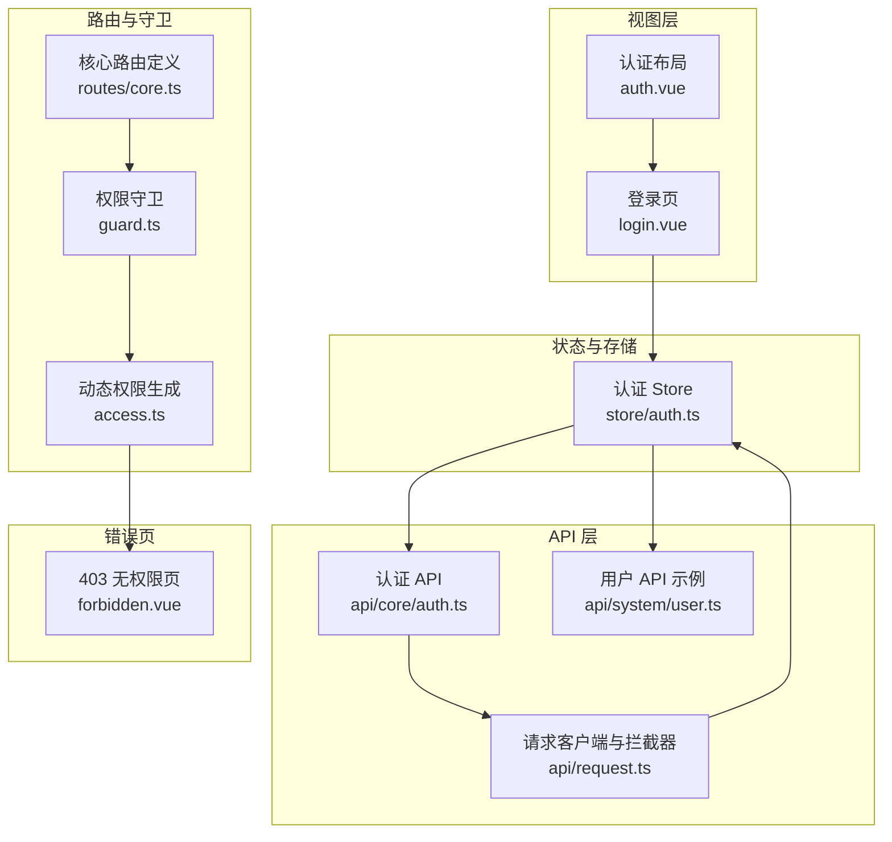
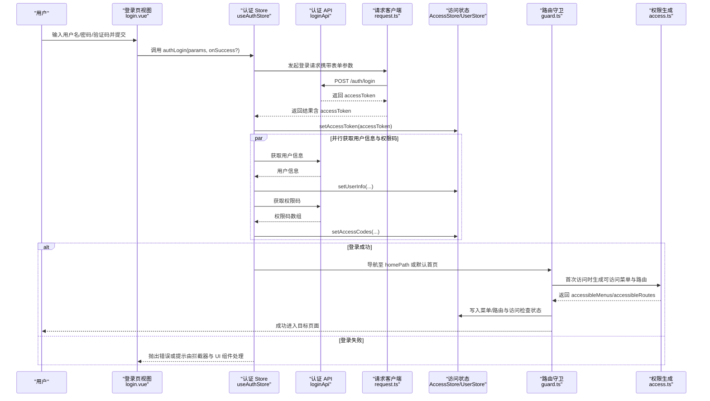
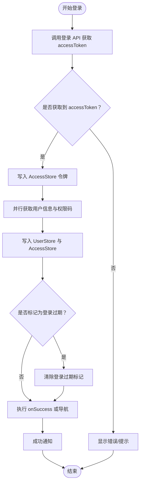
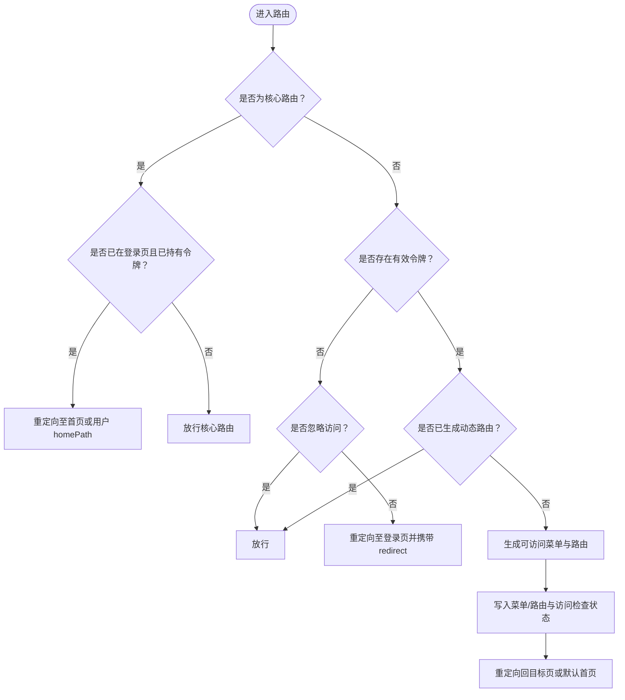
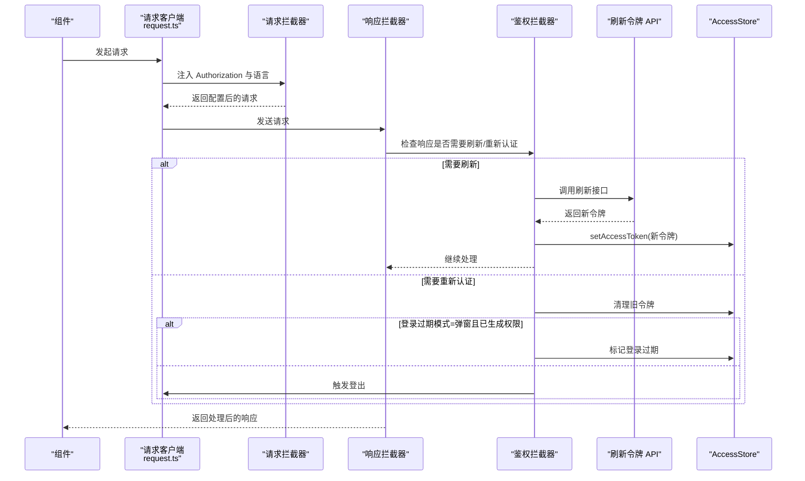
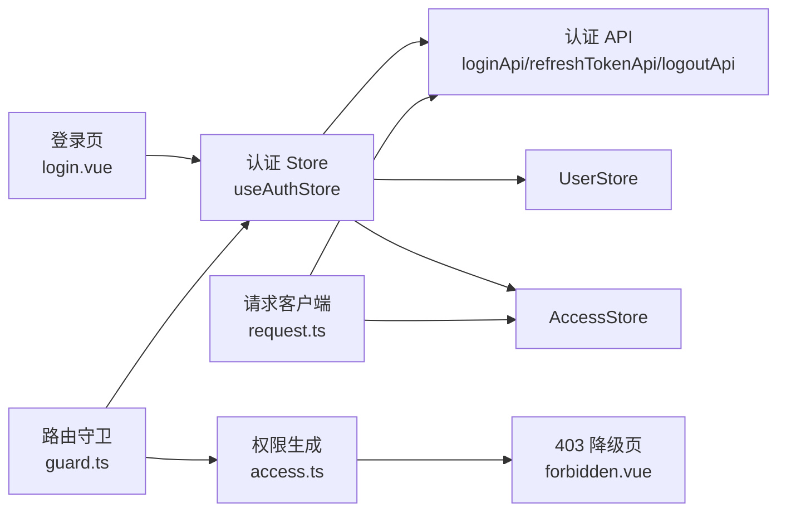

# 认证流程

<cite>
**本文引用的文件**
- [apps/web-naive/src/store/auth.ts](file://apps/web-naive/src/store/auth.ts)
- [apps/web-naive/src/router/guard.ts](file://apps/web-naive/src/router/guard.ts)
- [apps/web-naive/src/api/core/auth.ts](file://apps/web-naive/src/api/core/auth.ts)
- [apps/web-naive/src/views/_core/authentication/login.vue](file://apps/web-naive/src/views/_core/authentication/login.vue)
- [apps/web-naive/src/layouts/auth.vue](file://apps/web-naive/src/layouts/auth.vue)
- [apps/web-naive/src/router/access.ts](file://apps/web-naive/src/router/access.ts)
- [apps/web-naive/src/api/system/user.ts](file://apps/web-naive/src/api/system/user.ts)
- [apps/web-naive/src/api/request.ts](file://apps/web-naive/src/api/request.ts)
- [apps/web-naive/src/router/routes/core.ts](file://apps/web-naive/src/router/routes/core.ts)
- [apps/web-naive/src/views/_core/fallback/forbidden.vue](file://apps/web-naive/src/views/_core/fallback/forbidden.vue)
</cite>

## 目录

1. [简介](#简介)
2. [项目结构](#项目结构)
3. [核心组件](#核心组件)
4. [架构总览](#架构总览)
5. [详细组件分析](#详细组件分析)
6. [依赖关系分析](#依赖关系分析)
7. [性能考量](#性能考量)
8. [故障排查指南](#故障排查指南)
9. [结论](#结论)
10. [附录](#附录)

## 简介

本文件系统性梳理 shiyu-ui 项目的认证流程与守卫机制，覆盖从用户提交登录表单到完成认证、令牌获取、用户信息与权限加载、路由拦截与权限校验、以及登录失败处理与错误恢复策略。文档同时给出关键流程的时序图与代码路径指引，帮助开发者快速理解并优化认证相关功能。

## 项目结构

围绕认证的关键目录与文件如下：

- 视图层：登录页与认证布局
  - 登录页视图：apps/web-naive/src/views/\_core/authentication/login.vue
  - 认证布局：apps/web-naive/src/layouts/auth.vue
- 路由与守卫：路由定义、权限守卫与菜单/路由生成
  - 路由核心定义：apps/web-naive/src/router/routes/core.ts
  - 权限守卫：apps/web-naive/src/router/guard.ts
  - 动态权限生成：apps/web-naive/src/router/access.ts
- 状态与存储：认证状态、用户信息、权限码与令牌
  - 认证 Store：apps/web-naive/src/store/auth.ts
- API 层：认证接口、刷新令牌、用户信息与权限码
  - 认证 API：apps/web-naive/src/api/core/auth.ts
  - 请求客户端与拦截器：apps/web-naive/src/api/request.ts
  - 用户相关 API（示例）：apps/web-naive/src/api/system/user.ts
- 错误页：403 无权限页
  - 403 视图：apps/web-naive/src/views/\_core/fallback/forbidden.vue

图表来源

- [apps/web-naive/src/views/\_core/authentication/login.vue:1-99](file://apps/web-naive/src/views/_core/authentication/login.vue#L1-L99)
- [apps/web-naive/src/layouts/auth.vue:1-26](file://apps/web-naive/src/layouts/auth.vue#L1-L26)
- [apps/web-naive/src/router/routes/core.ts:1-98](file://apps/web-naive/src/router/routes/core.ts#L1-L98)
- [apps/web-naive/src/router/guard.ts:1-133](file://apps/web-naive/src/router/guard.ts#L1-L133)
- [apps/web-naive/src/router/access.ts:1-41](file://apps/web-naive/src/router/access.ts#L1-L41)
- [apps/web-naive/src/store/auth.ts:1-119](file://apps/web-naive/src/store/auth.ts#L1-L119)
- [apps/web-naive/src/api/core/auth.ts:1-52](file://apps/web-naive/src/api/core/auth.ts#L1-L52)
- [apps/web-naive/src/api/request.ts:1-114](file://apps/web-naive/src/api/request.ts#L1-L114)
- [apps/web-naive/src/api/system/user.ts:1-99](file://apps/web-naive/src/api/system/user.ts#L1-L99)
- [apps/web-naive/src/views/\_core/fallback/forbidden.vue:1-10](file://apps/web-naive/src/views/_core/fallback/forbidden.vue#L1-L10)

章节来源

- [apps/web-naive/src/views/\_core/authentication/login.vue:1-99](file://apps/web-naive/src/views/_core/authentication/login.vue#L1-L99)
- [apps/web-naive/src/layouts/auth.vue:1-26](file://apps/web-naive/src/layouts/auth.vue#L1-L26)
- [apps/web-naive/src/router/routes/core.ts:1-98](file://apps/web-naive/src/router/routes/core.ts#L1-L98)
- [apps/web-naive/src/router/guard.ts:1-133](file://apps/web-naive/src/router/guard.ts#L1-L133)
- [apps/web-naive/src/router/access.ts:1-41](file://apps/web-naive/src/router/access.ts#L1-L41)
- [apps/web-naive/src/store/auth.ts:1-119](file://apps/web-naive/src/store/auth.ts#L1-L119)
- [apps/web-naive/src/api/core/auth.ts:1-52](file://apps/web-naive/src/api/core/auth.ts#L1-L52)
- [apps/web-naive/src/api/request.ts:1-114](file://apps/web-naive/src/api/request.ts#L1-L114)
- [apps/web-naive/src/api/system/user.ts:1-99](file://apps/web-naive/src/api/system/user.ts#L1-L99)
- [apps/web-naive/src/views/\_core/fallback/forbidden.vue:1-10](file://apps/web-naive/src/views/_core/fallback/forbidden.vue#L1-L10)

## 核心组件

- 认证 Store（useAuthStore）
  - 负责登录异步处理、令牌设置、用户信息获取、权限码获取、登出与通知提示
  - 关键方法与职责
    - authLogin(params, onSuccess?)：异步登录，获取 accessToken 并并行拉取用户信息与权限码；成功后写入状态并导航或执行回调
    - fetchUserInfo()：获取并缓存用户信息
    - logout(redirect?)：调用后端登出接口，重置所有状态，标记登录过期，并按需携带当前路由重定向至登录页
    - loginLoading：登录按钮加载态
- 请求客户端与拦截器
  - 在请求头注入 Authorization（Bearer 令牌），统一响应格式化与错误提示
  - 实现“重新认证”与“刷新令牌”逻辑：当鉴权失败或令牌过期时，清理旧令牌或弹窗提示，或触发登出
- 权限守卫（setupAccessGuard）
  - 核心路由放行；未携带有效 accessToken 且非忽略访问时，重定向至登录页并携带 redirect 参数
  - 首次访问受保护路由时，基于用户角色生成可访问菜单与路由，写入状态并重定向回目标页
- 动态权限生成（generateAccess）
  - 通过 @vben/access 的 generateAccessible 生成可访问菜单与路由，支持 403 降级组件
- 登录视图与布局
  - 登录页通过表单 Schema 完成用户名/密码与验证码输入，绑定到 useAuthStore.authLogin
  - 认证布局承载标题、副标题与 Logo

章节来源

- [apps/web-naive/src/store/auth.ts:1-119](file://apps/web-naive/src/store/auth.ts#L1-L119)
- [apps/web-naive/src/api/request.ts:1-114](file://apps/web-naive/src/api/request.ts#L1-L114)
- [apps/web-naive/src/router/guard.ts:1-133](file://apps/web-naive/src/router/guard.ts#L1-L133)
- [apps/web-naive/src/router/access.ts:1-41](file://apps/web-naive/src/router/access.ts#L1-L41)
- [apps/web-naive/src/views/\_core/authentication/login.vue:1-99](file://apps/web-naive/src/views/_core/authentication/login.vue#L1-L99)
- [apps/web-naive/src/layouts/auth.vue:1-26](file://apps/web-naive/src/layouts/auth.vue#L1-L26)

## 架构总览

下图展示了从用户提交登录到完成认证与权限加载的整体流程，以及守卫在路由层面的拦截与重定向逻辑。

图表来源

- [apps/web-naive/src/views/\_core/authentication/login.vue:1-99](file://apps/web-naive/src/views/_core/authentication/login.vue#L1-L99)
- [apps/web-naive/src/store/auth.ts:1-119](file://apps/web-naive/src/store/auth.ts#L1-L119)
- [apps/web-naive/src/api/core/auth.ts:1-52](file://apps/web-naive/src/api/core/auth.ts#L1-L52)
- [apps/web-naive/src/api/request.ts:1-114](file://apps/web-naive/src/api/request.ts#L1-L114)
- [apps/web-naive/src/router/guard.ts:1-133](file://apps/web-naive/src/router/guard.ts#L1-L133)
- [apps/web-naive/src/router/access.ts:1-41](file://apps/web-naive/src/router/access.ts#L1-L41)

## 详细组件分析

### 认证 Store（useAuthStore）与登录流程

- 登录异步处理
  - 触发登录 Loading
  - 调用登录 API 获取 accessToken
  - 设置 AccessStore 的 accessToken
  - 并行获取用户信息与权限码，分别写入 UserStore 与 AccessStore
  - 若已标记登录过期则清除标记；否则执行 onSuccess 或导航至用户首页/默认首页
  - 成功后弹出通知提示
  - finally 清理登录 Loading
- 登出流程
  - 调用后端登出接口（忽略异常）
  - 重置所有 Pinia Store
  - 清除登录过期标记
  - 带上当前路由地址重定向至登录页（若需要）

图表来源

- [apps/web-naive/src/store/auth.ts:1-119](file://apps/web-naive/src/store/auth.ts#L1-L119)

章节来源

- [apps/web-naive/src/store/auth.ts:1-119](file://apps/web-naive/src/store/auth.ts#L1-L119)

### 路由守卫与权限拦截

- 通用守卫
  - 记录页面加载状态，按配置开启/关闭进度条
- 权限守卫
  - 放行核心路由（如登录页）
  - 若访问令牌缺失且非忽略访问，则重定向至登录页并携带 redirect
  - 首次访问受保护路由时，基于用户角色生成可访问菜单与路由，写入状态并重定向回目标页或默认首页
  - 已生成过动态路由则直接放行

图表来源

- [apps/web-naive/src/router/guard.ts:1-133](file://apps/web-naive/src/router/guard.ts#L1-L133)
- [apps/web-naive/src/router/access.ts:1-41](file://apps/web-naive/src/router/access.ts#L1-L41)

章节来源

- [apps/web-naive/src/router/guard.ts:1-133](file://apps/web-naive/src/router/guard.ts#L1-L133)
- [apps/web-naive/src/router/access.ts:1-41](file://apps/web-naive/src/router/access.ts#L1-L41)

### 请求客户端与自动刷新/重新认证

- 请求头注入
  - 在请求拦截器中将 Authorization 设置为 Bearer 令牌
  - 设置 Accept-Language
- 响应拦截器
  - 默认响应格式化（code/data/成功码）
  - 鉴权拦截器：当响应指示需要刷新或重新认证时
    - 若启用“弹窗模式”且已生成过权限，则标记登录过期
    - 否则触发登出流程（清理状态并重定向）
  - 刷新令牌：调用刷新接口获取新令牌并写入 AccessStore
  - 通用错误拦截：提取后端错误消息并统一提示

图表来源

- [apps/web-naive/src/api/request.ts:1-114](file://apps/web-naive/src/api/request.ts#L1-L114)
- [apps/web-naive/src/api/core/auth.ts:1-52](file://apps/web-naive/src/api/core/auth.ts#L1-L52)

章节来源

- [apps/web-naive/src/api/request.ts:1-114](file://apps/web-naive/src/api/request.ts#L1-L114)
- [apps/web-naive/src/api/core/auth.ts:1-52](file://apps/web-naive/src/api/core/auth.ts#L1-L52)

### 登录视图与布局

- 登录页
  - 表单 Schema 包含账号选择、用户名、密码与滑动验证码
  - 绑定到 useAuthStore.authLogin，展示登录 Loading
- 认证布局
  - 承载应用名称、Logo 与页面标题/描述文案

章节来源

- [apps/web-naive/src/views/\_core/authentication/login.vue:1-99](file://apps/web-naive/src/views/_core/authentication/login.vue#L1-L99)
- [apps/web-naive/src/layouts/auth.vue:1-26](file://apps/web-naive/src/layouts/auth.vue#L1-L26)

### 403 无权限页

- 当路由被标记为“有权限但无访问”时，可降级到 403 页面
- 用于向用户明确提示无权限访问

章节来源

- [apps/web-naive/src/views/\_core/fallback/forbidden.vue:1-10](file://apps/web-naive/src/views/_core/fallback/forbidden.vue#L1-L10)

## 依赖关系分析

- 认证 Store 依赖
  - API 层：登录、刷新令牌、登出、用户信息、权限码
  - 状态层：AccessStore、UserStore
  - 路由：导航与重定向
- 路由守卫依赖
  - 认证 Store：读取令牌与用户信息
  - 动态权限生成：生成可访问菜单与路由
- 请求客户端依赖
  - 鉴权拦截器：刷新/重新认证
  - 统一错误提示

图表来源

- [apps/web-naive/src/views/\_core/authentication/login.vue:1-99](file://apps/web-naive/src/views/_core/authentication/login.vue#L1-L99)
- [apps/web-naive/src/store/auth.ts:1-119](file://apps/web-naive/src/store/auth.ts#L1-L119)
- [apps/web-naive/src/api/core/auth.ts:1-52](file://apps/web-naive/src/api/core/auth.ts#L1-L52)
- [apps/web-naive/src/router/guard.ts:1-133](file://apps/web-naive/src/router/guard.ts#L1-L133)
- [apps/web-naive/src/router/access.ts:1-41](file://apps/web-naive/src/router/access.ts#L1-L41)
- [apps/web-naive/src/api/request.ts:1-114](file://apps/web-naive/src/api/request.ts#L1-L114)
- [apps/web-naive/src/views/\_core/fallback/forbidden.vue:1-10](file://apps/web-naive/src/views/_core/fallback/forbidden.vue#L1-L10)

章节来源

- [apps/web-naive/src/store/auth.ts:1-119](file://apps/web-naive/src/store/auth.ts#L1-L119)
- [apps/web-naive/src/router/guard.ts:1-133](file://apps/web-naive/src/router/guard.ts#L1-L133)
- [apps/web-naive/src/router/access.ts:1-41](file://apps/web-naive/src/router/access.ts#L1-L41)
- [apps/web-naive/src/api/core/auth.ts:1-52](file://apps/web-naive/src/api/core/auth.ts#L1-L52)
- [apps/web-naive/src/api/request.ts:1-114](file://apps/web-naive/src/api/request.ts#L1-L114)

## 性能考量

- 并行请求
  - 登录成功后并行获取用户信息与权限码，减少总等待时间
- 路由懒加载与菜单生成
  - 通过动态导入与权限生成，避免一次性加载全部页面与菜单
- 进度条与加载态
  - 守卫阶段按配置开启进度条，提升用户体验
- 令牌刷新策略
  - 在鉴权拦截器中统一处理刷新与重新认证，避免重复逻辑
- 本地状态复用
  - 首次生成动态路由后，后续访问不再重复生成，提高导航效率

## 故障排查指南

- 登录失败
  - 检查登录 API 返回与请求拦截器错误提示
  - 确认表单校验与验证码校验是否通过
  - 查看 UI 层是否正确绑定 authLogin 与 loading 状态
- 令牌过期或无效
  - 检查鉴权拦截器是否触发重新认证或刷新逻辑
  - 若启用弹窗模式且已生成权限，确认登录过期标记是否被正确设置
  - 否则检查登出流程是否被触发
- 无法进入受保护页面
  - 确认核心路由是否正确配置
  - 检查守卫是否正确识别忽略访问与重定向逻辑
  - 首次访问时确认权限生成是否成功并写入状态
- 403 无权限
  - 检查权限生成是否正确映射到降级组件
  - 确认路由 meta 配置与权限策略一致

章节来源

- [apps/web-naive/src/store/auth.ts:1-119](file://apps/web-naive/src/store/auth.ts#L1-L119)
- [apps/web-naive/src/api/request.ts:1-114](file://apps/web-naive/src/api/request.ts#L1-L114)
- [apps/web-naive/src/router/guard.ts:1-133](file://apps/web-naive/src/router/guard.ts#L1-L133)
- [apps/web-naive/src/router/access.ts:1-41](file://apps/web-naive/src/router/access.ts#L1-L41)
- [apps/web-naive/src/views/\_core/fallback/forbidden.vue:1-10](file://apps/web-naive/src/views/_core/fallback/forbidden.vue#L1-L10)

## 结论

本项目采用“视图层表单 + 认证 Store + 路由守卫 + 动态权限生成 + 请求拦截器”的分层设计，实现了完整的认证闭环：登录、令牌管理、用户信息与权限加载、路由拦截与权限校验、以及错误恢复。通过并行请求、懒加载与统一拦截器，兼顾了可用性与性能。建议在实际部署中结合业务需求完善错误提示与日志记录，并对权限策略与路由元信息进行持续治理。

## 附录

- 关键代码路径参考
  - 登录页视图：apps/web-naive/src/views/\_core/authentication/login.vue
  - 认证 Store：apps/web-naive/src/store/auth.ts
  - 路由守卫：apps/web-naive/src/router/guard.ts
  - 动态权限生成：apps/web-naive/src/router/access.ts
  - 认证 API：apps/web-naive/src/api/core/auth.ts
  - 请求客户端与拦截器：apps/web-naive/src/api/request.ts
  - 核心路由定义：apps/web-naive/src/router/routes/core.ts
  - 403 无权限页：apps/web-naive/src/views/\_core/fallback/forbidden.vue
