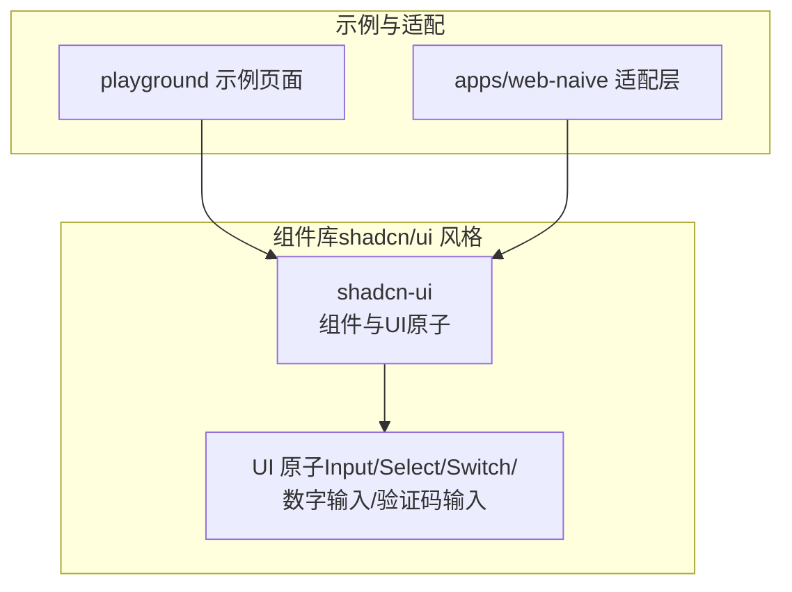
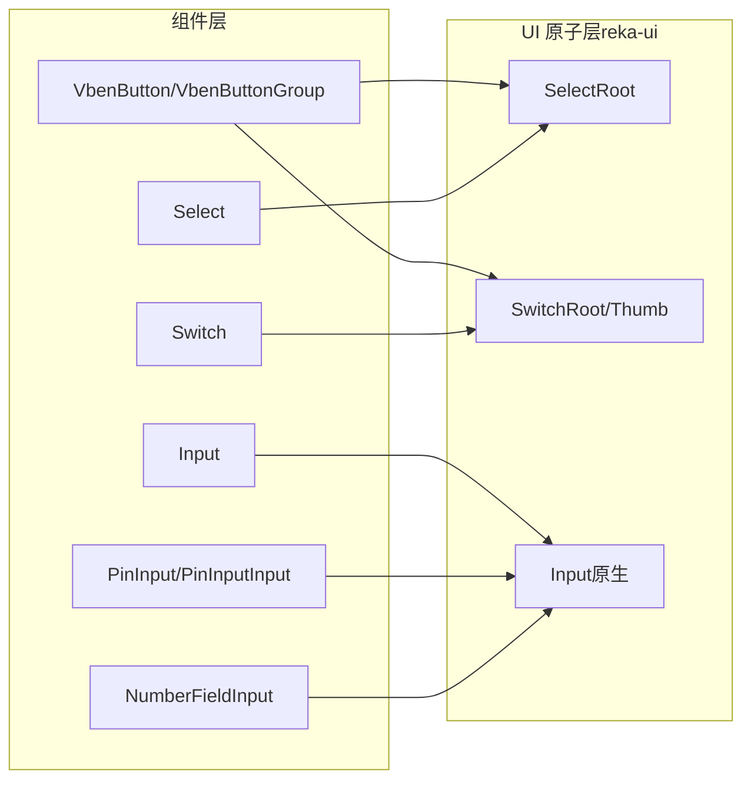
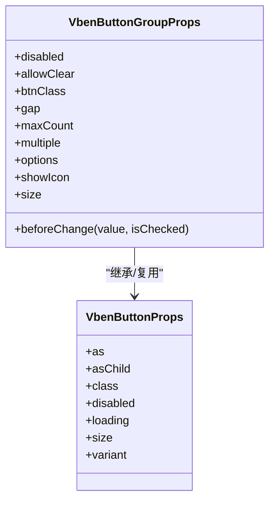
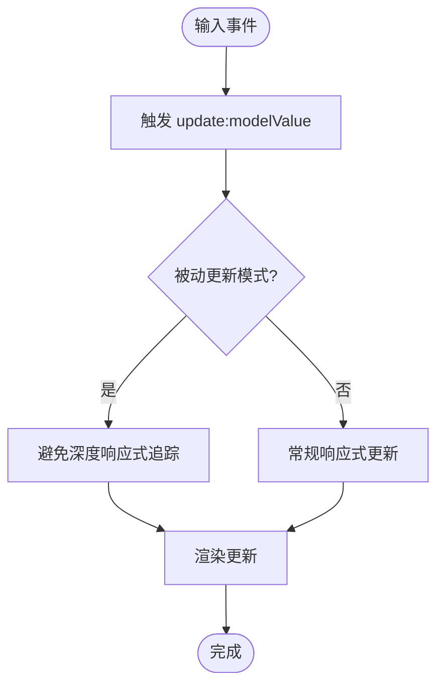
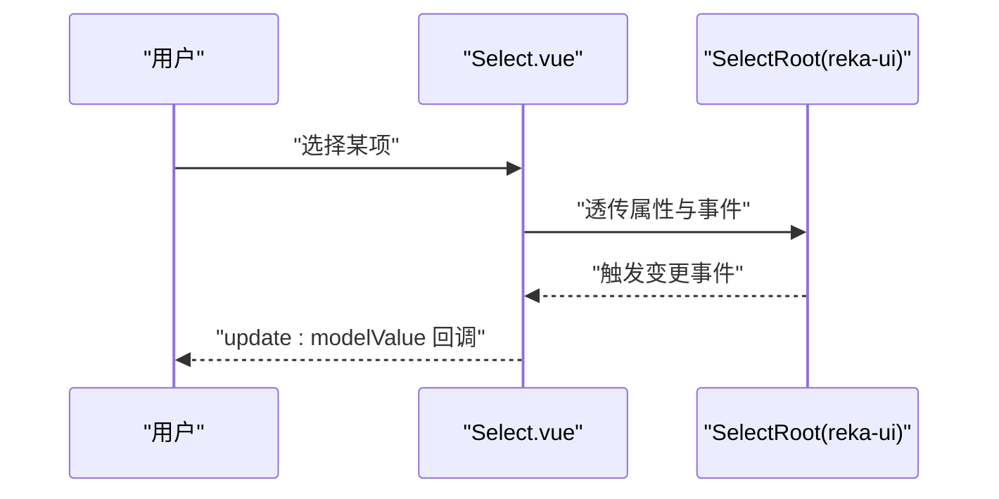
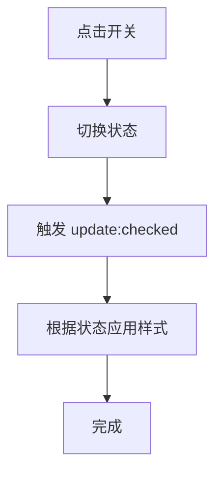
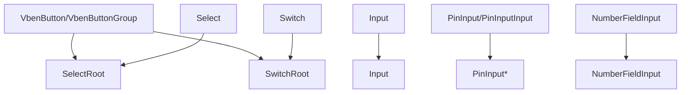

# 基础组件

<cite>
**本文引用的文件**
- [button.ts](file://packages/@core/ui-kit/shadcn-ui/src/components/button/button.ts)
- [button.vue](file://packages/@core/ui-kit/shadcn-ui/src/components/button/button.vue)
- [Input.vue](file://packages/@core/ui-kit/shadcn-ui/src/ui/input/Input.vue)
- [Select.vue](file://packages/@core/ui-kit/shadcn-ui/src/ui/select/Select.vue)
- [Switch.vue](file://packages/@core/ui-kit/shadcn-ui/src/ui/switch/Switch.vue)
- [index.ts](file://packages/@core/ui-kit/shadcn-ui/src/ui/index.ts)
- [PinInput.vue](file://packages/@core/ui-kit/shadcn-ui/src/ui/pin-input/PinInput.vue)
- [PinInputInput.vue](file://packages/@core/ui-kit/shadcn-ui/src/ui/pin-input/PinInputInput.vue)
- [NumberFieldInput.vue](file://packages/@core/ui-kit/shadcn-ui/src/ui/number-field/NumberFieldInput.vue)
- [AlertBuilder.ts](file://packages/@core/ui-kit/popup-ui/src/alert/AlertBuilder.ts)
- [index.vue](file://playground/src/views/examples/button-group/index.vue)
- [index.vue](file://playground/src/views/demos/features/icons/index.vue)
- [index.ts](file://apps/web-naive/src/adapter/component/index.ts)
</cite>

## 目录

1. [引言](#引言)
2. [项目结构](#项目结构)
3. [核心组件](#核心组件)
4. [架构总览](#架构总览)
5. [组件详解](#组件详解)
6. [依赖关系分析](#依赖关系分析)
7. [性能与异步加载](#性能与异步加载)
8. [可访问性与兼容性](#可访问性与兼容性)
9. [最佳实践与排错指南](#最佳实践与排错指南)
10. [结论](#结论)

## 引言

本文件面向 shiyu-ui 项目中的基础 UI 组件，围绕按钮、输入框、选择器、开关、分隔线等常用控件进行系统化说明。重点涵盖设计理念、属性配置、事件处理、样式定制、异步加载机制与性能优化策略，并提供可访问性与跨浏览器兼容性建议，帮助开发者正确使用与扩展组件能力。

## 项目结构

shiyu-ui 的基础组件主要由两部分构成：

- shadcn/ui 风格的通用组件库：位于 packages/@core/ui-kit/shadcn-ui，采用 reka-ui 作为底层原子能力，提供统一的语义化变体与尺寸体系。
- 业务示例与适配层：位于 playground 与 apps/web-naive，用于演示组件使用方式与对接第三方 UI 库（如 naive-ui、ant-design-vue）。

图表来源

- [index.ts](file://packages/@core/ui-kit/shadcn-ui/src/ui/index.ts)
- [Input.vue](file://packages/@core/ui-kit/shadcn-ui/src/ui/input/Input.vue)
- [Select.vue](file://packages/@core/ui-kit/shadcn-ui/src/ui/select/Select.vue)
- [Switch.vue](file://packages/@core/ui-kit/shadcn-ui/src/ui/switch/Switch.vue)
- [index.vue](file://playground/src/views/examples/button-group/index.vue)
- [index.ts](file://apps/web-naive/src/adapter/component/index.ts)

章节来源

- [index.ts](file://packages/@core/ui-kit/shadcn-ui/src/ui/index.ts)
- [Input.vue](file://packages/@core/ui-kit/shadcn-ui/src/ui/input/Input.vue)
- [Select.vue](file://packages/@core/ui-kit/shadcn-ui/src/ui/select/Select.vue)
- [Switch.vue](file://packages/@core/ui-kit/shadcn-ui/src/ui/switch/Switch.vue)
- [index.vue](file://playground/src/views/examples/button-group/index.vue)
- [index.ts](file://apps/web-naive/src/adapter/component/index.ts)

## 核心组件

本节概述基础组件的能力边界与通用特性：

- 按钮与按钮组：支持变体、尺寸、禁用、加载态、图标展示、多选/单选模式、前置回调与清空能力。
- 输入类：基础输入、密码输入、数字输入、验证码输入（PIN）、数值字段输入。
- 选择器：基于 reka-ui 的 Select 原子能力封装，提供受控与非受控行为。
- 开关：基于 reka-ui 的 Switch 原子能力封装，支持受控切换与样式定制。
- 分割线：作为布局与视觉分隔元素，通常以容器或装饰元素形式存在，配合栅格与间距系统使用。

章节来源

- [button.ts](file://packages/@core/ui-kit/shadcn-ui/src/components/button/button.ts)
- [button.vue](file://packages/@core/ui-kit/shadcn-ui/src/components/button/button.vue)
- [Input.vue](file://packages/@core/ui-kit/shadcn-ui/src/ui/input/Input.vue)
- [Select.vue](file://packages/@core/ui-kit/shadcn-ui/src/ui/select/Select.vue)
- [Switch.vue](file://packages/@core/ui-kit/shadcn-ui/src/ui/switch/Switch.vue)
- [PinInput.vue](file://packages/@core/ui-kit/shadcn-ui/src/ui/pin-input/PinInput.vue)
- [PinInputInput.vue](file://packages/@core/ui-kit/shadcn-ui/src/ui/pin-input/PinInputInput.vue)
- [NumberFieldInput.vue](file://packages/@core/ui-kit/shadcn-ui/src/ui/number-field/NumberFieldInput.vue)

## 架构总览

组件库采用“组件层 + UI 原子层”的分层设计：

- 组件层：提供语义化变体与交互语义（如按钮的 variant/size），负责组合与行为编排。
- UI 原子层：基于 reka-ui 的基础原子组件（如 SelectRoot、SwitchRoot），负责底层 DOM 行为与状态管理。
- 适配层：将第三方 UI 库（如 naive-ui、ant-design-vue）的组件映射到统一的适配接口，便于在不同技术栈间复用。

图表来源

- [button.ts](file://packages/@core/ui-kit/shadcn-ui/src/components/button/button.ts)
- [button.vue](file://packages/@core/ui-kit/shadcn-ui/src/components/button/button.vue)
- [Input.vue](file://packages/@core/ui-kit/shadcn-ui/src/ui/input/Input.vue)
- [Select.vue](file://packages/@core/ui-kit/shadcn-ui/src/ui/select/Select.vue)
- [Switch.vue](file://packages/@core/ui-kit/shadcn-ui/src/ui/switch/Switch.vue)
- [PinInput.vue](file://packages/@core/ui-kit/shadcn-ui/src/ui/pin-input/PinInput.vue)
- [PinInputInput.vue](file://packages/@core/ui-kit/shadcn-ui/src/ui/pin-input/PinInputInput.vue)
- [NumberFieldInput.vue](file://packages/@core/ui-kit/shadcn-ui/src/ui/number-field/NumberFieldInput.vue)

## 组件详解

### 按钮与按钮组

- 设计理念
  - 通过变体（variant）与尺寸（size）统一风格；支持 as/asChild 改写渲染标签或组合子元素。
  - 按钮组支持单选/多选、前置回调（beforeChange）与清空（allowClear），并可控制按钮间距与图标展示。
- 关键属性
  - VbenButtonProps：as、asChild、class、disabled、loading、size、variant。
  - VbenButtonGroupProps：disabled、allowClear、beforeChange、btnClass、gap、maxCount、multiple、options、showIcon、size。
- 事件与行为
  - 支持点击事件透传；多选模式下通过 beforeChange 实现异步确认。
  - 允许在单选模式下清空选中值（返回 undefined）。
- 样式定制
  - 通过 class 注入 Tailwind/CSS 变体；内部使用 cn 合并默认样式与自定义类。
- 性能与异步
  - 前置回调返回 Promise 时，按钮组会等待异步完成再更新状态，避免竞态。
  - 多选场景可通过 maxCount 限制选择数量，减少不必要的渲染。

图表来源

- [button.ts](file://packages/@core/ui-kit/shadcn-ui/src/components/button/button.ts)

章节来源

- [button.ts](file://packages/@core/ui-kit/shadcn-ui/src/components/button/button.ts)
- [button.vue](file://packages/@core/ui-kit/shadcn-ui/src/components/button/button.vue)
- [index.vue](file://playground/src/views/examples/button-group/index.vue)

### 输入框（Input）

- 设计理念
  - 基于原生 input，提供受控绑定与默认样式；支持被动更新（passive）以降低抖动。
- 关键属性
  - modelValue/defaultValue/class。
- 事件与行为
  - update:modelValue 事件用于双向绑定；内部使用 useVModel 管理 v-model。
- 样式定制
  - 默认包含边框、圆角、占位符颜色、聚焦环等；可通过 class 覆盖。
  - 内置针对 WebKit/Edge 的输入增强按钮隐藏，提升一致性。
- 性能与异步
  - 被动更新策略减少不必要的响应式开销；适合高频输入场景。

图表来源

- [Input.vue](file://packages/@core/ui-kit/shadcn-ui/src/ui/input/Input.vue)

章节来源

- [Input.vue](file://packages/@core/ui-kit/shadcn-ui/src/ui/input/Input.vue)

### 选择器（Select）

- 设计理念
  - 基于 reka-ui 的 SelectRoot，提供受控/非受控行为与插槽扩展。
- 关键属性
  - 接收 SelectRootProps 并透传；通过 v-bind 绑定所有属性与事件。
- 事件与行为
  - 事件透传至 SelectRoot，保持与 reka-ui 一致的行为模型。
- 样式定制
  - 可通过外部容器或主题变量调整外观；内部不强制样式。
- 性能与异步
  - 无额外异步逻辑，渲染与交互直接委托给 reka-ui。

图表来源

- [Select.vue](file://packages/@core/ui-kit/shadcn-ui/src/ui/select/Select.vue)

章节来源

- [Select.vue](file://packages/@core/ui-kit/shadcn-ui/src/ui/select/Select.vue)

### 开关（Switch）

- 设计理念
  - 基于 reka-ui 的 SwitchRoot 与 SwitchThumb，提供受控切换与视觉反馈。
- 关键属性
  - 接收 SwitchRootProps 并透传；支持 class 自定义样式。
- 事件与行为
  - 事件透传；内部对 class 进行剥离后转发，避免样式污染。
- 样式定制
  - 默认提供尺寸、过渡与焦点环；可通过 class 覆盖。
- 性能与异步
  - 切换为纯前端状态变化，无网络请求；异步场景需在上层业务中处理。

图表来源

- [Switch.vue](file://packages/@core/ui-kit/shadcn-ui/src/ui/switch/Switch.vue)

章节来源

- [Switch.vue](file://packages/@core/ui-kit/shadcn-ui/src/ui/switch/Switch.vue)

### 分割线（Divider）

- 设计理念
  - 作为视觉与布局分隔元素，通常以容器或装饰元素形式出现，配合栅格与间距系统使用。
- 关键属性
  - 一般无需复杂属性，主要通过容器样式与主题变量控制外观。
- 事件与行为
  - 无交互行为，仅用于布局分隔。
- 样式定制
  - 可通过容器类名与主题变量控制方向、长度、颜色与间距。
- 性能与异步
  - 无性能开销，渲染成本极低。

### 密码输入（InputPassword）

- 设计理念
  - 在基础 Input 上增加可见性切换与安全输入体验。
- 关键属性
  - 继承 Input 的 modelValue/defaultValue/class。
- 事件与行为
  - 与 Input 一致的 v-model 行为；上层可控制显示/隐藏。
- 样式定制
  - 可通过 class 覆盖默认样式。
- 性能与异步
  - 与 Input 类似，采用被动更新策略。

### 数字输入（NumberFieldInput）

- 设计理念
  - 基于 reka-ui 的 NumberFieldInput，提供数值范围、步进与格式化输入体验。
- 关键属性
  - 接收 reka-ui 的 NumberFieldInput 相关属性并透传。
- 事件与行为
  - 事件透传；支持最小值/最大值与步进控制。
- 样式定制
  - 可通过 class 覆盖默认样式。
- 性能与异步
  - 无额外异步逻辑，渲染与校验委托给 reka-ui。

### 验证码输入（PinInput/PinInputInput）

- 设计理念
  - 提供固定长度的字符输入，常用于短信验证码、支付密码等场景。
- 关键属性
  - PinInput/PinInputInput 接收 reka-ui 的对应属性并透传。
- 事件与行为
  - 事件透传；支持自动聚焦下一个输入框、粘贴拆分等。
- 样式定制
  - 可通过 class 覆盖默认样式。
- 性能与异步
  - 无额外异步逻辑，渲染与交互委托给 reka-ui。

章节来源

- [PinInput.vue](file://packages/@core/ui-kit/shadcn-ui/src/ui/pin-input/PinInput.vue)
- [PinInputInput.vue](file://packages/@core/ui-kit/shadcn-ui/src/ui/pin-input/PinInputInput.vue)
- [NumberFieldInput.vue](file://packages/@core/ui-kit/shadcn-ui/src/ui/number-field/NumberFieldInput.vue)

## 依赖关系分析

- 组件到 UI 原子
  - VbenButton/VbenButtonGroup 依赖 reka-ui 的 SelectRoot 与 SwitchRoot（通过组合使用）。
  - Input/NumberFieldInput/PinInput 等直接依赖 reka-ui 或原生 input。
- 适配层
  - apps/web-naive 的适配层将 naive-ui 的组件按需懒加载，减少首屏体积。
- 示例与使用
  - playground 展示了按钮组、图标选择器等典型用法，便于理解组件组合与行为。

图表来源

- [button.ts](file://packages/@core/ui-kit/shadcn-ui/src/components/button/button.ts)
- [button.vue](file://packages/@core/ui-kit/shadcn-ui/src/components/button/button.vue)
- [Input.vue](file://packages/@core/ui-kit/shadcn-ui/src/ui/input/Input.vue)
- [Select.vue](file://packages/@core/ui-kit/shadcn-ui/src/ui/select/Select.vue)
- [Switch.vue](file://packages/@core/ui-kit/shadcn-ui/src/ui/switch/Switch.vue)
- [PinInput.vue](file://packages/@core/ui-kit/shadcn-ui/src/ui/pin-input/PinInput.vue)
- [PinInputInput.vue](file://packages/@core/ui-kit/shadcn-ui/src/ui/pin-input/PinInputInput.vue)
- [NumberFieldInput.vue](file://packages/@core/ui-kit/shadcn-ui/src/ui/number-field/NumberFieldInput.vue)

章节来源

- [button.ts](file://packages/@core/ui-kit/shadcn-ui/src/components/button/button.ts)
- [button.vue](file://packages/@core/ui-kit/shadcn-ui/src/components/button/button.vue)
- [Input.vue](file://packages/@core/ui-kit/shadcn-ui/src/ui/input/Input.vue)
- [Select.vue](file://packages/@core/ui-kit/shadcn-ui/src/ui/select/Select.vue)
- [Switch.vue](file://packages/@core/ui-kit/shadcn-ui/src/ui/switch/Switch.vue)
- [PinInput.vue](file://packages/@core/ui-kit/shadcn-ui/src/ui/pin-input/PinInput.vue)
- [PinInputInput.vue](file://packages/@core/ui-kit/shadcn-ui/src/ui/pin-input/PinInputInput.vue)
- [NumberFieldInput.vue](file://packages/@core/ui-kit/shadcn-ui/src/ui/number-field/NumberFieldInput.vue)
- [index.ts](file://apps/web-naive/src/adapter/component/index.ts)

## 性能与异步加载

- 组件层面的性能优化
  - 输入类组件普遍采用被动更新策略，降低响应式追踪成本，适合高频输入场景。
  - 按钮组的前置回调支持 Promise，避免状态竞态；同时通过 maxCount 控制多选数量，减少渲染压力。
- 异步加载机制
  - 适配层对第三方 UI 组件（如 naive-ui 的按钮、输入、选择器等）采用动态 import 懒加载，按需加载，显著降低首屏体积。
- 事件与状态管理
  - 组件通过透传事件与属性，保持与底层原子组件一致的响应式行为，避免重复封装导致的性能损耗。

章节来源

- [Input.vue](file://packages/@core/ui-kit/shadcn-ui/src/ui/input/Input.vue)
- [button.ts](file://packages/@core/ui-kit/shadcn-ui/src/components/button/button.ts)
- [index.ts](file://apps/web-naive/src/adapter/component/index.ts)

## 可访问性与兼容性

- 可访问性（无障碍）
  - 按钮与开关均保留原生交互语义，支持键盘操作与焦点环；建议在业务层补充 aria-label/aria-describedby 等语义属性。
  - 输入类组件保持原生可读性与可复制性，避免过度样式覆盖影响屏幕阅读器体验。
- 跨浏览器兼容性
  - 输入类组件内置针对 WebKit/Edge 的输入增强按钮隐藏，减少不同浏览器的差异表现。
  - 选择器与开关基于 reka-ui，遵循现代浏览器标准；如需兼容旧版浏览器，建议在构建阶段引入 polyfill。

章节来源

- [Input.vue](file://packages/@core/ui-kit/shadcn-ui/src/ui/input/Input.vue)
- [Switch.vue](file://packages/@core/ui-kit/shadcn-ui/src/ui/switch/Switch.vue)
- [Select.vue](file://packages/@core/ui-kit/shadcn-ui/src/ui/select/Select.vue)

## 最佳实践与排错指南

- 最佳实践
  - 按钮组多选场景建议设置 maxCount，避免过多渲染；前置回调返回 Promise 时，务必在 UI 中提示加载状态。
  - 输入类组件优先使用被动更新策略；在高频输入场景中避免频繁重渲染。
  - 选择器与开关尽量保持受控模式，确保状态一致性；必要时通过 class 覆盖样式，但避免破坏可访问性。
- 常见问题
  - 按钮组无法切换：检查 beforeChange 返回值与 Promise 解析时机；确认 allowClear 与 multiple 配置是否符合预期。
  - 输入框样式异常：检查 class 覆盖是否与默认样式冲突；确认浏览器厂商前缀相关样式是否被正确隐藏。
  - 选择器/开关无响应：确认事件是否正确透传；检查父级容器是否有阻止事件冒泡的行为。
- 示例参考
  - 按钮组与图标选择器的使用示例可参考 playground 页面，便于快速验证组件行为与组合效果。

章节来源

- [index.vue](file://playground/src/views/examples/button-group/index.vue)
- [index.vue](file://playground/src/views/demos/features/icons/index.vue)
- [AlertBuilder.ts](file://packages/@core/ui-kit/popup-ui/src/alert/AlertBuilder.ts)

## 结论

shiyu-ui 的基础组件以 shadcn/ui 风格为核心，结合 reka-ui 原子能力，提供了统一的变体、尺寸与交互语义。通过被动更新、懒加载与事件透传等策略，兼顾了易用性与性能。建议在实际项目中遵循可访问性与跨浏览器兼容性原则，结合示例与适配层的最佳实践，快速搭建稳定可靠的界面交互。
