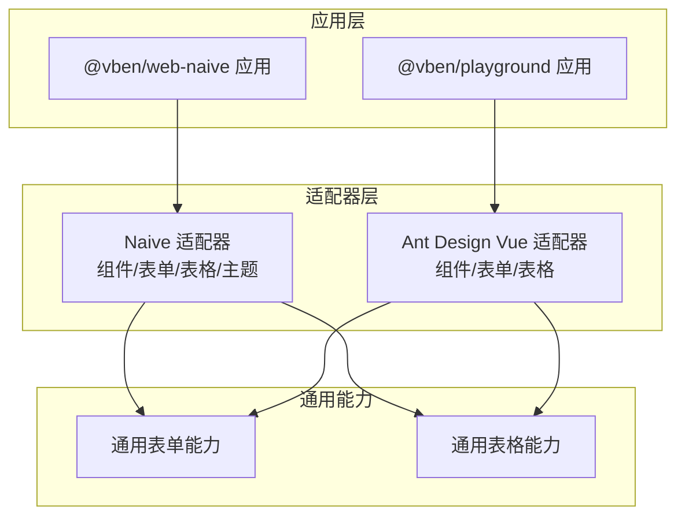
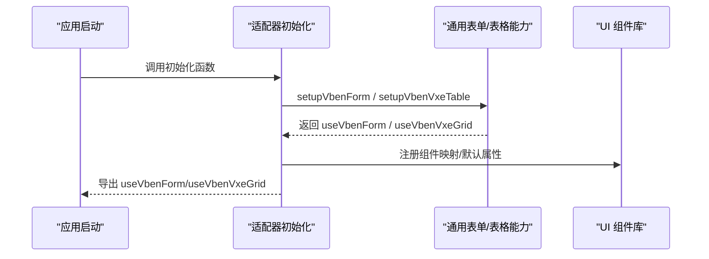
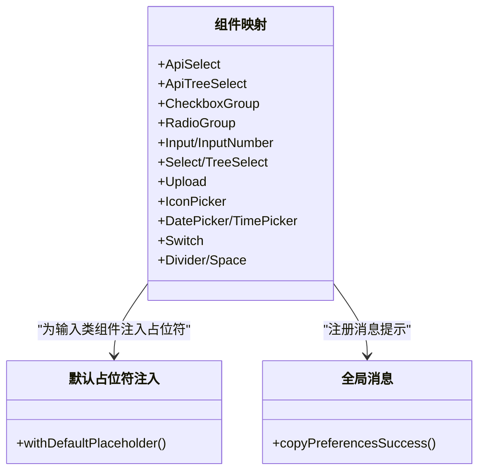
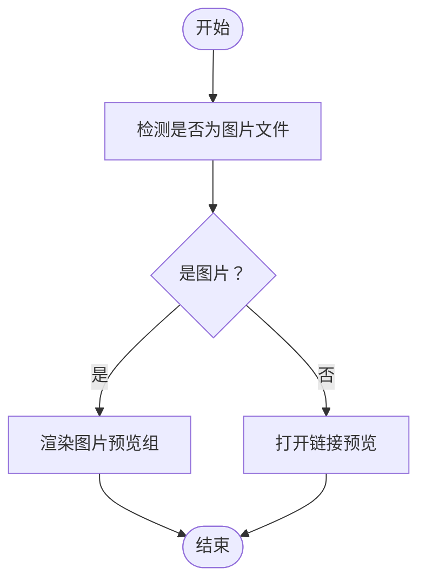
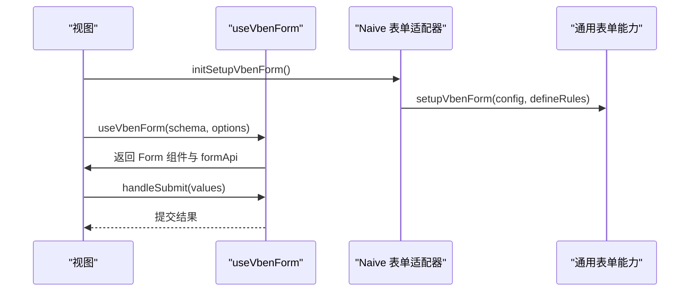
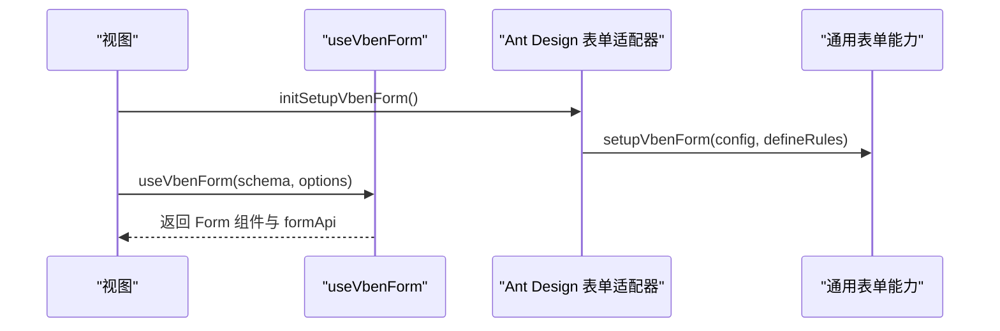
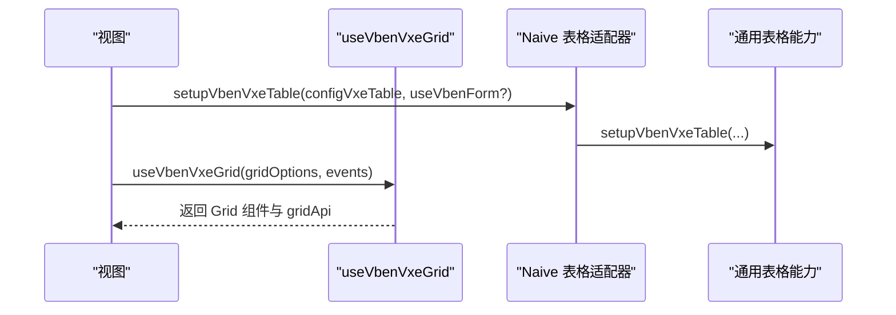
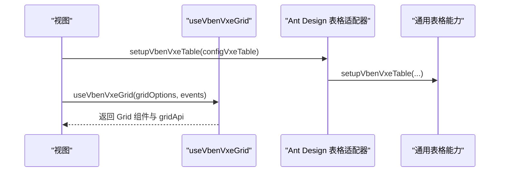
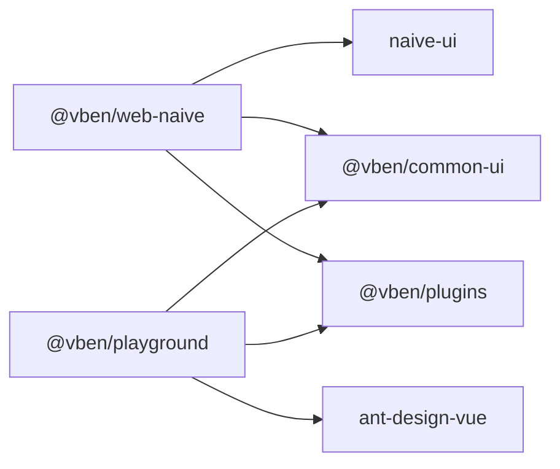

# 组件库

<cite>
**本文引用的文件**
- [apps/web-naive/src/adapter/component/index.ts](file://apps/web-naive/src/adapter/component/index.ts)
- [apps/web-naive/src/adapter/form.ts](file://apps/web-naive/src/adapter/form.ts)
- [apps/web-naive/src/adapter/vxe-table.ts](file://apps/web-naive/src/adapter/vxe-table.ts)
- [apps/web-naive/src/adapter/naive.ts](file://apps/web-naive/src/adapter/naive.ts)
- [apps/web-naive/src/views/demos/form/basic.vue](file://apps/web-naive/src/views/demos/form/basic.vue)
- [apps/web-naive/src/views/demos/table/index.vue](file://apps/web-naive/src/views/demos/table/index.vue)
- [playground/src/adapter/component/index.ts](file://playground/src/adapter/component/index.ts)
- [playground/src/adapter/form.ts](file://playground/src/adapter/form.ts)
- [playground/src/adapter/vxe-table.ts](file://playground/src/adapter/vxe-table.ts)
- [playground/src/views/examples/form/basic.vue](file://playground/src/views/examples/form/basic.vue)
- [playground/src/views/examples/vxe-table/basic.vue](file://playground/src/views/examples/vxe-table/basic.vue)
- [package.json](file://package.json)
- [apps/web-naive/package.json](file://apps/web-naive/package.json)
</cite>

## 目录

1. [简介](#简介)
2. [项目结构](#项目结构)
3. [核心组件](#核心组件)
4. [架构总览](#架构总览)
5. [详细组件分析](#详细组件分析)
6. [依赖关系分析](#依赖关系分析)
7. [性能考量](#性能考量)
8. [故障排查指南](#故障排查指南)
9. [结论](#结论)
10. [附录](#附录)

## 简介

本文件面向 shiyu-ui 项目的组件库使用者与扩展者，系统性阐述基础组件、表单组件、表格组件的实现与使用方式；解释组件适配器如何桥接不同 UI 框架（Naive UI、Ant Design Vue），并给出最佳实践与性能优化建议。目标是帮助开发者高效使用与扩展组件库功能。

## 项目结构

组件库以“适配器 + 通用 UI 能力”为核心设计：

- 适配器负责将通用组件类型映射到具体 UI 框架组件，并注入默认行为（如占位符、模型属性名映射、校验规则、消息提示等）。
- 通用表单与表格能力由公共包提供，适配器在各自应用中初始化，形成统一的表单/表格体验。

图表来源

- [apps/web-naive/src/adapter/component/index.ts:163-274](file://apps/web-naive/src/adapter/component/index.ts#L163-L274)
- [apps/web-naive/src/adapter/form.ts:11-42](file://apps/web-naive/src/adapter/form.ts#L11-L42)
- [apps/web-naive/src/adapter/vxe-table.ts:21-257](file://apps/web-naive/src/adapter/vxe-table.ts#L21-L257)
- [playground/src/adapter/component/index.ts:671-753](file://playground/src/adapter/component/index.ts#L671-L753)
- [playground/src/adapter/form.ts:11-41](file://playground/src/adapter/form.ts#L11-L41)
- [playground/src/adapter/vxe-table.ts:21-282](file://playground/src/adapter/vxe-table.ts#L21-L282)

章节来源

- [apps/web-naive/src/adapter/component/index.ts:163-274](file://apps/web-naive/src/adapter/component/index.ts#L163-L274)
- [playground/src/adapter/component/index.ts:671-753](file://playground/src/adapter/component/index.ts#L671-L753)
- [apps/web-naive/src/adapter/form.ts:11-42](file://apps/web-naive/src/adapter/form.ts#L11-L42)
- [playground/src/adapter/form.ts:11-41](file://playground/src/adapter/form.ts#L11-L41)
- [apps/web-naive/src/adapter/vxe-table.ts:21-257](file://apps/web-naive/src/adapter/vxe-table.ts#L21-L257)
- [playground/src/adapter/vxe-table.ts:21-282](file://playground/src/adapter/vxe-table.ts#L21-L282)

## 核心组件

- 基础组件：Input、InputNumber、Select、TreeSelect、DatePicker、TimePicker、CheckboxGroup、RadioGroup、Switch、Upload、IconPicker、Divider、Space 等。适配器将这些组件注册为通用组件类型，供表单/抽屉/模态框等复用。
- 表单组件：基于通用表单能力，结合适配器的组件映射与校验规则，实现声明式 schema 驱动的表单构建、字段映射、布局控制与校验。
- 表格组件：基于 vxe-table 的二次封装，提供默认网格配置、单元格渲染器（图片、链接、标签、开关）、操作按钮渲染器、分页/排序/筛选代理等。

章节来源

- [apps/web-naive/src/adapter/component/index.ts:122-161](file://apps/web-naive/src/adapter/component/index.ts#L122-L161)
- [playground/src/adapter/component/index.ts:604-669](file://playground/src/adapter/component/index.ts#L604-L669)
- [apps/web-naive/src/adapter/form.ts:11-42](file://apps/web-naive/src/adapter/form.ts#L11-L42)
- [playground/src/adapter/form.ts:11-41](file://playground/src/adapter/form.ts#L11-L41)
- [apps/web-naive/src/adapter/vxe-table.ts:21-257](file://apps/web-naive/src/adapter/vxe-table.ts#L21-L257)
- [playground/src/adapter/vxe-table.ts:21-282](file://playground/src/adapter/vxe-table.ts#L21-L282)

## 架构总览

组件适配器通过初始化函数完成三类职责：

- 组件映射：将通用组件类型映射到具体 UI 组件，并注入默认属性（如占位符、模型属性名）。
- 表单配置：设置表单默认行为（空值策略、模型属性名映射、校验规则等）。
- 表格配置：设置 vxe-grid 默认配置、注册单元格渲染器与操作按钮渲染器。

图表来源

- [apps/web-naive/src/adapter/form.ts:11-42](file://apps/web-naive/src/adapter/form.ts#L11-L42)
- [apps/web-naive/src/adapter/vxe-table.ts:21-257](file://apps/web-naive/src/adapter/vxe-table.ts#L21-L257)
- [apps/web-naive/src/adapter/component/index.ts:163-274](file://apps/web-naive/src/adapter/component/index.ts#L163-L274)
- [playground/src/adapter/form.ts:11-41](file://playground/src/adapter/form.ts#L11-L41)
- [playground/src/adapter/vxe-table.ts:21-282](file://playground/src/adapter/vxe-table.ts#L21-L282)
- [playground/src/adapter/component/index.ts:671-753](file://playground/src/adapter/component/index.ts#L671-L753)

## 详细组件分析

### 基础组件适配器（Naive UI）

- 设计要点
  - 通过异步组件按需加载，降低首屏体积。
  - 为常用输入类组件注入默认占位符，提升一致性。
  - 将 CheckboxGroup/RadioGroup 的 options 渲染为子节点，简化使用。
  - 为 Upload 注入默认插槽与行为，统一上传体验。
- 关键点
  - 组件类型与 props 映射：ComponentType 与 ComponentPropsMap 一一对应，便于 schema 联动提示。
  - 全局消息提示：通过共享状态定义复制成功等消息提示。

图表来源

- [apps/web-naive/src/adapter/component/index.ts:87-119](file://apps/web-naive/src/adapter/component/index.ts#L87-L119)
- [apps/web-naive/src/adapter/component/index.ts:163-274](file://apps/web-naive/src/adapter/component/index.ts#L163-L274)

章节来源

- [apps/web-naive/src/adapter/component/index.ts:163-274](file://apps/web-naive/src/adapter/component/index.ts#L163-L274)

### 基础组件适配器（Ant Design Vue）

- 设计要点
  - 丰富组件覆盖：新增 AutoComplete、Cascader、Mentions、Textarea、RangePicker、RichEditor、CollapsibleParams 等。
  - Upload 增强：支持拖拽排序、图片裁剪、预览、大小限制、onChange 扩展等。
  - 消息体系：使用 notification 替代 message，提供更丰富的反馈。
- 关键点
  - 组件类型与 props 映射：ComponentType 与 ComponentPropsMap 一一对应，便于 schema 联动提示。
  - 上传增强：withPreviewUpload 包装 Upload，统一上传行为。

图表来源

- [playground/src/adapter/component/index.ts:186-202](file://playground/src/adapter/component/index.ts#L186-L202)
- [playground/src/adapter/component/index.ts:241-315](file://playground/src/adapter/component/index.ts#L241-L315)

章节来源

- [playground/src/adapter/component/index.ts:671-753](file://playground/src/adapter/component/index.ts#L671-L753)

### 表单适配器（Naive UI）

- 设计要点
  - 空值策略：将空值统一为 null，保证重置表单生效。
  - 模型属性名映射：针对 Checkbox/Radio/Upload 等组件设置正确的 v-model 名称。
  - 校验规则：提供 required、selectRequired 等国际化校验。
- 使用方式
  - 在视图中通过 useVbenForm 初始化表单，传入 schema、布局、校验规则与提交回调。
  - 通过 formApi 控制表单值、重置、校验等。

图表来源

- [apps/web-naive/src/adapter/form.ts:11-42](file://apps/web-naive/src/adapter/form.ts#L11-L42)
- [apps/web-naive/src/views/demos/form/basic.vue:13-147](file://apps/web-naive/src/views/demos/form/basic.vue#L13-L147)

章节来源

- [apps/web-naive/src/adapter/form.ts:11-42](file://apps/web-naive/src/adapter/form.ts#L11-L42)
- [apps/web-naive/src/views/demos/form/basic.vue:13-147](file://apps/web-naive/src/views/demos/form/basic.vue#L13-L147)

### 表单适配器（Ant Design Vue）

- 设计要点
  - 模型属性名映射：Checkbox/Radio/Switch/Upload 等组件的 checked/value/fileList 等。
  - 校验规则：国际化 required/selectRequired。
- 使用方式
  - 在视图中通过 useVbenForm 初始化表单，传入复杂 schema（含远程搜索、富文本、上传等）。

图表来源

- [playground/src/adapter/form.ts:11-41](file://playground/src/adapter/form.ts#L11-L41)
- [playground/src/views/examples/form/basic.vue:36-421](file://playground/src/views/examples/form/basic.vue#L36-L421)

章节来源

- [playground/src/adapter/form.ts:11-41](file://playground/src/adapter/form.ts#L11-L41)
- [playground/src/views/examples/form/basic.vue:36-421](file://playground/src/views/examples/form/basic.vue#L36-L421)

### 表格适配器（Naive UI）

- 设计要点
  - 默认网格配置：对齐、边框、圆角、溢出、代理响应结构等。
  - 单元格渲染器：CellImage、CellLink、CellTag、CellSwitch。
  - 操作按钮渲染器：CellOperation，支持弹窗确认、对齐与图标。
- 使用方式
  - 通过 setupVbenVxeTable 初始化，返回 useVbenVxeGrid，传入 gridOptions 与事件监听。

图表来源

- [apps/web-naive/src/adapter/vxe-table.ts:21-257](file://apps/web-naive/src/adapter/vxe-table.ts#L21-L257)
- [apps/web-naive/src/views/demos/table/index.vue:1-39](file://apps/web-naive/src/views/demos/table/index.vue#L1-L39)

章节来源

- [apps/web-naive/src/adapter/vxe-table.ts:21-257](file://apps/web-naive/src/adapter/vxe-table.ts#L21-L257)
- [apps/web-naive/src/views/demos/table/index.vue:1-39](file://apps/web-naive/src/views/demos/table/index.vue#L1-L39)

### 表格适配器（Ant Design Vue）

- 设计要点
  - 默认网格配置：与 Naive 版本类似，但适配 Ant Design Vue 的组件与属性。
  - 单元格渲染器：CellImage、CellLink、CellTag、CellSwitch。
  - 操作按钮渲染器：CellOperation，支持 Popconfirm、对齐与图标。
- 使用方式
  - 通过 setupVbenVxeTable 初始化，返回 useVbenVxeGrid，传入 gridOptions 与事件监听。

图表来源

- [playground/src/adapter/vxe-table.ts:21-282](file://playground/src/adapter/vxe-table.ts#L21-L282)
- [playground/src/views/examples/vxe-table/basic.vue:22-58](file://playground/src/views/examples/vxe-table/basic.vue#L22-L58)

章节来源

- [playground/src/adapter/vxe-table.ts:21-282](file://playground/src/adapter/vxe-table.ts#L21-L282)
- [playground/src/views/examples/vxe-table/basic.vue:22-58](file://playground/src/views/examples/vxe-table/basic.vue#L22-L58)

## 依赖关系分析

- 应用依赖
  - @vben/web-naive 依赖 @vben/common-ui、@vben/plugins、naive-ui 等。
  - @vben/playground 依赖 @vben/common-ui、@vben/plugins、ant-design-vue 等。
- 适配器依赖
  - 适配器通过共享状态注册组件映射与消息提示，依赖通用表单/表格能力与 UI 组件库。

图表来源

- [apps/web-naive/package.json:28-49](file://apps/web-naive/package.json#L28-L49)
- [package.json:68-103](file://package.json#L68-L103)

章节来源

- [apps/web-naive/package.json:28-49](file://apps/web-naive/package.json#L28-L49)
- [package.json:68-103](file://package.json#L68-L103)

## 性能考量

- 组件懒加载
  - 通过 defineAsyncComponent 按需加载大型组件，减少首屏体积。
- 上传性能
  - Ant Design Vue 适配器的 Upload 增强：拖拽排序、图片裁剪、预览与大小限制，建议在大文件场景下开启裁剪与分片上传策略。
- 表格性能
  - 使用代理配置与虚拟滚动（如适用）提升大数据量渲染性能；避免在单元格渲染器中执行重型计算。
- 主题与消息
  - 通过离散 API 管理主题与消息，避免重复创建实例带来的内存压力。

## 故障排查指南

- 表单重置无效
  - 检查空值策略是否设置为 null；Naive 适配器已将 emptyStateValue 设为 null，确保表单重置生效。
- 上传文件无法预览
  - 确认 isImageFile 判断逻辑与文件类型/URL 解析；Ant Design Vue 适配器提供预览组与图片裁剪流程。
- 表格操作按钮弹窗遮挡
  - Ant Design Vue 适配器在 Popconfirm 中通过 getPopupContainer 将弹窗挂载到 body，并在打开时临时禁用表格滚动，解决固定列遮挡问题。
- 主题切换异常
  - 检查主题 Provider Props 与偏好设置；Naive 适配器根据偏好设置 light/dark 主题。

章节来源

- [apps/web-naive/src/adapter/form.ts:14-16](file://apps/web-naive/src/adapter/form.ts#L14-L16)
- [playground/src/adapter/component/index.ts:241-315](file://playground/src/adapter/component/index.ts#L241-L315)
- [playground/src/adapter/vxe-table.ts:215-263](file://playground/src/adapter/vxe-table.ts#L215-L263)
- [apps/web-naive/src/adapter/naive.ts:8-25](file://apps/web-naive/src/adapter/naive.ts#L8-L25)

## 结论

shiyu-ui 的组件库通过“通用能力 + 适配器”的架构，实现了跨 UI 框架的一致体验。基础组件、表单与表格均以声明式 schema 驱动，配合适配器的默认行为与增强能力，显著降低了开发成本。遵循本文的最佳实践与性能建议，可进一步提升开发效率与用户体验。

## 附录

- 最佳实践
  - 使用 schema 声明式定义表单字段，统一布局与校验。
  - 在适配器中集中管理组件映射与默认属性，避免重复配置。
  - 对上传、表格等复杂组件，优先使用适配器提供的增强版本。
- 扩展方法
  - 新增组件类型：在 ComponentType 与 ComponentPropsMap 中新增类型与属性映射。
  - 新增校验规则：在适配器的 defineRules 中扩展国际化规则。
  - 新增表格渲染器：在 setupVbenVxeTable 中注册 renderer，统一单元格与操作按钮渲染。
