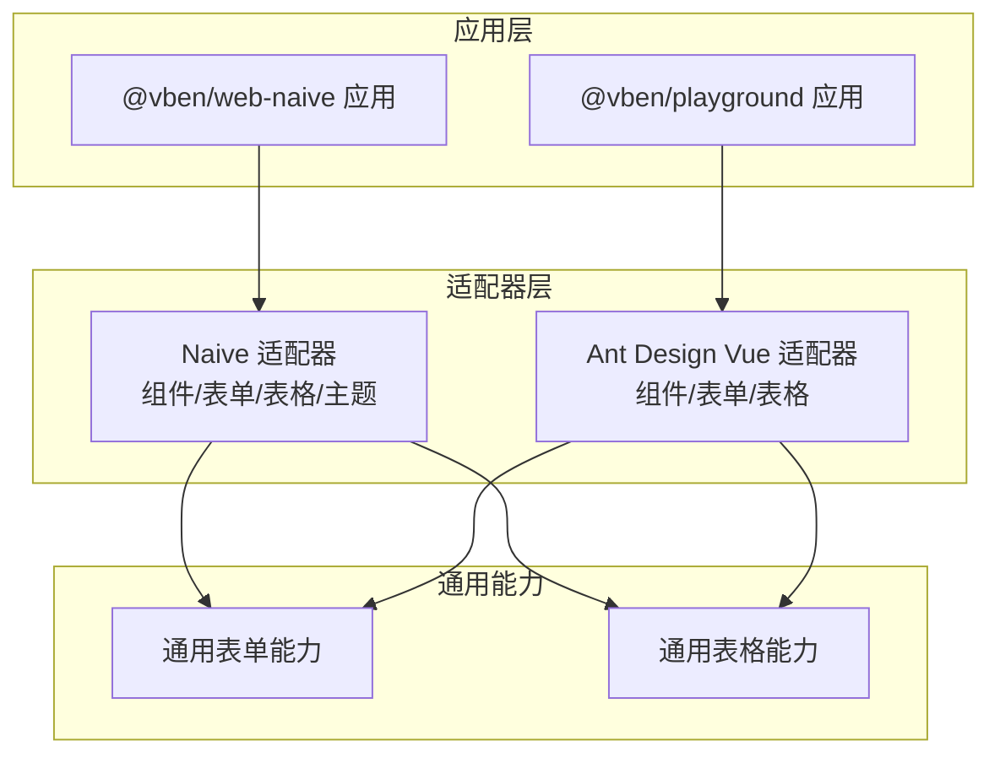
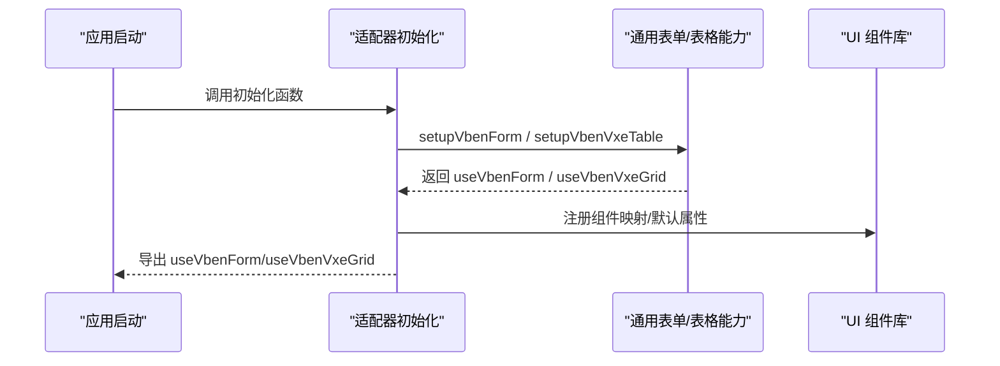
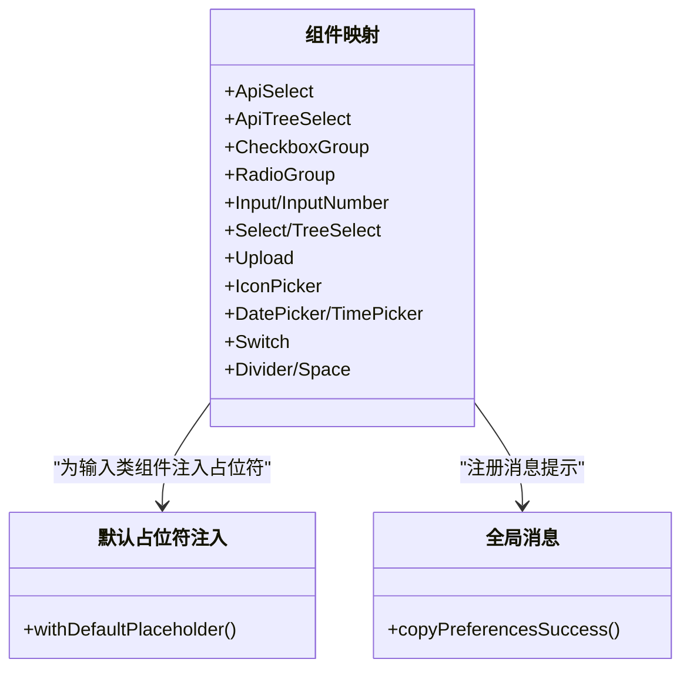
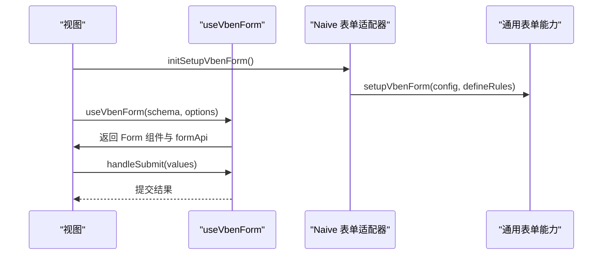
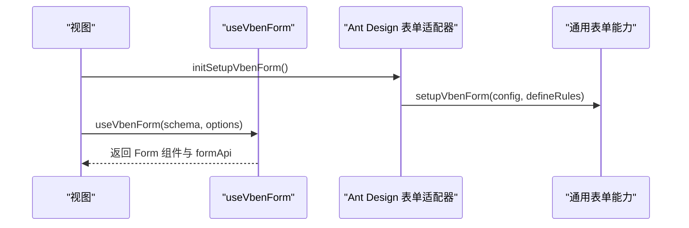
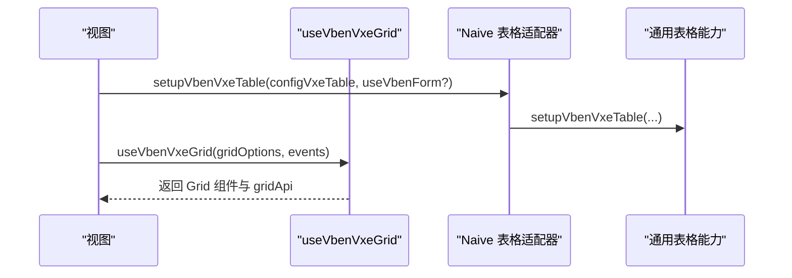
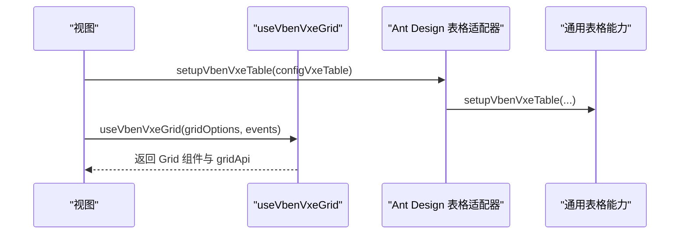
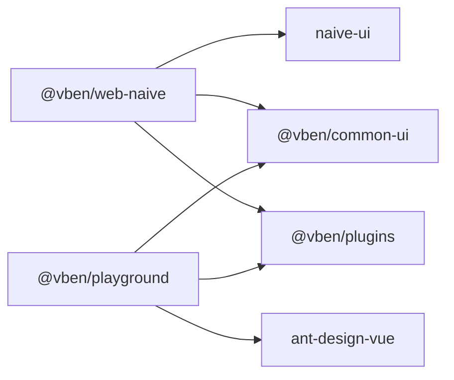

# 组件库

<cite>
**本文引用的文件**
- [apps/web-naive/src/adapter/component/index.ts](file://apps/web-naive/src/adapter/component/index.ts)
- [apps/web-naive/src/adapter/form.ts](file://apps/web-naive/src/adapter/form.ts)
- [apps/web-naive/src/adapter/vxe-table.ts](file://apps/web-naive/src/adapter/vxe-table.ts)
- [apps/web-naive/src/adapter/naive.ts](file://apps/web-naive/src/adapter/naive.ts)
- [apps/web-naive/src/views/demos/form/basic.vue](file://apps/web-naive/src/views/demos/form/basic.vue)
- [apps/web-naive/src/views/demos/table/index.vue](file://apps/web-naive/src/views/demos/table/index.vue)
- [playground/src/adapter/component/index.ts](file://playground/src/adapter/component/index.ts)
- [playground/src/adapter/form.ts](file://playground/src/adapter/form.ts)
- [playground/src/adapter/vxe-table.ts](file://playground/src/adapter/vxe-table.ts)
- [playground/src/views/examples/form/basic.vue](file://playground/src/views/examples/form/basic.vue)
- [playground/src/views/examples/vxe-table/basic.vue](file://playground/src/views/examples/vxe-table/basic.vue)
- [package.json](file://package.json)
- [apps/web-naive/package.json](file://apps/web-naive/package.json)
</cite>

## 目录

1. [简介](#简介)
2. [项目结构](#项目结构)
3. [核心组件](#核心组件)
4. [架构总览](#架构总览)
5. [详细组件分析](#详细组件分析)
6. [依赖关系分析](#依赖关系分析)
7. [性能考量](#性能考量)
8. [故障排查指南](#故障排查指南)
9. [结论](#结论)
10. [附录](#附录)

## 简介

本文件面向 shiyu-ui 项目的组件库使用者与扩展者，系统性阐述基础组件、表单组件、表格组件的实现与使用方式；解释组件适配器如何桥接不同 UI 框架（Naive UI、Ant Design Vue），并给出最佳实践与性能优化建议。目标是帮助开发者高效使用与扩展组件库功能。

## 项目结构

组件库以“适配器 + 通用 UI 能力”为核心设计：

- 适配器负责将通用组件类型映射到具体 UI 框架组件，并注入默认行为（如占位符、模型属性名映射、校验规则、消息提示等）。
- 通用表单与表格能力由公共包提供，适配器在各自应用中初始化，形成统一的表单/表格体验。



图表来源

- [apps/web-naive/src/adapter/component/index.ts:163-274](file://apps/web-naive/src/adapter/component/index.ts#L163-L274)
- [apps/web-naive/src/adapter/form.ts:11-42](file://apps/web-naive/src/adapter/form.ts#L11-L42)
- [apps/web-naive/src/adapter/vxe-table.ts:21-257](file://apps/web-naive/src/adapter/vxe-table.ts#L21-L257)
- [playground/src/adapter/component/index.ts:671-753](file://playground/src/adapter/component/index.ts#L671-L753)
- [playground/src/adapter/form.ts:11-41](file://playground/src/adapter/form.ts#L11-L41)
- [playground/src/adapter/vxe-table.ts:21-282](file://playground/src/adapter/vxe-table.ts#L21-L282)

章节来源

- [apps/web-naive/src/adapter/component/index.ts:163-274](file://apps/web-naive/src/adapter/component/index.ts#L163-L274)
- [playground/src/adapter/component/index.ts:671-753](file://playground/src/adapter/component/index.ts#L671-L753)
- [apps/web-naive/src/adapter/form.ts:11-42](file://apps/web-naive/src/adapter/form.ts#L11-L42)
- [playground/src/adapter/form.ts:11-41](file://playground/src/adapter/form.ts#L11-L41)
- [apps/web-naive/src/adapter/vxe-table.ts:21-257](file://apps/web-naive/src/adapter/vxe-table.ts#L21-L257)
- [playground/src/adapter/vxe-table.ts:21-282](file://playground/src/adapter/vxe-table.ts#L21-L282)

## 核心组件

- 基础组件：Input、InputNumber、Select、TreeSelect、DatePicker、TimePicker、CheckboxGroup、RadioGroup、Switch、Upload、IconPicker、Divider、Space 等。适配器将这些组件注册为通用组件类型，供表单/抽屉/模态框等复用。
- 表单组件：基于通用表单能力，结合适配器的组件映射与校验规则，实现声明式 schema 驱动的表单构建、字段映射、布局控制与校验。
- 表格组件：基于 vxe-table 的二次封装，提供默认网格配置、单元格渲染器（图片、链接、标签、开关）、操作按钮渲染器、分页/排序/筛选代理等。

章节来源

- [apps/web-naive/src/adapter/component/index.ts:122-161](file://apps/web-naive/src/adapter/component/index.ts#L122-L161)
- [playground/src/adapter/component/index.ts:604-669](file://playground/src/adapter/component/index.ts#L604-L669)
- [apps/web-naive/src/adapter/form.ts:11-42](file://apps/web-naive/src/adapter/form.ts#L11-L42)
- [playground/src/adapter/form.ts:11-41](file://playground/src/adapter/form.ts#L11-L41)
- [apps/web-naive/src/adapter/vxe-table.ts:21-257](file://apps/web-naive/src/adapter/vxe-table.ts#L21-L257)
- [playground/src/adapter/vxe-table.ts:21-282](file://playground/src/adapter/vxe-table.ts#L21-L282)

## 架构总览

组件适配器通过初始化函数完成三类职责：

- 组件映射：将通用组件类型映射到具体 UI 组件，并注入默认属性（如占位符、模型属性名）。
- 表单配置：设置表单默认行为（空值策略、模型属性名映射、校验规则等）。
- 表格配置：设置 vxe-grid 默认配置、注册单元格渲染器与操作按钮渲染器。



图表来源

- [apps/web-naive/src/adapter/form.ts:11-42](file://apps/web-naive/src/adapter/form.ts#L11-L42)
- [apps/web-naive/src/adapter/vxe-table.ts:21-257](file://apps/web-naive/src/adapter/vxe-table.ts#L21-L257)
- [apps/web-naive/src/adapter/component/index.ts:163-274](file://apps/web-naive/src/adapter/component/index.ts#L163-L274)
- [playground/src/adapter/form.ts:11-41](file://playground/src/adapter/form.ts#L11-L41)
- [playground/src/adapter/vxe-table.ts:21-282](file://playground/src/adapter/vxe-table.ts#L21-L282)
- [playground/src/adapter/component/index.ts:671-753](file://playground/src/adapter/component/index.ts#L671-L753)

## 详细组件分析

### 基础组件适配器（Naive UI）

- 设计要点
  - 通过异步组件按需加载，降低首屏体积。
  - 为常用输入类组件注入默认占位符，提升一致性。
  - 将 CheckboxGroup/RadioGroup 的 options 渲染为子节点，简化使用。
  - 为 Upload 注入默认插槽与行为，统一上传体验。
- 关键点
  - 组件类型与 props 映射：ComponentType 与 ComponentPropsMap 一一对应，便于 schema 联动提示。
  - 全局消息提示：通过共享状态定义复制成功等消息提示。



图表来源

- [apps/web-naive/src/adapter/component/index.ts:87-119](file://apps/web-naive/src/adapter/component/index.ts#L87-L119)
- [apps/web-naive/src/adapter/component/index.ts:163-274](file://apps/web-naive/src/adapter/component/index.ts#L163-L274)

章节来源

- [apps/web-naive/src/adapter/component/index.ts:163-274](file://apps/web-naive/src/adapter/component/index.ts#L163-L274)

### 基础组件适配器（Ant Design Vue）

- 设计要点
  - 丰富组件覆盖：新增 AutoComplete、Cascader、Mentions、Textarea、RangePicker、RichEditor、CollapsibleParams 等。
  - Upload 增强：支持拖拽排序、图片裁剪、预览、大小限制、onChange 扩展等。
  - 消息体系：使用 notification 替代 message，提供更丰富的反馈。
- 关键点
  - 组件类型与 props 映射：ComponentType 与 ComponentPropsMap 一一对应，便于 schema 联动提示。
  - 上传增强：withPreviewUpload 包装 Upload，统一上传行为。


图表来源

- [playground/src/adapter/component/index.ts:186-202](file://playground/src/adapter/component/index.ts#L186-L202)
- [playground/src/adapter/component/index.ts:241-315](file://playground/src/adapter/component/index.ts#L241-L315)

章节来源

- [playground/src/adapter/component/index.ts:671-753](file://playground/src/adapter/component/index.ts#L671-L753)

### 表单适配器（Naive UI）

- 设计要点
  - 空值策略：将空值统一为 null，保证重置表单生效。
  - 模型属性名映射：针对 Checkbox/Radio/Upload 等组件设置正确的 v-model 名称。
  - 校验规则：提供 required、selectRequired 等国际化校验。
- 使用方式
  - 在视图中通过 useVbenForm 初始化表单，传入 schema、布局、校验规则与提交回调。
  - 通过 formApi 控制表单值、重置、校验等。



图表来源

- [apps/web-naive/src/adapter/form.ts:11-42](file://apps/web-naive/src/adapter/form.ts#L11-L42)
- [apps/web-naive/src/views/demos/form/basic.vue:13-147](file://apps/web-naive/src/views/demos/form/basic.vue#L13-L147)

章节来源

- [apps/web-naive/src/adapter/form.ts:11-42](file://apps/web-naive/src/adapter/form.ts#L11-L42)
- [apps/web-naive/src/views/demos/form/basic.vue:13-147](file://apps/web-naive/src/views/demos/form/basic.vue#L13-L147)

### 表单适配器（Ant Design Vue）

- 设计要点
  - 模型属性名映射：Checkbox/Radio/Switch/Upload 等组件的 checked/value/fileList 等。
  - 校验规则：国际化 required/selectRequired。
- 使用方式
  - 在视图中通过 useVbenForm 初始化表单，传入复杂 schema（含远程搜索、富文本、上传等）。



图表来源

- [playground/src/adapter/form.ts:11-41](file://playground/src/adapter/form.ts#L11-L41)
- [playground/src/views/examples/form/basic.vue:36-421](file://playground/src/views/examples/form/basic.vue#L36-L421)

章节来源

- [playground/src/adapter/form.ts:11-41](file://playground/src/adapter/form.ts#L11-L41)
- [playground/src/views/examples/form/basic.vue:36-421](file://playground/src/views/examples/form/basic.vue#L36-L421)

### 表格适配器（Naive UI）

- 设计要点
  - 默认网格配置：对齐、边框、圆角、溢出、代理响应结构等。
  - 单元格渲染器：CellImage、CellLink、CellTag、CellSwitch。
  - 操作按钮渲染器：CellOperation，支持弹窗确认、对齐与图标。
- 使用方式
  - 通过 setupVbenVxeTable 初始化，返回 useVbenVxeGrid，传入 gridOptions 与事件监听。



图表来源

- [apps/web-naive/src/adapter/vxe-table.ts:21-257](file://apps/web-naive/src/adapter/vxe-table.ts#L21-L257)
- [apps/web-naive/src/views/demos/table/index.vue:1-39](file://apps/web-naive/src/views/demos/table/index.vue#L1-L39)

章节来源

- [apps/web-naive/src/adapter/vxe-table.ts:21-257](file://apps/web-naive/src/adapter/vxe-table.ts#L21-L257)
- [apps/web-naive/src/views/demos/table/index.vue:1-39](file://apps/web-naive/src/views/demos/table/index.vue#L1-L39)

### 表格适配器（Ant Design Vue）

- 设计要点
  - 默认网格配置：与 Naive 版本类似，但适配 Ant Design Vue 的组件与属性。
  - 单元格渲染器：CellImage、CellLink、CellTag、CellSwitch。
  - 操作按钮渲染器：CellOperation，支持 Popconfirm、对齐与图标。
- 使用方式
  - 通过 setupVbenVxeTable 初始化，返回 useVbenVxeGrid，传入 gridOptions 与事件监听。



图表来源

- [playground/src/adapter/vxe-table.ts:21-282](file://playground/src/adapter/vxe-table.ts#L21-L282)
- [playground/src/views/examples/vxe-table/basic.vue:22-58](file://playground/src/views/examples/vxe-table/basic.vue#L22-L58)

章节来源

- [playground/src/adapter/vxe-table.ts:21-282](file://playground/src/adapter/vxe-table.ts#L21-L282)
- [playground/src/views/examples/vxe-table/basic.vue:22-58](file://playground/src/views/examples/vxe-table/basic.vue#L22-L58)

## 依赖关系分析

- 应用依赖
  - @vben/web-naive 依赖 @vben/common-ui、@vben/plugins、naive-ui 等。
  - @vben/playground 依赖 @vben/common-ui、@vben/plugins、ant-design-vue 等。
- 适配器依赖
  - 适配器通过共享状态注册组件映射与消息提示，依赖通用表单/表格能力与 UI 组件库。



图表来源

- [apps/web-naive/package.json:28-49](file://apps/web-naive/package.json#L28-L49)
- [package.json:68-103](file://package.json#L68-L103)

章节来源

- [apps/web-naive/package.json:28-49](file://apps/web-naive/package.json#L28-L49)
- [package.json:68-103](file://package.json#L68-L103)

## 性能考量

- 组件懒加载
  - 通过 defineAsyncComponent 按需加载大型组件，减少首屏体积。
- 上传性能
  - Ant Design Vue 适配器的 Upload 增强：拖拽排序、图片裁剪、预览与大小限制，建议在大文件场景下开启裁剪与分片上传策略。
- 表格性能
  - 使用代理配置与虚拟滚动（如适用）提升大数据量渲染性能；避免在单元格渲染器中执行重型计算。
- 主题与消息
  - 通过离散 API 管理主题与消息，避免重复创建实例带来的内存压力。

## 故障排查指南

- 表单重置无效
  - 检查空值策略是否设置为 null；Naive 适配器已将 emptyStateValue 设为 null，确保表单重置生效。
- 上传文件无法预览
  - 确认 isImageFile 判断逻辑与文件类型/URL 解析；Ant Design Vue 适配器提供预览组与图片裁剪流程。
- 表格操作按钮弹窗遮挡
  - Ant Design Vue 适配器在 Popconfirm 中通过 getPopupContainer 将弹窗挂载到 body，并在打开时临时禁用表格滚动，解决固定列遮挡问题。
- 主题切换异常
  - 检查主题 Provider Props 与偏好设置；Naive 适配器根据偏好设置 light/dark 主题。

章节来源

- [apps/web-naive/src/adapter/form.ts:14-16](file://apps/web-naive/src/adapter/form.ts#L14-L16)
- [playground/src/adapter/component/index.ts:241-315](file://playground/src/adapter/component/index.ts#L241-L315)
- [playground/src/adapter/vxe-table.ts:215-263](file://playground/src/adapter/vxe-table.ts#L215-L263)
- [apps/web-naive/src/adapter/naive.ts:8-25](file://apps/web-naive/src/adapter/naive.ts#L8-L25)

## 结论

shiyu-ui 的组件库通过“通用能力 + 适配器”的架构，实现了跨 UI 框架的一致体验。基础组件、表单与表格均以声明式 schema 驱动，配合适配器的默认行为与增强能力，显著降低了开发成本。遵循本文的最佳实践与性能建议，可进一步提升开发效率与用户体验。

## 附录

- 最佳实践
  - 使用 schema 声明式定义表单字段，统一布局与校验。
  - 在适配器中集中管理组件映射与默认属性，避免重复配置。
  - 对上传、表格等复杂组件，优先使用适配器提供的增强版本。
- 扩展方法
  - 新增组件类型：在 ComponentType 与 ComponentPropsMap 中新增类型与属性映射。
  - 新增校验规则：在适配器的 defineRules 中扩展国际化规则。
  - 新增表格渲染器：在 setupVbenVxeTable 中注册 renderer，统一单元格与操作按钮渲染。

---

## 布局组件

布局组件一般在页面内容区域用作顶层容器组件，提供统一的布局样式和基本功能。

### VbenPage 常规页面容器

`VbenPage` 是页面内容区最常用的顶层布局容器，内置了**标题区**、**内容区**和**底部区**三部分结构。

#### 基础用法

```vue
<template>
  <VbenPage title="用户管理" description="管理系统用户">
    <!-- 页面内容 -->
    <template #extra>
      <Button type="primary">新增用户</Button>
    </template>
    <template #footer>
      <!-- 底部操作区 -->
    </template>
  </VbenPage>
</template>
```

> 注意：如果 `title`、`description`、`extra` 三者都没有提供有效内容（props 或 slots），**头部区域不会渲染**。

#### Props

| 属性名 | 描述 | 类型 | 默认值 | 说明 |
| --- | --- | --- | --- | --- |
| `title` | 页面标题 | `string\|slot` | - | - |
| `description` | 页面描述 | `string\|slot` | - | - |
| `contentClass` | 内容区域的 class | `string` | - | - |
| `headerClass` | 头部区域的 class | `string` | - | - |
| `footerClass` | 底部区域的 class | `string` | - | - |
| `autoContentHeight` | 根据可视内容高度自动计算内容区高度 | `boolean` | `false` | 开启后内容区会根据布局可视高度自动扣减头部和底部高度 |
| `heightOffset` | 额外扣减的内容区高度偏移量（单位 px） | `number` | `0` | 仅在 `autoContentHeight` 开启时生效 |

#### Slots

| 插槽名        | 描述             |
| ------------- | ---------------- |
| `default`     | 页面内容         |
| `title`       | 页面标题         |
| `description` | 页面描述         |
| `extra`       | 页面头部右侧内容 |
| `footer`      | 页面底部内容     |

#### 使用要点

- 当页面中有弹窗或抽屉需要 `appendToMain` 模式时，页面根容器必须设置 `auto-content-height` 属性。
- `autoContentHeight` 开启后，内容区域高度自动计算，弹窗/抽屉能正确根据内容区域定位。
- 如果需要更复杂的布局（双列、侧边操作区等），建议在 `VbenPage` 之上继续封装。

---

## 通用组件 API 参考

通用组件大部分基于 Tailwind CSS 实现，可适用于不同 UI 组件库的应用。包括弹窗（Modal）、抽屉（Drawer）、表单（Form）等。

> 所有通用组件均来自 `@vben/common-ui` 包。应用内导入路径为 `#/adapter/` 下的封装导出。

---

### VbenModal 弹窗

框架提供的模态框组件，支持拖拽、全屏、自动高度、loading 等功能。

#### 基础用法

```ts
// Modal 为弹窗组件， modalApi 为弹窗的方法
const [Modal, modalApi] = useVbenModal({
  // 属性 / 事件
});
```

```vue
<!-- 第一种：直接使用 -->
<Modal class="w-150" title="基础示例">
  modal content
</Modal>

<!-- 第二种：组件抄离（推荐）-->
<!-- 将 Modal 内容抽离到子组件，通过 connectedComponent 连接 -->
const [Modal, modalApi] = useVbenModal({ connectedComponent: ExtraModal });
```

#### Props

| 属性名 | 描述 | 类型 | 默认值 |
| --- | --- | --- | --- |
| `appendToMain` | 是否挂载到内容区域（默认挂载到body） | `boolean` | `false` |
| `connectedComponent` | 连接另一个 Modal 组件 | `Component` | - |
| `destroyOnClose` | 关闭时销毁 | `boolean` | `false` |
| `title` | 标题 | `string\|slot` | - |
| `titleTooltip` | 标题提示信息 | `string\|slot` | - |
| `description` | 描述信息 | `string\|slot` | - |
| `isOpen` | 弹窗打开状态 | `boolean` | `false` |
| `loading` | 弹窗加载状态 | `boolean` | `false` |
| `fullscreen` | 全屏显示 | `boolean` | `false` |
| `fullscreenButton` | 显示全屏按钮 | `boolean` | `true` |
| `draggable` | 可拖拽 | `boolean` | `false` |
| `overflow` | 拖动范围可超出可视区 | `boolean` | `false` |
| `closable` | 显示关闭按钮 | `boolean` | `true` |
| `centered` | 居中显示 | `boolean` | `false` |
| `modal` | 显示遗罩 | `boolean` | `true` |
| `header` | 显示 header | `boolean` | `true` |
| `footer` | 显示 footer | `boolean\|slot` | `true` |
| `confirmDisabled` | 禁用确认按钮 | `boolean` | `false` |
| `confirmLoading` | 确认按钮 loading 状态 | `boolean` | `false` |
| `closeOnClickModal` | 点击遗罩关闭弹窗 | `boolean` | `true` |
| `closeOnPressEscape` | ESC 关闭弹窗 | `boolean` | `true` |
| `confirmText` | 确认按钮文本 | `string\|slot` | 确认 |
| `cancelText` | 取消按钮文本 | `string\|slot` | 取消 |
| `showCancelButton` | 显示取消按钮 | `boolean` | `true` |
| `showConfirmButton` | 显示确认按钮 | `boolean` | `true` |
| `class` | modal 的 class，宽度通过这个配置 | `string` | - |
| `contentClass` | 内容区域 class | `string` | - |
| `footerClass` | 底部区域 class | `string` | - |
| `headerClass` | 顶部区域 class | `string` | - |
| `bordered` | 是否显示 border | `boolean` | `false` |
| `zIndex` | ZIndex 层级 | `number` | `1000` |
| `overlayBlur` | 遗罩模糊度 | `number` | - |
| `animationType` | 动画类型 | `'slide'\|'scale'` | `'slide'` |
| `submitting` | 标记为提交中，锁定弹窗状态 | `boolean` | `false` |

#### 事件

以下事件只在 `useVbenModal({...})` 中传入才生效：

| 事件名 | 描述 | 类型 |
| --- | --- | --- |
| `onBeforeClose` | 关闭前触发，返回 false 或 reject 则禁止关闭 | `()=>Promise<boolean>\|boolean` |
| `onCancel` | 点击取消按钮触发 | `()=>void` |
| `onClosed` | 关闭动画播放完毕时触发 | `()=>void` |
| `onConfirm` | 点击确认按钮触发 | `()=>void` |
| `onOpenChange` | 关闭或打开弹窗时触发 | `(isOpen:boolean)=>void` |
| `onOpened` | 打开动画播放完毕时触发 | `()=>void` |

#### 插槽

| 插槽名           | 描述                |
| ---------------- | ------------------- |
| `default`        | 默认插槽 — 弹窗内容 |
| `prepend-footer` | 取消按钮左侧        |
| `center-footer`  | 取消与确认按钮中间  |
| `append-footer`  | 确认按钮右侧        |

#### modalApi 方法

| 方法               | 描述                                         |
| ------------------ | -------------------------------------------- |
| `setState(state)`  | 动态设置弹窗状态属性                         |
| `open()`           | 打开弹窗                                     |
| `close()`          | 关闭弹窗                                     |
| `setData<T>(data)` | 设置共享数据（配合 connectedComponent 使用） |
| `getData<T>()`     | 获取共享数据                                 |
| `useStore()`       | 获取可响应式状态                             |

#### 重要注意

- 参数处理优先级：`slot > props > state`（通过 api 更新的状态）。如果已传入 slot 或 props，`setState` 不生效。
- 如果使用 `connectedComponent`，内外同名属性与事件以内部为准（`onOpenChange` 除外，内外都会触发）。
- 全局默认属性可在 `apps/<app>/src/bootstrap.ts` 中通过 `setDefaultModalProps` 设置。
- 当 `appendToMain=true` 时，页面根容器的 `VbenPage` 组件需要设置 `auto-content-height` 属性。

---

### VbenDrawer 抽屉

框架提供的抽屉组件，支持自动高度、loading、锁定状态等功能。

#### 基础用法

```ts
// Drawer 为抽屉组件， drawerApi 为抽屉的方法
const [Drawer, drawerApi] = useVbenDrawer({
  // 属性 / 事件
});
```

#### Props

| 属性名 | 描述 | 类型 | 默认值 |
| --- | --- | --- | --- |
| `appendToMain` | 是否挂载到内容区域 | `boolean` | `false` |
| `connectedComponent` | 连接另一个 Drawer 组件 | `Component` | - |
| `destroyOnClose` | 关闭时销毁 | `boolean` | `false` |
| `title` | 标题 | `string\|slot` | - |
| `titleTooltip` | 标题提示信息 | `string\|slot` | - |
| `description` | 描述信息 | `string\|slot` | - |
| `isOpen` | 弹窗打开状态 | `boolean` | `false` |
| `loading` | 弹窗加载状态 | `boolean` | `false` |
| `closable` | 显示关闭按钮 | `boolean` | `true` |
| `closeIconPlacement` | 关闭按钮位置 | `'left'\|'right'` | `right` |
| `modal` | 显示遗罩 | `boolean` | `true` |
| `header` | 显示 header | `boolean` | `true` |
| `footer` | 显示 footer | `boolean\|slot` | `true` |
| `confirmLoading` | 确认按钮 loading 状态 | `boolean` | `false` |
| `closeOnClickModal` | 点击遗罩关闭 | `boolean` | `true` |
| `closeOnPressEscape` | ESC 关闭 | `boolean` | `true` |
| `confirmText` | 确认按钮文本 | `string\|slot` | 确认 |
| `cancelText` | 取消按钮文本 | `string\|slot` | 取消 |
| `placement` | 抽屉弹出位置 | `'left'\|'right'\|'top'\|'bottom'` | `right` |
| `showCancelButton` | 显示取消按钮 | `boolean` | `true` |
| `showConfirmButton` | 显示确认按钮 | `boolean` | `true` |
| `class` | 宽度通过这个配置 | `string` | - |
| `contentClass` | 内容区域 class | `string` | - |
| `footerClass` | 底部区域 class | `string` | - |
| `headerClass` | 顶部区域 class | `string` | - |
| `zIndex` | ZIndex 层级 | `number` | `1000` |
| `overlayBlur` | 遗罩模糊度 | `number` | - |

#### 事件

| 事件名 | 描述 | 类型 |
| --- | --- | --- |
| `onBeforeClose` | 关闭前触发，返回 false 或 reject 则禁止关闭 | `()=>Promise<boolean\|undefined>\|boolean\|undefined` |
| `onCancel` | 点击取消按钮触发 | `()=>void` |
| `onClosed` | 关闭动画播放完毕时触发 | `()=>void` |
| `onConfirm` | 点击确认按钮触发 | `()=>void` |
| `onOpenChange` | 关闭或打开时触发 | `(isOpen:boolean)=>void` |
| `onOpened` | 打开动画播放完毕时触发 | `()=>void` |

#### 插槽

| 插槽名           | 描述                 |
| ---------------- | -------------------- |
| `default`        | 默认插槽 — 抽屉内容  |
| `prepend-footer` | 取消按钮左侧         |
| `center-footer`  | 取消与确认按钮中间   |
| `append-footer`  | 确认按钮右侧         |
| `close-icon`     | 关闭按钮图标         |
| `extra`          | 额外内容（标题右侧） |

#### drawerApi 方法

| 方法               | 描述                                     |
| ------------------ | ---------------------------------------- |
| `setState(state)`  | 动态设置抽屉状态属性                     |
| `open()`           | 打开抽屉                                 |
| `close()`          | 关闭抽屉                                 |
| `setData<T>(data)` | 设置共享数据                             |
| `getData<T>()`     | 获取共享数据                             |
| `useStore()`       | 获取可响应式状态                         |
| `lock(isLock)`     | 锁定抽屉（确认按钮 loading、禁用关闭等） |
| `unlock()`         | 解除锁定                                 |

#### 重要注意

- 参数处理优先级：`slot > props > state`。
- 如果使用 `connectedComponent`，同名配置以内部为准（`onOpenChange` 内外都会触发）。
- `lock` 方法锁定状态时，确认按钮变为 loading、禁用关闭按钮、禁止 ESC/点击遗罩关闭。调用 `close()` 关闭处于锁定状态的抽屉时自动解锁。
- 全局默认属性可在 `apps/<app>/src/bootstrap.ts` 中通过 `setDefaultDrawerProps` 设置。
- 当 `appendToMain=true` 时，`VbenPage` 组件需要设置 `auto-content-height` 属性。

---

### ApiComponent Api组件包装器

框架提供的 API「包装器」，主要用于包装其它组件，为目标组件提供**自动获取远程数据**的能力，同时保持目标组件的原始用法。

> 在各应用的适配器中，`ApiComponent` 已包装了 `Select`、`TreeSelect` 等组件（即 `ApiSelect`、`ApiTreeSelect`）。

#### 基础用法

```vue
<script lang="ts" setup>
import { ApiComponent } from '@vben/common-ui';
import { Select } from 'naive-ui';

async function fetchOptions() {
  // 返回 { list: [{ label: '选项1', value: 1 }] }
  return await api.getList();
}
</script>
<template>
  <ApiComponent
    :api="fetchOptions"
    :component="Select"
    result-field="list"
    label-field="label"
    value-field="value"
  />
</template>
```

#### Props

| 属性名 | 描述 | 类型 | 默认值 |
| --- | --- | --- | --- |
| `modelValue` (v-model) | 当前值 | `any` | - |
| `component` | 欲包装的目标组件 | `Component` | - |
| `api` | 获取数据的异步函数 | `(arg?: any) => Promise<OptionsItem[] \| Record<string, any>>` | - |
| `params` | 传递给 api 的参数 | `Record<string, any>` | - |
| `resultField` | 从 api 返回结果中提取 options 数组的字段名 | `string` | - |
| `labelField` | label 字段名 | `string` | `label` |
| `valueField` | value 字段名 | `string` | `value` |
| `childrenField` | 子级数据字段名（树形组件用） | `string` | `` |
| `optionsPropName` | 目标组件接收 options 的属性名 | `string` | `options` |
| `modelPropName` | 目标组件的双向绑定属性名 | `string` | `modelValue` |
| `numberToString` | 是否将 value 从数字转为 string | `boolean` | `false` |
| `immediate` | 是否立即调用 api | `boolean` | `true` |
| `alwaysLoad` | visibleEvent 触发时总是重新请求 | `boolean` | `false` |
| `options` | 直接传入选项数据（api 返回空时的后备数据） | `OptionsItem[]` | - |
| `visibleEvent` | 触发重新请求的事件名 | `string` | - |
| `loadingSlot` | 显示加载图标的目标组件插槽名 | `string` | - |
| `beforeFetch` | api 请求前的回调 | `AnyPromiseFunction` | - |
| `afterFetch` | api 请求后的回调 | `AnyPromiseFunction` | - |
| `autoSelect` | 自动设置选项（`'first'` / `'last'` / `'one'` / 自定义函数 / `false`） | `'first'\|'last'\|'one'\|Function\|false` | `false` |

#### Methods

| 方法                     | 描述                                   | 版本要求 |
| ------------------------ | -------------------------------------- | -------- |
| `getComponentRef()`      | 获取被包装组件的实例                   | >5.5.4   |
| `updateParam(newParams)` | 设置接口请求参数（与 params 属性合并） | >5.5.4   |
| `getOptions()`           | 获取已加载的选项数据                   | >5.5.4   |
| `getValue()`             | 获取当前值                             | >5.5.4   |

#### autoSelect 说明

当 `modelValue` 为 `undefined` 且选项加载成功后，自动选择一个值：

- `'first'` — 选第一个
- `'last'` — 选最后一个
- `'one'` — 有且仅有一个选项时才选
- 自定义函数 — 接收 `options` 数组，返回要选的项
- `false` — 不自动选择（默认）

> 并发与缓存：多个实例共用同一数据源时，推荐将请求函数用 TanStack Query 的 `useQuery` 包装后传入 `api`，可避免重复请求。

---

### Alert 轻量提示框

提供一组**纯 JavaScript 调用**的轻量提示框，适合快速创建 `alert`、`confirm`、`prompt` 类简单交互。复杂弹窗仍建议使用 `VbenModal`。

#### 基础用法

```ts
import { alert, confirm, prompt } from '@vben/common-ui';

// 简单提示
alert('操作成功');

// 带图标
alert({ content: '保存成功', icon: 'success' });

// 确认框
confirm('确定要删除吗？')
  .then(() => console.log('确认'))
  .catch(() => console.log('取消'));

// 输入框
prompt({ content: '请输入名称' }).then((val) => console.log('输入：', val));
```

#### alert() 签名

```ts
alert(message: string, options?: Partial<AlertProps>): Promise<void>;
alert(message: string, title?: string, options?: Partial<AlertProps>): Promise<void>;
alert(options: AlertProps): Promise<void>;
```

#### AlertProps

| 属性名 | 描述 | 类型 | 默认值 |
| --- | --- | --- | --- |
| `content` | 内容（支持组件） | `Component \| string` | - |
| `title` | 标题 | `string` | - |
| `icon` | 图标类型或自定义组件 | `'error'\|'info'\|'question'\|'success'\|'warning'\|Component` | - |
| `confirmText` | 确认按钮文本 | `string` | - |
| `cancelText` | 取消按钮文本 | `string` | - |
| `showCancel` | 显示取消按钮 | `boolean` | - |
| `buttonAlign` | 按钮对齐方式 | `'center'\|'end'\|'start'` | - |
| `centered` | 居中显示 | `boolean` | - |
| `bordered` | 显示边框 | `boolean` | - |
| `contentClass` | 内容区域 class | `string` | - |
| `containerClass` | 容器 class | `string` | - |
| `contentMasking` | 内容遮罩 | `boolean` | - |
| `overlayBlur` | 遮罩模糊度 | `number` | - |
| `footer` | 自定义底部 | `Component \| string` | - |
| `beforeClose` | 关闭前回调，返回 `false` 阻止关闭 | `(scope: BeforeCloseScope) => boolean \| Promise<boolean \| undefined> \| undefined` | - |

#### PromptProps（继承 AlertProps）

| 属性名 | 描述 | 类型 |
| --- | --- | --- |
| `component` | 自定义输入组件 | `Component` |
| `componentProps` | 传给输入组件的属性 | `Record<string, any>` |
| `componentSlots` | 传给输入组件的插槽 | `Function \| Record<string, unknown>` |
| `defaultValue` | 默认值 | `any` |
| `modelPropName` | 输入组件的双向绑定属性名 | `string` |

#### useAlertContext

当 `content`、`footer` 或 `icon` 使用自定义组件时，可在组件内部通过 `useAlertContext()` 获取弹窗上下文：

```ts
import { useAlertContext } from '@vben/common-ui';

// 只能在 setup 或函数式组件中使用
const { doConfirm, doCancel } = useAlertContext();
```

| 方法          | 描述                   | 版本要求 |
| ------------- | ---------------------- | -------- |
| `doConfirm()` | 触发当前弹窗的确认操作 | >5.5.4   |
| `doCancel()`  | 触发当前弹窗的取消操作 | >5.5.4   |

---

### CountToAnimator 数字动画

`CountToAnimator`（`VbenCountToAnimator`）用于展示数字滚动动画效果，适合仪表盘、统计卡片等场景。

#### 基础用法

```vue
<script lang="ts" setup>
import { VbenCountToAnimator } from '@vben/common-ui';
</script>
<template>
  <!-- 从 1 滚动到 30000，动画时长 3000ms -->
  <VbenCountToAnimator :duration="3000" :end-val="30000" :start-val="1" />
</template>
```

#### 自定义格式

```vue
<template>
  <!-- 带前缀 $ 和千位分隔符 / -->
  <VbenCountToAnimator
    :duration="3000"
    :end-val="2000000"
    :start-val="1"
    prefix="$"
    separator="/"
  />
</template>
```

#### Props

| 属性名 | 描述 | 类型 | 默认值 |
| --- | --- | --- | --- |
| `startVal` | 起始值 | `number` | `0` |
| `endVal` | 结束值 | `number` | `2021` |
| `duration` | 动画持续时间（ms） | `number` | `1500` |
| `autoplay` | 是否自动播放 | `boolean` | `true` |
| `prefix` | 前缀 | `string` | `''` |
| `suffix` | 后缀 | `string` | `''` |
| `separator` | 千分位分隔符 | `string` | `','` |
| `decimal` | 小数点分隔符 | `string` | `'.'` |
| `decimals` | 保留小数位数 | `number` | `0` |
| `color` | 文本颜色 | `string` | `''` |
| `useEasing` | 是否启用过渡预设 | `boolean` | `true` |
| `transition` | 过渡预设名称 | `keyof typeof TransitionPresets` | `'linear'` |

#### Events

| 事件名     | 描述           | 类型         |
| ---------- | -------------- | ------------ |
| `started`  | 动画开始时触发 | `() => void` |
| `finished` | 动画结束时触发 | `() => void` |

#### Methods

| 方法名    | 描述                             |
| --------- | -------------------------------- |
| `reset()` | 重置为 `startVal` 并重新执行动画 |

---

### EllipsisText 省略文本

`EllipsisText` 用于展示超长文本，支持省略、Tooltip 提示以及点击展开收起。

#### 基础用法

```vue
<script lang="ts" setup>
import { EllipsisText } from '@vben/common-ui';
</script>
<template>
  <!-- 限制最大宽度 500px，超出省略 -->
  <EllipsisText :max-width="500">{{ text }}</EllipsisText>

  <!-- 支持点击展开/收起，最多显示 3 行 -->
  <EllipsisText :line="3" expand>{{ text }}</EllipsisText>

  <!-- 自定义 Tooltip 内容 -->
  <EllipsisText :max-width="240">
    住在我心里孤独的 孤独的海怪
    <template #tooltip>
      <div style="text-align: center">自定义提示内容</div>
    </template>
  </EllipsisText>

  <!-- 仅在文本被截断时才显示 Tooltip -->
  <EllipsisText :line="2" :tooltip-when-ellipsis="true">{{
    text
  }}</EllipsisText>
</template>
```

#### Props

| 属性名 | 描述 | 类型 | 默认值 |
| --- | --- | --- | --- |
| `expand` | 是否支持点击展开或收起 | `boolean` | `false` |
| `line` | 文本最大显示行数 | `number` | `1` |
| `maxWidth` | 文本区域最大宽度 | `number\|string` | `'100%'` |
| `placement` | 提示浮层位置 | `'bottom'\|'left'\|'right'\|'top'` | `'top'` |
| `tooltip` | 是否启用文本提示 | `boolean` | `true` |
| `tooltipWhenEllipsis` | 是否仅在文本被截断时显示提示 | `boolean` | `false` |
| `ellipsisThreshold` | 文本截断检测阈值，值越大判定越严格 | `number` | `3` |
| `tooltipBackgroundColor` | 提示背景色 | `string` | `''` |
| `tooltipColor` | 提示文字颜色 | `string` | `''` |
| `tooltipFontSize` | 提示文字大小（px） | `number` | `14` |
| `tooltipMaxWidth` | 提示内容最大宽度（px） | `number` | - |
| `tooltipOverlayStyle` | 提示内容区域样式 | `CSSProperties` | `{ textAlign: 'justify' }` |

#### Events

| 事件名         | 描述               | 类型                          |
| -------------- | ------------------ | ----------------------------- |
| `expandChange` | 展开状态变化时触发 | `(isExpand: boolean) => void` |

#### Slots

| 插槽名    | 描述                               |
| --------- | ---------------------------------- |
| `tooltip` | 开启文本提示时，用于自定义提示内容 |
