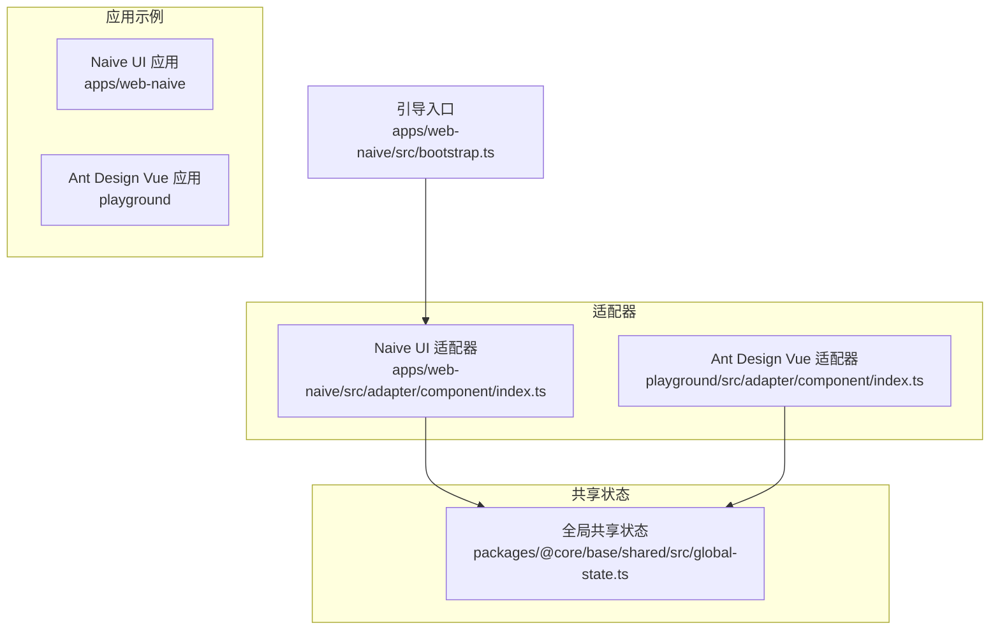
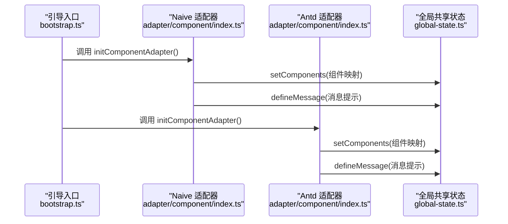
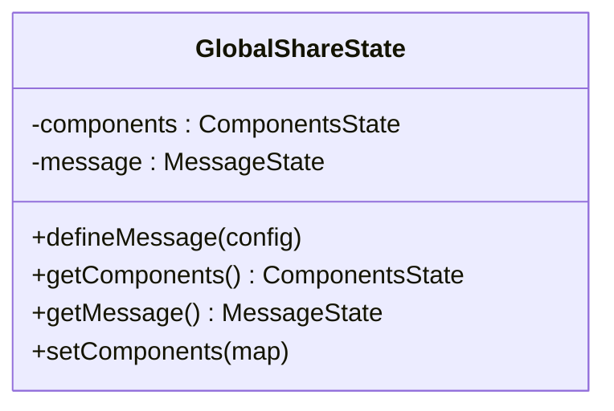
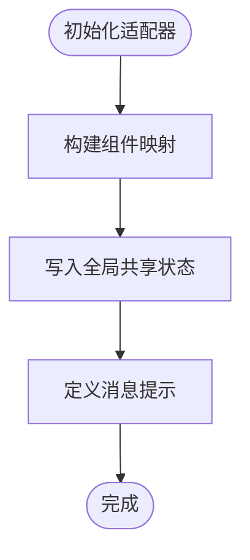
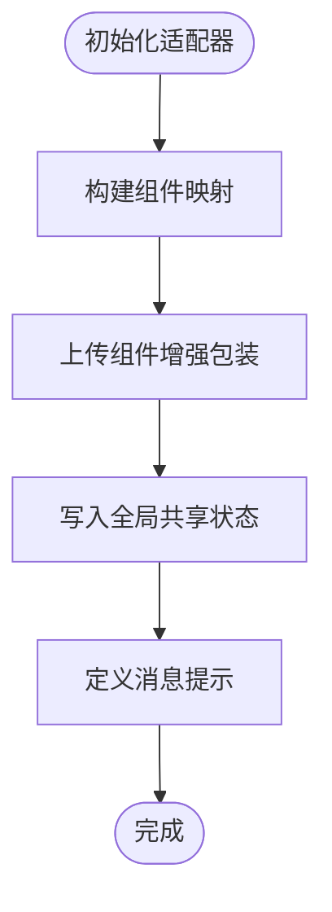
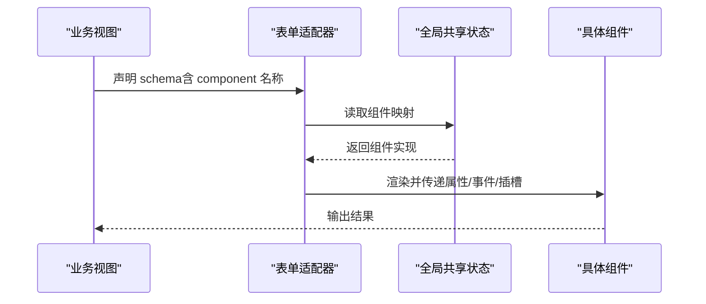
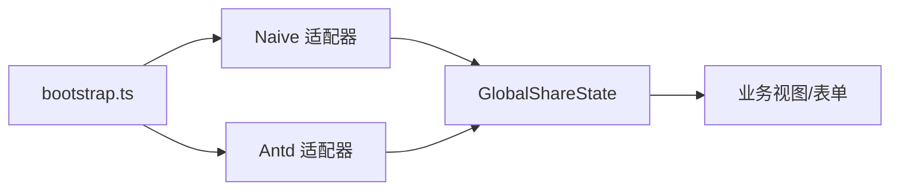

# 组件适配器

<cite>
**本文引用的文件**
- [apps/web-naive/src/adapter/component/index.ts](file://apps/web-naive/src/adapter/component/index.ts)
- [playground/src/adapter/component/index.ts](file://playground/src/adapter/component/index.ts)
- [packages/@core/base/shared/src/global-state.ts](file://packages/@core/base/shared/src/global-state.ts)
- [apps/web-naive/src/bootstrap.ts](file://apps/web-naive/src/bootstrap.ts)
- [apps/web-naive/src/views/demos/form/basic.vue](file://apps/web-naive/src/views/demos/form/basic.vue)
- [playground/src/views/examples/form/query.vue](file://playground/src/views/examples/form/query.vue)
- [playground/src/router/routes/modules/vben.ts](file://playground/src/router/routes/modules/vben.ts)
</cite>

## 目录

1. [简介](#简介)
2. [项目结构](#项目结构)
3. [核心组件](#核心组件)
4. [架构总览](#架构总览)
5. [详细组件分析](#详细组件分析)
6. [依赖关系分析](#依赖关系分析)
7. [性能考量](#性能考量)
8. [故障排查指南](#故障排查指南)
9. [结论](#结论)
10. [附录](#附录)

## 简介

本文件系统性阐述 shiyu-ui 的组件适配器体系，目标是为不同 UI 框架（如 Naive UI、Ant Design Vue）提供统一的组件接口与能力抽象，屏蔽底层差异，使上层表单、弹窗、抽屉等组件库能够以一致的方式声明式地使用基础控件。内容涵盖：

- 设计理念与架构模式：统一入口、按需异步加载、属性映射、事件转发、插槽处理
- 组件注册机制与全局状态管理
- 消息提示系统的实现与扩展
- 异步组件加载与动态导入策略
- 属性映射、事件转发与插槽处理机制
- 多主题与多语言适配策略
- 扩展开发指南与最佳实践

## 项目结构

组件适配器位于两个应用示例中，分别针对不同 UI 框架进行适配：

- Naive UI 适配器：apps/web-naive/src/adapter/component/index.ts
- Ant Design Vue 适配器：playground/src/adapter/component/index.ts

两者均通过全局共享状态导出组件映射与消息提示函数，供上层表单与业务视图使用。

图表来源

- [apps/web-naive/src/adapter/component/index.ts:163-271](file://apps/web-naive/src/adapter/component/index.ts#L163-L271)
- [playground/src/adapter/component/index.ts:671-750](file://playground/src/adapter/component/index.ts#L671-L750)
- [packages/@core/base/shared/src/global-state.ts:19-43](file://packages/@core/base/shared/src/global-state.ts#L19-L43)
- [apps/web-naive/src/bootstrap.ts:14-24](file://apps/web-naive/src/bootstrap.ts#L14-L24)

章节来源

- [apps/web-naive/src/adapter/component/index.ts:1-274](file://apps/web-naive/src/adapter/component/index.ts#L1-L274)
- [playground/src/adapter/component/index.ts:1-753](file://playground/src/adapter/component/index.ts#L1-L753)
- [packages/@core/base/shared/src/global-state.ts:1-46](file://packages/@core/base/shared/src/global-state.ts#L1-L46)
- [apps/web-naive/src/bootstrap.ts:1-54](file://apps/web-naive/src/bootstrap.ts#L1-L54)

## 核心组件

- 组件注册中心：在适配器初始化时，将一组“组件名 → 组件实现”的映射写入全局共享状态，供上层按名消费。
- 默认占位符增强器：withDefaultPlaceholder 为输入类组件注入默认占位符与 ref 暴露，统一行为。
- 异步组件与动态导入：defineAsyncComponent 与 import(...) 实现按需懒加载，降低首屏体积。
- 消息提示定义：通过 defineMessage 在全局共享状态中注册消息回调，实现跨模块一致的通知风格。
- 上传组件增强：Ant Design Vue 适配器提供带预览、裁剪、拖拽排序与尺寸校验的 Upload 包装器。

章节来源

- [apps/web-naive/src/adapter/component/index.ts:87-119](file://apps/web-naive/src/adapter/component/index.ts#L87-L119)
- [apps/web-naive/src/adapter/component/index.ts:163-271](file://apps/web-naive/src/adapter/component/index.ts#L163-L271)
- [playground/src/adapter/component/index.ts:139-171](file://playground/src/adapter/component/index.ts#L139-L171)
- [playground/src/adapter/component/index.ts:417-601](file://playground/src/adapter/component/index.ts#L417-L601)
- [packages/@core/base/shared/src/global-state.ts:26-30](file://packages/@core/base/shared/src/global-state.ts#L26-L30)

## 架构总览

组件适配器采用“初始化即注册 + 全局共享状态”的模式，确保：

- 启动阶段完成 UI 框架组件到统一组件名的映射
- 上层通过统一的组件名与属性约定进行声明式渲染
- 全局状态提供组件映射与消息提示的集中访问点

图表来源

- [apps/web-naive/src/bootstrap.ts:14-24](file://apps/web-naive/src/bootstrap.ts#L14-L24)
- [apps/web-naive/src/adapter/component/index.ts:163-271](file://apps/web-naive/src/adapter/component/index.ts#L163-L271)
- [playground/src/adapter/component/index.ts:671-750](file://playground/src/adapter/component/index.ts#L671-L750)
- [packages/@core/base/shared/src/global-state.ts:40-42](file://packages/@core/base/shared/src/global-state.ts#L40-L42)

## 详细组件分析

### 全局共享状态（GlobalShareState）

- 职责：维护组件映射与消息提示的单例实例，提供读写方法
- 关键点：defineMessage 支持覆盖默认消息提示；setComponents 一次性注入所有适配后的组件

图表来源

- [packages/@core/base/shared/src/global-state.ts:19-43](file://packages/@core/base/shared/src/global-state.ts#L19-L43)

章节来源

- [packages/@core/base/shared/src/global-state.ts:1-46](file://packages/@core/base/shared/src/global-state.ts#L1-L46)

### Naive UI 适配器

- 组件映射：将 Naive UI 组件封装为统一组件名，如 Input、Select、Upload 等
- 默认占位符：withDefaultPlaceholder 自动注入占位符与 ref 暴露
- 自定义按钮：DefaultButton、PrimaryButton 以统一风格输出
- 异步加载：大量组件通过 defineAsyncComponent 动态导入
- 消息提示：通过 Naive UI 的 message 组件实现通知

图表来源

- [apps/web-naive/src/adapter/component/index.ts:163-271](file://apps/web-naive/src/adapter/component/index.ts#L163-L271)

章节来源

- [apps/web-naive/src/adapter/component/index.ts:1-274](file://apps/web-naive/src/adapter/component/index.ts#L1-L274)

### Ant Design Vue 适配器

- 组件映射：覆盖更多表单组件，如 AutoComplete、Cascader、RangePicker、RichEditor 等
- 默认占位符：与 Naive 版本一致的增强逻辑
- 上传增强：withPreviewUpload 提供预览、裁剪、拖拽排序、尺寸校验、多文件排序回调
- 消息提示：通过 Ant Design Vue 的 notification 实现

图表来源

- [playground/src/adapter/component/index.ts:671-750](file://playground/src/adapter/component/index.ts#L671-L750)
- [playground/src/adapter/component/index.ts:417-601](file://playground/src/adapter/component/index.ts#L417-L601)

章节来源

- [playground/src/adapter/component/index.ts:1-753](file://playground/src/adapter/component/index.ts#L1-L753)

### 组件注册机制与使用

- 注册：适配器初始化时调用 setComponents，将组件映射写入全局状态
- 使用：上层视图通过统一的组件名与属性约定进行渲染，无需关心底层 UI 框架差异
- 示例：表单视图中以 component: 'Input'、'Select' 等方式声明控件

图表来源

- [apps/web-naive/src/views/demos/form/basic.vue:26-61](file://apps/web-naive/src/views/demos/form/basic.vue#L26-L61)
- [playground/src/views/examples/form/query.vue:89-143](file://playground/src/views/examples/form/query.vue#L89-L143)
- [packages/@core/base/shared/src/global-state.ts:32-34](file://packages/@core/base/shared/src/global-state.ts#L32-L34)

章节来源

- [apps/web-naive/src/views/demos/form/basic.vue:1-61](file://apps/web-naive/src/views/demos/form/basic.vue#L1-L61)
- [playground/src/views/examples/form/query.vue:89-143](file://playground/src/views/examples/form/query.vue#L89-L143)
- [packages/@core/base/shared/src/global-state.ts:32-34](file://packages/@core/base/shared/src/global-state.ts#L32-L34)

### 异步组件加载与动态导入策略

- 策略：对体积较大或非首屏必需的组件采用 defineAsyncComponent + import(...) 按需加载
- 优势：减少首屏包体，提升启动速度；按需渲染，避免无谓开销
- 注意：需结合路由与视图懒加载形成整体优化

章节来源

- [apps/web-naive/src/adapter/component/index.ts:38-85](file://apps/web-naive/src/adapter/component/index.ts#L38-L85)
- [playground/src/adapter/component/index.ts:86-137](file://playground/src/adapter/component/index.ts#L86-L137)

### 属性映射、事件转发与插槽处理

- 属性映射：通过 withDefaultPlaceholder 与组件包装，统一注入占位符、模型值属性名、可见性事件等
- 事件转发：在包装组件中透传底层事件回调，保证上层监听一致
- 插槽处理：对无默认插槽的场景，自动根据属性生成默认插槽内容（如 RadioGroup、CheckboxGroup）

章节来源

- [apps/web-naive/src/adapter/component/index.ts:87-119](file://apps/web-naive/src/adapter/component/index.ts#L87-L119)
- [apps/web-naive/src/adapter/component/index.ts:197-212](file://apps/web-naive/src/adapter/component/index.ts#L197-L212)
- [playground/src/adapter/component/index.ts:139-171](file://playground/src/adapter/component/index.ts#L139-L171)
- [playground/src/adapter/component/index.ts:698-734](file://playground/src/adapter/component/index.ts#L698-L734)

### 消息提示系统

- 定义：在适配器初始化时通过 defineMessage 注册消息提示函数
- 使用：上层通过全局共享状态获取消息提示对象，统一调用
- 差异：不同 UI 框架采用各自的消息组件（Naive UI message vs Ant Design Vue notification）

章节来源

- [apps/web-naive/src/adapter/component/index.ts:262-270](file://apps/web-naive/src/adapter/component/index.ts#L262-L270)
- [playground/src/adapter/component/index.ts:739-749](file://playground/src/adapter/component/index.ts#L739-L749)
- [packages/@core/base/shared/src/global-state.ts:26-30](file://packages/@core/base/shared/src/global-state.ts#L26-L30)

### 多主题与多语言适配策略

- 多语言：默认占位符通过 $t 从本地化资源读取，确保不同语言环境一致体验
- 多主题：组件样式由底层 UI 框架主题控制；适配器保持最小侵入，避免硬编码样式
- 建议：在业务层通过主题切换与 i18n 切换，配合适配器的统一入口即可生效

章节来源

- [apps/web-naive/src/adapter/component/index.ts:96-99](file://apps/web-naive/src/adapter/component/index.ts#L96-L99)
- [playground/src/adapter/component/index.ts:148-151](file://playground/src/adapter/component/index.ts#L148-L151)

### 扩展开发指南与最佳实践

- 新增组件步骤
  - 在适配器中新增组件映射，优先使用 withDefaultPlaceholder 统一行为
  - 如需复杂交互（如 Upload 增强），可参考现有包装器模式
  - 将组件名加入 ComponentType 与 ComponentPropsMap，确保类型安全与 IDE 提示
- 性能优化
  - 对大组件使用异步加载；结合路由懒加载形成整体优化
  - 合理拆分插槽，避免不必要的重渲染
- 一致性
  - 统一占位符、事件命名与模型值属性名
  - 保持消息提示风格一致，必要时在 defineMessage 中扩展

章节来源

- [apps/web-naive/src/adapter/component/index.ts:122-139](file://apps/web-naive/src/adapter/component/index.ts#L122-L139)
- [playground/src/adapter/component/index.ts:603-634](file://playground/src/adapter/component/index.ts#L603-L634)

## 依赖关系分析

- 适配器依赖：UI 框架组件库（Naive UI 或 Ant Design Vue）、@vben/common-ui（ApiComponent、IconPicker 等）、@vben/locales（$t）、@vben/utils（工具函数）
- 共享状态：被适配器写入，被上层表单与业务视图读取
- 引导入口：在应用启动时调用适配器初始化，确保全局可用

图表来源

- [apps/web-naive/src/bootstrap.ts:14-24](file://apps/web-naive/src/bootstrap.ts#L14-L24)
- [apps/web-naive/src/adapter/component/index.ts:163-271](file://apps/web-naive/src/adapter/component/index.ts#L163-L271)
- [playground/src/adapter/component/index.ts:671-750](file://playground/src/adapter/component/index.ts#L671-L750)
- [packages/@core/base/shared/src/global-state.ts:32-42](file://packages/@core/base/shared/src/global-state.ts#L32-L42)

章节来源

- [apps/web-naive/src/bootstrap.ts:1-54](file://apps/web-naive/src/bootstrap.ts#L1-L54)
- [packages/@core/base/shared/src/global-state.ts:1-46](file://packages/@core/base/shared/src/global-state.ts#L1-L46)

## 性能考量

- 按需加载：通过 defineAsyncComponent 仅在使用时加载组件，显著降低首屏体积
- 事件与插槽最小化：避免在包装器中做重型计算，尽量透传与轻量处理
- 上传组件优化：Ant Design Vue 适配器对图片预览、裁剪与排序做了异步与 DOM 管理，注意及时销毁临时节点与资源

## 故障排查指南

- 组件未注册
  - 现象：组件名无法解析
  - 排查：确认适配器初始化顺序与 setComponents 是否执行
- 占位符无效
  - 现象：输入类组件无默认提示
  - 排查：确认 $t 资源是否存在，withDefaultPlaceholder 是否正确注入
- 上传预览失败
  - 现象：点击预览无响应或报错
  - 排查：检查文件类型判断、预览容器挂载与清理逻辑
- 消息提示不显示
  - 现象：复制成功等提示未出现
  - 排查：确认 defineMessage 是否在适配器初始化中调用，以及底层消息组件可用

章节来源

- [apps/web-naive/src/adapter/component/index.ts:262-270](file://apps/web-naive/src/adapter/component/index.ts#L262-L270)
- [playground/src/adapter/component/index.ts:739-749](file://playground/src/adapter/component/index.ts#L739-L749)
- [playground/src/adapter/component/index.ts:241-315](file://playground/src/adapter/component/index.ts#L241-L315)

## 结论

组件适配器通过统一入口、异步加载与全局共享状态，有效屏蔽了不同 UI 框架的差异，实现了组件能力的一致性与可扩展性。配合默认占位符、事件转发与插槽处理机制，既保证了易用性，也兼顾了性能与可维护性。建议在新项目中遵循现有模式扩展组件，确保跨框架迁移与主题/语言切换的平滑过渡。

## 附录

- 示例路由：playground/src/router/routes/modules/vben.ts 展示了多框架预览入口，便于对比不同 UI 框架的适配效果

章节来源

- [playground/src/router/routes/modules/vben.ts:1-133](file://playground/src/router/routes/modules/vben.ts#L1-L133)
