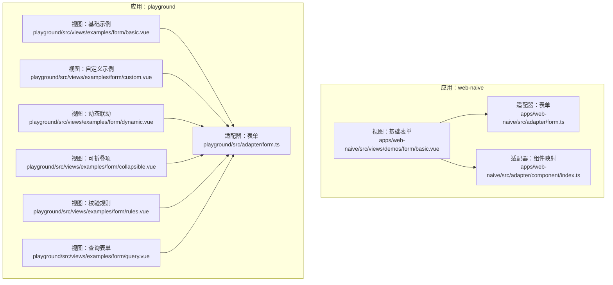
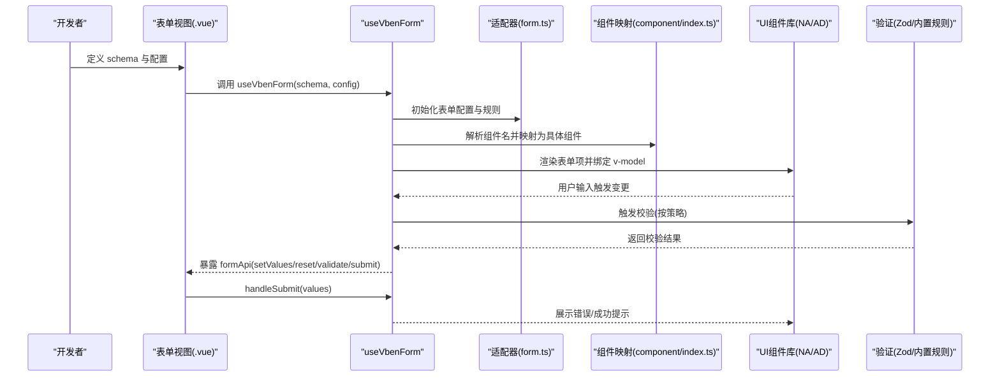
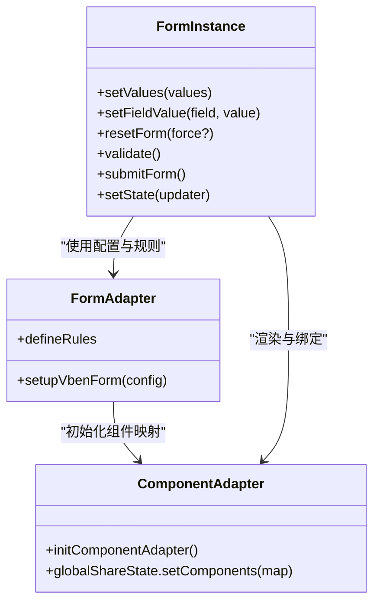

# 基础表单组件

<cite>
**本文引用的文件**   
- [apps/web-naive/src/views/demos/form/basic.vue](file://apps/web-naive/src/views/demos/form/basic.vue)
- [apps/web-naive/src/views/demos/form/modal.vue](file://apps/web-naive/src/views/demos/form/modal.vue)
- [apps/web-naive/src/adapter/form.ts](file://apps/web-naive/src/adapter/form.ts)
- [apps/web-naive/src/adapter/component/index.ts](file://apps/web-naive/src/adapter/component/index.ts)
- [playground/src/views/examples/form/basic.vue](file://playground/src/views/examples/form/basic.vue)
- [playground/src/views/examples/form/custom.vue](file://playground/src/views/examples/form/custom.vue)
- [playground/src/views/examples/form/dynamic.vue](file://playground/src/views/examples/form/dynamic.vue)
- [playground/src/views/examples/form/collapsible.vue](file://playground/src/views/examples/form/collapsible.vue)
- [playground/src/views/examples/form/rules.vue](file://playground/src/views/examples/form/rules.vue)
- [playground/src/views/examples/form/query.vue](file://playground/src/views/examples/form/query.vue)
- [playground/src/adapter/form.ts](file://playground/src/adapter/form.ts)
</cite>

## 目录

1. [简介](#简介)
2. [项目结构](#项目结构)
3. [核心组件](#核心组件)
4. [架构总览](#架构总览)
5. [组件详解](#组件详解)
6. [依赖关系分析](#依赖关系分析)
7. [性能考量](#性能考量)
8. [故障排查指南](#故障排查指南)
9. [结论](#结论)
10. [附录](#附录)

## 简介

本文件面向 shiyu-ui 项目中的基础表单组件，系统性阐述输入框、文本域、选择器、日期时间选择器、上传、评分、开关、单选/多选等控件的实现原理、属性映射、事件处理与数据绑定机制。同时给出基础表单布局、栅格系统与响应式设计最佳实践，详述表单验证规则配置与错误提示策略，并通过多步骤表单、条件显示等复杂场景示例，帮助读者快速构建高质量表单体验。

## 项目结构

围绕表单能力，项目在两个应用中提供了示例与适配层：

- apps/web-naive：基于 Naive UI 的适配与示例
- playground：基于 Ant Design Vue 的完整示例与高级特性演示

关键目录与文件：

- 适配层（Naive UI）：apps/web-naive/src/adapter
- 适配层（Ant Design Vue）：playground/src/adapter
- 表单示例（Naive UI）：apps/web-naive/src/views/demos/form
- 表单示例（Ant Design Vue）：playground/src/views/examples/form

图表来源

- [apps/web-naive/src/views/demos/form/basic.vue:1-181](file://apps/web-naive/src/views/demos/form/basic.vue#L1-L181)
- [apps/web-naive/src/adapter/form.ts:1-46](file://apps/web-naive/src/adapter/form.ts#L1-L46)
- [apps/web-naive/src/adapter/component/index.ts:1-274](file://apps/web-naive/src/adapter/component/index.ts#L1-L274)
- [playground/src/views/examples/form/basic.vue:1-531](file://playground/src/views/examples/form/basic.vue#L1-L531)
- [playground/src/views/examples/form/custom.vue:1-101](file://playground/src/views/examples/form/custom.vue#L1-L101)
- [playground/src/views/examples/form/dynamic.vue:1-263](file://playground/src/views/examples/form/dynamic.vue#L1-L263)
- [playground/src/views/examples/form/collapsible.vue:1-316](file://playground/src/views/examples/form/collapsible.vue#L1-L316)
- [playground/src/views/examples/form/rules.vue:1-246](file://playground/src/views/examples/form/rules.vue#L1-L246)
- [playground/src/views/examples/form/query.vue:1-277](file://playground/src/views/examples/form/query.vue#L1-L277)
- [playground/src/adapter/form.ts:1-49](file://playground/src/adapter/form.ts#L1-L49)

章节来源

- [apps/web-naive/src/views/demos/form/basic.vue:1-181](file://apps/web-naive/src/views/demos/form/basic.vue#L1-L181)
- [playground/src/views/examples/form/basic.vue:1-531](file://playground/src/views/examples/form/basic.vue#L1-L531)

## 核心组件

- 表单容器与生命周期
  - 通过 useVbenForm 创建表单实例，返回 Form 组件与 formApi，统一管理 schema、值、校验、提交、重置等。
  - 支持 handleSubmit、handleValuesChange、fieldMappingTime 等配置，满足常见业务诉求。
- 组件映射与属性桥接
  - 适配器将业务组件库（Naive UI / Ant Design Vue）的组件与 vben-form 的 schema 组件名进行映射，自动桥接 v-model 名称、空值、默认占位等。
- 验证体系
  - 内置 required、selectRequired 等规则，支持 Zod 规则链式校验、异步校验、按需触发校验（如 blur）。
- 布局与栅格
  - 通过 wrapperClass 与 formItemClass 控制栅格列数与表单项跨列，结合 layout（vertical/horizontal/inline）实现灵活布局。

章节来源

- [apps/web-naive/src/adapter/form.ts:11-41](file://apps/web-naive/src/adapter/form.ts#L11-L41)
- [apps/web-naive/src/adapter/component/index.ts:163-271](file://apps/web-naive/src/adapter/component/index.ts#L163-L271)
- [playground/src/adapter/form.ts:11-41](file://playground/src/adapter/form.ts#L11-L41)

## 架构总览

下图展示了表单从 schema 到渲染、数据绑定、校验与提交的端到端流程：

图表来源

- [apps/web-naive/src/adapter/form.ts:11-41](file://apps/web-naive/src/adapter/form.ts#L11-L41)
- [apps/web-naive/src/adapter/component/index.ts:163-271](file://apps/web-naive/src/adapter/component/index.ts#L163-L271)
- [playground/src/adapter/form.ts:11-41](file://playground/src/adapter/form.ts#L11-L41)

## 组件详解

### 输入框 Input 与文本域 TextArea

- 属性映射
  - 组件名：Input
  - v-model 名称：value（由适配器统一映射）
  - 默认占位符：未传 placeholder 时自动注入本地化文案
- 数据绑定与事件
  - 通过 formApi.setValues/setFieldValue 实现编程式赋值
  - 支持 renderComponentContent 插槽内容定制
- 典型用法
  - 基础输入、带描述、带后缀、带帮助信息、远程搜索 ApiSelect 等

章节来源

- [apps/web-naive/src/views/demos/form/basic.vue:66-70](file://apps/web-naive/src/views/demos/form/basic.vue#L66-L70)
- [playground/src/views/examples/form/basic.vue:59-76](file://playground/src/views/examples/form/basic.vue#L59-L76)
- [playground/src/views/examples/form/custom.vue:30-50](file://playground/src/views/examples/form/custom.vue#L30-L50)

### 数字输入 InputNumber

- 属性映射
  - 组件名：InputNumber
  - v-model 名称：value
- 典型用法
  - 带后缀（如货币符号）、受控赋值、与 formApi.setFieldValue 协作

章节来源

- [playground/src/views/examples/form/basic.vue:160-167](file://playground/src/views/examples/form/basic.vue#L160-L167)
- [playground/src/views/examples/form/custom.vue:14-20](file://playground/src/views/examples/form/custom.vue#L14-L20)

### 选择器 Select 与树选择 TreeSelect、ApiSelect/ApiTreeSelect

- 属性映射
  - 组件名：Select/TreeSelect/ApiSelect/ApiTreeSelect
  - v-model 名称：value
  - 默认占位符：未传 placeholder 时自动注入本地化文案
- 数据绑定
  - 支持 options、treeData、api 获取远端数据
  - 支持 afterFetch 转换接口数据为 options
- 典型用法
  - 下拉选择、树形选择、远程搜索、自动选择首项、禁用本地过滤

章节来源

- [apps/web-naive/src/views/demos/form/basic.vue:78-91](file://apps/web-naive/src/views/demos/form/basic.vue#L78-L91)
- [playground/src/views/examples/form/basic.vue:175-194](file://playground/src/views/examples/form/basic.vue#L175-L194)
- [playground/src/views/examples/form/basic.vue:136-150](file://playground/src/views/examples/form/basic.vue#L136-L150)
- [playground/src/views/examples/form/basic.vue:79-97](file://playground/src/views/examples/form/basic.vue#L79-L97)

### 单选/单选按钮 RadioGroup/RadioButton

- 属性映射
  - 组件名：RadioGroup
  - v-model 名称：checked
  - 支持 isButton=true 以按钮样式渲染
- 典型用法
  - 选项数组渲染、按钮风格、与 formApi.setValues 协作

章节来源

- [apps/web-naive/src/views/demos/form/basic.vue:78-108](file://apps/web-naive/src/views/demos/form/basic.vue#L78-L108)
- [playground/src/views/examples/form/basic.vue:196-221](file://playground/src/views/examples/form/basic.vue#L196-L221)

### 多选/多选组 CheckboxGroup/Checkbox

- 属性映射
  - 组件名：CheckboxGroup/Checkbox
  - v-model 名称：checked
- 典型用法
  - 多选组、自定义插槽内容、布尔值校验

章节来源

- [apps/web-naive/src/views/demos/form/basic.vue:110-121](file://apps/web-naive/src/views/demos/form/basic.vue#L110-L121)
- [playground/src/views/examples/form/basic.vue:223-252](file://playground/src/views/examples/form/basic.vue#L223-L252)

### 日期时间选择 DatePicker/RangePicker/TimePicker

- 属性映射
  - 组件名：DatePicker/RangePicker/TimePicker
  - v-model 名称：value
- 典型用法
  - 日期选择、日期区间、时间选择、帮助信息动态渲染

章节来源

- [apps/web-naive/src/views/demos/form/basic.vue:123-127](file://apps/web-naive/src/views/demos/form/basic.vue#L123-L127)
- [playground/src/views/examples/form/basic.vue:287-304](file://playground/src/views/examples/form/basic.vue#L287-L304)

### 上传 Upload

- 属性映射
  - 组件名：Upload
  - v-model 名称：fileList
- 典型用法
  - 文件上传、拖拽排序、裁剪、自定义请求、状态回调、列表展示

章节来源

- [playground/src/views/examples/form/basic.vue:353-411](file://playground/src/views/examples/form/basic.vue#L353-L411)

### 富文本 RichEditor 与可折叠项 Collapsible

- 富文本
  - 通过自定义组件注入，支持跨列布局与折叠
- 可折叠参数面板
  - 与依赖控制器联动，动态切换参数项与默认值，配合复杂校验

章节来源

- [playground/src/views/examples/form/basic.vue:413-417](file://playground/src/views/examples/form/basic.vue#L413-L417)
- [playground/src/views/examples/form/collapsible.vue:154-234](file://playground/src/views/examples/form/collapsible.vue#L154-L234)

### 表单布局与栅格系统

- 布局模式
  - layout：vertical/horizontal/inline
- 栅格控制
  - wrapperClass：grid-cols-1 md:grid-cols-2 lg:grid-cols-3 等
  - formItemClass：col-span-N、col-start-M 等
- 查询表单
  - 支持 collapsed/collapsedRows、showCollapseButton、actionLayout/actionPosition 等

章节来源

- [apps/web-naive/src/views/demos/form/basic.vue:20-22](file://apps/web-naive/src/views/demos/form/basic.vue#L20-L22)
- [playground/src/views/examples/form/query.vue:8-86](file://playground/src/views/examples/form/query.vue#L8-L86)
- [playground/src/views/examples/form/query.vue:184-246](file://playground/src/views/examples/form/query.vue#L184-L246)

### 表单验证规则与错误提示

- 内置规则
  - required：对字符串/数组等判空
  - selectRequired：对选择类控件判空
- Zod 规则链
  - 支持字符串长度、邮箱格式、布尔值、数组长度、正则等
- 异步校验
  - 通过 refine 异步校验（如用户名唯一）
- 校验触发策略
  - validateOnChange/validateOnBlur/validateOnModelUpdate 可按字段精细控制
- 错误提示
  - 校验失败自动展示，支持 help 函数动态生成帮助信息

章节来源

- [apps/web-naive/src/adapter/form.ts:23-36](file://apps/web-naive/src/adapter/form.ts#L23-L36)
- [playground/src/adapter/form.ts:24-39](file://playground/src/adapter/form.ts#L24-L39)
- [playground/src/views/examples/form/rules.vue:33-220](file://playground/src/views/examples/form/rules.vue#L33-L220)

### 条件显示与动态联动

- dependencies
  - show/disabled/required/componentProps/rules/triggerFields 等动态控制
- setState 动态修改 schema
  - 增删字段、修改 label、联动赋值
- 字段同步
  - 通过 trigger 回调在字段变更时同步到其他字段

章节来源

- [playground/src/views/examples/form/dynamic.vue:11-163](file://playground/src/views/examples/form/dynamic.vue#L11-L163)
- [playground/src/views/examples/form/dynamic.vue:166-196](file://playground/src/views/examples/form/dynamic.vue#L166-L196)

### 复杂表单场景示例

- 多步骤表单
  - 通过多个 schema 片段与 formApi.setState 切换，结合提交与校验策略
- 条件显示表单
  - 基于 dependencies 的 show/disabled/required 组合
- 查询表单
  - 支持折叠/展开、多布局模式、操作按钮位置与布局

章节来源

- [playground/src/views/examples/form/query.vue:8-87](file://playground/src/views/examples/form/query.vue#L8-L87)
- [playground/src/views/examples/form/query.vue:145-246](file://playground/src/views/examples/form/query.vue#L145-L246)

## 依赖关系分析

- 适配器职责
  - apps/web-naive：Naive UI 组件映射、v-model 名称与空值策略
  - playground：Ant Design Vue 组件映射、v-model 名称与空值策略
- 组件映射关系
  - 通过 globalShareState 注册组件，统一桥接属性与事件
- 表单 API
  - formApi 提供 setValues/setFieldValue/resetForm/validate/submit 等能力

图表来源

- [apps/web-naive/src/adapter/form.ts:11-41](file://apps/web-naive/src/adapter/form.ts#L11-L41)
- [apps/web-naive/src/adapter/component/index.ts:163-271](file://apps/web-naive/src/adapter/component/index.ts#L163-L271)
- [playground/src/adapter/form.ts:11-41](file://playground/src/adapter/form.ts#L11-L41)

章节来源

- [apps/web-naive/src/adapter/form.ts:11-41](file://apps/web-naive/src/adapter/form.ts#L11-L41)
- [apps/web-naive/src/adapter/component/index.ts:163-271](file://apps/web-naive/src/adapter/component/index.ts#L163-L271)
- [playground/src/adapter/form.ts:11-41](file://playground/src/adapter/form.ts#L11-L41)

## 性能考量

- 组件懒加载
  - 通过 defineAsyncComponent 异步加载大型组件，降低首屏体积
- 本地化占位符注入
  - 自动注入 placeholder，减少重复配置
- 远程搜索防抖
  - 使用 useDebounceFn 控制搜索词变化频率，避免频繁请求
- 上传裁剪与排序
  - 在前端完成图片裁剪与排序，减少后端压力

章节来源

- [apps/web-naive/src/adapter/component/index.ts:38-85](file://apps/web-naive/src/adapter/component/index.ts#L38-L85)
- [playground/src/views/examples/form/basic.vue:109-121](file://playground/src/views/examples/form/basic.vue#L109-L121)

## 故障排查指南

- 校验不生效
  - 检查字段 v-model 名称是否与适配器映射一致（如 Checkbox/Radio/Upload）
  - 确认 rules 是否为字符串别名或 Zod 规则对象
- 选择器为空值无法重置
  - 确认适配器中 emptyStateValue 配置是否与组件库默认空值一致
- 远程搜索无数据
  - 检查 shouldFetch、params、filterOption 等配置
- 上传状态异常
  - 检查 customRequest、maxSize/maxCount/listType 等属性
- 布局错乱
  - 检查 wrapperClass 与 formItemClass 的网格断点与跨列设置

章节来源

- [apps/web-naive/src/adapter/form.ts:14-22](file://apps/web-naive/src/adapter/form.ts#L14-L22)
- [playground/src/views/examples/form/basic.vue:353-411](file://playground/src/views/examples/form/basic.vue#L353-L411)

## 结论

shiyu-ui 的基础表单组件通过统一的适配器与 schema 驱动，实现了跨组件库的一致体验。借助完善的属性映射、事件桥接、验证体系与布局栅格，开发者可以快速搭建从基础输入到复杂联动、从静态表单到动态查询的多种场景。建议在实际项目中：

- 明确 v-model 名称与空值策略，确保重置与默认值行为一致
- 合理使用 dependencies 与 setState，避免过度耦合
- 优先采用 Zod 规则链与异步校验，提升用户体验
- 使用栅格系统与布局模式，保证在多终端下的可读性与可用性

## 附录

- 快速参考
  - 组件名与 v-model 名称对照：Input/InputNumber/Select/TreeSelect/DatePicker/TimePicker/Upload 等
  - 内置规则：required、selectRequired
  - 常用配置：commonConfig.componentProps、wrapperClass、formItemClass、layout、handleSubmit、handleValuesChange
- 最佳实践清单
  - 使用 defaultValue 与 setValues 初始化表单
  - 为选择类组件提供明确的占位符与选项
  - 对远程搜索启用防抖与 shouldFetch
  - 上传组件配置 maxSize、maxCount、listType、dragSort 等
  - 使用 collapsible 与 wrapperClass 提升复杂表单的可维护性
