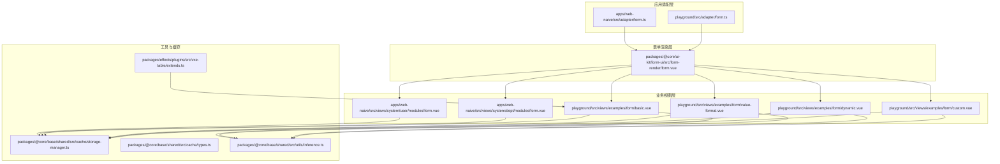
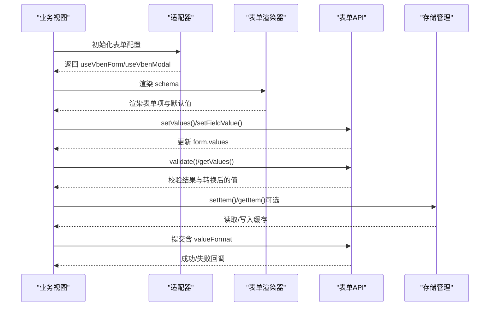
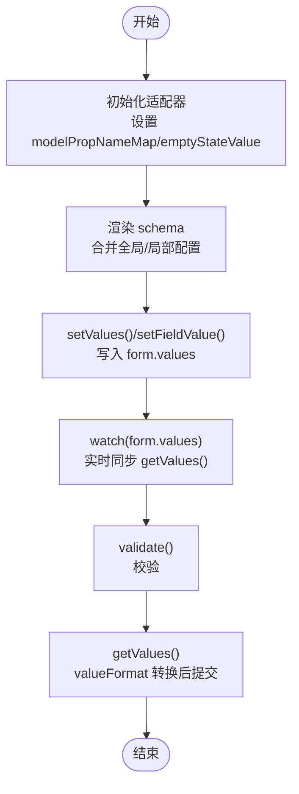
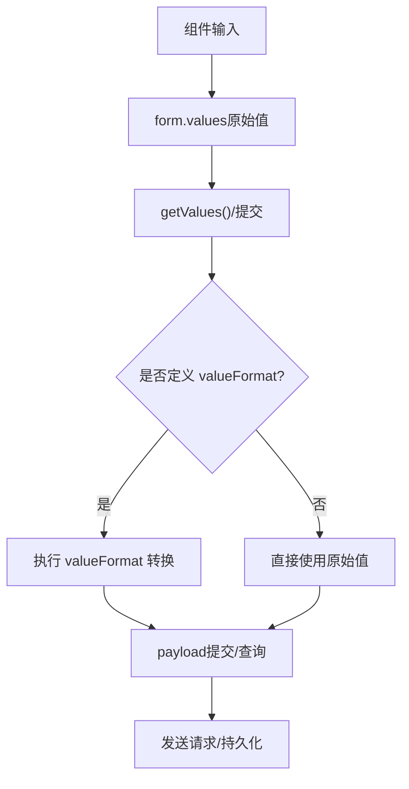
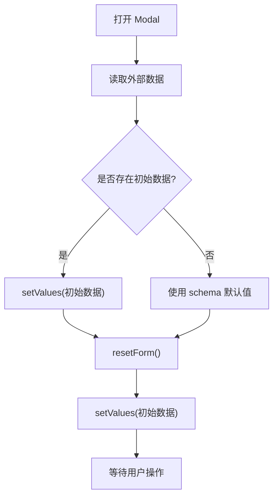
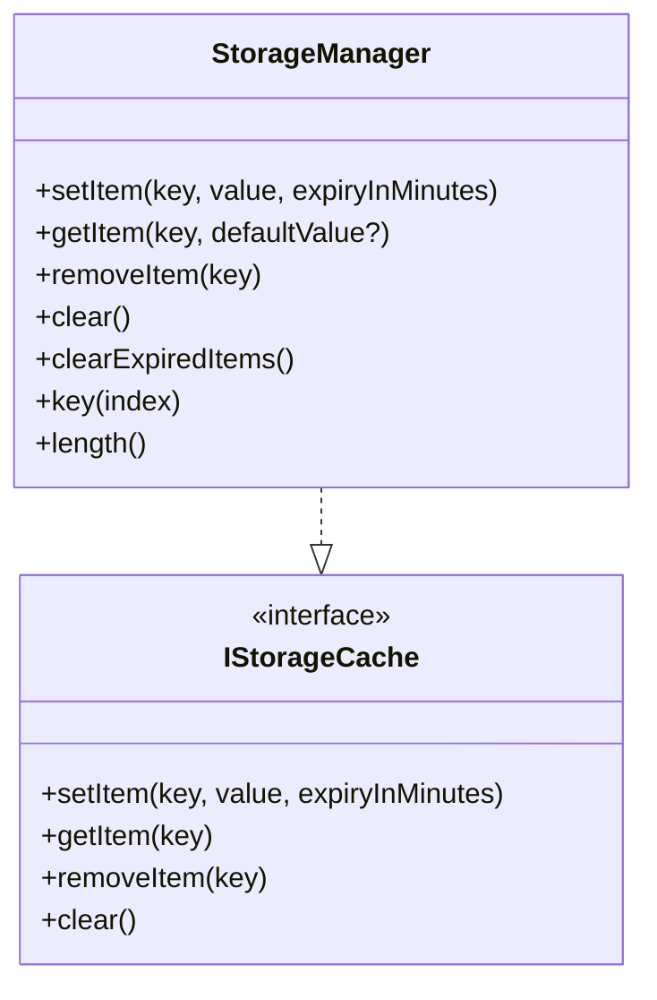

# 表单数据管理

<cite>
**本文引用的文件**
- [apps/web-naive/src/adapter/form.ts](file://apps/web-naive/src/adapter/form.ts)
- [playground/src/adapter/form.ts](file://playground/src/adapter/form.ts)
- [packages/@core/ui-kit/form-ui/src/form-render/form.vue](file://packages/@core/ui-kit/form-ui/src/form-render/form.vue)
- [apps/web-naive/src/views/system/user/modules/form.vue](file://apps/web-naive/src/views/system/user/modules/form.vue)
- [apps/web-naive/src/views/system/dept/modules/form.vue](file://apps/web-naive/src/views/system/dept/modules/form.vue)
- [playground/src/views/examples/form/basic.vue](file://playground/src/views/examples/form/basic.vue)
- [playground/src/views/examples/form/value-format.vue](file://playground/src/views/examples/form/value-format.vue)
- [playground/src/views/examples/form/dynamic.vue](file://playground/src/views/examples/form/dynamic.vue)
- [playground/src/views/examples/form/custom.vue](file://playground/src/views/examples/form/custom.vue)
- [packages/@core/base/shared/src/cache/storage-manager.ts](file://packages/@core/base/shared/src/cache/storage-manager.ts)
- [packages/@core/base/shared/src/cache/types.ts](file://packages/@core/base/shared/src/cache/types.ts)
- [packages/@core/base/shared/src/utils/inference.ts](file://packages/@core/base/shared/src/utils/inference.ts)
- [packages/effects/plugins/src/vxe-table/extends.ts](file://packages/effects/plugins/src/vxe-table/extends.ts)
</cite>

## 目录

1. [简介](#简介)
2. [项目结构](#项目结构)
3. [核心组件](#核心组件)
4. [架构总览](#架构总览)
5. [详细组件分析](#详细组件分析)
6. [依赖关系分析](#依赖关系分析)
7. [性能考量](#性能考量)
8. [故障排查指南](#故障排查指南)
9. [结论](#结论)
10. [附录](#附录)

## 简介

本文件围绕 shiyu-ui 项目的表单数据管理展开，系统性阐述双向绑定机制、状态同步策略、序列化/反序列化与格式转换、重置/清空/默认值设置、深拷贝/浅拷贝与引用管理、缓存与持久化最佳实践，以及大数据量表单的性能优化与内存管理方案。内容基于仓库中的实际实现与示例，确保可操作与可落地。

## 项目结构

本项目采用多应用与多包的组织方式，表单能力主要由通用 UI 适配层与具体业务视图共同构成：

- 应用层适配：在不同前端框架（如 Naive UI、Ant Design Vue）下统一表单能力，提供初始化配置与规则定义。
- 表单渲染层：负责根据 schema 渲染表单项、合并全局与局部配置、处理默认值与校验规则。
- 业务视图层：在 Modal/Drawer 等容器中承载表单，负责数据读取、提交、重置与联动逻辑。
- 工具与缓存：提供存储管理、类型推断等基础设施，支撑表单数据的持久化与健壮性。

**图表来源**

- [apps/web-naive/src/adapter/form.ts:11-38](file://apps/web-naive/src/adapter/form.ts#L11-L38)
- [playground/src/adapter/form.ts:11-41](file://playground/src/adapter/form.ts#L11-L41)
- [packages/@core/ui-kit/form-ui/src/form-render/form.vue:1-193](file://packages/@core/ui-kit/form-ui/src/form-render/form.vue#L1-L193)
- [apps/web-naive/src/views/system/user/modules/form.vue:25-69](file://apps/web-naive/src/views/system/user/modules/form.vue#L25-L69)
- [apps/web-naive/src/views/system/dept/modules/form.vue:36-79](file://apps/web-naive/src/views/system/dept/modules/form.vue#L36-L79)
- [playground/src/views/examples/form/basic.vue:36-421](file://playground/src/views/examples/form/basic.vue#L36-L421)
- [playground/src/views/examples/form/value-format.vue:55-161](file://playground/src/views/examples/form/value-format.vue#L55-L161)
- [playground/src/views/examples/form/dynamic.vue:227-241](file://playground/src/views/examples/form/dynamic.vue#L227-L241)
- [playground/src/views/examples/form/custom.vue:12-81](file://playground/src/views/examples/form/custom.vue#L12-L81)
- [packages/@core/base/shared/src/cache/storage-manager.ts](file://packages/@core/base/shared/src/cache/storage-manager.ts)
- [packages/@core/base/shared/src/cache/types.ts:1-17](file://packages/@core/base/shared/src/cache/types.ts#L1-L17)
- [packages/@core/base/shared/src/utils/inference.ts:117-164](file://packages/@core/base/shared/src/utils/inference.ts#L117-L164)
- [packages/effects/plugins/src/vxe-table/extends.ts:38-67](file://packages/effects/plugins/src/vxe-table/extends.ts#L38-L67)

**章节来源**

- [apps/web-naive/src/adapter/form.ts:11-46](file://apps/web-naive/src/adapter/form.ts#L11-L46)
- [playground/src/adapter/form.ts:11-49](file://playground/src/adapter/form.ts#L11-L49)
- [packages/@core/ui-kit/form-ui/src/form-render/form.vue:1-193](file://packages/@core/ui-kit/form-ui/src/form-render/form.vue#L1-L193)

## 核心组件

- 适配器初始化：在不同应用中分别初始化表单配置，包括模型属性映射、空值策略、内置校验规则等，确保各组件库的 v-model 语义一致。
- 表单渲染器：根据 schema 渲染表单项，合并全局与局部配置，计算默认值与必填标记，提供可折叠、可展开、可动态变更的渲染能力。
- 业务表单视图：在 Modal/Drawer 容器中承载表单，负责数据加载、校验、提交、重置与联动，结合 API 请求完成 CRUD 场景。
- 缓存与工具：提供带过期控制的存储管理器与常用类型推断工具，支撑表单数据的持久化与健壮性。

**章节来源**

- [apps/web-naive/src/adapter/form.ts:11-46](file://apps/web-naive/src/adapter/form.ts#L11-L46)
- [playground/src/adapter/form.ts:11-49](file://playground/src/adapter/form.ts#L11-L49)
- [packages/@core/ui-kit/form-ui/src/form-render/form.vue:59-169](file://packages/@core/ui-kit/form-ui/src/form-render/form.vue#L59-L169)
- [apps/web-naive/src/views/system/user/modules/form.vue:25-69](file://apps/web-naive/src/views/system/user/modules/form.vue#L25-L69)
- [apps/web-naive/src/views/system/dept/modules/form.vue:36-79](file://apps/web-naive/src/views/system/dept/modules/form.vue#L36-L79)
- [packages/@core/base/shared/src/cache/storage-manager.ts](file://packages/@core/base/shared/src/cache/storage-manager.ts)
- [packages/@core/base/shared/src/utils/inference.ts:117-164](file://packages/@core/base/shared/src/utils/inference.ts#L117-L164)

## 架构总览

表单数据管理的端到端流程如下：

- 初始化阶段：应用适配器设置 v-model 属性映射、空值策略与校验规则。
- 渲染阶段：表单渲染器解析 schema，合并配置，生成表单项并提供默认值。
- 交互阶段：用户输入触发双向绑定，视图层通过 API 获取/设置值、校验、提交。
- 提交阶段：对原始值进行格式转换（valueFormat），生成提交 payload 并持久化或发送请求。

**图表来源**

- [apps/web-naive/src/adapter/form.ts:11-46](file://apps/web-naive/src/adapter/form.ts#L11-L46)
- [playground/src/adapter/form.ts:11-49](file://playground/src/adapter/form.ts#L11-L49)
- [packages/@core/ui-kit/form-ui/src/form-render/form.vue:59-169](file://packages/@core/ui-kit/form-ui/src/form-render/form.vue#L59-L169)
- [playground/src/views/examples/form/basic.vue:468-504](file://playground/src/views/examples/form/basic.vue#L468-L504)
- [playground/src/views/examples/form/value-format.vue:86-96](file://playground/src/views/examples/form/value-format.vue#L86-L96)
- [packages/@core/base/shared/src/cache/storage-manager.ts](file://packages/@core/base/shared/src/cache/storage-manager.ts)

## 详细组件分析

### 双向绑定与状态同步

- v-model 属性映射：针对不同组件库（Naive UI、Ant Design Vue），通过适配器统一 baseModelPropName 与组件特异映射（如 checked/fileList），保证重置与联动行为一致。
- 空值策略：Naive 适配器明确 emptyStateValue 为 null，避免 undefined 导致重置失效；Antd 适配器同样提供统一映射。
- 状态同步：业务视图在打开 Modal 时读取外部数据，通过 setValues 写入 form.values；watch 监听 form.values 实时预览 getValues 结果，实现“组件原始值 vs 提交 payload”的双视角对比。

**图表来源**

- [apps/web-naive/src/adapter/form.ts:11-38](file://apps/web-naive/src/adapter/form.ts#L11-L38)
- [playground/src/adapter/form.ts:11-41](file://playground/src/adapter/form.ts#L11-L41)
- [packages/@core/ui-kit/form-ui/src/form-render/form.vue:119-169](file://packages/@core/ui-kit/form-ui/src/form-render/form.vue#L119-L169)
- [playground/src/views/examples/form/basic.vue:49-51](file://playground/src/views/examples/form/basic.vue#L49-L51)
- [playground/src/views/examples/form/value-format.vue:93-110](file://playground/src/views/examples/form/value-format.vue#L93-L110)

**章节来源**

- [apps/web-naive/src/adapter/form.ts:11-38](file://apps/web-naive/src/adapter/form.ts#L11-L38)
- [playground/src/adapter/form.ts:11-41](file://playground/src/adapter/form.ts#L11-L41)
- [packages/@core/ui-kit/form-ui/src/form-render/form.vue:119-169](file://packages/@core/ui-kit/form-ui/src/form-render/form.vue#L119-L169)
- [playground/src/views/examples/form/value-format.vue:93-110](file://playground/src/views/examples/form/value-format.vue#L93-L110)

### 序列化、反序列化与格式转换

- 组件原始值与提交 payload 分离：form.values 保持组件原始值，getValues() 或提交时按 schema.valueFormat 输出转换后的 payload。
- 常见转换策略：
  - 时间字段映射：通过 fieldMappingTime 将范围选择器映射为 startTime/endTime 字段。
  - 上传文件处理：toRaw 包装后筛选 done/error 状态，拼接最终 URL 列表。
  - 组合字段校验：使用 zod 数组长度与 refine 规则，确保组合字段完整且符合格式。
- 预览与调试：提供 liveValues 与 transformedValues 的 JSON 预览，便于观察 valueFormat 前后差异。

**图表来源**

- [playground/src/views/examples/form/basic.vue:423-466](file://playground/src/views/examples/form/basic.vue#L423-L466)
- [playground/src/views/examples/form/value-format.vue:55-111](file://playground/src/views/examples/form/value-format.vue#L55-L111)
- [playground/src/views/examples/form/custom.vue:58-77](file://playground/src/views/examples/form/custom.vue#L58-L77)

**章节来源**

- [playground/src/views/examples/form/basic.vue:423-466](file://playground/src/views/examples/form/basic.vue#L423-L466)
- [playground/src/views/examples/form/value-format.vue:55-111](file://playground/src/views/examples/form/value-format.vue#L55-L111)
- [playground/src/views/examples/form/custom.vue:58-77](file://playground/src/views/examples/form/custom.vue#L58-L77)

### 重置、清空与默认值设置

- 重置策略：先 resetForm 清空表单，再 setValues 回滚到初始数据，确保默认值与空值策略一致。
- 默认值来源：schema 中的 default 与 Zod 默认值（getDefaultValueInZodStack）共同决定初始值。
- 空值处理：Naive 适配器将空值设为 null，避免 undefined 导致重置不生效；Antd 适配器同样提供统一映射。
- 业务场景：部门表单在打开时将 pid=0 的情况转换为 undefined，提交前再次处理，保证后端接收合理值。

**图表来源**

- [apps/web-naive/src/views/system/user/modules/form.vue:31-34](file://apps/web-naive/src/views/system/user/modules/form.vue#L31-L34)
- [apps/web-naive/src/views/system/dept/modules/form.vue:30-33](file://apps/web-naive/src/views/system/dept/modules/form.vue#L30-L33)
- [apps/web-naive/src/adapter/form.ts:14-16](file://apps/web-naive/src/adapter/form.ts#L14-L16)

**章节来源**

- [apps/web-naive/src/views/system/user/modules/form.vue:31-34](file://apps/web-naive/src/views/system/user/modules/form.vue#L31-L34)
- [apps/web-naive/src/views/system/dept/modules/form.vue:30-33](file://apps/web-naive/src/views/system/dept/modules/form.vue#L30-L33)
- [apps/web-naive/src/adapter/form.ts:14-16](file://apps/web-naive/src/adapter/form.ts#L14-L16)

### 深拷贝、浅拷贝与引用管理

- toRaw 使用：在提交前对上传文件等复杂对象使用 toRaw，避免响应式代理带来的副作用，确保稳定序列化与比较。
- markRaw 使用：在自定义组件中使用 markRaw 包裹复合组件，防止其被响应式追踪，降低不必要的依赖收集与更新开销。
- 数据引用：业务视图通过 ref 维护 formData，setValues 时写入 form.values，避免直接修改外部对象引用导致的不可控副作用。

**章节来源**

- [playground/src/views/examples/form/basic.vue:424-425](file://playground/src/views/examples/form/basic.vue#L424-L425)
- [playground/src/views/examples/form/custom.vue:58-59](file://playground/src/views/examples/form/custom.vue#L58-L59)

### 缓存与持久化最佳实践

- 存储管理：使用带前缀的 StorageManager，支持过期时间、批量清理、JSON 解析容错，适合表单草稿、查询条件等场景。
- 使用建议：
  - 为每个表单设置独立 key 前缀，避免冲突。
  - 对大对象设置合理过期时间，避免占用过多存储空间。
  - 在页面卸载或离开时主动清理过期项，减少无效数据积累。

**图表来源**

- [packages/@core/base/shared/src/cache/storage-manager.ts](file://packages/@core/base/shared/src/cache/storage-manager.ts)
- [packages/@core/base/shared/src/cache/types.ts:8-15](file://packages/@core/base/shared/src/cache/types.ts#L8-L15)

**章节来源**

- [packages/@core/base/shared/src/cache/storage-manager.ts](file://packages/@core/base/shared/src/cache/storage-manager.ts)
- [packages/@core/base/shared/src/cache/types.ts:1-17](file://packages/@core/base/shared/src/cache/types.ts#L1-L17)

### 大数据量表单的性能优化与内存管理

- 渲染优化：使用表单渲染器的折叠/展开能力，仅渲染可见区域；通过 wrapperClass 控制栅格密度，减少 DOM 数量。
- 响应式瘦身：对大列表/富文本等重型组件使用 markRaw 包裹，避免深层响应式追踪；必要时延迟初始化或懒渲染。
- 计算与监听：watch 使用 deep 与 immediate 时注意性能，优先使用细粒度监听；对高频输入使用节流/防抖。
- 数据处理：toRaw 用于稳定序列化；避免在 watch 中做昂贵的深拷贝；对上传文件等大对象尽量只保存必要字段。
- 与表格联动：通过 vxe-table 扩展，将表单值注入到表格代理请求参数中，减少重复数据传输与转换。

**章节来源**

- [packages/@core/ui-kit/form-ui/src/form-render/form.vue:44-52](file://packages/@core/ui-kit/form-ui/src/form-render/form.vue#L44-L52)
- [playground/src/views/examples/form/basic.vue:109-112](file://playground/src/views/examples/form/basic.vue#L109-L112)
- [packages/effects/plugins/src/vxe-table/extends.ts:38-67](file://packages/effects/plugins/src/vxe-table/extends.ts#L38-L67)

## 依赖关系分析

- 适配器依赖：apps/web-naive 与 playground 分别提供不同组件库的适配器，共享相同 API（setupVbenForm/useVbenForm/z）。
- 渲染器依赖：表单渲染器依赖全局/局部配置合并、Zod 规则解析与默认值提取，提供统一的表单项渲染与校验入口。
- 视图依赖：业务视图依赖适配器提供的 useVbenForm/useVbenModal，以及 API 层的数据读写与提交。
- 工具依赖：类型推断工具与存储管理器为表单数据的健壮性与持久化提供基础能力。

**图表来源**

- [apps/web-naive/src/adapter/form.ts:8-42](file://apps/web-naive/src/adapter/form.ts#L8-L42)
- [playground/src/adapter/form.ts:8-45](file://playground/src/adapter/form.ts#L8-L45)
- [packages/@core/ui-kit/form-ui/src/form-render/form.vue:1-193](file://packages/@core/ui-kit/form-ui/src/form-render/form.vue#L1-L193)
- [apps/web-naive/src/views/system/user/modules/form.vue:10-13](file://apps/web-naive/src/views/system/user/modules/form.vue#L10-L13)
- [apps/web-naive/src/views/system/dept/modules/form.vue:10-13](file://apps/web-naive/src/views/system/dept/modules/form.vue#L10-L13)

**章节来源**

- [apps/web-naive/src/adapter/form.ts:8-42](file://apps/web-naive/src/adapter/form.ts#L8-L42)
- [playground/src/adapter/form.ts:8-45](file://playground/src/adapter/form.ts#L8-L45)
- [packages/@core/ui-kit/form-ui/src/form-render/form.vue:1-193](file://packages/@core/ui-kit/form-ui/src/form-render/form.vue#L1-L193)

## 性能考量

- 渲染层面：合理设置栅格与折叠行数，减少一次性渲染的节点数量；对复杂表单项采用懒加载或延迟初始化。
- 响应式层面：避免对大对象建立深层响应式；必要时使用 markRaw；对高频输入使用节流/防抖。
- 数据层面：toRaw 用于稳定序列化；避免在 watch 中做昂贵的深拷贝；对上传文件等大对象尽量只保存必要字段。
- 存储层面：为草稿/查询条件设置过期时间；定期清理过期项；避免存储超大对象。

## 故障排查指南

- 重置不生效：确认 emptyStateValue 设置为 null（Naive 适配器），并使用 resetForm 后再 setValues。
- 校验不通过：检查 schema.rules 与 defineRules 的国际化提示是否正确；确认 valueFormat 是否影响了必填字段。
- 上传文件异常：检查 handleChange 状态判断与 toRaw 使用；确保 done/error 状态分支处理正确。
- 动态 schema 不生效：确认 setState 修改的是 schema 字段而非 form.values；检查 keepFormItemIndex 与折叠状态。
- 缓存读取异常：检查 key 前缀与过期时间；确认 JSON 解析容错逻辑是否触发。

**章节来源**

- [apps/web-naive/src/adapter/form.ts:14-16](file://apps/web-naive/src/adapter/form.ts#L14-L16)
- [playground/src/views/examples/form/basic.vue:424-466](file://playground/src/views/examples/form/basic.vue#L424-L466)
- [playground/src/views/examples/form/dynamic.vue:227-241](file://playground/src/views/examples/form/dynamic.vue#L227-L241)
- [packages/@core/base/shared/src/cache/storage-manager.ts](file://packages/@core/base/shared/src/cache/storage-manager.ts)

## 结论

shiyu-ui 的表单数据管理通过“适配器 + 渲染器 + 视图 + 工具”的分层设计，实现了跨组件库的一致性与可扩展性。借助统一的 v-model 映射、空值策略、默认值与校验规则，以及 valueFormat 的灵活转换，能够高效应对复杂业务场景。配合缓存与性能优化策略，可在大数据量场景下保持良好的用户体验与系统稳定性。

## 附录

- 关键 API 与路径参考：
  - 适配器初始化与规则：[apps/web-naive/src/adapter/form.ts:11-46](file://apps/web-naive/src/adapter/form.ts#L11-L46)、[playground/src/adapter/form.ts:11-49](file://playground/src/adapter/form.ts#L11-L49)
  - 表单渲染器：[packages/@core/ui-kit/form-ui/src/form-render/form.vue:59-169](file://packages/@core/ui-kit/form-ui/src/form-render/form.vue#L59-L169)
  - 业务表单示例：[apps/web-naive/src/views/system/user/modules/form.vue:25-69](file://apps/web-naive/src/views/system/user/modules/form.vue#L25-L69)、[apps/web-naive/src/views/system/dept/modules/form.vue:36-79](file://apps/web-naive/src/views/system/dept/modules/form.vue#L36-L79)
  - 基础与高级示例：[playground/src/views/examples/form/basic.vue:36-421](file://playground/src/views/examples/form/basic.vue#L36-L421)、[playground/src/views/examples/form/value-format.vue:55-161](file://playground/src/views/examples/form/value-format.vue#L55-L161)、[playground/src/views/examples/form/dynamic.vue:227-241](file://playground/src/views/examples/form/dynamic.vue#L227-L241)、[playground/src/views/examples/form/custom.vue:12-81](file://playground/src/views/examples/form/custom.vue#L12-L81)
  - 缓存与工具：[packages/@core/base/shared/src/cache/storage-manager.ts](file://packages/@core/base/shared/src/cache/storage-manager.ts)、[packages/@core/base/shared/src/cache/types.ts:1-17](file://packages/@core/base/shared/src/cache/types.ts#L1-L17)、[packages/@core/base/shared/src/utils/inference.ts:117-164](file://packages/@core/base/shared/src/utils/inference.ts#L117-L164)
  - 表格联动：[packages/effects/plugins/src/vxe-table/extends.ts:38-67](file://packages/effects/plugins/src/vxe-table/extends.ts#L38-L67)
