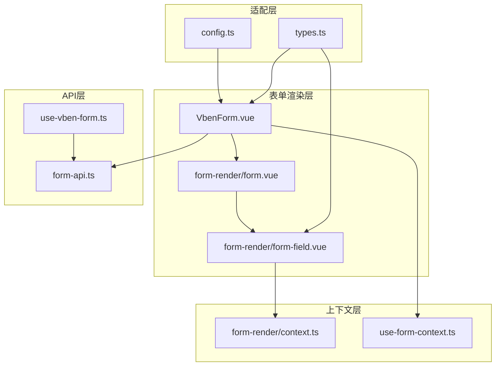
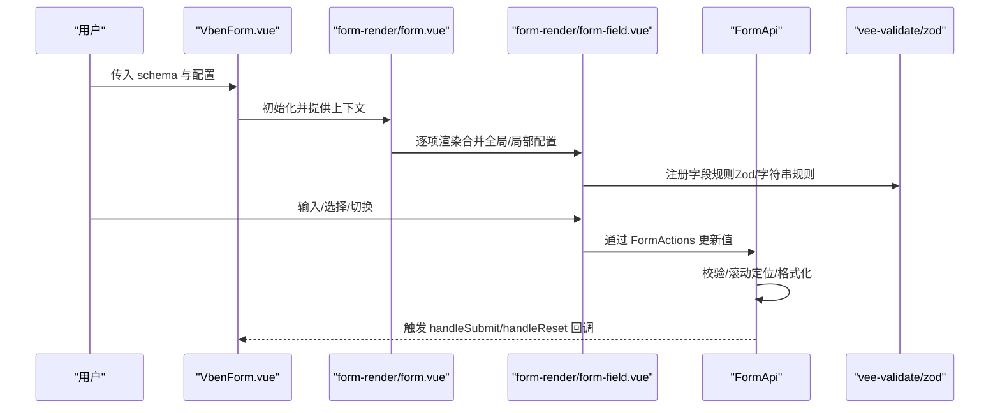
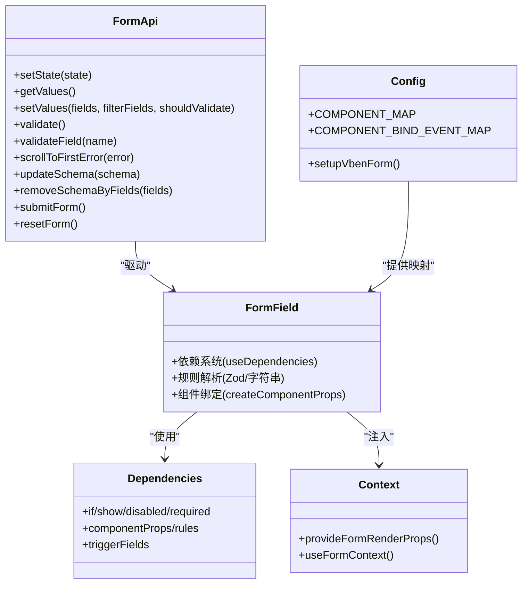

# 表单组件

<cite>
**本文引用的文件**
- [packages/@core/ui-kit/form-ui/src/index.ts](file://packages/@core/ui-kit/form-ui/src/index.ts)
- [packages/@core/ui-kit/form-ui/src/vben-form.vue](file://packages/@core/ui-kit/form-ui/src/vben-form.vue)
- [packages/@core/ui-kit/form-ui/src/types.ts](file://packages/@core/ui-kit/form-ui/src/types.ts)
- [packages/@core/ui-kit/form-ui/src/config.ts](file://packages/@core/ui-kit/form-ui/src/config.ts)
- [packages/@core/ui-kit/form-ui/src/form-render/form.vue](file://packages/@core/ui-kit/form-ui/src/form-render/form.vue)
- [packages/@core/ui-kit/form-ui/src/form-render/form-field.vue](file://packages/@core/ui-kit/form-ui/src/form-render/form-field.vue)
- [packages/@core/ui-kit/form-ui/src/use-vben-form.ts](file://packages/@core/ui-kit/form-ui/src/use-vben-form.ts)
- [packages/@core/ui-kit/form-ui/src/form-api.ts](file://packages/@core/ui-kit/form-ui/src/form-api.ts)
- [packages/@core/ui-kit/form-ui/src/form-render/dependencies.ts](file://packages/@core/ui-kit/form-ui/src/form-render/dependencies.ts)
- [packages/@core/ui-kit/form-ui/src/form-render/context.ts](file://packages/@core/ui-kit/form-ui/src/form-render/context.ts)
- [packages/@core/ui-kit/form-ui/src/use-form-context.ts](file://packages/@core/ui-kit/form-ui/src/use-form-context.ts)
- [packages/@core/ui-kit/form-ui/src/field-name.ts](file://packages/@core/ui-kit/form-ui/src/field-name.ts)
- [apps/web-naive/src/views/system/user/modules/form.vue](file://apps/web-naive/src/views/system/user/modules/form.vue)
- [apps/web-naive/src/views/system/dept/modules/form.vue](file://apps/web-naive/src/views/system/dept/modules/form.vue)
- [apps/web-naive/src/views/system/menu/modules/form.vue](file://apps/web-naive/src/views/system/menu/modules/form.vue)
- [playground/src/views/examples/form/api.vue](file://playground/src/views/examples/form/api.vue)
</cite>

## 目录

1. [简介](#简介)
2. [项目结构](#项目结构)
3. [核心组件](#核心组件)
4. [架构总览](#架构总览)
5. [组件详解](#组件详解)
6. [依赖关系分析](#依赖关系分析)
7. [性能考量](#性能考量)
8. [故障排查指南](#故障排查指南)
9. [结论](#结论)
10. [附录](#附录)

## 简介

本文件系统性梳理 shiyu-ui 的表单组件体系，重点覆盖以下方面：

- 设计架构与数据流：字段映射、验证规则、布局控制与动态依赖。
- 高级表单组件：ApiSelect、ApiTreeSelect、IconPicker 的实现思路与使用要点。
- 验证机制：内置验证器与自定义规则的集成方式。
- 数据绑定与状态管理：FormApi、Store、上下文与响应式联动。
- 错误处理策略：自动滚动定位、错误提示与调试辅助。
- 复杂场景示例与性能优化建议：多字段合并、时间范围映射、紧凑模式等。
- 可复用性与扩展性：组件映射、适配器、事件绑定与模型属性定制。

## 项目结构

表单能力主要集中在 @core/ui-kit/form-ui 包中，采用“渲染器 + 上下文 + API 封装”的分层设计：

- 渲染层：Form 与 FormField 负责根据 schema 动态渲染表单项，并接入 vee-validate 的验证与状态。
- 上下文层：provide/inject 提供组件映射、事件绑定映射、布局与全局配置。
- API 层：FormApi 封装表单生命周期、值读取/设置、验证、滚动定位、Schema 更新等。
- 适配层：setupVbenForm 提供组件注册、模型属性映射、规则定义与全局配置注入。

图表来源

- [packages/@core/ui-kit/form-ui/src/vben-form.vue:1-80](file://packages/@core/ui-kit/form-ui/src/vben-form.vue#L1-L80)
- [packages/@core/ui-kit/form-ui/src/form-render/form.vue:1-193](file://packages/@core/ui-kit/form-ui/src/form-render/form.vue#L1-L193)
- [packages/@core/ui-kit/form-ui/src/form-render/form-field.vue:1-465](file://packages/@core/ui-kit/form-ui/src/form-render/form-field.vue#L1-L465)
- [packages/@core/ui-kit/form-ui/src/form-render/context.ts:1-25](file://packages/@core/ui-kit/form-ui/src/form-render/context.ts#L1-L25)
- [packages/@core/ui-kit/form-ui/src/use-form-context.ts:1-110](file://packages/@core/ui-kit/form-ui/src/use-form-context.ts#L1-L110)
- [packages/@core/ui-kit/form-ui/src/form-api.ts:1-700](file://packages/@core/ui-kit/form-ui/src/form-api.ts#L1-L700)
- [packages/@core/ui-kit/form-ui/src/use-vben-form.ts:1-52](file://packages/@core/ui-kit/form-ui/src/use-vben-form.ts#L1-L52)
- [packages/@core/ui-kit/form-ui/src/config.ts:1-88](file://packages/@core/ui-kit/form-ui/src/config.ts#L1-L88)
- [packages/@core/ui-kit/form-ui/src/types.ts:1-537](file://packages/@core/ui-kit/form-ui/src/types.ts#L1-L537)

章节来源

- [packages/@core/ui-kit/form-ui/src/index.ts:1-14](file://packages/@core/ui-kit/form-ui/src/index.ts#L1-L14)
- [packages/@core/ui-kit/form-ui/src/vben-form.vue:1-80](file://packages/@core/ui-kit/form-ui/src/vben-form.vue#L1-L80)
- [packages/@core/ui-kit/form-ui/src/types.ts:1-537](file://packages/@core/ui-kit/form-ui/src/types.ts#L1-L537)

## 核心组件

- VbenForm：对外暴露的表单容器，负责初始化、提供上下文、转发属性与事件、控制默认操作区。
- Form：渲染器，基于 schema 生成表单项，合并全局与局部配置，处理折叠、紧凑模式与布局。
- FormField：单个表单项，封装标签、描述、帮助、错误提示、可折叠内容、组件绑定与依赖条件。
- FormApi：表单状态与行为的统一入口，提供值读取/设置、验证、滚动定位、Schema 更新、合并提交等。
- useVbenForm/useFormInitial：组合式 API，将选项转换为可响应的组件实例，管理生命周期与 Store 订阅。
- setupVbenForm：适配器，注册组件映射、事件绑定映射、全局配置与自定义规则。

章节来源

- [packages/@core/ui-kit/form-ui/src/vben-form.vue:1-80](file://packages/@core/ui-kit/form-ui/src/vben-form.vue#L1-L80)
- [packages/@core/ui-kit/form-ui/src/form-render/form.vue:1-193](file://packages/@core/ui-kit/form-ui/src/form-render/form.vue#L1-L193)
- [packages/@core/ui-kit/form-ui/src/form-render/form-field.vue:1-465](file://packages/@core/ui-kit/form-ui/src/form-render/form-field.vue#L1-L465)
- [packages/@core/ui-kit/form-ui/src/form-api.ts:1-700](file://packages/@core/ui-kit/form-ui/src/form-api.ts#L1-L700)
- [packages/@core/ui-kit/form-ui/src/use-vben-form.ts:1-52](file://packages/@core/ui-kit/form-ui/src/use-vben-form.ts#L1-L52)
- [packages/@core/ui-kit/form-ui/src/use-form-context.ts:1-110](file://packages/@core/ui-kit/form-ui/src/use-form-context.ts#L1-L110)
- [packages/@core/ui-kit/form-ui/src/config.ts:1-88](file://packages/@core/ui-kit/form-ui/src/config.ts#L1-L88)

## 架构总览

表单组件围绕“声明式 schema + 动态渲染 + 强大 API”构建，支持：

- 字段映射：支持数组转字符串、时间范围映射、字段值格式化回调。
- 验证规则：Zod 类型栈解析、内置 required/selectRequired、自定义规则注册。
- 布局控制：水平/垂直/内联布局、栅格类名、紧凑模式、折叠按钮与折叠行数。
- 动态依赖：基于触发字段的显示/隐藏、禁用、必填、组件属性与规则动态变更。
- 事件绑定：统一的模型属性绑定映射，兼容不同 UI 组件库的事件命名差异。

图表来源

- [packages/@core/ui-kit/form-ui/src/vben-form.vue:1-80](file://packages/@core/ui-kit/form-ui/src/vben-form.vue#L1-L80)
- [packages/@core/ui-kit/form-ui/src/form-render/form.vue:1-193](file://packages/@core/ui-kit/form-ui/src/form-render/form.vue#L1-L193)
- [packages/@core/ui-kit/form-ui/src/form-render/form-field.vue:1-465](file://packages/@core/ui-kit/form-ui/src/form-render/form-field.vue#L1-L465)
- [packages/@core/ui-kit/form-ui/src/form-api.ts:1-700](file://packages/@core/ui-kit/form-ui/src/form-api.ts#L1-L700)

## 组件详解

### VbenForm 容器与渲染器

- 职责：接收外部属性与 schema，提供全局配置与组件映射，转发默认插槽与操作区。
- 关键点：
  - 默认动作区：可显示/隐藏默认的“重置/提交”按钮组。
  - 折叠控制：支持折叠/展开状态同步与回调。
  - 事件透传：通过 useForwardPropsEmits 转发属性与事件，保证与父组件交互一致。

章节来源

- [packages/@core/ui-kit/form-ui/src/vben-form.vue:1-80](file://packages/@core/ui-kit/form-ui/src/vben-form.vue#L1-L80)

### Form 渲染器

- 职责：根据 schema 生成表单项列表，合并全局与局部配置，处理布局、紧凑模式、折叠按钮与隐藏逻辑。
- 关键点：
  - 形状推导：从 Zod 规则中提取默认值与必填状态。
  - 配置合并：全局 commonConfig 与局部 schema 配置按层级合并。
  - 折叠计算：结合 showCollapseButton、collapsed 与 keep index 控制隐藏项。

章节来源

- [packages/@core/ui-kit/form-ui/src/form-render/form.vue:1-193](file://packages/@core/ui-kit/form-ui/src/form-render/form.vue#L1-L193)

### FormField 单项渲染与依赖

- 职责：渲染单个表单项，处理标签、描述、帮助、错误提示、可折叠内容、组件绑定与依赖条件。
- 关键点：
  - 规则解析：支持字符串规则（required/selectRequired）与 Zod 类型栈；自动处理可选/默认值。
  - 组件绑定：根据组件类型与模型属性映射，统一绑定 v-model 事件；兼容事件对象包裹。
  - 依赖系统：支持 if/show/disabled/required/componentProps/rules/trigger 等条件，按触发字段动态更新。
  - 焦点与滚动：紧凑模式下通过 Tooltip 展示错误，支持滚动到首个错误字段。

章节来源

- [packages/@core/ui-kit/form-ui/src/form-render/form-field.vue:1-465](file://packages/@core/ui-kit/form-ui/src/form-render/form-field.vue#L1-L465)
- [packages/@core/ui-kit/form-ui/src/form-render/dependencies.ts:1-172](file://packages/@core/ui-kit/form-ui/src/form-render/dependencies.ts#L1-L172)

### FormApi 状态与行为

- 职责：统一管理表单状态、值读取/设置、验证、滚动定位、Schema 更新与合并提交。
- 关键点：
  - Store 驱动：基于 Store 的 setState/subscribe 实现响应式状态更新。
  - 值处理：支持数组转字符串、时间范围映射、字段值格式化回调；深层合并策略考虑日期对象。
  - 验证与滚动：validate/validateField/validateAndSubmitForm；scrollToFirstError 支持 DOM 与组件引用兜底。
  - 组件引用：维护字段组件实例映射，支持获取焦点字段与组件实例。
  - 合并提交：merge/submitAllForm 支持多表单聚合校验与合并结果。

章节来源

- [packages/@core/ui-kit/form-ui/src/form-api.ts:1-700](file://packages/@core/ui-kit/form-ui/src/form-api.ts#L1-L700)

### 适配器与类型系统

- setupVbenForm：注册组件映射、事件绑定映射、全局配置与自定义规则；支持基础模型属性名与组件映射覆盖。
- 类型系统：FormSchema/FormRenderProps/VbenFormProps/ExtendedFormApi 等，涵盖字段映射、布局、依赖、规则与值格式化。

章节来源

- [packages/@core/ui-kit/form-ui/src/config.ts:1-88](file://packages/@core/ui-kit/form-ui/src/config.ts#L1-L88)
- [packages/@core/ui-kit/form-ui/src/types.ts:1-537](file://packages/@core/ui-kit/form-ui/src/types.ts#L1-L537)

### 高级表单组件：ApiSelect、ApiTreeSelect、IconPicker

- 设计思路：
  - 组件注册：通过 setupVbenForm 将自定义组件（如 ApiSelect、ApiTreeSelect、IconPicker）注入到 COMPONENT_MAP 中。
  - 事件绑定：利用 COMPONENT_BIND_EVENT_MAP 统一模型属性名称（如 onUpdate:modelValue），兼容不同组件库的事件命名差异。
  - 动态依赖：在 dependencies 中按触发字段动态设置 options、disabled、required 等属性，实现联动效果。
  - 值格式化：结合 valueFormat 与 fieldMappingTime/arrayToStringFields，完成复杂字段的输入输出映射。
- 使用方法（步骤概述）：
  1. 在应用侧调用 setupVbenForm 注册组件与规则。
  2. 在 schema 中指定 component 为对应组件名，并通过 componentProps 传入远程数据源、占位符等。
  3. 使用 dependencies 配置联动逻辑，如根据某字段值动态设置 options 或禁用状态。
  4. 如需复杂映射，配置 valueFormat、fieldMappingTime、arrayToStringFields 等。

章节来源

- [packages/@core/ui-kit/form-ui/src/config.ts:1-88](file://packages/@core/ui-kit/form-ui/src/config.ts#L1-L88)
- [packages/@core/ui-kit/form-ui/src/form-render/dependencies.ts:1-172](file://packages/@core/ui-kit/form-ui/src/form-render/dependencies.ts#L1-L172)
- [packages/@core/ui-kit/form-ui/src/form-api.ts:506-640](file://packages/@core/ui-kit/form-ui/src/form-api.ts#L506-L640)

### 验证机制：内置与自定义

- 内置规则：required/selectRequired 字符串规则，由 setupVbenForm 注册。
- Zod 类型栈：自动解析 ZodOptional/ZodNullable/ZodDefault 等，推导必填状态与默认值。
- 自定义规则：通过 defineRule 注册，支持异步校验与国际化消息。
- 触发策略：支持 blur/change/input/modelUpdate 等多种触发时机，可在 FormFieldOptions 中配置。

章节来源

- [packages/@core/ui-kit/form-ui/src/config.ts:21-64](file://packages/@core/ui-kit/form-ui/src/config.ts#L21-L64)
- [packages/@core/ui-kit/form-ui/src/types.ts:38-45](file://packages/@core/ui-kit/form-ui/src/types.ts#L38-L45)
- [packages/@core/ui-kit/form-ui/src/form-render/form-field.vue:119-180](file://packages/@core/ui-kit/form-ui/src/form-render/form-field.vue#L119-L180)

### 数据绑定、状态管理与错误处理

- 数据绑定：统一通过 createComponentProps 生成绑定参数，自动处理事件对象包裹与模型属性映射。
- 状态管理：FormApi 基于 Store，支持 setState/watch/subscribe；useVbenForm 提供响应式包装。
- 错误处理：validate/validateField 返回错误对象；scrollToFirstError 支持 DOM 与组件引用定位；紧凑模式下通过 Tooltip 展示错误。

章节来源

- [packages/@core/ui-kit/form-ui/src/form-render/form-field.vue:283-299](file://packages/@core/ui-kit/form-ui/src/form-render/form-field.vue#L283-L299)
- [packages/@core/ui-kit/form-ui/src/form-api.ts:418-457](file://packages/@core/ui-kit/form-ui/src/form-api.ts#L418-L457)

### 复杂场景示例与实现要点

- 数组转字符串：通过 arrayToStringFields 配置，支持简单数组与嵌套数组格式，自定义分隔符。
- 时间范围映射：通过 fieldMappingTime 将“日期范围”字段映射为“开始时间/结束时间”两个字段，支持格式化函数或固定格式。
- 字段值格式化：通过 valueFormat 在取值阶段进行二次加工，支持将单一字段拆分为多个字段或回写到目标字段。
- 示例参考：
  - 用户/部门/菜单模块表单：展示复杂 schema 与联动配置。
  - Playground 的 API 表单示例：演示远程数据源与联动。

章节来源

- [packages/@core/ui-kit/form-ui/src/form-api.ts:506-640](file://packages/@core/ui-kit/form-ui/src/form-api.ts#L506-L640)
- [apps/web-naive/src/views/system/user/modules/form.vue](file://apps/web-naive/src/views/system/user/modules/form.vue)
- [apps/web-naive/src/views/system/dept/modules/form.vue](file://apps/web-naive/src/views/system/dept/modules/form.vue)
- [apps/web-naive/src/views/system/menu/modules/form.vue](file://apps/web-naive/src/views/system/menu/modules/form.vue)
- [playground/src/views/examples/form/api.vue](file://playground/src/views/examples/form/api.vue)

## 依赖关系分析

图表来源

- [packages/@core/ui-kit/form-ui/src/form-api.ts:1-700](file://packages/@core/ui-kit/form-ui/src/form-api.ts#L1-L700)
- [packages/@core/ui-kit/form-ui/src/form-render/form-field.vue:1-465](file://packages/@core/ui-kit/form-ui/src/form-render/form-field.vue#L1-L465)
- [packages/@core/ui-kit/form-ui/src/form-render/dependencies.ts:1-172](file://packages/@core/ui-kit/form-ui/src/form-render/dependencies.ts#L1-L172)
- [packages/@core/ui-kit/form-ui/src/form-render/context.ts:1-25](file://packages/@core/ui-kit/form-ui/src/form-render/context.ts#L1-L25)
- [packages/@core/ui-kit/form-ui/src/config.ts:1-88](file://packages/@core/ui-kit/form-ui/src/config.ts#L1-L88)

章节来源

- [packages/@core/ui-kit/form-ui/src/form-render/context.ts:1-25](file://packages/@core/ui-kit/form-ui/src/form-render/context.ts#L1-L25)
- [packages/@core/ui-kit/form-ui/src/use-form-context.ts:1-110](file://packages/@core/ui-kit/form-ui/src/use-form-context.ts#L1-L110)

## 性能考量

- 渲染优化
  - 折叠与 keep index：仅渲染保留索引之前的表单项，减少 DOM 数量。
  - 紧凑模式：移除每项底部空间，减少布局抖动与重排。
- 事件监听
  - 可配置禁用 change/input 监听，降低高频输入时的开销。
- 值处理
  - 深度合并策略避免不必要的对象深拷贝，对日期对象与数组做特殊处理。
- 验证策略
  - 支持按需触发（blur/change/input/modelUpdate），避免全量校验带来的性能损耗。

章节来源

- [packages/@core/ui-kit/form-ui/src/form-render/form.vue:94-169](file://packages/@core/ui-kit/form-ui/src/form-render/form.vue#L94-L169)
- [packages/@core/ui-kit/form-ui/src/form-render/form-field.vue:263-281](file://packages/@core/ui-kit/form-ui/src/form-render/form-field.vue#L263-L281)
- [packages/@core/ui-kit/form-ui/src/form-api.ts:348-362](file://packages/@core/ui-kit/form-ui/src/form-api.ts#L348-L362)

## 故障排查指南

- 表单未挂载
  - 现象：调用 getForm() 抛出异常。
  - 排查：确认在表单已 mount 后再调用 API；FormApi 内部通过条件等待保证挂载后再执行。
- 组件未注册
  - 现象：控制台警告“组件未注册”。
  - 排查：检查 setupVbenForm 是否正确注册组件映射；确保 schema 中 component 名称与映射一致。
- 事件绑定不生效
  - 现象：输入无响应或值未更新。
  - 排查：确认 COMPONENT_BIND_EVENT_MAP 是否覆盖了目标组件的模型属性名；检查组件 props 是否被动态覆盖。
- 折叠按钮无效
  - 现象：showCollapseButton=true 但折叠按钮不显示。
  - 排查：确认 collapsedRows 与 keep index 的计算逻辑；检查折叠状态与计算结果。
- 滚动定位失败
  - 现象：验证失败后无法滚动到首个错误字段。
  - 排查：确认 scrollToFirstError 开启；检查 name 属性与组件引用是否存在；必要时启用组件引用兜底。

章节来源

- [packages/@core/ui-kit/form-ui/src/form-api.ts:495-504](file://packages/@core/ui-kit/form-ui/src/form-api.ts#L495-L504)
- [packages/@core/ui-kit/form-ui/src/config.ts:72-86](file://packages/@core/ui-kit/form-ui/src/config.ts#L72-L86)
- [packages/@core/ui-kit/form-ui/src/form-render/form-field.vue:91-100](file://packages/@core/ui-kit/form-ui/src/form-render/form-field.vue#L91-L100)
- [packages/@core/ui-kit/form-ui/src/form-render/form.vue:94-96](file://packages/@core/ui-kit/form-ui/src/form-render/form.vue#L94-L96)
- [packages/@core/ui-kit/form-ui/src/form-api.ts:271-300](file://packages/@core/ui-kit/form-ui/src/form-api.ts#L271-L300)

## 结论

shiyu-ui 的表单组件以声明式 schema 为核心，结合 vee-validate 与 Zod，提供了强大的动态渲染、验证与状态管理能力。通过适配器与上下文抽象，实现了跨组件库的统一体验；通过依赖系统与值格式化，满足复杂业务场景下的字段映射与联动需求。建议在实际项目中：

- 明确 schema 设计与规则定义，充分利用 Zod 的类型安全与默认值提取。
- 合理配置依赖与联动，避免过度复杂的触发链导致性能问题。
- 使用紧凑模式与事件监听开关优化高频输入场景。
- 通过 FormApi 的合并提交与滚动定位提升用户体验与开发效率。

## 附录

- 字段路径解析：支持原始键与点/方括号路径，便于深层对象与数组场景。
- 组件映射与事件绑定：通过 setupVbenForm 注入，支持覆盖基础模型属性名与组件映射。
- 示例工程：系统模块表单与 Playground API 表单示例可作为参考模板。

章节来源

- [packages/@core/ui-kit/form-ui/src/field-name.ts:1-15](file://packages/@core/ui-kit/form-ui/src/field-name.ts#L1-L15)
- [packages/@core/ui-kit/form-ui/src/config.ts:66-86](file://packages/@core/ui-kit/form-ui/src/config.ts#L66-L86)
- [apps/web-naive/src/views/system/user/modules/form.vue](file://apps/web-naive/src/views/system/user/modules/form.vue)
- [playground/src/views/examples/form/api.vue](file://playground/src/views/examples/form/api.vue)
