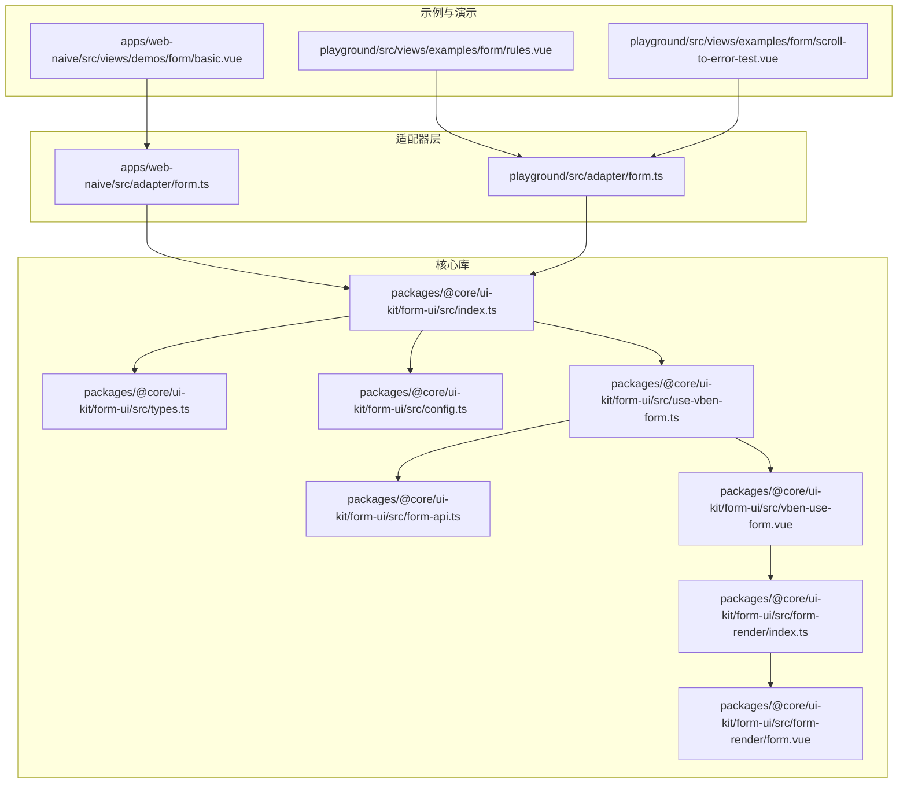
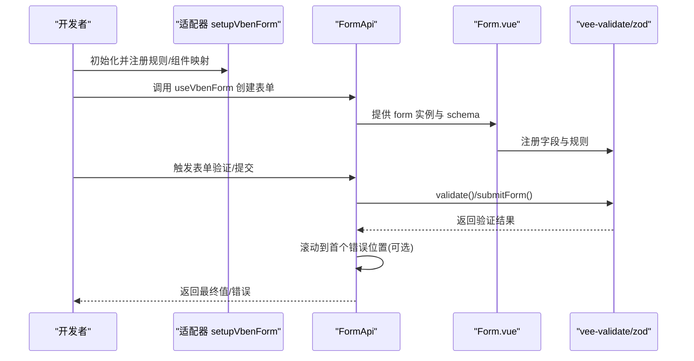
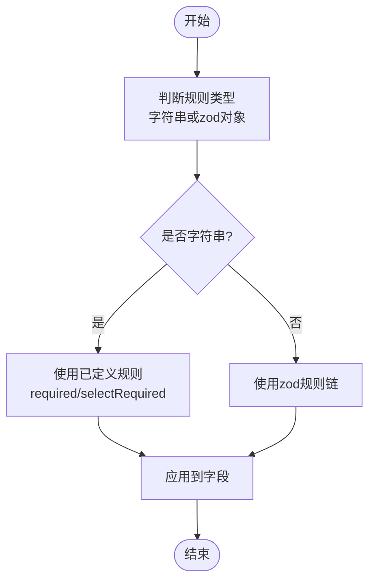
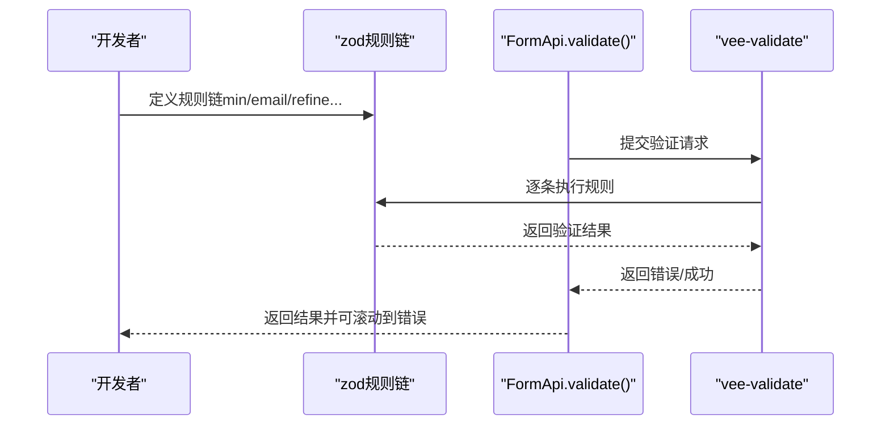
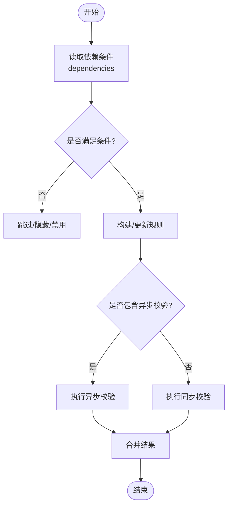
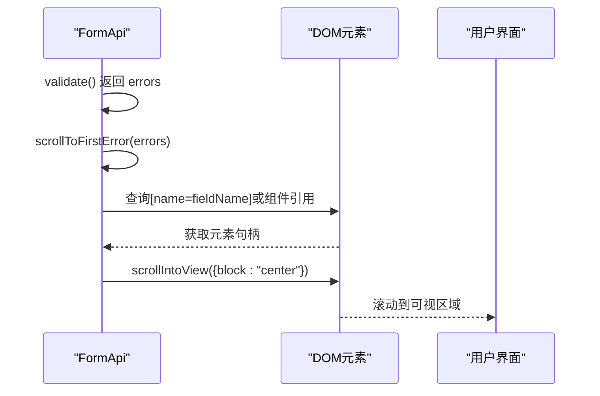
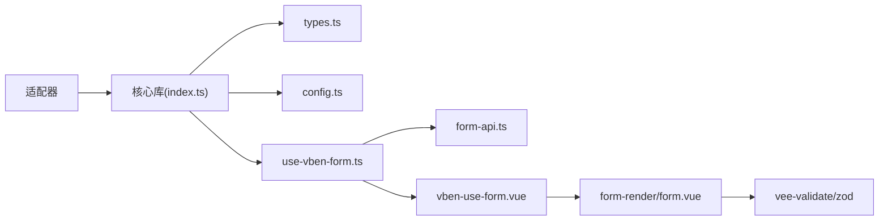

# 表单验证系统

<cite>
**本文档引用的文件**
- [packages/@core/ui-kit/form-ui/src/index.ts](file://packages/@core/ui-kit/form-ui/src/index.ts)
- [packages/@core/ui-kit/form-ui/src/types.ts](file://packages/@core/ui-kit/form-ui/src/types.ts)
- [packages/@core/ui-kit/form-ui/src/config.ts](file://packages/@core/ui-kit/form-ui/src/config.ts)
- [packages/@core/ui-kit/form-ui/src/use-vben-form.ts](file://packages/@core/ui-kit/form-ui/src/use-vben-form.ts)
- [packages/@core/ui-kit/form-ui/src/form-api.ts](file://packages/@core/ui-kit/form-ui/src/form-api.ts)
- [packages/@core/ui-kit/form-ui/src/vben-use-form.vue](file://packages/@core/ui-kit/form-ui/src/vben-use-form.vue)
- [packages/@core/ui-kit/form-ui/src/form-render/index.ts](file://packages/@core/ui-kit/form-ui/src/form-render/index.ts)
- [packages/@core/ui-kit/form-ui/src/form-render/form.vue](file://packages/@core/ui-kit/form-ui/src/form-render/form.vue)
- [apps/web-naive/src/adapter/form.ts](file://apps/web-naive/src/adapter/form.ts)
- [playground/src/adapter/form.ts](file://playground/src/adapter/form.ts)
- [playground/src/views/examples/form/rules.vue](file://playground/src/views/examples/form/rules.vue)
- [playground/src/views/examples/form/scroll-to-error-test.vue](file://playground/src/views/examples/form/scroll-to-error-test.vue)
- [apps/web-naive/src/views/demos/form/basic.vue](file://apps/web-naive/src/views/demos/form/basic.vue)
</cite>

## 目录

1. [简介](#简介)
2. [项目结构](#项目结构)
3. [核心组件](#核心组件)
4. [架构总览](#架构总览)
5. [详细组件分析](#详细组件分析)
6. [依赖关系分析](#依赖关系分析)
7. [性能考量](#性能考量)
8. [故障排查指南](#故障排查指南)
9. [结论](#结论)
10. [附录](#附录)

## 简介

本文件面向 shiyu-ui 项目的表单验证系统，系统基于 vee-validate 与 zod，结合 Vue 组合式 API 实现。其特性包括：

- 内置验证规则：必填、选择类必填等
- 自定义规则：通过适配器注册，支持国际化消息
- 验证策略：按需触发、防抖提交、回车提交
- 异步验证：基于 zod refine 与异步函数
- 条件验证与跨字段验证：通过 schema 的依赖与规则组合
- 错误收集与展示：统一收集、滚动到首个错误位置
- 用户体验优化：紧凑布局、自动滚动、回车提交、防抖

## 项目结构

围绕表单验证系统的关键模块如下：

- 类型与配置：定义表单 Schema、规则类型、组件映射、事件映射与默认配置
- 适配器：封装 setupVbenForm，注册规则与组件映射
- API 封装：FormApi 提供统一的表单操作、验证、滚动、值格式化等能力
- 渲染层：Form.vue 将 schema 解析为具体表单项，结合 vee-validate/zod 完成验证
- 示例与演示：提供内置规则、异步验证、滚动到错误等示例

图表来源

- [packages/@core/ui-kit/form-ui/src/index.ts:1-14](file://packages/@core/ui-kit/form-ui/src/index.ts#L1-L14)
- [packages/@core/ui-kit/form-ui/src/types.ts:1-537](file://packages/@core/ui-kit/form-ui/src/types.ts#L1-L537)
- [packages/@core/ui-kit/form-ui/src/config.ts:1-88](file://packages/@core/ui-kit/form-ui/src/config.ts#L1-L88)
- [packages/@core/ui-kit/form-ui/src/use-vben-form.ts:1-52](file://packages/@core/ui-kit/form-ui/src/use-vben-form.ts#L1-L52)
- [packages/@core/ui-kit/form-ui/src/form-api.ts:1-700](file://packages/@core/ui-kit/form-ui/src/form-api.ts#L1-L700)
- [packages/@core/ui-kit/form-ui/src/vben-use-form.vue:1-152](file://packages/@core/ui-kit/form-ui/src/vben-use-form.vue#L1-L152)
- [packages/@core/ui-kit/form-ui/src/form-render/index.ts:1-4](file://packages/@core/ui-kit/form-ui/src/form-render/index.ts#L1-L4)
- [packages/@core/ui-kit/form-ui/src/form-render/form.vue:1-193](file://packages/@core/ui-kit/form-ui/src/form-render/form.vue#L1-L193)
- [apps/web-naive/src/adapter/form.ts:1-46](file://apps/web-naive/src/adapter/form.ts#L1-L46)
- [playground/src/adapter/form.ts:1-49](file://playground/src/adapter/form.ts#L1-L49)
- [playground/src/views/examples/form/rules.vue:1-246](file://playground/src/views/examples/form/rules.vue#L1-L246)
- [playground/src/views/examples/form/scroll-to-error-test.vue:1-184](file://playground/src/views/examples/form/scroll-to-error-test.vue#L1-L184)
- [apps/web-naive/src/views/demos/form/basic.vue:1-181](file://apps/web-naive/src/views/demos/form/basic.vue#L1-L181)

章节来源

- [packages/@core/ui-kit/form-ui/src/index.ts:1-14](file://packages/@core/ui-kit/form-ui/src/index.ts#L1-L14)
- [packages/@core/ui-kit/form-ui/src/types.ts:1-537](file://packages/@core/ui-kit/form-ui/src/types.ts#L1-L537)
- [packages/@core/ui-kit/form-ui/src/config.ts:1-88](file://packages/@core/ui-kit/form-ui/src/config.ts#L1-L88)
- [packages/@core/ui-kit/form-ui/src/use-vben-form.ts:1-52](file://packages/@core/ui-kit/form-ui/src/use-vben-form.ts#L1-L52)
- [packages/@core/ui-kit/form-ui/src/form-api.ts:1-700](file://packages/@core/ui-kit/form-ui/src/form-api.ts#L1-L700)
- [packages/@core/ui-kit/form-ui/src/vben-use-form.vue:1-152](file://packages/@core/ui-kit/form-ui/src/vben-use-form.vue#L1-L152)
- [packages/@core/ui-kit/form-ui/src/form-render/index.ts:1-4](file://packages/@core/ui-kit/form-ui/src/form-render/index.ts#L1-L4)
- [packages/@core/ui-kit/form-ui/src/form-render/form.vue:1-193](file://packages/@core/ui-kit/form-ui/src/form-render/form.vue#L1-L193)
- [apps/web-naive/src/adapter/form.ts:1-46](file://apps/web-naive/src/adapter/form.ts#L1-L46)
- [playground/src/adapter/form.ts:1-49](file://playground/src/adapter/form.ts#L1-L49)
- [playground/src/views/examples/form/rules.vue:1-246](file://playground/src/views/examples/form/rules.vue#L1-L246)
- [playground/src/views/examples/form/scroll-to-error-test.vue:1-184](file://playground/src/views/examples/form/scroll-to-error-test.vue#L1-L184)
- [apps/web-naive/src/views/demos/form/basic.vue:1-181](file://apps/web-naive/src/views/demos/form/basic.vue#L1-L181)

## 核心组件

- 类型与规则定义：FormSchema、FormSchemaRuleType、FormFieldOptions、ExtendedFormApi 等，支撑 schema 驱动的表单渲染与验证
- 适配器 setupVbenForm：注册组件映射、事件映射、默认配置与自定义规则
- useVbenForm：对外暴露的组合式 API，返回 Form 组件与扩展 API
- FormApi：统一的表单操作入口，封装验证、滚动、值格式化、合并表单等
- 渲染组件 Form.vue：解析 schema，生成表单项，注入验证规则与默认配置
- vben-use-form.vue：桥接渲染层与 API 层，处理键盘事件、值变更、防抖提交等

章节来源

- [packages/@core/ui-kit/form-ui/src/types.ts:1-537](file://packages/@core/ui-kit/form-ui/src/types.ts#L1-L537)
- [packages/@core/ui-kit/form-ui/src/config.ts:1-88](file://packages/@core/ui-kit/form-ui/src/config.ts#L1-L88)
- [packages/@core/ui-kit/form-ui/src/use-vben-form.ts:1-52](file://packages/@core/ui-kit/form-ui/src/use-vben-form.ts#L1-L52)
- [packages/@core/ui-kit/form-ui/src/form-api.ts:1-700](file://packages/@core/ui-kit/form-ui/src/form-api.ts#L1-L700)
- [packages/@core/ui-kit/form-ui/src/form-render/form.vue:1-193](file://packages/@core/ui-kit/form-ui/src/form-render/form.vue#L1-L193)
- [packages/@core/ui-kit/form-ui/src/vben-use-form.vue:1-152](file://packages/@core/ui-kit/form-ui/src/vben-use-form.vue#L1-L152)

## 架构总览

系统采用“适配器 + 核心库 + 渲染层 + 示例”的分层设计：

- 适配器层负责平台差异（如 Naive UI、Ant Design Vue）的组件映射与规则本地化
- 核心库提供统一的 API 与状态管理，屏蔽底层框架差异
- 渲染层将 schema 转为真实表单项，结合 vee-validate/zod 完成验证
- 示例与演示验证不同场景下的规则组合与交互体验

图表来源

- [packages/@core/ui-kit/form-ui/src/config.ts:43-88](file://packages/@core/ui-kit/form-ui/src/config.ts#L43-L88)
- [packages/@core/ui-kit/form-ui/src/form-api.ts:418-457](file://packages/@core/ui-kit/form-ui/src/form-api.ts#L418-L457)
- [packages/@core/ui-kit/form-ui/src/form-render/form.vue:59-80](file://packages/@core/ui-kit/form-ui/src/form-render/form.vue#L59-L80)
- [packages/@core/ui-kit/form-ui/src/vben-use-form.vue:52-68](file://packages/@core/ui-kit/form-ui/src/vben-use-form.vue#L52-L68)

## 详细组件分析

### 内置验证规则与实现原理

- 必填规则（required）：针对字符串/数组等进行长度判断；选择类必填（selectRequired）：针对选择类组件进行空值判断
- 规则注册：通过适配器的 defineRules 注册，支持国际化消息
- 规则类型：FormSchemaRuleType 支持字符串规则名与 zod 规则对象

图表来源

- [packages/@core/ui-kit/form-ui/src/types.ts:78-83](file://packages/@core/ui-kit/form-ui/src/types.ts#L78-L83)
- [apps/web-naive/src/adapter/form.ts:23-36](file://apps/web-naive/src/adapter/form.ts#L23-L36)
- [playground/src/adapter/form.ts:24-39](file://playground/src/adapter/form.ts#L24-L39)

章节来源

- [packages/@core/ui-kit/form-ui/src/types.ts:78-83](file://packages/@core/ui-kit/form-ui/src/types.ts#L78-L83)
- [apps/web-naive/src/adapter/form.ts:23-36](file://apps/web-naive/src/adapter/form.ts#L23-L36)
- [playground/src/adapter/form.ts:24-39](file://playground/src/adapter/form.ts#L24-L39)

### 自定义验证规则与组合策略

- 自定义规则：通过适配器的 defineRules 注册，返回布尔或错误消息
- 组合策略：zod 规则链组合（如 min、email、refine），支持同步与异步 refine
- 示例：用户名唯一性校验（异步）、手机号格式校验（正则）

图表来源

- [playground/src/views/examples/form/rules.vue:200-220](file://playground/src/views/examples/form/rules.vue#L200-L220)
- [packages/@core/ui-kit/form-ui/src/form-api.ts:418-457](file://packages/@core/ui-kit/form-ui/src/form-api.ts#L418-L457)

章节来源

- [playground/src/views/examples/form/rules.vue:200-220](file://playground/src/views/examples/form/rules.vue#L200-L220)
- [packages/@core/ui-kit/form-ui/src/form-api.ts:418-457](file://packages/@core/ui-kit/form-ui/src/form-api.ts#L418-L457)

### 异步验证、条件验证与跨字段验证

- 异步验证：zod refine 中使用异步函数，等待外部服务校验
- 条件验证：schema 的 dependencies 支持根据其他字段动态决定是否必填、是否渲染、是否禁用、规则如何变化
- 跨字段验证：通过 refine 访问 values，实现字段间联动校验（如组合字段校验）

图表来源

- [packages/@core/ui-kit/form-ui/src/types.ts:103-141](file://packages/@core/ui-kit/form-ui/src/types.ts#L103-L141)
- [playground/src/views/examples/form/custom.vue:64-76](file://playground/src/views/examples/form/custom.vue#L64-L76)

章节来源

- [packages/@core/ui-kit/form-ui/src/types.ts:103-141](file://packages/@core/ui-kit/form-ui/src/types.ts#L103-L141)
- [playground/src/views/examples/form/custom.vue:64-76](file://playground/src/views/examples/form/custom.vue#L64-L76)

### 验证错误的收集、显示与定位

- 收集：FormApi.validate/validateField 返回 errors 对象
- 显示：渲染层根据字段名与错误消息展示
- 定位：scrollToFirstError 通过 name 属性或组件引用定位首个错误元素并平滑滚动

图表来源

- [packages/@core/ui-kit/form-ui/src/form-api.ts:271-300](file://packages/@core/ui-kit/form-ui/src/form-api.ts#L271-L300)
- [packages/@core/ui-kit/form-ui/src/vben-use-form.vue:52-64](file://packages/@core/ui-kit/form-ui/src/vben-use-form.vue#L52-L64)

章节来源

- [packages/@core/ui-kit/form-ui/src/form-api.ts:271-300](file://packages/@core/ui-kit/form-ui/src/form-api.ts#L271-L300)
- [packages/@core/ui-kit/form-ui/src/vben-use-form.vue:52-64](file://packages/@core/ui-kit/form-ui/src/vben-use-form.vue#L52-L64)

### 用户体验优化：滚动到错误位置

- 开关：VbenFormProps.scrollToFirstError 控制是否自动滚动
- 触发点：validate/validateAndSubmitForm/validateField 失败时触发
- 定位策略：优先通过 name 属性定位，兜底通过组件引用获取元素

章节来源

- [packages/@core/ui-kit/form-ui/src/types.ts:479-482](file://packages/@core/ui-kit/form-ui/src/types.ts#L479-L482)
- [packages/@core/ui-kit/form-ui/src/form-api.ts:418-457](file://packages/@core/ui-kit/form-ui/src/form-api.ts#L418-L457)
- [playground/src/views/examples/form/scroll-to-error-test.vue:16-97](file://playground/src/views/examples/form/scroll-to-error-test.vue#L16-L97)

### 复杂验证场景示例

- 基础规则：必填、邮箱、数字范围、选择类必填
- 异步校验：用户名唯一性
- 条件渲染与规则：根据其他字段动态启用/禁用、显示/隐藏、必填与否
- 跨字段校验：组合字段校验（类型+手机号）

章节来源

- [apps/web-naive/src/views/demos/form/basic.vue:26-146](file://apps/web-naive/src/views/demos/form/basic.vue#L26-L146)
- [playground/src/views/examples/form/rules.vue:200-220](file://playground/src/views/examples/form/rules.vue#L200-L220)
- [playground/src/views/examples/form/custom.vue:64-76](file://playground/src/views/examples/form/custom.vue#L64-L76)

## 依赖关系分析

- 适配器依赖核心库导出的 setupVbenForm/useVbenForm 与 z
- Form.vue 依赖 vee-validate/zod 与 shadcn-ui 组件
- vben-use-form.vue 依赖 Form.vue 与上下文提供者
- FormApi 依赖 vee-validate 与内部工具集

图表来源

- [packages/@core/ui-kit/form-ui/src/index.ts:1-14](file://packages/@core/ui-kit/form-ui/src/index.ts#L1-L14)
- [packages/@core/ui-kit/form-ui/src/types.ts:1-537](file://packages/@core/ui-kit/form-ui/src/types.ts#L1-L537)
- [packages/@core/ui-kit/form-ui/src/config.ts:1-88](file://packages/@core/ui-kit/form-ui/src/config.ts#L1-L88)
- [packages/@core/ui-kit/form-ui/src/use-vben-form.ts:1-52](file://packages/@core/ui-kit/form-ui/src/use-vben-form.ts#L1-L52)
- [packages/@core/ui-kit/form-ui/src/form-api.ts:1-700](file://packages/@core/ui-kit/form-ui/src/form-api.ts#L1-L700)
- [packages/@core/ui-kit/form-ui/src/vben-use-form.vue:1-152](file://packages/@core/ui-kit/form-ui/src/vben-use-form.vue#L1-L152)
- [packages/@core/ui-kit/form-ui/src/form-render/form.vue:1-193](file://packages/@core/ui-kit/form-ui/src/form-render/form.vue#L1-L193)

章节来源

- [packages/@core/ui-kit/form-ui/src/index.ts:1-14](file://packages/@core/ui-kit/form-ui/src/index.ts#L1-L14)
- [packages/@core/ui-kit/form-ui/src/types.ts:1-537](file://packages/@core/ui-kit/form-ui/src/types.ts#L1-L537)
- [packages/@core/ui-kit/form-ui/src/config.ts:1-88](file://packages/@core/ui-kit/form-ui/src/config.ts#L1-L88)
- [packages/@core/ui-kit/form-ui/src/use-vben-form.ts:1-52](file://packages/@core/ui-kit/form-ui/src/use-vben-form.ts#L1-L52)
- [packages/@core/ui-kit/form-ui/src/form-api.ts:1-700](file://packages/@core/ui-kit/form-ui/src/form-api.ts#L1-L700)
- [packages/@core/ui-kit/form-ui/src/vben-use-form.vue:1-152](file://packages/@core/ui-kit/form-ui/src/vben-use-form.vue#L1-L152)
- [packages/@core/ui-kit/form-ui/src/form-render/form.vue:1-193](file://packages/@core/ui-kit/form-ui/src/form-render/form.vue#L1-L193)

## 性能考量

- 防抖提交：在 vben-use-form.vue 中对值变更进行防抖，减少频繁提交
- 条件渲染与懒加载：通过 dependencies 动态控制渲染与规则，避免不必要的计算
- 值格式化与合并：在 FormApi 中对复杂值进行格式化与合并，避免深层对象深度合并带来的性能问题
- 异步校验：合理设置超时与并发策略，避免阻塞 UI

章节来源

- [packages/@core/ui-kit/form-ui/src/vben-use-form.vue:66-68](file://packages/@core/ui-kit/form-ui/src/vben-use-form.vue#L66-L68)
- [packages/@core/ui-kit/form-ui/src/form-api.ts:331-362](file://packages/@core/ui-kit/form-ui/src/form-api.ts#L331-L362)

## 故障排查指南

- 表单未挂载：FormApi.getForm 在未挂载时会抛出异常，需确保在 mounted 后调用
- 滚动无效：确认字段存在 name 属性或组件引用可用；若无，检查组件是否正确提供 $el
- 规则不生效：检查适配器是否正确注册规则；确认 schema.rules 为字符串规则名或 zod 对象
- 异步校验卡顿：检查 refine 中的异步逻辑是否合理，必要时增加缓存与去抖

章节来源

- [packages/@core/ui-kit/form-ui/src/form-api.ts:495-504](file://packages/@core/ui-kit/form-ui/src/form-api.ts#L495-L504)
- [packages/@core/ui-kit/form-ui/src/form-api.ts:271-300](file://packages/@core/ui-kit/form-ui/src/form-api.ts#L271-L300)
- [apps/web-naive/src/adapter/form.ts:23-36](file://apps/web-naive/src/adapter/form.ts#L23-L36)
- [playground/src/adapter/form.ts:24-39](file://playground/src/adapter/form.ts#L24-L39)

## 结论

shiyu-ui 的表单验证系统通过适配器抽象平台差异，借助 vee-validate 与 zod 实现强大的规则体系与灵活的验证策略。系统提供了完善的错误收集、展示与定位能力，并通过防抖、条件渲染与值格式化等手段优化用户体验与性能。开发者可基于示例快速实现复杂场景的表单验证需求。

## 附录

- 关键 API 速查
  - setupVbenForm：注册组件映射、事件映射与自定义规则
  - useVbenForm：创建表单组件与扩展 API
  - FormApi：验证、滚动、值格式化、合并表单等
  - Form.vue：schema 渲染与规则注入
  - vben-use-form.vue：键盘事件、值变更与防抖提交

章节来源

- [packages/@core/ui-kit/form-ui/src/config.ts:43-88](file://packages/@core/ui-kit/form-ui/src/config.ts#L43-L88)
- [packages/@core/ui-kit/form-ui/src/use-vben-form.ts:14-51](file://packages/@core/ui-kit/form-ui/src/use-vben-form.ts#L14-L51)
- [packages/@core/ui-kit/form-ui/src/form-api.ts:418-457](file://packages/@core/ui-kit/form-ui/src/form-api.ts#L418-L457)
- [packages/@core/ui-kit/form-ui/src/form-render/form.vue:59-80](file://packages/@core/ui-kit/form-ui/src/form-render/form.vue#L59-L80)
- [packages/@core/ui-kit/form-ui/src/vben-use-form.vue:52-68](file://packages/@core/ui-kit/form-ui/src/vben-use-form.vue#L52-L68)
