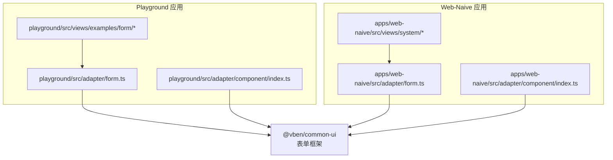
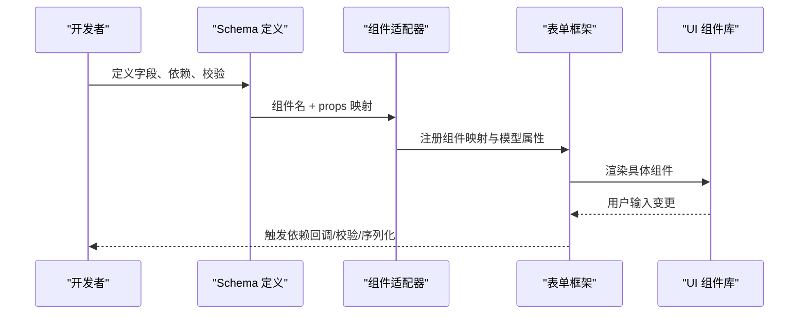
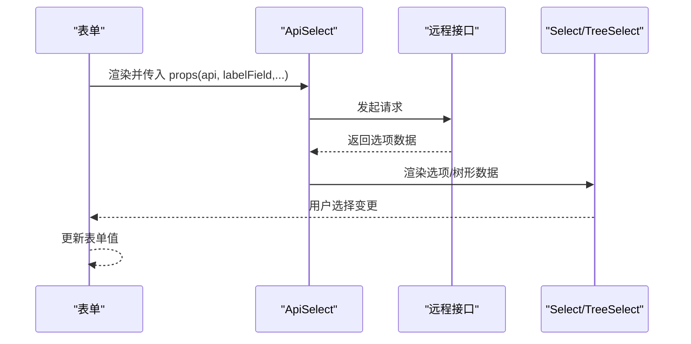
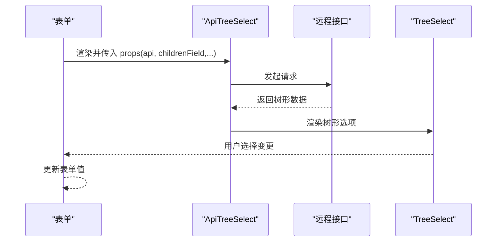
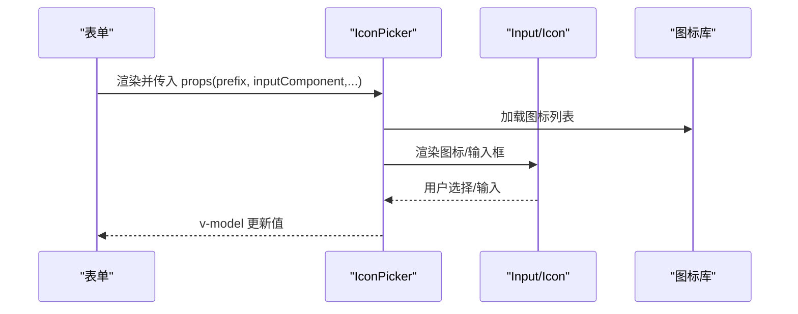
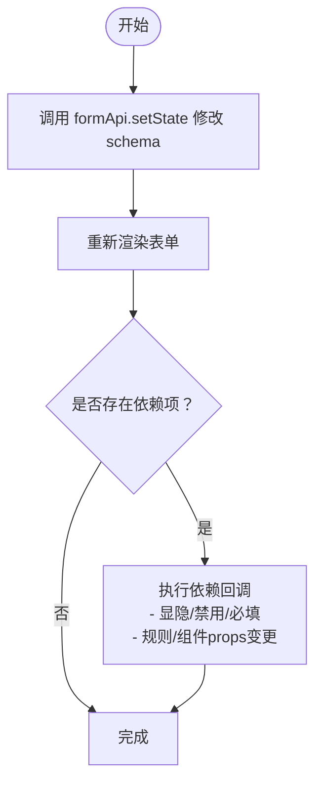
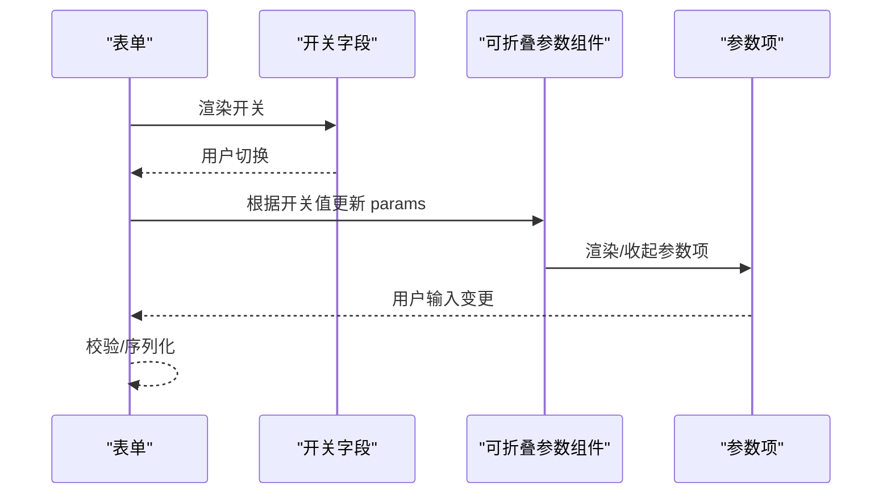
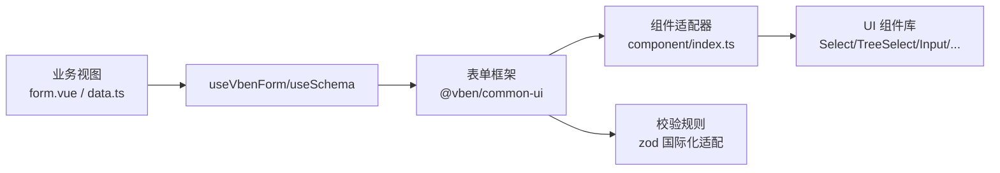

# 高级表单组件

<cite>
**本文引用的文件**
- [playground/src/views/examples/form/dynamic.vue](file://playground/src/views/examples/form/dynamic.vue)
- [playground/src/views/examples/form/custom.vue](file://playground/src/views/examples/form/custom.vue)
- [playground/src/views/examples/form/collapsible.vue](file://playground/src/views/examples/form/collapsible.vue)
- [playground/src/views/examples/form/api.vue](file://playground/src/views/examples/form/api.vue)
- [playground/src/views/examples/form/basic.vue](file://playground/src/views/examples/form/basic.vue)
- [playground/src/views/demos/features/icons/index.vue](file://playground/src/views/demos/features/icons/index.vue)
- [playground/src/views/system/dept/modules/form.vue](file://playground/src/views/system/dept/modules/form.vue)
- [apps/web-naive/src/views/system/user/data.ts](file://apps/web-naive/src/views/system/user/data.ts)
- [apps/web-naive/src/views/system/role/data.ts](file://apps/web-naive/src/views/system/role/data.ts)
- [playground/src/adapter/form.ts](file://playground/src/adapter/form.ts)
- [apps/web-naive/src/adapter/form.ts](file://apps/web-naive/src/adapter/form.ts)
- [playground/src/adapter/component/index.ts](file://playground/src/adapter/component/index.ts)
- [apps/web-naive/src/adapter/component/index.ts](file://apps/web-naive/src/adapter/component/index.ts)
</cite>

## 目录

1. [简介](#简介)
2. [项目结构](#项目结构)
3. [核心组件](#核心组件)
4. [架构总览](#架构总览)
5. [详细组件分析](#详细组件分析)
6. [依赖关系分析](#依赖关系分析)
7. [性能考量](#性能考量)
8. [故障排查指南](#故障排查指南)
9. [结论](#结论)
10. [附录](#附录)

## 简介

本文件面向 shiyu-ui 的高级表单场景，系统性梳理并说明以下能力：

- 高级表单组件：ApiSelect、ApiTreeSelect、IconPicker 的实现原理与使用场景
- 动态表单：字段的动态添加、删除、更新与联动（依赖项）
- 可折叠表单、分组表单与嵌套表单的实现策略
- 复杂数据结构的表单绑定与序列化处理
- 表单组件的性能优化与内存管理最佳实践
- 实际业务场景中的应用案例与解决方案

## 项目结构

本项目采用多应用与多包的 Monorepo 结构，表单相关的核心代码集中在 playground 应用与 apps/web-naive 应用中，配合统一的 @vben/common-ui 提供的表单框架能力。

图表来源

- [playground/src/adapter/form.ts:1-49](file://playground/src/adapter/form.ts#L1-L49)
- [apps/web-naive/src/adapter/form.ts:1-45](file://apps/web-naive/src/adapter/form.ts#L1-L45)
- [playground/src/adapter/component/index.ts:677-715](file://playground/src/adapter/component/index.ts#L677-L715)
- [apps/web-naive/src/adapter/component/index.ts:141-167](file://apps/web-naive/src/adapter/component/index.ts#L141-L167)

章节来源

- [playground/src/adapter/form.ts:1-49](file://playground/src/adapter/form.ts#L1-L49)
- [apps/web-naive/src/adapter/form.ts:1-45](file://apps/web-naive/src/adapter/form.ts#L1-L45)
- [playground/src/adapter/component/index.ts:677-715](file://playground/src/adapter/component/index.ts#L677-L715)
- [apps/web-naive/src/adapter/component/index.ts:141-167](file://apps/web-naive/src/adapter/component/index.ts#L141-L167)

## 核心组件

- ApiSelect：基于远程接口获取选项，支持标签字段、值字段、子节点字段映射，适用于部门、菜单等树形或层级数据的选择。
- ApiTreeSelect：在 ApiSelect 基础上扩展为树形选择，适合层级组织架构、菜单树等场景。
- IconPicker：提供图标选择交互，支持多种图标源（Iconify、SVG、自定义前缀），可作为 Input 的附加内容或独立展示。

章节来源

- [playground/src/adapter/component/index.ts:684-697](file://playground/src/adapter/component/index.ts#L684-L697)
- [apps/web-naive/src/adapter/component/index.ts:144-151](file://apps/web-naive/src/adapter/component/index.ts#L144-L151)
- [playground/src/views/examples/form/basic.vue:136-172](file://playground/src/views/examples/form/basic.vue#L136-L172)
- [playground/src/views/demos/features/icons/index.vue:81-115](file://playground/src/views/demos/features/icons/index.vue#L81-L115)

## 架构总览

高级表单以“Schema 驱动 + 组件适配器”为核心：

- Schema 定义表单项的组件类型、字段名、标签、默认值、校验规则、依赖联动等
- 组件适配器负责将通用 Schema 映射到具体 UI 组件库（Ant Design Vue、Naive UI 等）
- 表单框架提供状态管理、联动计算、校验、序列化等能力

图表来源

- [playground/src/adapter/form.ts:11-41](file://playground/src/adapter/form.ts#L11-L41)
- [apps/web-naive/src/adapter/form.ts:11-38](file://apps/web-naive/src/adapter/form.ts#L11-L38)
- [playground/src/adapter/component/index.ts:677-715](file://playground/src/adapter/component/index.ts#L677-L715)

## 详细组件分析

### ApiSelect 组件

- 实现要点
  - 通过 ApiComponent 封装远程数据获取与加载态展示
  - 支持 labelField、valueField、childrenField 等字段映射，兼容树形数据
  - 默认使用 Select 组件，支持加载态插槽与可见事件
- 典型用法
  - 在 Schema 中声明 component: 'ApiSelect'，并传入 api、labelField、valueField 等 props
  - 适用于部门、菜单等需要从后端获取选项的场景
- 数据流
  - 初始化时根据 api 请求数据
  - 选项渲染使用 Select 的 options 或 treeData（取决于是否为树形）

图表来源

- [playground/src/adapter/component/index.ts:684-689](file://playground/src/adapter/component/index.ts#L684-L689)
- [playground/src/views/examples/form/basic.vue:136-149](file://playground/src/views/examples/form/basic.vue#L136-L149)

章节来源

- [playground/src/adapter/component/index.ts:684-689](file://playground/src/adapter/component/index.ts#L684-L689)
- [playground/src/views/examples/form/basic.vue:136-149](file://playground/src/views/examples/form/basic.vue#L136-L149)

### ApiTreeSelect 组件

- 实现要点
  - 在 ApiSelect 基础上切换为 TreeSelect，启用 childrenField 映射
  - 通过 fieldNames 与 optionsPropName 指定树形数据结构
- 典型用法
  - 用于组织架构、菜单树等层级选择
- 数据流
  - 与 ApiSelect 类似，但渲染为树形结构，支持父子联动选择

图表来源

- [playground/src/adapter/component/index.ts:690-697](file://playground/src/adapter/component/index.ts#L690-L697)
- [playground/src/views/examples/form/basic.vue:136-149](file://playground/src/views/examples/form/basic.vue#L136-L149)

章节来源

- [playground/src/adapter/component/index.ts:690-697](file://playground/src/adapter/component/index.ts#L690-L697)
- [playground/src/views/examples/form/basic.vue:136-149](file://playground/src/views/examples/form/basic.vue#L136-L149)

### IconPicker 组件

- 实现要点
  - 作为独立选择器，支持多种图标源（Iconify、SVG、自定义前缀）
  - 可作为 Input 的 addonAfter 插槽使用，或直接展示为图标
  - 支持自定义 input 组件、modelValueProp、iconSlot 等
- 典型用法
  - 作为表单项使用，或在 Input 的 addonAfter 中集成
- 数据流
  - 用户选择图标后，通过 v-model 更新值
  - 可与表单联动，参与序列化与校验

图表来源

- [playground/src/adapter/component/index.ts:708-712](file://playground/src/adapter/component/index.ts#L708-L712)
- [playground/src/views/demos/features/icons/index.vue:81-115](file://playground/src/views/demos/features/icons/index.vue#L81-L115)

章节来源

- [playground/src/adapter/component/index.ts:708-712](file://playground/src/adapter/component/index.ts#L708-L712)
- [playground/src/views/demos/features/icons/index.vue:81-115](file://playground/src/views/demos/features/icons/index.vue#L81-L115)

### 动态表单：字段动态添加、删除与重组

- 关键机制
  - 通过 setState 修改 schema，从而动态增删改字段
  - 依赖项（dependencies）支持 show/disable/required/rule/componentProps 等联动
  - 支持字段间同步（如 setFieldValue）
- 示例场景
  - 添加/删除字段：通过 formApi.setState 追加或过滤 schema
  - 字段同步：依赖 trigger 回调将某字段值同步到另一字段
  - 条件显隐/禁用/必填：根据其他字段值动态调整
  - 动态规则与组件配置：根据字段值动态返回校验规则或组件 props

图表来源

- [playground/src/views/examples/form/dynamic.vue:166-241](file://playground/src/views/examples/form/dynamic.vue#L166-L241)

章节来源

- [playground/src/views/examples/form/dynamic.vue:166-241](file://playground/src/views/examples/form/dynamic.vue#L166-L241)

### 可折叠表单与参数配置

- 实现策略
  - 使用可折叠参数组件（如 VbenCollapsibleParams）承载一组参数项
  - 通过 dependencies 动态切换参数组的可见性与内容
  - 支持设置默认展开、最大高度、可见数量等参数
- 适用场景
  - 参数较多、需要按需展开的配置表单
  - 开关类字段驱动参数组的显隐

图表来源

- [playground/src/views/examples/form/collapsible.vue:129-170](file://playground/src/views/examples/form/collapsible.vue#L129-L170)

章节来源

- [playground/src/views/examples/form/collapsible.vue:129-170](file://playground/src/views/examples/form/collapsible.vue#L129-L170)

### 分组表单与嵌套表单

- 分组表单
  - 通过表单项的 formItemClass 控制布局（如 col-span），实现视觉上的分组
  - 通过 commonConfig 统一配置 label 宽度、组件样式等
- 嵌套表单
  - 使用自定义组件（如 TwoFields）封装多个子字段，形成组合字段
  - 通过 fieldMappingTime 等机制实现复杂字段与简单值之间的映射与反向映射
- 示例参考
  - 自定义组件与组合字段：TwoFields
  - 布局与样式：wrapperClass、labelClass、formItemClass

章节来源

- [playground/src/views/examples/form/custom.vue:12-81](file://playground/src/views/examples/form/custom.vue#L12-L81)

### 复杂数据结构的表单绑定与序列化

- 绑定策略
  - 通过 fieldName 将表单项与数据模型字段一一对应
  - 对于数组/对象等复杂结构，可通过自定义组件与 fieldMappingTime 实现映射
- 序列化处理
  - 表单框架负责收集当前视图状态并进行序列化
  - 在提交前可对值进行转换（如去除无效空值、格式化时间等）
- 实战参考
  - 系统用户表单 Schema 中的 ApiSelect、RadioGroup、Textarea 等
  - 系统角色表单 Schema 中的文本域与单选组

章节来源

- [apps/web-naive/src/views/system/user/data.ts:47-90](file://apps/web-naive/src/views/system/user/data.ts#L47-L90)
- [apps/web-naive/src/views/system/role/data.ts:41-78](file://apps/web-naive/src/views/system/role/data.ts#L41-L78)

## 依赖关系分析

- 组件注册与映射
  - 组件适配器将通用组件名（如 ApiSelect、ApiTreeSelect、IconPicker）映射到具体 UI 组件
  - 组件属性映射（如 modelPropName、visibleEvent、loadingSlot）确保与 UI 组件一致
- 表单框架初始化
  - 不同应用（playground/web-naive）分别初始化表单框架，设置 baseModelPropName、modelPropNameMap、defineRules 等
- 业务视图依赖
  - 业务页面通过 useVbenForm/useSchema 定义 Schema 并渲染表单
  - Modal/Drawer 等容器组件通过 formApi.validate/getValues 等方法与表单交互

图表来源

- [playground/src/adapter/form.ts:11-41](file://playground/src/adapter/form.ts#L11-L41)
- [apps/web-naive/src/adapter/form.ts:11-38](file://apps/web-naive/src/adapter/form.ts#L11-L38)
- [playground/src/adapter/component/index.ts:677-715](file://playground/src/adapter/component/index.ts#L677-L715)

章节来源

- [playground/src/adapter/form.ts:11-41](file://playground/src/adapter/form.ts#L11-L41)
- [apps/web-naive/src/adapter/form.ts:11-38](file://apps/web-naive/src/adapter/form.ts#L11-L38)
- [playground/src/adapter/component/index.ts:677-715](file://playground/src/adapter/component/index.ts#L677-L715)

## 性能考量

- 渲染优化
  - 合理使用依赖项（dependencies）减少不必要的重渲染
  - 对于大量选项的 ApiSelect/ApiTreeSelect，建议开启虚拟滚动或分页加载
- 内存管理
  - 动态 schema 变更时，及时清理不再使用的字段与监听器
  - 自定义组件中避免在模板中创建过多临时对象
- 校验与序列化
  - 将复杂校验逻辑拆分为细粒度规则，避免一次性计算过重
  - 在提交前进行必要的值清洗与格式化，降低后端压力
- 组件库差异
  - 不同 UI 组件库对 v-model 的命名不同（如 checked/value/fileList），需在适配器中统一映射

[本节为通用指导，无需列出章节来源]

## 故障排查指南

- 依赖项未生效
  - 检查 dependencies 的 triggerFields 是否包含被监听字段
  - 确认依赖回调中对 form.setFieldValue 的调用时机
- ApiSelect/ApiTreeSelect 无数据
  - 确认 api 返回的数据结构与 labelField/valueField/childrenField 匹配
  - 检查加载态插槽与可见事件是否正确传递
- IconPicker 无法选择图标
  - 确认 prefix 与图标库匹配
  - 检查 inputComponent/iconSlot/modelValueProp 的配置
- 表单提交失败
  - 使用 formApi.validate 获取校验结果
  - 检查 zod 规则与国际化提示是否正确

章节来源

- [playground/src/views/examples/form/dynamic.vue:166-241](file://playground/src/views/examples/form/dynamic.vue#L166-L241)
- [playground/src/views/examples/form/basic.vue:136-172](file://playground/src/views/examples/form/basic.vue#L136-L172)
- [playground/src/views/demos/features/icons/index.vue:81-115](file://playground/src/views/demos/features/icons/index.vue#L81-L115)

## 结论

本项目通过“Schema 驱动 + 组件适配器”的方式，实现了高级表单的高扩展性与强复用性。ApiSelect、ApiTreeSelect、IconPicker 等组件在统一适配层下无缝对接不同 UI 组件库，结合动态 schema 与依赖联动，能够高效支撑复杂业务表单场景。配合合理的性能与内存管理策略，可在保证体验的同时提升稳定性与可维护性。

[本节为总结性内容，无需列出章节来源]

## 附录

- 实际业务场景
  - 系统用户表单：ApiSelect 选择部门、RadioGroup 选择状态、Textarea 输入备注
  - 系统角色表单：Textarea 输入描述、RadioGroup 选择状态
  - 部门编辑弹窗：Modal 打开时设置初始值，提交前进行校验与序列化
- 最佳实践
  - 将通用配置放入 commonConfig，按需在单项覆盖
  - 对于复杂字段，优先使用自定义组件与组合字段
  - 通过依赖项实现条件显隐与联动，避免手动 DOM 操作

章节来源

- [apps/web-naive/src/views/system/user/data.ts:47-90](file://apps/web-naive/src/views/system/user/data.ts#L47-L90)
- [apps/web-naive/src/views/system/role/data.ts:41-78](file://apps/web-naive/src/views/system/role/data.ts#L41-L78)
- [playground/src/views/system/dept/modules/form.vue:24-64](file://playground/src/views/system/dept/modules/form.vue#L24-L64)
