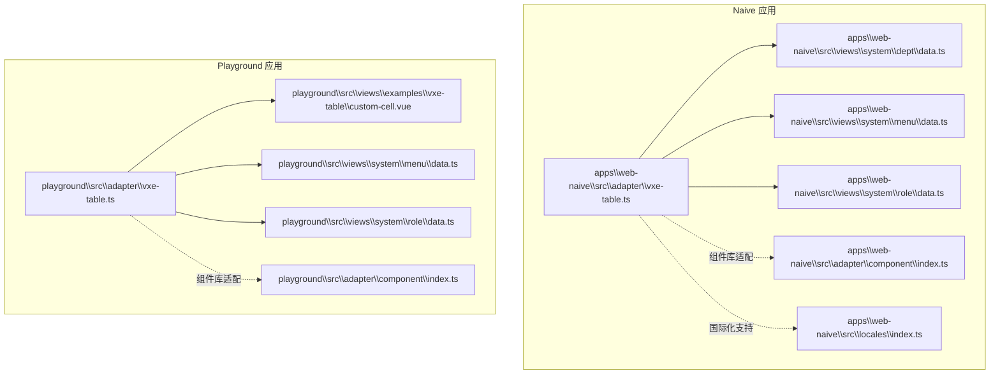
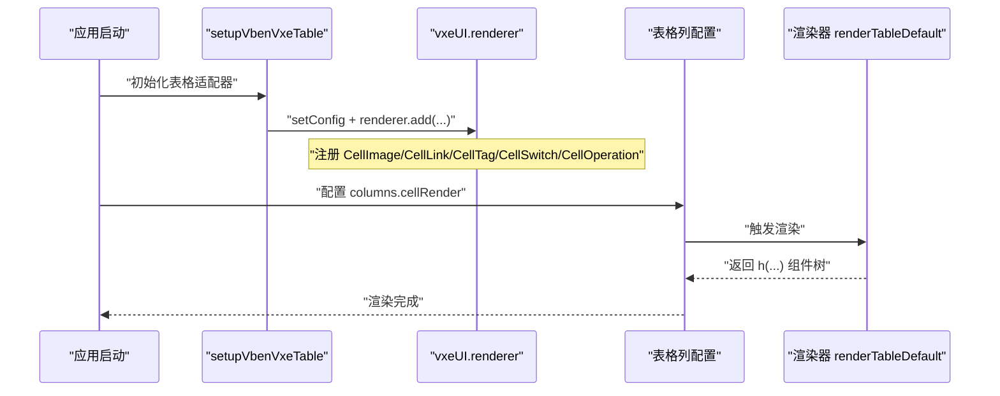
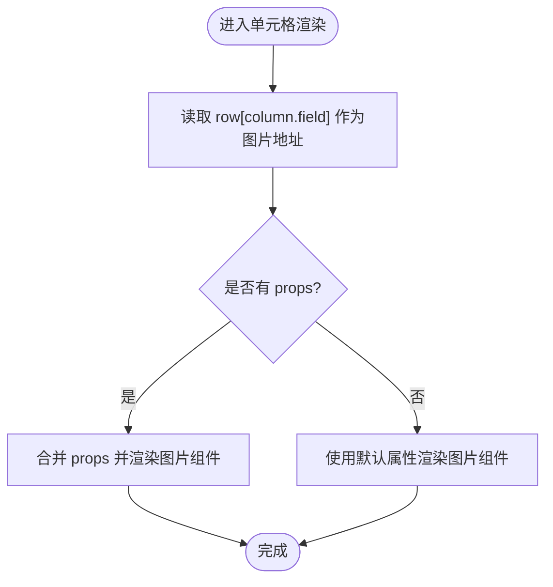
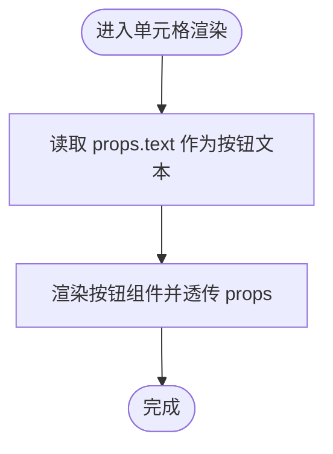
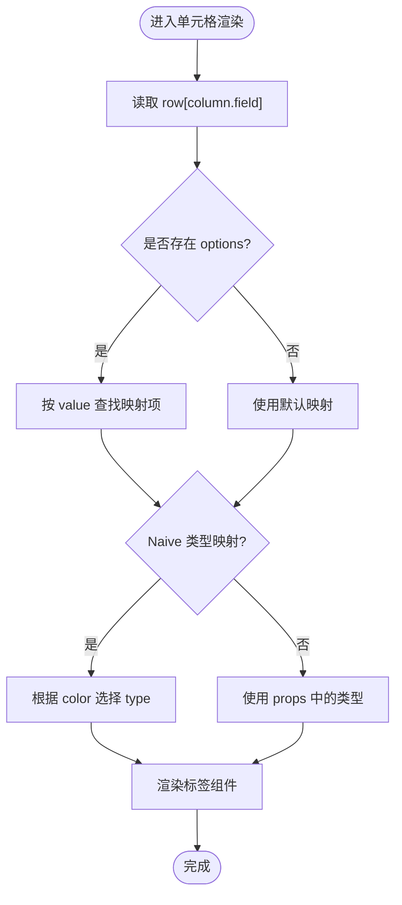
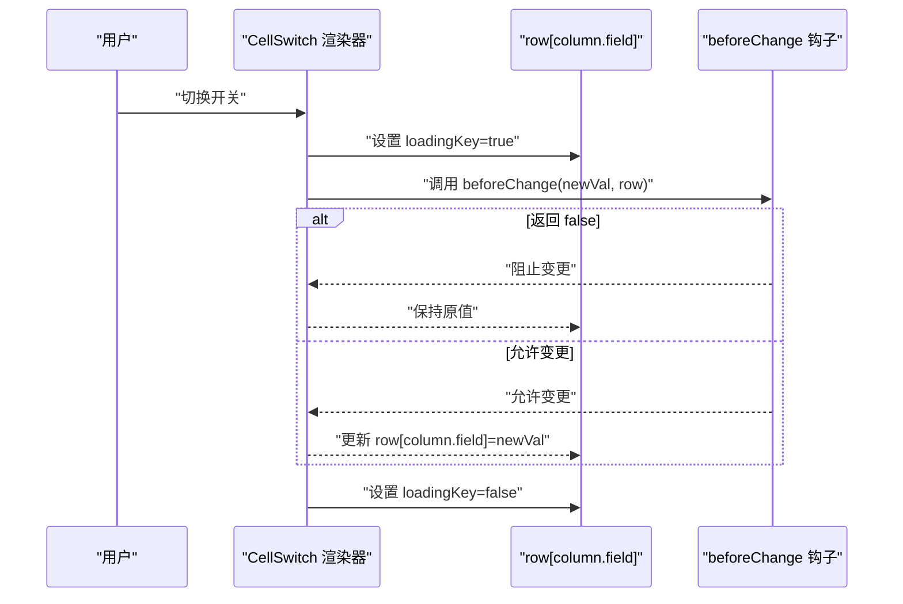
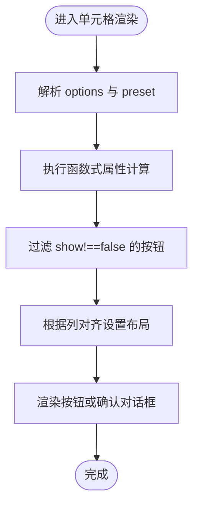
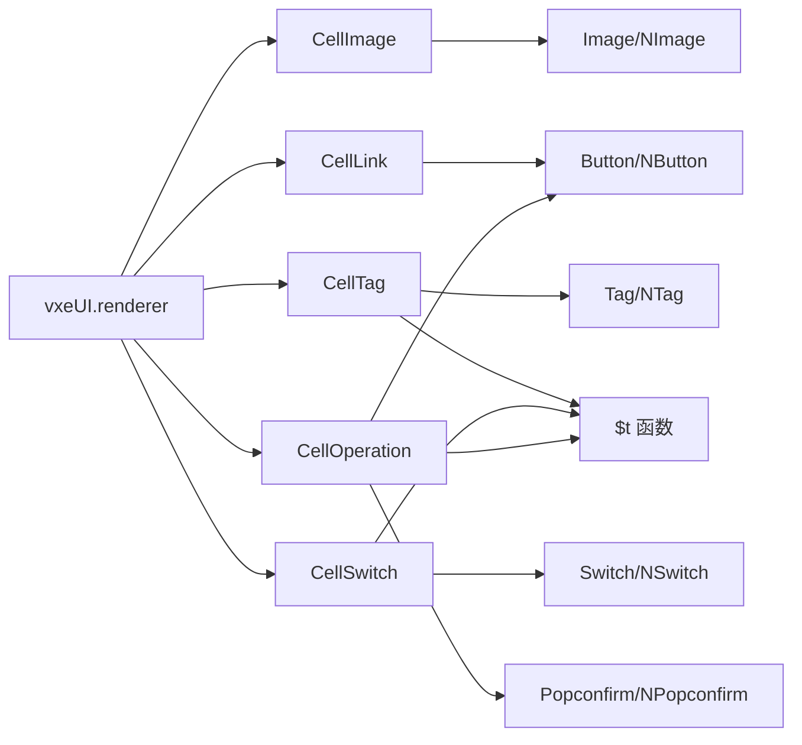

# 单元格渲染器

<cite>
**本文引用的文件**
- [apps\web-naive\src\adapter\vxe-table.ts](file://apps\web-naive\src\adapter\vxe-table.ts)
- [playground\src\adapter\vxe-table.ts](file://playground\src\adapter\vxe-table.ts)
- [playground\src\views\examples\vxe-table\custom-cell.vue](file://playground\src\views\examples\vxe-table\custom-cell.vue)
- [apps\web-naive\src\views\system\dept\data.ts](file://apps\web-naive\src\views\system\dept\data.ts)
- [playground\src\views\system\menu\data.ts](file://playground\src\views\system\menu\data.ts)
- [playground\src\views\system\role\data.ts](file://playground\src\views\system\role\data.ts)
- [apps\web-naive\src\adapter\component\index.ts](file://apps\web-naive\src\adapter\component\index.ts)
- [playground\src\adapter\component\index.ts](file://playground\src\adapter\component\index.ts)
- [apps\web-naive\src\locales\index.ts](file://apps\web-naive\src\locales\index.ts)
</cite>

## 更新摘要

**变更内容**

- 新增 CellTag、CellSwitch、CellOperation 三种内置渲染器的详细说明
- 增强国际化支持说明，展示如何使用 $t 函数进行多语言翻译
- 完善不同组件库（Naive UI vs Ant Design Vue）的实现差异对比
- 更新渲染器注册流程和使用示例

## 目录

1. [简介](#简介)
2. [项目结构](#项目结构)
3. [核心组件](#核心组件)
4. [架构总览](#架构总览)
5. [详细组件分析](#详细组件分析)
6. [国际化支持](#国际化支持)
7. [依赖关系分析](#依赖关系分析)
8. [性能考量](#性能考量)
9. [故障排查指南](#故障排查指南)
10. [结论](#结论)
11. [附录](#附录)

## 简介

本文件面向 shiyu-ui 项目中的 vxe-table 单元格渲染器，系统性梳理内置渲染器（图片渲染 CellImage、链接渲染 CellLink、标签渲染 CellTag、开关渲染 CellSwitch、操作按钮渲染 CellOperation）的实现原理、属性配置、事件处理与数据绑定机制，并给出自定义渲染器的开发与注册流程、性能优化与缓存策略建议，以及扩展开发的最佳实践与完整示例路径。

**更新** 新增了三种核心渲染器的详细实现分析，增强了国际化支持的说明。

## 项目结构

- 渲染器注册集中在各应用的 vxe-table 适配器中，分别针对 Naive UI 与 Ant Design Vue 两套组件库提供统一的渲染器注册入口。
- 渲染器在表格列配置中通过 cellRender: { name, props, attrs, options } 的方式启用，支持默认渲染与带交互的渲染（如开关、操作按钮）。
- 示例页面展示了渲染器的基本用法，系统模块的数据配置文件展示了在真实业务场景中的组合使用。

**图表来源**

- [apps\web-naive\src\adapter\vxe-table.ts:21-131](file://apps\web-naive\src\adapter\vxe-table.ts#L21-L131)
- [playground\src\adapter\vxe-table.ts:21-128](file://playground\src\adapter\vxe-table.ts#L21-L128)
- [apps\web-naive\src\views\system\dept\data.ts:75-132](file://apps\web-naive\src\views\system\dept\data.ts#L75-L132)
- [playground\src\views\system\menu\data.ts:24-108](file://playground\src\views\system\menu\data.ts#L24-L108)
- [playground\src\views\system\role\data.ts:77-127](file://playground\src\views\system\role\data.ts#L77-L127)
- [apps\web-naive\src\adapter\component\index.ts:163-274](file://apps\web-naive\src\adapter\component\index.ts#L163-L274)
- [playground\src\adapter\component\index.ts:671-753](file://playground\src\adapter\component\index.ts#L671-L753)

**章节来源**

- [apps\web-naive\src\adapter\vxe-table.ts:21-131](file://apps\web-naive\src\adapter\vxe-table.ts#L21-L131)
- [playground\src\adapter\vxe-table.ts:21-128](file://playground\src\adapter\vxe-table.ts#L21-L128)

## 核心组件

- **CellImage**：基于组件库 Image/NImage 组件渲染单元格中的图片资源，支持透传 props。
- **CellLink**：基于组件库 Button/NButton 组件渲染单元格中的链接按钮，支持透传 props。
- **CellTag**：基于组件库 Tag/NTag 组件渲染单元格中的标签，支持 options 映射与颜色类型映射，内置国际化支持。
- **CellSwitch**：基于组件库 Switch/NSwitch 组件渲染单元格中的开关，支持 beforeChange 钩子与 loading 状态，内置国际化支持。
- **CellOperation**：渲染单元格中的操作按钮组，支持 preset 按钮、自定义按钮、确认对话框、对齐方式等，内置国际化支持。

**更新** 新增了三种核心渲染器的详细说明，包括国际化支持和组件库差异。

**章节来源**

- [apps\web-naive\src\adapter\vxe-table.ts:60-131](file://apps\web-naive\src\adapter\vxe-table.ts#L60-L131)
- [playground\src\adapter\vxe-table.ts:61-128](file://playground\src\adapter\vxe-table.ts#L61-L128)

## 架构总览

渲染器注册与使用遵循以下流程：

- 初始化阶段：调用 setupVbenVxeTable，在 configVxeTable 回调中通过 vxeUI.renderer.add 注册 Cell\* 渲染器。
- 列配置阶段：在 columns 中通过 cellRender: { name, props, attrs, options } 指定渲染器及参数。
- 渲染阶段：vxe-table 在渲染单元格时调用对应渲染器的 renderTableDefault，传入 renderOpts 与 params，返回 h(...) 组件树。

**图表来源**

- [apps\web-naive\src\adapter\vxe-table.ts:21-131](file://apps\web-naive\src\adapter\vxe-table.ts#L21-L131)
- [playground\src\adapter\vxe-table.ts:21-128](file://playground\src\adapter\vxe-table.ts#L21-L128)

## 详细组件分析

### CellImage（图片渲染）

- **实现要点**
  - 使用组件库 Image（Ant Design Vue）或 NImage（Naive UI）组件。
  - 从行数据 row[column.field] 读取图片地址，结合 props 透传给组件。
- **属性配置**
  - props：透传给底层图片组件，如尺寸、占位符、错误处理等。
- **数据绑定**
  - 通过 row[column.field] 动态绑定图片地址。
- **使用示例**
  - 在列配置中设置 cellRender: { name: 'CellImage' }，并在模板中提供默认插槽作为回退方案。

**图表来源**

- [apps\web-naive\src\adapter\vxe-table.ts:60-67](file://apps\web-naive\src\adapter\vxe-table.ts#L60-L67)
- [playground\src\adapter\vxe-table.ts:61-68](file://playground\src\adapter\vxe-table.ts#L61-L68)

**章节来源**

- [apps\web-naive\src\adapter\vxe-table.ts:60-67](file://apps\web-naive\src\adapter\vxe-table.ts#L60-L67)
- [playground\src\adapter\vxe-table.ts:61-68](file://playground\src\adapter\vxe-table.ts#L61-L68)
- [playground\src\views\examples\vxe-table\custom-cell.vue:37-42](file://playground\src\views\examples\vxe-table\custom-cell.vue#L37-L42)

### CellLink（链接渲染）

- **实现要点**
  - 使用组件库 Button（Ant Design Vue）或 NButton（Naive UI）组件。
  - 通过 props.text 渲染按钮文本；支持 small/quaternary/primary 等样式属性。
- **属性配置**
  - props：透传给按钮组件，如 size、type、quaternary 等。
- **事件处理**
  - 该渲染器本身不绑定点击事件，通常由外部列配置或业务逻辑处理点击行为。
- **使用示例**
  - 在列配置中设置 cellRender: { name: 'CellLink', props: { text: '编辑' } }。

**图表来源**

- [apps\web-naive\src\adapter\vxe-table.ts:69-79](file://apps\web-naive\src\adapter\vxe-table.ts#L69-L79)
- [playground\src\adapter\vxe-table.ts:69-80](file://playground\src\adapter\vxe-table.ts#L69-L80)

**章节来源**

- [apps\web-naive\src\adapter\vxe-table.ts:69-79](file://apps\web-naive\src\adapter\vxe-table.ts#L69-L79)
- [playground\src\adapter\vxe-table.ts:69-80](file://playground\src\adapter\vxe-table.ts#L69-L80)
- [playground\src\views\examples\vxe-table\custom-cell.vue:64-70](file://playground\src\views\examples\vxe-table\custom-cell.vue#L64-L70)

### CellTag（标签渲染）

- **实现要点**
  - 使用组件库 Tag（Ant Design Vue）或 NTag（Naive UI）组件。
  - 支持 options 映射，将 row[column.field] 的值映射为标签显示文本与颜色类型。
  - Naive 版本提供颜色类型映射，自动选择 type。
  - 内置国际化支持，使用 $t 函数进行多语言翻译。
- **属性配置**
  - options：可选，映射数组，包含 { value, label, color }。
  - props：透传给标签组件，如 size、type 等。
- **数据绑定**
  - 通过 get(row, column.field) 读取值，匹配 options 后渲染标签文本与样式。
- **国际化支持**
  - 默认选项包含国际化键值：common.enabled 和 common.disabled。
  - 支持自定义选项映射，如菜单类型映射。
- **使用示例**
  - 在列配置中设置 cellRender: { name: 'CellTag', options: [...] }。
  - 系统菜单模块中使用了自定义 options 来映射菜单类型。

**图表来源**

- [apps\web-naive\src\adapter\vxe-table.ts:81-104](file://apps\web-naive\src\adapter\vxe-table.ts#L81-L104)
- [playground\src\adapter\vxe-table.ts:82-100](file://playground\src\adapter\vxe-table.ts#L82-L100)
- [playground\src\views\system\menu\data.ts:6-22](file://playground\src\views\system\menu\data.ts#L6-L22)

**章节来源**

- [apps\web-naive\src\adapter\vxe-table.ts:81-104](file://apps\web-naive\src\adapter\vxe-table.ts#L81-L104)
- [playground\src\adapter\vxe-table.ts:82-100](file://playground\src\adapter\vxe-table.ts#L82-L100)
- [apps\web-naive\src\views\system\dept\data.ts:87-92](file://apps\web-naive\src\views\system\dept\data.ts#L87-L92)
- [playground\src\views\system\menu\data.ts:37-43](file://playground\src\views\system\menu\data.ts#L37-L43)

### CellSwitch（开关渲染）

- **实现要点**
  - 使用组件库 Switch（Ant Design Vue）或 NSwitch（Naive UI）组件。
  - 支持 beforeChange 异步钩子，通过 row[loadingKey] 控制 loading 状态。
  - 通过 onUpdate:value 或 onUpdate:checked 事件更新 row[column.field]。
  - 内置国际化支持，使用 $t 函数进行多语言翻译。
- **属性配置**
  - attrs.beforeChange：异步变更钩子，返回 false 可阻止变更。
  - props：透传给开关组件，如 checkedValue/uncheckedValue、size 等。
- **数据绑定**
  - value/checked 绑定 row[column.field]；loading 绑定 row['__loading_{field}']。
- **国际化支持**
  - Ant Design Vue 版本：checkedChildren 和 unCheckedChildren 使用国际化键值。
  - Naive UI 版本：使用 onUpdate:value 事件。
- **使用示例**
  - 在列配置中设置 cellRender: { name: 'CellSwitch', attrs: { beforeChange } }。
  - 角色模块根据 onStatusChange 是否存在动态选择 CellSwitch 或 CellTag。

**图表来源**

- [apps\web-naive\src\adapter\vxe-table.ts:106-131](file://apps\web-naive\src\adapter\vxe-table.ts#L106-L131)
- [playground\src\adapter\vxe-table.ts:102-128](file://playground\src\adapter\vxe-table.ts#L102-L128)
- [playground\src\views\system\role\data.ts:93-96](file://playground\src\views\system\role\data.ts#L93-L96)

**章节来源**

- [apps\web-naive\src\adapter\vxe-table.ts:106-131](file://apps\web-naive\src\adapter\vxe-table.ts#L106-L131)
- [playground\src\adapter\vxe-table.ts:102-128](file://playground\src\adapter\vxe-table.ts#L102-L128)
- [playground\src\views\system\role\data.ts:93-96](file://playground\src\views\system\role\data.ts#L93-L96)

### CellOperation（操作按钮组）

- **实现要点**
  - 渲染单元格中的操作按钮组，支持 preset 按钮（编辑、删除）、自定义按钮、图标、对齐方式。
  - 删除按钮使用确认对话框，支持自定义弹窗容器与滚动控制。
  - 内置国际化支持，使用 $t 函数进行多语言翻译。
- **属性配置**
  - options：按钮列表，支持字符串或对象；字符串表示 preset 名称。
  - attrs.onClick：点击回调，接收 { code, row }。
  - attrs.nameField/nameTitle：用于确认对话框中的名称字段与标题文案。
  - props：透传给按钮组件，如 size、type、text 等。
- **预设按钮**
  - edit：编辑按钮，使用国际化键值 common.edit。
  - delete：删除按钮，使用国际化键值 common.delete。
- **国际化支持**
  - 所有按钮文本都通过 $t 函数进行国际化翻译。
  - 支持动态语言切换，按钮文本会自动更新。
- **使用示例**
  - 在列配置中设置 cellRender: { name: 'CellOperation', options, attrs }。
  - 系统部门模块展示了操作列的典型用法。

**图表来源**

- [apps\web-naive\src\adapter\vxe-table.ts:133-251](file://apps\web-naive\src\adapter\vxe-table.ts#L133-L251)
- [playground\src\adapter\vxe-table.ts:130-277](file://playground\src\adapter\vxe-table.ts#L130-L277)
- [apps\web-naive\src\views\system\dept\data.ts:103-131](file://apps\web-naive\src\views\system\dept\data.ts#L103-L131)

**章节来源**

- [apps\web-naive\src\adapter\vxe-table.ts:133-251](file://apps\web-naive\src\adapter\vxe-table.ts#L133-L251)
- [playground\src\adapter\vxe-table.ts:130-277](file://playground\src\adapter\vxe-table.ts#L130-L277)
- [apps\web-naive\src\views\system\dept\data.ts:103-131](file://apps\web-naive\src\views\system\dept\data.ts#L103-L131)

## 国际化支持

shiyu-ui 的单元格渲染器全面支持国际化，通过统一的 $t 函数实现多语言翻译：

### 国际化实现机制

- **$t 函数**：所有渲染器都使用 $t 函数进行文本翻译，支持动态语言切换。
- **默认翻译键值**：
  - common.enabled：启用
  - common.disabled：禁用
  - common.edit：编辑
  - common.delete：删除
  - common.confirm：确认
  - common.cancel：取消
- **动态语言切换**：当语言环境改变时，渲染器中的文本会自动更新。

### 不同组件库的国际化差异

- **Naive UI 版本**：
  - 使用 NTag、NSwitch、NButton 等组件
  - 标签渲染器支持颜色类型映射
  - 操作按钮组使用 NPopconfirm 进行确认对话框

- **Ant Design Vue 版本**：
  - 使用 Tag、Switch、Button 等组件
  - 标签渲染器直接使用 Tag 组件属性
  - 操作按钮组使用 Popconfirm 进行确认对话框

### 国际化配置

- **语言包加载**：通过 locales/index.ts 中的 loadMessages 函数加载应用特定的语言包。
- **动态加载**：支持从本地 JSON 文件或远程 API 动态加载语言包。
- **缺失键值处理**：当翻译键值不存在时，会回退到键值本身。

**章节来源**

- [apps\web-naive\src\adapter\vxe-table.ts:85-88](file://apps\web-naive\src\adapter\vxe-table.ts#L85-L88)
- [playground\src\adapter\vxe-table.ts:106-109](file://playground\src\adapter\vxe-table.ts#L106-L109)
- [apps\web-naive\src\locales\index.ts:24-27](file://apps\web-naive\src\locales\index.ts#L24-L27)

## 依赖关系分析

- 渲染器依赖 vxe-table 的 renderer 接口与 h 函数进行组件树渲染。
- 不同组件库（Naive UI vs Ant Design Vue）通过各自的组件导入与属性命名差异实现兼容。
- 组件库适配器负责注册基础组件与全局共享状态，保证渲染器与表单、弹窗等组件生态协同工作。
- 国际化系统通过 $t 函数提供统一的翻译接口。

**图表来源**

- [apps\web-naive\src\adapter\vxe-table.ts:60-131](file://apps\web-naive\src\adapter\vxe-table.ts#L60-L131)
- [playground\src\adapter\vxe-table.ts:61-128](file://playground\src\adapter\vxe-table.ts#L61-L128)
- [apps\web-naive\src\adapter\component\index.ts:163-274](file://apps\web-naive\src\adapter\component\index.ts#L163-L274)
- [playground\src\adapter\component\index.ts:671-753](file://playground\src\adapter\component\index.ts#L671-L753)

**章节来源**

- [apps\web-naive\src\adapter\vxe-table.ts:60-131](file://apps\web-naive\src\adapter\vxe-table.ts#L60-L131)
- [playground\src\adapter\vxe-table.ts:61-128](file://playground\src\adapter\vxe-table.ts#L61-L128)
- [apps\web-naive\src\adapter\component\index.ts:163-274](file://apps\web-naive\src\adapter\component\index.ts#L163-L274)
- [playground\src\adapter\component\index.ts:671-753](file://playground\src\adapter\component\index.ts#L671-L753)

## 性能考量

- 渲染器内部未见显式的缓存策略，但可通过以下方式提升性能：
  - 列配置中尽量减少不必要的 props 计算，避免在 renderTableDefault 中做重型逻辑。
  - 对于频繁切换的开关渲染器，合理使用 attrs.beforeChange 的异步校验，避免阻塞 UI。
  - 操作按钮组在 options 中使用函数式属性时，注意只在必要时计算，避免重复渲染。
  - 图片渲染器建议传入合适的尺寸与懒加载策略，减少首屏压力。
  - 在大数据量场景下，优先考虑虚拟滚动与分页，降低单次渲染节点数量。
  - 国际化文本应避免在渲染器中进行复杂的字符串处理，使用 $t 函数进行简单键值翻译。

**更新** 新增了国际化性能考量建议。

## 故障排查指南

- **热更新导致的渲染器冲突**
  - 在初始化阶段清理已存在的 Cell\* 渲染器，避免重复注册引发异常。
- **开关渲染器无法更新**
  - 检查 attrs.beforeChange 是否返回 false 导致变更被阻止；确认 row[column.field] 的字段名与列配置一致。
- **标签渲染器颜色不生效**
  - 确认 options 中的 color 与组件库类型映射一致；Naive 版本需确保 color 在映射范围内。
- **操作按钮组对齐与弹窗遮挡**
  - Ant Design Vue 版本通过 getPopupContainer 将弹窗挂载到 body，并在弹窗打开时临时禁用表格滚动，避免遮挡与滚动错位。
- **国际化文本不显示**
  - 检查 $t 函数是否正确导入；确认语言包中是否存在对应的翻译键值。
  - 验证语言切换功能是否正常工作。

**更新** 新增了国际化相关的故障排查指南。

**章节来源**

- [apps\web-naive\src\adapter\vxe-table.ts:51-58](file://apps\web-naive\src\adapter\vxe-table.ts#L51-L58)
- [playground\src\adapter\vxe-table.ts:52-59](file://playground\src\adapter\vxe-table.ts#L52-L59)
- [playground\src\adapter\vxe-table.ts:215-243](file://playground\src\adapter\vxe-table.ts#L215-L243)

## 结论

shiyu-ui 的单元格渲染器体系以 vxe-table renderer 为核心，围绕图片、链接、标签、开关与操作按钮五类常见场景提供了开箱即用的实现。通过统一的注册接口与灵活的 props/attrs/options 配置，渲染器既能满足常规展示需求，也能承载复杂的交互与业务逻辑。结合组件库适配器与全局共享状态，渲染器与表单、弹窗等模块形成良好的生态协同。

**更新** 新增的 CellTag、CellSwitch、CellOperation 渲染器进一步完善了渲染器体系，增强了国际化支持，使得渲染器能够更好地适应多语言应用场景。

## 附录

### 自定义渲染器开发与注册流程

- **步骤**
  - 在 configVxeTable 的回调中，使用 vxeUI.renderer.add('MyRenderer', { renderTableDefault }) 注册新渲染器。
  - 在列配置中通过 cellRender: { name: 'MyRenderer', props, attrs, options } 启用。
  - 在 renderTableDefault 中使用 h(...) 返回自定义组件树。
- **最佳实践**
  - 保持 renderTableDefault 的纯函数特性，避免副作用。
  - 合理拆分 props/attrs/options，使渲染器具备高可复用性。
  - 对外暴露必要的事件回调（如点击、变更），并与业务层解耦。
  - 考虑国际化支持，使用 $t 函数进行文本翻译。

**更新** 新增了国际化支持的最佳实践建议。

**章节来源**

- [apps\web-naive\src\adapter\vxe-table.ts:21-50](file://apps\web-naive\src\adapter\vxe-table.ts#L21-L50)
- [playground\src\adapter\vxe-table.ts:21-50](file://playground\src\adapter\vxe-table.ts#L21-L50)

### 完整示例与参考路径

- **基础用法示例**
  - [playground\src\views\examples\vxe-table\custom-cell.vue:23-88](file://playground\src\views\examples\vxe-table\custom-cell.vue#L23-L88)
- **系统模块中的实际应用**
  - [apps\web-naive\src\views\system\dept\data.ts:75-132](file://apps\web-naive\src\views\system\dept\data.ts#L75-L132)
  - [playground\src\views\system\menu\data.ts:24-108](file://playground\src\views\system\menu\data.ts#L24-L108)
  - [playground\src\views\system\role\data.ts:77-127](file://playground\src\views\system\role\data.ts#L77-L127)
- **国际化配置示例**
  - [apps\web-naive\src\locales\index.ts:24-27](file://apps\web-naive\src\locales\index.ts#L24-L27)

**更新** 新增了国际化配置示例的参考路径。
