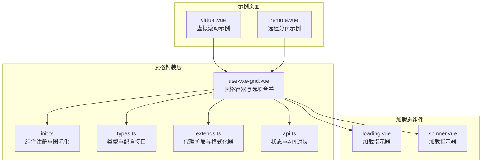
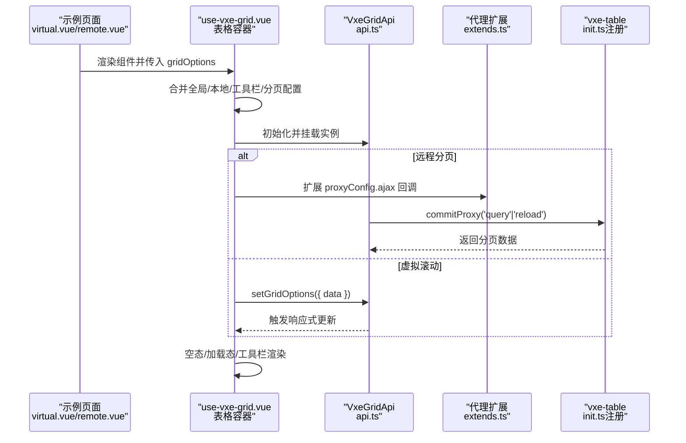
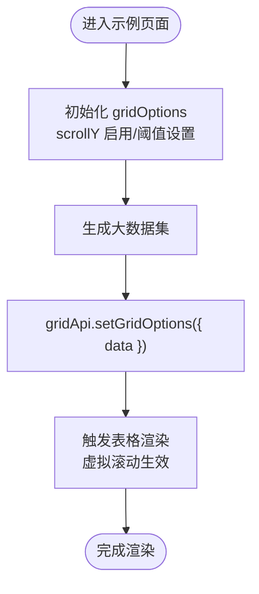
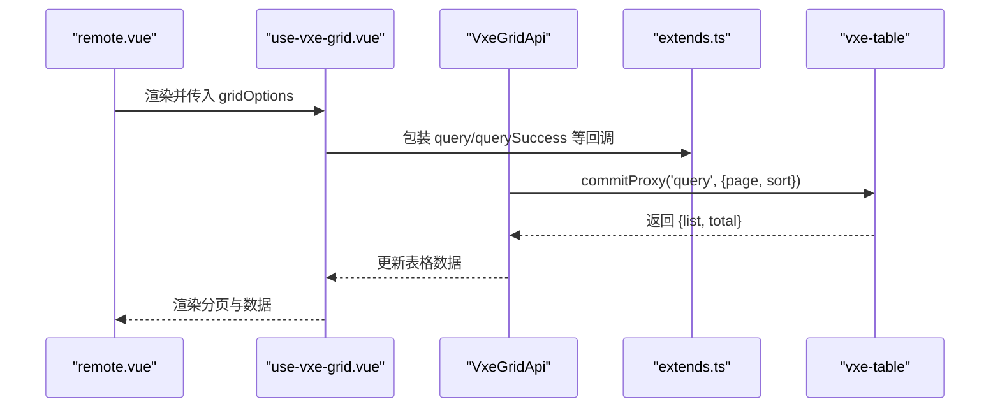
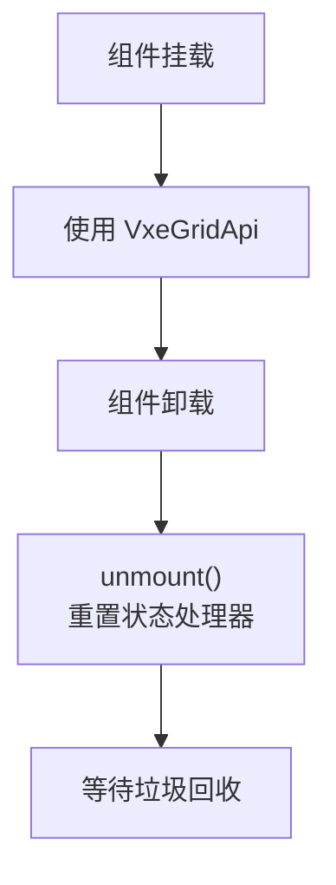
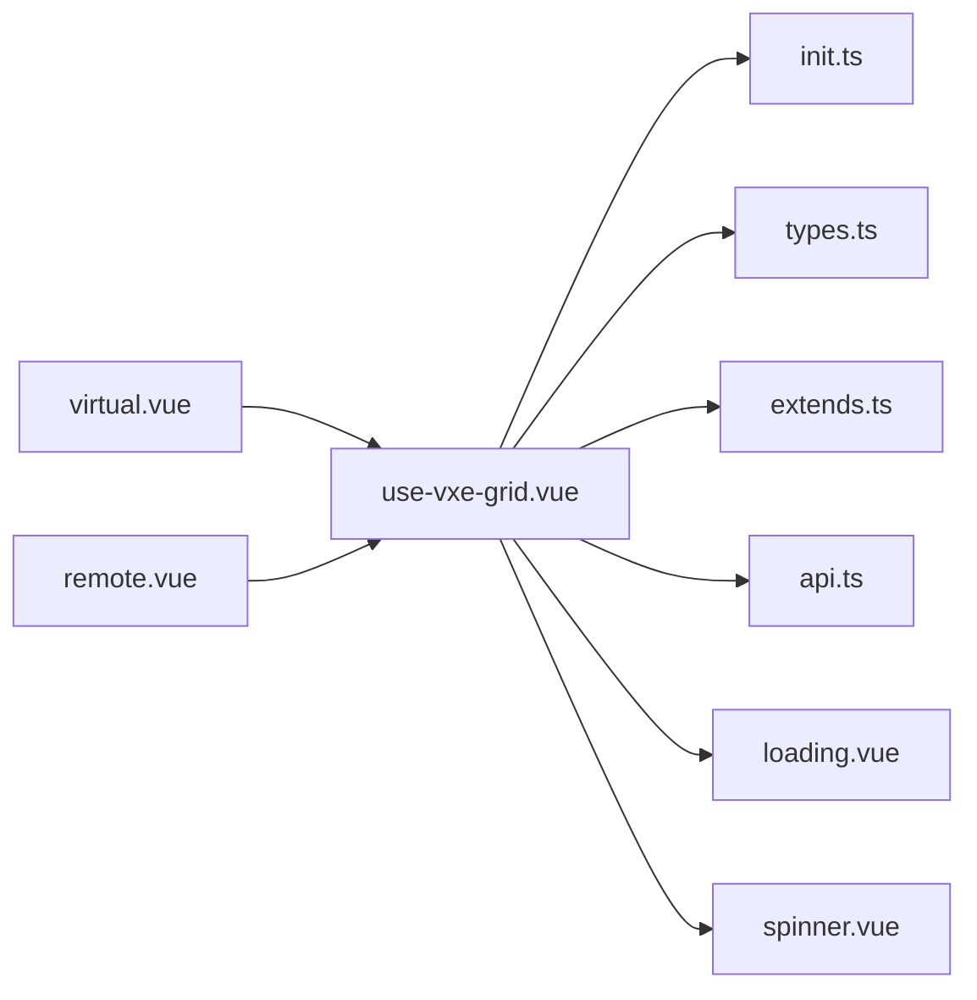

# 性能优化

<cite>
**本文引用的文件**
- [use-vxe-grid.vue](file://packages/effects/plugins/src/vxe-table/use-vxe-grid.vue)
- [init.ts](file://packages/effects/plugins/src/vxe-table/init.ts)
- [types.ts](file://packages/effects/plugins/src/vxe-table/types.ts)
- [extends.ts](file://packages/effects/plugins/src/vxe-table/extends.ts)
- [api.ts](file://packages/effects/plugins/src/vxe-table/api.ts)
- [virtual.vue](file://playground/src/views/examples/vxe-table/virtual.vue)
- [remote.vue](file://playground/src/views/examples/vxe-table/remote.vue)
- [loading.vue](file://packages/@core/ui-kit/shadcn-ui/src/components/spinner/loading.vue)
- [spinner.vue](file://packages/@core/ui-kit/shadcn-ui/src/components/spinner/spinner.vue)
</cite>

## 目录

1. [简介](#简介)
2. [项目结构](#项目结构)
3. [核心组件](#核心组件)
4. [架构总览](#架构总览)
5. [详细组件分析](#详细组件分析)
6. [依赖关系分析](#依赖关系分析)
7. [性能考量](#性能考量)
8. [故障排查指南](#故障排查指南)
9. [结论](#结论)
10. [附录](#附录)

## 简介

本文件聚焦于 shiyu-ui 项目中的表格性能优化，围绕以下主题展开：虚拟滚动与大数据量处理、懒加载与分页优化、渲染性能监控与瓶颈分析、内存管理与资源释放、防抖与异步更新机制，以及可落地的缓存与渲染优化实践。文档以仓库中基于 vxe-table 的封装组件为核心，结合示例页面（远程分页与虚拟滚动）进行深入剖析，并提供可视化图示与实操建议。

## 项目结构

与表格性能优化直接相关的代码主要分布在以下位置：

- 表格封装与适配层：packages/effects/plugins/src/vxe-table/
- 示例页面：playground/src/views/examples/vxe-table/
- 加载态组件：packages/@core/ui-kit/shadcn-ui/src/components/spinner/

**图表来源**

- [use-vxe-grid.vue:1-485](file://packages/effects/plugins/src/vxe-table/use-vxe-grid.vue#L1-L485)
- [init.ts:1-143](file://packages/effects/plugins/src/vxe-table/init.ts#L1-L143)
- [types.ts:1-102](file://packages/effects/plugins/src/vxe-table/types.ts#L1-L102)
- [extends.ts:1-82](file://packages/effects/plugins/src/vxe-table/extends.ts#L1-L82)
- [api.ts:1-135](file://packages/effects/plugins/src/vxe-table/api.ts#L1-L135)
- [virtual.vue:1-67](file://playground/src/views/examples/vxe-table/virtual.vue#L1-L67)
- [remote.vue:1-82](file://playground/src/views/examples/vxe-table/remote.vue#L1-L82)
- [loading.vue:1-60](file://packages/@core/ui-kit/shadcn-ui/src/components/spinner/loading.vue#L1-L60)
- [spinner.vue:1-60](file://packages/@core/ui-kit/shadcn-ui/src/components/spinner/spinner.vue#L1-L60)

**章节来源**

- [use-vxe-grid.vue:1-485](file://packages/effects/plugins/src/vxe-table/use-vxe-grid.vue#L1-L485)
- [init.ts:1-143](file://packages/effects/plugins/src/vxe-table/init.ts#L1-L143)
- [types.ts:1-102](file://packages/effects/plugins/src/vxe-table/types.ts#L1-L102)
- [extends.ts:1-82](file://packages/effects/plugins/src/vxe-table/extends.ts#L1-L82)
- [api.ts:1-135](file://packages/effects/plugins/src/vxe-table/api.ts#L1-L135)
- [virtual.vue:1-67](file://playground/src/views/examples/vxe-table/virtual.vue#L1-L67)
- [remote.vue:1-82](file://playground/src/views/examples/vxe-table/remote.vue#L1-L82)
- [loading.vue:1-60](file://packages/@core/ui-kit/shadcn-ui/src/components/spinner/loading.vue#L1-L60)
- [spinner.vue:1-60](file://packages/@core/ui-kit/shadcn-ui/src/components/spinner/spinner.vue#L1-L60)

## 核心组件

- use-vxe-grid.vue：负责合并全局/本地/工具栏/分页等配置，注入表单与工具栏插槽，统一事件与空态渲染；对 proxyConfig.autoLoad 进行控制，避免自动加载干扰；对移动端分页布局进行适配。
- init.ts：完成 vxe-table/vxe-pc-ui 组件注册、主题与语言切换监听、默认格式化器扩展、全局配置注入。
- types.ts：定义表格属性、工具栏配置、分隔条配置、网格API扩展类型等。
- extends.ts：扩展 proxyConfig 的查询/刷新回调，将表单最新提交值注入到请求参数中；提供日期/时间格式化器。
- api.ts：封装 VxeGridApi，提供 query/reload/setGridOptions/setLoading/toggleSearchForm/unmount 等方法，内部使用 Store 与 StateHandler 管理状态与生命周期。
- 示例页面：virtual.vue 展示 scrollY 虚拟滚动与大数据量数据设置；remote.vue 展示 proxyConfig 远程分页与排序。

**章节来源**

- [use-vxe-grid.vue:184-238](file://packages/effects/plugins/src/vxe-table/use-vxe-grid.vue#L184-L238)
- [init.ts:71-109](file://packages/effects/plugins/src/vxe-table/init.ts#L71-L109)
- [types.ts:41-86](file://packages/effects/plugins/src/vxe-table/types.ts#L41-L86)
- [extends.ts:9-67](file://packages/effects/plugins/src/vxe-table/extends.ts#L9-L67)
- [api.ts:32-134](file://packages/effects/plugins/src/vxe-table/api.ts#L32-L134)
- [virtual.vue:17-34](file://playground/src/views/examples/vxe-table/virtual.vue#L17-L34)
- [remote.vue:20-61](file://playground/src/views/examples/vxe-table/remote.vue#L20-L61)

## 架构总览

下图展示从页面到表格组件再到 vxe-table 的调用链路与关键配置点，突出“远程分页/虚拟滚动/代理扩展/状态管理”的交互关系。

**图表来源**

- [use-vxe-grid.vue:184-238](file://packages/effects/plugins/src/vxe-table/use-vxe-grid.vue#L184-L238)
- [api.ts:76-90](file://packages/effects/plugins/src/vxe-table/api.ts#L76-L90)
- [extends.ts:9-67](file://packages/effects/plugins/src/vxe-table/extends.ts#L9-L67)
- [init.ts:71-109](file://packages/effects/plugins/src/vxe-table/init.ts#L71-L109)
- [virtual.vue:39-55](file://playground/src/views/examples/vxe-table/virtual.vue#L39-L55)
- [remote.vue:37-53](file://playground/src/views/examples/vxe-table/remote.vue#L37-L53)

## 详细组件分析

### 虚拟滚动与大数据量处理

- 关键配置
  - scrollY.enabled 与 scrollY.gt：启用纵向虚拟滚动，仅在数据量超过阈值时开启，避免小数据集的额外开销。
  - pagerConfig.enabled：关闭内置分页，配合外部分页或虚拟滚动策略。
  - showOverflow：控制溢出内容显示策略，有助于减少重排。
- 数据注入
  - 通过 gridApi.setGridOptions({ data }) 动态设置大数据集，避免一次性渲染导致卡顿。
- 渲染策略
  - 使用 nextTick 与响应式状态合并，确保 DOM 更新在微任务队列末尾执行，降低主线程阻塞。

**图表来源**

- [virtual.vue:17-34](file://playground/src/views/examples/vxe-table/virtual.vue#L17-L34)
- [virtual.vue:39-55](file://playground/src/views/examples/vxe-table/virtual.vue#L39-L55)
- [use-vxe-grid.vue:184-238](file://packages/effects/plugins/src/vxe-table/use-vxe-grid.vue#L184-L238)

**章节来源**

- [virtual.vue:17-34](file://playground/src/views/examples/vxe-table/virtual.vue#L17-L34)
- [virtual.vue:39-55](file://playground/src/views/examples/vxe-table/virtual.vue#L39-L55)
- [use-vxe-grid.vue:184-238](file://packages/effects/plugins/src/vxe-table/use-vxe-grid.vue#L184-L238)

### 懒加载与分页优化

- 远程分页
  - proxyConfig.ajax.query：按页拉取数据，避免一次性传输全部数据。
  - sortConfig.remote：远端排序，减少前端排序成本。
  - pagerConfig.layouts/pageSizes：移动端/桌面端差异化布局与页大小。
- 生命周期与加载控制
  - proxyConfig.autoLoad=false：由组件显式控制加载时机，避免重复请求。
  - gridApi.query()/reload()：分别用于“保持当前页”和“回到首页并刷新”。

**图表来源**

- [remote.vue:20-61](file://playground/src/views/examples/vxe-table/remote.vue#L20-L61)
- [extends.ts:9-67](file://packages/effects/plugins/src/vxe-table/extends.ts#L9-L67)
- [api.ts:76-90](file://packages/effects/plugins/src/vxe-table/api.ts#L76-L90)
- [use-vxe-grid.vue:184-238](file://packages/effects/plugins/src/vxe-table/use-vxe-grid.vue#L184-L238)

**章节来源**

- [remote.vue:20-61](file://playground/src/views/examples/vxe-table/remote.vue#L20-L61)
- [extends.ts:9-67](file://packages/effects/plugins/src/vxe-table/extends.ts#L9-L67)
- [api.ts:76-90](file://packages/effects/plugins/src/vxe-table/api.ts#L76-L90)
- [use-vxe-grid.vue:184-238](file://packages/effects/plugins/src/vxe-table/use-vxe-grid.vue#L184-L238)

### 渲染性能监控与瓶颈分析

- 加载态组件
  - loading.vue/spinner.vue 提供统一的加载指示器，便于在长任务期间反馈性能状态。
- 建议的监控点
  - 使用 performance.mark/performance.measure 对关键渲染阶段打点（如首次绘制、数据注入、分页切换）。
  - 在 proxyConfig.ajax 回调中记录请求耗时与数据大小，识别网络与服务端瓶颈。
  - 结合浏览器开发者工具的 Performance/Rendering 面板观察主线程占用与重排重绘。

**章节来源**

- [loading.vue:1-60](file://packages/@core/ui-kit/shadcn-ui/src/components/spinner/loading.vue#L1-L60)
- [spinner.vue:1-60](file://packages/@core/ui-kit/shadcn-ui/src/components/spinner/spinner.vue#L1-L60)

### 内存管理与资源释放

- 生命周期钩子
  - onUnmounted 中调用 formApi.unmount 与 api.unmount，重置状态处理器，避免悬挂引用。
- 状态清理
  - VxeGridApi.unmount 将 isMounted 置为 false 并 reset 状态处理器，防止后续状态更新引发异常。
- 页面级缓存
  - 可结合路由缓存策略，避免频繁重建表格实例；必要时在离开页面时主动清理大对象引用。

**图表来源**

- [use-vxe-grid.vue:360-363](file://packages/effects/plugins/src/vxe-table/use-vxe-grid.vue#L360-L363)
- [api.ts:130-134](file://packages/effects/plugins/src/vxe-table/api.ts#L130-L134)

**章节来源**

- [use-vxe-grid.vue:360-363](file://packages/effects/plugins/src/vxe-table/use-vxe-grid.vue#L360-L363)
- [api.ts:130-134](file://packages/effects/plugins/src/vxe-table/api.ts#L130-L134)

### 防抖与异步更新机制

- 表单联动与查询
  - use-vxe-grid.vue 中，表单提交与重置均通过 formApi.getValues()/getLatestSubmissionValues() 获取当前值，再调用 api.reload()/api.query()，避免频繁无意义刷新。
- 代理扩展
  - extends.ts 将表单最新值注入到 proxyConfig.ajax 的回调参数中，确保查询参数始终与表单状态一致，减少重复请求。
- 异步更新
  - 通过 nextTick 与响应式状态合并，确保 DOM 更新在微任务队列末尾执行，降低主线程阻塞。

**章节来源**

- [use-vxe-grid.vue:104-131](file://packages/effects/plugins/src/vxe-table/use-vxe-grid.vue#L104-L131)
- [extends.ts:38-67](file://packages/effects/plugins/src/vxe-table/extends.ts#L38-L67)
- [use-vxe-grid.vue:295-328](file://packages/effects/plugins/src/vxe-table/use-vxe-grid.vue#L295-L328)

## 依赖关系分析

- use-vxe-grid.vue 依赖 init.ts 完成组件注册与国际化；依赖 types.ts 的类型定义；依赖 extends.ts 的代理扩展；依赖 api.ts 的状态与 API。
- 示例页面通过 useVbenVxeGrid 与 use-vxe-grid.vue 交互，前者提供 gridOptions，后者负责渲染与配置合并。
- 加载态组件被 use-vxe-grid.vue 作为默认插槽渲染，统一加载体验。

**图表来源**

- [use-vxe-grid.vue:1-485](file://packages/effects/plugins/src/vxe-table/use-vxe-grid.vue#L1-L485)
- [init.ts:1-143](file://packages/effects/plugins/src/vxe-table/init.ts#L1-L143)
- [types.ts:1-102](file://packages/effects/plugins/src/vxe-table/types.ts#L1-L102)
- [extends.ts:1-82](file://packages/effects/plugins/src/vxe-table/extends.ts#L1-L82)
- [api.ts:1-135](file://packages/effects/plugins/src/vxe-table/api.ts#L1-L135)
- [virtual.vue:1-67](file://playground/src/views/examples/vxe-table/virtual.vue#L1-L67)
- [remote.vue:1-82](file://playground/src/views/examples/vxe-table/remote.vue#L1-L82)
- [loading.vue:1-60](file://packages/@core/ui-kit/shadcn-ui/src/components/spinner/loading.vue#L1-L60)
- [spinner.vue:1-60](file://packages/@core/ui-kit/shadcn-ui/src/components/spinner/spinner.vue#L1-L60)

**章节来源**

- [use-vxe-grid.vue:1-485](file://packages/effects/plugins/src/vxe-table/use-vxe-grid.vue#L1-L485)
- [init.ts:1-143](file://packages/effects/plugins/src/vxe-table/init.ts#L1-L143)
- [types.ts:1-102](file://packages/effects/plugins/src/vxe-table/types.ts#L1-L102)
- [extends.ts:1-82](file://packages/effects/plugins/src/vxe-table/extends.ts#L1-L82)
- [api.ts:1-135](file://packages/effects/plugins/src/vxe-table/api.ts#L1-L135)
- [virtual.vue:1-67](file://playground/src/views/examples/vxe-table/virtual.vue#L1-L67)
- [remote.vue:1-82](file://playground/src/views/examples/vxe-table/remote.vue#L1-L82)
- [loading.vue:1-60](file://packages/@core/ui-kit/shadcn-ui/src/components/spinner/loading.vue#L1-L60)
- [spinner.vue:1-60](file://packages/@core/ui-kit/shadcn-ui/src/components/spinner/spinner.vue#L1-L60)

## 性能考量

- 虚拟滚动
  - 仅在数据量超过阈值时启用 scrollY，避免小数据集的额外开销。
  - 控制列宽与单元格复杂度，减少渲染压力。
- 分页与懒加载
  - 远程分页 + 远端排序，避免前端大规模数据处理。
  - 自动加载关闭，统一由组件控制加载时机。
- 渲染与更新
  - 使用 nextTick 与响应式状态合并，降低主线程阻塞。
  - 通过工具栏/分页布局的移动端适配，减少不必要的 DOM 结构。
- 内存与资源
  - 卸载时清理状态与处理器，避免内存泄漏。
  - 页面级缓存与实例复用，减少重建成本。
- 缓存策略
  - 对查询结果按页缓存，结合失效策略；对格式化器结果进行轻量缓存（如日期格式化）。
- 渲染优化技巧
  - 列渲染函数尽量简单，避免在 render 中做重型计算。
  - 使用 key 与稳定的数据结构，提升 diff 效率。
  - 控制加载态显示时机，避免频繁闪烁。

[本节为通用指导，无需列出具体文件来源]

## 故障排查指南

- 表单与查询参数不一致
  - 检查是否正确使用 getLatestSubmissionValues 注入到 proxyConfig.ajax 回调中。
- 查询失败或未触发
  - 确认 proxyConfig.autoLoad=false，手动调用 api.query()/reload()。
- 卸载后仍出现异常
  - 确保 onUnmounted 中调用了 formApi.unmount 与 api.unmount。
- 虚拟滚动无效
  - 检查 scrollY.enabled 与 scrollY.gt 设置，确认数据量超过阈值。

**章节来源**

- [extends.ts:38-67](file://packages/effects/plugins/src/vxe-table/extends.ts#L38-L67)
- [use-vxe-grid.vue:360-363](file://packages/effects/plugins/src/vxe-table/use-vxe-grid.vue#L360-L363)
- [use-vxe-grid.vue:196-201](file://packages/effects/plugins/src/vxe-table/use-vxe-grid.vue#L196-L201)
- [virtual.vue:29-32](file://playground/src/views/examples/vxe-table/virtual.vue#L29-L32)

## 结论

通过在 use-vxe-grid.vue 中对配置进行集中合并与控制、在 api.ts 中提供统一的状态与生命周期管理、在 extends.ts 中扩展代理回调注入表单参数，shiyu-ui 的表格组件实现了对虚拟滚动与远程分页的良好支持。结合加载态组件与合理的缓存/渲染策略，可在大数据量场景下显著提升用户体验与系统稳定性。

[本节为总结性内容，无需列出具体文件来源]

## 附录

- 相关示例页面路径
  - [virtual.vue:1-67](file://playground/src/views/examples/vxe-table/virtual.vue#L1-L67)
  - [remote.vue:1-82](file://playground/src/views/examples/vxe-table/remote.vue#L1-L82)
- 组件与类型定义
  - [use-vxe-grid.vue:1-485](file://packages/effects/plugins/src/vxe-table/use-vxe-grid.vue#L1-L485)
  - [init.ts:1-143](file://packages/effects/plugins/src/vxe-table/init.ts#L1-L143)
  - [types.ts:1-102](file://packages/effects/plugins/src/vxe-table/types.ts#L1-L102)
  - [extends.ts:1-82](file://packages/effects/plugins/src/vxe-table/extends.ts#L1-L82)
  - [api.ts:1-135](file://packages/effects/plugins/src/vxe-table/api.ts#L1-L135)
- 加载态组件
  - [loading.vue:1-60](file://packages/@core/ui-kit/shadcn-ui/src/components/spinner/loading.vue#L1-L60)
  - [spinner.vue:1-60](file://packages/@core/ui-kit/shadcn-ui/src/components/spinner/spinner.vue#L1-L60)

[本节为补充信息，无需列出具体文件来源]
