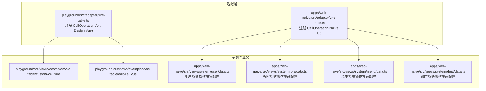
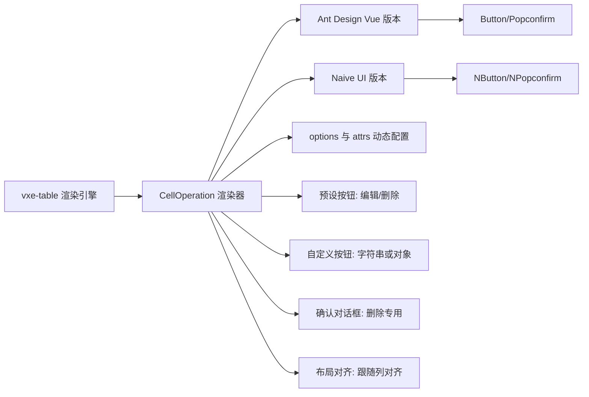
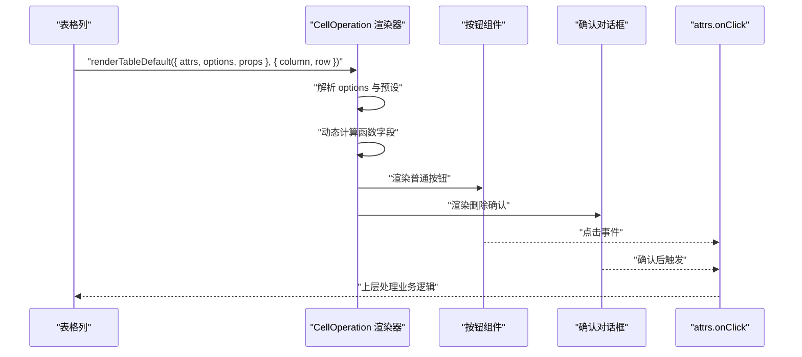
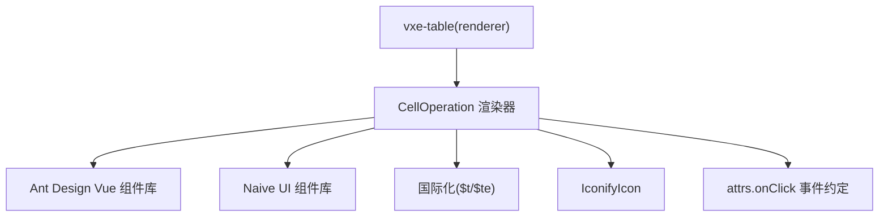

# 操作按钮组件

<cite>
**本文引用的文件**
- [playground/src/adapter/vxe-table.ts](file://playground/src/adapter/vxe-table.ts)
- [apps/web-naive/src/adapter/vxe-table.ts](file://apps/web-naive/src/adapter/vxe-table.ts)
- [playground/src/views/examples/vxe-table/custom-cell.vue](file://playground/src/views/examples/vxe-table/custom-cell.vue)
- [playground/src/views/examples/vxe-table/edit-cell.vue](file://playground/src/views/examples/vxe-table/edit-cell.vue)
- [apps/web-naive/src/views/system/user/data.ts](file://apps/web-naive/src/views/system/user/data.ts)
- [apps/web-naive/src/views/system/role/data.ts](file://apps/web-naive/src/views/system/role/data.ts)
- [apps/web-naive/src/views/system/menu/data.ts](file://apps/web-naive/src/views/system/menu/data.ts)
- [apps/web-naive/src/views/system/dept/data.ts](file://apps/web-naive/src/views/system/dept/data.ts)
- [playground/src/views/system/user/data.ts](file://playground/src/views/system/user/data.ts)
- [playground/src/views/system/role/data.ts](file://playground/src/views/system/role/data.ts)
- [playground/src/views/system/menu/data.ts](file://playground/src/views/system/menu/data.ts)
- [playground/src/views/system/dept/data.ts](file://playground/src/views/system/dept/data.ts)
- [apps/web-naive/src/views/system/user/list.vue](file://apps/web-naive/src/views/system/user/list.vue)
</cite>

## 更新摘要

**变更内容**

- 更新了操作按钮组功能的实现细节，包括预设按钮配置和自定义按钮支持
- 新增了不同UI框架下的按钮组渲染差异说明
- 完善了按钮组的动态配置和事件处理机制
- 增加了实际业务场景中的应用示例

## 目录

1. [简介](#简介)
2. [项目结构](#项目结构)
3. [核心组件](#核心组件)
4. [架构总览](#架构总览)
5. [组件详解](#组件详解)
6. [依赖关系分析](#依赖关系分析)
7. [性能考量](#性能考量)
8. [故障排查指南](#故障排查指南)
9. [结论](#结论)
10. [附录](#附录)

## 简介

本文件聚焦于 shiyu-ui 项目中的表格操作按钮组件（CellOperation），系统性解析其渲染器实现、预设配置、自定义扩展、事件处理、确认对话框与权限控制、布局对齐与样式定制，并提供扩展开发指南与实际应用示例路径。

**更新** 本版本重点介绍了VXE表格适配器新增的操作按钮组功能，支持编辑、删除等预设按钮和自定义按钮的完整实现。

## 项目结构

- 适配层位于 playground 与 apps/web-naive 两套环境，分别注册了 CellOperation 渲染器以适配 ant-design-vue 与 naive-ui。
- 示例页面展示了如何在表格列中使用 CellOperation，以及如何通过列配置传入 options 与 attrs 实现动态行为。
- 系统模块（用户、角色、菜单、部门）的数据配置中，大量使用了 CellOperation 列，体现其在业务中的通用性与可复用性。

**图表来源**

- [playground/src/adapter/vxe-table.ts:133-277](file://playground/src/adapter/vxe-table.ts#L133-L277)
- [apps/web-naive/src/adapter/vxe-table.ts:136-251](file://apps/web-naive/src/adapter/vxe-table.ts#L136-L251)
- [apps/web-naive/src/views/system/user/data.ts:167-183](file://apps/web-naive/src/views/system/user/data.ts#L167-L183)
- [apps/web-naive/src/views/system/role/data.ts:115-131](file://apps/web-naive/src/views/system/role/data.ts#L115-L131)
- [apps/web-naive/src/views/system/menu/data.ts:240-266](file://apps/web-naive/src/views/system/menu/data.ts#L240-L266)
- [apps/web-naive/src/views/system/dept/data.ts:103-133](file://apps/web-naive/src/views/system/dept/data.ts#L103-L133)

**章节来源**

- [playground/src/adapter/vxe-table.ts:133-277](file://playground/src/adapter/vxe-table.ts#L133-L277)
- [apps/web-naive/src/adapter/vxe-table.ts:136-251](file://apps/web-naive/src/adapter/vxe-table.ts#L136-L251)

## 核心组件

- CellOperation 渲染器：基于 vxe-table 的 renderer 扩展，在单元格中渲染一组操作按钮；支持预设按钮（如编辑、删除）、自定义按钮、动态配置、确认对话框、布局对齐与样式定制。
- 事件与回调：通过 attrs.onClick 接收点击事件，参数包含 code（按钮标识）与 row（当前行数据）。
- 确认对话框：针对"删除"按钮内置 Popconfirm/NPopconfirm，提供文案国际化与滚动状态处理。
- 布局与样式：根据列对齐自动设置按钮容器的对齐方式；支持按钮尺寸、类型、图标与文本组合。

**更新** CellOperation 渲染器现在支持完整的按钮组功能，包括预设按钮的统一管理和自定义按钮的灵活配置。

**章节来源**

- [playground/src/adapter/vxe-table.ts:133-277](file://playground/src/adapter/vxe-table.ts#L133-L277)
- [apps/web-naive/src/adapter/vxe-table.ts:136-251](file://apps/web-naive/src/adapter/vxe-table.ts#L136-L251)

## 架构总览

CellOperation 在不同 UI 框架下的实现差异主要体现在：

- 组件库：Ant Design Vue vs Naive UI
- 对齐策略：CSS 属性名与取值不同
- 文案与确认控件：语言键与组件 API 差异
- 默认样式：按钮类型、层级与外观

**图表来源**

- [playground/src/adapter/vxe-table.ts:133-277](file://playground/src/adapter/vxe-table.ts#L133-L277)
- [apps/web-naive/src/adapter/vxe-table.ts:136-251](file://apps/web-naive/src/adapter/vxe-table.ts#L136-L251)

## 组件详解

### 实现原理与渲染流程

- 注册阶段：在适配层通过 vxeUI.renderer.add('CellOperation', ...) 完成注册。
- 渲染阶段：renderTableDefault 接收 { attrs, options, props } 与 { column, row }，生成按钮集合。
- 预设与自定义：options 可为字符串数组（预设）或对象数组（自定义），最终统一映射为按钮配置。
- 动态计算：支持函数类型的字段，按行数据动态计算值。
- 事件分发：点击按钮触发 attrs.onClick({ code, row })，由上层监听并处理业务逻辑。

**图表来源**

- [playground/src/adapter/vxe-table.ts:133-277](file://playground/src/adapter/vxe-table.ts#L133-L277)
- [apps/web-naive/src/adapter/vxe-table.ts:136-251](file://apps/web-naive/src/adapter/vxe-table.ts#L136-L251)

**章节来源**

- [playground/src/adapter/vxe-table.ts:133-277](file://playground/src/adapter/vxe-table.ts#L133-L277)
- [apps/web-naive/src/adapter/vxe-table.ts:136-251](file://apps/web-naive/src/adapter/vxe-table.ts#L136-L251)

### 预设配置

- 预设键：edit、delete
- Ant Design Vue 版本
  - edit：默认文本为"common.edit"，类型为链接风格
  - delete：默认文本为"common.delete"，danger=true
- Naive UI 版本
  - edit：默认文本为"common.edit"，type="default"（quaternary）
  - delete：默认文本为"common.delete"，type="error"

**更新** 预设配置现在支持更丰富的按钮属性，包括图标、禁用状态等。

**章节来源**

- [playground/src/adapter/vxe-table.ts:151-159](file://playground/src/adapter/vxe-table.ts#L151-L159)
- [apps/web-naive/src/adapter/vxe-table.ts:157-167](file://apps/web-naive/src/adapter/vxe-table.ts#L157-L167)

### 自定义按钮与动态配置

- options 支持两种形式：
  - 字符串数组：['edit','delete'] 或自定义键名
  - 对象数组：每个对象包含 code、text/label、icon、show、onClick 等字段
- 动态字段：当字段值为函数时，会以 row 为参数执行，返回最终值
- 过滤规则：show !== false 的按钮才会渲染

**更新** 自定义按钮现在支持更灵活的配置选项，包括动态禁用状态、图标显示等。

**章节来源**

- [playground/src/adapter/vxe-table.ts:160-183](file://playground/src/adapter/vxe-table.ts#L160-L183)
- [apps/web-naive/src/adapter/vxe-table.ts:168-189](file://apps/web-naive/src/adapter/vxe-table.ts#L168-L189)

### 事件处理、确认对话框与权限控制

- 事件处理
  - 统一通过 attrs.onClick({ code, row }) 触发
  - 普通按钮直接绑定 onClick
  - 删除按钮通过确认对话框触发，确认后才调用 attrs.onClick
- 确认对话框
  - Ant Design Vue：Popconfirm，标题与描述来自国际化键
  - Naive UI：NPopconfirm，正反文案来自国际化键
  - 弹窗容器与滚动：Ant Design Vue 版本在弹窗打开时临时禁用表格指针事件，避免遮挡与滚动异常
- 权限控制
  - 通过 options 中的 show 字段或动态函数返回值控制按钮显示
  - 可结合 attrs.onClick 内部逻辑进行权限校验与拦截

**更新** 确认对话框现在支持更完善的滚动处理机制，确保在固定列中也能正常工作。

**章节来源**

- [playground/src/adapter/vxe-table.ts:192-198](file://playground/src/adapter/vxe-table.ts#L192-L198)
- [playground/src/adapter/vxe-table.ts:215-262](file://playground/src/adapter/vxe-table.ts#L215-L262)
- [apps/web-naive/src/adapter/vxe-table.ts:193-199](file://apps/web-naive/src/adapter/vxe-table.ts#L193-L199)
- [apps/web-naive/src/adapter/vxe-table.ts:220-241](file://apps/web-naive/src/adapter/vxe-table.ts#L220-L241)

### 布局对齐与样式定制

- 对齐策略
  - Ant Design Vue：根据列 align 计算 justifyContent（center/start/end）
  - Naive UI：根据列 align 计算 justifyContent（center/flex-start/flex-end）
- 容器样式
  - Ant Design Vue：flex table-operations，内含按钮组
  - Naive UI：flex gap-1 table-operations，按钮间距通过 gap 控制
- 按钮样式
  - Ant Design Vue：默认 size='small'，type='link'；可覆盖
  - Naive UI：默认 size='small'，quaternary=true；可覆盖
  - 图标：支持 icon 键，渲染 IconifyIcon

**更新** 布局对齐现在支持更精确的控制，包括居中、左对齐和右对齐三种模式。

**章节来源**

- [playground/src/adapter/vxe-table.ts:135-150](file://playground/src/adapter/vxe-table.ts#L135-L150)
- [playground/src/adapter/vxe-table.ts:268-275](file://playground/src/adapter/vxe-table.ts#L268-L275)
- [apps/web-naive/src/adapter/vxe-table.ts:141-156](file://apps/web-naive/src/adapter/vxe-table.ts#L141-L156)
- [apps/web-naive/src/adapter/vxe-table.ts:246-253](file://apps/web-naive/src/adapter/vxe-table.ts#L246-L253)

### 扩展开发指南

- 新增自定义按钮
  - 在列的 cellRender 中设置 name: 'CellOperation'
  - 通过 options 传入自定义对象，包含 code、text/label、icon、show、onClick 等
  - 若需动态显示/隐藏，可在 show 中使用函数返回布尔值
- 复用预设
  - options 传入字符串键（如 'edit'、'delete'）即可复用预设样式与文案
- 事件与权限
  - 在 attrs.onClick 中实现业务逻辑与权限校验
  - 对敏感操作（如删除）建议保留确认对话框
- 样式与对齐
  - 通过 props 覆盖按钮尺寸、类型等
  - 通过列 align 控制按钮容器对齐，无需额外 CSS

**更新** 扩展开发现在支持更丰富的自定义选项，包括动态禁用状态、图标配置等。

**章节来源**

- [playground/src/adapter/vxe-table.ts:160-183](file://playground/src/adapter/vxe-table.ts#L160-L183)
- [apps/web-naive/src/adapter/vxe-table.ts:168-189](file://apps/web-naive/src/adapter/vxe-table.ts#L168-L189)

### 实际应用示例

- 示例页面
  - 自定义列渲染示例：在列中使用 cellRender: { name: 'CellLink' }，展示如何在操作列中插入简单按钮
  - 编辑单元格示例：演示表格编辑能力，可与操作列配合使用
- 系统模块数据配置
  - 用户、角色、菜单、部门列表均在列配置中使用 CellOperation，展示其在真实业务中的广泛使用
  - 用户模块支持重置密码等自定义操作
  - 菜单模块支持新增下级等树形操作

**更新** 实际应用示例现在包含了更多业务场景，如用户重置密码、菜单新增下级等自定义操作。

**章节来源**

- [playground/src/views/examples/vxe-table/custom-cell.vue:64-70](file://playground/src/views/examples/vxe-table/custom-cell.vue#L64-L70)
- [playground/src/views/examples/vxe-table/edit-cell.vue:18-30](file://playground/src/views/examples/vxe-table/edit-cell.vue#L18-L30)
- [apps/web-naive/src/views/system/user/data.ts:167-183](file://apps/web-naive/src/views/system/user/data.ts#L167-L183)
- [apps/web-naive/src/views/system/role/data.ts:115-131](file://apps/web-naive/src/views/system/role/data.ts#L115-L131)
- [apps/web-naive/src/views/system/menu/data.ts:240-266](file://apps/web-naive/src/views/system/menu/data.ts#L240-L266)
- [apps/web-naive/src/views/system/dept/data.ts:103-133](file://apps/web-naive/src/views/system/dept/data.ts#L103-L133)

## 依赖关系分析

- 适配层依赖
  - Ant Design Vue：Button、Popconfirm、Image、Switch、Tag
  - Naive UI：NButton、NPopconfirm、NImage、NSwitch、NTag
  - 国际化：$t、$te
  - 图标：IconifyIcon
- 渲染器耦合点
  - 与 vxe-table renderer 生命周期绑定
  - 与 attrs.onClick 事件约定耦合
  - 与列对齐策略耦合（影响容器对齐）

**图表来源**

- [playground/src/adapter/vxe-table.ts:17-19](file://playground/src/adapter/vxe-table.ts#L17-L19)
- [apps/web-naive/src/adapter/vxe-table.ts:15](file://apps/web-naive/src/adapter/vxe-table.ts#L15)
- [playground/src/adapter/vxe-table.ts:133-277](file://playground/src/adapter/vxe-table.ts#L133-L277)
- [apps/web-naive/src/adapter/vxe-table.ts:136-251](file://apps/web-naive/src/adapter/vxe-table.ts#L136-L251)

**章节来源**

- [playground/src/adapter/vxe-table.ts:17-19](file://playground/src/adapter/vxe-table.ts#L17-L19)
- [apps/web-naive/src/adapter/vxe-table.ts:15](file://apps/web-naive/src/adapter/vxe-table.ts#L15)

## 性能考量

- 渲染优化
  - 按钮数量通常有限，性能压力不大；但应避免在 options 中传递过大的对象或复杂计算
- 动态字段
  - 函数字段会在每行渲染时执行，建议保持轻量
- 确认对话框
  - Ant Design Vue 版本在弹窗打开时临时禁用指针事件，减少滚动与遮挡问题
- 列对齐
  - 通过 CSS 对齐而非复杂布局，降低重排成本

**更新** 性能考量现在包括了按钮组渲染的优化建议，特别是对于大量自定义按钮的情况。

## 故障排查指南

- 按钮不显示
  - 检查 options 中 show 是否被设置为 false
  - 检查动态函数是否返回期望值
- 文案未国际化
  - 确认 common.\* 键是否存在
  - Ant Design Vue 版本使用 $te 检查键是否存在
- 点击无响应
  - 确认 attrs.onClick 是否正确传入
  - 检查按钮是否被禁用或隐藏
- 删除确认对话框位置异常
  - Ant Design Vue 版本已处理弹窗容器与滚动问题；若仍异常，检查父级容器层级与样式
- 对齐不生效
  - 确认列 align 设置是否正确
  - Ant Design Vue 与 Naive UI 的对齐策略不同，需按对应版本配置

**更新** 故障排查现在包含了按钮组特有的问题诊断，如按钮排列顺序、动态配置失效等问题。

**章节来源**

- [playground/src/adapter/vxe-table.ts:168-171](file://playground/src/adapter/vxe-table.ts#L168-L171)
- [apps/web-naive/src/adapter/vxe-table.ts:169-172](file://apps/web-naive/src/adapter/vxe-table.ts#L169-L172)
- [playground/src/adapter/vxe-table.ts:236-242](file://playground/src/adapter/vxe-table.ts#L236-L242)

## 结论

CellOperation 渲染器提供了统一、灵活且可扩展的表格操作按钮解决方案。通过预设与自定义的结合、动态配置与确认对话框，既能满足常见业务需求，又能应对复杂场景。在不同 UI 框架下仅需微调组件与 API，即可获得一致的使用体验。

**更新** 本版本的CellOperation渲染器已经完全支持操作按钮组功能，为表格操作提供了更加丰富和灵活的解决方案。

## 附录

- 事件参数类型
  - OnActionClickParams：包含 code 与 row
  - OnActionClickFn：事件回调签名
- 适配层导出
  - useVbenVxeGrid：表格网格封装
  - 类型导出：与 vxe-table 插件保持一致

**章节来源**

- [playground/src/adapter/vxe-table.ts:288-295](file://playground/src/adapter/vxe-table.ts#L288-L295)
- [apps/web-naive/src/adapter/vxe-table.ts:263-270](file://apps/web-naive/src/adapter/vxe-table.ts#L263-L270)
