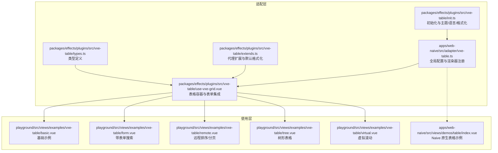
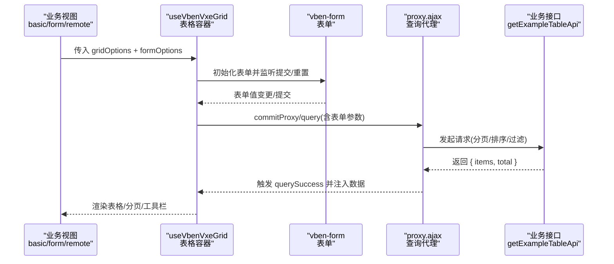
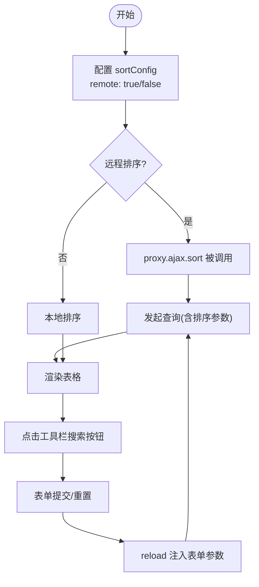
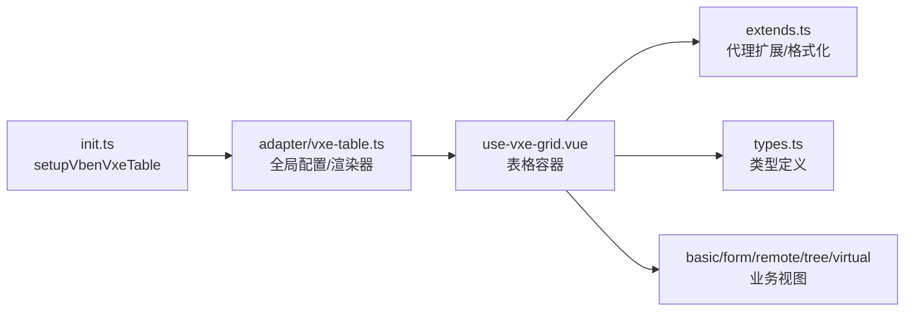

# 表格基础功能

<cite>
**本文引用的文件**
- [apps/web-naive/src/views/demos/table/index.vue](file://apps/web-naive/src/views/demos/table/index.vue)
- [apps/web-naive/src/adapter/vxe-table.ts](file://apps/web-naive/src/adapter/vxe-table.ts)
- [packages/effects/plugins/src/vxe-table/init.ts](file://packages/effects/plugins/src/vxe-table/init.ts)
- [packages/effects/plugins/src/vxe-table/use-vxe-grid.vue](file://packages/effects/plugins/src/vxe-table/use-vxe-grid.vue)
- [packages/effects/plugins/src/vxe-table/types.ts](file://packages/effects/plugins/src/vxe-table/types.ts)
- [packages/effects/plugins/src/vxe-table/extends.ts](file://packages/effects/plugins/src/vxe-table/extends.ts)
- [playground/src/views/examples/vxe-table/basic.vue](file://playground/src/views/examples/vxe-table/basic.vue)
- [playground/src/views/examples/vxe-table/form.vue](file://playground/src/views/examples/vxe-table/form.vue)
- [playground/src/views/examples/vxe-table/remote.vue](file://playground/src/views/examples/vxe-table/remote.vue)
- [playground/src/views/examples/vxe-table/tree.vue](file://playground/src/views/examples/vxe-table/tree.vue)
- [playground/src/views/examples/vxe-table/virtual.vue](file://playground/src/views/examples/vxe-table/virtual.vue)
- [playground/src/views/examples/vxe-table/table-data.ts](file://playground/src/views/examples/vxe-table/table-data.ts)
</cite>

## 目录

1. [简介](#简介)
2. [项目结构](#项目结构)
3. [核心组件](#核心组件)
4. [架构总览](#架构总览)
5. [详细组件分析](#详细组件分析)
6. [依赖关系分析](#依赖关系分析)
7. [性能考量](#性能考量)
8. [故障排查指南](#故障排查指南)
9. [结论](#结论)
10. [附录](#附录)

## 简介

本章节面向 shiyu-ui 项目中的表格基础能力，系统性说明表格的基础配置（列定义、数据绑定、显示设置）、排序/筛选/搜索、分页与远程数据加载、响应式与尺寸适配、最佳实践与常见问题，并提供初始化配置与基本使用示例路径，帮助开发者快速上手并稳定落地。

## 项目结构

表格能力主要由两部分构成：

- 适配层：在不同 UI 框架（Naive、Antdv）下对 vxe-table 的统一适配与封装，负责全局配置、单元格渲染器、工具栏与分页样式等。
- 使用层：业务视图通过 useVbenVxeGrid 组合 formOptions 与 gridOptions，实现“表单 + 表格”的一体化查询与展示。

图表来源

- [apps/web-naive/src/adapter/vxe-table.ts:21-58](file://apps/web-naive/src/adapter/vxe-table.ts#L21-L58)
- [packages/effects/plugins/src/vxe-table/init.ts:71-142](file://packages/effects/plugins/src/vxe-table/init.ts#L71-L142)
- [packages/effects/plugins/src/vxe-table/use-vxe-grid.vue:366-484](file://packages/effects/plugins/src/vxe-table/use-vxe-grid.vue#L366-L484)
- [packages/effects/plugins/src/vxe-table/extends.ts:9-81](file://packages/effects/plugins/src/vxe-table/extends.ts#L9-L81)
- [packages/effects/plugins/src/vxe-table/types.ts:41-96](file://packages/effects/plugins/src/vxe-table/types.ts#L41-L96)
- [playground/src/views/examples/vxe-table/basic.vue:1-112](file://playground/src/views/examples/vxe-table/basic.vue#L1-L112)
- [playground/src/views/examples/vxe-table/form.vue:1-128](file://playground/src/views/examples/vxe-table/form.vue#L1-L128)
- [playground/src/views/examples/vxe-table/remote.vue:1-82](file://playground/src/views/examples/vxe-table/remote.vue#L1-L82)
- [playground/src/views/examples/vxe-table/tree.vue:1-63](file://playground/src/views/examples/vxe-table/tree.vue#L1-L63)
- [playground/src/views/examples/vxe-table/virtual.vue:1-67](file://playground/src/views/examples/vxe-table/virtual.vue#L1-L67)
- [apps/web-naive/src/views/demos/table/index.vue:1-39](file://apps/web-naive/src/views/demos/table/index.vue#L1-L39)

章节来源

- [apps/web-naive/src/adapter/vxe-table.ts:21-58](file://apps/web-naive/src/adapter/vxe-table.ts#L21-L58)
- [packages/effects/plugins/src/vxe-table/init.ts:71-142](file://packages/effects/plugins/src/vxe-table/init.ts#L71-L142)
- [packages/effects/plugins/src/vxe-table/use-vxe-grid.vue:366-484](file://packages/effects/plugins/src/vxe-table/use-vxe-grid.vue#L366-L484)

## 核心组件

- 初始化与全局配置：通过 setupVbenVxeTable 完成组件注册、主题/语言切换、格式化器注入与全局 grid 配置。
- 表格容器：useVbenVxeGrid 提供统一的表格容器，内置表单集成、工具栏、分页、空态、加载态等能力。
- 渲染器：在适配层注册多种单元格渲染器（图片、链接、标签、开关、操作按钮），简化业务列渲染。
- 类型与扩展：types.ts 定义关键类型；extends.ts 扩展代理回调以自动注入表单参数，提供默认日期/时间格式化。

章节来源

- [packages/effects/plugins/src/vxe-table/init.ts:111-142](file://packages/effects/plugins/src/vxe-table/init.ts#L111-L142)
- [packages/effects/plugins/src/vxe-table/use-vxe-grid.vue:52-79](file://packages/effects/plugins/src/vxe-table/use-vxe-grid.vue#L52-L79)
- [apps/web-naive/src/adapter/vxe-table.ts:61-251](file://apps/web-naive/src/adapter/vxe-table.ts#L61-L251)
- [packages/effects/plugins/src/vxe-table/types.ts:41-96](file://packages/effects/plugins/src/vxe-table/types.ts#L41-L96)
- [packages/effects/plugins/src/vxe-table/extends.ts:9-81](file://packages/effects/plugins/src/vxe-table/extends.ts#L9-L81)

## 架构总览

下图展示了从“业务视图”到“表格容器”再到“vxe-table”的调用链路，以及“表单”如何参与查询参数注入。

图表来源

- [playground/src/views/examples/vxe-table/basic.vue:46-58](file://playground/src/views/examples/vxe-table/basic.vue#L46-L58)
- [playground/src/views/examples/vxe-table/form.vue:117-120](file://playground/src/views/examples/vxe-table/form.vue#L117-L120)
- [playground/src/views/examples/vxe-table/remote.vue:63-65](file://playground/src/views/examples/vxe-table/remote.vue#L63-L65)
- [packages/effects/plugins/src/vxe-table/use-vxe-grid.vue:295-328](file://packages/effects/plugins/src/vxe-table/use-vxe-grid.vue#L295-L328)
- [packages/effects/plugins/src/vxe-table/extends.ts:9-67](file://packages/effects/plugins/src/vxe-table/extends.ts#L9-L67)

## 详细组件分析

### 基础配置：列定义、数据绑定与显示设置

- 列定义：支持 field/title/type/width/minWidth/align/showOverflow 等常用属性；type: 'seq' 可生成序号列；treeNode 支持树形节点。
- 数据绑定：支持直接传入 data 或通过 proxyConfig.ajax.query 远程加载；当启用 proxyConfig 时，内部会关闭 autoLoad，由组件控制加载时机。
- 显示设置：全局 grid 配置可统一设置 size、round、border、minHeight、showOverflow 等；分页布局随移动端自适应调整。

章节来源

- [playground/src/views/examples/vxe-table/basic.vue:22-38](file://playground/src/views/examples/vxe-table/basic.vue#L22-L38)
- [playground/src/views/examples/vxe-table/tree.vue:21-38](file://playground/src/views/examples/vxe-table/tree.vue#L21-L38)
- [apps/web-naive/src/adapter/vxe-table.ts:21-49](file://apps/web-naive/src/adapter/vxe-table.ts#L21-L49)
- [packages/effects/plugins/src/vxe-table/use-vxe-grid.vue:184-238](file://packages/effects/plugins/src/vxe-table/use-vxe-grid.vue#L184-L238)

### 排序、筛选与搜索

- 排序：sortConfig 支持本地/远程排序；remote: true 时，proxy.ajax.sort 会在排序变更时触发查询。
- 筛选：通过 formOptions.schema 定义筛选字段（如 Select/Input/RangePicker），提交时自动注入到查询参数。
- 搜索：工具栏可开启 search 按钮，点击切换搜索面板显隐；表单提交/重置会触发 reload。

图表来源

- [playground/src/views/examples/vxe-table/remote.vue:50-61](file://playground/src/views/examples/vxe-table/remote.vue#L50-L61)
- [playground/src/views/examples/vxe-table/form.vue:77-115](file://playground/src/views/examples/vxe-table/form.vue#L77-L115)
- [packages/effects/plugins/src/vxe-table/extends.ts:9-67](file://packages/effects/plugins/src/vxe-table/extends.ts#L9-L67)

章节来源

- [playground/src/views/examples/vxe-table/remote.vue:50-61](file://playground/src/views/examples/vxe-table/remote.vue#L50-L61)
- [playground/src/views/examples/vxe-table/form.vue:77-115](file://playground/src/views/examples/vxe-table/form.vue#L77-L115)
- [packages/effects/plugins/src/vxe-table/extends.ts:9-67](file://packages/effects/plugins/src/vxe-table/extends.ts#L9-L67)

### 分页机制与数据加载策略

- 分页配置：pagerConfig 自动合并默认布局，移动端仅显示必要控件；pageSize、pageSizes、layouts、size 可统一配置。
- 加载策略：proxyConfig.autoLoad 默认关闭，由组件在初始化或表单提交后主动触发；支持 query/querySuccess/queryError/queryAll 等生命周期扩展。
- 空态与加载态：默认空态图标与文案可被覆盖；loading 插槽可替换为自定义加载组件。

章节来源

- [packages/effects/plugins/src/vxe-table/use-vxe-grid.vue:203-230](file://packages/effects/plugins/src/vxe-table/use-vxe-grid.vue#L203-L230)
- [packages/effects/plugins/src/vxe-table/use-vxe-grid.vue:306-312](file://packages/effects/plugins/src/vxe-table/use-vxe-grid.vue#L306-L312)
- [packages/effects/plugins/src/vxe-table/use-vxe-grid.vue:469-481](file://packages/effects/plugins/src/vxe-table/use-vxe-grid.vue#L469-L481)
- [packages/effects/plugins/src/vxe-table/extends.ts:9-24](file://packages/effects/plugins/src/vxe-table/extends.ts#L9-L24)

### 响应式设计与尺寸适配

- 移动端布局：根据 isMobile 动态切换分页布局（移动端仅显示前后跳转、首页/末页等必要控件）。
- 表格尺寸：全局 size='small'，配合紧凑表单与工具栏，提升小屏体验。
- 文字溢出：showOverflow=true，避免长文本破坏布局。

章节来源

- [packages/effects/plugins/src/vxe-table/use-vxe-grid.vue:204-229](file://packages/effects/plugins/src/vxe-table/use-vxe-grid.vue#L204-L229)
- [apps/web-naive/src/adapter/vxe-table.ts:21-49](file://apps/web-naive/src/adapter/vxe-table.ts#L21-L49)

### 最佳实践

- 列定义：优先使用 type 与 align 等语义化属性；长文本列开启 showOverflow；树形列使用 treeNode。
- 表单与查询：将筛选条件收敛到 formOptions，统一通过 reload 注入参数；submitOnChange 与 submitOnEnter 按需开启。
- 远程数据：开启 proxyConfig.sort 与 sort.remote；分页参数 page.currentPage/page.pageSize 必须透传。
- 渲染器：优先复用适配层已注册的 CellImage/CellLink/CellTag/CellSwitch/CellOperation，减少重复实现。
- 主题与语言：通过 setupVbenVxeTable 自动同步 isDark/locale，确保表格主题与语言一致。

章节来源

- [apps/web-naive/src/adapter/vxe-table.ts:61-251](file://apps/web-naive/src/adapter/vxe-table.ts#L61-L251)
- [playground/src/views/examples/vxe-table/form.vue:22-75](file://playground/src/views/examples/vxe-table/form.vue#L22-L75)
- [playground/src/views/examples/vxe-table/remote.vue:37-61](file://playground/src/views/examples/vxe-table/remote.vue#L37-L61)

### 常见问题与解决方案

- 热更新报错：初始化时清理 renderer 中以 'Cell' 开头的渲染器，避免热更新导致的冲突。
- 表单冲突：全局禁用 grid.formConfig，统一使用 formOptions；若仍出现 formConfig 警告，请检查 gridOptions.formConfig.enabled。
- 分页未生效：确认 proxyConfig.ajax.query 返回结构包含 items 与 total；或在适配层修改 proxyConfig.response 字段名。
- 排序无效：若 remote: true，需在 proxy.ajax.sort 中处理排序参数并返回数据。

章节来源

- [apps/web-naive/src/adapter/vxe-table.ts:51-58](file://apps/web-naive/src/adapter/vxe-table.ts#L51-L58)
- [packages/effects/plugins/src/vxe-table/use-vxe-grid.vue:314-322](file://packages/effects/plugins/src/vxe-table/use-vxe-grid.vue#L314-L322)
- [apps/web-naive/src/adapter/vxe-table.ts:35-44](file://apps/web-naive/src/adapter/vxe-table.ts#L35-L44)
- [playground/src/views/examples/vxe-table/remote.vue:50-53](file://playground/src/views/examples/vxe-table/remote.vue#L50-L53)

### 初始化配置与基本使用示例

- 初始化：调用 setupVbenVxeTable 注册组件、设置主题/语言、注入格式化器与全局 grid 配置。
- 基础使用：在视图中通过 useVbenVxeGrid 传入 gridOptions（columns/data/pagerConfig/sortConfig/toolbarConfig）即可渲染表格。
- 带表单搜索：在 formOptions 中定义 schema，表格将自动注入搜索按钮与表单交互。
- 远程数据：在 proxyConfig.ajax.query 中发起请求，返回 items 与 total；可结合 sort.remote 实现远程排序。
- 树形表格：配置 treeConfig.parentField/rowField/transform，列使用 treeNode 即可。
- 虚拟滚动：scrollY.enabled/gt 与大数据量场景结合，提升渲染性能。

章节来源

- [packages/effects/plugins/src/vxe-table/init.ts:111-142](file://packages/effects/plugins/src/vxe-table/init.ts#L111-L142)
- [playground/src/views/examples/vxe-table/basic.vue:22-58](file://playground/src/views/examples/vxe-table/basic.vue#L22-L58)
- [playground/src/views/examples/vxe-table/form.vue:77-120](file://playground/src/views/examples/vxe-table/form.vue#L77-L120)
- [playground/src/views/examples/vxe-table/remote.vue:20-65](file://playground/src/views/examples/vxe-table/remote.vue#L20-L65)
- [playground/src/views/examples/vxe-table/tree.vue:21-40](file://playground/src/views/examples/vxe-table/tree.vue#L21-L40)
- [playground/src/views/examples/vxe-table/virtual.vue:17-59](file://playground/src/views/examples/vxe-table/virtual.vue#L17-L59)

## 依赖关系分析

- 组件耦合：useVbenVxeGrid 依赖适配层的渲染器与全局配置；extends.ts 为代理扩展提供统一包装。
- 外部依赖：vxe-table、vxe-pc-ui、naive-ui/ant-design-vue（视项目适配而定）。
- 类型契约：types.ts 定义了 gridOptions、formOptions、ExtendedVxeGridApi 等关键类型，确保编译期安全。

图表来源

- [packages/effects/plugins/src/vxe-table/init.ts:111-142](file://packages/effects/plugins/src/vxe-table/init.ts#L111-L142)
- [apps/web-naive/src/adapter/vxe-table.ts:21-257](file://apps/web-naive/src/adapter/vxe-table.ts#L21-L257)
- [packages/effects/plugins/src/vxe-table/use-vxe-grid.vue:366-484](file://packages/effects/plugins/src/vxe-table/use-vxe-grid.vue#L366-L484)
- [packages/effects/plugins/src/vxe-table/extends.ts:9-81](file://packages/effects/plugins/src/vxe-table/extends.ts#L9-L81)
- [packages/effects/plugins/src/vxe-table/types.ts:41-96](file://packages/effects/plugins/src/vxe-table/types.ts#L41-L96)

章节来源

- [packages/effects/plugins/src/vxe-table/init.ts:111-142](file://packages/effects/plugins/src/vxe-table/init.ts#L111-L142)
- [apps/web-naive/src/adapter/vxe-table.ts:21-257](file://apps/web-naive/src/adapter/vxe-table.ts#L21-L257)
- [packages/effects/plugins/src/vxe-table/use-vxe-grid.vue:366-484](file://packages/effects/plugins/src/vxe-table/use-vxe-grid.vue#L366-L484)
- [packages/effects/plugins/src/vxe-table/extends.ts:9-81](file://packages/effects/plugins/src/vxe-table/extends.ts#L9-L81)
- [packages/effects/plugins/src/vxe-table/types.ts:41-96](file://packages/effects/plugins/src/vxe-table/types.ts#L41-L96)

## 性能考量

- 虚拟滚动：在大数据量场景启用 scrollY.enabled/gt，显著降低 DOM 节点数量。
- 分页与懒加载：关闭 autoLoad，按需触发查询，减少初始渲染压力。
- 渲染器优化：统一使用适配层渲染器，避免重复渲染逻辑；长列表尽量使用 formatter 与轻量组件。
- 主题与语言：通过 watch 同步 isDark/locale，避免频繁重绘。

章节来源

- [playground/src/views/examples/vxe-table/virtual.vue:29-33](file://playground/src/views/examples/vxe-table/virtual.vue#L29-L33)
- [packages/effects/plugins/src/vxe-table/use-vxe-grid.vue:306-312](file://packages/effects/plugins/src/vxe-table/use-vxe-grid.vue#L306-L312)
- [packages/effects/plugins/src/vxe-table/init.ts:127-137](file://packages/effects/plugins/src/vxe-table/init.ts#L127-L137)

## 故障排查指南

- 热更新异常：初始化阶段清理 renderer 中以 'Cell' 开头的渲染器，避免冲突。
- 表单未生效：确认 formOptions 存在且 submitOnChange/submitOnEnter 配置正确；检查 reload 是否被调用。
- 远程数据无结果：核对 proxy.ajax.query 返回结构（items/total/list/result 等字段名）与适配层配置一致。
- 排序不生效：若 remote: true，确保 proxy.ajax.sort 正确接收并应用排序参数。

章节来源

- [apps/web-naive/src/adapter/vxe-table.ts:51-58](file://apps/web-naive/src/adapter/vxe-table.ts#L51-L58)
- [playground/src/views/examples/vxe-table/form.vue:106-119](file://playground/src/views/examples/vxe-table/form.vue#L106-L119)
- [apps/web-naive/src/adapter/vxe-table.ts:37-41](file://apps/web-naive/src/adapter/vxe-table.ts#L37-L41)
- [playground/src/views/examples/vxe-table/remote.vue:50-53](file://playground/src/views/examples/vxe-table/remote.vue#L50-L53)

## 结论

shiyu-ui 的表格体系以 vxe-table 为核心，通过适配层完成主题/语言/格式化/渲染器的统一管理，并以 useVbenVxeGrid 为容器整合表单、工具栏、分页与空态，形成“表单 + 表格”的高效开发模式。遵循本文提供的配置要点、最佳实践与排障建议，可在多端环境下稳定实现排序、筛选、搜索、分页与远程数据加载等核心能力。

## 附录

- 示例入口参考：
  - 基础示例：[playground/src/views/examples/vxe-table/basic.vue:1-112](file://playground/src/views/examples/vxe-table/basic.vue#L1-L112)
  - 带表单搜索：[playground/src/views/examples/vxe-table/form.vue:1-128](file://playground/src/views/examples/vxe-table/form.vue#L1-L128)
  - 远程排序/分页：[playground/src/views/examples/vxe-table/remote.vue:1-82](file://playground/src/views/examples/vxe-table/remote.vue#L1-L82)
  - 树形表格：[playground/src/views/examples/vxe-table/tree.vue:1-63](file://playground/src/views/examples/vxe-table/tree.vue#L1-L63)
  - 虚拟滚动：[playground/src/views/examples/vxe-table/virtual.vue:1-67](file://playground/src/views/examples/vxe-table/virtual.vue#L1-L67)
  - Naive 原生表格示例：[apps/web-naive/src/views/demos/table/index.vue:1-39](file://apps/web-naive/src/views/demos/table/index.vue#L1-L39)
- 数据源参考：
  - 示例数据：[playground/src/views/examples/vxe-table/table-data.ts:12-25](file://playground/src/views/examples/vxe-table/table-data.ts#L12-L25)
