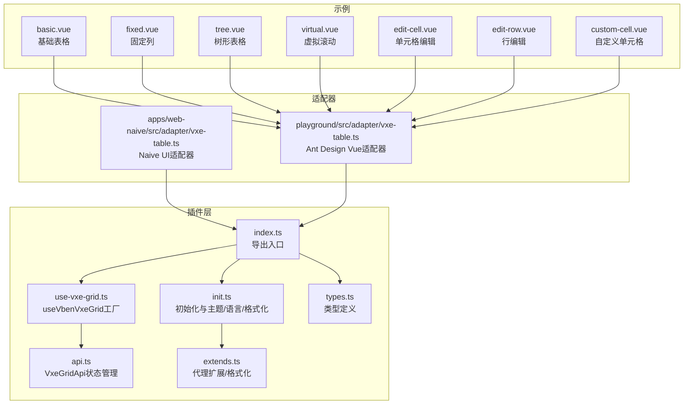
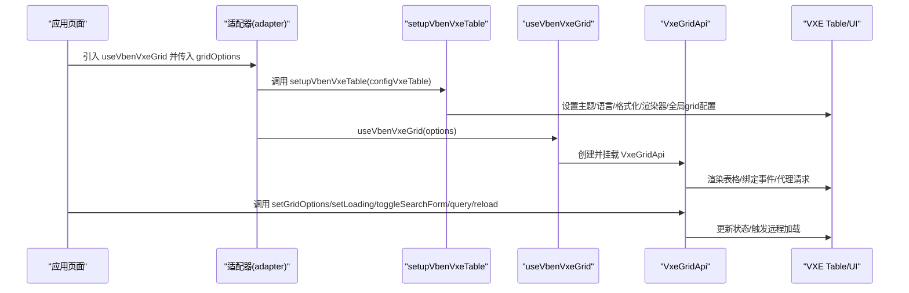
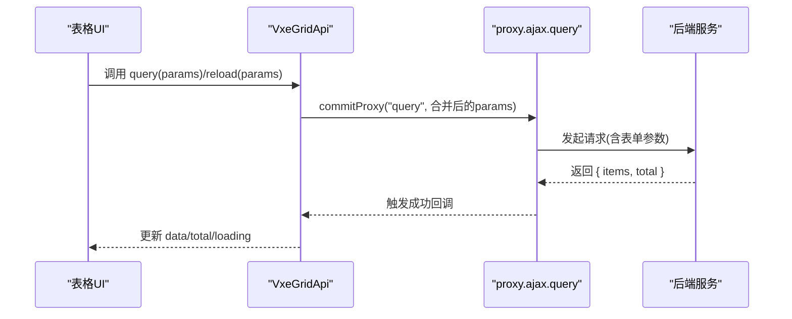
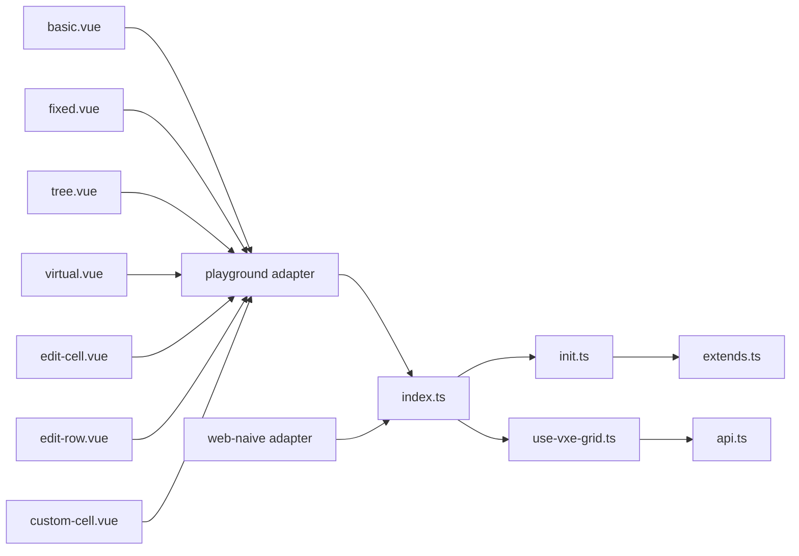

# 表格组件

<cite>
**本文引用的文件**
- [apps/web-naive/src/views/demos/table/index.vue](file://apps/web-naive/src/views/demos/table/index.vue)
- [packages/effects/plugins/src/vxe-table/index.ts](file://packages/effects/plugins/src/vxe-table/index.ts)
- [packages/effects/plugins/src/vxe-table/init.ts](file://packages/effects/plugins/src/vxe-table/init.ts)
- [packages/effects/plugins/src/vxe-table/use-vxe-grid.ts](file://packages/effects/plugins/src/vxe-table/use-vxe-grid.ts)
- [packages/effects/plugins/src/vxe-table/types.ts](file://packages/effects/plugins/src/vxe-table/types.ts)
- [packages/effects/plugins/src/vxe-table/api.ts](file://packages/effects/plugins/src/vxe-table/api.ts)
- [packages/effects/plugins/src/vxe-table/extends.ts](file://packages/effects/plugins/src/vxe-table/extends.ts)
- [playground/src/views/examples/vxe-table/basic.vue](file://playground/src/views/examples/vxe-table/basic.vue)
- [playground/src/views/examples/vxe-table/virtual.vue](file://playground/src/views/examples/vxe-table/virtual.vue)
- [playground/src/views/examples/vxe-table/fixed.vue](file://playground/src/views/examples/vxe-table/fixed.vue)
- [playground/src/views/examples/vxe-table/tree.vue](file://playground/src/views/examples/vxe-table/tree.vue)
- [playground/src/views/examples/vxe-table/edit-cell.vue](file://playground/src/views/examples/vxe-table/edit-cell.vue)
- [playground/src/views/examples/vxe-table/edit-row.vue](file://playground/src/views/examples/vxe-table/edit-row.vue)
- [playground/src/views/examples/vxe-table/custom-cell.vue](file://playground/src/views/examples/vxe-table/custom-cell.vue)
- [playground/src/adapter/vxe-table.ts](file://playground/src/adapter/vxe-table.ts)
- [apps/web-naive/src/adapter/vxe-table.ts](file://apps/web-naive/src/adapter/vxe-table.ts)
</cite>

## 更新摘要

**所做更改**

- 新增标签渲染器(CellTag)和开关渲染器(CellSwitch)的详细说明
- 新增操作按钮组(CellOperation)的完整功能介绍
- 新增国际化支持和本地化字符串的使用说明
- 更新适配器差异对比，展示Naive UI和Ant Design Vue的不同实现
- 新增自定义单元格渲染的示例和最佳实践
- 更新渲染器注册和配置的详细流程

## 目录

1. [简介](#简介)
2. [项目结构](#项目结构)
3. [核心组件](#核心组件)
4. [架构总览](#架构总览)
5. [详细组件分析](#详细组件分析)
6. [依赖关系分析](#依赖关系分析)
7. [性能考量](#性能考量)
8. [故障排查指南](#故障排查指南)
9. [结论](#结论)
10. [附录](#附录)

## 简介

本文件系统性梳理基于 VXE Table 的表格组件实现，覆盖数据展示、排序筛选、分页与编辑能力；阐述列配置、行操作与批量处理机制；详解虚拟滚动、固定列与响应式设计；说明与后端 API 的集成与数据同步策略；并提供性能优化与大数据量处理建议，以及自定义渲染与扩展开发指南。

**更新** 本次更新重点增强了表格适配器的功能，新增了标签渲染器、开关渲染器、操作按钮组等180+行新功能，显著提升了表格的交互性和用户体验。

## 项目结构

围绕表格组件的关键目录与文件如下：

- 插件入口与适配层：packages/effects/plugins/src/vxe-table/\*
- 示例页面：playground/src/views/examples/vxe-table/\*
- 适配器（Naive/Antd）：apps/web-naive/src/adapter/vxe-table.ts 与 playground/src/adapter/vxe-table.ts
- 基础演示页面：apps/web-naive/src/views/demos/table/index.vue

**图表来源**

- [packages/effects/plugins/src/vxe-table/index.ts:1-11](file://packages/effects/plugins/src/vxe-table/index.ts#L1-L11)
- [packages/effects/plugins/src/vxe-table/init.ts:1-143](file://packages/effects/plugins/src/vxe-table/init.ts#L1-L143)
- [packages/effects/plugins/src/vxe-table/use-vxe-grid.ts:1-85](file://packages/effects/plugins/src/vxe-table/use-vxe-grid.ts#L1-L85)
- [packages/effects/plugins/src/vxe-table/types.ts:1-102](file://packages/effects/plugins/src/vxe-table/types.ts#L1-L102)
- [packages/effects/plugins/src/vxe-table/api.ts:1-135](file://packages/effects/plugins/src/vxe-table/api.ts#L1-L135)
- [packages/effects/plugins/src/vxe-table/extends.ts:1-82](file://packages/effects/plugins/src/vxe-table/extends.ts#L1-L82)
- [apps/web-naive/src/adapter/vxe-table.ts:1-275](file://apps/web-naive/src/adapter/vxe-table.ts#L1-L275)
- [playground/src/adapter/vxe-table.ts:1-296](file://playground/src/adapter/vxe-table.ts#L1-L296)
- [playground/src/views/examples/vxe-table/basic.vue:1-112](file://playground/src/views/examples/vxe-table/basic.vue#L1-L112)
- [playground/src/views/examples/vxe-table/edit-cell.vue:1-58](file://playground/src/views/examples/vxe-table/edit-cell.vue#L1-L58)
- [playground/src/views/examples/vxe-table/edit-row.vue:1-95](file://playground/src/views/examples/vxe-table/edit-row.vue#L1-L95)
- [playground/src/views/examples/vxe-table/custom-cell.vue:1-109](file://playground/src/views/examples/vxe-table/custom-cell.vue#L1-L109)

**章节来源**

- [packages/effects/plugins/src/vxe-table/index.ts:1-11](file://packages/effects/plugins/src/vxe-table/index.ts#L1-L11)
- [packages/effects/plugins/src/vxe-table/init.ts:1-143](file://packages/effects/plugins/src/vxe-table/init.ts#L1-L143)
- [packages/effects/plugins/src/vxe-table/use-vxe-grid.ts:1-85](file://packages/effects/plugins/src/vxe-table/use-vxe-grid.ts#L1-L85)
- [packages/effects/plugins/src/vxe-table/types.ts:1-102](file://packages/effects/plugins/src/vxe-table/types.ts#L1-L102)
- [packages/effects/plugins/src/vxe-table/api.ts:1-135](file://packages/effects/plugins/src/vxe-table/api.ts#L1-L135)
- [packages/effects/plugins/src/vxe-table/extends.ts:1-82](file://packages/effects/plugins/src/vxe-table/extends.ts#L1-L82)
- [apps/web-naive/src/adapter/vxe-table.ts:1-275](file://apps/web-naive/src/adapter/vxe-table.ts#L1-L275)
- [playground/src/adapter/vxe-table.ts:1-296](file://playground/src/adapter/vxe-table.ts#L1-L296)
- [playground/src/views/examples/vxe-table/basic.vue:1-112](file://playground/src/views/examples/vxe-table/basic.vue#L1-L112)
- [playground/src/views/examples/vxe-table/edit-cell.vue:1-58](file://playground/src/views/examples/vxe-table/edit-cell.vue#L1-L58)
- [playground/src/views/examples/vxe-table/edit-row.vue:1-95](file://playground/src/views/examples/vxe-table/edit-row.vue#L1-L95)
- [playground/src/views/examples/vxe-table/custom-cell.vue:1-109](file://playground/src/views/examples/vxe-table/custom-cell.vue#L1-L109)

## 核心组件

- 初始化与全局配置：通过 setupVbenVxeTable 完成主题、语言、国际化、格式化器与渲染器注册，并注入全局 grid 配置。
- 表格工厂：useVbenVxeGrid 提供统一的表格组件与 API，支持响应式状态、工具栏插槽、搜索表单与分隔条等。
- 状态管理：VxeGridApi 聚合 Store 与 StateHandler，提供 setGridOptions、setLoading、toggleSearchForm、query/reload 等方法。
- 代理扩展：extendProxyOptions 包装 proxy.ajax.\* 回调，自动合并表单查询参数，增强远程数据加载一致性。
- 渲染器：内置 CellImage、CellLink、CellTag、CellSwitch、CellOperation 等渲染器，支持单元格级自定义渲染与操作按钮组。

**更新** 新增的渲染器功能包括：

- CellTag：标签渲染器，支持自定义颜色和标签映射
- CellSwitch：开关渲染器，支持异步状态切换和加载状态显示
- CellOperation：操作按钮组，支持多种预设操作和自定义操作

**章节来源**

- [packages/effects/plugins/src/vxe-table/init.ts:111-142](file://packages/effects/plugins/src/vxe-table/init.ts#L111-L142)
- [packages/effects/plugins/src/vxe-table/use-vxe-grid.ts:22-82](file://packages/effects/plugins/src/vxe-table/use-vxe-grid.ts#L22-L82)
- [packages/effects/plugins/src/vxe-table/api.ts:32-134](file://packages/effects/plugins/src/vxe-table/api.ts#L32-L134)
- [packages/effects/plugins/src/vxe-table/extends.ts:9-67](file://packages/effects/plugins/src/vxe-table/extends.ts#L9-L67)
- [playground/src/adapter/vxe-table.ts:82-277](file://playground/src/adapter/vxe-table.ts#L82-L277)
- [apps/web-naive/src/adapter/vxe-table.ts:81-255](file://apps/web-naive/src/adapter/vxe-table.ts#L81-L255)

## 架构总览

下图展示从应用到插件再到 VXE Table 的整体调用链路与职责划分：

**图表来源**

- [playground/src/adapter/vxe-table.ts:21-282](file://playground/src/adapter/vxe-table.ts#L21-L282)
- [packages/effects/plugins/src/vxe-table/init.ts:111-142](file://packages/effects/plugins/src/vxe-table/init.ts#L111-L142)
- [packages/effects/plugins/src/vxe-table/use-vxe-grid.ts:22-82](file://packages/effects/plugins/src/vxe-table/use-vxe-grid.ts#L22-L82)
- [packages/effects/plugins/src/vxe-table/api.ts:67-90](file://packages/effects/plugins/src/vxe-table/api.ts#L67-L90)

## 详细组件分析

### 列配置与列渲染

- 列类型：支持序号列、普通字段列、树节点列、固定列等。
- 渲染器：通过 vxeUI.renderer.add 注册多种单元格渲染器，如图片、链接、标签、开关、操作按钮组。
- 固定列：通过列配置的 fixed 字段启用左右固定，结合工具栏与分页实现复杂布局。
- 树形表格：通过 treeConfig.parentField/rowField/transform 实现父子关系与展开折叠控制。

**更新** 新增渲染器功能详解：

#### 标签渲染器(CellTag)

- 功能：将数值转换为带颜色的标签显示
- 配置：支持 options 数组自定义标签映射，如 `{ value: 1, label: '启用', color: 'success' }`
- 国际化：默认标签使用 `$t()` 函数进行翻译
- 适配差异：Naive UI 和 Ant Design Vue 使用不同的标签组件

#### 开关渲染器(CellSwitch)

- 功能：提供可切换的状态显示和编辑功能
- 异步支持：支持 beforeChange 回调函数进行异步状态切换
- 加载状态：自动处理切换过程中的加载状态显示
- 值映射：支持自定义选中和未选中值，默认 1/0

#### 操作按钮组(CellOperation)

- 功能：在同一列中渲染多个操作按钮
- 预设操作：支持 'edit'、'delete' 等预设操作
- 自定义操作：支持完全自定义操作按钮
- 国际化：按钮文本使用 `$t()` 函数进行翻译
- 确认对话框：删除操作自动添加确认对话框

**章节来源**

- [playground/src/views/examples/vxe-table/basic.vue:22-38](file://playground/src/views/examples/vxe-table/basic.vue#L22-L38)
- [playground/src/views/examples/vxe-table/fixed.vue:20-56](file://playground/src/views/examples/vxe-table/fixed.vue#L20-L56)
- [playground/src/views/examples/vxe-table/tree.vue:21-38](file://playground/src/views/examples/vxe-table/tree.vue#L21-L38)
- [playground/src/views/examples/vxe-table/custom-cell.vue:23-86](file://playground/src/views/examples/vxe-table/custom-cell.vue#L23-L86)
- [playground/src/adapter/vxe-table.ts:82-277](file://playground/src/adapter/vxe-table.ts#L82-L277)
- [apps/web-naive/src/adapter/vxe-table.ts:81-255](file://apps/web-naive/src/adapter/vxe-table.ts#L81-L255)

### 排序、筛选与分页

- 排序：开启 sortConfig.multiple 支持多字段排序；列可配置 sortable。
- 筛选：通过 formOptions 与 toolbarConfig.search 配合，实现搜索表单与表格联动。
- 分页：pagerConfig 启用分页；proxyConfig.ajax.query 返回 { items, total } 结构，驱动分页与数据加载。

**章节来源**

- [playground/src/views/examples/vxe-table/basic.vue:32-38](file://playground/src/views/examples/vxe-table/basic.vue#L32-L38)
- [playground/src/views/examples/vxe-table/fixed.vue:43-52](file://playground/src/views/examples/vxe-table/fixed.vue#L43-L52)
- [playground/src/adapter/vxe-table.ts:35-49](file://playground/src/adapter/vxe-table.ts#L35-L49)

### 编辑与行操作

- 单元格编辑：CellSwitch 使用 row[field] 双向绑定，beforeChange 可拦截变更并设置 loading 状态。
- 行内操作：CellOperation 渲染编辑/删除等按钮，支持图标、文案、对齐与点击回调；删除操作使用确认气泡。
- 批量处理：通过 API 的 setState 与列 slots 自定义批量选择与批量操作入口。

**更新** 新增编辑功能特性：

- 单元格编辑：支持 input、select 等原生编辑器
- 行编辑：支持整行编辑模式，提供保存和取消功能
- 自定义编辑：支持自定义编辑器组件

**章节来源**

- [playground/src/adapter/vxe-table.ts:102-131](file://playground/src/adapter/vxe-table.ts#L102-L131)
- [playground/src/adapter/vxe-table.ts:133-277](file://playground/src/adapter/vxe-table.ts#L133-L277)
- [apps/web-naive/src/adapter/vxe-table.ts:107-131](file://apps/web-naive/src/adapter/vxe-table.ts#L107-L131)
- [apps/web-naive/src/adapter/vxe-table.ts:133-251](file://apps/web-naive/src/adapter/vxe-table.ts#L133-L251)
- [playground/src/views/examples/vxe-table/edit-cell.vue:18-48](file://playground/src/views/examples/vxe-table/edit-cell.vue#L18-L48)
- [playground/src/views/examples/vxe-table/edit-row.vue:20-77](file://playground/src/views/examples/vxe-table/edit-row.vue#L20-L77)

### 虚拟滚动与大数据量

- 虚拟滚动：scrollY.enabled 与阈值配置，结合高度自适应与超大数据集渲染。
- 示例：一次性注入 1000 条模拟数据，验证滚动性能与内存占用。

**章节来源**

- [playground/src/views/examples/vxe-table/virtual.vue:17-34](file://playground/src/views/examples/vxe-table/virtual.vue#L17-L34)
- [playground/src/views/examples/vxe-table/virtual.vue:39-55](file://playground/src/views/examples/vxe-table/virtual.vue#L39-L55)

### 固定列与响应式设计

- 固定列：左/右固定列配合工具栏与分页，保证关键列在横向滚动时可见。
- 响应式：列宽度与工具栏布局随屏幕变化；列对齐与按钮排列根据列对齐自动调整。

**章节来源**

- [playground/src/views/examples/vxe-table/fixed.vue:20-56](file://playground/src/views/examples/vxe-table/fixed.vue#L20-L56)
- [playground/src/adapter/vxe-table.ts:133-153](file://playground/src/adapter/vxe-table.ts#L133-L153)
- [apps/web-naive/src/adapter/vxe-table.ts:133-153](file://apps/web-naive/src/adapter/vxe-table.ts#L133-L153)

### 与后端 API 集成与数据同步

- 远程代理：proxyConfig.ajax.query 返回 { items, total }，自动与分页联动。
- 参数合并：extendProxyOptions 包装 query/querySuccess 等回调，自动合并表单值与自定义参数。
- 查询与重载：API 提供 query/reload 方法，统一触发远程加载与状态更新。

**图表来源**

- [packages/effects/plugins/src/vxe-table/api.ts:76-90](file://packages/effects/plugins/src/vxe-table/api.ts#L76-L90)
- [packages/effects/plugins/src/vxe-table/extends.ts:38-67](file://packages/effects/plugins/src/vxe-table/extends.ts#L38-L67)
- [playground/src/views/examples/vxe-table/fixed.vue:43-52](file://playground/src/views/examples/vxe-table/fixed.vue#L43-L52)

**章节来源**

- [packages/effects/plugins/src/vxe-table/api.ts:76-90](file://packages/effects/plugins/src/vxe-table/api.ts#L76-L90)
- [packages/effects/plugins/src/vxe-table/extends.ts:9-67](file://packages/effects/plugins/src/vxe-table/extends.ts#L9-L67)
- [playground/src/views/examples/vxe-table/fixed.vue:43-52](file://playground/src/views/examples/vxe-table/fixed.vue#L43-L52)

### 自定义渲染与扩展开发

- 渲染器扩展：通过 vxeUI.renderer.add 注册自定义单元格渲染器，支持 props/attrs 透传与事件绑定。
- 格式化器：通过 vxeUI.formats.add 注册日期/时间等格式化器，统一表格展示风格。
- 适配器差异：Naive 与 Antd 适配器分别使用对应 UI 组件库渲染器，保持一致行为。

**更新** 新增国际化支持：

- 语言切换：自动根据系统偏好设置切换语言
- 文本翻译：所有用户可见文本都支持国际化
- 本地化配置：支持中英文双语环境

**章节来源**

- [playground/src/adapter/vxe-table.ts:60-131](file://playground/src/adapter/vxe-table.ts#L60-L131)
- [playground/src/adapter/vxe-table.ts:133-277](file://playground/src/adapter/vxe-table.ts#L133-L277)
- [apps/web-naive/src/adapter/vxe-table.ts:60-131](file://apps/web-naive/src/adapter/vxe-table.ts#L60-L131)
- [apps/web-naive/src/adapter/vxe-table.ts:133-251](file://apps/web-naive/src/adapter/vxe-table.ts#L133-L251)
- [packages/effects/plugins/src/vxe-table/init.ts:120-137](file://packages/effects/plugins/src/vxe-table/init.ts#L120-L137)

## 依赖关系分析

- 插件入口导出：index.ts 汇聚 setupVbenVxeTable、useVbenVxeGrid 与类型别名。
- 组件耦合：useVbenVxeGrid 依赖 VxeGridApi 与 Store；VxeGridApi 依赖 VXE Table 实例与状态处理器。
- 适配器依赖：适配器负责全局配置与渲染器注册，应用侧仅需引入 useVbenVxeGrid 即可使用。

**图表来源**

- [packages/effects/plugins/src/vxe-table/index.ts:1-11](file://packages/effects/plugins/src/vxe-table/index.ts#L1-L11)
- [packages/effects/plugins/src/vxe-table/init.ts:1-143](file://packages/effects/plugins/src/vxe-table/init.ts#L1-L143)
- [packages/effects/plugins/src/vxe-table/use-vxe-grid.ts:1-85](file://packages/effects/plugins/src/vxe-table/use-vxe-grid.ts#L1-L85)
- [packages/effects/plugins/src/vxe-table/api.ts:1-135](file://packages/effects/plugins/src/vxe-table/api.ts#L1-L135)
- [packages/effects/plugins/src/vxe-table/extends.ts:1-82](file://packages/effects/plugins/src/vxe-table/extends.ts#L1-L82)
- [playground/src/adapter/vxe-table.ts:1-296](file://playground/src/adapter/vxe-table.ts#L1-L296)
- [apps/web-naive/src/adapter/vxe-table.ts:1-275](file://apps/web-naive/src/adapter/vxe-table.ts#L1-L275)
- [playground/src/views/examples/vxe-table/basic.vue:1-112](file://playground/src/views/examples/vxe-table/basic.vue#L1-L112)
- [playground/src/views/examples/vxe-table/edit-cell.vue:1-58](file://playground/src/views/examples/vxe-table/edit-cell.vue#L1-L58)
- [playground/src/views/examples/vxe-table/edit-row.vue:1-95](file://playground/src/views/examples/vxe-table/edit-row.vue#L1-L95)
- [playground/src/views/examples/vxe-table/custom-cell.vue:1-109](file://playground/src/views/examples/vxe-table/custom-cell.vue#L1-L109)

**章节来源**

- [packages/effects/plugins/src/vxe-table/index.ts:1-11](file://packages/effects/plugins/src/vxe-table/index.ts#L1-L11)
- [packages/effects/plugins/src/vxe-table/use-vxe-grid.ts:1-85](file://packages/effects/plugins/src/vxe-table/use-vxe-grid.ts#L1-L85)
- [packages/effects/plugins/src/vxe-table/api.ts:1-135](file://packages/effects/plugins/src/vxe-table/api.ts#L1-L135)
- [playground/src/adapter/vxe-table.ts:1-296](file://playground/src/adapter/vxe-table.ts#L1-L296)
- [apps/web-naive/src/adapter/vxe-table.ts:1-275](file://apps/web-naive/src/adapter/vxe-table.ts#L1-L275)

## 性能考量

- 虚拟滚动：在大量数据场景启用 scrollY，避免一次性渲染造成卡顿。
- 渲染器轻量化：尽量使用简单渲染器，避免在渲染器中执行复杂逻辑。
- 状态最小化：通过 setGridOptions 仅更新必要字段，减少不必要的响应式更新。
- 代理参数合并：利用 extendProxyOptions 合并表单参数，避免重复请求与无效刷新。
- 图片与富文本：谨慎使用大图与长文本溢出，必要时启用 showOverflow 并限制宽度。
- 渲染器缓存：合理使用渲染器缓存机制，避免重复创建组件实例。

**更新** 新增性能优化建议：

- 异步渲染：对于复杂的自定义渲染器，考虑使用异步渲染避免阻塞主线程
- 内存管理：及时清理不再使用的渲染器实例，避免内存泄漏
- 事件委托：在操作按钮组中使用事件委托减少事件监听器数量

## 故障排查指南

- 表格无数据：检查 proxyConfig.ajax.query 返回结构是否符合 { items, total }；确认 autoLoad 与响应配置。
- 刷新按钮异常：extendProxyOptions 对 toolbarConfig.refresh 的事件参数做了兼容处理，确保传参正确。
- 热更新报错：适配器已清理 renderer 中以 Cell 开头的键，避免热更新冲突。
- 加载态未恢复：调用 setLoading(true) 后务必在异步完成后恢复为 false。
- 删除确认遮挡：适配器在弹窗打开时临时禁用表格滚动，避免弹窗被遮挡或脱离视口。
- 国际化失效：检查本地化文件是否存在，确认语言切换逻辑正常工作。
- 渲染器冲突：不同适配器间的渲染器可能存在冲突，需要确保只注册一次。

**更新** 新增故障排查：

- 标签渲染器异常：检查 options 配置是否正确，确认值映射关系
- 开关渲染器无响应：检查 beforeChange 回调是否返回正确的结果
- 操作按钮组显示问题：检查列对齐设置和按钮配置

**章节来源**

- [packages/effects/plugins/src/vxe-table/extends.ts:38-67](file://packages/effects/plugins/src/vxe-table/extends.ts#L38-L67)
- [playground/src/adapter/vxe-table.ts:54-59](file://playground/src/adapter/vxe-table.ts#L54-L59)
- [playground/src/adapter/vxe-table.ts:227-243](file://playground/src/adapter/vxe-table.ts#L227-L243)
- [packages/effects/plugins/src/vxe-table/api.ts:98-104](file://packages/effects/plugins/src/vxe-table/api.ts#L98-L104)

## 结论

本表格组件以 VXE Table 为核心，通过适配器完成主题、语言、格式化与渲染器的统一配置，借助 useVbenVxeGrid 提供一致的 API 体验。配合 VxeGridApi 的状态管理与代理扩展，实现远程数据加载、排序筛选、分页与行操作的完整闭环。在大数据量场景下，推荐启用虚拟滚动与轻量化渲染器，并通过最小化状态更新与参数合并提升性能。

**更新** 最新版本显著增强了表格的交互能力，新增的标签渲染器、开关渲染器和操作按钮组为用户提供了更丰富的数据展示和操作方式。国际化支持确保了多语言环境下的良好用户体验。适配器的差异化实现满足了不同 UI 库的需求，提高了组件的通用性和可扩展性。

## 附录

- 基础演示页面：apps/web-naive/src/views/demos/table/index.vue 展示了 Naive UI DataTable 的基础用法，便于对比理解。
- 示例页面：playground/src/views/examples/vxe-table/\* 提供了基础、固定列、树形、虚拟滚动、编辑等典型场景。

**章节来源**

- [apps/web-naive/src/views/demos/table/index.vue:1-39](file://apps/web-naive/src/views/demos/table/index.vue#L1-L39)
- [playground/src/views/examples/vxe-table/basic.vue:1-112](file://playground/src/views/examples/vxe-table/basic.vue#L1-L112)
- [playground/src/views/examples/vxe-table/fixed.vue:1-70](file://playground/src/views/examples/vxe-table/fixed.vue#L1-L70)
- [playground/src/views/examples/vxe-table/tree.vue:1-63](file://playground/src/views/examples/vxe-table/tree.vue#L1-L63)
- [playground/src/views/examples/vxe-table/virtual.vue:1-67](file://playground/src/views/examples/vxe-table/virtual.vue#L1-L67)
- [playground/src/views/examples/vxe-table/edit-cell.vue:1-58](file://playground/src/views/examples/vxe-table/edit-cell.vue#L1-L58)
- [playground/src/views/examples/vxe-table/edit-row.vue:1-95](file://playground/src/views/examples/vxe-table/edit-row.vue#L1-L95)
- [playground/src/views/examples/vxe-table/custom-cell.vue:1-109](file://playground/src/views/examples/vxe-table/custom-cell.vue#L1-L109)
