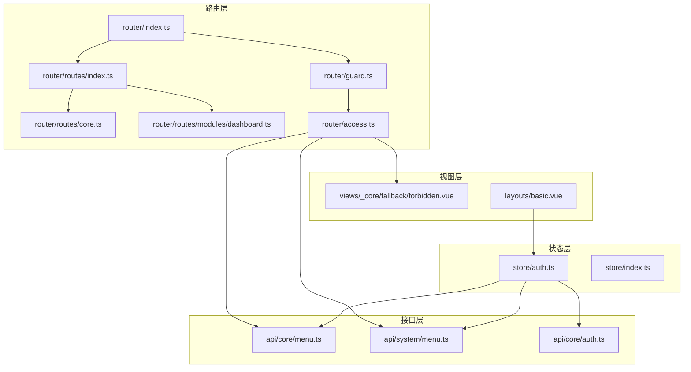
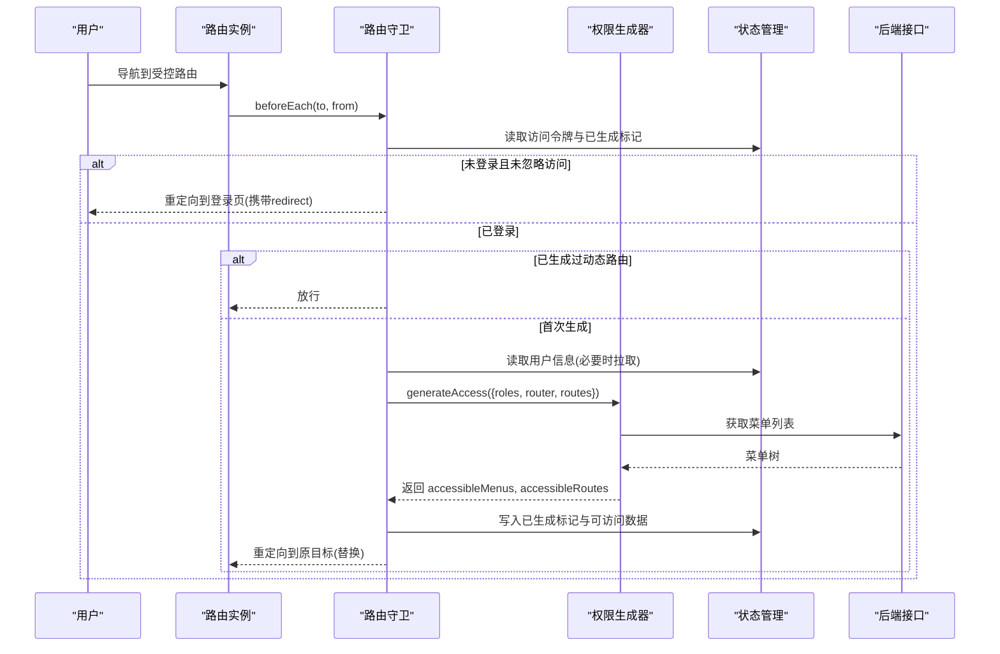
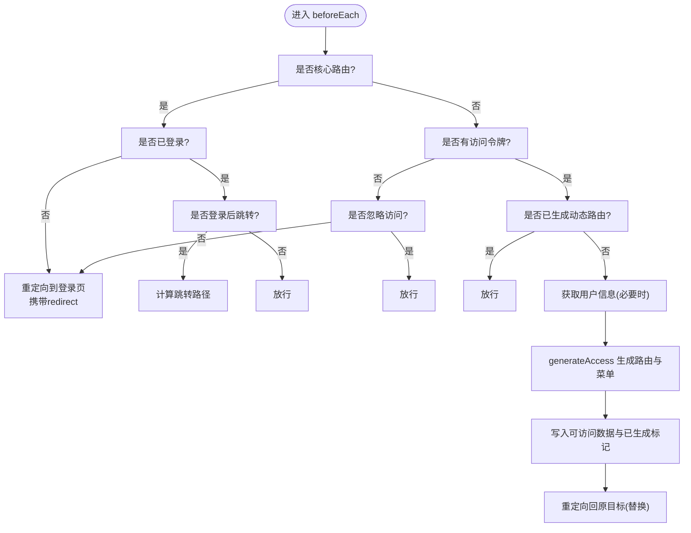
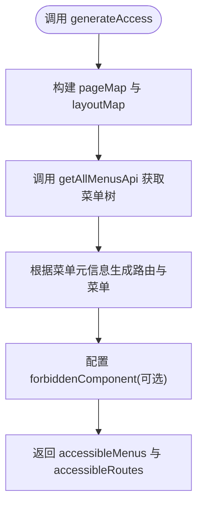
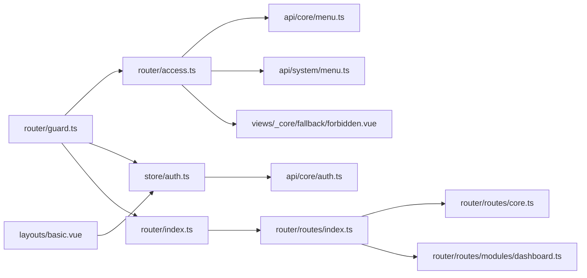

# 动态路由

<cite>
**本文引用的文件**
- [apps/web-naive/src/router/index.ts](file://apps/web-naive/src/router/index.ts)
- [apps/web-naive/src/router/guard.ts](file://apps/web-naive/src/router/guard.ts)
- [apps/web-naive/src/router/access.ts](file://apps/web-naive/src/router/access.ts)
- [apps/web-naive/src/router/routes/index.ts](file://apps/web-naive/src/router/routes/index.ts)
- [apps/web-naive/src/router/routes/core.ts](file://apps/web-naive/src/router/routes/core.ts)
- [apps/web-naive/src/router/routes/modules/dashboard.ts](file://apps/web-naive/src/router/routes/modules/dashboard.ts)
- [apps/web-naive/src/store/auth.ts](file://apps/web-naive/src/store/auth.ts)
- [apps/web-naive/src/store/index.ts](file://apps/web-naive/src/store/index.ts)
- [apps/web-naive/src/api/core/menu.ts](file://apps/web-naive/src/api/core/menu.ts)
- [apps/web-naive/src/api/system/menu.ts](file://apps/web-naive/src/api/system/menu.ts)
- [apps/web-naive/src/api/core/auth.ts](file://apps/web-naive/src/api/core/auth.ts)
- [apps/web-naive/src/layouts/basic.vue](file://apps/web-naive/src/layouts/basic.vue)
- [apps/web-naive/src/views/_core/fallback/forbidden.vue](file://apps/web-naive/src/views/_core/fallback/forbidden.vue)
</cite>

## 目录

1. [引言](#引言)
2. [项目结构](#项目结构)
3. [核心组件](#核心组件)
4. [架构总览](#架构总览)
5. [详细组件分析](#详细组件分析)
6. [依赖分析](#依赖分析)
7. [性能考虑](#性能考虑)
8. [故障排查指南](#故障排查指南)
9. [结论](#结论)
10. [附录](#附录)

## 引言

本文件系统化阐述 shiyu-ui 的动态路由体系：如何基于用户权限动态生成路由与菜单、如何进行权限校验与菜单可见性控制、如何与静态路由协同工作、以及路由重置与更新机制。文档同时给出数据来源、生成流程、安全与性能建议，并提供可落地的最佳实践。

## 项目结构

动态路由相关代码集中在前端应用层的 router、store、api 与视图目录中，采用“路由模块 + 守卫 + 状态管理 + 接口调用”的分层设计：

- 路由定义与合并：通过模块化文件聚合动态路由，与核心静态路由组合形成最终路由表。
- 路由守卫：统一处理进度条、登录态、权限拦截与首次动态路由生成。
- 权限生成器：封装从后端菜单数据到可访问路由与菜单的转换逻辑。
- 状态管理：维护访问令牌、用户信息、权限码、已生成的可访问路由与菜单。
- 接口层：提供菜单与用户信息等后端数据获取能力。

图表来源

- [apps/web-naive/src/router/index.ts:1-38](file://apps/web-naive/src/router/index.ts#L1-L38)
- [apps/web-naive/src/router/guard.ts:1-133](file://apps/web-naive/src/router/guard.ts#L1-L133)
- [apps/web-naive/src/router/access.ts:1-41](file://apps/web-naive/src/router/access.ts#L1-L41)
- [apps/web-naive/src/router/routes/index.ts:1-38](file://apps/web-naive/src/router/routes/index.ts#L1-L38)
- [apps/web-naive/src/router/routes/core.ts:1-98](file://apps/web-naive/src/router/routes/core.ts#L1-L98)
- [apps/web-naive/src/router/routes/modules/dashboard.ts:1-39](file://apps/web-naive/src/router/routes/modules/dashboard.ts#L1-L39)
- [apps/web-naive/src/store/auth.ts:1-119](file://apps/web-naive/src/store/auth.ts#L1-L119)
- [apps/web-naive/src/api/core/menu.ts:1-11](file://apps/web-naive/src/api/core/menu.ts#L1-L11)
- [apps/web-naive/src/api/system/menu.ts:1-169](file://apps/web-naive/src/api/system/menu.ts#L1-L169)
- [apps/web-naive/src/api/core/auth.ts:1-52](file://apps/web-naive/src/api/core/auth.ts#L1-L52)
- [apps/web-naive/src/views/\_core/fallback/forbidden.vue:1-10](file://apps/web-naive/src/views/_core/fallback/forbidden.vue#L1-L10)
- [apps/web-naive/src/layouts/basic.vue:1-237](file://apps/web-naive/src/layouts/basic.vue#L1-L237)

章节来源

- [apps/web-naive/src/router/index.ts:1-38](file://apps/web-naive/src/router/index.ts#L1-L38)
- [apps/web-naive/src/router/routes/index.ts:1-38](file://apps/web-naive/src/router/routes/index.ts#L1-L38)
- [apps/web-naive/src/router/routes/core.ts:1-98](file://apps/web-naive/src/router/routes/core.ts#L1-L98)

## 核心组件

- 路由实例与初始化
  - 创建路由实例，选择历史模式，注入初始静态路由，设置滚动行为与重置方法。
  - 参考路径：[apps/web-naive/src/router/index.ts:15-32](file://apps/web-naive/src/router/index.ts#L15-L32)
- 路由守卫
  - 通用守卫：记录页面加载状态、按配置开启进度条。
  - 权限守卫：对非核心路由进行访问控制；未登录或无访问权限时重定向至登录页；首次访问时拉取用户信息与权限，生成可访问路由与菜单。
  - 参考路径：[apps/web-naive/src/router/guard.ts:17-119](file://apps/web-naive/src/router/guard.ts#L17-L119)
- 权限生成器
  - 封装 generateAccessible，负责：
    - 异步获取菜单列表；
    - 构建页面与布局映射；
    - 指定无权限时的兜底组件（403）；
    - 返回 accessibleMenus 与 accessibleRoutes。
  - 参考路径：[apps/web-naive/src/router/access.ts:16-38](file://apps/web-naive/src/router/access.ts#L16-L38)
- 路由与菜单数据源
  - 后端菜单接口：获取全部菜单数据。
  - 参考路径：[apps/web-naive/src/api/core/menu.ts:8-10](file://apps/web-naive/src/api/core/menu.ts#L8-L10)
  - 系统菜单接口：提供菜单 CRUD 与校验能力（与动态路由生成解耦）。
  - 参考路径：[apps/web-naive/src/api/system/menu.ts:98-100](file://apps/web-naive/src/api/system/menu.ts#L98-L100)
- 用户与登录态
  - 登录成功后写入访问令牌与用户信息，触发路由跳转或回调。
  - 参考路径：[apps/web-naive/src/store/auth.ts:28-79](file://apps/web-naive/src/store/auth.ts#L28-L79)
- 路由模块与合并
  - 动态路由模块按约定位置自动扫描合并；核心路由与兜底路由固定存在。
  - 参考路径：[apps/web-naive/src/router/routes/index.ts:7-37](file://apps/web-naive/src/router/routes/index.ts#L7-L37)
- 基础布局与菜单渲染
  - 基础布局承载菜单与用户交互，配合权限状态控制菜单可见性。
  - 参考路径：[apps/web-naive/src/layouts/basic.vue:87-122](file://apps/web-naive/src/layouts/basic.vue#L87-L122)

章节来源

- [apps/web-naive/src/router/index.ts:15-32](file://apps/web-naive/src/router/index.ts#L15-L32)
- [apps/web-naive/src/router/guard.ts:17-119](file://apps/web-naive/src/router/guard.ts#L17-L119)
- [apps/web-naive/src/router/access.ts:16-38](file://apps/web-naive/src/router/access.ts#L16-L38)
- [apps/web-naive/src/api/core/menu.ts:8-10](file://apps/web-naive/src/api/core/menu.ts#L8-L10)
- [apps/web-naive/src/store/auth.ts:28-79](file://apps/web-naive/src/store/auth.ts#L28-L79)
- [apps/web-naive/src/router/routes/index.ts:7-37](file://apps/web-naive/src/router/routes/index.ts#L7-L37)
- [apps/web-naive/src/layouts/basic.vue:87-122](file://apps/web-naive/src/layouts/basic.vue#L87-L122)

## 架构总览

动态路由的运行时主干流程如下：

图表来源

- [apps/web-naive/src/router/guard.ts:48-118](file://apps/web-naive/src/router/guard.ts#L48-L118)
- [apps/web-naive/src/router/access.ts:16-38](file://apps/web-naive/src/router/access.ts#L16-L38)
- [apps/web-naive/src/api/core/menu.ts:8-10](file://apps/web-naive/src/api/core/menu.ts#L8-L10)

## 详细组件分析

### 路由守卫与权限拦截

- 核心路由豁免：根路由与认证相关路由不参与权限拦截。
- 登录态检查：无访问令牌且未声明忽略访问时，强制跳转登录页并携带 redirect。
- 首次生成：若尚未生成动态路由，读取用户信息与角色，调用权限生成器，写入可访问菜单与路由，并重定向回原目标。
- 进度条与页面加载状态：按配置开启页面加载进度条，afterEach 标记页面已加载避免重复执行。

图表来源

- [apps/web-naive/src/router/guard.ts:48-118](file://apps/web-naive/src/router/guard.ts#L48-L118)

章节来源

- [apps/web-naive/src/router/guard.ts:17-119](file://apps/web-naive/src/router/guard.ts#L17-L119)

### 权限生成器与菜单/路由转换

- 页面与布局映射：通过 import.meta.glob 扫描 views 下的页面组件，结合内置布局组件构建 pageMap 与 layoutMap。
- 菜单拉取：异步调用后端接口获取菜单树，展示加载提示。
- 权限策略：依据后端菜单元信息与前端偏好配置，生成可访问路由与菜单树。
- 无权限处理：可配置 forbiddenComponent（如 403 页面），并支持“带禁权仍显示菜单”的场景。

图表来源

- [apps/web-naive/src/router/access.ts:16-38](file://apps/web-naive/src/router/access.ts#L16-L38)
- [apps/web-naive/src/api/core/menu.ts:8-10](file://apps/web-naive/src/api/core/menu.ts#L8-L10)

章节来源

- [apps/web-naive/src/router/access.ts:16-38](file://apps/web-naive/src/router/access.ts#L16-L38)

### 路由与菜单数据来源

- 菜单数据：后端提供“获取全部菜单”接口，返回菜单树结构，包含权限标识、图标、可见性、重定向、iframe 等元信息。
- 用户信息与权限码：登录成功后同步用户信息与权限码，供权限判断与动态路由生成使用。
- 系统菜单接口：提供菜单 CRUD 与唯一性校验，用于后台管理，不影响前端动态路由生成。

章节来源

- [apps/web-naive/src/api/core/menu.ts:8-10](file://apps/web-naive/src/api/core/menu.ts#L8-L10)
- [apps/web-naive/src/api/core/auth.ts:49-51](file://apps/web-naive/src/api/core/auth.ts#L49-L51)
- [apps/web-naive/src/api/system/menu.ts:98-100](file://apps/web-naive/src/api/system/menu.ts#L98-L100)

### 动态路由与静态路由的结合

- 静态核心路由：根路由、认证路由、404兜底路由等始终存在，不参与权限拦截。
- 动态路由模块：按约定位置扫描并合并，构成权限控制范围内的路由主体。
- 最终路由表：核心路由 + 外部路由 + 动态路由 + 静态路由 + 兜底路由。

章节来源

- [apps/web-naive/src/router/routes/index.ts:24-37](file://apps/web-naive/src/router/routes/index.ts#L24-L37)
- [apps/web-naive/src/router/routes/core.ts:24-95](file://apps/web-naive/src/router/routes/core.ts#L24-L95)

### 菜单可见性与权限码匹配

- 菜单可见性：后端菜单元信息包含 hideInMenu、hideInBreadcrumb、hideInTab 等字段，前端据此决定菜单渲染与标签页显示。
- 权限码匹配：登录后获取权限码集合，结合后端菜单的 authCode 字段进行匹配，决定路由是否可访问。
- 403 行为：当菜单可见但无权限时，可配置 forbiddenComponent（例如 403 页面）进行展示。

章节来源

- [apps/web-naive/src/api/system/menu.ts:25-92](file://apps/web-naive/src/api/system/menu.ts#L25-L92)
- [apps/web-naive/src/router/access.ts:14](file://apps/web-naive/src/router/access.ts#L14)

### 路由重置与更新机制

- 路由重置：通过 resetStaticRoutes 将静态路由恢复到初始状态，便于登出或切换账号后的干净状态。
- 登录成功后：写入访问令牌与用户信息，触发路由跳转或回调。
- 登出清理：调用 resetAllStores 清空状态，清除登录过期标记，并可选择携带当前路由地址跳转登录页。

章节来源

- [apps/web-naive/src/router/index.ts:32](file://apps/web-naive/src/router/index.ts#L32)
- [apps/web-naive/src/store/auth.ts:81-99](file://apps/web-naive/src/store/auth.ts#L81-L99)

## 依赖分析

- 组件耦合
  - 路由守卫依赖状态管理（访问令牌、用户信息、已生成标记）与权限生成器。
  - 权限生成器依赖后端菜单接口与本地页面/布局映射。
  - 登录流程依赖认证接口与状态管理，成功后驱动路由跳转。
- 外部依赖
  - vue-router：路由实例、导航守卫、路由解析与重定向。
  - Pinia：状态持久化与共享。
  - 请求客户端：统一的 HTTP 客户端封装。

图表来源

- [apps/web-naive/src/router/guard.ts:1-133](file://apps/web-naive/src/router/guard.ts#L1-L133)
- [apps/web-naive/src/router/access.ts:1-41](file://apps/web-naive/src/router/access.ts#L1-L41)
- [apps/web-naive/src/api/core/menu.ts:1-11](file://apps/web-naive/src/api/core/menu.ts#L1-L11)
- [apps/web-naive/src/api/system/menu.ts:1-169](file://apps/web-naive/src/api/system/menu.ts#L1-L169)
- [apps/web-naive/src/api/core/auth.ts:1-52](file://apps/web-naive/src/api/core/auth.ts#L1-L52)
- [apps/web-naive/src/router/index.ts:1-38](file://apps/web-naive/src/router/index.ts#L1-L38)
- [apps/web-naive/src/router/routes/index.ts:1-38](file://apps/web-naive/src/router/routes/index.ts#L1-L38)
- [apps/web-naive/src/router/routes/core.ts:1-98](file://apps/web-naive/src/router/routes/core.ts#L1-L98)
- [apps/web-naive/src/router/routes/modules/dashboard.ts:1-39](file://apps/web-naive/src/router/routes/modules/dashboard.ts#L1-L39)
- [apps/web-naive/src/views/\_core/fallback/forbidden.vue:1-10](file://apps/web-naive/src/views/_core/fallback/forbidden.vue#L1-L10)
- [apps/web-naive/src/layouts/basic.vue:1-237](file://apps/web-naive/src/layouts/basic.vue#L1-L237)

## 性能考虑

- 路由懒加载：页面组件通过 import 动态导入，减少首屏体积。
- 菜单一次性拉取：首次生成时一次性获取菜单树，避免多次请求。
- 进度条与页面加载状态：仅在首次访问时开启进度条，避免重复开销。
- 路由重置：登出时重置静态路由，避免残留路由影响后续登录态。
- 建议
  - 对大型菜单树进行分页或按需加载（视后端能力）。
  - 缓存用户信息与权限码，减少重复请求。
  - 对动态路由模块进行合理拆分，避免单文件过大。

## 故障排查指南

- 无法进入受控路由
  - 检查访问令牌是否存在；若不存在，确认登录流程是否正确写入令牌。
  - 若已登录但仍被拦截，确认是否已在守卫中完成动态路由生成。
  - 参考路径：[apps/web-naive/src/router/guard.ts:66-86](file://apps/web-naive/src/router/guard.ts#L66-L86)
- 登录后未跳转
  - 确认登录成功后是否调用了路由跳转或回调。
  - 参考路径：[apps/web-naive/src/store/auth.ts:57-62](file://apps/web-naive/src/store/auth.ts#L57-L62)
- 菜单不显示或显示异常
  - 检查后端菜单元信息中的可见性字段（如 hideInMenu）与权限码匹配情况。
  - 参考路径：[apps/web-naive/src/api/system/menu.ts:36-79](file://apps/web-naive/src/api/system/menu.ts#L36-L79)
- 无权限时未跳转 403
  - 确认 forbiddenComponent 是否正确配置，以及菜单元信息中是否允许在禁权时仍显示菜单。
  - 参考路径：[apps/web-naive/src/router/access.ts:14](file://apps/web-naive/src/router/access.ts#L14)

章节来源

- [apps/web-naive/src/router/guard.ts:66-86](file://apps/web-naive/src/router/guard.ts#L66-L86)
- [apps/web-naive/src/store/auth.ts:57-62](file://apps/web-naive/src/store/auth.ts#L57-L62)
- [apps/web-naive/src/api/system/menu.ts:36-79](file://apps/web-naive/src/api/system/menu.ts#L36-L79)
- [apps/web-naive/src/router/access.ts:14](file://apps/web-naive/src/router/access.ts#L14)

## 结论

本动态路由体系通过“守卫 + 生成器 + 接口 + 状态”的协作，实现了以用户权限为中心的路由与菜单动态生成。其优势在于：

- 权限与路由强绑定，确保访问安全；
- 菜单与路由同源，降低不一致风险；
- 首次生成后复用，兼顾性能与体验；
- 与静态路由无缝融合，满足基础功能需求。

## 附录

- 实际案例
  - 新增菜单：在系统菜单管理中新增一条菜单记录，配置权限码与可见性，后端返回菜单树后，前端即可自动生成对应路由与菜单入口。
  - 角色变更：用户登录后刷新权限码与用户信息，下次导航将重新生成可访问路由，确保权限即时生效。
- 最佳实践
  - 菜单元信息标准化：统一 icon、title、authCode、hideInMenu 等字段，保证前端渲染一致性。
  - 路由模块化：按业务域划分动态路由模块，便于维护与扩展。
  - 安全边界：核心路由与认证路由不参与权限拦截；对敏感页面明确 ignoreAccess 或 authCode。
  - 错误兜底：为无权限场景提供 403 页面，提升用户体验与安全性。
