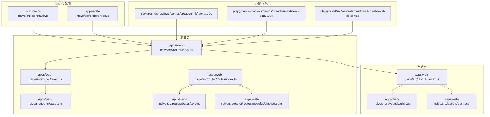
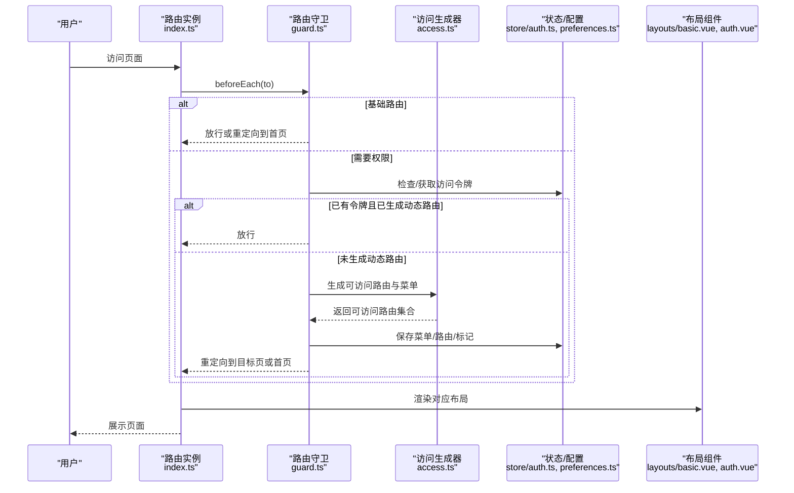
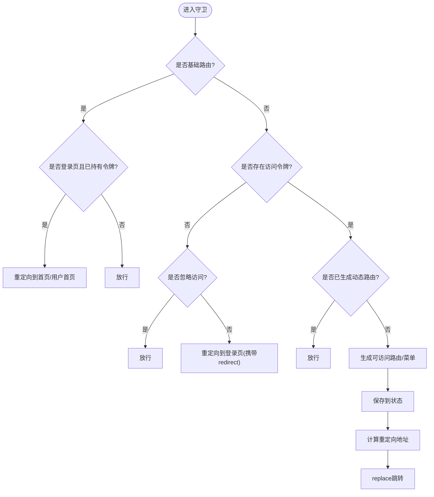
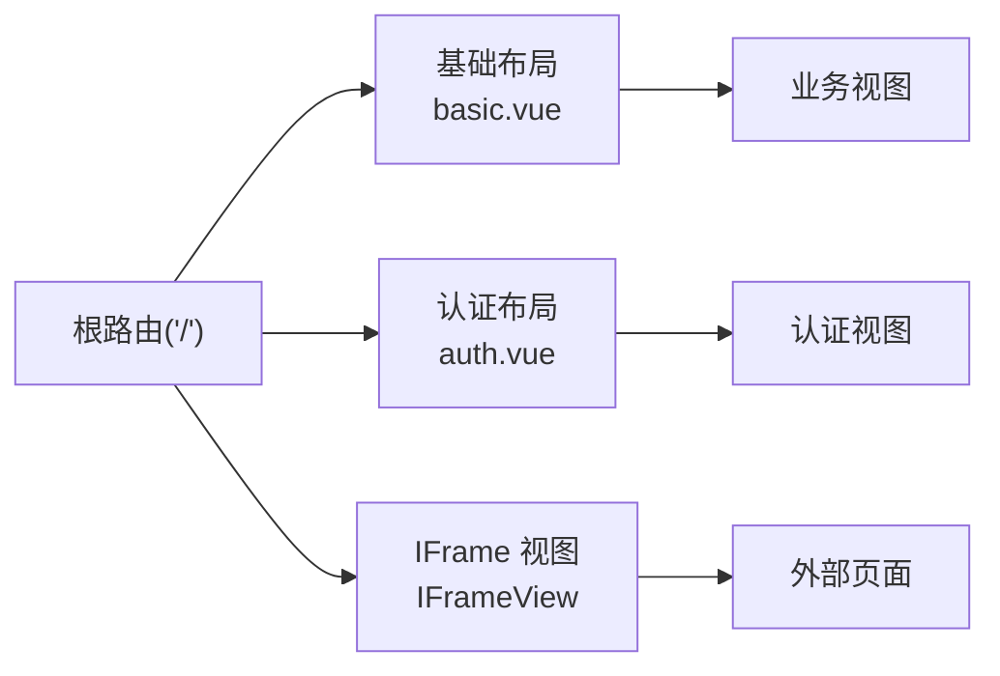
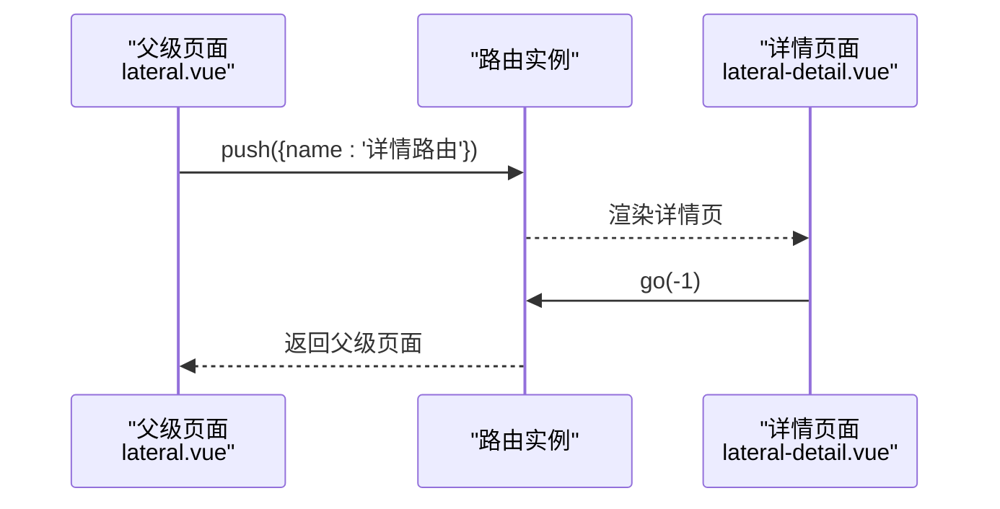
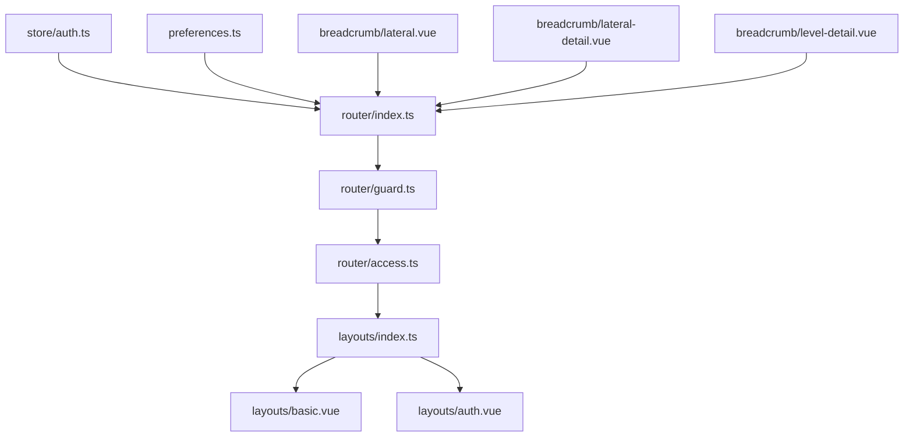

# 导航控制

<cite>
**本文引用的文件**
- [apps/web-naive/src/router/index.ts](file://apps/web-naive/src/router/index.ts)
- [apps/web-naive/src/router/guard.ts](file://apps/web-naive/src/router/guard.ts)
- [apps/web-naive/src/router/access.ts](file://apps/web-naive/src/router/access.ts)
- [apps/web-naive/src/router/routes/index.ts](file://apps/web-naive/src/router/routes/index.ts)
- [apps/web-naive/src/router/routes/core.ts](file://apps/web-naive/src/router/routes/core.ts)
- [apps/web-naive/src/router/routes/modules/dashboard.ts](file://apps/web-naive/src/router/routes/modules/dashboard.ts)
- [apps/web-naive/src/store/auth.ts](file://apps/web-naive/src/store/auth.ts)
- [apps/web-naive/src/layouts/basic.vue](file://apps/web-naive/src/layouts/basic.vue)
- [apps/web-naive/src/layouts/auth.vue](file://apps/web-naive/src/layouts/auth.vue)
- [apps/web-naive/src/layouts/index.ts](file://apps/web-naive/src/layouts/index.ts)
- [apps/web-naive/src/preferences.ts](file://apps/web-naive/src/preferences.ts)
- [playground/src/views/demos/breadcrumb/lateral.vue](file://playground/src/views/demos/breadcrumb/lateral.vue)
- [playground/src/views/demos/breadcrumb/lateral-detail.vue](file://playground/src/views/demos/breadcrumb/lateral-detail.vue)
- [playground/src/views/demos/breadcrumb/level-detail.vue](file://playground/src/views/demos/breadcrumb/level-detail.vue)
</cite>

## 目录

1. [简介](#简介)
2. [项目结构](#项目结构)
3. [核心组件](#核心组件)
4. [架构总览](#架构总览)
5. [详细组件分析](#详细组件分析)
6. [依赖关系分析](#依赖关系分析)
7. [性能考虑](#性能考虑)
8. [故障排查指南](#故障排查指南)
9. [结论](#结论)
10. [附录](#附录)

## 简介

本章节面向 shiyu-ui 的导航控制系统，系统性阐述路由跳转方式（编程式与声明式）、路由参数传递、导航行为配置（滚动行为、历史记录管理、页面缓存策略）、布局切换与导航结构设计模式（基础布局、认证布局、多布局切换）、面包屑导航的实现与自动生成机制，以及导航控制的实用示例（条件跳转、批量操作、导航状态管理）。同时提供导航性能优化、用户体验提升与无障碍访问建议。

## 项目结构

导航控制相关代码主要分布在以下模块：

- 路由定义与初始化：apps/web-naive/src/router
- 路由守卫与权限控制：apps/web-naive/src/router/guard.ts、apps/web-naive/src/router/access.ts
- 路由元信息与布局映射：apps/web-naive/src/router/routes/\*
- 布局组件：apps/web-naive/src/layouts/\*
- 用户态与登录流程：apps/web-naive/src/store/auth.ts
- 项目偏好配置：apps/web-naive/src/preferences.ts
- 面包屑示例：playground/src/views/demos/breadcrumb/\*

图表来源

- [apps/web-naive/src/router/index.ts:1-38](file://apps/web-naive/src/router/index.ts#L1-L38)
- [apps/web-naive/src/router/guard.ts:1-133](file://apps/web-naive/src/router/guard.ts#L1-L133)
- [apps/web-naive/src/router/access.ts:1-41](file://apps/web-naive/src/router/access.ts#L1-L41)
- [apps/web-naive/src/router/routes/index.ts:1-38](file://apps/web-naive/src/router/routes/index.ts#L1-L38)
- [apps/web-naive/src/router/routes/core.ts:1-98](file://apps/web-naive/src/router/routes/core.ts#L1-L98)
- [apps/web-naive/src/router/routes/modules/dashboard.ts:1-39](file://apps/web-naive/src/router/routes/modules/dashboard.ts#L1-L39)
- [apps/web-naive/src/layouts/basic.vue:1-237](file://apps/web-naive/src/layouts/basic.vue#L1-L237)
- [apps/web-naive/src/layouts/auth.vue:1-26](file://apps/web-naive/src/layouts/auth.vue#L1-L26)
- [apps/web-naive/src/layouts/index.ts:1-7](file://apps/web-naive/src/layouts/index.ts#L1-L7)
- [apps/web-naive/src/store/auth.ts:1-119](file://apps/web-naive/src/store/auth.ts#L1-L119)
- [apps/web-naive/src/preferences.ts:1-17](file://apps/web-naive/src/preferences.ts#L1-L17)
- [playground/src/views/demos/breadcrumb/lateral.vue:1-26](file://playground/src/views/demos/breadcrumb/lateral.vue#L1-L26)
- [playground/src/views/demos/breadcrumb/lateral-detail.vue:1-22](file://playground/src/views/demos/breadcrumb/lateral-detail.vue#L1-L22)
- [playground/src/views/demos/breadcrumb/level-detail.vue:1-12](file://playground/src/views/demos/breadcrumb/level-detail.vue#L1-L12)

章节来源

- [apps/web-naive/src/router/index.ts:1-38](file://apps/web-naive/src/router/index.ts#L1-L38)
- [apps/web-naive/src/router/routes/index.ts:1-38](file://apps/web-naive/src/router/routes/index.ts#L1-L38)
- [apps/web-naive/src/layouts/index.ts:1-7](file://apps/web-naive/src/layouts/index.ts#L1-L7)

## 核心组件

- 路由实例与滚动行为：在路由初始化中配置历史模式/哈希模式、滚动行为（保留位置、锚点平滑滚动、回到顶部），并创建路由守卫。
- 路由守卫与权限控制：通用守卫负责页面加载进度条与“已加载页面”标记；访问守卫负责登录态检查、动态路由生成、权限拦截与重定向。
- 动态路由与菜单生成：通过访问生成器从后端拉取菜单，结合布局映射与页面映射生成可访问的路由与菜单树。
- 布局体系：基础布局承载全局导航与用户交互；认证布局用于登录/注册等页面；IFrameView用于内嵌场景。
- 用户态与登录流程：登录成功后根据用户首页路径或默认首页进行编程式跳转；登出时清理状态并回退至登录页，携带当前页面以便登录后重定向。
- 项目偏好：覆盖默认访问模式、刷新令牌开关、登录过期模式等，影响导航与权限行为。

章节来源

- [apps/web-naive/src/router/index.ts:12-30](file://apps/web-naive/src/router/index.ts#L12-L30)
- [apps/web-naive/src/router/guard.ts:17-41](file://apps/web-naive/src/router/guard.ts#L17-L41)
- [apps/web-naive/src/router/guard.ts:47-119](file://apps/web-naive/src/router/guard.ts#L47-L119)
- [apps/web-naive/src/router/access.ts:16-38](file://apps/web-naive/src/router/access.ts#L16-L38)
- [apps/web-naive/src/layouts/basic.vue:78-176](file://apps/web-naive/src/layouts/basic.vue#L78-L176)
- [apps/web-naive/src/store/auth.ts:28-79](file://apps/web-naive/src/store/auth.ts#L28-L79)
- [apps/web-naive/src/preferences.ts:8-16](file://apps/web-naive/src/preferences.ts#L8-L16)

## 架构总览

下图展示导航控制从路由初始化、守卫链路、权限生成到布局渲染的整体流程。

图表来源

- [apps/web-naive/src/router/index.ts:15-30](file://apps/web-naive/src/router/index.ts#L15-L30)
- [apps/web-naive/src/router/guard.ts:47-119](file://apps/web-naive/src/router/guard.ts#L47-L119)
- [apps/web-naive/src/router/access.ts:16-38](file://apps/web-naive/src/router/access.ts#L16-L38)
- [apps/web-naive/src/store/auth.ts:28-79](file://apps/web-naive/src/store/auth.ts#L28-L79)
- [apps/web-naive/src/preferences.ts:8-16](file://apps/web-naive/src/preferences.ts#L8-L16)
- [apps/web-naive/src/layouts/basic.vue:1-237](file://apps/web-naive/src/layouts/basic.vue#L1-L237)
- [apps/web-naive/src/layouts/auth.vue:1-26](file://apps/web-naive/src/layouts/auth.vue#L1-L26)

## 详细组件分析

### 路由初始化与滚动行为

- 历史模式与哈希模式：根据环境变量选择路由历史模式，并支持基础路径配置。
- 滚动行为：优先恢复历史滚动位置；若存在锚点则平滑滚动到目标元素；否则回到顶部。
- 路由守卫：创建通用守卫与访问守卫，分别负责页面加载进度条与权限拦截。
- 路由重置：提供重置静态路由的能力，便于运行时更新路由表。

章节来源

- [apps/web-naive/src/router/index.ts:15-30](file://apps/web-naive/src/router/index.ts#L15-L30)
- [apps/web-naive/src/router/index.ts:32-37](file://apps/web-naive/src/router/index.ts#L32-L37)

### 路由守卫与权限控制

- 通用守卫
  - 标记页面是否已加载，避免重复执行切换动画等副作用。
  - 在首次加载时开启进度条，完成后关闭。
- 访问守卫
  - 基础路由放行；若命中登录页且已有令牌，重定向到用户首页或默认首页。
  - 无令牌且未忽略访问时，重定向到登录页并携带当前页面路径，登录后按重定向地址返回。
  - 未生成动态路由时，拉取用户信息与角色，生成可访问菜单与路由，保存到状态并重定向到目标页或首页。
  - 已生成动态路由则直接放行。

图表来源

- [apps/web-naive/src/router/guard.ts:47-119](file://apps/web-naive/src/router/guard.ts#L47-L119)

章节来源

- [apps/web-naive/src/router/guard.ts:17-41](file://apps/web-naive/src/router/guard.ts#L17-L41)
- [apps/web-naive/src/router/guard.ts:47-119](file://apps/web-naive/src/router/guard.ts#L47-L119)

### 动态路由与菜单生成

- 页面映射与布局映射：通过 import.meta.glob 收集页面组件，结合布局映射（基础布局、IFrame 视图）生成路由。
- 菜单拉取：异步获取菜单列表，期间显示加载提示。
- 权限拒绝处理：可配置被拒绝时的组件（如 403）。
- 返回值：返回可访问菜单与可访问路由，供守卫保存并用于后续导航。

章节来源

- [apps/web-naive/src/router/access.ts:16-38](file://apps/web-naive/src/router/access.ts#L16-L38)

### 布局体系与多布局切换

- 基础布局：作为根布局，承载全局导航、用户下拉、通知、锁屏等；内部再嵌套业务页面。
- 认证布局：用于登录、注册、扫码登录等认证相关页面，提供品牌化展示。
- IFrame 视图：用于内嵌第三方页面，不显示在菜单中。
- 布局导出：统一导出基础布局、认证布局与 IFrame 视图，供路由与访问生成器使用。

图表来源

- [apps/web-naive/src/router/routes/core.ts:24-94](file://apps/web-naive/src/router/routes/core.ts#L24-L94)
- [apps/web-naive/src/layouts/index.ts:1-7](file://apps/web-naive/src/layouts/index.ts#L1-L7)
- [apps/web-naive/src/layouts/basic.vue:1-237](file://apps/web-naive/src/layouts/basic.vue#L1-L237)
- [apps/web-naive/src/layouts/auth.vue:1-26](file://apps/web-naive/src/layouts/auth.vue#L1-L26)

章节来源

- [apps/web-naive/src/router/routes/core.ts:24-94](file://apps/web-naive/src/router/routes/core.ts#L24-L94)
- [apps/web-naive/src/layouts/index.ts:1-7](file://apps/web-naive/src/layouts/index.ts#L1-L7)

### 用户态与登录流程

- 登录：提交表单后获取访问令牌，同时并发拉取用户信息与访问码，保存到状态；若非过期登录则跳转首页或用户首页。
- 登出：调用后端登出接口，重置全部状态，清除登录过期标记；可选携带当前页面路径以便登录后重定向。
- 通知：登录成功后弹出通知，包含用户真实姓名。

章节来源

- [apps/web-naive/src/store/auth.ts:28-79](file://apps/web-naive/src/store/auth.ts#L28-L79)
- [apps/web-naive/src/store/auth.ts:81-99](file://apps/web-naive/src/store/auth.ts#L81-L99)

### 路由元信息与导航结构

- 基础路由：根路由、认证路由组、404兜底路由；认证路由组包含登录、验证码登录、二维码登录、忘记密码、注册等。
- 动态路由：仪表盘模块示例，包含分析页与工作台页，支持固定标签页等元信息。
- 核心路由名称：用于区分基础路由与受控路由，避免对基础路由进行权限拦截。

章节来源

- [apps/web-naive/src/router/routes/core.ts:11-94](file://apps/web-naive/src/router/routes/core.ts#L11-L94)
- [apps/web-naive/src/router/routes/modules/dashboard.ts:1-39](file://apps/web-naive/src/router/routes/modules/dashboard.ts#L1-L39)
- [apps/web-naive/src/router/routes/index.ts:32-37](file://apps/web-naive/src/router/routes/index.ts#L32-L37)

### 面包屑导航实现与自动生成

- 平级模式：通过编程式导航在两个同级页面间跳转，详情页展示后可通过 go(-1) 返回，面包屑随路由栈变化而变化。
- 层级模式：详情页作为子路由展示，面包屑体现层级关系。
- 自动生成机制：面包屑通常基于路由元信息（title、hideInBreadcrumb 等）与路由树结构自动生成，具体实现依赖布局侧的面包屑组件逻辑。

图表来源

- [playground/src/views/demos/breadcrumb/lateral.vue:10-12](file://playground/src/views/demos/breadcrumb/lateral.vue#L10-L12)
- [playground/src/views/demos/breadcrumb/lateral-detail.vue:18-18](file://playground/src/views/demos/breadcrumb/lateral-detail.vue#L18-L18)

章节来源

- [playground/src/views/demos/breadcrumb/lateral.vue:1-26](file://playground/src/views/demos/breadcrumb/lateral.vue#L1-L26)
- [playground/src/views/demos/breadcrumb/lateral-detail.vue:1-22](file://playground/src/views/demos/breadcrumb/lateral-detail.vue#L1-L22)
- [playground/src/views/demos/breadcrumb/level-detail.vue:1-12](file://playground/src/views/demos/breadcrumb/level-detail.vue#L1-L12)

### 路由参数传递与导航行为

- 编程式导航：在布局组件中封装 navigateTo，支持内部路由跳转（含 query、state）与外部链接打开。
- 声明式导航：通过路由元信息（如 affixTab、icon、order 等）控制菜单与标签页行为。
- 滚动行为：路由初始化中配置锚点平滑滚动与回到顶部；支持恢复历史滚动位置。
- 历史记录管理：守卫中维护 loadedPaths，避免重复执行页面切换动画；go(-1) 等方法配合浏览器历史栈。
- 页面缓存策略：通过 affixTab 等元信息控制标签页固定与缓存；具体缓存实现依赖布局侧标签页组件。

章节来源

- [apps/web-naive/src/layouts/basic.vue:160-176](file://apps/web-naive/src/layouts/basic.vue#L160-L176)
- [apps/web-naive/src/router/index.ts:22-27](file://apps/web-naive/src/router/index.ts#L22-L27)
- [apps/web-naive/src/router/routes/modules/dashboard.ts:19-23](file://apps/web-naive/src/router/routes/modules/dashboard.ts#L19-L23)

### 实用示例与最佳实践

- 条件跳转：登录页命中且已持有令牌时，自动重定向到用户首页或默认首页。
- 批量操作：在系统用户列表页中，通过对话框确认后调用后端接口完成删除或重置密码，随后刷新表格。
- 导航状态管理：登录成功后根据用户首页路径或默认首页进行跳转；登出时携带当前页面路径以便登录后重定向。

章节来源

- [apps/web-naive/src/router/guard.ts:54-62](file://apps/web-naive/src/router/guard.ts#L54-L62)
- [apps/web-naive/src/store/auth.ts:59-62](file://apps/web-naive/src/store/auth.ts#L59-L62)
- [apps/web-naive/src/store/auth.ts:91-98](file://apps/web-naive/src/store/auth.ts#L91-L98)
- [apps/web-naive/src/views/system/user/list.vue:45-66](file://apps/web-naive/src/views/system/user/list.vue#L45-L66)
- [apps/web-naive/src/views/system/user/list.vue:72-93](file://apps/web-naive/src/views/system/user/list.vue#L72-L93)

## 依赖关系分析

- 路由初始化依赖：路由实例创建、滚动行为配置、守卫创建。
- 守卫依赖：访问生成器、用户态与访问态、认证常量、项目偏好。
- 访问生成器依赖：页面映射、布局映射、菜单拉取、权限拒绝组件。
- 布局依赖：基础布局与认证布局导出，供路由与访问生成器使用。
- 示例依赖：面包屑演示页面依赖路由实例进行编程式导航。

图表来源

- [apps/web-naive/src/router/index.ts:15-30](file://apps/web-naive/src/router/index.ts#L15-L30)
- [apps/web-naive/src/router/guard.ts:47-119](file://apps/web-naive/src/router/guard.ts#L47-L119)
- [apps/web-naive/src/router/access.ts:16-38](file://apps/web-naive/src/router/access.ts#L16-L38)
- [apps/web-naive/src/layouts/index.ts:1-7](file://apps/web-naive/src/layouts/index.ts#L1-L7)
- [apps/web-naive/src/store/auth.ts:28-79](file://apps/web-naive/src/store/auth.ts#L28-L79)
- [apps/web-naive/src/preferences.ts:8-16](file://apps/web-naive/src/preferences.ts#L8-L16)
- [playground/src/views/demos/breadcrumb/lateral.vue:10-12](file://playground/src/views/demos/breadcrumb/lateral.vue#L10-L12)
- [playground/src/views/demos/breadcrumb/lateral-detail.vue:18-18](file://playground/src/views/demos/breadcrumb/lateral-detail.vue#L18-L18)
- [playground/src/views/demos/breadcrumb/level-detail.vue:1-12](file://playground/src/views/demos/breadcrumb/level-detail.vue#L1-L12)

章节来源

- [apps/web-naive/src/router/index.ts:15-30](file://apps/web-naive/src/router/index.ts#L15-L30)
- [apps/web-naive/src/router/guard.ts:47-119](file://apps/web-naive/src/router/guard.ts#L47-L119)
- [apps/web-naive/src/router/access.ts:16-38](file://apps/web-naive/src/router/access.ts#L16-L38)
- [apps/web-naive/src/layouts/index.ts:1-7](file://apps/web-naive/src/layouts/index.ts#L1-L7)
- [apps/web-naive/src/store/auth.ts:28-79](file://apps/web-naive/src/store/auth.ts#L28-L79)
- [apps/web-naive/src/preferences.ts:8-16](file://apps/web-naive/src/preferences.ts#L8-L16)
- [playground/src/views/demos/breadcrumb/lateral.vue:10-12](file://playground/src/views/demos/breadcrumb/lateral.vue#L10-L12)
- [playground/src/views/demos/breadcrumb/lateral-detail.vue:18-18](file://playground/src/views/demos/breadcrumb/lateral-detail.vue#L18-L18)
- [playground/src/views/demos/breadcrumb/level-detail.vue:1-12](file://playground/src/views/demos/breadcrumb/level-detail.vue#L1-L12)

## 性能考虑

- 路由懒加载：通过 import.meta.glob 收集页面组件，天然支持按需加载，减少首屏体积。
- 动态路由生成：仅在首次登录或切换用户时生成，避免重复计算；利用 loadedPaths 标记避免重复执行页面切换动画。
- 滚动行为优化：锚点平滑滚动与历史位置恢复，减少页面抖动；避免不必要的滚动重排。
- 进度条控制：仅在首次加载时开启进度条，降低 UI 抖动与资源消耗。
- 标签页缓存：通过 affixTab 等元信息控制标签页固定与缓存，减少重复渲染。

## 故障排查指南

- 登录后未跳转：检查登录成功后的跳转逻辑与用户首页路径；确认守卫中重定向逻辑是否正确。
- 权限不足或 403：确认访问生成器返回的可访问路由集合是否包含目标路由；检查 forbidden 组件配置。
- 锚点滚动异常：检查路由初始化中的滚动行为配置与目标锚点是否存在。
- 布局错位：确认根路由与基础布局配置；检查布局导出与路由映射是否一致。
- 面包屑不更新：确认路由元信息（title、hideInBreadcrumb）与路由树结构是否正确。

章节来源

- [apps/web-naive/src/router/guard.ts:54-62](file://apps/web-naive/src/router/guard.ts#L54-L62)
- [apps/web-naive/src/router/access.ts:32-37](file://apps/web-naive/src/router/access.ts#L32-L37)
- [apps/web-naive/src/router/index.ts:22-27](file://apps/web-naive/src/router/index.ts#L22-L27)
- [apps/web-naive/src/layouts/index.ts:1-7](file://apps/web-naive/src/layouts/index.ts#L1-L7)

## 结论

shiyu-ui 的导航控制系统以 Vue Router 为核心，结合守卫链路、动态路由与菜单生成、布局体系与用户态管理，实现了灵活的权限控制与良好的用户体验。通过合理的滚动行为、历史记录管理与页面缓存策略，系统在功能完整性与性能之间取得平衡。面包屑导航依托路由元信息与路由树结构实现自动生成，配合编程式导航可满足复杂的页面跳转需求。

## 附录

- 无障碍访问建议
  - 为导航元素提供语义化标签与键盘可达性。
  - 为外部链接与新窗口打开的链接提供明确提示。
  - 为进度条与加载状态提供可读性反馈。
- 用户体验提升
  - 合理使用 affixTab 控制标签页固定，减少频繁切换成本。
  - 为重要操作提供确认对话框与加载反馈。
  - 保持面包屑与页面标题的一致性，增强上下文感知。
