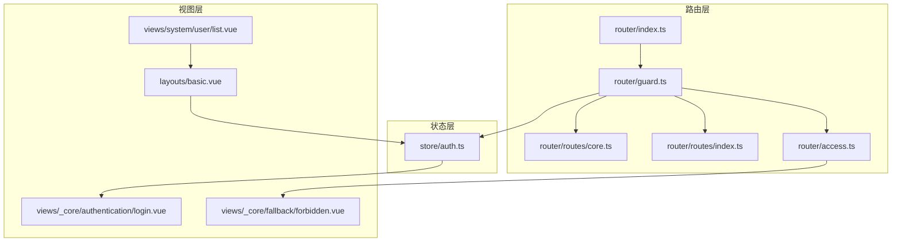
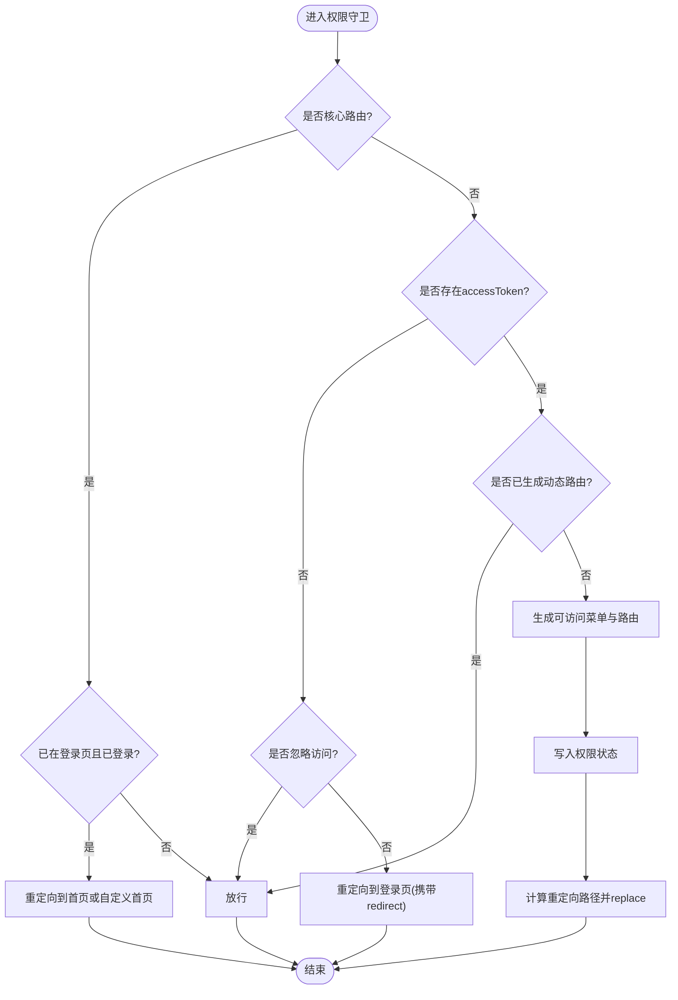
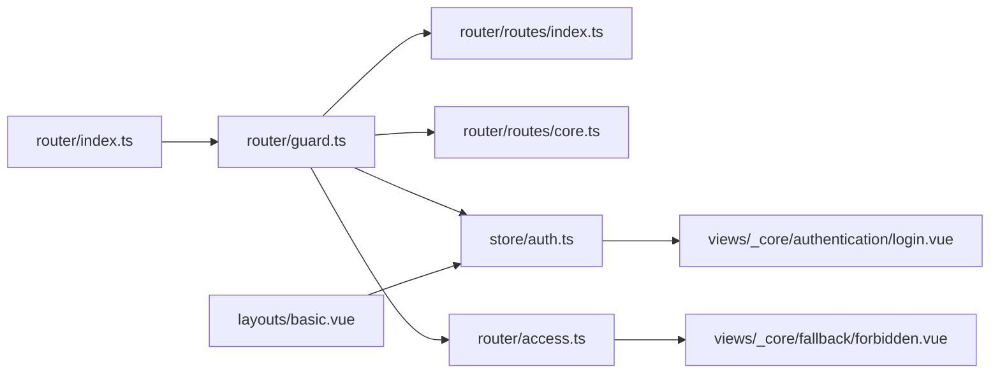

# 路由守卫

<cite>
**本文引用的文件**
- [apps/web-naive/src/router/guard.ts](file://apps/web-naive/src/router/guard.ts)
- [apps/web-naive/src/router/access.ts](file://apps/web-naive/src/router/access.ts)
- [apps/web-naive/src/router/index.ts](file://apps/web-naive/src/router/index.ts)
- [apps/web-naive/src/router/routes/index.ts](file://apps/web-naive/src/router/routes/index.ts)
- [apps/web-naive/src/router/routes/core.ts](file://apps/web-naive/src/router/routes/core.ts)
- [apps/web-naive/src/store/auth.ts](file://apps/web-naive/src/store/auth.ts)
- [apps/web-naive/src/views/_core/authentication/login.vue](file://apps/web-naive/src/views/_core/authentication/login.vue)
- [apps/web-naive/src/views/_core/fallback/forbidden.vue](file://apps/web-naive/src/views/_core/fallback/forbidden.vue)
- [apps/web-naive/src/layouts/basic.vue](file://apps/web-naive/src/layouts/basic.vue)
- [apps/web-naive/src/views/system/user/list.vue](file://apps/web-naive/src/views/system/user/list.vue)
</cite>

## 目录

1. [简介](#简介)
2. [项目结构](#项目结构)
3. [核心组件](#核心组件)
4. [架构总览](#架构总览)
5. [详细组件分析](#详细组件分析)
6. [依赖关系分析](#依赖关系分析)
7. [性能考量](#性能考量)
8. [故障排查指南](#故障排查指南)
9. [结论](#结论)
10. [附录](#附录)

## 简介

本文件系统性梳理 shiyu-ui 的路由守卫体系，覆盖全局前置与后置守卫、权限访问守卫、路由独享守卫与组件内守卫的实现与调用时机；详解登录状态检查、权限验证与页面访问控制；说明导航取消、重定向与错误处理机制；给出配置示例与常见场景；并提供导航日志记录、性能监控与调试技巧，以及在单页应用中的最佳实践。

## 项目结构

围绕路由守卫的关键目录与文件如下：

- 路由与守卫：apps/web-naive/src/router
  - guard.ts：全局守卫与权限守卫装配
  - access.ts：权限路由生成与菜单拉取
  - index.ts：路由实例创建与守卫初始化
  - routes/index.ts、routes/core.ts：基础路由与动态/静态路由聚合
- 鉴权与用户态：apps/web-naive/src/store/auth.ts
- 登录页与兜底页：apps/web-naive/src/views/\_core/authentication/login.vue、forbidden.vue
- 布局与交互：apps/web-naive/src/layouts/basic.vue
- 示例页面：apps/web-naive/src/views/system/user/list.vue

图表来源

- [apps/web-naive/src/router/index.ts:1-38](file://apps/web-naive/src/router/index.ts#L1-L38)
- [apps/web-naive/src/router/guard.ts:1-133](file://apps/web-naive/src/router/guard.ts#L1-L133)
- [apps/web-naive/src/router/access.ts:1-41](file://apps/web-naive/src/router/access.ts#L1-L41)
- [apps/web-naive/src/router/routes/index.ts:1-38](file://apps/web-naive/src/router/routes/index.ts#L1-L38)
- [apps/web-naive/src/router/routes/core.ts:1-98](file://apps/web-naive/src/router/routes/core.ts#L1-L98)
- [apps/web-naive/src/store/auth.ts:1-119](file://apps/web-naive/src/store/auth.ts#L1-L119)
- [apps/web-naive/src/views/\_core/authentication/login.vue:1-99](file://apps/web-naive/src/views/_core/authentication/login.vue#L1-L99)
- [apps/web-naive/src/views/\_core/fallback/forbidden.vue:1-10](file://apps/web-naive/src/views/_core/fallback/forbidden.vue#L1-L10)
- [apps/web-naive/src/layouts/basic.vue:1-237](file://apps/web-naive/src/layouts/basic.vue#L1-L237)
- [apps/web-naive/src/views/system/user/list.vue:1-170](file://apps/web-naive/src/views/system/user/list.vue#L1-L170)

章节来源

- [apps/web-naive/src/router/index.ts:1-38](file://apps/web-naive/src/router/index.ts#L1-L38)
- [apps/web-naive/src/router/guard.ts:1-133](file://apps/web-naive/src/router/guard.ts#L1-L133)
- [apps/web-naive/src/router/access.ts:1-41](file://apps/web-naive/src/router/access.ts#L1-L41)
- [apps/web-naive/src/router/routes/index.ts:1-38](file://apps/web-naive/src/router/routes/index.ts#L1-L38)
- [apps/web-naive/src/router/routes/core.ts:1-98](file://apps/web-naive/src/router/routes/core.ts#L1-L98)

## 核心组件

- 全局前置守卫（导航进度与加载标记）
  - 在每次导航前触发，负责记录页面是否已加载、按需开启页面加载进度条
  - 通过 to.meta.loaded 标记避免重复执行页面切换动画等副作用
- 全局后置守卫（关闭进度条与加载标记）
  - 在每次导航完成后触发，关闭进度条、标记页面已加载
- 权限访问守卫（登录态与路由生成）
  - 核心路由白名单放行；未登录且非忽略访问时重定向至登录页并携带 redirect
  - 已登录但未生成动态路由时，拉取用户信息与菜单，生成可访问路由与菜单，再重定向回目标页
- 权限路由生成器（菜单与路由）
  - 从后端拉取菜单列表，结合页面与布局映射，生成可访问菜单与路由
  - 支持无权限时渲染 403 组件

章节来源

- [apps/web-naive/src/router/guard.ts:17-41](file://apps/web-naive/src/router/guard.ts#L17-L41)
- [apps/web-naive/src/router/guard.ts:47-119](file://apps/web-naive/src/router/guard.ts#L47-L119)
- [apps/web-naive/src/router/access.ts:16-38](file://apps/web-naive/src/router/access.ts#L16-L38)

## 架构总览

下图展示从路由初始化到导航完成的完整流程，包括权限拦截、动态路由生成与重定向。

```mermaid
sequenceDiagram
participant U as "用户"
participant R as "Vue Router"
participant G as "全局守卫<br/>guard.ts"
participant A as "权限守卫<br/>guard.ts"
participant X as "权限生成器<br/>access.ts"
participant S as "鉴权状态<br/>store/auth.ts"
U->>R : 导航到某路径
R->>G : beforeEach(to)
G->>G : 设置to.meta.loaded/启动进度条
G-->>R : true
R->>A : beforeEach(to, from)
A->>S : 读取accessToken/用户信息
alt 未登录且非忽略访问
A-->>R : 重定向到登录页(携带redirect)
else 已登录
A->>X : 生成可访问菜单与路由
X-->>A : 返回accessibleMenus/accessibleRoutes
A->>S : 写入权限状态
A-->>R : 重定向到目标页(或首页)
end
R->>G : afterEach(to)
G->>G : 标记已加载/关闭进度条
```

图表来源

- [apps/web-naive/src/router/guard.ts:21-40](file://apps/web-naive/src/router/guard.ts#L21-L40)
- [apps/web-naive/src/router/guard.ts:48-118](file://apps/web-naive/src/router/guard.ts#L48-L118)
- [apps/web-naive/src/router/access.ts:16-38](file://apps/web-naive/src/router/access.ts#L16-L38)
- [apps/web-naive/src/store/auth.ts:16-119](file://apps/web-naive/src/store/auth.ts#L16-L119)

## 详细组件分析

### 全局前置与后置守卫

- 前置守卫
  - 作用：记录页面加载状态、按需启动进度条
  - 关键点：仅对首次加载的页面启动进度条，避免重复执行
- 后置守卫
  - 作用：关闭进度条、标记页面已加载
  - 关键点：确保无论导航成功与否都会关闭进度条

章节来源

- [apps/web-naive/src/router/guard.ts:17-41](file://apps/web-naive/src/router/guard.ts#L17-L41)

### 权限访问守卫

- 白名单放行
  - 核心路由名称集合直接放行；若已在登录页且已持有令牌，自动跳转到首页或 redirect
- 登录态检查
  - 无令牌且非忽略访问：重定向到登录页，携带 redirect 参数
  - 已登录：进入动态路由生成流程
- 动态路由生成
  - 拉取用户信息与角色，生成可访问菜单与路由
  - 写入权限状态，计算重定向路径（优先 from.query.redirect 或目标页，否则首页）
  - 以 replace 方式重定向，避免历史栈污染

图表来源

- [apps/web-naive/src/router/guard.ts:48-118](file://apps/web-naive/src/router/guard.ts#L48-L118)

章节来源

- [apps/web-naive/src/router/guard.ts:48-119](file://apps/web-naive/src/router/guard.ts#L48-L119)

### 权限路由生成器

- 菜单拉取与加载提示
  - 异步拉取菜单列表，显示加载提示
- 页面与布局映射
  - pageMap 通过 glob 收集页面组件
  - layoutMap 提供布局组件映射
- 403 渲染
  - 无权限时可渲染 403 组件，支持菜单可见但不可访问的场景

章节来源

- [apps/web-naive/src/router/access.ts:16-38](file://apps/web-naive/src/router/access.ts#L16-L38)

### 登录流程与重定向

- 登录成功
  - 写入 accessToken 与用户信息、权限码
  - 成功回调或跳转到用户首页或默认首页
- 登出
  - 清理状态，调用后端登出接口
  - 重定向到登录页并携带当前路由地址

章节来源

- [apps/web-naive/src/store/auth.ts:28-79](file://apps/web-naive/src/store/auth.ts#L28-L79)
- [apps/web-naive/src/store/auth.ts:81-99](file://apps/web-naive/src/store/auth.ts#L81-L99)
- [apps/web-naive/src/views/\_core/authentication/login.vue:1-99](file://apps/web-naive/src/views/_core/authentication/login.vue#L1-L99)

### 路由配置与基础路由

- 基础路由
  - 根路由与认证路由组，包含登录、扫码登录、忘记密码、注册等
  - 404 兜底路由
- 路由聚合
  - 动态路由模块合并，核心路由与 404 组合为最终路由表
  - 核心路由名称集合用于权限白名单

章节来源

- [apps/web-naive/src/router/routes/core.ts:11-95](file://apps/web-naive/src/router/routes/core.ts#L11-L95)
- [apps/web-naive/src/router/routes/index.ts:15-37](file://apps/web-naive/src/router/routes/index.ts#L15-L37)

### 路由独享守卫与组件内守卫

- 路由独享守卫
  - 在具体路由记录的 meta 中配置，如 ignoreAccess 等元信息，影响权限守卫逻辑
  - 本项目通过核心路由白名单与 ignoreAccess 元信息实现“独享守卫”效果
- 组件内守卫
  - 本项目未在组件内显式定义 beforeRouteEnter/Update/Leave
  - 若需在组件内进行细粒度控制，可在组件生命周期钩子中读取路由元信息与用户状态进行判断

章节来源

- [apps/web-naive/src/router/guard.ts:54-86](file://apps/web-naive/src/router/guard.ts#L54-L86)
- [apps/web-naive/src/router/guard.ts:68-70](file://apps/web-naive/src/router/guard.ts#L68-L70)
- [apps/web-naive/src/router/routes/index.ts:32-33](file://apps/web-naive/src/router/routes/index.ts#L32-L33)

### 页面访问控制与 403 处理

- 无权限访问
  - 通过权限生成器返回的 forbiddenComponent 渲染 403 页面
  - 支持菜单可见但不可访问的场景
- 菜单与路由同步
  - 生成的 accessibleMenus 与 accessibleRoutes 与实际路由保持一致，确保菜单与访问一致

章节来源

- [apps/web-naive/src/router/access.ts:14-37](file://apps/web-naive/src/router/access.ts#L14-L37)
- [apps/web-naive/src/views/\_core/fallback/forbidden.vue:1-10](file://apps/web-naive/src/views/_core/fallback/forbidden.vue#L1-L10)

### 导航取消、重定向与错误处理

- 导航取消
  - 前置守卫返回 true/false 控制是否继续导航
  - 权限守卫在未登录时返回重定向对象，相当于“取消原导航并发起新导航”
- 重定向
  - 登录页重定向：携带 redirect 参数，登录后回到原页面
  - 动态路由生成后重定向：根据 from.query.redirect 或目标页计算重定向路径
- 错误处理
  - 权限生成器在拉取菜单时显示加载提示，异常时可结合全局错误处理策略
  - 登出接口调用失败不阻断登出流程，保证用户体验

章节来源

- [apps/web-naive/src/router/guard.ts:73-85](file://apps/web-naive/src/router/guard.ts#L73-L85)
- [apps/web-naive/src/router/guard.ts:109-117](file://apps/web-naive/src/router/guard.ts#L109-L117)
- [apps/web-naive/src/store/auth.ts:81-99](file://apps/web-naive/src/store/auth.ts#L81-L99)

### 配置示例与常见场景

- 忽略权限访问
  - 在路由 meta 中设置 ignoreAccess 为 true，绕过权限拦截
- 登录后自动跳转
  - 登录成功后根据用户首页或默认首页进行跳转
- 403 页面
  - 无权限时渲染 403 组件，保持菜单一致性

章节来源

- [apps/web-naive/src/router/guard.ts:68-70](file://apps/web-naive/src/router/guard.ts#L68-L70)
- [apps/web-naive/src/store/auth.ts:59-62](file://apps/web-naive/src/store/auth.ts#L59-L62)
- [apps/web-naive/src/router/access.ts:14-37](file://apps/web-naive/src/router/access.ts#L14-L37)

### 导航日志记录、性能监控与调试

- 导航日志
  - 在 beforeEach/afterEach 中记录 to/from、时间戳与页面加载状态，便于定位重复加载问题
- 性能监控
  - 结合进度条与页面首次加载标记，避免重复执行动画与副作用
- 调试技巧
  - 打开浏览器开发者工具，观察路由守卫执行顺序与参数
  - 在权限守卫中打印核心路由名称集合与 ignoreAccess 标记，确认拦截逻辑
  - 登录页重定向参数 redirect 可用于验证登录后跳转链路

章节来源

- [apps/web-naive/src/router/guard.ts:21-29](file://apps/web-naive/src/router/guard.ts#L21-L29)
- [apps/web-naive/src/router/guard.ts:31-40](file://apps/web-naive/src/router/guard.ts#L31-L40)
- [apps/web-naive/src/router/guard.ts:54-86](file://apps/web-naive/src/router/guard.ts#L54-L86)

## 依赖关系分析

- 路由初始化
  - router/index.ts 创建路由实例并调用 createRouterGuard 完成守卫装配
- 权限守卫依赖
  - 读取核心路由名称集合 coreRouteNames 与 ignoreAccess 元信息
  - 依赖鉴权状态 store/auth.ts 的 accessToken 与用户信息
  - 依赖权限生成器 access.ts 生成可访问菜单与路由
- 视图层依赖
  - 登录页与 403 页面分别由登录与权限生成器驱动
  - 布局层 basic.vue 与鉴权状态联动，处理登出与水印等

图表来源

- [apps/web-naive/src/router/index.ts:15-35](file://apps/web-naive/src/router/index.ts#L15-L35)
- [apps/web-naive/src/router/guard.ts:1-133](file://apps/web-naive/src/router/guard.ts#L1-L133)
- [apps/web-naive/src/router/routes/index.ts:1-38](file://apps/web-naive/src/router/routes/index.ts#L1-L38)
- [apps/web-naive/src/router/routes/core.ts:1-98](file://apps/web-naive/src/router/routes/core.ts#L1-L98)
- [apps/web-naive/src/store/auth.ts:1-119](file://apps/web-naive/src/store/auth.ts#L1-L119)
- [apps/web-naive/src/router/access.ts:1-41](file://apps/web-naive/src/router/access.ts#L1-L41)
- [apps/web-naive/src/views/\_core/authentication/login.vue:1-99](file://apps/web-naive/src/views/_core/authentication/login.vue#L1-L99)
- [apps/web-naive/src/views/\_core/fallback/forbidden.vue:1-10](file://apps/web-naive/src/views/_core/fallback/forbidden.vue#L1-L10)
- [apps/web-naive/src/layouts/basic.vue:1-237](file://apps/web-naive/src/layouts/basic.vue#L1-L237)

章节来源

- [apps/web-naive/src/router/index.ts:15-35](file://apps/web-naive/src/router/index.ts#L15-L35)
- [apps/web-naive/src/router/guard.ts:1-133](file://apps/web-naive/src/router/guard.ts#L1-L133)
- [apps/web-naive/src/router/access.ts:1-41](file://apps/web-naive/src/router/access.ts#L1-L41)

## 性能考量

- 避免重复加载
  - 通过 loadedPaths 与 to.meta.loaded 标记，仅对首次加载页面启动进度条与执行副作用
- 减少不必要的重定向
  - 已登录且已生成动态路由时直接放行，减少一次重定向
- 异步加载优化
  - 权限生成器异步拉取菜单，期间显示加载提示，提升感知性能

章节来源

- [apps/web-naive/src/router/guard.ts:18-29](file://apps/web-naive/src/router/guard.ts#L18-L29)
- [apps/web-naive/src/router/guard.ts:89-91](file://apps/web-naive/src/router/guard.ts#L89-L91)
- [apps/web-naive/src/router/access.ts:26-30](file://apps/web-naive/src/router/access.ts#L26-L30)

## 故障排查指南

- 登录后未跳转回原页面
  - 检查登录页重定向逻辑与 redirect 参数传递
  - 确认权限守卫中重定向路径计算逻辑
- 403 页面未出现
  - 检查权限生成器返回的 forbiddenComponent 是否正确配置
  - 确认菜单与路由生成是否包含目标路由
- 重复加载动画或进度条不关闭
  - 检查 loadedPaths 与 to.meta.loaded 标记更新逻辑
  - 确认 afterEach 是否执行关闭进度条

章节来源

- [apps/web-naive/src/router/guard.ts:73-85](file://apps/web-naive/src/router/guard.ts#L73-L85)
- [apps/web-naive/src/router/guard.ts:109-117](file://apps/web-naive/src/router/guard.ts#L109-L117)
- [apps/web-naive/src/router/access.ts:14-37](file://apps/web-naive/src/router/access.ts#L14-L37)
- [apps/web-naive/src/router/guard.ts:31-40](file://apps/web-naive/src/router/guard.ts#L31-L40)

## 结论

本项目通过全局前置/后置守卫与权限访问守卫协同，实现了完善的登录态检查、动态路由生成与页面访问控制。配合权限生成器与基础路由配置，既保证了安全，又兼顾了用户体验与性能。建议在组件内结合路由元信息与用户状态进行细粒度控制，并在开发与生产环境中完善日志与监控，持续优化导航体验。

## 附录

- 最佳实践
  - 将核心路由纳入白名单，避免权限拦截
  - 对需要忽略权限的路由明确标注 ignoreAccess
  - 在登录页与权限页面提供清晰的反馈与引导
  - 使用 loadedPaths 与进度条避免重复执行与视觉抖动
- 常见场景
  - 登录后自动跳转：利用 redirect 参数与权限守卫重定向逻辑
  - 403 场景：启用 forbiddenComponent 并保持菜单一致性
  - 动态路由生成：在首次登录后生成并缓存，避免重复请求
