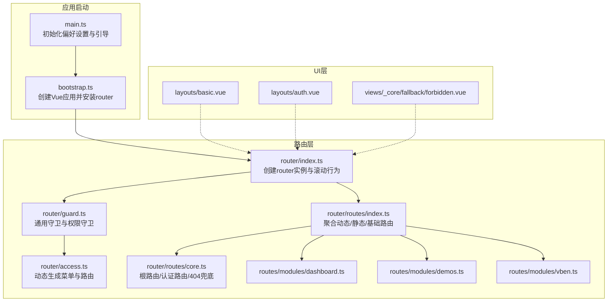
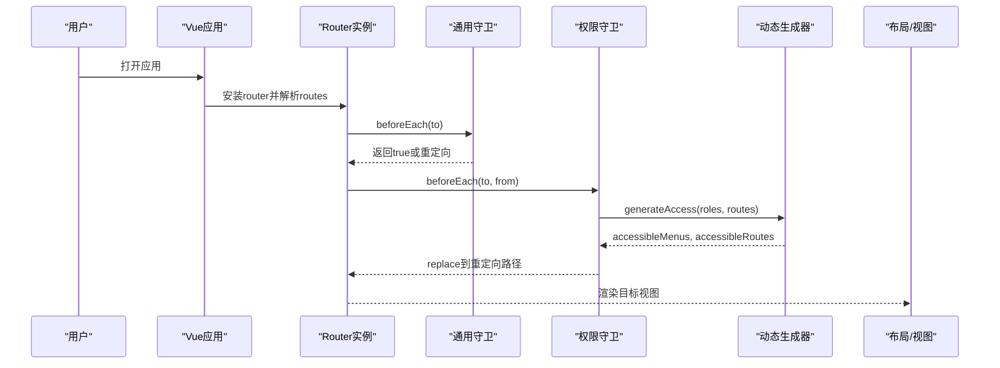
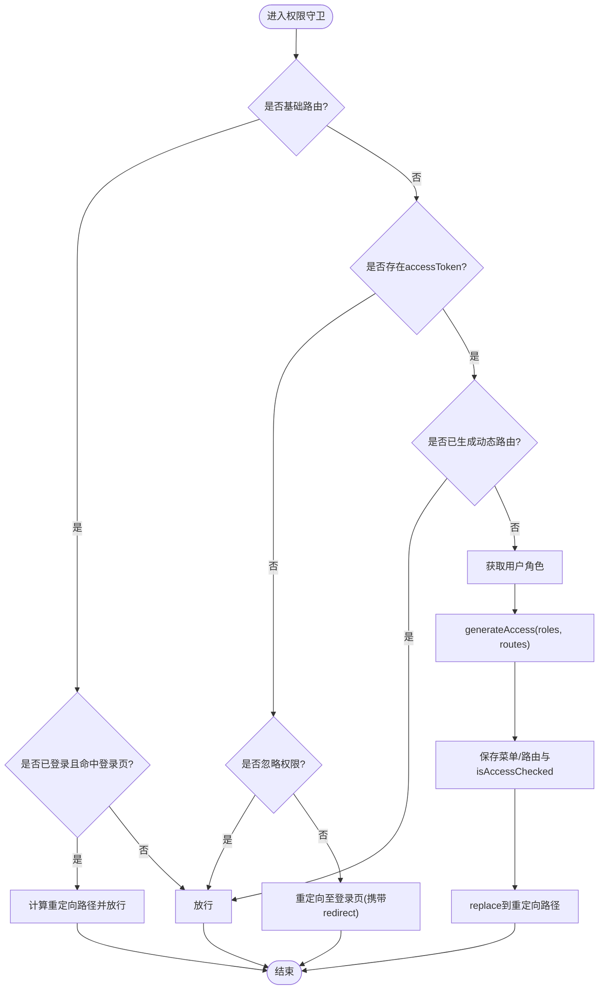
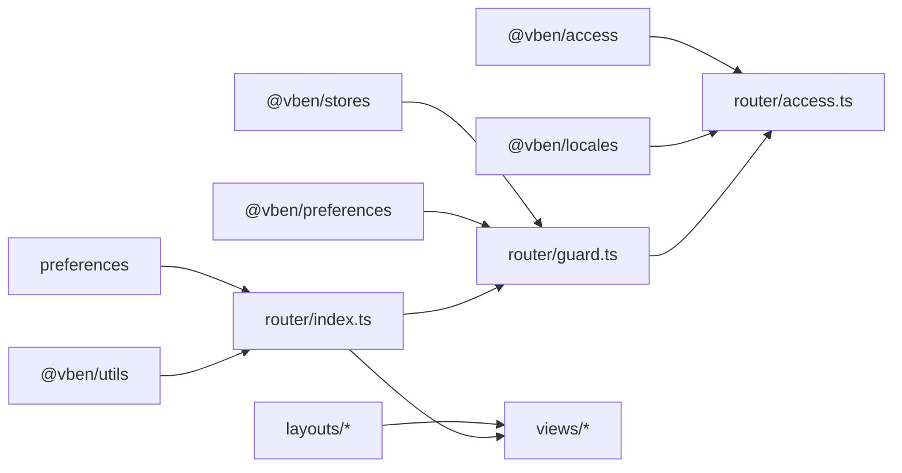

# 路由系统

<cite>
**本文引用的文件**
- [apps/web-naive/src/router/index.ts](file://apps/web-naive/src/router/index.ts)
- [apps/web-naive/src/router/guard.ts](file://apps/web-naive/src/router/guard.ts)
- [apps/web-naive/src/router/access.ts](file://apps/web-naive/src/router/access.ts)
- [apps/web-naive/src/router/routes/index.ts](file://apps/web-naive/src/router/routes/index.ts)
- [apps/web-naive/src/router/routes/core.ts](file://apps/web-naive/src/router/routes/core.ts)
- [apps/web-naive/src/router/routes/modules/dashboard.ts](file://apps/web-naive/src/router/routes/modules/dashboard.ts)
- [apps/web-naive/src/router/routes/modules/demos.ts](file://apps/web-naive/src/router/routes/modules/demos.ts)
- [apps/web-naive/src/router/routes/modules/vben.ts](file://apps/web-naive/src/router/routes/modules/vben.ts)
- [apps/web-naive/src/bootstrap.ts](file://apps/web-naive/src/bootstrap.ts)
- [apps/web-naive/src/main.ts](file://apps/web-naive/src/main.ts)
- [apps/web-naive/src/layouts/basic.vue](file://apps/web-naive/src/layouts/basic.vue)
- [apps/web-naive/src/layouts/auth.vue](file://apps/web-naive/src/layouts/auth.vue)
- [apps/web-naive/src/views/_core/fallback/forbidden.vue](file://apps/web-naive/src/views/_core/fallback/forbidden.vue)
- [apps/web-naive/package.json](file://apps/web-naive/package.json)
- [internal/vite-config/src/utils/env.ts](file://internal/vite-config/src/utils/env.ts)
- [packages/@core/base/typings/vue-router.d.ts](file://packages/@core/base/typings/vue-router.d.ts)
</cite>

## 目录

1. [简介](#简介)
2. [项目结构](#项目结构)
3. [核心组件](#核心组件)
4. [架构总览](#架构总览)
5. [详细组件分析](#详细组件分析)
6. [依赖关系分析](#依赖关系分析)
7. [性能考量](#性能考量)
8. [故障排查指南](#故障排查指南)
9. [结论](#结论)
10. [附录](#附录)

## 简介

本文件面向 shiyu-ui 项目的路由系统，系统基于 Vue Router 进行构建，采用“静态基础路由 + 动态权限路由”的组合模式，结合路由守卫实现登录态与权限控制，支持嵌套路由与懒加载，提供路由元信息驱动的菜单与标签页展示能力。本文将从架构、配置、动态路由生成、路由守卫、导航控制、性能优化与调试等方面进行全面说明，帮助开发者理解并扩展路由系统。

## 项目结构

路由系统位于应用层目录 apps/web-naive 下，核心文件组织如下：

- 路由入口与实例：apps/web-naive/src/router/index.ts
- 路由守卫：apps/web-naive/src/router/guard.ts
- 动态权限生成：apps/web-naive/src/router/access.ts
- 路由聚合与模块化：apps/web-naive/src/router/routes/\*
- 布局与视图：apps/web-naive/src/layouts/_ 与 apps/web-naive/src/views/_
- 应用启动装配：apps/web-naive/src/bootstrap.ts 与 apps/web-naive/src/main.ts

图表来源

- [apps/web-naive/src/main.ts:1-32](file://apps/web-naive/src/main.ts#L1-L32)
- [apps/web-naive/src/bootstrap.ts:19-77](file://apps/web-naive/src/bootstrap.ts#L19-L77)
- [apps/web-naive/src/router/index.ts:15-37](file://apps/web-naive/src/router/index.ts#L15-L37)
- [apps/web-naive/src/router/guard.ts:125-133](file://apps/web-naive/src/router/guard.ts#L125-L133)
- [apps/web-naive/src/router/access.ts:16-41](file://apps/web-naive/src/router/access.ts#L16-L41)
- [apps/web-naive/src/router/routes/index.ts:1-38](file://apps/web-naive/src/router/routes/index.ts#L1-L38)
- [apps/web-naive/src/router/routes/core.ts:1-98](file://apps/web-naive/src/router/routes/core.ts#L1-L98)
- [apps/web-naive/src/router/routes/modules/dashboard.ts:1-39](file://apps/web-naive/src/router/routes/modules/dashboard.ts#L1-L39)
- [apps/web-naive/src/router/routes/modules/demos.ts:1-45](file://apps/web-naive/src/router/routes/modules/demos.ts#L1-L45)
- [apps/web-naive/src/router/routes/modules/vben.ts:1-121](file://apps/web-naive/src/router/routes/modules/vben.ts#L1-L121)
- [apps/web-naive/src/layouts/basic.vue:1-237](file://apps/web-naive/src/layouts/basic.vue#L1-L237)
- [apps/web-naive/src/layouts/auth.vue:1-26](file://apps/web-naive/src/layouts/auth.vue#L1-L26)
- [apps/web-naive/src/views/\_core/fallback/forbidden.vue:1-10](file://apps/web-naive/src/views/_core/fallback/forbidden.vue#L1-L10)

章节来源

- [apps/web-naive/src/router/index.ts:15-37](file://apps/web-naive/src/router/index.ts#L15-L37)
- [apps/web-naive/src/router/routes/index.ts:1-38](file://apps/web-naive/src/router/routes/index.ts#L1-L38)
- [apps/web-naive/src/router/routes/core.ts:1-98](file://apps/web-naive/src/router/routes/core.ts#L1-L98)

## 核心组件

- 路由实例与历史模式
  - 基于 createRouter 创建实例，支持 hash 与 history 两种模式，历史模式可配置 base。
  - 提供滚动行为与重置静态路由的能力。
- 路由聚合与模块化
  - 通过 import.meta.glob 聚合 modules 下的动态路由模块，合并为 accessRoutes。
  - coreRoutes 与 fallbackNotfound 组成基础路由集合 routes。
- 动态权限生成
  - 依据用户角色动态生成可访问菜单与路由，支持 403 降级组件与布局映射。
- 路由守卫
  - 通用守卫：记录已加载页面、进度条控制。
  - 权限守卫：登录态检查、忽略权限路由、首次生成动态路由、重定向回原地址。

章节来源

- [apps/web-naive/src/router/index.ts:15-37](file://apps/web-naive/src/router/index.ts#L15-L37)
- [apps/web-naive/src/router/routes/index.ts:1-38](file://apps/web-naive/src/router/routes/index.ts#L1-L38)
- [apps/web-naive/src/router/access.ts:16-41](file://apps/web-naive/src/router/access.ts#L16-L41)
- [apps/web-naive/src/router/guard.ts:17-119](file://apps/web-naive/src/router/guard.ts#L17-L119)

## 架构总览

路由系统围绕“静态基础路由 + 动态权限路由”展开，配合路由守卫实现登录态与权限控制，同时利用路由元信息驱动菜单、标签页与面包屑等 UI 展示。

图表来源

- [apps/web-naive/src/bootstrap.ts:56-57](file://apps/web-naive/src/bootstrap.ts#L56-L57)
- [apps/web-naive/src/router/index.ts:35](file://apps/web-naive/src/router/index.ts#L35)
- [apps/web-naive/src/router/guard.ts:17-119](file://apps/web-naive/src/router/guard.ts#L17-L119)
- [apps/web-naive/src/router/access.ts:16-41](file://apps/web-naive/src/router/access.ts#L16-L41)

## 详细组件分析

### 路由定义与历史模式

- 历史模式选择
  - 通过环境变量决定使用 hash 或 history，并支持配置 base。
- 滚动行为
  - 支持恢复滚动位置与锚点平滑滚动。
- 重置静态路由
  - 提供 resetStaticRoutes 工具函数，便于运行时重置基础路由。

章节来源

- [apps/web-naive/src/router/index.ts:15-37](file://apps/web-naive/src/router/index.ts#L15-L37)
- [apps/web-naive/src/router/index.ts:32](file://apps/web-naive/src/router/index.ts#L32)

### 路由聚合与模块化

- 动态路由模块
  - 通过 import.meta.glob 聚合 modules 下的路由模块，形成 accessRoutes。
- 基础路由与兜底
  - coreRoutes 包含根路由、认证路由与默认重定向；fallbackNotfound 作为 404 兜底。
- 路由命名与权限
  - coreRouteNames 由 coreRoutes 中的 name 构建，用于绕过权限拦截。

章节来源

- [apps/web-naive/src/router/routes/index.ts:1-38](file://apps/web-naive/src/router/routes/index.ts#L1-L38)
- [apps/web-naive/src/router/routes/core.ts:1-98](file://apps/web-naive/src/router/routes/core.ts#L1-L98)

### 嵌套路由与懒加载

- 嵌套路由
  - 根路由使用基础布局作为父容器，子路由无需重复配置父布局。
  - 认证路由下包含多级子路由，统一由认证布局包裹。
- 懒加载
  - 所有视图组件均采用动态 import 实现按需加载，提升首屏性能。

章节来源

- [apps/web-naive/src/router/routes/core.ts:30-94](file://apps/web-naive/src/router/routes/core.ts#L30-L94)
- [apps/web-naive/src/router/routes/modules/dashboard.ts:1-39](file://apps/web-naive/src/router/routes/modules/dashboard.ts#L1-L39)
- [apps/web-naive/src/router/routes/modules/demos.ts:1-45](file://apps/web-naive/src/router/routes/modules/demos.ts#L1-L45)
- [apps/web-naive/src/router/routes/modules/vben.ts:1-121](file://apps/web-naive/src/router/routes/modules/vben.ts#L1-L121)

### 动态路由生成机制

- 触发时机
  - 首次访问受控路由且未生成动态路由时触发。
- 数据源与策略
  - 通过 generateAccessible 与访问模式 preferences.app.accessMode，异步拉取菜单列表，生成可访问路由与菜单。
- 降级与布局
  - 无权限时可返回 403 页面；支持 layoutMap 映射布局组件。
- 结果落库
  - 将可访问菜单与路由写入权限状态，标记 isAccessChecked，避免重复生成。

图表来源

- [apps/web-naive/src/router/guard.ts:48-118](file://apps/web-naive/src/router/guard.ts#L48-L118)
- [apps/web-naive/src/router/access.ts:16-41](file://apps/web-naive/src/router/access.ts#L16-L41)

章节来源

- [apps/web-naive/src/router/guard.ts:48-118](file://apps/web-naive/src/router/guard.ts#L48-L118)
- [apps/web-naive/src/router/access.ts:16-41](file://apps/web-naive/src/router/access.ts#L16-L41)

### 路由元信息与菜单/标签页联动

- 元信息字段
  - 通过扩展 RouteMeta 定义丰富的元信息，如菜单可见性、徽标、标签页固定、权限控制等。
- 菜单与标签页
  - 路由元信息驱动菜单树生成与标签页展示，隐藏策略由 hideInMenu、hideInTab 等控制。
- 动态标题
  - 应用启动时监听当前路由 meta.title，动态拼接页面标题。

章节来源

- [packages/@core/base/typings/vue-router.d.ts:1-8](file://packages/@core/base/typings/vue-router.d.ts#L1-L8)
- [apps/web-naive/src/bootstrap.ts:64-71](file://apps/web-naive/src/bootstrap.ts#L64-L71)

### 路由守卫工作原理

- 通用守卫
  - 记录已加载页面路径，控制进度条启停，避免重复执行页面切换动画。
- 权限守卫
  - 基础路由白名单、登录态校验、忽略权限路由、首次生成动态路由与重定向。
- 组件内守卫
  - 通过路由元信息与权限状态在组件内进行细粒度控制（例如按钮级权限）。

章节来源

- [apps/web-naive/src/router/guard.ts:17-119](file://apps/web-naive/src/router/guard.ts#L17-L119)

### 导航控制与跳转最佳实践

- 登录后回跳
  - 权限守卫在登录成功后根据 redirect 或用户主页路径进行 replace 跳转。
- 外链与内链
  - 布局中对 http(s) 协议外链直接打开，内部路由支持 query 与 state 传递。
- 403 降级
  - 无权限访问但允许显示菜单时，可跳转至 403 页面。

章节来源

- [apps/web-naive/src/router/guard.ts:72-86](file://apps/web-naive/src/router/guard.ts#L72-L86)
- [apps/web-naive/src/layouts/basic.vue:160-176](file://apps/web-naive/src/layouts/basic.vue#L160-L176)
- [apps/web-naive/src/views/\_core/fallback/forbidden.vue:1-10](file://apps/web-naive/src/views/_core/fallback/forbidden.vue#L1-L10)

### 路由配置示例与参考路径

- 基础路由与认证路由
  - 参考：[apps/web-naive/src/router/routes/core.ts:1-98](file://apps/web-naive/src/router/routes/core.ts#L1-L98)
- 动态模块路由（仪表盘/演示/示例）
  - 参考：[apps/web-naive/src/router/routes/modules/dashboard.ts:1-39](file://apps/web-naive/src/router/routes/modules/dashboard.ts#L1-L39)、[apps/web-naive/src/router/routes/modules/demos.ts:1-45](file://apps/web-naive/src/router/routes/modules/demos.ts#L1-L45)、[apps/web-naive/src/router/routes/modules/vben.ts:1-121](file://apps/web-naive/src/router/routes/modules/vben.ts#L1-L121)
- 路由聚合与命名
  - 参考：[apps/web-naive/src/router/routes/index.ts:1-38](file://apps/web-naive/src/router/routes/index.ts#L1-L38)
- 路由实例与历史模式
  - 参考：[apps/web-naive/src/router/index.ts:15-37](file://apps/web-naive/src/router/index.ts#L15-L37)
- 路由守卫
  - 参考：[apps/web-naive/src/router/guard.ts:17-119](file://apps/web-naive/src/router/guard.ts#L17-L119)
- 动态生成
  - 参考：[apps/web-naive/src/router/access.ts:16-41](file://apps/web-naive/src/router/access.ts#L16-L41)
- 应用装配与标题联动
  - 参考：[apps/web-naive/src/bootstrap.ts:56-71](file://apps/web-naive/src/bootstrap.ts#L56-L71)、[apps/web-naive/src/main.ts:1-32](file://apps/web-naive/src/main.ts#L1-L32)

## 依赖关系分析

- 路由实例依赖
  - 依赖 @vben/utils 的 resetStaticRoutes 与 @vben/preferences 的偏好设置。
- 守卫依赖
  - 依赖 @vben/stores 的权限与用户状态、@vben/preferences 的过渡配置。
- 动态生成依赖
  - 依赖 @vben/access 的 generateAccessible、本地页面与布局映射、国际化与消息提示。
- 启动装配
  - 应用启动时先初始化偏好设置与国际化，再安装 router 并挂载应用。

图表来源

- [apps/web-naive/src/router/index.ts:1-10](file://apps/web-naive/src/router/index.ts#L1-L10)
- [apps/web-naive/src/router/guard.ts:1-11](file://apps/web-naive/src/router/guard.ts#L1-L11)
- [apps/web-naive/src/router/access.ts:1-12](file://apps/web-naive/src/router/access.ts#L1-L12)
- [apps/web-naive/src/bootstrap.ts:1-17](file://apps/web-naive/src/bootstrap.ts#L1-L17)

章节来源

- [apps/web-naive/src/router/index.ts:1-10](file://apps/web-naive/src/router/index.ts#L1-L10)
- [apps/web-naive/src/router/guard.ts:1-11](file://apps/web-naive/src/router/guard.ts#L1-L11)
- [apps/web-naive/src/router/access.ts:1-12](file://apps/web-naive/src/router/access.ts#L1-L12)
- [apps/web-naive/src/bootstrap.ts:1-17](file://apps/web-naive/src/bootstrap.ts#L1-L17)

## 性能考量

- 懒加载与分包
  - 所有视图组件采用动态 import，结合打包器自动分包，减少首屏体积。
- 进度条与滚动行为
  - 通用守卫控制进度条启停，滚动行为仅在锚点或首次进入时触发，降低不必要的 DOM 操作。
- 静态路由重置
  - resetStaticRoutes 用于运行时重置基础路由，避免重复注册导致的内存与渲染压力。
- 动态路由去重
  - 通过 loadedPaths 与 isAccessChecked 控制重复生成与重复执行，提升导航效率。

章节来源

- [apps/web-naive/src/router/index.ts:22-27](file://apps/web-naive/src/router/index.ts#L22-L27)
- [apps/web-naive/src/router/guard.ts:17-41](file://apps/web-naive/src/router/guard.ts#L17-L41)
- [apps/web-naive/src/router/guard.ts:88-118](file://apps/web-naive/src/router/guard.ts#L88-L118)

## 故障排查指南

- 登录后无法回跳
  - 检查权限守卫中 redirect 参数与默认主页路径配置，确认 replace 跳转逻辑。
- 404 页面不显示
  - 确认 fallbackNotfound 路由已加入 routes，且未被其他路由覆盖。
- 无权限但菜单可见
  - 检查 forbiddenComponent 与 meta.menuVisibleWithForbidden 配置，确认是否需要降级到 403。
- 外链无法打开
  - 确认导航方法对 http(s) 协议的处理分支，避免错误走内部路由。
- 标题未更新
  - 检查动态标题监听逻辑与 meta.title 的翻译键值。

章节来源

- [apps/web-naive/src/router/guard.ts:72-118](file://apps/web-naive/src/router/guard.ts#L72-L118)
- [apps/web-naive/src/router/routes/core.ts:11-21](file://apps/web-naive/src/router/routes/core.ts#L11-L21)
- [apps/web-naive/src/router/access.ts:14-37](file://apps/web-naive/src/router/access.ts#L14-L37)
- [apps/web-naive/src/layouts/basic.vue:160-176](file://apps/web-naive/src/layouts/basic.vue#L160-L176)
- [apps/web-naive/src/bootstrap.ts:64-71](file://apps/web-naive/src/bootstrap.ts#L64-L71)

## 结论

本路由系统通过“静态基础路由 + 动态权限路由”的组合，配合路由守卫与元信息，实现了灵活的权限控制与良好的用户体验。模块化的路由组织与懒加载策略提升了性能，而进度条与滚动行为优化则改善了交互体验。开发者可在现有基础上扩展新的动态模块、完善权限元信息与导航策略，以满足更复杂的业务需求。

## 附录

- 环境变量与历史模式
  - 通过 VITE_ROUTER_HISTORY 与 VITE_BASE 控制路由历史模式与基础路径。
- 应用装配顺序
  - 偏好设置 → 国际化 → 状态管理 → 路由安装 → 插件与挂载。

章节来源

- [internal/vite-config/src/utils/env.ts:66-108](file://internal/vite-config/src/utils/env.ts#L66-L108)
- [apps/web-naive/src/main.ts:9-29](file://apps/web-naive/src/main.ts#L9-L29)
- [apps/web-naive/src/bootstrap.ts:19-77](file://apps/web-naive/src/bootstrap.ts#L19-L77)
