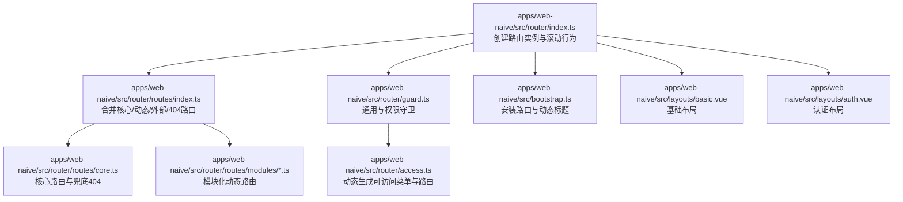
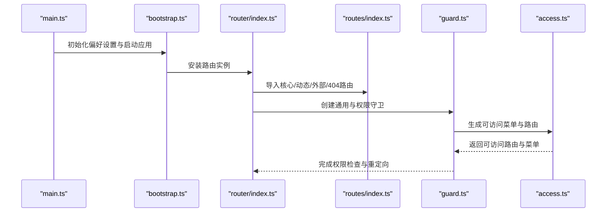
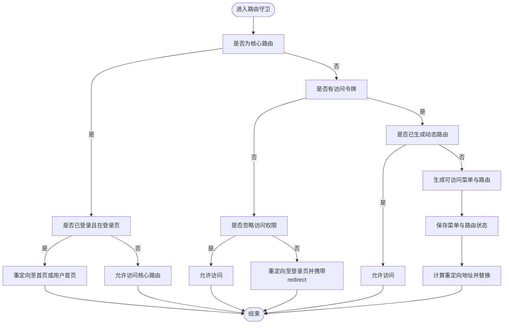
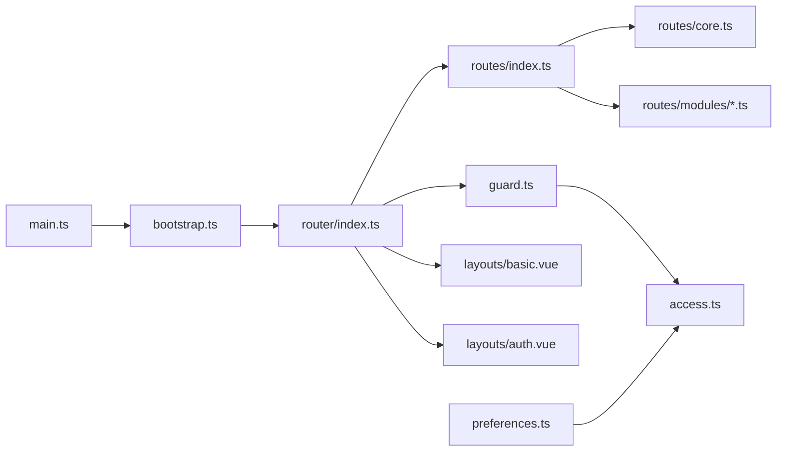

# 路由配置

<cite>
**本文引用的文件**
- [apps/web-naive/src/router/index.ts](file://apps/web-naive/src/router/index.ts)
- [apps/web-naive/src/router/routes/index.ts](file://apps/web-naive/src/router/routes/index.ts)
- [apps/web-naive/src/router/routes/core.ts](file://apps/web-naive/src/router/routes/core.ts)
- [apps/web-naive/src/router/routes/modules/dashboard.ts](file://apps/web-naive/src/router/routes/modules/dashboard.ts)
- [apps/web-naive/src/router/routes/modules/demos.ts](file://apps/web-naive/src/router/routes/modules/demos.ts)
- [apps/web-naive/src/router/guard.ts](file://apps/web-naive/src/router/guard.ts)
- [apps/web-naive/src/router/access.ts](file://apps/web-naive/src/router/access.ts)
- [apps/web-naive/src/bootstrap.ts](file://apps/web-naive/src/bootstrap.ts)
- [apps/web-naive/src/main.ts](file://apps/web-naive/src/main.ts)
- [apps/web-naive/src/preferences.ts](file://apps/web-naive/src/preferences.ts)
- [apps/web-naive/src/layouts/basic.vue](file://apps/web-naive/src/layouts/basic.vue)
- [apps/web-naive/src/layouts/auth.vue](file://apps/web-naive/src/layouts/auth.vue)
- [apps/web-naive/src/views/dashboard/analytics/index.vue](file://apps/web-naive/src/views/dashboard/analytics/index.vue)
</cite>

## 目录

1. [简介](#简介)
2. [项目结构](#项目结构)
3. [核心组件](#核心组件)
4. [架构总览](#架构总览)
5. [详细组件分析](#详细组件分析)
6. [依赖分析](#依赖分析)
7. [性能考虑](#性能考虑)
8. [故障排查指南](#故障排查指南)
9. [结论](#结论)
10. [附录](#附录)

## 简介

本文件面向 shiyu-ui 项目的前端路由配置，系统性阐述路由的结构与组织方式，包括静态路由与动态路由的差异与适用场景；路由元信息（权限标识、菜单显示、图标、面包屑、标签页等）的配置要点；路由懒加载与性能优化策略；路由嵌套与模块化组织的最佳实践；并提供基础路由、模块路由与业务路由的完整配置示例路径与说明，涵盖命名规范、参数传递与查询字符串处理。

## 项目结构

shiyu-ui 的路由体系位于 web 应用的 router 目录下，采用“核心路由 + 模块化动态路由”的组织方式：

- 核心路由：包含根路由、认证相关路由与兜底 404，无需权限拦截。
- 模块化动态路由：通过 import.meta.glob 收集 modules 下的路由文件，按模块拆分，便于扩展与维护。
- 路由守卫：统一管理通用守卫与权限访问守卫，控制页面加载进度、登录态与动态路由生成。
- 布局与视图：基础布局与认证布局配合路由元信息共同决定菜单、面包屑与页面展示。

图表来源

- [apps/web-naive/src/router/index.ts:1-38](file://apps/web-naive/src/router/index.ts#L1-L38)
- [apps/web-naive/src/router/routes/index.ts:1-38](file://apps/web-naive/src/router/routes/index.ts#L1-L38)
- [apps/web-naive/src/router/routes/core.ts:1-98](file://apps/web-naive/src/router/routes/core.ts#L1-L98)
- [apps/web-naive/src/router/guard.ts:1-133](file://apps/web-naive/src/router/guard.ts#L1-L133)
- [apps/web-naive/src/router/access.ts:1-41](file://apps/web-naive/src/router/access.ts#L1-L41)
- [apps/web-naive/src/bootstrap.ts:1-77](file://apps/web-naive/src/bootstrap.ts#L1-L77)
- [apps/web-naive/src/layouts/basic.vue:1-237](file://apps/web-naive/src/layouts/basic.vue#L1-L237)
- [apps/web-naive/src/layouts/auth.vue:1-26](file://apps/web-naive/src/layouts/auth.vue#L1-L26)

章节来源

- [apps/web-naive/src/router/index.ts:1-38](file://apps/web-naive/src/router/index.ts#L1-L38)
- [apps/web-naive/src/router/routes/index.ts:1-38](file://apps/web-naive/src/router/routes/index.ts#L1-L38)
- [apps/web-naive/src/router/routes/core.ts:1-98](file://apps/web-naive/src/router/routes/core.ts#L1-L98)
- [apps/web-naive/src/router/guard.ts:1-133](file://apps/web-naive/src/router/guard.ts#L1-L133)
- [apps/web-naive/src/router/access.ts:1-41](file://apps/web-naive/src/router/access.ts#L1-L41)
- [apps/web-naive/src/bootstrap.ts:1-77](file://apps/web-naive/src/bootstrap.ts#L1-L77)

## 核心组件

- 路由实例创建与历史模式选择
  - 基于环境变量选择 hash 或 history 模式，支持基础路径配置与滚动行为。
  - 提供 resetRoutes 工具函数用于重置静态路由。
- 路由集合构建
  - 核心路由：根路由、认证路由、兜底 404。
  - 动态路由：通过 import.meta.glob 加载 modules 下的路由模块，合并为可访问路由。
  - 外部/静态路由预留：便于接入第三方页面或无需布局的页面。
- 路由守卫
  - 通用守卫：记录页面加载状态、控制进度条。
  - 权限守卫：判断核心路由、登录态、动态路由生成与重定向。
- 动态路由生成
  - 基于权限模式与菜单接口生成可访问菜单与路由，支持 403 组件与布局映射。

章节来源

- [apps/web-naive/src/router/index.ts:1-38](file://apps/web-naive/src/router/index.ts#L1-L38)
- [apps/web-naive/src/router/routes/index.ts:1-38](file://apps/web-naive/src/router/routes/index.ts#L1-L38)
- [apps/web-naive/src/router/routes/core.ts:1-98](file://apps/web-naive/src/router/routes/core.ts#L1-L98)
- [apps/web-naive/src/router/guard.ts:1-133](file://apps/web-naive/src/router/guard.ts#L1-L133)
- [apps/web-naive/src/router/access.ts:1-41](file://apps/web-naive/src/router/access.ts#L1-L41)

## 架构总览

路由从初始化到运行的关键流程如下：

图表来源

- [apps/web-naive/src/main.ts:1-32](file://apps/web-naive/src/main.ts#L1-L32)
- [apps/web-naive/src/bootstrap.ts:1-77](file://apps/web-naive/src/bootstrap.ts#L1-L77)
- [apps/web-naive/src/router/index.ts:1-38](file://apps/web-naive/src/router/index.ts#L1-L38)
- [apps/web-naive/src/router/routes/index.ts:1-38](file://apps/web-naive/src/router/routes/index.ts#L1-L38)
- [apps/web-naive/src/router/guard.ts:1-133](file://apps/web-naive/src/router/guard.ts#L1-L133)
- [apps/web-naive/src/router/access.ts:1-41](file://apps/web-naive/src/router/access.ts#L1-L41)

## 详细组件分析

### 路由实例与历史模式

- 历史模式选择：根据环境变量决定 hash 或 history，支持基础路径。
- 滚动行为：支持恢复位置与锚点平滑滚动。
- 重置静态路由：提供 resetStaticRoutes 工具函数，结合核心路由进行重置。

章节来源

- [apps/web-naive/src/router/index.ts:1-38](file://apps/web-naive/src/router/index.ts#L1-L38)

### 路由集合与模块化组织

- 核心路由：根路由与认证路由组，确保登录态与默认首页可用。
- 动态路由：通过 import.meta.glob 按模块收集，支持后续权限过滤与菜单生成。
- 外部/静态路由：预留外部页面与无布局页面的接入点。
- 路由合并：核心路由 + 外部路由 + 兜底 404 形成最终路由表。

章节来源

- [apps/web-naive/src/router/routes/index.ts:1-38](file://apps/web-naive/src/router/routes/index.ts#L1-L38)
- [apps/web-naive/src/router/routes/core.ts:1-98](file://apps/web-naive/src/router/routes/core.ts#L1-L98)

### 路由元信息与菜单/面包屑/标签页

- 元信息字段与语义
  - 权限标识：通过路由元信息控制访问权限（如 ignoreAccess）。
  - 菜单显示：hideInMenu 控制菜单隐藏；order 控制排序；icon 控制图标。
  - 面包屑：hideInBreadcrumb 控制面包屑隐藏。
  - 标签页：hideInTab 控制标签页隐藏；affixTab 控制固定标签页。
  - 缓存：keepAlive 控制页面缓存。
  - 标题：meta.title 用于国际化标题与动态标题更新。
- 实现依据
  - 元信息在模块路由中广泛使用，例如仪表盘与演示模块。
  - 动态生成菜单时读取元信息以决定菜单可见性与排序。

章节来源

- [apps/web-naive/src/router/routes/modules/dashboard.ts:1-39](file://apps/web-naive/src/router/routes/modules/dashboard.ts#L1-L39)
- [apps/web-naive/src/router/routes/modules/demos.ts:1-45](file://apps/web-naive/src/router/routes/modules/demos.ts#L1-L45)

### 路由懒加载与性能优化

- 懒加载机制
  - 视图组件通过动态 import 进行懒加载，减少首屏体积。
  - 动态路由模块通过 import.meta.glob 按需加载，避免一次性引入全部模块。
- 性能优化策略
  - keepAlive：对需要缓存的页面启用 keep-alive，减少重复渲染。
  - 进度条：通用守卫中按需开启页面加载进度条，提升用户体验。
  - 动态标题：根据 meta.title 动态设置页面标题，增强可访问性。
  - 布局按需：基础布局与认证布局仅在需要时加载。

章节来源

- [apps/web-naive/src/router/routes/core.ts:1-98](file://apps/web-naive/src/router/routes/core.ts#L1-L98)
- [apps/web-naive/src/router/routes/modules/dashboard.ts:1-39](file://apps/web-naive/src/router/routes/modules/dashboard.ts#L1-L39)
- [apps/web-naive/src/router/guard.ts:1-133](file://apps/web-naive/src/router/guard.ts#L1-L133)
- [apps/web-naive/src/bootstrap.ts:1-77](file://apps/web-naive/src/bootstrap.ts#L1-L77)

### 路由嵌套与模块化组织最佳实践

- 嵌套设计
  - 根路由使用基础布局作为父级容器，子路由无需重复配置布局。
  - 认证路由组独立于根布局，使用认证布局。
- 模块化组织
  - 将功能相近的路由归档至 modules 子目录，便于扩展与维护。
  - 每个模块导出 RouteRecordRaw 数组，统一被 routes/index.ts 合并。
- 命名规范
  - 路由 name 唯一且语义化，建议采用层级命名风格（如 Dashboard、Analytics）。
  - path 使用短横线分隔的小写形式，保持一致性。

章节来源

- [apps/web-naive/src/router/routes/core.ts:1-98](file://apps/web-naive/src/router/routes/core.ts#L1-L98)
- [apps/web-naive/src/router/routes/modules/dashboard.ts:1-39](file://apps/web-naive/src/router/routes/modules/dashboard.ts#L1-L39)
- [apps/web-naive/src/router/routes/modules/demos.ts:1-45](file://apps/web-naive/src/router/routes/modules/demos.ts#L1-L45)

### 路由守卫与权限控制

- 通用守卫
  - 记录页面加载状态，控制进度条显示。
- 权限守卫
  - 核心路由放行；未登录且非忽略访问则重定向至登录页并携带 redirect。
  - 登录后若未生成动态路由，则调用 generateAccess 生成菜单与路由，并重定向至目标页。
- 动态路由生成
  - 基于权限模式与菜单接口生成可访问路由，支持 403 组件与布局映射。

图表来源

- [apps/web-naive/src/router/guard.ts:1-133](file://apps/web-naive/src/router/guard.ts#L1-L133)
- [apps/web-naive/src/router/access.ts:1-41](file://apps/web-naive/src/router/access.ts#L1-L41)

章节来源

- [apps/web-naive/src/router/guard.ts:1-133](file://apps/web-naive/src/router/guard.ts#L1-L133)
- [apps/web-naive/src/router/access.ts:1-41](file://apps/web-naive/src/router/access.ts#L1-L41)

### 动态生成菜单与路由

- 生成流程
  - 读取页面组件与布局映射。
  - 异步获取菜单列表，显示加载提示。
  - 基于权限模式生成可访问菜单与路由。
  - 指定 403 组件与布局映射，支持“带权限但隐藏”场景。
- 结果应用
  - 权限守卫保存可访问菜单与路由状态，完成一次性的动态路由注入。

章节来源

- [apps/web-naive/src/router/access.ts:1-41](file://apps/web-naive/src/router/access.ts#L1-L41)

### 布局与视图配合

- 基础布局：承载主内容区、用户下拉、通知、锁屏等。
- 认证布局：用于登录、注册等认证页面，支持品牌与标题文案。
- 视图组件：通过懒加载按需加载，减少首屏压力。

章节来源

- [apps/web-naive/src/layouts/basic.vue:1-237](file://apps/web-naive/src/layouts/basic.vue#L1-L237)
- [apps/web-naive/src/layouts/auth.vue:1-26](file://apps/web-naive/src/layouts/auth.vue#L1-L26)
- [apps/web-naive/src/views/dashboard/analytics/index.vue:1-91](file://apps/web-naive/src/views/dashboard/analytics/index.vue#L1-L91)

### 路由配置示例与规范

- 基础路由
  - 根路由与认证路由组：参见核心路由文件。
  - 示例路径：[apps/web-naive/src/router/routes/core.ts:1-98](file://apps/web-naive/src/router/routes/core.ts#L1-L98)
- 模块路由
  - 仪表盘与演示模块：参见模块路由文件。
  - 示例路径：
    - [apps/web-naive/src/router/routes/modules/dashboard.ts:1-39](file://apps/web-naive/src/router/routes/modules/dashboard.ts#L1-L39)
    - [apps/web-naive/src/router/routes/modules/demos.ts:1-45](file://apps/web-naive/src/router/routes/modules/demos.ts#L1-L45)
- 业务路由
  - 业务路由遵循模块化组织，每个业务模块一个文件，导出 RouteRecordRaw[]。
  - 元信息字段参考：权限、菜单、图标、面包屑、标签页、缓存与标题。
- 命名规范
  - name 唯一且语义化；path 使用短横线分隔的小写形式。
- 参数传递与查询字符串
  - 登录重定向携带 redirect 查询参数；导航时支持 query 与 state。
  - 动态标题基于 meta.title 与国际化资源拼接。

章节来源

- [apps/web-naive/src/router/routes/core.ts:1-98](file://apps/web-naive/src/router/routes/core.ts#L1-L98)
- [apps/web-naive/src/router/routes/modules/dashboard.ts:1-39](file://apps/web-naive/src/router/routes/modules/dashboard.ts#L1-L39)
- [apps/web-naive/src/router/routes/modules/demos.ts:1-45](file://apps/web-naive/src/router/routes/modules/demos.ts#L1-L45)
- [apps/web-naive/src/router/guard.ts:1-133](file://apps/web-naive/src/router/guard.ts#L1-L133)
- [apps/web-naive/src/bootstrap.ts:1-77](file://apps/web-naive/src/bootstrap.ts#L1-L77)

## 依赖分析

- 路由实例依赖
  - routes/index.ts 提供最终路由表。
  - guard.ts 提供守卫链路。
  - access.ts 提供动态生成能力。
- 布局与视图依赖
  - basic.vue 与 auth.vue 分别作为基础布局与认证布局。
  - 视图组件通过懒加载按需引入，降低初始包体。
- 偏好设置与权限模式
  - preferences.ts 覆盖应用偏好，包括访问模式与登录过期模式。

图表来源

- [apps/web-naive/src/router/index.ts:1-38](file://apps/web-naive/src/router/index.ts#L1-L38)
- [apps/web-naive/src/router/routes/index.ts:1-38](file://apps/web-naive/src/router/routes/index.ts#L1-L38)
- [apps/web-naive/src/router/routes/core.ts:1-98](file://apps/web-naive/src/router/routes/core.ts#L1-L98)
- [apps/web-naive/src/router/guard.ts:1-133](file://apps/web-naive/src/router/guard.ts#L1-L133)
- [apps/web-naive/src/router/access.ts:1-41](file://apps/web-naive/src/router/access.ts#L1-L41)
- [apps/web-naive/src/layouts/basic.vue:1-237](file://apps/web-naive/src/layouts/basic.vue#L1-L237)
- [apps/web-naive/src/layouts/auth.vue:1-26](file://apps/web-naive/src/layouts/auth.vue#L1-L26)
- [apps/web-naive/src/main.ts:1-32](file://apps/web-naive/src/main.ts#L1-L32)
- [apps/web-naive/src/bootstrap.ts:1-77](file://apps/web-naive/src/bootstrap.ts#L1-L77)
- [apps/web-naive/src/preferences.ts:1-17](file://apps/web-naive/src/preferences.ts#L1-L17)

章节来源

- [apps/web-naive/src/router/index.ts:1-38](file://apps/web-naive/src/router/index.ts#L1-L38)
- [apps/web-naive/src/router/routes/index.ts:1-38](file://apps/web-naive/src/router/routes/index.ts#L1-L38)
- [apps/web-naive/src/router/guard.ts:1-133](file://apps/web-naive/src/router/guard.ts#L1-L133)
- [apps/web-naive/src/router/access.ts:1-41](file://apps/web-naive/src/router/access.ts#L1-L41)
- [apps/web-naive/src/preferences.ts:1-17](file://apps/web-naive/src/preferences.ts#L1-L17)

## 性能考虑

- 懒加载与按需加载：视图组件与模块路由均采用动态 import，显著降低首屏体积。
- keepAlive：对高频访问页面启用缓存，减少重复渲染与请求。
- 进度条：在首次访问或重复访问时按需开启，避免不必要的 UI 干扰。
- 动态标题：仅在需要时更新标题，减少不必要的 DOM 操作。
- 布局分离：基础布局与认证布局按需加载，避免冗余资源。

## 故障排查指南

- 登录后无法跳转回原页面
  - 检查登录守卫是否正确携带 redirect 查询参数。
  - 确认权限守卫在生成动态路由后是否正确解析重定向地址。
- 403 页面未显示或显示异常
  - 确认 forbiddenComponent 是否正确指向 403 视图。
  - 检查权限模式与菜单接口返回的权限标识。
- 菜单不显示或顺序错误
  - 检查 meta.hideInMenu 与 meta.order 字段。
  - 确认动态生成菜单时是否正确读取元信息。
- 首屏加载缓慢
  - 检查是否启用了 keepAlive 与懒加载。
  - 确认未将大体积组件置于首屏必需加载的路径上。

章节来源

- [apps/web-naive/src/router/guard.ts:1-133](file://apps/web-naive/src/router/guard.ts#L1-L133)
- [apps/web-naive/src/router/access.ts:1-41](file://apps/web-naive/src/router/access.ts#L1-L41)

## 结论

shiyu-ui 的路由体系通过“核心路由 + 模块化动态路由 + 路由守卫 + 动态生成”的组合，实现了清晰的结构、灵活的权限控制与良好的性能表现。遵循本文的命名规范、元信息配置与嵌套/模块化组织建议，可快速扩展新的业务路由并保持代码可维护性与可读性。

## 附录

- 偏好设置与访问模式
  - 通过 preferences.ts 覆盖应用偏好，包括访问模式与登录过期模式。
- 初始化流程
  - main.ts 中初始化偏好设置与应用启动，bootstrap.ts 中安装路由与动态标题更新。

章节来源

- [apps/web-naive/src/preferences.ts:1-17](file://apps/web-naive/src/preferences.ts#L1-L17)
- [apps/web-naive/src/main.ts:1-32](file://apps/web-naive/src/main.ts#L1-L32)
- [apps/web-naive/src/bootstrap.ts:1-77](file://apps/web-naive/src/bootstrap.ts#L1-L77)
